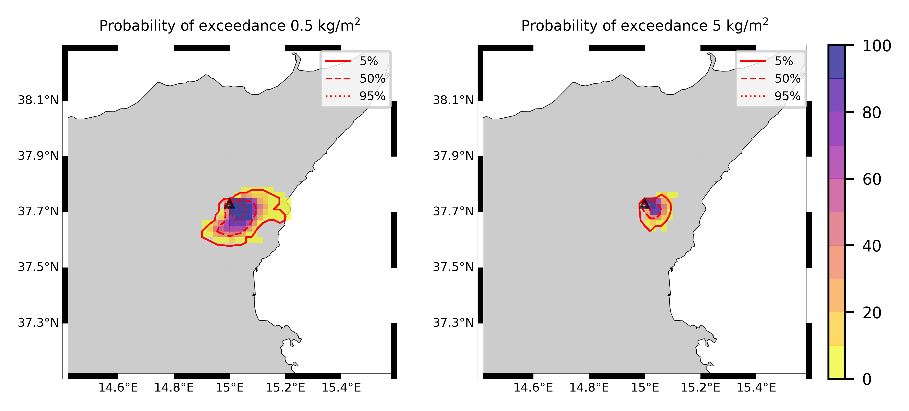
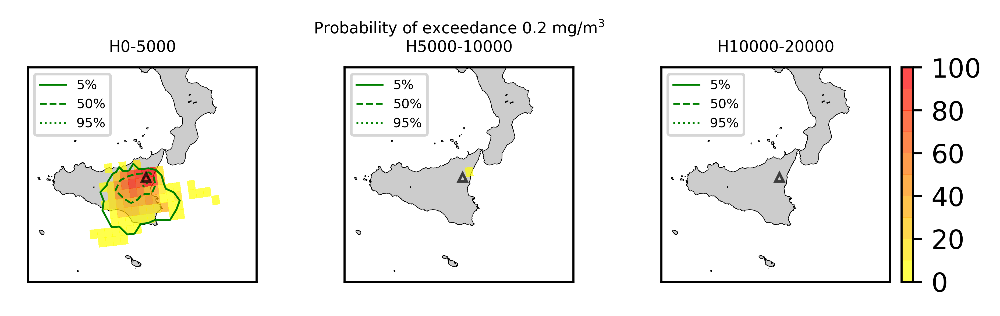
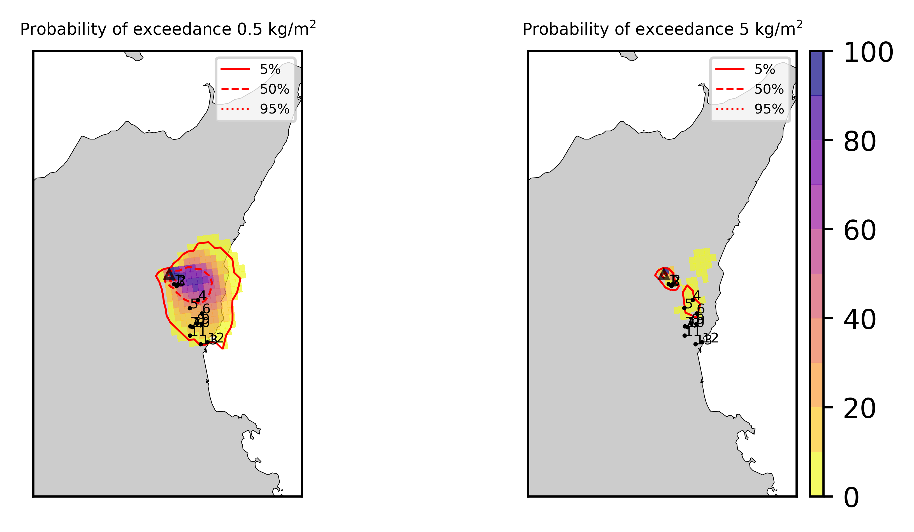
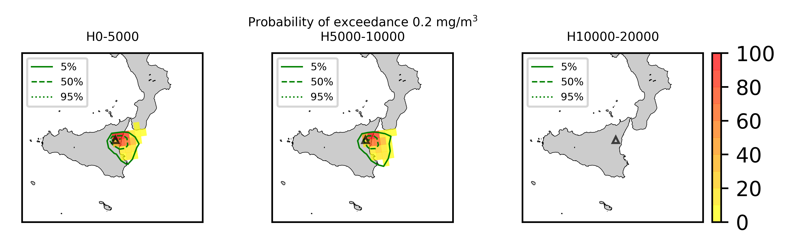
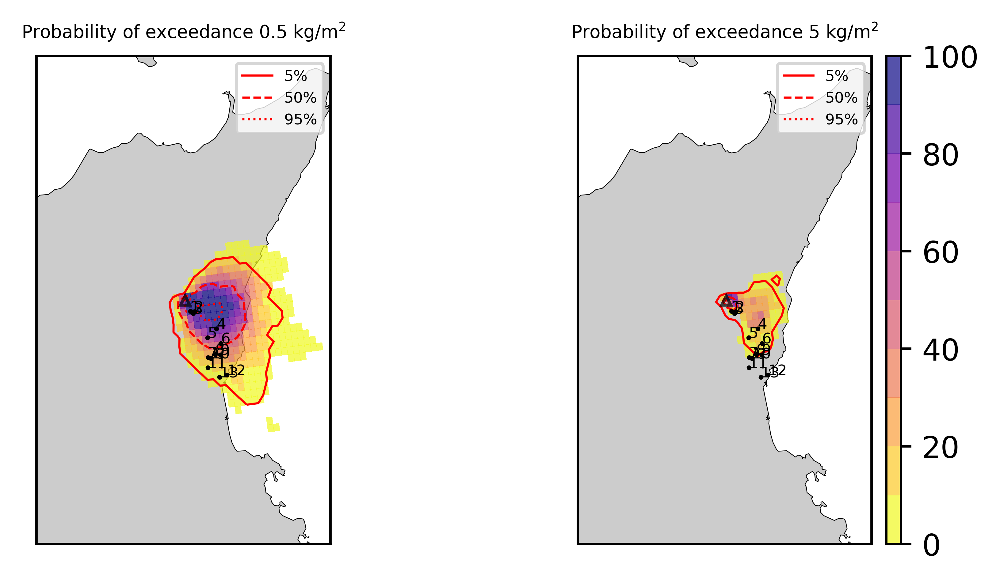
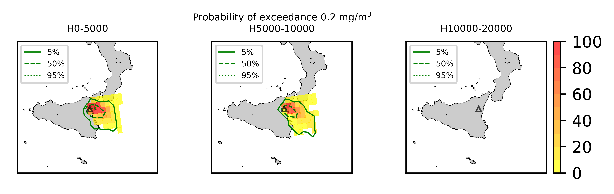

Forecast from VONA_20210228_0811Z
=================================

Contents
========

* [Forecast products](#forecast-products)
	* [Forecast at 2021-02-28 09:10 Z from RED VONA issued at 20210228_0811Z](#forecast-at-2021-02-28-0910-z-from-red-vona-issued-at-20210228_0811z)
	* [Forecast at 2021-02-28 10:10 Z from RED VONA issued at 20210228_0811Z](#forecast-at-2021-02-28-1010-z-from-red-vona-issued-at-20210228_0811z)
	* [Forecast at 2021-02-28 11:10 Z from RED VONA issued at 20210228_0811Z](#forecast-at-2021-02-28-1110-z-from-red-vona-issued-at-20210228_0811z)
	* [Forecast at 2021-02-28 14:10 Z from RED VONA issued at 20210228_0811Z](#forecast-at-2021-02-28-1410-z-from-red-vona-issued-at-20210228_0811z)
	* [Forecast at 2021-02-28 17:10 Z from RED VONA issued at 20210228_0811Z](#forecast-at-2021-02-28-1710-z-from-red-vona-issued-at-20210228_0811z)
	* [Forecast at 2021-02-28 20:10 Z from RED VONA issued at 20210228_0811Z](#forecast-at-2021-02-28-2010-z-from-red-vona-issued-at-20210228_0811z)
	* [Forecast at 2021-02-28 09:40 Z from RED VONA issued at 20210228_0835Z](#forecast-at-2021-02-28-0940-z-from-red-vona-issued-at-20210228_0835z)
	* [Forecast at 2021-02-28 10:40 Z from RED VONA issued at 20210228_0835Z](#forecast-at-2021-02-28-1040-z-from-red-vona-issued-at-20210228_0835z)
	* [Forecast at 2021-02-28 11:40 Z from RED VONA issued at 20210228_1047Z](#forecast-at-2021-02-28-1140-z-from-red-vona-issued-at-20210228_1047z)
	* [Forecast at 2021-02-28 12:50 Z from RED VONA issued at 20210228_1047Z](#forecast-at-2021-02-28-1250-z-from-red-vona-issued-at-20210228_1047z)
	* [Forecast at 2021-02-28 16:50 Z from RED VONA issued at 20210228_1047Z](#forecast-at-2021-02-28-1650-z-from-red-vona-issued-at-20210228_1047z)
	* [Forecast at 2021-02-28 19:50 Z from RED VONA issued at 20210228_1047Z](#forecast-at-2021-02-28-1950-z-from-red-vona-issued-at-20210228_1047z)

# Forecast products

## Forecast at 2021-02-28 09:10 Z from RED VONA issued at 20210228_0811Z
  

|Eruption start [Z]|Eruption end [Z]|Forecast time [Z]|Column height asl [m]|
| :--- | :--- | :--- | :--- |
|2021-02-28 08:10:00|Ongoing|2021-02-28 09:10:00|6000 ± 500 - from VONA|
  
  

|Percentile|MER [kg/s¹]|Mass air [kg]|Mass air nested dom. [kg]|Mass grd [kg]|Mass grd nested dom. [kg]|
| :--- | :--- | :--- | :--- | :--- | :--- |
|5th|2.80e+03|3.54e+06|3.54e+06|7.47e+06|7.47e+06|
|50th|1.70e+04|1.97e+07|1.97e+07|3.83e+07|3.83e+07|
|95th|3.59e+04|4.96e+07|4.95e+07|7.77e+07|7.76e+07|
  

### Ground Nested Domain 2021-02-28 09:10 Z
  
  
  
  
  
  
  
  
  
  
  
  
  
  

|Location|Ground load [kg/m²] 5th perc|Ground load [kg/m²] 50th perc|Ground load [kg/m²] 95th perc|
| :--- | :--- | :--- | :--- |
|Schiena Asino (1)|3.77e-03|4.49e-01|1.93e+00|
|Rif.Vescovo (2)|5.64e-04|3.12e-01|2.08e+00|
|Serra Pituzza (3)|3.74e-04|1.49e-01|2.47e+00|
|Monterosso (4)|0.00e+00|0.00e+00|6.89e-04|
|Cim.Pedara (5)|0.00e+00|0.00e+00|1.96e-03|
|Cim.Viagrande (6)|0.00e+00|0.00e+00|0.00e+00|
|Cim.Mascalucia (7)|0.00e+00|0.00e+00|0.00e+00|
|Cim.Tremestieri (8)|0.00e+00|0.00e+00|0.00e+00|
|Cim.S.Giov.La Punta (9)|0.00e+00|0.00e+00|0.00e+00|
|Cim.Gravina (10)|0.00e+00|0.00e+00|0.00e+00|
|ENI S.Giov.Galermo (11)|0.00e+00|0.00e+00|0.00e+00|
|Bio Piazza Europa (12)|0.00e+00|0.00e+00|0.00e+00|
|INGV-OE (13)|0.00e+00|0.00e+00|0.00e+00|
  

### Atmosphere 2021-02-28 09:10 Z
  

## Forecast at 2021-02-28 10:10 Z from RED VONA issued at 20210228_0811Z
  

|Eruption start [Z]|Eruption end [Z]|Forecast time [Z]|Column height asl [m]|
| :--- | :--- | :--- | :--- |
|2021-02-28 08:10:00|Ongoing|2021-02-28 10:10:00|6000 ± 500 - from VONA|
  
  

|Percentile|MER [kg/s¹]|Mass air [kg]|Mass air nested dom. [kg]|Mass grd [kg]|Mass grd nested dom. [kg]|
| :--- | :--- | :--- | :--- | :--- | :--- |
|5th|6.58e+03|1.20e+07|1.20e+07|4.65e+07|4.64e+07|
|50th|1.48e+04|2.47e+07|2.47e+07|9.41e+07|9.40e+07|
|95th|2.86e+04|5.40e+07|5.40e+07|1.68e+08|1.68e+08|
  

### Ground Nested Domain 2021-02-28 10:10 Z
  
  
  
  
  
  
  
  
  
  
  
  
  
  

|Location|Ground load [kg/m²] 5th perc|Ground load [kg/m²] 50th perc|Ground load [kg/m²] 95th perc|
| :--- | :--- | :--- | :--- |
|Schiena Asino (1)|3.84e-01|1.14e+00|3.35e+00|
|Rif.Vescovo (2)|1.72e-01|1.04e+00|3.65e+00|
|Serra Pituzza (3)|8.28e-02|6.51e-01|3.79e+00|
|Monterosso (4)|0.00e+00|0.00e+00|1.33e-02|
|Cim.Pedara (5)|0.00e+00|0.00e+00|5.93e-02|
|Cim.Viagrande (6)|0.00e+00|0.00e+00|3.73e-03|
|Cim.Mascalucia (7)|0.00e+00|0.00e+00|1.76e-03|
|Cim.Tremestieri (8)|0.00e+00|0.00e+00|2.84e-03|
|Cim.S.Giov.La Punta (9)|0.00e+00|0.00e+00|6.65e-04|
|Cim.Gravina (10)|0.00e+00|0.00e+00|1.68e-03|
|ENI S.Giov.Galermo (11)|0.00e+00|0.00e+00|8.91e-05|
|Bio Piazza Europa (12)|0.00e+00|0.00e+00|0.00e+00|
|INGV-OE (13)|0.00e+00|0.00e+00|0.00e+00|
  

### Atmosphere 2021-02-28 10:10 Z
  

## Forecast at 2021-02-28 11:10 Z from RED VONA issued at 20210228_0811Z
  

|Eruption start [Z]|Eruption end [Z]|Forecast time [Z]|Column height asl [m]|
| :--- | :--- | :--- | :--- |
|2021-02-28 08:10:00|Ongoing|2021-02-28 11:10:00|6000 ± 500 - from VONA|
  
  

|Percentile|MER [kg/s¹]|Mass air [kg]|Mass air nested dom. [kg]|Mass grd [kg]|Mass grd nested dom. [kg]|
| :--- | :--- | :--- | :--- | :--- | :--- |
|5th|5.70e+03|1.26e+07|1.26e+07|8.01e+07|8.01e+07|
|50th|1.64e+04|3.28e+07|3.23e+07|1.50e+08|1.50e+08|
|95th|3.46e+04|6.03e+07|6.02e+07|2.06e+08|2.06e+08|
  

### Ground Nested Domain 2021-02-28 11:10 Z
  
  
  
  
  
  
  
  
  
  
  
  
  
  

|Location|Ground load [kg/m²] 5th perc|Ground load [kg/m²] 50th perc|Ground load [kg/m²] 95th perc|
| :--- | :--- | :--- | :--- |
|Schiena Asino (1)|7.30e-01|1.68e+00|6.31e+00|
|Rif.Vescovo (2)|5.41e-01|2.46e+00|6.77e+00|
|Serra Pituzza (3)|2.60e-01|9.17e-01|7.98e+00|
|Monterosso (4)|0.00e+00|1.29e-03|1.60e-01|
|Cim.Pedara (5)|0.00e+00|5.64e-03|2.64e-01|
|Cim.Viagrande (6)|0.00e+00|1.40e-05|3.48e-02|
|Cim.Mascalucia (7)|0.00e+00|2.61e-05|1.23e-01|
|Cim.Tremestieri (8)|0.00e+00|8.91e-05|1.19e-02|
|Cim.S.Giov.La Punta (9)|0.00e+00|5.11e-06|8.82e-03|
|Cim.Gravina (10)|0.00e+00|2.56e-05|4.55e-02|
|ENI S.Giov.Galermo (11)|0.00e+00|0.00e+00|1.21e-02|
|Bio Piazza Europa (12)|0.00e+00|0.00e+00|5.61e-04|
|INGV-OE (13)|0.00e+00|0.00e+00|1.18e-03|
  

### Atmosphere 2021-02-28 11:10 Z
  

## Forecast at 2021-02-28 14:10 Z from RED VONA issued at 20210228_0811Z
  

|Eruption start [Z]|Eruption end [Z]|Forecast time [Z]|Column height asl [m]|
| :--- | :--- | :--- | :--- |
|2021-02-28 08:10:00|Ongoing|2021-02-28 14:10:00|6000 ± 500 - from VONA|
  
  

|Percentile|MER [kg/s¹]|Mass air [kg]|Mass air nested dom. [kg]|Mass grd [kg]|Mass grd nested dom. [kg]|
| :--- | :--- | :--- | :--- | :--- | :--- |
|5th|5.04e+03|1.77e+07|1.76e+07|2.04e+08|2.04e+08|
|50th|1.94e+04|4.39e+07|4.38e+07|4.00e+08|4.00e+08|
|95th|4.71e+04|1.25e+08|1.16e+08|5.49e+08|5.49e+08|
  

### Ground Nested Domain 2021-02-28 14:10 Z
  
  
  
  
  
  
  
  
  
  
  
  
  
  

|Location|Ground load [kg/m²] 5th perc|Ground load [kg/m²] 50th perc|Ground load [kg/m²] 95th perc|
| :--- | :--- | :--- | :--- |
|Schiena Asino (1)|1.25e+00|3.75e+00|1.26e+01|
|Rif.Vescovo (2)|1.28e+00|5.22e+00|1.29e+01|
|Serra Pituzza (3)|9.23e-01|3.72e+00|1.70e+01|
|Monterosso (4)|3.93e-04|2.44e-02|3.80e-01|
|Cim.Pedara (5)|3.60e-03|3.58e-02|4.10e-01|
|Cim.Viagrande (6)|2.81e-06|3.98e-03|2.25e-01|
|Cim.Mascalucia (7)|0.00e+00|3.34e-03|1.34e-01|
|Cim.Tremestieri (8)|2.91e-06|1.14e-03|8.60e-02|
|Cim.S.Giov.La Punta (9)|7.36e-06|3.67e-04|4.33e-02|
|Cim.Gravina (10)|0.00e+00|2.42e-03|5.97e-02|
|ENI S.Giov.Galermo (11)|0.00e+00|1.48e-03|2.13e-02|
|Bio Piazza Europa (12)|0.00e+00|3.66e-06|3.65e-02|
|INGV-OE (13)|0.00e+00|1.10e-05|4.27e-02|
  

### Atmosphere 2021-02-28 14:10 Z
  

## Forecast at 2021-02-28 17:10 Z from RED VONA issued at 20210228_0811Z
  

|Eruption start [Z]|Eruption end [Z]|Forecast time [Z]|Column height asl [m]|
| :--- | :--- | :--- | :--- |
|2021-02-28 08:10:00|Ongoing|2021-02-28 17:10:00|6000 ± 500 - from VONA|
  
  

|Percentile|MER [kg/s¹]|Mass air [kg]|Mass air nested dom. [kg]|Mass grd [kg]|Mass grd nested dom. [kg]|
| :--- | :--- | :--- | :--- | :--- | :--- |
|5th|5.96e+03|2.26e+07|2.26e+07|3.21e+08|3.21e+08|
|50th|1.72e+04|5.34e+07|5.25e+07|6.05e+08|5.96e+08|
|95th|4.22e+04|1.20e+08|1.19e+08|8.86e+08|8.85e+08|
  

### Ground Nested Domain 2021-02-28 17:10 Z
  
  
  
  
  
  
  
  
  
  
  
  
  
  

|Location|Ground load [kg/m²] 5th perc|Ground load [kg/m²] 50th perc|Ground load [kg/m²] 95th perc|
| :--- | :--- | :--- | :--- |
|Schiena Asino (1)|2.57e+00|8.11e+00|1.66e+01|
|Rif.Vescovo (2)|4.01e+00|1.00e+01|1.60e+01|
|Serra Pituzza (3)|2.44e+00|7.47e+00|1.88e+01|
|Monterosso (4)|3.46e-03|8.13e-02|6.78e-01|
|Cim.Pedara (5)|3.57e-02|1.16e-01|1.25e+00|
|Cim.Viagrande (6)|2.99e-04|2.25e-02|3.49e-01|
|Cim.Mascalucia (7)|8.32e-04|1.62e-02|2.33e-01|
|Cim.Tremestieri (8)|1.48e-03|1.64e-02|2.15e-01|
|Cim.S.Giov.La Punta (9)|3.67e-04|1.46e-02|1.21e-01|
|Cim.Gravina (10)|9.08e-04|1.42e-02|2.05e-01|
|ENI S.Giov.Galermo (11)|7.16e-05|1.07e-02|1.77e-01|
|Bio Piazza Europa (12)|2.63e-06|2.23e-03|4.17e-02|
|INGV-OE (13)|1.72e-05|4.57e-03|6.47e-02|
  

### Atmosphere 2021-02-28 17:10 Z
  

## Forecast at 2021-02-28 20:10 Z from RED VONA issued at 20210228_0811Z
  

|Eruption start [Z]|Eruption end [Z]|Forecast time [Z]|Column height asl [m]|
| :--- | :--- | :--- | :--- |
|2021-02-28 08:10:00|Ongoing|2021-02-28 20:10:00|6000 ± 500 - from VONA|
  
  

|Percentile|MER [kg/s¹]|Mass air [kg]|Mass air nested dom. [kg]|Mass grd [kg]|Mass grd nested dom. [kg]|
| :--- | :--- | :--- | :--- | :--- | :--- |
|5th|6.10e+03|2.64e+07|2.05e+07|5.10e+08|5.10e+08|
|50th|1.58e+04|5.90e+07|4.27e+07|7.75e+08|7.74e+08|
|95th|3.07e+04|8.47e+07|6.19e+07|1.01e+09|1.01e+09|
  

### Ground Nested Domain 2021-02-28 20:10 Z
  
  
  
  
  
  
  
  
  
  
  
  
  
  

|Location|Ground load [kg/m²] 5th perc|Ground load [kg/m²] 50th perc|Ground load [kg/m²] 95th perc|
| :--- | :--- | :--- | :--- |
|Schiena Asino (1)|4.89e+00|1.11e+01|2.09e+01|
|Rif.Vescovo (2)|7.17e+00|1.32e+01|2.08e+01|
|Serra Pituzza (3)|4.10e+00|1.17e+01|2.14e+01|
|Monterosso (4)|3.61e-03|1.06e-01|7.01e-01|
|Cim.Pedara (5)|3.72e-02|1.51e-01|1.29e+00|
|Cim.Viagrande (6)|9.13e-04|3.41e-02|3.59e-01|
|Cim.Mascalucia (7)|1.05e-03|2.58e-02|3.16e-01|
|Cim.Tremestieri (8)|1.48e-03|3.30e-02|2.52e-01|
|Cim.S.Giov.La Punta (9)|3.67e-04|2.09e-02|1.33e-01|
|Cim.Gravina (10)|1.03e-03|2.19e-02|2.79e-01|
|ENI S.Giov.Galermo (11)|1.32e-04|1.94e-02|2.68e-01|
|Bio Piazza Europa (12)|2.63e-06|4.94e-03|4.66e-02|
|INGV-OE (13)|1.72e-05|7.48e-03|8.18e-02|
  

### Atmosphere 2021-02-28 20:10 Z
  

## Forecast at 2021-02-28 09:40 Z from RED VONA issued at 20210228_0835Z
  

|Eruption start [Z]|Eruption end [Z]|Forecast time [Z]|Column height asl [m]|
| :--- | :--- | :--- | :--- |
|2021-02-28 08:10:00|Ongoing|2021-02-28 09:40:00|9000 ± 500 - from VONA|
  
  

|Percentile|MER [kg/s¹]|Mass air [kg]|Mass air nested dom. [kg]|Mass grd [kg]|Mass grd nested dom. [kg]|
| :--- | :--- | :--- | :--- | :--- | :--- |
|5th|3.37e+04|7.30e+07|7.29e+07|1.03e+08|1.03e+08|
|50th|2.23e+05|2.44e+08|2.44e+08|5.11e+08|5.10e+08|
|95th|5.26e+05|8.61e+08|8.60e+08|1.03e+09|1.03e+09|
  

### Ground Nested Domain 2021-02-28 09:40 Z
  
  
  
  
  
  
  
  
  
  
  
  
  
  

|Location|Ground load [kg/m²] 5th perc|Ground load [kg/m²] 50th perc|Ground load [kg/m²] 95th perc|
| :--- | :--- | :--- | :--- |
|Schiena Asino (1)|3.58e-01|1.88e+00|8.60e+00|
|Rif.Vescovo (2)|3.75e-01|1.82e+00|5.96e+00|
|Serra Pituzza (3)|1.99e-01|1.42e+00|7.55e+00|
|Monterosso (4)|3.40e-04|5.25e-01|4.19e+00|
|Cim.Pedara (5)|1.36e-05|1.39e-01|4.00e+00|
|Cim.Viagrande (6)|0.00e+00|4.67e-02|5.50e+00|
|Cim.Mascalucia (7)|0.00e+00|5.24e-04|1.93e+00|
|Cim.Tremestieri (8)|0.00e+00|4.95e-03|3.58e+00|
|Cim.S.Giov.La Punta (9)|0.00e+00|5.44e-03|3.07e+00|
|Cim.Gravina (10)|0.00e+00|5.21e-04|2.18e+00|
|ENI S.Giov.Galermo (11)|0.00e+00|5.00e-09|5.90e-01|
|Bio Piazza Europa (12)|0.00e+00|0.00e+00|5.82e-01|
|INGV-OE (13)|0.00e+00|0.00e+00|3.50e-01|
  

### Atmosphere 2021-02-28 09:40 Z
  

## Forecast at 2021-02-28 10:40 Z from RED VONA issued at 20210228_0835Z
  

|Eruption start [Z]|Eruption end [Z]|Forecast time [Z]|Column height asl [m]|
| :--- | :--- | :--- | :--- |
|2021-02-28 08:10:00|Ongoing|2021-02-28 10:40:00|9000 ± 500 - from VONA|
  
  

|Percentile|MER [kg/s¹]|Mass air [kg]|Mass air nested dom. [kg]|Mass grd [kg]|Mass grd nested dom. [kg]|
| :--- | :--- | :--- | :--- | :--- | :--- |
|5th|5.92e+04|1.90e+08|1.81e+08|6.09e+08|6.09e+08|
|50th|1.86e+05|5.09e+08|4.64e+08|1.17e+09|1.17e+09|
|95th|6.65e+05|1.63e+09|1.41e+09|2.72e+09|2.71e+09|
  

### Ground Nested Domain 2021-02-28 10:40 Z
  
  
  
  
  
  
  
  
  
  
  
  
  
  

|Location|Ground load [kg/m²] 5th perc|Ground load [kg/m²] 50th perc|Ground load [kg/m²] 95th perc|
| :--- | :--- | :--- | :--- |
|Schiena Asino (1)|1.56e+00|4.41e+00|1.29e+01|
|Rif.Vescovo (2)|1.47e+00|4.11e+00|8.78e+00|
|Serra Pituzza (3)|7.34e-01|3.86e+00|8.81e+00|
|Monterosso (4)|2.17e-01|2.18e+00|6.92e+00|
|Cim.Pedara (5)|2.15e-02|1.66e+00|6.10e+00|
|Cim.Viagrande (6)|6.37e-03|8.64e-01|7.25e+00|
|Cim.Mascalucia (7)|5.90e-04|3.43e-02|2.35e+00|
|Cim.Tremestieri (8)|2.82e-04|1.08e-01|4.31e+00|
|Cim.S.Giov.La Punta (9)|6.31e-05|9.34e-02|4.55e+00|
|Cim.Gravina (10)|4.18e-04|3.52e-02|2.65e+00|
|ENI S.Giov.Galermo (11)|0.00e+00|5.18e-03|9.65e-01|
|Bio Piazza Europa (12)|0.00e+00|8.57e-04|1.21e+00|
|INGV-OE (13)|0.00e+00|3.78e-04|7.75e-01|
  

### Atmosphere 2021-02-28 10:40 Z
  

## Forecast at 2021-02-28 11:40 Z from RED VONA issued at 20210228_1047Z
  

|Eruption start [Z]|Eruption end [Z]|Forecast time [Z]|Column height asl [m]|
| :--- | :--- | :--- | :--- |
|2021-02-28 08:10:00|Ongoing|2021-02-28 11:40:00|9000 ± 500 - from VONA|
  
  

|Percentile|MER [kg/s¹]|Mass air [kg]|Mass air nested dom. [kg]|Mass grd [kg]|Mass grd nested dom. [kg]|
| :--- | :--- | :--- | :--- | :--- | :--- |
|5th|4.50e+04|1.90e+08|1.39e+08|6.09e+08|1.02e+09|
|50th|1.91e+05|5.09e+08|4.09e+08|1.17e+09|1.98e+09|
|95th|5.95e+05|1.63e+09|1.46e+09|2.72e+09|4.58e+09|
  

### Ground Nested Domain 2021-02-28 11:40 Z
  
  
  
  
  
  
  
  
  
  
  
  
  

|Location|Ground load [kg/m²] 5th perc|Ground load [kg/m²] 50th perc|Ground load [kg/m²] 95th perc|
| :--- | :--- | :--- | :--- |
|Schiena Asino (1)|2.66e+00|8.85e+00|1.49e+01|
|Rif.Vescovo (2)|2.85e+00|6.69e+00|1.40e+01|
|Serra Pituzza (3)|2.53e+00|6.17e+00|1.30e+01|
|Monterosso (4)|6.34e-01|3.78e+00|9.96e+00|
|Cim.Pedara (5)|1.09e-01|3.31e+00|7.55e+00|
|Cim.Viagrande (6)|8.08e-02|2.86e+00|7.30e+00|
|Cim.Mascalucia (7)|6.62e-04|3.87e-01|2.48e+00|
|Cim.Tremestieri (8)|5.73e-03|8.96e-01|4.35e+00|
|Cim.S.Giov.La Punta (9)|6.25e-03|1.15e+00|4.61e+00|
|Cim.Gravina (10)|8.11e-04|4.21e-01|2.69e+00|
|ENI S.Giov.Galermo (11)|2.00e-08|8.45e-02|1.03e+00|
|Bio Piazza Europa (12)|0.00e+00|1.05e-01|1.30e+00|
|INGV-OE (13)|0.00e+00|4.17e-02|8.95e-01|
  

### Atmosphere 2021-02-28 11:40 Z

## Forecast at 2021-02-28 12:50 Z from RED VONA issued at 20210228_1047Z
  

|Eruption start [Z]|Eruption end [Z]|Forecast time [Z]|Column height asl [m]|
| :--- | :--- | :--- | :--- |
|2021-02-28 08:10:00|Ongoing|2021-02-28 13:50:00|4500 ± 500 - from VONA|
  
  

|Percentile|MER [kg/s¹]|Mass air [kg]|Mass air nested dom. [kg]|Mass grd [kg]|Mass grd nested dom. [kg]|
| :--- | :--- | :--- | :--- | :--- | :--- |
|5th|4.50e+04|1.90e+08|1.39e+08|6.09e+08|1.02e+09|
|50th|1.91e+05|5.09e+08|4.09e+08|1.17e+09|1.98e+09|
|95th|5.95e+05|1.63e+09|1.46e+09|2.72e+09|4.58e+09|
  

### Ground Nested Domain 2021-02-28 12:50 Z
  
  
  
  
  
  
  
  
  
  
  
  
  

|Location|Ground load [kg/m²] 5th perc|Ground load [kg/m²] 50th perc|Ground load [kg/m²] 95th perc|
| :--- | :--- | :--- | :--- |
|Schiena Asino (1)|2.66e+00|8.85e+00|1.49e+01|
|Rif.Vescovo (2)|2.85e+00|6.69e+00|1.40e+01|
|Serra Pituzza (3)|2.53e+00|6.17e+00|1.30e+01|
|Monterosso (4)|6.34e-01|3.78e+00|9.96e+00|
|Cim.Pedara (5)|1.09e-01|3.31e+00|7.55e+00|
|Cim.Viagrande (6)|8.08e-02|2.86e+00|7.30e+00|
|Cim.Mascalucia (7)|6.62e-04|3.87e-01|2.48e+00|
|Cim.Tremestieri (8)|5.73e-03|8.96e-01|4.35e+00|
|Cim.S.Giov.La Punta (9)|6.25e-03|1.15e+00|4.61e+00|
|Cim.Gravina (10)|8.11e-04|4.21e-01|2.69e+00|
|ENI S.Giov.Galermo (11)|2.00e-08|8.45e-02|1.03e+00|
|Bio Piazza Europa (12)|0.00e+00|1.05e-01|1.30e+00|
|INGV-OE (13)|0.00e+00|4.17e-02|8.95e-01|
  

### Atmosphere 2021-02-28 12:50 Z

## Forecast at 2021-02-28 16:50 Z from RED VONA issued at 20210228_1047Z
  

|Eruption start [Z]|Eruption end [Z]|Forecast time [Z]|Column height asl [m]|
| :--- | :--- | :--- | :--- |
|2021-02-28 08:10:00|Ongoing|2021-02-28 19:50:00|4500 ± 500 - from VONA|
  
  

|Percentile|MER [kg/s¹]|Mass air [kg]|Mass air nested dom. [kg]|Mass grd [kg]|Mass grd nested dom. [kg]|
| :--- | :--- | :--- | :--- | :--- | :--- |
|5th|4.50e+04|1.90e+08|1.39e+08|6.09e+08|1.02e+09|
|50th|1.91e+05|5.09e+08|4.09e+08|1.17e+09|1.98e+09|
|95th|5.95e+05|1.63e+09|1.46e+09|2.72e+09|4.58e+09|
  

### Ground Nested Domain 2021-02-28 16:50 Z
  
  
  
  
  
  
  
  
  
  
  
  
  

|Location|Ground load [kg/m²] 5th perc|Ground load [kg/m²] 50th perc|Ground load [kg/m²] 95th perc|
| :--- | :--- | :--- | :--- |
|Schiena Asino (1)|2.66e+00|8.85e+00|1.49e+01|
|Rif.Vescovo (2)|2.85e+00|6.69e+00|1.40e+01|
|Serra Pituzza (3)|2.53e+00|6.17e+00|1.30e+01|
|Monterosso (4)|6.34e-01|3.78e+00|9.96e+00|
|Cim.Pedara (5)|1.09e-01|3.31e+00|7.55e+00|
|Cim.Viagrande (6)|8.08e-02|2.86e+00|7.30e+00|
|Cim.Mascalucia (7)|6.62e-04|3.87e-01|2.48e+00|
|Cim.Tremestieri (8)|5.73e-03|8.96e-01|4.35e+00|
|Cim.S.Giov.La Punta (9)|6.25e-03|1.15e+00|4.61e+00|
|Cim.Gravina (10)|8.11e-04|4.21e-01|2.69e+00|
|ENI S.Giov.Galermo (11)|2.00e-08|8.45e-02|1.03e+00|
|Bio Piazza Europa (12)|0.00e+00|1.05e-01|1.30e+00|
|INGV-OE (13)|0.00e+00|4.17e-02|8.95e-01|
  

### Atmosphere 2021-02-28 16:50 Z

## Forecast at 2021-02-28 19:50 Z from RED VONA issued at 20210228_1047Z
  

|Eruption start [Z]|Eruption end [Z]|Forecast time [Z]|Column height asl [m]|
| :--- | :--- | :--- | :--- |
|2021-02-28 08:10:00|Ongoing|2021-02-28 22:50:00|4500 ± 500 - from VONA|
  
  

|Percentile|MER [kg/s¹]|Mass air [kg]|Mass air nested dom. [kg]|Mass grd [kg]|Mass grd nested dom. [kg]|
| :--- | :--- | :--- | :--- | :--- | :--- |
|5th|4.50e+04|1.90e+08|1.39e+08|6.09e+08|1.02e+09|
|50th|1.91e+05|5.09e+08|4.09e+08|1.17e+09|1.98e+09|
|95th|5.95e+05|1.63e+09|1.46e+09|2.72e+09|4.58e+09|
  

### Ground Nested Domain 2021-02-28 19:50 Z
  
  
  
  
  
  
  
  
  
  
  
  
  

|Location|Ground load [kg/m²] 5th perc|Ground load [kg/m²] 50th perc|Ground load [kg/m²] 95th perc|
| :--- | :--- | :--- | :--- |
|Schiena Asino (1)|2.66e+00|8.85e+00|1.49e+01|
|Rif.Vescovo (2)|2.85e+00|6.69e+00|1.40e+01|
|Serra Pituzza (3)|2.53e+00|6.17e+00|1.30e+01|
|Monterosso (4)|6.34e-01|3.78e+00|9.96e+00|
|Cim.Pedara (5)|1.09e-01|3.31e+00|7.55e+00|
|Cim.Viagrande (6)|8.08e-02|2.86e+00|7.30e+00|
|Cim.Mascalucia (7)|6.62e-04|3.87e-01|2.48e+00|
|Cim.Tremestieri (8)|5.73e-03|8.96e-01|4.35e+00|
|Cim.S.Giov.La Punta (9)|6.25e-03|1.15e+00|4.61e+00|
|Cim.Gravina (10)|8.11e-04|4.21e-01|2.69e+00|
|ENI S.Giov.Galermo (11)|2.00e-08|8.45e-02|1.03e+00|
|Bio Piazza Europa (12)|0.00e+00|1.05e-01|1.30e+00|
|INGV-OE (13)|0.00e+00|4.17e-02|8.95e-01|
  

### Atmosphere 2021-02-28 19:50 Z
  
Go to [Supplementary page](Supplementary_page.md)  
Go to [Main directory](https://github.com/federicapardini/Real_time_ash_forecast)