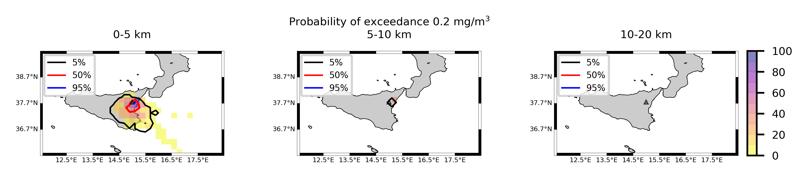
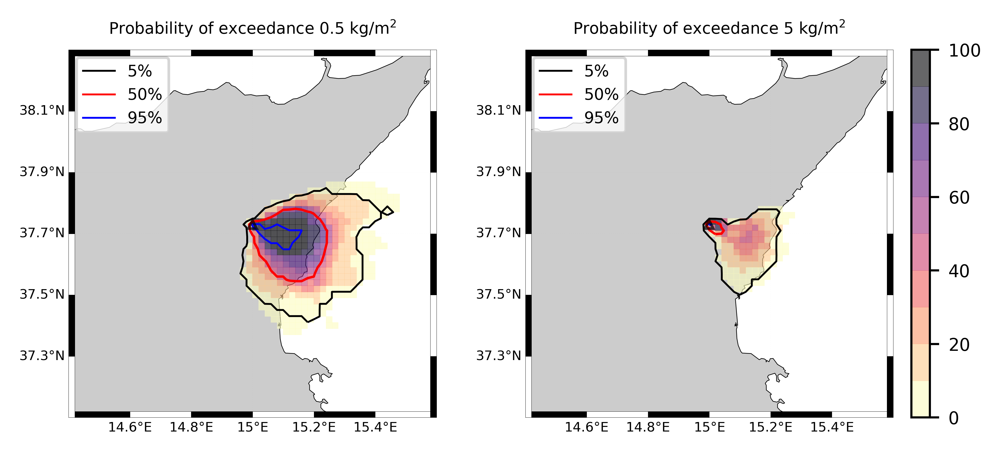
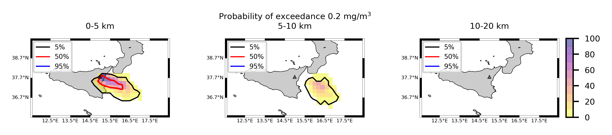
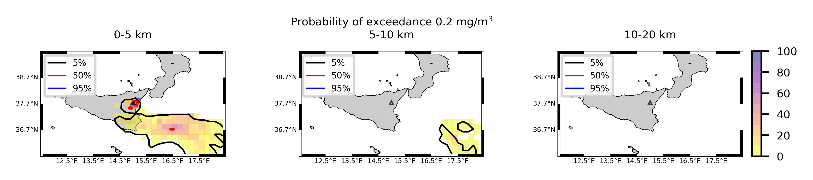

Forecast from VONA_20210228_0811Z
=================================

Contents
========

* [Forecast products](#forecast-products)
	* [Forecast at 2021-02-28 09:10 Z from RED VONA issued at 20210228_0811Z](#forecast-at-2021-02-28-0910-z-from-red-vona-issued-at-20210228_0811z)
	* [Forecast at 2021-02-28 10:10 Z from RED VONA issued at 20210228_0811Z](#forecast-at-2021-02-28-1010-z-from-red-vona-issued-at-20210228_0811z)
	* [Forecast at 2021-02-28 11:10 Z from RED VONA issued at 20210228_0811Z](#forecast-at-2021-02-28-1110-z-from-red-vona-issued-at-20210228_0811z)
	* [Forecast at 2021-02-28 14:10 Z from RED VONA issued at 20210228_0811Z](#forecast-at-2021-02-28-1410-z-from-red-vona-issued-at-20210228_0811z)
	* [Forecast at 2021-02-28 17:10 Z from RED VONA issued at 20210228_0811Z](#forecast-at-2021-02-28-1710-z-from-red-vona-issued-at-20210228_0811z)
	* [Forecast at 2021-02-28 09:40 Z from RED VONA issued at 20210228_0835Z](#forecast-at-2021-02-28-0940-z-from-red-vona-issued-at-20210228_0835z)
	* [Forecast at 2021-02-28 10:40 Z from RED VONA issued at 20210228_0835Z](#forecast-at-2021-02-28-1040-z-from-red-vona-issued-at-20210228_0835z)
	* [Forecast at 2021-02-28 11:40 Z from RED VONA issued at 20210228_0835Z](#forecast-at-2021-02-28-1140-z-from-red-vona-issued-at-20210228_0835z)
	* [Forecast at 2021-02-28 14:40 Z from RED VONA issued at 20210228_0835Z](#forecast-at-2021-02-28-1440-z-from-red-vona-issued-at-20210228_0835z)
	* [Forecast at 2021-02-28 17:40 Z from RED VONA issued at 20210228_0835Z](#forecast-at-2021-02-28-1740-z-from-red-vona-issued-at-20210228_0835z)
	* [Forecast at 2021-02-28 20:40 Z from RED VONA issued at 20210228_0835Z](#forecast-at-2021-02-28-2040-z-from-red-vona-issued-at-20210228_0835z)
	* [Forecast at 2021-02-28 11:50 Z from RED VONA issued at 20210228_1047Z](#forecast-at-2021-02-28-1150-z-from-red-vona-issued-at-20210228_1047z)
	* [Forecast at 2021-02-28 12:50 Z from RED VONA issued at 20210228_1047Z](#forecast-at-2021-02-28-1250-z-from-red-vona-issued-at-20210228_1047z)
	* [Forecast at 2021-02-28 13:50 Z from RED VONA issued at 20210228_1047Z](#forecast-at-2021-02-28-1350-z-from-red-vona-issued-at-20210228_1047z)
	* [Forecast at 2021-02-28 16:50 Z from RED VONA issued at 20210228_1047Z](#forecast-at-2021-02-28-1650-z-from-red-vona-issued-at-20210228_1047z)
	* [Forecast at 2021-02-28 19:50 Z from RED VONA issued at 20210228_1047Z](#forecast-at-2021-02-28-1950-z-from-red-vona-issued-at-20210228_1047z)
	* [Forecast at 2021-02-28 22:50 Z from RED VONA issued at 20210228_1047Z](#forecast-at-2021-02-28-2250-z-from-red-vona-issued-at-20210228_1047z)
	* [Forecast at 2021-02-28 16:50 Z from ORANGE VONA issued at 20210228_1426Z](#forecast-at-2021-02-28-1650-z-from-orange-vona-issued-at-20210228_1426z)
	* [Forecast at 2021-02-28 19:50 Z from ORANGE VONA issued at 20210228_1426Z](#forecast-at-2021-02-28-1950-z-from-orange-vona-issued-at-20210228_1426z)

# Forecast products

## Forecast at 2021-02-28 09:10 Z from RED VONA issued at 20210228_0811Z
  

|Eruption start [Z]|Eruption end [Z]|Forecast time [Z]|Column height asl [m]|
| :--- | :--- | :--- | :--- |
|2021-02-28 08:10:00|Ongoing|2021-02-28 09:10:00|6000 ± 500 - from VONA|
  
  

|Percentile|MER [kg/s¹]|Mass air [kg]|Mass air nested dom. [kg]|Mass grd [kg]|Mass grd nested dom. [kg]|
| :--- | :--- | :--- | :--- | :--- | :--- |
|5th|3.17e+03|7.27e+06|7.27e+06|7.15e+06|7.14e+06|
|50th|1.64e+04|2.05e+07|2.04e+07|3.49e+07|3.49e+07|
|95th|3.57e+04|6.82e+07|6.82e+07|8.75e+07|8.75e+07|
  

### Ground Nested Domain 2021-02-28 09:10 Z
  
  
  
  
  
  
  
  
  
  
  
  
  
  
  
  
  
  
  
  
  
  
  
  
  
  

|Location|Ground load [kg/m²] 5th perc|Ground load [kg/m²] 50th perc|Ground load [kg/m²] 95th perc|
| :--- | :--- | :--- | :--- |
|Catania AP (1)|0.00e+00|0.00e+00|0.00e+00|
|Siracusa (2)|nan|nan|nan|
|Reggio Calabria (3)|nan|nan|nan|
|Palermo (4)|nan|nan|nan|
|Nicolosi (5)|0.00e+00|0.00e+00|6.04e-02|
|Zafferana (6)|0.00e+00|0.00e+00|3.76e-03|
|Linguaglossa (7)|0.00e+00|0.00e+00|0.00e+00|
|Randazzo (8)|0.00e+00|0.00e+00|0.00e+00|
|Bronte (9)|0.00e+00|0.00e+00|0.00e+00|
|Biancavilla (10)|0.00e+00|0.00e+00|0.00e+00|
|Sarro (11)|0.00e+00|0.00e+00|2.02e-03|
|Airone (12)|0.00e+00|1.45e-05|2.45e-02|
|Zafferana Ingresso (13)|0.00e+00|0.00e+00|3.43e-03|
|Zafferana Rotonda (14)|0.00e+00|0.00e+00|3.19e-03|
|Petrulli (15)|0.00e+00|0.00e+00|1.18e-03|
|Milo (16)|0.00e+00|0.00e+00|1.12e-03|
|Fornazzo (17)|0.00e+00|0.00e+00|2.88e-03|
|Rinuccio (18)|0.00e+00|0.00e+00|4.63e-03|
|S. Alfio (19)|0.00e+00|0.00e+00|0.00e+00|
|Macchia (20)|0.00e+00|0.00e+00|0.00e+00|
|S. Venerina (21)|0.00e+00|0.00e+00|0.00e+00|
|Linera (22)|0.00e+00|0.00e+00|0.00e+00|
|Dagala chiesa S. Maria (23)|0.00e+00|0.00e+00|0.00e+00|
|Giarre Piazza Maccheroni (24)|0.00e+00|0.00e+00|0.00e+00|
|Milo parco (25)|0.00e+00|0.00e+00|5.95e-04|
  

### Atmosphere 2021-02-28 09:10 Z
  

## Forecast at 2021-02-28 10:10 Z from RED VONA issued at 20210228_0811Z
  

|Eruption start [Z]|Eruption end [Z]|Forecast time [Z]|Column height asl [m]|
| :--- | :--- | :--- | :--- |
|2021-02-28 08:10:00|Ongoing|2021-02-28 10:10:00|6000 ± 500 - from VONA|
  
  

|Percentile|MER [kg/s¹]|Mass air [kg]|Mass air nested dom. [kg]|Mass grd [kg]|Mass grd nested dom. [kg]|
| :--- | :--- | :--- | :--- | :--- | :--- |
|5th|5.14e+03|2.17e+07|2.17e+07|4.66e+07|4.66e+07|
|50th|1.55e+04|3.44e+07|3.44e+07|8.29e+07|8.29e+07|
|95th|2.72e+04|6.84e+07|6.70e+07|1.41e+08|1.41e+08|
  

### Ground Nested Domain 2021-02-28 10:10 Z
  
  
  
  
  
  
  
  
  
  
  
  
  
  
  
  
  
  
  
  
  
  
  
  
  
  

|Location|Ground load [kg/m²] 5th perc|Ground load [kg/m²] 50th perc|Ground load [kg/m²] 95th perc|
| :--- | :--- | :--- | :--- |
|Catania AP (1)|0.00e+00|0.00e+00|0.00e+00|
|Siracusa (2)|nan|nan|nan|
|Reggio Calabria (3)|nan|nan|nan|
|Palermo (4)|nan|nan|nan|
|Nicolosi (5)|0.00e+00|3.52e-04|1.32e-01|
|Zafferana (6)|0.00e+00|2.83e-04|3.30e-02|
|Linguaglossa (7)|0.00e+00|0.00e+00|0.00e+00|
|Randazzo (8)|0.00e+00|0.00e+00|0.00e+00|
|Bronte (9)|0.00e+00|0.00e+00|0.00e+00|
|Biancavilla (10)|0.00e+00|0.00e+00|1.41e-02|
|Sarro (11)|0.00e+00|1.87e-04|1.97e-02|
|Airone (12)|4.92e-06|6.93e-04|5.39e-02|
|Zafferana Ingresso (13)|0.00e+00|3.86e-04|3.42e-02|
|Zafferana Rotonda (14)|0.00e+00|1.26e-03|3.84e-02|
|Petrulli (15)|0.00e+00|1.62e-03|5.58e-02|
|Milo (16)|0.00e+00|9.19e-04|9.20e-02|
|Fornazzo (17)|0.00e+00|8.50e-04|3.08e-01|
|Rinuccio (18)|0.00e+00|1.31e-03|6.25e-01|
|S. Alfio (19)|0.00e+00|0.00e+00|5.62e-02|
|Macchia (20)|0.00e+00|0.00e+00|9.46e-03|
|S. Venerina (21)|0.00e+00|4.79e-06|1.92e-02|
|Linera (22)|0.00e+00|0.00e+00|1.83e-03|
|Dagala chiesa S. Maria (23)|0.00e+00|8.94e-06|4.18e-02|
|Giarre Piazza Maccheroni (24)|0.00e+00|0.00e+00|3.05e-03|
|Milo parco (25)|0.00e+00|7.72e-04|7.79e-02|
  

### Atmosphere 2021-02-28 10:10 Z
  

## Forecast at 2021-02-28 11:10 Z from RED VONA issued at 20210228_0811Z
  

|Eruption start [Z]|Eruption end [Z]|Forecast time [Z]|Column height asl [m]|
| :--- | :--- | :--- | :--- |
|2021-02-28 08:10:00|Ongoing|2021-02-28 11:10:00|6000 ± 500 - from VONA|
  
  

|Percentile|MER [kg/s¹]|Mass air [kg]|Mass air nested dom. [kg]|Mass grd [kg]|Mass grd nested dom. [kg]|
| :--- | :--- | :--- | :--- | :--- | :--- |
|5th|5.93e+03|1.03e+07|1.03e+07|9.08e+07|9.08e+07|
|50th|1.68e+04|4.46e+07|4.46e+07|1.45e+08|1.45e+08|
|95th|3.44e+04|9.66e+07|9.65e+07|2.08e+08|2.07e+08|
  

### Ground Nested Domain 2021-02-28 11:10 Z
  
  
  
  
  
  
  
  
  
  
  
  
  
  
  
  
  
  
  
  
  
  
  
  
  
  

|Location|Ground load [kg/m²] 5th perc|Ground load [kg/m²] 50th perc|Ground load [kg/m²] 95th perc|
| :--- | :--- | :--- | :--- |
|Catania AP (1)|0.00e+00|0.00e+00|2.61e-03|
|Siracusa (2)|nan|nan|nan|
|Reggio Calabria (3)|nan|nan|nan|
|Palermo (4)|nan|nan|nan|
|Nicolosi (5)|0.00e+00|9.53e-03|1.32e-01|
|Zafferana (6)|1.23e-04|1.75e-02|2.62e-01|
|Linguaglossa (7)|0.00e+00|0.00e+00|2.64e-06|
|Randazzo (8)|0.00e+00|0.00e+00|0.00e+00|
|Bronte (9)|0.00e+00|0.00e+00|0.00e+00|
|Biancavilla (10)|0.00e+00|0.00e+00|2.29e-02|
|Sarro (11)|1.95e-04|9.17e-03|4.26e-01|
|Airone (12)|1.04e-03|2.76e-02|3.75e-01|
|Zafferana Ingresso (13)|4.96e-05|1.50e-02|1.97e-01|
|Zafferana Rotonda (14)|1.13e-04|1.35e-02|1.63e-01|
|Petrulli (15)|4.14e-05|1.68e-02|4.90e-01|
|Milo (16)|0.00e+00|3.64e-02|6.23e-01|
|Fornazzo (17)|0.00e+00|4.70e-02|5.09e-01|
|Rinuccio (18)|0.00e+00|4.32e-02|7.30e-01|
|S. Alfio (19)|0.00e+00|9.18e-05|2.21e-01|
|Macchia (20)|0.00e+00|4.17e-05|2.96e-01|
|S. Venerina (21)|0.00e+00|1.36e-04|2.32e-01|
|Linera (22)|0.00e+00|5.77e-04|2.43e-02|
|Dagala chiesa S. Maria (23)|0.00e+00|1.98e-03|5.06e-01|
|Giarre Piazza Maccheroni (24)|0.00e+00|0.00e+00|1.01e-01|
|Milo parco (25)|0.00e+00|2.47e-02|6.01e-01|
  

### Atmosphere 2021-02-28 11:10 Z
  

## Forecast at 2021-02-28 14:10 Z from RED VONA issued at 20210228_0811Z
  

|Eruption start [Z]|Eruption end [Z]|Forecast time [Z]|Column height asl [m]|
| :--- | :--- | :--- | :--- |
|2021-02-28 08:10:00|Ongoing|2021-02-28 14:10:00|6000 ± 500 - from VONA|
  
  

|Percentile|MER [kg/s¹]|Mass air [kg]|Mass air nested dom. [kg]|Mass grd [kg]|Mass grd nested dom. [kg]|
| :--- | :--- | :--- | :--- | :--- | :--- |
|5th|2.79e+03|2.17e+07|2.17e+07|2.42e+08|2.42e+08|
|50th|2.57e+04|8.25e+07|8.21e+07|3.40e+08|3.40e+08|
|95th|4.96e+04|1.98e+08|1.92e+08|5.27e+08|5.26e+08|
  

### Ground Nested Domain 2021-02-28 14:10 Z
  
  
  
  
  
  
  
  
  
  
  
  
  
  
  
  
  
  
  
  
  
  
  
  
  
  

|Location|Ground load [kg/m²] 5th perc|Ground load [kg/m²] 50th perc|Ground load [kg/m²] 95th perc|
| :--- | :--- | :--- | :--- |
|Catania AP (1)|0.00e+00|7.13e-05|1.74e-02|
|Siracusa (2)|nan|nan|nan|
|Reggio Calabria (3)|nan|nan|nan|
|Palermo (4)|nan|nan|nan|
|Nicolosi (5)|5.58e-03|1.04e-01|3.73e-01|
|Zafferana (6)|4.93e-03|1.09e-01|1.54e+00|
|Linguaglossa (7)|0.00e+00|0.00e+00|1.21e-02|
|Randazzo (8)|0.00e+00|0.00e+00|7.62e-04|
|Bronte (9)|0.00e+00|0.00e+00|2.83e-05|
|Biancavilla (10)|0.00e+00|2.88e-03|5.11e-02|
|Sarro (11)|7.14e-03|8.30e-02|2.25e+00|
|Airone (12)|1.01e-02|1.37e-01|1.61e+00|
|Zafferana Ingresso (13)|2.32e-03|1.13e-01|6.84e-01|
|Zafferana Rotonda (14)|1.21e-03|1.12e-01|6.07e-01|
|Petrulli (15)|1.36e-03|1.60e-01|7.13e-01|
|Milo (16)|3.88e-06|1.35e-01|9.14e-01|
|Fornazzo (17)|0.00e+00|1.80e-01|1.00e+00|
|Rinuccio (18)|0.00e+00|2.22e-01|1.28e+00|
|S. Alfio (19)|1.54e-06|4.32e-02|6.18e-01|
|Macchia (20)|2.78e-06|1.42e-02|3.45e-01|
|S. Venerina (21)|1.34e-04|2.65e-02|3.25e-01|
|Linera (22)|1.15e-03|1.21e-02|1.02e-01|
|Dagala chiesa S. Maria (23)|9.43e-05|3.13e-02|7.82e-01|
|Giarre Piazza Maccheroni (24)|0.00e+00|7.01e-03|1.78e-01|
|Milo parco (25)|3.97e-06|1.19e-01|8.94e-01|
  

### Atmosphere 2021-02-28 14:10 Z
  

## Forecast at 2021-02-28 17:10 Z from RED VONA issued at 20210228_0811Z
  

|Eruption start [Z]|Eruption end [Z]|Forecast time [Z]|Column height asl [m]|
| :--- | :--- | :--- | :--- |
|2021-02-28 08:10:00|Ongoing|2021-02-28 17:10:00|6000 ± 500 - from VONA|
  
  

|Percentile|MER [kg/s¹]|Mass air [kg]|Mass air nested dom. [kg]|Mass grd [kg]|Mass grd nested dom. [kg]|
| :--- | :--- | :--- | :--- | :--- | :--- |
|5th|5.16e+03|5.13e+07|5.13e+07|3.78e+08|3.78e+08|
|50th|1.86e+04|9.43e+07|8.57e+07|5.49e+08|5.49e+08|
|95th|4.98e+04|1.69e+08|1.53e+08|7.88e+08|7.88e+08|
  

### Ground Nested Domain 2021-02-28 17:10 Z
  
  
  
  
  
  
  
  
  
  
  
  
  
  
  
  
  
  
  
  
  
  
  
  
  
  

|Location|Ground load [kg/m²] 5th perc|Ground load [kg/m²] 50th perc|Ground load [kg/m²] 95th perc|
| :--- | :--- | :--- | :--- |
|Catania AP (1)|6.17e-05|1.99e-03|1.55e-01|
|Siracusa (2)|nan|nan|nan|
|Reggio Calabria (3)|nan|nan|nan|
|Palermo (4)|nan|nan|nan|
|Nicolosi (5)|6.50e-02|2.95e-01|1.68e+00|
|Zafferana (6)|5.29e-03|2.67e-01|1.89e+00|
|Linguaglossa (7)|0.00e+00|0.00e+00|1.33e-02|
|Randazzo (8)|0.00e+00|0.00e+00|2.87e-03|
|Bronte (9)|0.00e+00|1.95e-04|3.46e-03|
|Biancavilla (10)|2.75e-03|3.73e-02|1.17e-01|
|Sarro (11)|7.49e-03|2.24e-01|2.47e+00|
|Airone (12)|1.65e-02|4.72e-01|2.71e+00|
|Zafferana Ingresso (13)|2.57e-03|2.24e-01|1.79e+00|
|Zafferana Rotonda (14)|1.98e-03|2.25e-01|1.70e+00|
|Petrulli (15)|1.99e-03|2.03e-01|8.88e-01|
|Milo (16)|1.88e-03|1.36e-01|1.30e+00|
|Fornazzo (17)|2.36e-04|2.45e-01|1.26e+00|
|Rinuccio (18)|2.50e-04|3.16e-01|1.47e+00|
|S. Alfio (19)|1.54e-06|4.56e-02|6.18e-01|
|Macchia (20)|2.78e-06|1.98e-02|3.53e-01|
|S. Venerina (21)|1.92e-04|4.48e-02|3.25e-01|
|Linera (22)|1.16e-03|4.11e-02|1.69e-01|
|Dagala chiesa S. Maria (23)|1.11e-04|3.96e-02|8.14e-01|
|Giarre Piazza Maccheroni (24)|0.00e+00|1.13e-02|1.78e-01|
|Milo parco (25)|1.54e-03|1.23e-01|1.22e+00|
  

### Atmosphere 2021-02-28 17:10 Z
  

## Forecast at 2021-02-28 09:40 Z from RED VONA issued at 20210228_0835Z
  

|Eruption start [Z]|Eruption end [Z]|Forecast time [Z]|Column height asl [m]|
| :--- | :--- | :--- | :--- |
|2021-02-28 08:10:00|Ongoing|2021-02-28 09:40:00|9000 ± 500 - from VONA|
  
  

|Percentile|MER [kg/s¹]|Mass air [kg]|Mass air nested dom. [kg]|Mass grd [kg]|Mass grd nested dom. [kg]|
| :--- | :--- | :--- | :--- | :--- | :--- |
|5th|4.06e+04|8.28e+07|8.28e+07|1.42e+08|1.42e+08|
|50th|1.74e+05|3.26e+08|3.25e+08|3.38e+08|3.38e+08|
|95th|8.26e+05|1.80e+09|1.79e+09|1.13e+09|1.13e+09|
  

### Ground Nested Domain 2021-02-28 09:40 Z
  
  
  
  
  
  
  
  
  
  
  
  
  
  
  
  
  
  
  
  
  
  
  
  
  
  

|Location|Ground load [kg/m²] 5th perc|Ground load [kg/m²] 50th perc|Ground load [kg/m²] 95th perc|
| :--- | :--- | :--- | :--- |
|Catania AP (1)|0.00e+00|0.00e+00|7.08e-02|
|Siracusa (2)|nan|nan|nan|
|Reggio Calabria (3)|nan|nan|nan|
|Palermo (4)|nan|nan|nan|
|Nicolosi (5)|0.00e+00|4.16e-02|2.40e+00|
|Zafferana (6)|5.34e-02|1.05e+00|3.92e+00|
|Linguaglossa (7)|0.00e+00|0.00e+00|1.28e-02|
|Randazzo (8)|0.00e+00|0.00e+00|0.00e+00|
|Bronte (9)|0.00e+00|0.00e+00|0.00e+00|
|Biancavilla (10)|0.00e+00|0.00e+00|2.69e-04|
|Sarro (11)|7.29e-02|9.93e-01|4.09e+00|
|Airone (12)|5.87e-02|1.25e+00|4.30e+00|
|Zafferana Ingresso (13)|3.98e-02|8.54e-01|4.05e+00|
|Zafferana Rotonda (14)|4.39e-02|9.36e-01|3.97e+00|
|Petrulli (15)|5.15e-02|7.83e-01|2.95e+00|
|Milo (16)|1.21e-02|6.22e-01|2.36e+00|
|Fornazzo (17)|4.50e-03|3.91e-01|2.35e+00|
|Rinuccio (18)|1.69e-02|4.14e-01|2.07e+00|
|S. Alfio (19)|1.19e-04|2.57e-01|1.71e+00|
|Macchia (20)|3.72e-04|2.83e-01|2.09e+00|
|S. Venerina (21)|5.14e-03|3.99e-01|2.56e+00|
|Linera (22)|6.11e-03|3.15e-01|3.72e+00|
|Dagala chiesa S. Maria (23)|8.79e-03|6.20e-01|2.83e+00|
|Giarre Piazza Maccheroni (24)|1.09e-07|7.87e-02|1.44e+00|
|Milo parco (25)|1.18e-02|6.17e-01|2.31e+00|
  

### Atmosphere 2021-02-28 09:40 Z
  

## Forecast at 2021-02-28 10:40 Z from RED VONA issued at 20210228_0835Z
  

|Eruption start [Z]|Eruption end [Z]|Forecast time [Z]|Column height asl [m]|
| :--- | :--- | :--- | :--- |
|2021-02-28 08:10:00|Ongoing|2021-02-28 10:40:00|9000 ± 500 - from VONA|
  
  

|Percentile|MER [kg/s¹]|Mass air [kg]|Mass air nested dom. [kg]|Mass grd [kg]|Mass grd nested dom. [kg]|
| :--- | :--- | :--- | :--- | :--- | :--- |
|5th|7.83e+04|2.14e+08|2.14e+08|4.63e+08|4.63e+08|
|50th|1.96e+05|6.44e+08|5.55e+08|1.09e+09|1.09e+09|
|95th|5.05e+05|1.34e+09|1.03e+09|2.12e+09|2.12e+09|
  

### Ground Nested Domain 2021-02-28 10:40 Z
  
  
  
  
  
  
  
  
  
  
  
  
  
  
  
  
  
  
  
  
  
  
  
  
  
  

|Location|Ground load [kg/m²] 5th perc|Ground load [kg/m²] 50th perc|Ground load [kg/m²] 95th perc|
| :--- | :--- | :--- | :--- |
|Catania AP (1)|0.00e+00|1.40e-03|5.97e-01|
|Siracusa (2)|nan|nan|nan|
|Reggio Calabria (3)|nan|nan|nan|
|Palermo (4)|nan|nan|nan|
|Nicolosi (5)|4.35e-03|2.66e-01|3.18e+00|
|Zafferana (6)|1.42e+00|2.97e+00|5.36e+00|
|Linguaglossa (7)|0.00e+00|2.98e-04|2.06e-01|
|Randazzo (8)|0.00e+00|0.00e+00|9.67e-05|
|Bronte (9)|0.00e+00|0.00e+00|0.00e+00|
|Biancavilla (10)|0.00e+00|0.00e+00|6.13e-03|
|Sarro (11)|1.29e+00|2.86e+00|5.56e+00|
|Airone (12)|1.53e+00|3.03e+00|5.34e+00|
|Zafferana Ingresso (13)|1.56e+00|2.78e+00|5.12e+00|
|Zafferana Rotonda (14)|1.47e+00|2.77e+00|5.47e+00|
|Petrulli (15)|9.89e-01|2.69e+00|5.97e+00|
|Milo (16)|5.19e-01|1.93e+00|6.18e+00|
|Fornazzo (17)|2.48e-01|1.29e+00|6.19e+00|
|Rinuccio (18)|2.68e-01|1.39e+00|5.31e+00|
|S. Alfio (19)|6.44e-02|6.55e-01|7.52e+00|
|Macchia (20)|5.22e-02|9.22e-01|4.19e+00|
|S. Venerina (21)|6.29e-01|1.75e+00|4.75e+00|
|Linera (22)|3.21e-01|1.22e+00|4.38e+00|
|Dagala chiesa S. Maria (23)|4.76e-01|1.78e+00|5.23e+00|
|Giarre Piazza Maccheroni (24)|6.02e-03|3.96e-01|4.96e+00|
|Milo parco (25)|5.15e-01|1.91e+00|6.19e+00|
  

### Atmosphere 2021-02-28 10:40 Z
  

## Forecast at 2021-02-28 11:40 Z from RED VONA issued at 20210228_0835Z
  

|Eruption start [Z]|Eruption end [Z]|Forecast time [Z]|Column height asl [m]|
| :--- | :--- | :--- | :--- |
|2021-02-28 08:10:00|Ongoing|2021-02-28 11:40:00|9000 ± 500 - from VONA|
  
  

|Percentile|MER [kg/s¹]|Mass air [kg]|Mass air nested dom. [kg]|Mass grd [kg]|Mass grd nested dom. [kg]|
| :--- | :--- | :--- | :--- | :--- | :--- |
|5th|3.72e+04|2.68e+08|2.64e+08|8.39e+08|8.38e+08|
|50th|2.14e+05|8.27e+08|6.71e+08|1.89e+09|1.89e+09|
|95th|5.72e+05|1.70e+09|1.53e+09|3.53e+09|3.51e+09|
  

### Ground Nested Domain 2021-02-28 11:40 Z
  
  
  
  
  
  
  
  
  
  
  
  
  
  
  
  
  
  
  
  
  
  
  
  
  
  

|Location|Ground load [kg/m²] 5th perc|Ground load [kg/m²] 50th perc|Ground load [kg/m²] 95th perc|
| :--- | :--- | :--- | :--- |
|Catania AP (1)|0.00e+00|3.70e-02|8.16e-01|
|Siracusa (2)|nan|nan|nan|
|Reggio Calabria (3)|nan|nan|nan|
|Palermo (4)|nan|nan|nan|
|Nicolosi (5)|2.13e-02|5.60e-01|3.22e+00|
|Zafferana (6)|1.80e+00|5.16e+00|8.98e+00|
|Linguaglossa (7)|0.00e+00|9.05e-03|2.51e-01|
|Randazzo (8)|0.00e+00|0.00e+00|1.91e-03|
|Bronte (9)|0.00e+00|0.00e+00|0.00e+00|
|Biancavilla (10)|0.00e+00|1.03e-03|1.15e-01|
|Sarro (11)|1.64e+00|5.34e+00|9.17e+00|
|Airone (12)|1.95e+00|5.83e+00|8.63e+00|
|Zafferana Ingresso (13)|2.12e+00|4.98e+00|8.45e+00|
|Zafferana Rotonda (14)|2.49e+00|4.53e+00|8.25e+00|
|Petrulli (15)|2.43e+00|3.86e+00|8.00e+00|
|Milo (16)|9.96e-01|3.41e+00|7.21e+00|
|Fornazzo (17)|6.60e-01|3.12e+00|9.02e+00|
|Rinuccio (18)|8.00e-01|3.06e+00|8.40e+00|
|S. Alfio (19)|2.02e-01|1.72e+00|9.88e+00|
|Macchia (20)|5.30e-01|2.34e+00|7.23e+00|
|S. Venerina (21)|1.16e+00|2.91e+00|6.42e+00|
|Linera (22)|1.21e+00|2.99e+00|6.63e+00|
|Dagala chiesa S. Maria (23)|1.13e+00|3.27e+00|6.60e+00|
|Giarre Piazza Maccheroni (24)|2.23e-01|1.27e+00|6.92e+00|
|Milo parco (25)|9.57e-01|3.40e+00|7.38e+00|
  

### Atmosphere 2021-02-28 11:40 Z
  

## Forecast at 2021-02-28 14:40 Z from RED VONA issued at 20210228_0835Z
  

|Eruption start [Z]|Eruption end [Z]|Forecast time [Z]|Column height asl [m]|
| :--- | :--- | :--- | :--- |
|2021-02-28 08:10:00|Ongoing|2021-02-28 14:40:00|9000 ± 500 - from VONA|
  
  

|Percentile|MER [kg/s¹]|Mass air [kg]|Mass air nested dom. [kg]|Mass grd [kg]|Mass grd nested dom. [kg]|
| :--- | :--- | :--- | :--- | :--- | :--- |
|5th|5.16e+04|3.33e+08|2.69e+08|1.90e+09|1.89e+09|
|50th|1.79e+05|7.76e+08|6.49e+08|4.26e+09|4.20e+09|
|95th|7.82e+05|2.87e+09|1.85e+09|7.67e+09|7.07e+09|
  

### Ground Nested Domain 2021-02-28 14:40 Z
  
  
  
  
  
  
  
  
  
  
  
  
  
  
  
  
  
  
  
  
  
  
  
  
  
  

|Location|Ground load [kg/m²] 5th perc|Ground load [kg/m²] 50th perc|Ground load [kg/m²] 95th perc|
| :--- | :--- | :--- | :--- |
|Catania AP (1)|1.55e-03|2.65e-01|1.76e+00|
|Siracusa (2)|nan|nan|nan|
|Reggio Calabria (3)|nan|nan|nan|
|Palermo (4)|nan|nan|nan|
|Nicolosi (5)|2.81e-01|1.26e+00|5.01e+00|
|Zafferana (6)|4.38e+00|1.11e+01|1.87e+01|
|Linguaglossa (7)|0.00e+00|4.79e-02|4.38e-01|
|Randazzo (8)|0.00e+00|7.33e-05|2.98e-03|
|Bronte (9)|0.00e+00|1.67e-06|3.35e-04|
|Biancavilla (10)|2.14e-04|5.89e-02|2.91e-01|
|Sarro (11)|4.45e+00|1.11e+01|1.79e+01|
|Airone (12)|3.87e+00|1.14e+01|1.97e+01|
|Zafferana Ingresso (13)|4.23e+00|1.03e+01|1.95e+01|
|Zafferana Rotonda (14)|4.20e+00|1.02e+01|2.13e+01|
|Petrulli (15)|4.06e+00|7.51e+00|2.16e+01|
|Milo (16)|2.17e+00|6.07e+00|1.89e+01|
|Fornazzo (17)|1.51e+00|5.23e+00|1.71e+01|
|Rinuccio (18)|1.78e+00|5.22e+00|1.72e+01|
|S. Alfio (19)|4.62e-01|3.21e+00|1.47e+01|
|Macchia (20)|6.04e-01|3.71e+00|1.53e+01|
|S. Venerina (21)|2.26e+00|5.30e+00|1.40e+01|
|Linera (22)|1.80e+00|6.47e+00|1.07e+01|
|Dagala chiesa S. Maria (23)|2.05e+00|5.27e+00|1.61e+01|
|Giarre Piazza Maccheroni (24)|2.36e-01|2.31e+00|1.54e+01|
|Milo parco (25)|2.11e+00|6.01e+00|1.87e+01|
  

### Atmosphere 2021-02-28 14:40 Z
  

## Forecast at 2021-02-28 17:40 Z from RED VONA issued at 20210228_0835Z
  

|Eruption start [Z]|Eruption end [Z]|Forecast time [Z]|Column height asl [m]|
| :--- | :--- | :--- | :--- |
|2021-02-28 08:10:00|Ongoing|2021-02-28 17:40:00|9000 ± 500 - from VONA|
  
  

|Percentile|MER [kg/s¹]|Mass air [kg]|Mass air nested dom. [kg]|Mass grd [kg]|Mass grd nested dom. [kg]|
| :--- | :--- | :--- | :--- | :--- | :--- |
|5th|4.35e+04|3.76e+08|2.79e+08|3.10e+09|2.98e+09|
|50th|2.44e+05|1.59e+09|1.01e+09|7.32e+09|7.24e+09|
|95th|7.30e+05|3.81e+09|2.05e+09|1.13e+10|1.08e+10|
  

### Ground Nested Domain 2021-02-28 17:40 Z
  
  
  
  
  
  
  
  
  
  
  
  
  
  
  
  
  
  
  
  
  
  
  
  
  
  

|Location|Ground load [kg/m²] 5th perc|Ground load [kg/m²] 50th perc|Ground load [kg/m²] 95th perc|
| :--- | :--- | :--- | :--- |
|Catania AP (1)|2.10e-02|5.55e-01|2.67e+00|
|Siracusa (2)|nan|nan|nan|
|Reggio Calabria (3)|nan|nan|nan|
|Palermo (4)|nan|nan|nan|
|Nicolosi (5)|3.40e-01|2.24e+00|7.63e+00|
|Zafferana (6)|8.61e+00|1.73e+01|2.58e+01|
|Linguaglossa (7)|8.13e-04|1.34e-01|4.30e+00|
|Randazzo (8)|0.00e+00|7.33e-05|6.27e-03|
|Bronte (9)|0.00e+00|2.07e-03|1.22e-01|
|Biancavilla (10)|4.00e-03|1.36e-01|7.91e-01|
|Sarro (11)|7.15e+00|1.59e+01|2.64e+01|
|Airone (12)|8.90e+00|1.86e+01|2.62e+01|
|Zafferana Ingresso (13)|8.59e+00|1.71e+01|2.67e+01|
|Zafferana Rotonda (14)|8.35e+00|1.50e+01|2.76e+01|
|Petrulli (15)|8.08e+00|1.45e+01|2.86e+01|
|Milo (16)|5.38e+00|1.23e+01|2.57e+01|
|Fornazzo (17)|4.01e+00|1.08e+01|2.44e+01|
|Rinuccio (18)|4.21e+00|9.85e+00|2.37e+01|
|S. Alfio (19)|2.30e+00|1.03e+01|2.61e+01|
|Macchia (20)|2.56e+00|7.63e+00|2.33e+01|
|S. Venerina (21)|4.93e+00|1.35e+01|3.04e+01|
|Linera (22)|3.18e+00|1.01e+01|2.24e+01|
|Dagala chiesa S. Maria (23)|4.99e+00|1.13e+01|2.89e+01|
|Giarre Piazza Maccheroni (24)|1.13e+00|5.14e+00|1.99e+01|
|Milo parco (25)|5.27e+00|1.23e+01|2.62e+01|
  

### Atmosphere 2021-02-28 17:40 Z
  

## Forecast at 2021-02-28 20:40 Z from RED VONA issued at 20210228_0835Z
  

|Eruption start [Z]|Eruption end [Z]|Forecast time [Z]|Column height asl [m]|
| :--- | :--- | :--- | :--- |
|2021-02-28 08:10:00|Ongoing|2021-02-28 20:40:00|9000 ± 500 - from VONA|
  
  

|Percentile|MER [kg/s¹]|Mass air [kg]|Mass air nested dom. [kg]|Mass grd [kg]|Mass grd nested dom. [kg]|
| :--- | :--- | :--- | :--- | :--- | :--- |
|5th|6.43e+04|8.52e+08|4.72e+08|4.35e+09|4.19e+09|
|50th|2.21e+05|1.40e+09|8.61e+08|1.01e+10|9.56e+09|
|95th|6.84e+05|3.50e+09|1.57e+09|1.69e+10|1.54e+10|
  

### Ground Nested Domain 2021-02-28 20:40 Z
  
  
  
  
  
  
  
  
  
  
  
  
  
  
  
  
  
  
  
  
  
  
  
  
  
  

|Location|Ground load [kg/m²] 5th perc|Ground load [kg/m²] 50th perc|Ground load [kg/m²] 95th perc|
| :--- | :--- | :--- | :--- |
|Catania AP (1)|5.17e-02|9.18e-01|3.38e+00|
|Siracusa (2)|nan|nan|nan|
|Reggio Calabria (3)|nan|nan|nan|
|Palermo (4)|nan|nan|nan|
|Nicolosi (5)|8.79e-01|4.83e+00|3.04e+01|
|Zafferana (6)|1.03e+01|2.46e+01|3.68e+01|
|Linguaglossa (7)|8.13e-04|1.49e-01|4.58e+00|
|Randazzo (8)|0.00e+00|1.13e-04|1.47e-02|
|Bronte (9)|0.00e+00|1.04e-02|2.69e-01|
|Biancavilla (10)|4.02e-03|3.02e-01|1.01e+00|
|Sarro (11)|9.03e+00|2.39e+01|3.71e+01|
|Airone (12)|1.19e+01|2.45e+01|3.64e+01|
|Zafferana Ingresso (13)|1.05e+01|2.23e+01|3.77e+01|
|Zafferana Rotonda (14)|1.11e+01|2.06e+01|3.85e+01|
|Petrulli (15)|9.24e+00|1.91e+01|3.54e+01|
|Milo (16)|6.56e+00|1.66e+01|3.32e+01|
|Fornazzo (17)|5.73e+00|1.45e+01|2.81e+01|
|Rinuccio (18)|5.68e+00|1.37e+01|2.62e+01|
|S. Alfio (19)|2.61e+00|1.06e+01|3.64e+01|
|Macchia (20)|2.65e+00|8.75e+00|3.75e+01|
|S. Venerina (21)|5.51e+00|1.70e+01|3.45e+01|
|Linera (22)|3.93e+00|1.57e+01|2.97e+01|
|Dagala chiesa S. Maria (23)|5.10e+00|1.62e+01|3.17e+01|
|Giarre Piazza Maccheroni (24)|1.16e+00|5.46e+00|3.59e+01|
|Milo parco (25)|6.48e+00|1.64e+01|3.35e+01|
  

### Atmosphere 2021-02-28 20:40 Z
  

## Forecast at 2021-02-28 11:50 Z from RED VONA issued at 20210228_1047Z
  

|Eruption start [Z]|Eruption end [Z]|Forecast time [Z]|Column height asl [m]|
| :--- | :--- | :--- | :--- |
|2021-02-28 08:10:00|Ongoing|2021-02-28 11:50:00|4500 ± 500 - from VONA|
  
  

|Percentile|MER [kg/s¹]|Mass air [kg]|Mass air nested dom. [kg]|Mass grd [kg]|Mass grd nested dom. [kg]|
| :--- | :--- | :--- | :--- | :--- | :--- |
|5th|1.40e+02|9.25e+07|9.21e+07|6.76e+08|6.75e+08|
|50th|1.58e+03|3.74e+08|2.65e+08|1.68e+09|1.66e+09|
|95th|8.98e+03|7.12e+08|4.88e+08|2.88e+09|2.86e+09|
  

### Ground Nested Domain 2021-02-28 11:50 Z
  
  
  
  
  
  
  
  
  
  
  
  
  
  
  
  
  
  
  
  
  
  
  
  
  
  

|Location|Ground load [kg/m²] 5th perc|Ground load [kg/m²] 50th perc|Ground load [kg/m²] 95th perc|
| :--- | :--- | :--- | :--- |
|Catania AP (1)|0.00e+00|2.48e-02|7.12e-01|
|Siracusa (2)|nan|nan|nan|
|Reggio Calabria (3)|nan|nan|nan|
|Palermo (4)|nan|nan|nan|
|Nicolosi (5)|7.09e-03|3.59e-01|3.38e+00|
|Zafferana (6)|1.93e+00|3.83e+00|6.94e+00|
|Linguaglossa (7)|0.00e+00|1.14e-03|2.50e-01|
|Randazzo (8)|0.00e+00|0.00e+00|1.48e-04|
|Bronte (9)|0.00e+00|0.00e+00|0.00e+00|
|Biancavilla (10)|0.00e+00|4.14e-04|5.56e-02|
|Sarro (11)|1.59e+00|4.16e+00|7.20e+00|
|Airone (12)|2.38e+00|4.15e+00|6.49e+00|
|Zafferana Ingresso (13)|2.00e+00|3.75e+00|6.47e+00|
|Zafferana Rotonda (14)|2.33e+00|3.70e+00|6.15e+00|
|Petrulli (15)|1.61e+00|3.26e+00|7.42e+00|
|Milo (16)|9.72e-01|2.49e+00|6.57e+00|
|Fornazzo (17)|5.92e-01|1.90e+00|7.04e+00|
|Rinuccio (18)|7.32e-01|1.94e+00|6.21e+00|
|S. Alfio (19)|1.48e-01|9.57e-01|8.58e+00|
|Macchia (20)|1.75e-01|1.30e+00|6.35e+00|
|S. Venerina (21)|1.15e+00|2.61e+00|5.28e+00|
|Linera (22)|8.17e-01|2.21e+00|5.99e+00|
|Dagala chiesa S. Maria (23)|8.20e-01|2.46e+00|6.31e+00|
|Giarre Piazza Maccheroni (24)|5.06e-02|7.46e-01|6.26e+00|
|Milo parco (25)|9.38e-01|2.47e+00|6.59e+00|
  

### Atmosphere 2021-02-28 11:50 Z
  

## Forecast at 2021-02-28 12:50 Z from RED VONA issued at 20210228_1047Z
  

|Eruption start [Z]|Eruption end [Z]|Forecast time [Z]|Column height asl [m]|
| :--- | :--- | :--- | :--- |
|2021-02-28 08:10:00|Ongoing|2021-02-28 12:50:00|4500 ± 500 - from VONA|
  
  

|Percentile|MER [kg/s¹]|Mass air [kg]|Mass air nested dom. [kg]|Mass grd [kg]|Mass grd nested dom. [kg]|
| :--- | :--- | :--- | :--- | :--- | :--- |
|5th|6.94e+01|5.97e+07|5.23e+07|7.04e+08|7.04e+08|
|50th|1.56e+03|2.47e+08|1.50e+08|1.81e+09|1.80e+09|
|95th|1.20e+04|4.75e+08|2.97e+08|3.13e+09|3.00e+09|
  

### Ground Nested Domain 2021-02-28 12:50 Z
  
  
  
  
  
  
  
  
  
  
  
  
  
  
  
  
  
  
  
  
  
  
  
  
  
  

|Location|Ground load [kg/m²] 5th perc|Ground load [kg/m²] 50th perc|Ground load [kg/m²] 95th perc|
| :--- | :--- | :--- | :--- |
|Catania AP (1)|0.00e+00|5.17e-02|8.20e-01|
|Siracusa (2)|nan|nan|nan|
|Reggio Calabria (3)|nan|nan|nan|
|Palermo (4)|nan|nan|nan|
|Nicolosi (5)|7.10e-03|3.64e-01|3.38e+00|
|Zafferana (6)|1.93e+00|3.89e+00|7.03e+00|
|Linguaglossa (7)|0.00e+00|1.14e-03|2.54e-01|
|Randazzo (8)|0.00e+00|0.00e+00|5.08e-03|
|Bronte (9)|0.00e+00|0.00e+00|9.67e-05|
|Biancavilla (10)|0.00e+00|3.33e-03|5.68e-02|
|Sarro (11)|1.60e+00|4.16e+00|7.27e+00|
|Airone (12)|2.39e+00|4.38e+00|6.52e+00|
|Zafferana Ingresso (13)|2.02e+00|3.81e+00|6.57e+00|
|Zafferana Rotonda (14)|2.35e+00|3.75e+00|6.17e+00|
|Petrulli (15)|1.64e+00|3.29e+00|7.48e+00|
|Milo (16)|9.75e-01|2.49e+00|6.57e+00|
|Fornazzo (17)|5.95e-01|1.90e+00|7.07e+00|
|Rinuccio (18)|7.36e-01|2.02e+00|6.22e+00|
|S. Alfio (19)|1.57e-01|9.61e-01|8.62e+00|
|Macchia (20)|2.08e-01|1.33e+00|6.44e+00|
|S. Venerina (21)|1.16e+00|2.66e+00|5.38e+00|
|Linera (22)|1.00e+00|2.22e+00|6.22e+00|
|Dagala chiesa S. Maria (23)|8.28e-01|2.50e+00|6.32e+00|
|Giarre Piazza Maccheroni (24)|6.13e-02|7.46e-01|6.41e+00|
|Milo parco (25)|9.41e-01|2.47e+00|6.63e+00|
  

### Atmosphere 2021-02-28 12:50 Z
  

## Forecast at 2021-02-28 13:50 Z from RED VONA issued at 20210228_1047Z
  

|Eruption start [Z]|Eruption end [Z]|Forecast time [Z]|Column height asl [m]|
| :--- | :--- | :--- | :--- |
|2021-02-28 08:10:00|Ongoing|2021-02-28 13:50:00|4500 ± 500 - from VONA|
  
  

|Percentile|MER [kg/s¹]|Mass air [kg]|Mass air nested dom. [kg]|Mass grd [kg]|Mass grd nested dom. [kg]|
| :--- | :--- | :--- | :--- | :--- | :--- |
|5th|9.37e+01|4.86e+07|3.52e+07|7.33e+08|7.32e+08|
|50th|2.52e+03|1.86e+08|1.05e+08|1.86e+09|1.84e+09|
|95th|1.14e+04|4.48e+08|2.50e+08|3.18e+09|3.03e+09|
  

### Ground Nested Domain 2021-02-28 13:50 Z
  
  
  
  
  
  
  
  
  
  
  
  
  
  
  
  
  
  
  
  
  
  
  
  
  
  

|Location|Ground load [kg/m²] 5th perc|Ground load [kg/m²] 50th perc|Ground load [kg/m²] 95th perc|
| :--- | :--- | :--- | :--- |
|Catania AP (1)|3.63e-06|5.66e-02|8.25e-01|
|Siracusa (2)|nan|nan|nan|
|Reggio Calabria (3)|nan|nan|nan|
|Palermo (4)|nan|nan|nan|
|Nicolosi (5)|2.79e-02|3.65e-01|3.39e+00|
|Zafferana (6)|1.94e+00|3.89e+00|7.04e+00|
|Linguaglossa (7)|0.00e+00|1.83e-03|2.67e-01|
|Randazzo (8)|0.00e+00|0.00e+00|9.48e-03|
|Bronte (9)|0.00e+00|0.00e+00|1.13e-04|
|Biancavilla (10)|0.00e+00|1.20e-02|6.42e-02|
|Sarro (11)|1.61e+00|4.17e+00|7.28e+00|
|Airone (12)|2.39e+00|4.38e+00|6.52e+00|
|Zafferana Ingresso (13)|2.04e+00|3.81e+00|6.57e+00|
|Zafferana Rotonda (14)|2.37e+00|3.76e+00|6.20e+00|
|Petrulli (15)|1.65e+00|3.30e+00|7.48e+00|
|Milo (16)|9.77e-01|2.49e+00|6.57e+00|
|Fornazzo (17)|5.96e-01|1.90e+00|7.08e+00|
|Rinuccio (18)|7.37e-01|2.02e+00|6.23e+00|
|S. Alfio (19)|1.57e-01|9.61e-01|8.62e+00|
|Macchia (20)|2.15e-01|1.33e+00|6.46e+00|
|S. Venerina (21)|1.17e+00|2.67e+00|5.38e+00|
|Linera (22)|1.01e+00|2.22e+00|6.24e+00|
|Dagala chiesa S. Maria (23)|8.31e-01|2.51e+00|6.32e+00|
|Giarre Piazza Maccheroni (24)|6.56e-02|7.47e-01|6.42e+00|
|Milo parco (25)|9.43e-01|2.47e+00|6.64e+00|
  

### Atmosphere 2021-02-28 13:50 Z
  

## Forecast at 2021-02-28 16:50 Z from RED VONA issued at 20210228_1047Z
  

|Eruption start [Z]|Eruption end [Z]|Forecast time [Z]|Column height asl [m]|
| :--- | :--- | :--- | :--- |
|2021-02-28 08:10:00|Ongoing|2021-02-28 16:50:00|4500 ± 500 - from VONA|
  
  

|Percentile|MER [kg/s¹]|Mass air [kg]|Mass air nested dom. [kg]|Mass grd [kg]|Mass grd nested dom. [kg]|
| :--- | :--- | :--- | :--- | :--- | :--- |
|5th|1.12e+02|3.51e+07|2.63e+07|7.51e+08|7.51e+08|
|50th|2.70e+03|1.33e+08|7.80e+07|1.93e+09|1.88e+09|
|95th|8.45e+03|3.70e+08|1.75e+08|3.24e+09|3.07e+09|
  

### Ground Nested Domain 2021-02-28 16:50 Z
  
  
  
  
  
  
  
  
  
  
  
  
  
  
  
  
  
  
  
  
  
  
  
  
  
  

|Location|Ground load [kg/m²] 5th perc|Ground load [kg/m²] 50th perc|Ground load [kg/m²] 95th perc|
| :--- | :--- | :--- | :--- |
|Catania AP (1)|3.91e-03|5.69e-02|8.29e-01|
|Siracusa (2)|nan|nan|nan|
|Reggio Calabria (3)|nan|nan|nan|
|Palermo (4)|nan|nan|nan|
|Nicolosi (5)|4.15e-02|4.12e-01|3.39e+00|
|Zafferana (6)|1.94e+00|3.89e+00|7.04e+00|
|Linguaglossa (7)|0.00e+00|1.88e-03|2.68e-01|
|Randazzo (8)|0.00e+00|1.13e-04|1.16e-02|
|Bronte (9)|0.00e+00|7.77e-04|3.26e-02|
|Biancavilla (10)|5.15e-03|3.93e-02|1.35e-01|
|Sarro (11)|1.61e+00|4.17e+00|7.28e+00|
|Airone (12)|2.39e+00|4.39e+00|6.52e+00|
|Zafferana Ingresso (13)|2.05e+00|3.81e+00|6.58e+00|
|Zafferana Rotonda (14)|2.39e+00|3.76e+00|6.20e+00|
|Petrulli (15)|1.65e+00|3.30e+00|7.48e+00|
|Milo (16)|9.77e-01|2.49e+00|6.57e+00|
|Fornazzo (17)|5.96e-01|1.91e+00|7.11e+00|
|Rinuccio (18)|7.37e-01|2.02e+00|6.26e+00|
|S. Alfio (19)|1.57e-01|9.61e-01|8.62e+00|
|Macchia (20)|2.15e-01|1.34e+00|6.47e+00|
|S. Venerina (21)|1.17e+00|2.67e+00|5.38e+00|
|Linera (22)|1.01e+00|2.23e+00|6.24e+00|
|Dagala chiesa S. Maria (23)|8.31e-01|2.51e+00|6.32e+00|
|Giarre Piazza Maccheroni (24)|6.56e-02|7.47e-01|6.43e+00|
|Milo parco (25)|9.43e-01|2.47e+00|6.66e+00|
  

### Atmosphere 2021-02-28 16:50 Z
  

## Forecast at 2021-02-28 19:50 Z from RED VONA issued at 20210228_1047Z
  

|Eruption start [Z]|Eruption end [Z]|Forecast time [Z]|Column height asl [m]|
| :--- | :--- | :--- | :--- |
|2021-02-28 08:10:00|Ongoing|2021-02-28 19:50:00|4500 ± 500 - from VONA|
  
  

|Percentile|MER [kg/s¹]|Mass air [kg]|Mass air nested dom. [kg]|Mass grd [kg]|Mass grd nested dom. [kg]|
| :--- | :--- | :--- | :--- | :--- | :--- |
|5th|5.97e+01|2.60e+07|1.52e+07|7.72e+08|7.71e+08|
|50th|1.63e+03|1.08e+08|3.00e+07|1.94e+09|1.90e+09|
|95th|7.77e+03|2.92e+08|1.08e+08|3.25e+09|3.08e+09|
  

### Ground Nested Domain 2021-02-28 19:50 Z
  
  
  
  
  
  
  
  
  
  
  
  
  
  
  
  
  
  
  
  
  
  
  
  
  
  

|Location|Ground load [kg/m²] 5th perc|Ground load [kg/m²] 50th perc|Ground load [kg/m²] 95th perc|
| :--- | :--- | :--- | :--- |
|Catania AP (1)|3.91e-03|5.69e-02|8.29e-01|
|Siracusa (2)|nan|nan|nan|
|Reggio Calabria (3)|nan|nan|nan|
|Palermo (4)|nan|nan|nan|
|Nicolosi (5)|4.16e-02|4.21e-01|3.39e+00|
|Zafferana (6)|1.94e+00|3.89e+00|7.04e+00|
|Linguaglossa (7)|7.22e-06|1.88e-03|2.68e-01|
|Randazzo (8)|0.00e+00|2.07e-04|1.19e-02|
|Bronte (9)|0.00e+00|7.68e-03|8.99e-02|
|Biancavilla (10)|8.83e-03|5.66e-02|2.23e-01|
|Sarro (11)|1.61e+00|4.17e+00|7.28e+00|
|Airone (12)|2.39e+00|4.39e+00|6.52e+00|
|Zafferana Ingresso (13)|2.06e+00|3.81e+00|6.58e+00|
|Zafferana Rotonda (14)|2.39e+00|3.76e+00|6.20e+00|
|Petrulli (15)|1.65e+00|3.30e+00|7.48e+00|
|Milo (16)|9.77e-01|2.49e+00|6.57e+00|
|Fornazzo (17)|5.96e-01|1.91e+00|7.11e+00|
|Rinuccio (18)|7.37e-01|2.02e+00|6.26e+00|
|S. Alfio (19)|1.57e-01|9.61e-01|8.62e+00|
|Macchia (20)|2.15e-01|1.34e+00|6.47e+00|
|S. Venerina (21)|1.17e+00|2.67e+00|5.38e+00|
|Linera (22)|1.01e+00|2.23e+00|6.24e+00|
|Dagala chiesa S. Maria (23)|8.31e-01|2.51e+00|6.32e+00|
|Giarre Piazza Maccheroni (24)|6.56e-02|7.47e-01|6.43e+00|
|Milo parco (25)|9.43e-01|2.47e+00|6.66e+00|
  

### Atmosphere 2021-02-28 19:50 Z
  

## Forecast at 2021-02-28 22:50 Z from RED VONA issued at 20210228_1047Z
  

|Eruption start [Z]|Eruption end [Z]|Forecast time [Z]|Column height asl [m]|
| :--- | :--- | :--- | :--- |
|2021-02-28 08:10:00|Ongoing|2021-02-28 22:50:00|4500 ± 500 - from VONA|
  
  

|Percentile|MER [kg/s¹]|Mass air [kg]|Mass air nested dom. [kg]|Mass grd [kg]|Mass grd nested dom. [kg]|
| :--- | :--- | :--- | :--- | :--- | :--- |
|5th|4.47e+01|2.22e+07|1.87e+06|8.17e+08|8.16e+08|
|50th|1.67e+03|7.61e+07|1.19e+07|1.94e+09|1.91e+09|
|95th|6.96e+03|1.87e+08|3.99e+07|3.34e+09|3.17e+09|
  

### Ground Nested Domain 2021-02-28 22:50 Z
  
  
  
  
  
  
  
  
  
  
  
  
  
  
  
  
  
  
  
  
  
  
  
  
  
  

|Location|Ground load [kg/m²] 5th perc|Ground load [kg/m²] 50th perc|Ground load [kg/m²] 95th perc|
| :--- | :--- | :--- | :--- |
|Catania AP (1)|3.91e-03|5.69e-02|8.29e-01|
|Siracusa (2)|nan|nan|nan|
|Reggio Calabria (3)|nan|nan|nan|
|Palermo (4)|nan|nan|nan|
|Nicolosi (5)|4.16e-02|4.25e-01|3.39e+00|
|Zafferana (6)|1.94e+00|3.89e+00|7.04e+00|
|Linguaglossa (7)|7.22e-06|1.88e-03|2.68e-01|
|Randazzo (8)|0.00e+00|2.07e-04|1.20e-02|
|Bronte (9)|0.00e+00|8.83e-03|9.56e-02|
|Biancavilla (10)|1.25e-02|7.07e-02|2.30e-01|
|Sarro (11)|1.61e+00|4.17e+00|7.28e+00|
|Airone (12)|2.39e+00|4.39e+00|6.52e+00|
|Zafferana Ingresso (13)|2.06e+00|3.81e+00|6.58e+00|
|Zafferana Rotonda (14)|2.39e+00|3.76e+00|6.20e+00|
|Petrulli (15)|1.65e+00|3.30e+00|7.48e+00|
|Milo (16)|9.77e-01|2.49e+00|6.57e+00|
|Fornazzo (17)|5.96e-01|1.91e+00|7.11e+00|
|Rinuccio (18)|7.37e-01|2.02e+00|6.26e+00|
|S. Alfio (19)|1.57e-01|9.61e-01|8.62e+00|
|Macchia (20)|2.15e-01|1.34e+00|6.47e+00|
|S. Venerina (21)|1.17e+00|2.67e+00|5.38e+00|
|Linera (22)|1.01e+00|2.23e+00|6.24e+00|
|Dagala chiesa S. Maria (23)|8.31e-01|2.51e+00|6.32e+00|
|Giarre Piazza Maccheroni (24)|6.56e-02|7.47e-01|6.43e+00|
|Milo parco (25)|9.43e-01|2.47e+00|6.66e+00|
  

### Atmosphere 2021-02-28 22:50 Z
  

## Forecast at 2021-02-28 16:50 Z from ORANGE VONA issued at 20210228_1426Z
  

|Eruption start [Z]|Eruption end [Z]|Forecast time [Z]|Column height asl [m]|
| :--- | :--- | :--- | :--- |
|2021-02-28 08:10:00|2021-02-28 14:30:00|2021-02-28 16:50:00|4500.0 ± 500 - from VONA|
  
  

|Percentile|MER [kg/s¹]|Mass air [kg]|Mass air nested dom. [kg]|Mass grd [kg]|Mass grd nested dom. [kg]|
| :--- | :--- | :--- | :--- | :--- | :--- |
|5th|4.49e+01|3.04e+07|1.53e+07|7.45e+08|7.43e+08|
|50th|2.59e+03|1.60e+08|8.42e+07|1.89e+09|1.85e+09|
|95th|8.79e+03|3.65e+08|1.55e+08|3.22e+09|3.06e+09|
  

### Ground Nested Domain 2021-02-28 16:50 Z
  
  
  
  
  
  
  
  
  
  
  
  
  
  
  
  
  
  
  
  
  
  
  
  
  
  

|Location|Ground load [kg/m²] 5th perc|Ground load [kg/m²] 50th perc|Ground load [kg/m²] 95th perc|
| :--- | :--- | :--- | :--- |
|Catania AP (1)|5.91e-04|5.71e-02|8.38e-01|
|Siracusa (2)|nan|nan|nan|
|Reggio Calabria (3)|nan|nan|nan|
|Palermo (4)|nan|nan|nan|
|Nicolosi (5)|2.96e-02|3.86e-01|3.39e+00|
|Zafferana (6)|1.94e+00|3.89e+00|7.04e+00|
|Linguaglossa (7)|7.22e-06|1.94e-03|2.67e-01|
|Randazzo (8)|0.00e+00|1.52e-04|9.50e-03|
|Bronte (9)|0.00e+00|3.38e-04|3.88e-02|
|Biancavilla (10)|3.90e-03|5.37e-02|1.37e-01|
|Sarro (11)|1.61e+00|4.17e+00|7.28e+00|
|Airone (12)|2.39e+00|4.38e+00|6.52e+00|
|Zafferana Ingresso (13)|2.05e+00|3.81e+00|6.57e+00|
|Zafferana Rotonda (14)|2.39e+00|3.76e+00|6.20e+00|
|Petrulli (15)|1.65e+00|3.30e+00|7.48e+00|
|Milo (16)|9.77e-01|2.49e+00|6.57e+00|
|Fornazzo (17)|5.96e-01|1.91e+00|7.10e+00|
|Rinuccio (18)|7.37e-01|2.02e+00|6.25e+00|
|S. Alfio (19)|1.57e-01|9.61e-01|8.62e+00|
|Macchia (20)|2.15e-01|1.33e+00|6.48e+00|
|S. Venerina (21)|1.17e+00|2.67e+00|5.38e+00|
|Linera (22)|1.01e+00|2.23e+00|6.24e+00|
|Dagala chiesa S. Maria (23)|8.31e-01|2.51e+00|6.32e+00|
|Giarre Piazza Maccheroni (24)|6.56e-02|7.47e-01|6.42e+00|
|Milo parco (25)|9.43e-01|2.47e+00|6.66e+00|
  

### Atmosphere 2021-02-28 16:50 Z
  

## Forecast at 2021-02-28 19:50 Z from ORANGE VONA issued at 20210228_1426Z
  

|Eruption start [Z]|Eruption end [Z]|Forecast time [Z]|Column height asl [m]|
| :--- | :--- | :--- | :--- |
|2021-02-28 08:10:00|2021-02-28 14:30:00|2021-02-28 19:50:00|None|
  
  

|Percentile|MER [kg/s¹]|Mass air [kg]|Mass air nested dom. [kg]|Mass grd [kg]|Mass grd nested dom. [kg]|
| :--- | :--- | :--- | :--- | :--- | :--- |
|5th|0.00e+00|2.47e+07|4.81e+06|7.48e+08|7.46e+08|
|50th|0.00e+00|9.53e+07|2.96e+07|1.89e+09|1.85e+09|
|95th|0.00e+00|1.98e+08|9.70e+07|3.23e+09|3.06e+09|
  

### Ground Nested Domain 2021-02-28 19:50 Z
  
  
  
  
  
  
  
  
  
  
  
  
  
  
  
  
  
  
  
  
  
  
  
  
  
  

|Location|Ground load [kg/m²] 5th perc|Ground load [kg/m²] 50th perc|Ground load [kg/m²] 95th perc|
| :--- | :--- | :--- | :--- |
|Catania AP (1)|5.91e-04|5.71e-02|8.38e-01|
|Siracusa (2)|nan|nan|nan|
|Reggio Calabria (3)|nan|nan|nan|
|Palermo (4)|nan|nan|nan|
|Nicolosi (5)|2.96e-02|3.86e-01|3.41e+00|
|Zafferana (6)|1.94e+00|3.89e+00|7.04e+00|
|Linguaglossa (7)|7.22e-06|1.94e-03|2.67e-01|
|Randazzo (8)|0.00e+00|4.98e-04|9.50e-03|
|Bronte (9)|0.00e+00|5.88e-03|5.21e-02|
|Biancavilla (10)|3.93e-03|6.13e-02|1.62e-01|
|Sarro (11)|1.61e+00|4.17e+00|7.28e+00|
|Airone (12)|2.39e+00|4.38e+00|6.52e+00|
|Zafferana Ingresso (13)|2.06e+00|3.81e+00|6.57e+00|
|Zafferana Rotonda (14)|2.39e+00|3.76e+00|6.20e+00|
|Petrulli (15)|1.65e+00|3.30e+00|7.48e+00|
|Milo (16)|9.77e-01|2.49e+00|6.57e+00|
|Fornazzo (17)|5.96e-01|1.91e+00|7.11e+00|
|Rinuccio (18)|7.37e-01|2.02e+00|6.26e+00|
|S. Alfio (19)|1.57e-01|9.61e-01|8.62e+00|
|Macchia (20)|2.15e-01|1.33e+00|6.48e+00|
|S. Venerina (21)|1.17e+00|2.67e+00|5.38e+00|
|Linera (22)|1.01e+00|2.23e+00|6.24e+00|
|Dagala chiesa S. Maria (23)|8.31e-01|2.51e+00|6.32e+00|
|Giarre Piazza Maccheroni (24)|6.56e-02|7.47e-01|6.42e+00|
|Milo parco (25)|9.43e-01|2.47e+00|6.67e+00|
  

### Atmosphere 2021-02-28 19:50 Z
  
  
Go to [Supplementary page](Supplementary_page.md)  
Go to [Main directory](https://github.com/federicapardini/Real_time_ash_forecast)