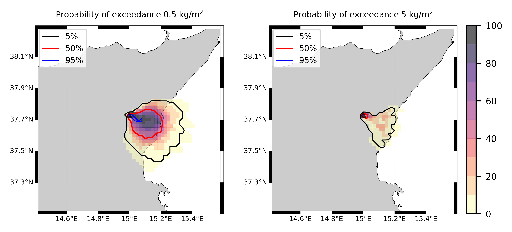
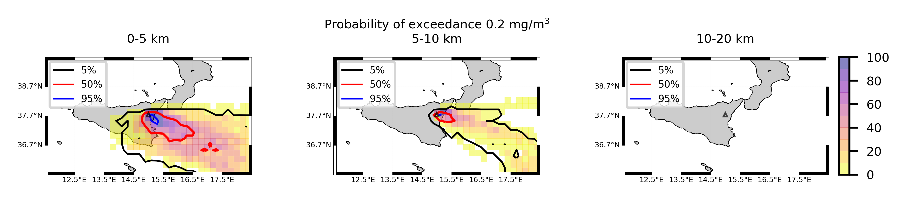

Forecast from VONA_20210228_0811Z
=================================

Contents
========

* [Forecast products](#forecast-products)
	* [Forecast at 2021-02-28 09:10 Z from RED VONA issued at 20210228_0811Z](#forecast-at-2021-02-28-0910-z-from-red-vona-issued-at-20210228_0811z)
	* [Forecast at 2021-02-28 10:10 Z from RED VONA issued at 20210228_0811Z](#forecast-at-2021-02-28-1010-z-from-red-vona-issued-at-20210228_0811z)
	* [Forecast at 2021-02-28 11:10 Z from RED VONA issued at 20210228_0811Z](#forecast-at-2021-02-28-1110-z-from-red-vona-issued-at-20210228_0811z)
	* [Forecast at 2021-02-28 14:10 Z from RED VONA issued at 20210228_0811Z](#forecast-at-2021-02-28-1410-z-from-red-vona-issued-at-20210228_0811z)
	* [Forecast at 2021-02-28 17:10 Z from RED VONA issued at 20210228_0811Z](#forecast-at-2021-02-28-1710-z-from-red-vona-issued-at-20210228_0811z)
	* [Forecast at 2021-02-28 09:40 Z from RED VONA issued at 20210228_0835Z](#forecast-at-2021-02-28-0940-z-from-red-vona-issued-at-20210228_0835z)
	* [Forecast at 2021-02-28 10:40 Z from RED VONA issued at 20210228_0835Z](#forecast-at-2021-02-28-1040-z-from-red-vona-issued-at-20210228_0835z)
	* [Forecast at 2021-02-28 11:40 Z from RED VONA issued at 20210228_0835Z](#forecast-at-2021-02-28-1140-z-from-red-vona-issued-at-20210228_0835z)
	* [Forecast at 2021-02-28 14:40 Z from RED VONA issued at 20210228_0835Z](#forecast-at-2021-02-28-1440-z-from-red-vona-issued-at-20210228_0835z)
	* [Forecast at 2021-02-28 17:40 Z from RED VONA issued at 20210228_0835Z](#forecast-at-2021-02-28-1740-z-from-red-vona-issued-at-20210228_0835z)
	* [Forecast at 2021-02-28 20:40 Z from RED VONA issued at 20210228_0835Z](#forecast-at-2021-02-28-2040-z-from-red-vona-issued-at-20210228_0835z)
	* [Forecast at 2021-02-28 11:50 Z from RED VONA issued at 20210228_1047Z](#forecast-at-2021-02-28-1150-z-from-red-vona-issued-at-20210228_1047z)
	* [Forecast at 2021-02-28 12:50 Z from RED VONA issued at 20210228_1047Z](#forecast-at-2021-02-28-1250-z-from-red-vona-issued-at-20210228_1047z)
	* [Forecast at 2021-02-28 13:50 Z from RED VONA issued at 20210228_1047Z](#forecast-at-2021-02-28-1350-z-from-red-vona-issued-at-20210228_1047z)
	* [Forecast at 2021-02-28 16:50 Z from RED VONA issued at 20210228_1047Z](#forecast-at-2021-02-28-1650-z-from-red-vona-issued-at-20210228_1047z)
	* [Forecast at 2021-02-28 19:50 Z from RED VONA issued at 20210228_1047Z](#forecast-at-2021-02-28-1950-z-from-red-vona-issued-at-20210228_1047z)
	* [Forecast at 2021-02-28 22:50 Z from RED VONA issued at 20210228_1047Z](#forecast-at-2021-02-28-2250-z-from-red-vona-issued-at-20210228_1047z)
	* [Forecast at 2021-02-28 16:50 Z from RED VONA issued at 20210228_1426Z](#forecast-at-2021-02-28-1650-z-from-red-vona-issued-at-20210228_1426z)

# Forecast products

## Forecast at 2021-02-28 09:10 Z from RED VONA issued at 20210228_0811Z
  

|Eruption start [Z]|Eruption end [Z]|Forecast time [Z]|Column height asl [m]|
| :--- | :--- | :--- | :--- |
|2021-02-28 08:10:00|Ongoing|2021-02-28 09:10:00|6000 ± 500 - from VONA|
  
  

|Percentile|MER [kg/s¹]|Mass air [kg]|Mass air nested dom. [kg]|Mass grd [kg]|Mass grd nested dom. [kg]|
| :--- | :--- | :--- | :--- | :--- | :--- |
|5th|5.85e+03|3.93e+06|3.92e+06|1.52e+07|1.52e+07|
|50th|1.35e+04|9.38e+06|9.38e+06|3.73e+07|3.73e+07|
|95th|2.97e+04|2.75e+07|2.74e+07|6.89e+07|6.89e+07|
  

### Ground Nested Domain 2021-02-28 09:10 Z
  
  
  
  
  
  
  
  
  
  
  
  
  
  
  
  

|Location|Ground load [kg/m²] 5th perc|Ground load [kg/m²] 50th perc|Ground load [kg/m²] 95th perc|
| :--- | :--- | :--- | :--- |
|Sarro (1)|0.00e+00|0.00e+00|1.82e-04|
|Airone (2)|0.00e+00|1.85e-06|4.49e-03|
|Zafferana Ingresso (3)|0.00e+00|0.00e+00|4.02e-04|
|Zafferana Rotonda (4)|0.00e+00|0.00e+00|3.82e-04|
|Petrulli (5)|0.00e+00|0.00e+00|1.40e-04|
|Milo (6)|0.00e+00|0.00e+00|1.12e-03|
|Fornazzo (7)|0.00e+00|0.00e+00|2.84e-03|
|Rinuccio (8)|0.00e+00|0.00e+00|6.15e-03|
|S. Alfio (9)|0.00e+00|0.00e+00|0.00e+00|
|Macchia (10)|0.00e+00|0.00e+00|0.00e+00|
|S. Venerina (11)|0.00e+00|0.00e+00|0.00e+00|
|Linera (12)|0.00e+00|0.00e+00|0.00e+00|
|Dagala chiesa S. Maria (13)|0.00e+00|0.00e+00|0.00e+00|
|Giarre Piazza Maccheroni (14)|0.00e+00|0.00e+00|0.00e+00|
|Milo parco (15)|0.00e+00|0.00e+00|6.08e-04|
  

### Atmosphere 2021-02-28 09:10 Z
  

## Forecast at 2021-02-28 10:10 Z from RED VONA issued at 20210228_0811Z
  

|Eruption start [Z]|Eruption end [Z]|Forecast time [Z]|Column height asl [m]|
| :--- | :--- | :--- | :--- |
|2021-02-28 08:10:00|Ongoing|2021-02-28 10:10:00|6000 ± 500 - from VONA|
  
  

|Percentile|MER [kg/s¹]|Mass air [kg]|Mass air nested dom. [kg]|Mass grd [kg]|Mass grd nested dom. [kg]|
| :--- | :--- | :--- | :--- | :--- | :--- |
|5th|3.26e+03|8.23e+06|8.22e+06|4.48e+07|4.48e+07|
|50th|2.02e+04|1.61e+07|1.61e+07|9.13e+07|9.13e+07|
|95th|3.35e+04|3.59e+07|3.59e+07|1.51e+08|1.51e+08|
  

### Ground Nested Domain 2021-02-28 10:10 Z
  
  
  
  
  
  
  
  
  
  
  
  
  
  
  
  

|Location|Ground load [kg/m²] 5th perc|Ground load [kg/m²] 50th perc|Ground load [kg/m²] 95th perc|
| :--- | :--- | :--- | :--- |
|Sarro (1)|0.00e+00|9.75e-05|7.50e-02|
|Airone (2)|8.38e-06|2.40e-03|1.23e-01|
|Zafferana Ingresso (3)|0.00e+00|7.37e-05|5.56e-02|
|Zafferana Rotonda (4)|0.00e+00|5.95e-05|3.93e-02|
|Petrulli (5)|0.00e+00|7.94e-05|3.65e-02|
|Milo (6)|0.00e+00|0.00e+00|3.03e-02|
|Fornazzo (7)|0.00e+00|0.00e+00|4.11e-02|
|Rinuccio (8)|0.00e+00|0.00e+00|6.74e-02|
|S. Alfio (9)|0.00e+00|0.00e+00|4.57e-03|
|Macchia (10)|0.00e+00|0.00e+00|1.45e-04|
|S. Venerina (11)|0.00e+00|0.00e+00|1.49e-03|
|Linera (12)|0.00e+00|0.00e+00|2.94e-04|
|Dagala chiesa S. Maria (13)|0.00e+00|0.00e+00|2.13e-03|
|Giarre Piazza Maccheroni (14)|0.00e+00|0.00e+00|3.19e-05|
|Milo parco (15)|0.00e+00|0.00e+00|2.53e-02|
  

### Atmosphere 2021-02-28 10:10 Z
  

## Forecast at 2021-02-28 11:10 Z from RED VONA issued at 20210228_0811Z
  

|Eruption start [Z]|Eruption end [Z]|Forecast time [Z]|Column height asl [m]|
| :--- | :--- | :--- | :--- |
|2021-02-28 08:10:00|Ongoing|2021-02-28 11:10:00|6000 ± 500 - from VONA|
  
  

|Percentile|MER [kg/s¹]|Mass air [kg]|Mass air nested dom. [kg]|Mass grd [kg]|Mass grd nested dom. [kg]|
| :--- | :--- | :--- | :--- | :--- | :--- |
|5th|6.51e+03|8.40e+06|8.40e+06|7.89e+07|7.89e+07|
|50th|1.87e+04|1.94e+07|1.94e+07|1.57e+08|1.57e+08|
|95th|3.41e+04|4.24e+07|4.24e+07|2.20e+08|2.20e+08|
  

### Ground Nested Domain 2021-02-28 11:10 Z
  
  
  
  
  
  
  
  
  
  
  
  
  
  
  
  

|Location|Ground load [kg/m²] 5th perc|Ground load [kg/m²] 50th perc|Ground load [kg/m²] 95th perc|
| :--- | :--- | :--- | :--- |
|Sarro (1)|0.00e+00|1.68e-03|9.45e-02|
|Airone (2)|3.86e-05|8.82e-03|1.63e-01|
|Zafferana Ingresso (3)|0.00e+00|3.18e-03|7.53e-02|
|Zafferana Rotonda (4)|0.00e+00|3.25e-03|7.95e-02|
|Petrulli (5)|0.00e+00|1.66e-03|7.27e-02|
|Milo (6)|0.00e+00|6.34e-05|6.66e-02|
|Fornazzo (7)|0.00e+00|5.99e-05|7.87e-02|
|Rinuccio (8)|0.00e+00|8.98e-05|1.28e-01|
|S. Alfio (9)|0.00e+00|0.00e+00|2.36e-02|
|Macchia (10)|0.00e+00|0.00e+00|4.88e-03|
|S. Venerina (11)|0.00e+00|1.34e-05|6.56e-03|
|Linera (12)|0.00e+00|3.45e-05|6.41e-03|
|Dagala chiesa S. Maria (13)|0.00e+00|1.05e-05|9.57e-03|
|Giarre Piazza Maccheroni (14)|0.00e+00|0.00e+00|1.15e-03|
|Milo parco (15)|0.00e+00|5.73e-05|6.19e-02|
  

### Atmosphere 2021-02-28 11:10 Z
  

## Forecast at 2021-02-28 14:10 Z from RED VONA issued at 20210228_0811Z
  

|Eruption start [Z]|Eruption end [Z]|Forecast time [Z]|Column height asl [m]|
| :--- | :--- | :--- | :--- |
|2021-02-28 08:10:00|Ongoing|2021-02-28 14:10:00|6000 ± 500 - from VONA|
  
  

|Percentile|MER [kg/s¹]|Mass air [kg]|Mass air nested dom. [kg]|Mass grd [kg]|Mass grd nested dom. [kg]|
| :--- | :--- | :--- | :--- | :--- | :--- |
|5th|5.42e+03|1.02e+07|1.02e+07|1.73e+08|1.73e+08|
|50th|2.34e+04|3.31e+07|3.31e+07|4.02e+08|4.02e+08|
|95th|4.50e+04|9.49e+07|9.39e+07|6.60e+08|6.60e+08|
  

### Ground Nested Domain 2021-02-28 14:10 Z
  
  
  
  
  
  
  
  
  
  
  
  
  
  
  
  

|Location|Ground load [kg/m²] 5th perc|Ground load [kg/m²] 50th perc|Ground load [kg/m²] 95th perc|
| :--- | :--- | :--- | :--- |
|Sarro (1)|9.96e-04|2.83e-02|6.95e-01|
|Airone (2)|2.59e-03|5.40e-02|1.45e+00|
|Zafferana Ingresso (3)|1.00e-03|3.03e-02|6.05e-01|
|Zafferana Rotonda (4)|7.82e-04|2.72e-02|5.11e-01|
|Petrulli (5)|3.79e-04|1.25e-02|5.41e-01|
|Milo (6)|0.00e+00|3.30e-03|1.15e+00|
|Fornazzo (7)|0.00e+00|1.25e-03|1.42e+00|
|Rinuccio (8)|0.00e+00|1.76e-03|1.48e+00|
|S. Alfio (9)|0.00e+00|1.07e-05|4.60e-01|
|Macchia (10)|0.00e+00|6.24e-05|1.16e-01|
|S. Venerina (11)|0.00e+00|1.84e-04|7.55e-02|
|Linera (12)|0.00e+00|2.14e-03|5.62e-02|
|Dagala chiesa S. Maria (13)|0.00e+00|1.82e-04|1.53e-01|
|Giarre Piazza Maccheroni (14)|0.00e+00|0.00e+00|4.65e-02|
|Milo parco (15)|0.00e+00|2.95e-03|1.13e+00|
  

### Atmosphere 2021-02-28 14:10 Z
  

## Forecast at 2021-02-28 17:10 Z from RED VONA issued at 20210228_0811Z
  

|Eruption start [Z]|Eruption end [Z]|Forecast time [Z]|Column height asl [m]|
| :--- | :--- | :--- | :--- |
|2021-02-28 08:10:00|Ongoing|2021-02-28 17:10:00|6000 ± 500 - from VONA|
  
  

|Percentile|MER [kg/s¹]|Mass air [kg]|Mass air nested dom. [kg]|Mass grd [kg]|Mass grd nested dom. [kg]|
| :--- | :--- | :--- | :--- | :--- | :--- |
|5th|4.98e+03|1.06e+07|1.06e+07|3.52e+08|3.52e+08|
|50th|2.17e+04|3.77e+07|3.77e+07|5.36e+08|5.36e+08|
|95th|5.38e+04|1.05e+08|1.00e+08|9.63e+08|9.62e+08|
  

### Ground Nested Domain 2021-02-28 17:10 Z
  
  
  
  
  
  
  
  
  
  
  
  
  
  
  
  

|Location|Ground load [kg/m²] 5th perc|Ground load [kg/m²] 50th perc|Ground load [kg/m²] 95th perc|
| :--- | :--- | :--- | :--- |
|Sarro (1)|4.13e-03|5.60e-02|1.22e+00|
|Airone (2)|3.11e-02|1.44e-01|2.18e+00|
|Zafferana Ingresso (3)|2.91e-03|5.81e-02|8.28e-01|
|Zafferana Rotonda (4)|2.46e-03|5.20e-02|8.67e-01|
|Petrulli (5)|9.06e-04|2.42e-02|8.44e-01|
|Milo (6)|2.91e-06|4.68e-03|1.44e+00|
|Fornazzo (7)|0.00e+00|2.46e-03|1.63e+00|
|Rinuccio (8)|0.00e+00|3.50e-03|1.72e+00|
|S. Alfio (9)|0.00e+00|2.54e-05|4.92e-01|
|Macchia (10)|0.00e+00|1.75e-04|1.86e-01|
|S. Venerina (11)|0.00e+00|4.47e-03|2.09e-01|
|Linera (12)|5.24e-05|9.37e-03|1.11e-01|
|Dagala chiesa S. Maria (13)|0.00e+00|2.54e-03|2.88e-01|
|Giarre Piazza Maccheroni (14)|0.00e+00|7.65e-06|8.66e-02|
|Milo parco (15)|2.97e-06|4.57e-03|1.39e+00|
  

### Atmosphere 2021-02-28 17:10 Z
  

## Forecast at 2021-02-28 09:40 Z from RED VONA issued at 20210228_0835Z
  

|Eruption start [Z]|Eruption end [Z]|Forecast time [Z]|Column height asl [m]|
| :--- | :--- | :--- | :--- |
|2021-02-28 08:10:00|Ongoing|2021-02-28 09:40:00|9000 ± 500 - from VONA|
  
  

|Percentile|MER [kg/s¹]|Mass air [kg]|Mass air nested dom. [kg]|Mass grd [kg]|Mass grd nested dom. [kg]|
| :--- | :--- | :--- | :--- | :--- | :--- |
|5th|3.21e+04|3.65e+07|3.65e+07|9.48e+07|9.47e+07|
|50th|1.84e+05|2.15e+08|2.15e+08|4.87e+08|4.87e+08|
|95th|7.71e+05|1.09e+09|1.01e+09|1.32e+09|1.31e+09|
  

### Ground Nested Domain 2021-02-28 09:40 Z
  
  
  
  
  
  
  
  
  
  
  
  
  
  
  
  

|Location|Ground load [kg/m²] 5th perc|Ground load [kg/m²] 50th perc|Ground load [kg/m²] 95th perc|
| :--- | :--- | :--- | :--- |
|Sarro (1)|2.58e-02|2.18e+00|5.62e+00|
|Airone (2)|6.98e-02|2.86e+00|5.16e+00|
|Zafferana Ingresso (3)|4.26e-02|2.45e+00|5.10e+00|
|Zafferana Rotonda (4)|4.32e-02|2.14e+00|4.80e+00|
|Petrulli (5)|3.47e-02|1.78e+00|4.05e+00|
|Milo (6)|3.74e-02|9.17e-01|4.44e+00|
|Fornazzo (7)|4.16e-02|5.45e-01|4.11e+00|
|Rinuccio (8)|5.40e-02|6.01e-01|4.03e+00|
|S. Alfio (9)|2.21e-03|1.25e-01|3.68e+00|
|Macchia (10)|7.91e-04|1.30e-01|2.99e+00|
|S. Venerina (11)|3.07e-03|9.67e-01|3.25e+00|
|Linera (12)|1.07e-03|8.35e-01|3.59e+00|
|Dagala chiesa S. Maria (13)|4.19e-03|8.02e-01|3.25e+00|
|Giarre Piazza Maccheroni (14)|5.53e-06|1.90e-02|2.54e+00|
|Milo parco (15)|3.26e-02|9.02e-01|4.42e+00|
  

### Atmosphere 2021-02-28 09:40 Z
  

## Forecast at 2021-02-28 10:40 Z from RED VONA issued at 20210228_0835Z
  

|Eruption start [Z]|Eruption end [Z]|Forecast time [Z]|Column height asl [m]|
| :--- | :--- | :--- | :--- |
|2021-02-28 08:10:00|Ongoing|2021-02-28 10:40:00|9000 ± 500 - from VONA|
  
  

|Percentile|MER [kg/s¹]|Mass air [kg]|Mass air nested dom. [kg]|Mass grd [kg]|Mass grd nested dom. [kg]|
| :--- | :--- | :--- | :--- | :--- | :--- |
|5th|1.18e+05|1.55e+08|1.54e+08|5.65e+08|5.64e+08|
|50th|1.73e+05|4.14e+08|4.06e+08|1.16e+09|1.16e+09|
|95th|5.18e+05|9.37e+08|7.64e+08|2.45e+09|2.44e+09|
  

### Ground Nested Domain 2021-02-28 10:40 Z
  
  
  
  
  
  
  
  
  
  
  
  
  
  
  
  

|Location|Ground load [kg/m²] 5th perc|Ground load [kg/m²] 50th perc|Ground load [kg/m²] 95th perc|
| :--- | :--- | :--- | :--- |
|Sarro (1)|1.26e+00|5.05e+00|1.04e+01|
|Airone (2)|1.53e+00|4.90e+00|1.03e+01|
|Zafferana Ingresso (3)|1.43e+00|4.15e+00|1.03e+01|
|Zafferana Rotonda (4)|1.54e+00|3.90e+00|1.00e+01|
|Petrulli (5)|1.42e+00|3.53e+00|9.02e+00|
|Milo (6)|6.68e-01|2.62e+00|6.46e+00|
|Fornazzo (7)|3.81e-01|1.96e+00|6.49e+00|
|Rinuccio (8)|4.59e-01|2.14e+00|6.17e+00|
|S. Alfio (9)|5.00e-02|8.97e-01|8.13e+00|
|Macchia (10)|5.56e-02|9.08e-01|5.37e+00|
|S. Venerina (11)|5.35e-01|2.35e+00|6.25e+00|
|Linera (12)|4.21e-01|1.61e+00|6.99e+00|
|Dagala chiesa S. Maria (13)|4.50e-01|2.01e+00|5.59e+00|
|Giarre Piazza Maccheroni (14)|6.35e-03|3.94e-01|6.46e+00|
|Milo parco (15)|6.47e-01|2.58e+00|6.49e+00|
  

### Atmosphere 2021-02-28 10:40 Z
  

## Forecast at 2021-02-28 11:40 Z from RED VONA issued at 20210228_0835Z
  

|Eruption start [Z]|Eruption end [Z]|Forecast time [Z]|Column height asl [m]|
| :--- | :--- | :--- | :--- |
|2021-02-28 08:10:00|Ongoing|2021-02-28 11:40:00|9000 ± 500 - from VONA|
  
  

|Percentile|MER [kg/s¹]|Mass air [kg]|Mass air nested dom. [kg]|Mass grd [kg]|Mass grd nested dom. [kg]|
| :--- | :--- | :--- | :--- | :--- | :--- |
|5th|4.11e+04|1.21e+08|1.19e+08|9.43e+08|9.41e+08|
|50th|2.36e+05|4.32e+08|3.84e+08|2.06e+09|2.05e+09|
|95th|7.71e+05|1.47e+09|1.18e+09|3.53e+09|3.50e+09|
  

### Ground Nested Domain 2021-02-28 11:40 Z
  
  
  
  
  
  
  
  
  
  
  
  
  
  
  
  

|Location|Ground load [kg/m²] 5th perc|Ground load [kg/m²] 50th perc|Ground load [kg/m²] 95th perc|
| :--- | :--- | :--- | :--- |
|Sarro (1)|1.75e+00|7.49e+00|1.72e+01|
|Airone (2)|2.28e+00|9.18e+00|1.74e+01|
|Zafferana Ingresso (3)|2.20e+00|7.98e+00|1.68e+01|
|Zafferana Rotonda (4)|2.50e+00|7.79e+00|1.62e+01|
|Petrulli (5)|2.60e+00|6.07e+00|1.47e+01|
|Milo (6)|1.17e+00|5.46e+00|1.14e+01|
|Fornazzo (7)|7.32e-01|3.83e+00|8.89e+00|
|Rinuccio (8)|8.95e-01|4.11e+00|8.34e+00|
|S. Alfio (9)|1.02e-01|1.48e+00|1.22e+01|
|Macchia (10)|1.10e-01|1.74e+00|9.95e+00|
|S. Venerina (11)|1.05e+00|4.21e+00|1.38e+01|
|Linera (12)|8.12e-01|4.73e+00|1.26e+01|
|Dagala chiesa S. Maria (13)|9.79e-01|4.28e+00|1.28e+01|
|Giarre Piazza Maccheroni (14)|1.32e-02|7.15e-01|9.77e+00|
|Milo parco (15)|1.13e+00|5.45e+00|1.14e+01|
  

### Atmosphere 2021-02-28 11:40 Z
  

## Forecast at 2021-02-28 14:40 Z from RED VONA issued at 20210228_0835Z
  

|Eruption start [Z]|Eruption end [Z]|Forecast time [Z]|Column height asl [m]|
| :--- | :--- | :--- | :--- |
|2021-02-28 08:10:00|Ongoing|2021-02-28 14:40:00|9000 ± 500 - from VONA|
  
  

|Percentile|MER [kg/s¹]|Mass air [kg]|Mass air nested dom. [kg]|Mass grd [kg]|Mass grd nested dom. [kg]|
| :--- | :--- | :--- | :--- | :--- | :--- |
|5th|5.74e+04|2.37e+08|2.29e+08|2.10e+09|2.09e+09|
|50th|1.64e+05|5.59e+08|4.47e+08|4.82e+09|4.68e+09|
|95th|5.72e+05|1.62e+09|1.42e+09|7.14e+09|7.11e+09|
  

### Ground Nested Domain 2021-02-28 14:40 Z
  
  
  
  
  
  
  
  
  
  
  
  
  
  
  
  

|Location|Ground load [kg/m²] 5th perc|Ground load [kg/m²] 50th perc|Ground load [kg/m²] 95th perc|
| :--- | :--- | :--- | :--- |
|Sarro (1)|3.35e+00|2.10e+01|3.57e+01|
|Airone (2)|4.37e+00|2.22e+01|3.47e+01|
|Zafferana Ingresso (3)|3.81e+00|1.99e+01|3.32e+01|
|Zafferana Rotonda (4)|4.11e+00|1.86e+01|3.23e+01|
|Petrulli (5)|5.29e+00|1.29e+01|2.72e+01|
|Milo (6)|3.46e+00|9.80e+00|2.08e+01|
|Fornazzo (7)|2.06e+00|8.67e+00|1.80e+01|
|Rinuccio (8)|2.46e+00|8.87e+00|1.65e+01|
|S. Alfio (9)|3.33e-01|4.79e+00|1.96e+01|
|Macchia (10)|5.22e-01|5.50e+00|1.47e+01|
|S. Venerina (11)|2.91e+00|1.06e+01|2.70e+01|
|Linera (12)|1.66e+00|1.06e+01|3.11e+01|
|Dagala chiesa S. Maria (13)|2.51e+00|9.02e+00|2.47e+01|
|Giarre Piazza Maccheroni (14)|1.32e-01|2.84e+00|1.03e+01|
|Milo parco (15)|3.37e+00|9.75e+00|2.09e+01|
  

### Atmosphere 2021-02-28 14:40 Z
  

## Forecast at 2021-02-28 17:40 Z from RED VONA issued at 20210228_0835Z
  

|Eruption start [Z]|Eruption end [Z]|Forecast time [Z]|Column height asl [m]|
| :--- | :--- | :--- | :--- |
|2021-02-28 08:10:00|Ongoing|2021-02-28 17:40:00|9000 ± 500 - from VONA|
  
  

|Percentile|MER [kg/s¹]|Mass air [kg]|Mass air nested dom. [kg]|Mass grd [kg]|Mass grd nested dom. [kg]|
| :--- | :--- | :--- | :--- | :--- | :--- |
|5th|8.38e+04|3.03e+08|2.58e+08|4.14e+09|4.13e+09|
|50th|2.16e+05|1.05e+09|6.52e+08|6.89e+09|6.82e+09|
|95th|5.63e+05|1.61e+09|1.21e+09|1.03e+10|1.02e+10|
  

### Ground Nested Domain 2021-02-28 17:40 Z
  
  
  
  
  
  
  
  
  
  
  
  
  
  
  
  

|Location|Ground load [kg/m²] 5th perc|Ground load [kg/m²] 50th perc|Ground load [kg/m²] 95th perc|
| :--- | :--- | :--- | :--- |
|Sarro (1)|1.39e+01|2.77e+01|4.72e+01|
|Airone (2)|1.59e+01|2.98e+01|4.52e+01|
|Zafferana Ingresso (3)|1.37e+01|2.76e+01|4.61e+01|
|Zafferana Rotonda (4)|1.32e+01|2.67e+01|4.43e+01|
|Petrulli (5)|9.97e+00|2.33e+01|3.51e+01|
|Milo (6)|5.37e+00|1.68e+01|3.01e+01|
|Fornazzo (7)|4.41e+00|1.31e+01|2.33e+01|
|Rinuccio (8)|5.10e+00|1.30e+01|2.16e+01|
|S. Alfio (9)|1.80e+00|7.22e+00|2.53e+01|
|Macchia (10)|1.45e+00|8.57e+00|1.91e+01|
|S. Venerina (11)|5.09e+00|1.66e+01|3.23e+01|
|Linera (12)|6.49e+00|1.57e+01|3.74e+01|
|Dagala chiesa S. Maria (13)|3.85e+00|1.50e+01|2.79e+01|
|Giarre Piazza Maccheroni (14)|4.52e-01|4.32e+00|1.63e+01|
|Milo parco (15)|5.21e+00|1.67e+01|3.04e+01|
  

### Atmosphere 2021-02-28 17:40 Z
  

## Forecast at 2021-02-28 20:40 Z from RED VONA issued at 20210228_0835Z
  

|Eruption start [Z]|Eruption end [Z]|Forecast time [Z]|Column height asl [m]|
| :--- | :--- | :--- | :--- |
|2021-02-28 08:10:00|Ongoing|2021-02-28 20:40:00|9000 ± 500 - from VONA|
  
  

|Percentile|MER [kg/s¹]|Mass air [kg]|Mass air nested dom. [kg]|Mass grd [kg]|Mass grd nested dom. [kg]|
| :--- | :--- | :--- | :--- | :--- | :--- |
|5th|8.61e+04|4.43e+08|2.65e+08|6.27e+09|6.25e+09|
|50th|2.67e+05|7.05e+08|5.44e+08|9.62e+09|9.53e+09|
|95th|7.92e+05|2.71e+09|1.93e+09|1.39e+10|1.36e+10|
  

### Ground Nested Domain 2021-02-28 20:40 Z
  
  
  
  
  
  
  
  
  
  
  
  
  
  
  
  

|Location|Ground load [kg/m²] 5th perc|Ground load [kg/m²] 50th perc|Ground load [kg/m²] 95th perc|
| :--- | :--- | :--- | :--- |
|Sarro (1)|1.62e+01|4.13e+01|5.55e+01|
|Airone (2)|1.91e+01|4.59e+01|6.04e+01|
|Zafferana Ingresso (3)|1.69e+01|4.11e+01|5.96e+01|
|Zafferana Rotonda (4)|1.70e+01|3.86e+01|5.91e+01|
|Petrulli (5)|1.23e+01|3.12e+01|5.24e+01|
|Milo (6)|7.43e+00|2.19e+01|4.02e+01|
|Fornazzo (7)|6.27e+00|1.53e+01|3.18e+01|
|Rinuccio (8)|7.30e+00|1.49e+01|3.12e+01|
|S. Alfio (9)|2.50e+00|8.57e+00|2.77e+01|
|Macchia (10)|2.09e+00|9.94e+00|2.35e+01|
|S. Venerina (11)|6.11e+00|2.09e+01|3.95e+01|
|Linera (12)|8.08e+00|1.97e+01|3.99e+01|
|Dagala chiesa S. Maria (13)|5.02e+00|1.96e+01|3.68e+01|
|Giarre Piazza Maccheroni (14)|1.16e+00|4.53e+00|1.71e+01|
|Milo parco (15)|7.21e+00|2.19e+01|4.01e+01|
  

### Atmosphere 2021-02-28 20:40 Z
  

## Forecast at 2021-02-28 11:50 Z from RED VONA issued at 20210228_1047Z
  

|Eruption start [Z]|Eruption end [Z]|Forecast time [Z]|Column height asl [m]|
| :--- | :--- | :--- | :--- |
|2021-02-28 08:10:00|Ongoing|2021-02-28 11:50:00|4500 ± 500 - from VONA|
  
  

|Percentile|MER [kg/s¹]|Mass air [kg]|Mass air nested dom. [kg]|Mass grd [kg]|Mass grd nested dom. [kg]|
| :--- | :--- | :--- | :--- | :--- | :--- |
|5th|8.69e+01|4.41e+07|3.84e+07|8.79e+08|8.78e+08|
|50th|1.77e+03|1.66e+08|1.53e+08|1.63e+09|1.63e+09|
|95th|7.83e+03|4.97e+08|3.23e+08|2.95e+09|2.93e+09|
  

### Ground Nested Domain 2021-02-28 11:50 Z
  
  
  
  
  
  
  
  
  
  
  
  
  
  
  
  

|Location|Ground load [kg/m²] 5th perc|Ground load [kg/m²] 50th perc|Ground load [kg/m²] 95th perc|
| :--- | :--- | :--- | :--- |
|Sarro (1)|1.62e+00|6.53e+00|1.29e+01|
|Airone (2)|2.05e+00|7.12e+00|1.33e+01|
|Zafferana Ingresso (3)|1.95e+00|6.20e+00|1.28e+01|
|Zafferana Rotonda (4)|2.24e+00|6.17e+00|1.26e+01|
|Petrulli (5)|2.20e+00|5.08e+00|1.12e+01|
|Milo (6)|8.38e-01|3.47e+00|7.82e+00|
|Fornazzo (7)|4.71e-01|2.61e+00|7.58e+00|
|Rinuccio (8)|5.69e-01|2.85e+00|6.92e+00|
|S. Alfio (9)|6.65e-02|1.39e+00|1.04e+01|
|Macchia (10)|1.07e-01|1.75e+00|7.28e+00|
|S. Venerina (11)|1.08e+00|3.20e+00|7.82e+00|
|Linera (12)|8.37e-01|2.78e+00|9.12e+00|
|Dagala chiesa S. Maria (13)|8.65e-01|3.58e+00|7.35e+00|
|Giarre Piazza Maccheroni (14)|1.47e-02|7.42e-01|8.77e+00|
|Milo parco (15)|8.12e-01|3.43e+00|7.80e+00|
  

### Atmosphere 2021-02-28 11:50 Z
  

## Forecast at 2021-02-28 12:50 Z from RED VONA issued at 20210228_1047Z
  

|Eruption start [Z]|Eruption end [Z]|Forecast time [Z]|Column height asl [m]|
| :--- | :--- | :--- | :--- |
|2021-02-28 08:10:00|Ongoing|2021-02-28 12:50:00|4500 ± 500 - from VONA|
  
  

|Percentile|MER [kg/s¹]|Mass air [kg]|Mass air nested dom. [kg]|Mass grd [kg]|Mass grd nested dom. [kg]|
| :--- | :--- | :--- | :--- | :--- | :--- |
|5th|8.81e+01|2.34e+07|1.73e+07|9.38e+08|9.36e+08|
|50th|2.24e+03|1.04e+08|8.11e+07|1.70e+09|1.70e+09|
|95th|1.51e+04|3.94e+08|2.20e+08|3.09e+09|3.06e+09|
  

### Ground Nested Domain 2021-02-28 12:50 Z
  
  
  
  
  
  
  
  
  
  
  
  
  
  
  
  

|Location|Ground load [kg/m²] 5th perc|Ground load [kg/m²] 50th perc|Ground load [kg/m²] 95th perc|
| :--- | :--- | :--- | :--- |
|Sarro (1)|1.63e+00|6.56e+00|1.29e+01|
|Airone (2)|2.06e+00|7.16e+00|1.33e+01|
|Zafferana Ingresso (3)|1.95e+00|6.23e+00|1.29e+01|
|Zafferana Rotonda (4)|2.25e+00|6.27e+00|1.26e+01|
|Petrulli (5)|2.20e+00|5.09e+00|1.13e+01|
|Milo (6)|8.39e-01|3.48e+00|7.85e+00|
|Fornazzo (7)|4.71e-01|2.62e+00|7.60e+00|
|Rinuccio (8)|5.69e-01|2.86e+00|6.94e+00|
|S. Alfio (9)|6.74e-02|1.40e+00|1.04e+01|
|Macchia (10)|1.16e-01|1.78e+00|7.28e+00|
|S. Venerina (11)|1.24e+00|3.20e+00|7.91e+00|
|Linera (12)|8.51e-01|2.85e+00|9.26e+00|
|Dagala chiesa S. Maria (13)|8.86e-01|3.60e+00|7.42e+00|
|Giarre Piazza Maccheroni (14)|1.61e-02|7.66e-01|8.78e+00|
|Milo parco (15)|8.13e-01|3.45e+00|7.82e+00|
  

### Atmosphere 2021-02-28 12:50 Z
  

## Forecast at 2021-02-28 13:50 Z from RED VONA issued at 20210228_1047Z
  

|Eruption start [Z]|Eruption end [Z]|Forecast time [Z]|Column height asl [m]|
| :--- | :--- | :--- | :--- |
|2021-02-28 08:10:00|Ongoing|2021-02-28 13:50:00|4500 ± 500 - from VONA|
  
  

|Percentile|MER [kg/s¹]|Mass air [kg]|Mass air nested dom. [kg]|Mass grd [kg]|Mass grd nested dom. [kg]|
| :--- | :--- | :--- | :--- | :--- | :--- |
|5th|1.46e+02|1.32e+07|1.17e+07|9.80e+08|9.79e+08|
|50th|2.64e+03|8.95e+07|6.53e+07|1.72e+09|1.72e+09|
|95th|1.91e+04|3.52e+08|1.84e+08|3.14e+09|3.10e+09|
  

### Ground Nested Domain 2021-02-28 13:50 Z
  
  
  
  
  
  
  
  
  
  
  
  
  
  
  
  

|Location|Ground load [kg/m²] 5th perc|Ground load [kg/m²] 50th perc|Ground load [kg/m²] 95th perc|
| :--- | :--- | :--- | :--- |
|Sarro (1)|1.64e+00|6.60e+00|1.29e+01|
|Airone (2)|2.06e+00|7.18e+00|1.34e+01|
|Zafferana Ingresso (3)|1.96e+00|6.24e+00|1.29e+01|
|Zafferana Rotonda (4)|2.25e+00|6.29e+00|1.26e+01|
|Petrulli (5)|2.20e+00|5.09e+00|1.13e+01|
|Milo (6)|8.41e-01|3.48e+00|7.85e+00|
|Fornazzo (7)|4.71e-01|2.62e+00|7.60e+00|
|Rinuccio (8)|5.70e-01|2.87e+00|6.94e+00|
|S. Alfio (9)|6.88e-02|1.40e+00|1.04e+01|
|Macchia (10)|1.29e-01|1.78e+00|7.29e+00|
|S. Venerina (11)|1.26e+00|3.20e+00|7.92e+00|
|Linera (12)|8.57e-01|2.89e+00|9.26e+00|
|Dagala chiesa S. Maria (13)|9.06e-01|3.60e+00|7.43e+00|
|Giarre Piazza Maccheroni (14)|2.79e-02|7.67e-01|8.78e+00|
|Milo parco (15)|8.15e-01|3.45e+00|7.83e+00|
  

### Atmosphere 2021-02-28 13:50 Z
  

## Forecast at 2021-02-28 16:50 Z from RED VONA issued at 20210228_1047Z
  

|Eruption start [Z]|Eruption end [Z]|Forecast time [Z]|Column height asl [m]|
| :--- | :--- | :--- | :--- |
|2021-02-28 08:10:00|Ongoing|2021-02-28 16:50:00|4500 ± 500 - from VONA|
  
  

|Percentile|MER [kg/s¹]|Mass air [kg]|Mass air nested dom. [kg]|Mass grd [kg]|Mass grd nested dom. [kg]|
| :--- | :--- | :--- | :--- | :--- | :--- |
|5th|9.15e+01|9.68e+06|9.00e+06|1.04e+09|1.04e+09|
|50th|2.33e+03|8.04e+07|4.34e+07|1.76e+09|1.76e+09|
|95th|1.38e+04|2.96e+08|1.43e+08|3.20e+09|3.14e+09|
  

### Ground Nested Domain 2021-02-28 16:50 Z
  
  
  
  
  
  
  
  
  
  
  
  
  
  
  
  

|Location|Ground load [kg/m²] 5th perc|Ground load [kg/m²] 50th perc|Ground load [kg/m²] 95th perc|
| :--- | :--- | :--- | :--- |
|Sarro (1)|1.64e+00|6.60e+00|1.30e+01|
|Airone (2)|2.06e+00|7.18e+00|1.34e+01|
|Zafferana Ingresso (3)|1.96e+00|6.24e+00|1.29e+01|
|Zafferana Rotonda (4)|2.25e+00|6.29e+00|1.26e+01|
|Petrulli (5)|2.20e+00|5.09e+00|1.13e+01|
|Milo (6)|8.42e-01|3.48e+00|7.86e+00|
|Fornazzo (7)|4.72e-01|2.63e+00|7.60e+00|
|Rinuccio (8)|5.70e-01|2.87e+00|6.94e+00|
|S. Alfio (9)|7.00e-02|1.40e+00|1.04e+01|
|Macchia (10)|1.31e-01|1.78e+00|7.29e+00|
|S. Venerina (11)|1.26e+00|3.20e+00|7.92e+00|
|Linera (12)|8.58e-01|2.89e+00|9.26e+00|
|Dagala chiesa S. Maria (13)|9.07e-01|3.60e+00|7.43e+00|
|Giarre Piazza Maccheroni (14)|3.00e-02|7.68e-01|8.78e+00|
|Milo parco (15)|8.16e-01|3.45e+00|7.83e+00|
  

### Atmosphere 2021-02-28 16:50 Z
  

## Forecast at 2021-02-28 19:50 Z from RED VONA issued at 20210228_1047Z
  

|Eruption start [Z]|Eruption end [Z]|Forecast time [Z]|Column height asl [m]|
| :--- | :--- | :--- | :--- |
|2021-02-28 08:10:00|Ongoing|2021-02-28 19:50:00|4500 ± 500 - from VONA|
  
  

|Percentile|MER [kg/s¹]|Mass air [kg]|Mass air nested dom. [kg]|Mass grd [kg]|Mass grd nested dom. [kg]|
| :--- | :--- | :--- | :--- | :--- | :--- |
|5th|5.34e+01|2.15e+07|8.97e+06|1.08e+09|1.08e+09|
|50th|1.73e+03|5.88e+07|3.02e+07|1.82e+09|1.81e+09|
|95th|1.55e+04|1.87e+08|7.73e+07|3.25e+09|3.19e+09|
  

### Ground Nested Domain 2021-02-28 19:50 Z
  
  
  
  
  
  
  
  
  
  
  
  
  
  
  
  

|Location|Ground load [kg/m²] 5th perc|Ground load [kg/m²] 50th perc|Ground load [kg/m²] 95th perc|
| :--- | :--- | :--- | :--- |
|Sarro (1)|1.64e+00|6.60e+00|1.30e+01|
|Airone (2)|2.06e+00|7.18e+00|1.34e+01|
|Zafferana Ingresso (3)|1.96e+00|6.24e+00|1.29e+01|
|Zafferana Rotonda (4)|2.25e+00|6.29e+00|1.26e+01|
|Petrulli (5)|2.20e+00|5.09e+00|1.13e+01|
|Milo (6)|8.42e-01|3.48e+00|7.86e+00|
|Fornazzo (7)|4.72e-01|2.63e+00|7.60e+00|
|Rinuccio (8)|5.70e-01|2.87e+00|6.94e+00|
|S. Alfio (9)|7.01e-02|1.40e+00|1.04e+01|
|Macchia (10)|1.31e-01|1.78e+00|7.29e+00|
|S. Venerina (11)|1.26e+00|3.20e+00|7.92e+00|
|Linera (12)|8.58e-01|2.89e+00|9.26e+00|
|Dagala chiesa S. Maria (13)|9.07e-01|3.60e+00|7.43e+00|
|Giarre Piazza Maccheroni (14)|3.00e-02|7.68e-01|8.78e+00|
|Milo parco (15)|8.16e-01|3.45e+00|7.83e+00|
  

### Atmosphere 2021-02-28 19:50 Z
  

## Forecast at 2021-02-28 22:50 Z from RED VONA issued at 20210228_1047Z
  

|Eruption start [Z]|Eruption end [Z]|Forecast time [Z]|Column height asl [m]|
| :--- | :--- | :--- | :--- |
|2021-02-28 08:10:00|Ongoing|2021-02-28 22:50:00|4500 ± 500 - from VONA|
  
  

|Percentile|MER [kg/s¹]|Mass air [kg]|Mass air nested dom. [kg]|Mass grd [kg]|Mass grd nested dom. [kg]|
| :--- | :--- | :--- | :--- | :--- | :--- |
|5th|7.05e+01|2.15e+07|1.32e+06|1.14e+09|1.14e+09|
|50th|1.27e+03|5.26e+07|1.02e+07|1.85e+09|1.85e+09|
|95th|9.08e+03|1.43e+08|3.20e+07|3.32e+09|3.25e+09|
  

### Ground Nested Domain 2021-02-28 22:50 Z
  
  
  
  
  
  
  
  
  
  
  
  
  
  
  
  

|Location|Ground load [kg/m²] 5th perc|Ground load [kg/m²] 50th perc|Ground load [kg/m²] 95th perc|
| :--- | :--- | :--- | :--- |
|Sarro (1)|1.64e+00|6.60e+00|1.30e+01|
|Airone (2)|2.06e+00|7.18e+00|1.34e+01|
|Zafferana Ingresso (3)|1.96e+00|6.24e+00|1.29e+01|
|Zafferana Rotonda (4)|2.25e+00|6.29e+00|1.26e+01|
|Petrulli (5)|2.20e+00|5.09e+00|1.13e+01|
|Milo (6)|8.42e-01|3.48e+00|7.86e+00|
|Fornazzo (7)|4.72e-01|2.63e+00|7.60e+00|
|Rinuccio (8)|5.70e-01|2.87e+00|6.94e+00|
|S. Alfio (9)|7.01e-02|1.40e+00|1.04e+01|
|Macchia (10)|1.31e-01|1.78e+00|7.29e+00|
|S. Venerina (11)|1.26e+00|3.20e+00|7.92e+00|
|Linera (12)|8.58e-01|2.89e+00|9.26e+00|
|Dagala chiesa S. Maria (13)|9.07e-01|3.60e+00|7.43e+00|
|Giarre Piazza Maccheroni (14)|3.00e-02|7.68e-01|8.78e+00|
|Milo parco (15)|8.16e-01|3.45e+00|7.83e+00|
  

### Atmosphere 2021-02-28 22:50 Z
  

## Forecast at 2021-02-28 16:50 Z from RED VONA issued at 20210228_1426Z
  

|Eruption start [Z]|Eruption end [Z]|Forecast time [Z]|Column height asl [m]|
| :--- | :--- | :--- | :--- |
|2021-02-28 08:10:00|Ongoing|2021-02-28 16:50:00|4500 ± 500 - from VONA|
  
  

|Percentile|MER [kg/s¹]|Mass air [kg]|Mass air nested dom. [kg]|Mass grd [kg]|Mass grd nested dom. [kg]|
| :--- | :--- | :--- | :--- | :--- | :--- |
|5th|7.05e+01|2.15e+07|1.32e+06|1.14e+09|1.14e+09|
|50th|1.27e+03|5.26e+07|1.02e+07|1.85e+09|1.85e+09|
|95th|9.08e+03|1.43e+08|3.20e+07|3.32e+09|3.25e+09|
  

### Ground Nested Domain 2021-02-28 16:50 Z
  
  
  
  
  
  
  
  
  
  
  
  
  
  
  

|Location|Ground load [kg/m²] 5th perc|Ground load [kg/m²] 50th perc|Ground load [kg/m²] 95th perc|
| :--- | :--- | :--- | :--- |
|Sarro (1)|1.64e+00|6.60e+00|1.30e+01|
|Airone (2)|2.06e+00|7.18e+00|1.34e+01|
|Zafferana Ingresso (3)|1.96e+00|6.24e+00|1.29e+01|
|Zafferana Rotonda (4)|2.25e+00|6.29e+00|1.26e+01|
|Petrulli (5)|2.20e+00|5.09e+00|1.13e+01|
|Milo (6)|8.42e-01|3.48e+00|7.86e+00|
|Fornazzo (7)|4.72e-01|2.63e+00|7.60e+00|
|Rinuccio (8)|5.70e-01|2.87e+00|6.94e+00|
|S. Alfio (9)|7.01e-02|1.40e+00|1.04e+01|
|Macchia (10)|1.31e-01|1.78e+00|7.29e+00|
|S. Venerina (11)|1.26e+00|3.20e+00|7.92e+00|
|Linera (12)|8.58e-01|2.89e+00|9.26e+00|
|Dagala chiesa S. Maria (13)|9.07e-01|3.60e+00|7.43e+00|
|Giarre Piazza Maccheroni (14)|3.00e-02|7.68e-01|8.78e+00|
|Milo parco (15)|8.16e-01|3.45e+00|7.83e+00|
  

### Atmosphere 2021-02-28 16:50 Z
  
Go to [Supplementary page](Supplementary_page.md)  
Go to [Main directory](https://github.com/federicapardini/Real_time_ash_forecast)