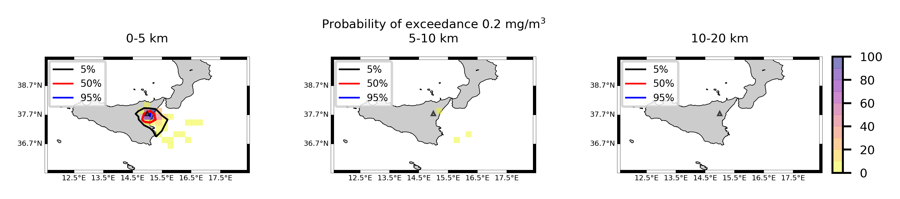
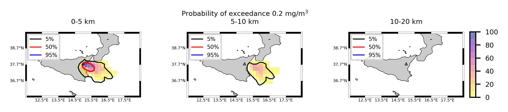

Forecast from VONA_20210228_0811Z
=================================

Contents
========

* [Forecast products](#forecast-products)
	* [Forecast at 2021-02-28 09:10 Z from RED VONA issued at 20210228_0811Z](#forecast-at-2021-02-28-0910-z-from-red-vona-issued-at-20210228_0811z)
	* [Forecast at 2021-02-28 10:10 Z from RED VONA issued at 20210228_0811Z](#forecast-at-2021-02-28-1010-z-from-red-vona-issued-at-20210228_0811z)
	* [Forecast at 2021-02-28 11:10 Z from RED VONA issued at 20210228_0811Z](#forecast-at-2021-02-28-1110-z-from-red-vona-issued-at-20210228_0811z)
	* [Forecast at 2021-02-28 14:10 Z from RED VONA issued at 20210228_0811Z](#forecast-at-2021-02-28-1410-z-from-red-vona-issued-at-20210228_0811z)
	* [Forecast at 2021-02-28 09:40 Z from RED VONA issued at 20210228_0835Z](#forecast-at-2021-02-28-0940-z-from-red-vona-issued-at-20210228_0835z)
	* [Forecast at 2021-02-28 10:40 Z from RED VONA issued at 20210228_0835Z](#forecast-at-2021-02-28-1040-z-from-red-vona-issued-at-20210228_0835z)
	* [Forecast at 2021-02-28 11:40 Z from RED VONA issued at 20210228_0835Z](#forecast-at-2021-02-28-1140-z-from-red-vona-issued-at-20210228_0835z)
	* [Forecast at 2021-02-28 14:40 Z from RED VONA issued at 20210228_0835Z](#forecast-at-2021-02-28-1440-z-from-red-vona-issued-at-20210228_0835z)
	* [Forecast at 2021-02-28 17:40 Z from RED VONA issued at 20210228_0835Z](#forecast-at-2021-02-28-1740-z-from-red-vona-issued-at-20210228_0835z)
	* [Forecast at 2021-02-28 20:40 Z from RED VONA issued at 20210228_0835Z](#forecast-at-2021-02-28-2040-z-from-red-vona-issued-at-20210228_0835z)
	* [Forecast at 2021-02-28 11:50 Z from RED VONA issued at 20210228_1047Z](#forecast-at-2021-02-28-1150-z-from-red-vona-issued-at-20210228_1047z)
	* [Forecast at 2021-02-28 12:50 Z from RED VONA issued at 20210228_1047Z](#forecast-at-2021-02-28-1250-z-from-red-vona-issued-at-20210228_1047z)
	* [Forecast at 2021-02-28 13:50 Z from RED VONA issued at 20210228_1047Z](#forecast-at-2021-02-28-1350-z-from-red-vona-issued-at-20210228_1047z)
	* [Forecast at 2021-02-28 16:50 Z from RED VONA issued at 20210228_1047Z](#forecast-at-2021-02-28-1650-z-from-red-vona-issued-at-20210228_1047z)

# Forecast products

## Forecast at 2021-02-28 09:10 Z from RED VONA issued at 20210228_0811Z
  

|Eruption start [Z]|Eruption end [Z]|Forecast time [Z]|Column height asl [m]|
| :--- | :--- | :--- | :--- |
|2021-02-28 08:10:00|Ongoing|2021-02-28 09:10:00|6000 ± 500 - from VONA|
  
  

|Percentile|MER [kg/s¹]|Mass air [kg]|Mass air nested dom. [kg]|Mass grd [kg]|Mass grd nested dom. [kg]|
| :--- | :--- | :--- | :--- | :--- | :--- |
|5th|2.79e+03|3.12e+06|3.12e+06|8.67e+06|8.67e+06|
|50th|1.71e+04|1.86e+07|1.86e+07|4.25e+07|4.25e+07|
|95th|3.57e+04|3.78e+07|3.78e+07|8.83e+07|8.82e+07|
  

### Ground Nested Domain 2021-02-28 09:10 Z
  
  
  
  
  
  
  
  
  
  
  
  
  
  
  
  

|Location|Ground load [kg/m²] 5th perc|Ground load [kg/m²] 50th perc|Ground load [kg/m²] 95th perc|
| :--- | :--- | :--- | :--- |
|Sarro (1)|0.00e+00|0.00e+00|1.55e-04|
|Airone (2)|0.00e+00|5.70e-06|2.58e-03|
|Zafferana Ingresso (3)|0.00e+00|0.00e+00|3.76e-04|
|Zafferana Rotonda (4)|0.00e+00|0.00e+00|1.14e-03|
|Petrulli (5)|0.00e+00|0.00e+00|2.18e-03|
|Milo (6)|0.00e+00|0.00e+00|1.94e-02|
|Fornazzo (7)|0.00e+00|0.00e+00|3.08e-02|
|Rinuccio (8)|0.00e+00|0.00e+00|3.87e-02|
|S. Alfio (9)|0.00e+00|0.00e+00|1.51e-03|
|Macchia (10)|0.00e+00|0.00e+00|5.67e-05|
|S. Venerina (11)|0.00e+00|0.00e+00|2.51e-05|
|Linera (12)|0.00e+00|0.00e+00|0.00e+00|
|Dagala chiesa S. Maria (13)|0.00e+00|0.00e+00|3.08e-04|
|Giarre Piazza Maccheroni (14)|0.00e+00|0.00e+00|0.00e+00|
|Milo parco (15)|0.00e+00|0.00e+00|1.11e-02|
  

### Atmosphere 2021-02-28 09:10 Z
  

## Forecast at 2021-02-28 10:10 Z from RED VONA issued at 20210228_0811Z
  

|Eruption start [Z]|Eruption end [Z]|Forecast time [Z]|Column height asl [m]|
| :--- | :--- | :--- | :--- |
|2021-02-28 08:10:00|Ongoing|2021-02-28 10:10:00|6000 ± 500 - from VONA|
  
  

|Percentile|MER [kg/s¹]|Mass air [kg]|Mass air nested dom. [kg]|Mass grd [kg]|Mass grd nested dom. [kg]|
| :--- | :--- | :--- | :--- | :--- | :--- |
|5th|4.45e+03|1.16e+07|1.16e+07|5.64e+07|5.64e+07|
|50th|1.91e+04|3.06e+07|3.06e+07|9.25e+07|9.25e+07|
|95th|3.56e+04|5.23e+07|5.22e+07|1.84e+08|1.84e+08|
  

### Ground Nested Domain 2021-02-28 10:10 Z
  
  
  
  
  
  
  
  
  
  
  
  
  
  
  
  

|Location|Ground load [kg/m²] 5th perc|Ground load [kg/m²] 50th perc|Ground load [kg/m²] 95th perc|
| :--- | :--- | :--- | :--- |
|Sarro (1)|0.00e+00|5.30e-04|1.80e-02|
|Airone (2)|0.00e+00|2.99e-03|2.29e-02|
|Zafferana Ingresso (3)|0.00e+00|1.21e-03|1.52e-02|
|Zafferana Rotonda (4)|0.00e+00|1.30e-03|4.87e-02|
|Petrulli (5)|0.00e+00|5.05e-04|6.00e-02|
|Milo (6)|0.00e+00|3.04e-05|8.10e-02|
|Fornazzo (7)|0.00e+00|7.73e-06|1.90e-01|
|Rinuccio (8)|0.00e+00|1.16e-05|4.08e-01|
|S. Alfio (9)|0.00e+00|0.00e+00|1.98e-02|
|Macchia (10)|0.00e+00|0.00e+00|3.57e-03|
|S. Venerina (11)|0.00e+00|7.19e-07|3.65e-03|
|Linera (12)|0.00e+00|0.00e+00|6.72e-04|
|Dagala chiesa S. Maria (13)|0.00e+00|4.03e-06|1.21e-02|
|Giarre Piazza Maccheroni (14)|0.00e+00|0.00e+00|2.66e-04|
|Milo parco (15)|0.00e+00|1.47e-05|7.68e-02|
  

### Atmosphere 2021-02-28 10:10 Z
  

## Forecast at 2021-02-28 11:10 Z from RED VONA issued at 20210228_0811Z
  

|Eruption start [Z]|Eruption end [Z]|Forecast time [Z]|Column height asl [m]|
| :--- | :--- | :--- | :--- |
|2021-02-28 08:10:00|Ongoing|2021-02-28 11:10:00|6000 ± 500 - from VONA|
  
  

|Percentile|MER [kg/s¹]|Mass air [kg]|Mass air nested dom. [kg]|Mass grd [kg]|Mass grd nested dom. [kg]|
| :--- | :--- | :--- | :--- | :--- | :--- |
|5th|5.36e+03|1.04e+07|1.04e+07|9.71e+07|9.71e+07|
|50th|1.65e+04|2.92e+07|2.91e+07|1.60e+08|1.60e+08|
|95th|3.39e+04|6.88e+07|6.87e+07|2.34e+08|2.34e+08|
  

### Ground Nested Domain 2021-02-28 11:10 Z
  
  
  
  
  
  
  
  
  
  
  
  
  
  
  
  

|Location|Ground load [kg/m²] 5th perc|Ground load [kg/m²] 50th perc|Ground load [kg/m²] 95th perc|
| :--- | :--- | :--- | :--- |
|Sarro (1)|0.00e+00|3.70e-03|5.86e-01|
|Airone (2)|5.50e-05|8.29e-03|6.09e-01|
|Zafferana Ingresso (3)|0.00e+00|2.49e-03|3.79e-01|
|Zafferana Rotonda (4)|3.13e-05|6.40e-03|2.29e-01|
|Petrulli (5)|1.15e-05|3.23e-03|2.32e-01|
|Milo (6)|0.00e+00|7.24e-04|1.84e-01|
|Fornazzo (7)|0.00e+00|1.06e-03|2.71e-01|
|Rinuccio (8)|0.00e+00|1.58e-03|5.28e-01|
|S. Alfio (9)|0.00e+00|2.43e-06|4.34e-02|
|Macchia (10)|0.00e+00|2.24e-05|1.04e-02|
|S. Venerina (11)|0.00e+00|2.03e-04|6.28e-02|
|Linera (12)|0.00e+00|3.07e-05|4.99e-02|
|Dagala chiesa S. Maria (13)|0.00e+00|4.44e-04|1.48e-01|
|Giarre Piazza Maccheroni (14)|0.00e+00|1.09e-07|3.25e-03|
|Milo parco (15)|0.00e+00|7.04e-04|1.74e-01|
  

### Atmosphere 2021-02-28 11:10 Z
  

## Forecast at 2021-02-28 14:10 Z from RED VONA issued at 20210228_0811Z
  

|Eruption start [Z]|Eruption end [Z]|Forecast time [Z]|Column height asl [m]|
| :--- | :--- | :--- | :--- |
|2021-02-28 08:10:00|Ongoing|2021-02-28 14:10:00|6000 ± 500 - from VONA|
  
  

|Percentile|MER [kg/s¹]|Mass air [kg]|Mass air nested dom. [kg]|Mass grd [kg]|Mass grd nested dom. [kg]|
| :--- | :--- | :--- | :--- | :--- | :--- |
|5th|4.54e+03|1.28e+07|1.28e+07|1.86e+08|1.86e+08|
|50th|2.53e+04|5.19e+07|5.15e+07|4.10e+08|4.10e+08|
|95th|4.76e+04|1.50e+08|1.49e+08|5.35e+08|5.34e+08|
  

### Ground Nested Domain 2021-02-28 14:10 Z
  
  
  
  
  
  
  
  
  
  
  
  
  
  
  
  

|Location|Ground load [kg/m²] 5th perc|Ground load [kg/m²] 50th perc|Ground load [kg/m²] 95th perc|
| :--- | :--- | :--- | :--- |
|Sarro (1)|2.45e-04|3.65e-02|8.16e-01|
|Airone (2)|4.48e-03|6.59e-02|1.66e+00|
|Zafferana Ingresso (3)|1.74e-04|4.50e-02|1.07e+00|
|Zafferana Rotonda (4)|1.38e-04|5.55e-02|1.02e+00|
|Petrulli (5)|8.45e-04|2.93e-02|8.14e-01|
|Milo (6)|9.21e-05|3.15e-02|1.38e+00|
|Fornazzo (7)|0.00e+00|3.54e-02|2.25e+00|
|Rinuccio (8)|0.00e+00|4.94e-02|2.24e+00|
|S. Alfio (9)|0.00e+00|4.65e-03|5.25e-01|
|Macchia (10)|0.00e+00|7.14e-03|3.32e-01|
|S. Venerina (11)|2.16e-06|1.50e-02|2.33e-01|
|Linera (12)|2.82e-06|8.81e-03|2.97e+00|
|Dagala chiesa S. Maria (13)|4.02e-05|1.67e-02|4.68e-01|
|Giarre Piazza Maccheroni (14)|0.00e+00|2.39e-03|1.38e-01|
|Milo parco (15)|9.26e-05|1.80e-02|1.40e+00|
  

### Atmosphere 2021-02-28 14:10 Z
  

## Forecast at 2021-02-28 09:40 Z from RED VONA issued at 20210228_0835Z
  

|Eruption start [Z]|Eruption end [Z]|Forecast time [Z]|Column height asl [m]|
| :--- | :--- | :--- | :--- |
|2021-02-28 08:10:00|Ongoing|2021-02-28 09:40:00|9000 ± 500 - from VONA|
  
  

|Percentile|MER [kg/s¹]|Mass air [kg]|Mass air nested dom. [kg]|Mass grd [kg]|Mass grd nested dom. [kg]|
| :--- | :--- | :--- | :--- | :--- | :--- |
|5th|2.90e+04|5.59e+07|5.59e+07|9.82e+07|9.82e+07|
|50th|2.34e+05|2.98e+08|2.89e+08|6.24e+08|6.23e+08|
|95th|6.14e+05|1.00e+09|1.00e+09|1.21e+09|1.21e+09|
  

### Ground Nested Domain 2021-02-28 09:40 Z
  
  
  
  
  
  
  
  
  
  
  
  
  
  
  
  

|Location|Ground load [kg/m²] 5th perc|Ground load [kg/m²] 50th perc|Ground load [kg/m²] 95th perc|
| :--- | :--- | :--- | :--- |
|Sarro (1)|2.41e-02|1.57e+00|6.32e+00|
|Airone (2)|5.99e-02|1.38e+00|6.65e+00|
|Zafferana Ingresso (3)|3.31e-02|1.25e+00|6.12e+00|
|Zafferana Rotonda (4)|3.16e-02|1.23e+00|5.75e+00|
|Petrulli (5)|2.14e-02|9.30e-01|4.72e+00|
|Milo (6)|2.17e-02|8.14e-01|4.08e+00|
|Fornazzo (7)|1.52e-02|6.73e-01|4.53e+00|
|Rinuccio (8)|1.93e-02|7.38e-01|3.32e+00|
|S. Alfio (9)|6.83e-04|3.37e-01|5.60e+00|
|Macchia (10)|7.57e-05|2.82e-01|4.97e+00|
|S. Venerina (11)|1.86e-03|4.36e-01|3.46e+00|
|Linera (12)|7.45e-04|6.45e-01|3.36e+00|
|Dagala chiesa S. Maria (13)|1.94e-03|5.52e-01|4.30e+00|
|Giarre Piazza Maccheroni (14)|0.00e+00|7.34e-02|3.28e+00|
|Milo parco (15)|1.84e-02|8.00e-01|4.17e+00|
  

### Atmosphere 2021-02-28 09:40 Z
  

## Forecast at 2021-02-28 10:40 Z from RED VONA issued at 20210228_0835Z
  

|Eruption start [Z]|Eruption end [Z]|Forecast time [Z]|Column height asl [m]|
| :--- | :--- | :--- | :--- |
|2021-02-28 08:10:00|Ongoing|2021-02-28 10:40:00|9000 ± 500 - from VONA|
  
  

|Percentile|MER [kg/s¹]|Mass air [kg]|Mass air nested dom. [kg]|Mass grd [kg]|Mass grd nested dom. [kg]|
| :--- | :--- | :--- | :--- | :--- | :--- |
|5th|8.68e+04|2.04e+08|2.04e+08|5.16e+08|5.15e+08|
|50th|1.95e+05|3.94e+08|3.93e+08|1.30e+09|1.30e+09|
|95th|5.50e+05|1.13e+09|1.03e+09|2.17e+09|2.17e+09|
  

### Ground Nested Domain 2021-02-28 10:40 Z
  
  
  
  
  
  
  
  
  
  
  
  
  
  
  
  

|Location|Ground load [kg/m²] 5th perc|Ground load [kg/m²] 50th perc|Ground load [kg/m²] 95th perc|
| :--- | :--- | :--- | :--- |
|Sarro (1)|5.61e-01|3.72e+00|1.10e+01|
|Airone (2)|6.94e-01|3.80e+00|1.20e+01|
|Zafferana Ingresso (3)|5.12e-01|3.81e+00|1.13e+01|
|Zafferana Rotonda (4)|5.69e-01|3.48e+00|1.06e+01|
|Petrulli (5)|9.45e-01|2.95e+00|7.44e+00|
|Milo (6)|4.82e-01|2.76e+00|6.63e+00|
|Fornazzo (7)|5.48e-01|2.27e+00|5.76e+00|
|Rinuccio (8)|7.18e-01|2.50e+00|4.36e+00|
|S. Alfio (9)|1.43e-01|1.20e+00|7.51e+00|
|Macchia (10)|6.89e-02|1.64e+00|6.90e+00|
|S. Venerina (11)|2.77e-01|3.18e+00|6.81e+00|
|Linera (12)|9.25e-02|2.97e+00|5.98e+00|
|Dagala chiesa S. Maria (13)|2.93e-01|2.69e+00|6.82e+00|
|Giarre Piazza Maccheroni (14)|2.33e-02|7.42e-01|5.27e+00|
|Milo parco (15)|4.49e-01|2.73e+00|6.72e+00|
  

### Atmosphere 2021-02-28 10:40 Z
  

## Forecast at 2021-02-28 11:40 Z from RED VONA issued at 20210228_0835Z
  

|Eruption start [Z]|Eruption end [Z]|Forecast time [Z]|Column height asl [m]|
| :--- | :--- | :--- | :--- |
|2021-02-28 08:10:00|Ongoing|2021-02-28 11:40:00|9000 ± 500 - from VONA|
  
  

|Percentile|MER [kg/s¹]|Mass air [kg]|Mass air nested dom. [kg]|Mass grd [kg]|Mass grd nested dom. [kg]|
| :--- | :--- | :--- | :--- | :--- | :--- |
|5th|3.27e+04|1.94e+08|1.89e+08|1.12e+09|1.11e+09|
|50th|2.38e+05|4.38e+08|4.09e+08|1.81e+09|1.80e+09|
|95th|6.29e+05|1.78e+09|1.26e+09|3.85e+09|3.83e+09|
  

### Ground Nested Domain 2021-02-28 11:40 Z
  
  
  
  
  
  
  
  
  
  
  
  
  
  
  
  

|Location|Ground load [kg/m²] 5th perc|Ground load [kg/m²] 50th perc|Ground load [kg/m²] 95th perc|
| :--- | :--- | :--- | :--- |
|Sarro (1)|2.40e+00|6.34e+00|1.29e+01|
|Airone (2)|2.59e+00|7.07e+00|1.66e+01|
|Zafferana Ingresso (3)|2.44e+00|6.81e+00|1.47e+01|
|Zafferana Rotonda (4)|2.61e+00|6.95e+00|1.39e+01|
|Petrulli (5)|1.49e+00|6.49e+00|1.22e+01|
|Milo (6)|1.51e+00|5.10e+00|9.29e+00|
|Fornazzo (7)|1.06e+00|4.07e+00|7.71e+00|
|Rinuccio (8)|1.12e+00|3.98e+00|7.02e+00|
|S. Alfio (9)|4.50e-01|3.58e+00|8.49e+00|
|Macchia (10)|4.90e-01|3.59e+00|7.81e+00|
|S. Venerina (11)|6.95e-01|4.24e+00|9.95e+00|
|Linera (12)|1.36e+00|3.76e+00|8.60e+00|
|Dagala chiesa S. Maria (13)|7.01e-01|4.26e+00|9.59e+00|
|Giarre Piazza Maccheroni (14)|1.84e-01|2.74e+00|5.81e+00|
|Milo parco (15)|1.44e+00|5.25e+00|9.22e+00|
  

### Atmosphere 2021-02-28 11:40 Z
  

## Forecast at 2021-02-28 14:40 Z from RED VONA issued at 20210228_0835Z
  

|Eruption start [Z]|Eruption end [Z]|Forecast time [Z]|Column height asl [m]|
| :--- | :--- | :--- | :--- |
|2021-02-28 08:10:00|Ongoing|2021-02-28 14:40:00|9000 ± 500 - from VONA|
  
  

|Percentile|MER [kg/s¹]|Mass air [kg]|Mass air nested dom. [kg]|Mass grd [kg]|Mass grd nested dom. [kg]|
| :--- | :--- | :--- | :--- | :--- | :--- |
|5th|3.54e+04|2.06e+08|1.76e+08|2.33e+09|2.32e+09|
|50th|2.16e+05|6.73e+08|5.62e+08|4.45e+09|4.42e+09|
|95th|5.38e+05|2.16e+09|1.54e+09|6.58e+09|6.53e+09|
  

### Ground Nested Domain 2021-02-28 14:40 Z
  
  
  
  
  
  
  
  
  
  
  
  
  
  
  
  

|Location|Ground load [kg/m²] 5th perc|Ground load [kg/m²] 50th perc|Ground load [kg/m²] 95th perc|
| :--- | :--- | :--- | :--- |
|Sarro (1)|3.56e+00|1.28e+01|2.21e+01|
|Airone (2)|3.24e+00|1.48e+01|2.21e+01|
|Zafferana Ingresso (3)|3.30e+00|1.37e+01|2.02e+01|
|Zafferana Rotonda (4)|3.33e+00|1.32e+01|2.03e+01|
|Petrulli (5)|4.00e+00|1.23e+01|1.95e+01|
|Milo (6)|1.85e+00|1.08e+01|2.16e+01|
|Fornazzo (7)|1.35e+00|8.74e+00|1.77e+01|
|Rinuccio (8)|1.33e+00|8.72e+00|1.63e+01|
|S. Alfio (9)|5.06e-01|5.75e+00|1.78e+01|
|Macchia (10)|6.49e-01|6.28e+00|1.91e+01|
|S. Venerina (11)|1.83e+00|8.66e+00|1.64e+01|
|Linera (12)|1.64e+00|7.63e+00|1.69e+01|
|Dagala chiesa S. Maria (13)|1.11e+00|9.16e+00|1.70e+01|
|Giarre Piazza Maccheroni (14)|2.24e-01|3.81e+00|1.39e+01|
|Milo parco (15)|1.76e+00|1.06e+01|2.19e+01|
  

### Atmosphere 2021-02-28 14:40 Z
  

## Forecast at 2021-02-28 17:40 Z from RED VONA issued at 20210228_0835Z
  

|Eruption start [Z]|Eruption end [Z]|Forecast time [Z]|Column height asl [m]|
| :--- | :--- | :--- | :--- |
|2021-02-28 08:10:00|Ongoing|2021-02-28 17:40:00|9000 ± 500 - from VONA|
  
  

|Percentile|MER [kg/s¹]|Mass air [kg]|Mass air nested dom. [kg]|Mass grd [kg]|Mass grd nested dom. [kg]|
| :--- | :--- | :--- | :--- | :--- | :--- |
|5th|5.67e+04|2.26e+08|2.00e+08|4.04e+09|4.03e+09|
|50th|1.97e+05|6.98e+08|5.86e+08|6.98e+09|6.60e+09|
|95th|7.65e+05|2.65e+09|1.65e+09|1.52e+10|1.40e+10|
  

### Ground Nested Domain 2021-02-28 17:40 Z
  
  
  
  
  
  
  
  
  
  
  
  
  
  
  
  

|Location|Ground load [kg/m²] 5th perc|Ground load [kg/m²] 50th perc|Ground load [kg/m²] 95th perc|
| :--- | :--- | :--- | :--- |
|Sarro (1)|1.02e+01|1.79e+01|3.29e+01|
|Airone (2)|8.44e+00|2.12e+01|3.12e+01|
|Zafferana Ingresso (3)|6.60e+00|2.03e+01|3.09e+01|
|Zafferana Rotonda (4)|5.64e+00|2.02e+01|2.92e+01|
|Petrulli (5)|6.11e+00|1.99e+01|2.72e+01|
|Milo (6)|3.88e+00|1.50e+01|2.41e+01|
|Fornazzo (7)|2.37e+00|1.10e+01|1.98e+01|
|Rinuccio (8)|2.87e+00|1.03e+01|1.91e+01|
|S. Alfio (9)|1.13e+00|1.07e+01|2.19e+01|
|Macchia (10)|1.20e+00|1.02e+01|2.14e+01|
|S. Venerina (11)|3.25e+00|1.65e+01|2.27e+01|
|Linera (12)|2.54e+00|1.11e+01|2.79e+01|
|Dagala chiesa S. Maria (13)|4.00e+00|1.75e+01|2.06e+01|
|Giarre Piazza Maccheroni (14)|4.73e-01|6.06e+00|1.89e+01|
|Milo parco (15)|3.86e+00|1.51e+01|2.43e+01|
  

### Atmosphere 2021-02-28 17:40 Z
  

## Forecast at 2021-02-28 20:40 Z from RED VONA issued at 20210228_0835Z
  

|Eruption start [Z]|Eruption end [Z]|Forecast time [Z]|Column height asl [m]|
| :--- | :--- | :--- | :--- |
|2021-02-28 08:10:00|Ongoing|2021-02-28 20:40:00|9000 ± 500 - from VONA|
  
  

|Percentile|MER [kg/s¹]|Mass air [kg]|Mass air nested dom. [kg]|Mass grd [kg]|Mass grd nested dom. [kg]|
| :--- | :--- | :--- | :--- | :--- | :--- |
|5th|4.09e+04|3.31e+08|2.62e+08|4.93e+09|4.89e+09|
|50th|2.25e+05|1.03e+09|6.73e+08|1.00e+10|9.70e+09|
|95th|6.18e+05|2.85e+09|1.74e+09|1.96e+10|1.77e+10|
  

### Ground Nested Domain 2021-02-28 20:40 Z
  
  
  
  
  
  
  
  
  
  
  
  
  
  
  
  

|Location|Ground load [kg/m²] 5th perc|Ground load [kg/m²] 50th perc|Ground load [kg/m²] 95th perc|
| :--- | :--- | :--- | :--- |
|Sarro (1)|1.48e+01|2.76e+01|4.71e+01|
|Airone (2)|1.86e+01|2.90e+01|4.16e+01|
|Zafferana Ingresso (3)|1.82e+01|2.60e+01|4.17e+01|
|Zafferana Rotonda (4)|1.98e+01|2.61e+01|3.79e+01|
|Petrulli (5)|1.65e+01|2.62e+01|3.42e+01|
|Milo (6)|1.08e+01|2.21e+01|3.07e+01|
|Fornazzo (7)|8.05e+00|1.70e+01|2.59e+01|
|Rinuccio (8)|9.15e+00|1.70e+01|2.61e+01|
|S. Alfio (9)|5.68e+00|1.28e+01|3.28e+01|
|Macchia (10)|4.53e+00|1.37e+01|3.00e+01|
|S. Venerina (11)|8.98e+00|1.90e+01|3.25e+01|
|Linera (12)|7.59e+00|1.61e+01|3.26e+01|
|Dagala chiesa S. Maria (13)|8.63e+00|2.03e+01|3.39e+01|
|Giarre Piazza Maccheroni (14)|3.06e+00|9.10e+00|2.12e+01|
|Milo parco (15)|1.06e+01|2.23e+01|3.06e+01|
  

### Atmosphere 2021-02-28 20:40 Z
  

## Forecast at 2021-02-28 11:50 Z from RED VONA issued at 20210228_1047Z
  

|Eruption start [Z]|Eruption end [Z]|Forecast time [Z]|Column height asl [m]|
| :--- | :--- | :--- | :--- |
|2021-02-28 08:10:00|Ongoing|2021-02-28 11:50:00|4500 ± 500 - from VONA|
  
  

|Percentile|MER [kg/s¹]|Mass air [kg]|Mass air nested dom. [kg]|Mass grd [kg]|Mass grd nested dom. [kg]|
| :--- | :--- | :--- | :--- | :--- | :--- |
|5th|2.02e+02|5.96e+07|5.60e+07|7.44e+08|7.43e+08|
|50th|1.07e+03|1.96e+08|1.70e+08|1.67e+09|1.66e+09|
|95th|9.97e+03|6.27e+08|4.91e+08|2.82e+09|2.81e+09|
  

### Ground Nested Domain 2021-02-28 11:50 Z
  
  
  
  
  
  
  
  
  
  
  
  
  
  
  
  

|Location|Ground load [kg/m²] 5th perc|Ground load [kg/m²] 50th perc|Ground load [kg/m²] 95th perc|
| :--- | :--- | :--- | :--- |
|Sarro (1)|1.38e+00|4.66e+00|1.24e+01|
|Airone (2)|2.06e+00|5.45e+00|1.44e+01|
|Zafferana Ingresso (3)|1.77e+00|5.10e+00|1.33e+01|
|Zafferana Rotonda (4)|1.87e+00|4.97e+00|1.25e+01|
|Petrulli (5)|1.39e+00|4.20e+00|9.64e+00|
|Milo (6)|1.59e+00|3.31e+00|8.23e+00|
|Fornazzo (7)|1.04e+00|2.97e+00|6.37e+00|
|Rinuccio (8)|1.08e+00|3.22e+00|5.67e+00|
|S. Alfio (9)|4.61e-01|1.79e+00|7.60e+00|
|Macchia (10)|5.37e-01|2.10e+00|7.15e+00|
|S. Venerina (11)|6.56e-01|3.58e+00|7.97e+00|
|Linera (12)|8.67e-01|3.35e+00|7.73e+00|
|Dagala chiesa S. Maria (13)|6.82e-01|3.25e+00|8.22e+00|
|Giarre Piazza Maccheroni (14)|1.86e-01|1.38e+00|5.37e+00|
|Milo parco (15)|1.57e+00|3.26e+00|8.35e+00|
  

### Atmosphere 2021-02-28 11:50 Z
  

## Forecast at 2021-02-28 12:50 Z from RED VONA issued at 20210228_1047Z
  

|Eruption start [Z]|Eruption end [Z]|Forecast time [Z]|Column height asl [m]|
| :--- | :--- | :--- | :--- |
|2021-02-28 08:10:00|Ongoing|2021-02-28 12:50:00|4500 ± 500 - from VONA|
  
  

|Percentile|MER [kg/s¹]|Mass air [kg]|Mass air nested dom. [kg]|Mass grd [kg]|Mass grd nested dom. [kg]|
| :--- | :--- | :--- | :--- | :--- | :--- |
|5th|1.08e+02|3.73e+07|2.78e+07|7.61e+08|7.60e+08|
|50th|1.78e+03|1.08e+08|7.96e+07|1.75e+09|1.74e+09|
|95th|1.61e+04|4.85e+08|2.60e+08|2.96e+09|2.92e+09|
  

### Ground Nested Domain 2021-02-28 12:50 Z
  
  
  
  
  
  
  
  
  
  
  
  
  
  
  
  

|Location|Ground load [kg/m²] 5th perc|Ground load [kg/m²] 50th perc|Ground load [kg/m²] 95th perc|
| :--- | :--- | :--- | :--- |
|Sarro (1)|1.43e+00|4.71e+00|1.25e+01|
|Airone (2)|2.08e+00|5.50e+00|1.45e+01|
|Zafferana Ingresso (3)|1.80e+00|5.13e+00|1.36e+01|
|Zafferana Rotonda (4)|1.90e+00|4.99e+00|1.31e+01|
|Petrulli (5)|1.44e+00|4.21e+00|9.67e+00|
|Milo (6)|1.59e+00|3.38e+00|8.25e+00|
|Fornazzo (7)|1.04e+00|2.99e+00|6.38e+00|
|Rinuccio (8)|1.08e+00|3.23e+00|5.69e+00|
|S. Alfio (9)|4.62e-01|1.82e+00|7.65e+00|
|Macchia (10)|5.54e-01|2.24e+00|7.15e+00|
|S. Venerina (11)|7.26e-01|3.59e+00|8.00e+00|
|Linera (12)|8.83e-01|3.35e+00|7.75e+00|
|Dagala chiesa S. Maria (13)|7.69e-01|3.31e+00|8.22e+00|
|Giarre Piazza Maccheroni (14)|1.91e-01|1.38e+00|5.40e+00|
|Milo parco (15)|1.58e+00|3.32e+00|8.37e+00|
  

### Atmosphere 2021-02-28 12:50 Z
  

## Forecast at 2021-02-28 13:50 Z from RED VONA issued at 20210228_1047Z
  

|Eruption start [Z]|Eruption end [Z]|Forecast time [Z]|Column height asl [m]|
| :--- | :--- | :--- | :--- |
|2021-02-28 08:10:00|Ongoing|2021-02-28 13:50:00|4500 ± 500 - from VONA|
  
  

|Percentile|MER [kg/s¹]|Mass air [kg]|Mass air nested dom. [kg]|Mass grd [kg]|Mass grd nested dom. [kg]|
| :--- | :--- | :--- | :--- | :--- | :--- |
|5th|1.09e+02|2.65e+07|1.77e+07|7.91e+08|7.89e+08|
|50th|3.00e+03|8.27e+07|6.21e+07|1.79e+09|1.78e+09|
|95th|1.95e+04|3.98e+08|2.16e+08|3.04e+09|2.95e+09|
  

### Ground Nested Domain 2021-02-28 13:50 Z
  
  
  
  
  
  
  
  
  
  
  
  
  
  
  
  

|Location|Ground load [kg/m²] 5th perc|Ground load [kg/m²] 50th perc|Ground load [kg/m²] 95th perc|
| :--- | :--- | :--- | :--- |
|Sarro (1)|1.43e+00|4.73e+00|1.25e+01|
|Airone (2)|2.09e+00|5.53e+00|1.45e+01|
|Zafferana Ingresso (3)|1.81e+00|5.13e+00|1.36e+01|
|Zafferana Rotonda (4)|1.90e+00|4.99e+00|1.32e+01|
|Petrulli (5)|1.45e+00|4.21e+00|9.68e+00|
|Milo (6)|1.59e+00|3.39e+00|8.25e+00|
|Fornazzo (7)|1.04e+00|2.99e+00|6.38e+00|
|Rinuccio (8)|1.08e+00|3.23e+00|5.69e+00|
|S. Alfio (9)|4.62e-01|1.83e+00|7.65e+00|
|Macchia (10)|5.55e-01|2.26e+00|7.16e+00|
|S. Venerina (11)|7.53e-01|3.59e+00|8.00e+00|
|Linera (12)|8.83e-01|3.35e+00|7.75e+00|
|Dagala chiesa S. Maria (13)|7.94e-01|3.31e+00|8.24e+00|
|Giarre Piazza Maccheroni (14)|1.92e-01|1.38e+00|5.40e+00|
|Milo parco (15)|1.58e+00|3.33e+00|8.37e+00|
  

### Atmosphere 2021-02-28 13:50 Z
  

## Forecast at 2021-02-28 16:50 Z from RED VONA issued at 20210228_1047Z
  

|Eruption start [Z]|Eruption end [Z]|Forecast time [Z]|Column height asl [m]|
| :--- | :--- | :--- | :--- |
|2021-02-28 08:10:00|Ongoing|2021-02-28 16:50:00|4500 ± 500 - from VONA|
  
  

|Percentile|MER [kg/s¹]|Mass air [kg]|Mass air nested dom. [kg]|Mass grd [kg]|Mass grd nested dom. [kg]|
| :--- | :--- | :--- | :--- | :--- | :--- |
|5th|1.85e+02|8.85e+06|8.03e+06|8.09e+08|8.08e+08|
|50th|1.99e+03|7.00e+07|4.63e+07|1.85e+09|1.83e+09|
|95th|9.33e+03|2.51e+08|1.65e+08|3.76e+09|3.62e+09|
  

### Ground Nested Domain 2021-02-28 16:50 Z
  
  
  
  
  
  
  
  
  
  
  
  
  
  
  
  

|Location|Ground load [kg/m²] 5th perc|Ground load [kg/m²] 50th perc|Ground load [kg/m²] 95th perc|
| :--- | :--- | :--- | :--- |
|Sarro (1)|1.43e+00|4.74e+00|1.28e+01|
|Airone (2)|2.09e+00|5.54e+00|1.59e+01|
|Zafferana Ingresso (3)|1.81e+00|5.13e+00|1.39e+01|
|Zafferana Rotonda (4)|1.90e+00|4.99e+00|1.33e+01|
|Petrulli (5)|1.45e+00|4.21e+00|1.06e+01|
|Milo (6)|1.59e+00|3.39e+00|8.25e+00|
|Fornazzo (7)|1.04e+00|2.99e+00|6.39e+00|
|Rinuccio (8)|1.08e+00|3.23e+00|5.69e+00|
|S. Alfio (9)|4.62e-01|1.83e+00|7.65e+00|
|Macchia (10)|5.55e-01|2.28e+00|7.16e+00|
|S. Venerina (11)|7.56e-01|3.59e+00|8.00e+00|
|Linera (12)|8.85e-01|3.35e+00|7.94e+00|
|Dagala chiesa S. Maria (13)|7.97e-01|3.31e+00|8.24e+00|
|Giarre Piazza Maccheroni (14)|1.93e-01|1.40e+00|5.40e+00|
|Milo parco (15)|1.58e+00|3.33e+00|8.37e+00|
  

### Atmosphere 2021-02-28 16:50 Z
  
  
Go to [Supplementary page](Supplementary_page.md)  
Go to [Main directory](https://github.com/federicapardini/Real_time_ash_forecast)