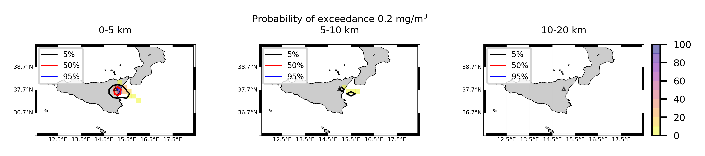
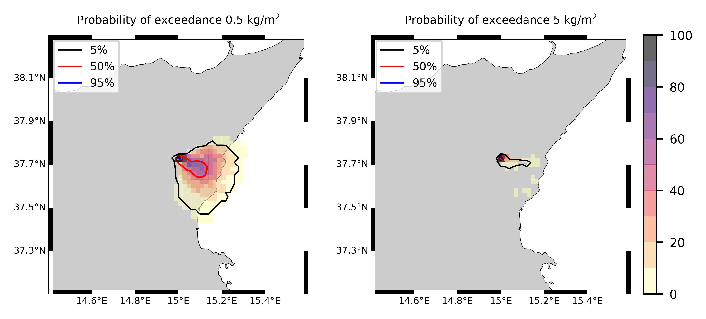
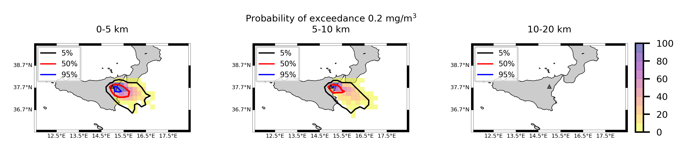
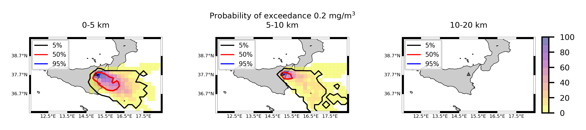
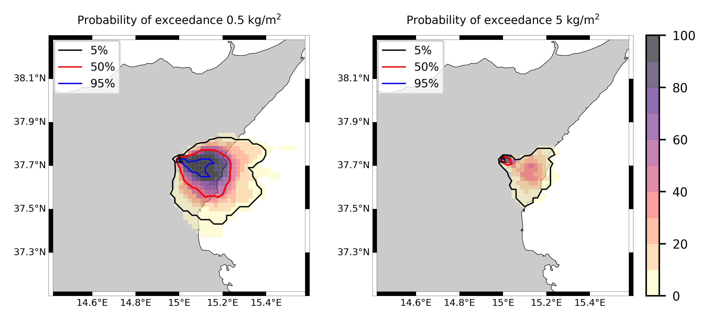
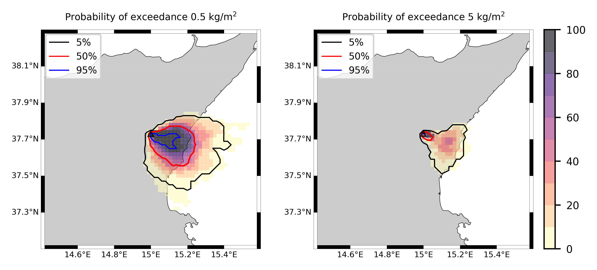
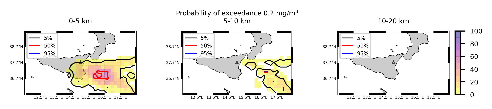

Forecast from VONA_20210228_0811Z
=================================

Contents
========

* [Forecast products](#forecast-products)
	* [Forecast at 2021-02-28 09:10 Z from RED VONA issued at 20210228_0811Z](#forecast-at-2021-02-28-0910-z-from-red-vona-issued-at-20210228_0811z)
	* [Forecast at 2021-02-28 10:10 Z from RED VONA issued at 20210228_0811Z](#forecast-at-2021-02-28-1010-z-from-red-vona-issued-at-20210228_0811z)
	* [Forecast at 2021-02-28 11:10 Z from RED VONA issued at 20210228_0811Z](#forecast-at-2021-02-28-1110-z-from-red-vona-issued-at-20210228_0811z)
	* [Forecast at 2021-02-28 14:10 Z from RED VONA issued at 20210228_0811Z](#forecast-at-2021-02-28-1410-z-from-red-vona-issued-at-20210228_0811z)
	* [Forecast at 2021-02-28 17:10 Z from RED VONA issued at 20210228_0811Z](#forecast-at-2021-02-28-1710-z-from-red-vona-issued-at-20210228_0811z)
	* [Forecast at 2021-02-28 09:40 Z from RED VONA issued at 20210228_0835Z](#forecast-at-2021-02-28-0940-z-from-red-vona-issued-at-20210228_0835z)
	* [Forecast at 2021-02-28 10:40 Z from RED VONA issued at 20210228_0835Z](#forecast-at-2021-02-28-1040-z-from-red-vona-issued-at-20210228_0835z)
	* [Forecast at 2021-02-28 11:40 Z from RED VONA issued at 20210228_0835Z](#forecast-at-2021-02-28-1140-z-from-red-vona-issued-at-20210228_0835z)
	* [Forecast at 2021-02-28 14:40 Z from RED VONA issued at 20210228_0835Z](#forecast-at-2021-02-28-1440-z-from-red-vona-issued-at-20210228_0835z)
	* [Forecast at 2021-02-28 17:40 Z from RED VONA issued at 20210228_0835Z](#forecast-at-2021-02-28-1740-z-from-red-vona-issued-at-20210228_0835z)
	* [Forecast at 2021-02-28 20:40 Z from RED VONA issued at 20210228_0835Z](#forecast-at-2021-02-28-2040-z-from-red-vona-issued-at-20210228_0835z)
	* [Forecast at 2021-02-28 11:50 Z from RED VONA issued at 20210228_1047Z](#forecast-at-2021-02-28-1150-z-from-red-vona-issued-at-20210228_1047z)
	* [Forecast at 2021-02-28 12:50 Z from RED VONA issued at 20210228_1047Z](#forecast-at-2021-02-28-1250-z-from-red-vona-issued-at-20210228_1047z)
	* [Forecast at 2021-02-28 13:50 Z from RED VONA issued at 20210228_1047Z](#forecast-at-2021-02-28-1350-z-from-red-vona-issued-at-20210228_1047z)
	* [Forecast at 2021-02-28 16:50 Z from RED VONA issued at 20210228_1047Z](#forecast-at-2021-02-28-1650-z-from-red-vona-issued-at-20210228_1047z)
	* [Forecast at 2021-02-28 19:50 Z from RED VONA issued at 20210228_1047Z](#forecast-at-2021-02-28-1950-z-from-red-vona-issued-at-20210228_1047z)
	* [Forecast at 2021-02-28 22:50 Z from RED VONA issued at 20210228_1047Z](#forecast-at-2021-02-28-2250-z-from-red-vona-issued-at-20210228_1047z)
	* [Forecast at 2021-02-28 17:30 Z from ORANGE VONA issued at 20210228_1426Z](#forecast-at-2021-02-28-1730-z-from-orange-vona-issued-at-20210228_1426z)
	* [Forecast at 2021-02-28 20:30 Z from ORANGE VONA issued at 20210228_1426Z](#forecast-at-2021-02-28-2030-z-from-orange-vona-issued-at-20210228_1426z)

# Forecast products

## Forecast at 2021-02-28 09:10 Z from RED VONA issued at 20210228_0811Z
  

|Eruption start [Z]|Eruption end [Z]|Forecast time [Z]|Column height asl [m]|
| :--- | :--- | :--- | :--- |
|2021-02-28 08:10:00|Ongoing|2021-02-28 09:10:00|6000 ± 500 - from VONA|
  
  

|Percentile|MER [kg/s¹]|Mass air [kg]|Mass air nested dom. [kg]|Mass grd [kg]|Mass grd nested dom. [kg]|
| :--- | :--- | :--- | :--- | :--- | :--- |
|5th|5.17e+03|4.15e+06|4.15e+06|1.60e+07|1.59e+07|
|50th|1.50e+04|1.71e+07|1.71e+07|3.79e+07|3.79e+07|
|95th|2.98e+04|3.61e+07|3.61e+07|6.27e+07|6.26e+07|
  

### Ground Nested Domain 2021-02-28 09:10 Z
  
  
  
  
  
  
  
  
  
  
  
  
  
  
  
  
  
  
  
  
  
  
  
  
  
  

|Location|Ground load [kg/m²] 5th perc|Ground load [kg/m²] 50th perc|Ground load [kg/m²] 95th perc|
| :--- | :--- | :--- | :--- |
|Catania AP (1)|0.00e+00|0.00e+00|0.00e+00|
|Siracusa (2)|nan|nan|nan|
|Reggio Calabria (3)|nan|nan|nan|
|Palermo (4)|nan|nan|nan|
|Nicolosi (5)|0.00e+00|0.00e+00|2.24e-02|
|Zafferana (6)|0.00e+00|0.00e+00|1.23e-03|
|Linguaglossa (7)|0.00e+00|0.00e+00|0.00e+00|
|Randazzo (8)|0.00e+00|0.00e+00|0.00e+00|
|Bronte (9)|0.00e+00|0.00e+00|0.00e+00|
|Biancavilla (10)|0.00e+00|0.00e+00|0.00e+00|
|Sarro (11)|0.00e+00|0.00e+00|2.69e-03|
|Airone (12)|0.00e+00|5.70e-06|1.29e-02|
|Zafferana Ingresso (13)|0.00e+00|0.00e+00|5.32e-03|
|Zafferana Rotonda (14)|0.00e+00|0.00e+00|8.91e-02|
|Petrulli (15)|0.00e+00|0.00e+00|4.17e-02|
|Milo (16)|0.00e+00|0.00e+00|1.24e-02|
|Fornazzo (17)|0.00e+00|0.00e+00|3.41e-02|
|Rinuccio (18)|0.00e+00|0.00e+00|1.08e-01|
|S. Alfio (19)|0.00e+00|0.00e+00|3.26e-04|
|Macchia (20)|0.00e+00|0.00e+00|0.00e+00|
|S. Venerina (21)|0.00e+00|0.00e+00|6.80e-04|
|Linera (22)|0.00e+00|0.00e+00|1.88e-04|
|Dagala chiesa S. Maria (23)|0.00e+00|0.00e+00|4.13e-04|
|Giarre Piazza Maccheroni (24)|0.00e+00|0.00e+00|0.00e+00|
|Milo parco (25)|0.00e+00|0.00e+00|7.77e-03|
  

### Atmosphere 2021-02-28 09:10 Z
  

## Forecast at 2021-02-28 10:10 Z from RED VONA issued at 20210228_0811Z
  

|Eruption start [Z]|Eruption end [Z]|Forecast time [Z]|Column height asl [m]|
| :--- | :--- | :--- | :--- |
|2021-02-28 08:10:00|Ongoing|2021-02-28 10:10:00|6000 ± 500 - from VONA|
  
  

|Percentile|MER [kg/s¹]|Mass air [kg]|Mass air nested dom. [kg]|Mass grd [kg]|Mass grd nested dom. [kg]|
| :--- | :--- | :--- | :--- | :--- | :--- |
|5th|3.98e+03|5.11e+06|5.11e+06|5.81e+07|5.81e+07|
|50th|1.71e+04|2.58e+07|2.57e+07|9.56e+07|9.55e+07|
|95th|3.86e+04|4.87e+07|4.87e+07|1.53e+08|1.53e+08|
  

### Ground Nested Domain 2021-02-28 10:10 Z
  
  
  
  
  
  
  
  
  
  
  
  
  
  
  
  
  
  
  
  
  
  
  
  
  
  

|Location|Ground load [kg/m²] 5th perc|Ground load [kg/m²] 50th perc|Ground load [kg/m²] 95th perc|
| :--- | :--- | :--- | :--- |
|Catania AP (1)|0.00e+00|0.00e+00|6.90e-04|
|Siracusa (2)|nan|nan|nan|
|Reggio Calabria (3)|nan|nan|nan|
|Palermo (4)|nan|nan|nan|
|Nicolosi (5)|0.00e+00|1.23e-04|1.70e-01|
|Zafferana (6)|0.00e+00|1.34e-03|1.15e-01|
|Linguaglossa (7)|0.00e+00|0.00e+00|9.72e-07|
|Randazzo (8)|0.00e+00|0.00e+00|0.00e+00|
|Bronte (9)|0.00e+00|0.00e+00|0.00e+00|
|Biancavilla (10)|0.00e+00|0.00e+00|1.57e-04|
|Sarro (11)|0.00e+00|7.85e-04|9.10e-02|
|Airone (12)|5.55e-06|4.03e-03|1.35e-01|
|Zafferana Ingresso (13)|0.00e+00|1.30e-03|1.71e-01|
|Zafferana Rotonda (14)|0.00e+00|7.69e-04|2.59e-01|
|Petrulli (15)|0.00e+00|4.23e-04|1.05e-01|
|Milo (16)|0.00e+00|2.56e-05|5.03e-02|
|Fornazzo (17)|0.00e+00|5.80e-05|2.91e-01|
|Rinuccio (18)|0.00e+00|8.69e-05|2.32e-01|
|S. Alfio (19)|0.00e+00|0.00e+00|3.85e-01|
|Macchia (20)|0.00e+00|0.00e+00|1.64e-01|
|S. Venerina (21)|0.00e+00|0.00e+00|1.42e-03|
|Linera (22)|0.00e+00|0.00e+00|1.76e-03|
|Dagala chiesa S. Maria (23)|0.00e+00|0.00e+00|2.35e-03|
|Giarre Piazza Maccheroni (24)|0.00e+00|0.00e+00|3.88e-01|
|Milo parco (25)|0.00e+00|1.45e-05|3.78e-02|
  

### Atmosphere 2021-02-28 10:10 Z
  

## Forecast at 2021-02-28 11:10 Z from RED VONA issued at 20210228_0811Z
  

|Eruption start [Z]|Eruption end [Z]|Forecast time [Z]|Column height asl [m]|
| :--- | :--- | :--- | :--- |
|2021-02-28 08:10:00|Ongoing|2021-02-28 11:10:00|6000 ± 500 - from VONA|
  
  

|Percentile|MER [kg/s¹]|Mass air [kg]|Mass air nested dom. [kg]|Mass grd [kg]|Mass grd nested dom. [kg]|
| :--- | :--- | :--- | :--- | :--- | :--- |
|5th|6.13e+03|9.34e+06|9.33e+06|1.05e+08|1.05e+08|
|50th|1.59e+04|2.49e+07|2.49e+07|1.52e+08|1.52e+08|
|95th|3.78e+04|6.71e+07|6.57e+07|2.45e+08|2.45e+08|
  

### Ground Nested Domain 2021-02-28 11:10 Z
  
  
  
  
  
  
  
  
  
  
  
  
  
  
  
  
  
  
  
  
  
  
  
  
  
  

|Location|Ground load [kg/m²] 5th perc|Ground load [kg/m²] 50th perc|Ground load [kg/m²] 95th perc|
| :--- | :--- | :--- | :--- |
|Catania AP (1)|0.00e+00|0.00e+00|2.48e-03|
|Siracusa (2)|nan|nan|nan|
|Reggio Calabria (3)|nan|nan|nan|
|Palermo (4)|nan|nan|nan|
|Nicolosi (5)|0.00e+00|1.14e-02|3.63e-01|
|Zafferana (6)|4.67e-05|6.91e-03|5.05e-01|
|Linguaglossa (7)|0.00e+00|0.00e+00|1.11e-03|
|Randazzo (8)|0.00e+00|0.00e+00|0.00e+00|
|Bronte (9)|0.00e+00|0.00e+00|0.00e+00|
|Biancavilla (10)|0.00e+00|0.00e+00|5.34e-03|
|Sarro (11)|3.11e-05|5.41e-03|3.06e-01|
|Airone (12)|4.76e-04|2.04e-02|6.55e-01|
|Zafferana Ingresso (13)|1.93e-05|2.76e-03|6.30e-01|
|Zafferana Rotonda (14)|0.00e+00|1.82e-03|5.45e-01|
|Petrulli (15)|0.00e+00|3.24e-03|3.60e-01|
|Milo (16)|0.00e+00|1.60e-03|2.65e-01|
|Fornazzo (17)|0.00e+00|1.63e-03|4.74e-01|
|Rinuccio (18)|0.00e+00|2.23e-03|3.15e-01|
|S. Alfio (19)|0.00e+00|4.61e-05|5.19e-01|
|Macchia (20)|0.00e+00|2.78e-06|2.54e-01|
|S. Venerina (21)|0.00e+00|1.94e-05|2.06e-01|
|Linera (22)|0.00e+00|1.41e-05|8.13e-02|
|Dagala chiesa S. Maria (23)|0.00e+00|9.83e-05|1.14e-01|
|Giarre Piazza Maccheroni (24)|0.00e+00|0.00e+00|3.88e-01|
|Milo parco (25)|0.00e+00|1.38e-03|2.45e-01|
  

### Atmosphere 2021-02-28 11:10 Z
  

## Forecast at 2021-02-28 14:10 Z from RED VONA issued at 20210228_0811Z
  

|Eruption start [Z]|Eruption end [Z]|Forecast time [Z]|Column height asl [m]|
| :--- | :--- | :--- | :--- |
|2021-02-28 08:10:00|Ongoing|2021-02-28 14:10:00|6000 ± 500 - from VONA|
  
  

|Percentile|MER [kg/s¹]|Mass air [kg]|Mass air nested dom. [kg]|Mass grd [kg]|Mass grd nested dom. [kg]|
| :--- | :--- | :--- | :--- | :--- | :--- |
|5th|3.54e+03|1.26e+07|1.25e+07|2.15e+08|2.15e+08|
|50th|2.36e+04|3.85e+07|3.62e+07|3.63e+08|3.62e+08|
|95th|5.24e+04|9.45e+07|8.60e+07|6.61e+08|6.60e+08|
  

### Ground Nested Domain 2021-02-28 14:10 Z
  
  
  
  
  
  
  
  
  
  
  
  
  
  
  
  
  
  
  
  
  
  
  
  
  
  

|Location|Ground load [kg/m²] 5th perc|Ground load [kg/m²] 50th perc|Ground load [kg/m²] 95th perc|
| :--- | :--- | :--- | :--- |
|Catania AP (1)|0.00e+00|3.69e-04|4.63e-02|
|Siracusa (2)|nan|nan|nan|
|Reggio Calabria (3)|nan|nan|nan|
|Palermo (4)|nan|nan|nan|
|Nicolosi (5)|9.13e-03|9.80e-02|8.39e-01|
|Zafferana (6)|3.57e-03|3.08e-02|1.43e+00|
|Linguaglossa (7)|0.00e+00|0.00e+00|2.61e-03|
|Randazzo (8)|0.00e+00|0.00e+00|5.18e-04|
|Bronte (9)|0.00e+00|0.00e+00|5.00e-06|
|Biancavilla (10)|0.00e+00|2.45e-03|1.98e-02|
|Sarro (11)|2.60e-03|6.35e-02|8.41e-01|
|Airone (12)|6.15e-03|9.34e-02|2.59e+00|
|Zafferana Ingresso (13)|2.43e-03|3.48e-02|1.03e+00|
|Zafferana Rotonda (14)|1.90e-03|3.47e-02|9.77e-01|
|Petrulli (15)|6.94e-04|3.31e-02|6.18e-01|
|Milo (16)|0.00e+00|1.63e-02|1.68e+00|
|Fornazzo (17)|0.00e+00|6.18e-03|1.67e+00|
|Rinuccio (18)|0.00e+00|9.62e-03|1.92e+00|
|S. Alfio (19)|0.00e+00|9.60e-04|6.18e-01|
|Macchia (20)|0.00e+00|6.03e-03|1.21e+00|
|S. Venerina (21)|0.00e+00|1.67e-03|5.77e-01|
|Linera (22)|3.65e-05|4.61e-03|1.30e-01|
|Dagala chiesa S. Maria (23)|0.00e+00|5.63e-03|1.17e+00|
|Giarre Piazza Maccheroni (24)|0.00e+00|6.01e-04|8.30e-01|
|Milo parco (25)|0.00e+00|1.64e-02|1.55e+00|
  

### Atmosphere 2021-02-28 14:10 Z
  

## Forecast at 2021-02-28 17:10 Z from RED VONA issued at 20210228_0811Z
  

|Eruption start [Z]|Eruption end [Z]|Forecast time [Z]|Column height asl [m]|
| :--- | :--- | :--- | :--- |
|2021-02-28 08:10:00|Ongoing|2021-02-28 17:10:00|6000 ± 500 - from VONA|
  
  

|Percentile|MER [kg/s¹]|Mass air [kg]|Mass air nested dom. [kg]|Mass grd [kg]|Mass grd nested dom. [kg]|
| :--- | :--- | :--- | :--- | :--- | :--- |
|5th|3.90e+03|1.43e+07|1.09e+07|2.95e+08|2.95e+08|
|50th|1.88e+04|3.24e+07|2.96e+07|6.47e+08|6.47e+08|
|95th|5.12e+04|9.46e+07|8.10e+07|1.01e+09|9.77e+08|
  

### Ground Nested Domain 2021-02-28 17:10 Z
  
  
  
  
  
  
  
  
  
  
  
  
  
  
  
  
  
  
  
  
  
  
  
  
  
  

|Location|Ground load [kg/m²] 5th perc|Ground load [kg/m²] 50th perc|Ground load [kg/m²] 95th perc|
| :--- | :--- | :--- | :--- |
|Catania AP (1)|9.07e-06|2.38e-03|5.33e-02|
|Siracusa (2)|nan|nan|nan|
|Reggio Calabria (3)|nan|nan|nan|
|Palermo (4)|nan|nan|nan|
|Nicolosi (5)|3.75e-02|1.80e-01|8.33e+00|
|Zafferana (6)|3.57e-03|1.33e-01|1.43e+00|
|Linguaglossa (7)|0.00e+00|0.00e+00|2.62e-03|
|Randazzo (8)|0.00e+00|0.00e+00|5.18e-04|
|Bronte (9)|0.00e+00|6.67e-06|5.19e-03|
|Biancavilla (10)|4.32e-04|7.35e-03|8.46e-02|
|Sarro (11)|2.90e-03|1.29e-01|8.56e-01|
|Airone (12)|1.27e-02|5.57e-01|2.64e+00|
|Zafferana Ingresso (13)|2.43e-03|9.04e-02|1.03e+00|
|Zafferana Rotonda (14)|1.90e-03|7.60e-02|1.02e+00|
|Petrulli (15)|6.94e-04|6.49e-02|1.15e+00|
|Milo (16)|0.00e+00|2.33e-02|2.79e+00|
|Fornazzo (17)|0.00e+00|1.33e-02|3.93e+00|
|Rinuccio (18)|0.00e+00|1.42e-02|4.38e+00|
|S. Alfio (19)|0.00e+00|2.00e-03|7.31e-01|
|Macchia (20)|0.00e+00|8.73e-03|1.21e+00|
|S. Venerina (21)|0.00e+00|3.04e-03|6.53e-01|
|Linera (22)|3.65e-05|9.87e-03|2.97e-01|
|Dagala chiesa S. Maria (23)|0.00e+00|2.13e-02|1.18e+00|
|Giarre Piazza Maccheroni (24)|0.00e+00|6.37e-04|8.82e-01|
|Milo parco (25)|0.00e+00|2.24e-02|2.27e+00|
  

### Atmosphere 2021-02-28 17:10 Z
  

## Forecast at 2021-02-28 09:40 Z from RED VONA issued at 20210228_0835Z
  

|Eruption start [Z]|Eruption end [Z]|Forecast time [Z]|Column height asl [m]|
| :--- | :--- | :--- | :--- |
|2021-02-28 08:10:00|Ongoing|2021-02-28 09:40:00|9000 ± 500 - from VONA|
  
  

|Percentile|MER [kg/s¹]|Mass air [kg]|Mass air nested dom. [kg]|Mass grd [kg]|Mass grd nested dom. [kg]|
| :--- | :--- | :--- | :--- | :--- | :--- |
|5th|4.85e+04|9.89e+07|9.88e+07|1.14e+08|1.13e+08|
|50th|1.75e+05|2.78e+08|2.77e+08|4.03e+08|4.02e+08|
|95th|5.94e+05|9.46e+08|9.40e+08|1.07e+09|1.07e+09|
  

### Ground Nested Domain 2021-02-28 09:40 Z
  
  
  
  
  
  
  
  
  
  
  
  
  
  
  
  
  
  
  
  
  
  
  
  
  
  

|Location|Ground load [kg/m²] 5th perc|Ground load [kg/m²] 50th perc|Ground load [kg/m²] 95th perc|
| :--- | :--- | :--- | :--- |
|Catania AP (1)|0.00e+00|0.00e+00|9.61e-01|
|Siracusa (2)|nan|nan|nan|
|Reggio Calabria (3)|nan|nan|nan|
|Palermo (4)|nan|nan|nan|
|Nicolosi (5)|9.50e-05|1.89e-02|1.05e+00|
|Zafferana (6)|1.31e-02|8.86e-01|3.23e+00|
|Linguaglossa (7)|0.00e+00|0.00e+00|2.15e-02|
|Randazzo (8)|0.00e+00|0.00e+00|2.00e-05|
|Bronte (9)|0.00e+00|0.00e+00|0.00e+00|
|Biancavilla (10)|0.00e+00|0.00e+00|5.42e-06|
|Sarro (11)|1.37e-02|9.01e-01|2.59e+00|
|Airone (12)|2.00e-02|9.01e-01|3.38e+00|
|Zafferana Ingresso (13)|2.53e-02|9.09e-01|3.47e+00|
|Zafferana Rotonda (14)|4.79e-02|8.88e-01|3.90e+00|
|Petrulli (15)|4.59e-02|5.80e-01|5.10e+00|
|Milo (16)|9.62e-03|3.75e-01|4.33e+00|
|Fornazzo (17)|4.34e-03|2.51e-01|2.94e+00|
|Rinuccio (18)|4.73e-03|2.70e-01|2.14e+00|
|S. Alfio (19)|2.27e-04|1.53e-01|3.17e+00|
|Macchia (20)|1.92e-04|1.45e-01|3.65e+00|
|S. Venerina (21)|1.29e-02|3.78e-01|3.44e+00|
|Linera (22)|1.61e-02|3.11e-01|2.80e+00|
|Dagala chiesa S. Maria (23)|7.86e-03|3.93e-01|3.68e+00|
|Giarre Piazza Maccheroni (24)|0.00e+00|5.09e-02|2.56e+00|
|Milo parco (25)|9.28e-03|3.95e-01|4.28e+00|
  

### Atmosphere 2021-02-28 09:40 Z
  

## Forecast at 2021-02-28 10:40 Z from RED VONA issued at 20210228_0835Z
  

|Eruption start [Z]|Eruption end [Z]|Forecast time [Z]|Column height asl [m]|
| :--- | :--- | :--- | :--- |
|2021-02-28 08:10:00|Ongoing|2021-02-28 10:40:00|9000 ± 500 - from VONA|
  
  

|Percentile|MER [kg/s¹]|Mass air [kg]|Mass air nested dom. [kg]|Mass grd [kg]|Mass grd nested dom. [kg]|
| :--- | :--- | :--- | :--- | :--- | :--- |
|5th|5.77e+04|1.07e+08|1.07e+08|5.71e+08|5.71e+08|
|50th|2.05e+05|4.27e+08|4.07e+08|1.55e+09|1.55e+09|
|95th|5.05e+05|8.93e+08|8.06e+08|2.50e+09|2.50e+09|
  

### Ground Nested Domain 2021-02-28 10:40 Z
  
  
  
  
  
  
  
  
  
  
  
  
  
  
  
  
  
  
  
  
  
  
  
  
  
  

|Location|Ground load [kg/m²] 5th perc|Ground load [kg/m²] 50th perc|Ground load [kg/m²] 95th perc|
| :--- | :--- | :--- | :--- |
|Catania AP (1)|0.00e+00|1.65e-03|1.58e+00|
|Siracusa (2)|nan|nan|nan|
|Reggio Calabria (3)|nan|nan|nan|
|Palermo (4)|nan|nan|nan|
|Nicolosi (5)|3.90e-04|1.36e-01|2.93e+00|
|Zafferana (6)|4.27e-01|2.78e+00|5.58e+00|
|Linguaglossa (7)|0.00e+00|2.52e-04|1.06e-01|
|Randazzo (8)|0.00e+00|0.00e+00|3.67e-05|
|Bronte (9)|0.00e+00|0.00e+00|0.00e+00|
|Biancavilla (10)|0.00e+00|0.00e+00|1.63e-03|
|Sarro (11)|3.54e-01|2.98e+00|6.33e+00|
|Airone (12)|5.65e-01|2.43e+00|6.01e+00|
|Zafferana Ingresso (13)|3.93e-01|2.39e+00|5.88e+00|
|Zafferana Rotonda (14)|3.71e-01|2.88e+00|6.40e+00|
|Petrulli (15)|2.54e-01|2.34e+00|7.96e+00|
|Milo (16)|2.16e-01|1.58e+00|7.45e+00|
|Fornazzo (17)|1.42e-01|9.51e-01|5.19e+00|
|Rinuccio (18)|1.82e-01|8.63e-01|4.32e+00|
|S. Alfio (19)|3.92e-02|9.99e-01|5.39e+00|
|Macchia (20)|1.60e-02|1.47e+00|5.88e+00|
|S. Venerina (21)|7.69e-02|2.48e+00|5.28e+00|
|Linera (22)|7.12e-02|2.52e+00|6.70e+00|
|Dagala chiesa S. Maria (23)|6.91e-02|2.40e+00|6.49e+00|
|Giarre Piazza Maccheroni (24)|3.76e-03|5.85e-01|4.56e+00|
|Milo parco (25)|2.16e-01|1.61e+00|7.59e+00|
  

### Atmosphere 2021-02-28 10:40 Z
  

## Forecast at 2021-02-28 11:40 Z from RED VONA issued at 20210228_0835Z
  

|Eruption start [Z]|Eruption end [Z]|Forecast time [Z]|Column height asl [m]|
| :--- | :--- | :--- | :--- |
|2021-02-28 08:10:00|Ongoing|2021-02-28 11:40:00|9000 ± 500 - from VONA|
  
  

|Percentile|MER [kg/s¹]|Mass air [kg]|Mass air nested dom. [kg]|Mass grd [kg]|Mass grd nested dom. [kg]|
| :--- | :--- | :--- | :--- | :--- | :--- |
|5th|6.69e+04|1.41e+08|1.41e+08|1.09e+09|1.09e+09|
|50th|2.18e+05|4.57e+08|3.51e+08|2.10e+09|2.10e+09|
|95th|5.89e+05|9.10e+08|9.04e+08|3.81e+09|3.81e+09|
  

### Ground Nested Domain 2021-02-28 11:40 Z
  
  
  
  
  
  
  
  
  
  
  
  
  
  
  
  
  
  
  
  
  
  
  
  
  
  

|Location|Ground load [kg/m²] 5th perc|Ground load [kg/m²] 50th perc|Ground load [kg/m²] 95th perc|
| :--- | :--- | :--- | :--- |
|Catania AP (1)|0.00e+00|2.02e-02|3.72e+00|
|Siracusa (2)|nan|nan|nan|
|Reggio Calabria (3)|nan|nan|nan|
|Palermo (4)|nan|nan|nan|
|Nicolosi (5)|1.92e-02|1.72e-01|3.31e+00|
|Zafferana (6)|1.30e+00|4.44e+00|8.87e+00|
|Linguaglossa (7)|0.00e+00|8.52e-03|1.33e-01|
|Randazzo (8)|0.00e+00|0.00e+00|9.00e-05|
|Bronte (9)|0.00e+00|0.00e+00|0.00e+00|
|Biancavilla (10)|0.00e+00|0.00e+00|1.97e-03|
|Sarro (11)|1.02e+00|5.16e+00|7.77e+00|
|Airone (12)|1.21e+00|4.25e+00|8.56e+00|
|Zafferana Ingresso (13)|1.11e+00|4.15e+00|8.69e+00|
|Zafferana Rotonda (14)|9.70e-01|4.35e+00|8.09e+00|
|Petrulli (15)|9.81e-01|4.19e+00|9.06e+00|
|Milo (16)|7.66e-01|3.06e+00|8.96e+00|
|Fornazzo (17)|3.61e-01|2.45e+00|6.13e+00|
|Rinuccio (18)|3.42e-01|2.48e+00|4.97e+00|
|S. Alfio (19)|2.14e-01|2.45e+00|6.07e+00|
|Macchia (20)|4.01e-01|3.24e+00|7.00e+00|
|S. Venerina (21)|5.30e-01|4.68e+00|9.34e+00|
|Linera (22)|4.71e-01|4.01e+00|8.94e+00|
|Dagala chiesa S. Maria (23)|6.18e-01|4.20e+00|9.22e+00|
|Giarre Piazza Maccheroni (24)|1.65e-01|1.79e+00|7.47e+00|
|Milo parco (25)|7.71e-01|3.12e+00|9.12e+00|
  

### Atmosphere 2021-02-28 11:40 Z
  

## Forecast at 2021-02-28 14:40 Z from RED VONA issued at 20210228_0835Z
  

|Eruption start [Z]|Eruption end [Z]|Forecast time [Z]|Column height asl [m]|
| :--- | :--- | :--- | :--- |
|2021-02-28 08:10:00|Ongoing|2021-02-28 14:40:00|9000 ± 500 - from VONA|
  
  

|Percentile|MER [kg/s¹]|Mass air [kg]|Mass air nested dom. [kg]|Mass grd [kg]|Mass grd nested dom. [kg]|
| :--- | :--- | :--- | :--- | :--- | :--- |
|5th|4.79e+04|1.69e+08|1.08e+08|1.69e+09|1.69e+09|
|50th|1.94e+05|4.68e+08|3.70e+08|4.83e+09|4.75e+09|
|95th|7.15e+05|1.83e+09|1.25e+09|1.01e+10|9.69e+09|
  

### Ground Nested Domain 2021-02-28 14:40 Z
  
  
  
  
  
  
  
  
  
  
  
  
  
  
  
  
  
  
  
  
  
  
  
  
  
  

|Location|Ground load [kg/m²] 5th perc|Ground load [kg/m²] 50th perc|Ground load [kg/m²] 95th perc|
| :--- | :--- | :--- | :--- |
|Catania AP (1)|2.62e-04|1.10e-01|5.51e+00|
|Siracusa (2)|nan|nan|nan|
|Reggio Calabria (3)|nan|nan|nan|
|Palermo (4)|nan|nan|nan|
|Nicolosi (5)|7.45e-02|8.38e-01|4.58e+00|
|Zafferana (6)|3.70e+00|8.86e+00|1.46e+01|
|Linguaglossa (7)|0.00e+00|2.50e-02|2.67e-01|
|Randazzo (8)|0.00e+00|1.67e-05|3.42e-04|
|Bronte (9)|0.00e+00|0.00e+00|3.00e-05|
|Biancavilla (10)|2.25e-05|2.03e-03|1.12e-02|
|Sarro (11)|4.50e+00|9.21e+00|1.55e+01|
|Airone (12)|3.12e+00|8.43e+00|1.36e+01|
|Zafferana Ingresso (13)|3.37e+00|8.55e+00|1.40e+01|
|Zafferana Rotonda (14)|3.32e+00|8.41e+00|1.39e+01|
|Petrulli (15)|3.77e+00|7.74e+00|1.46e+01|
|Milo (16)|2.60e+00|6.90e+00|1.29e+01|
|Fornazzo (17)|1.69e+00|5.94e+00|9.83e+00|
|Rinuccio (18)|1.50e+00|4.93e+00|8.96e+00|
|S. Alfio (19)|1.19e+00|5.67e+00|1.12e+01|
|Macchia (20)|1.26e+00|6.44e+00|1.58e+01|
|S. Venerina (21)|2.89e+00|7.37e+00|1.71e+01|
|Linera (22)|3.21e+00|9.17e+00|2.07e+01|
|Dagala chiesa S. Maria (23)|2.70e+00|7.17e+00|1.61e+01|
|Giarre Piazza Maccheroni (24)|7.37e-01|4.21e+00|1.29e+01|
|Milo parco (25)|2.62e+00|7.03e+00|1.28e+01|
  

### Atmosphere 2021-02-28 14:40 Z
  

## Forecast at 2021-02-28 17:40 Z from RED VONA issued at 20210228_0835Z
  

|Eruption start [Z]|Eruption end [Z]|Forecast time [Z]|Column height asl [m]|
| :--- | :--- | :--- | :--- |
|2021-02-28 08:10:00|Ongoing|2021-02-28 17:40:00|9000 ± 500 - from VONA|
  
  

|Percentile|MER [kg/s¹]|Mass air [kg]|Mass air nested dom. [kg]|Mass grd [kg]|Mass grd nested dom. [kg]|
| :--- | :--- | :--- | :--- | :--- | :--- |
|5th|4.89e+04|2.45e+08|1.79e+08|3.26e+09|3.23e+09|
|50th|2.17e+05|6.06e+08|3.67e+08|7.04e+09|6.82e+09|
|95th|9.82e+05|2.90e+09|1.99e+09|1.35e+10|1.33e+10|
  

### Ground Nested Domain 2021-02-28 17:40 Z
  
  
  
  
  
  
  
  
  
  
  
  
  
  
  
  
  
  
  
  
  
  
  
  
  
  

|Location|Ground load [kg/m²] 5th perc|Ground load [kg/m²] 50th perc|Ground load [kg/m²] 95th perc|
| :--- | :--- | :--- | :--- |
|Catania AP (1)|2.09e-02|5.48e-01|2.00e+01|
|Siracusa (2)|nan|nan|nan|
|Reggio Calabria (3)|nan|nan|nan|
|Palermo (4)|nan|nan|nan|
|Nicolosi (5)|1.14e-01|1.46e+00|1.03e+01|
|Zafferana (6)|6.68e+00|1.50e+01|1.82e+01|
|Linguaglossa (7)|2.43e-03|3.88e-02|6.61e-01|
|Randazzo (8)|0.00e+00|2.00e-05|7.08e-04|
|Bronte (9)|0.00e+00|3.33e-06|1.00e-03|
|Biancavilla (10)|5.31e-04|5.04e-03|3.98e-02|
|Sarro (11)|7.77e+00|1.50e+01|1.99e+01|
|Airone (12)|6.90e+00|1.34e+01|1.85e+01|
|Zafferana Ingresso (13)|7.24e+00|1.43e+01|1.92e+01|
|Zafferana Rotonda (14)|6.68e+00|1.30e+01|2.15e+01|
|Petrulli (15)|5.88e+00|1.24e+01|2.33e+01|
|Milo (16)|3.13e+00|1.04e+01|1.94e+01|
|Fornazzo (17)|1.73e+00|6.53e+00|1.77e+01|
|Rinuccio (18)|1.58e+00|5.61e+00|1.42e+01|
|S. Alfio (19)|1.33e+00|7.58e+00|2.16e+01|
|Macchia (20)|1.94e+00|9.40e+00|2.30e+01|
|S. Venerina (21)|5.78e+00|1.23e+01|2.83e+01|
|Linera (22)|3.67e+00|1.17e+01|2.47e+01|
|Dagala chiesa S. Maria (23)|4.73e+00|1.17e+01|2.60e+01|
|Giarre Piazza Maccheroni (24)|9.52e-01|7.98e+00|1.87e+01|
|Milo parco (25)|3.16e+00|1.07e+01|1.98e+01|
  

### Atmosphere 2021-02-28 17:40 Z
  

## Forecast at 2021-02-28 20:40 Z from RED VONA issued at 20210228_0835Z
  

|Eruption start [Z]|Eruption end [Z]|Forecast time [Z]|Column height asl [m]|
| :--- | :--- | :--- | :--- |
|2021-02-28 08:10:00|Ongoing|2021-02-28 20:40:00|9000 ± 500 - from VONA|
  
  

|Percentile|MER [kg/s¹]|Mass air [kg]|Mass air nested dom. [kg]|Mass grd [kg]|Mass grd nested dom. [kg]|
| :--- | :--- | :--- | :--- | :--- | :--- |
|5th|6.12e+04|2.30e+08|1.04e+08|5.51e+09|5.46e+09|
|50th|2.47e+05|7.78e+08|3.94e+08|1.10e+10|1.08e+10|
|95th|7.00e+05|2.21e+09|1.45e+09|2.07e+10|1.97e+10|
  

### Ground Nested Domain 2021-02-28 20:40 Z
  
  
  
  
  
  
  
  
  
  
  
  
  
  
  
  
  
  
  
  
  
  
  
  
  
  

|Location|Ground load [kg/m²] 5th perc|Ground load [kg/m²] 50th perc|Ground load [kg/m²] 95th perc|
| :--- | :--- | :--- | :--- |
|Catania AP (1)|1.09e-01|1.17e+00|2.33e+01|
|Siracusa (2)|nan|nan|nan|
|Reggio Calabria (3)|nan|nan|nan|
|Palermo (4)|nan|nan|nan|
|Nicolosi (5)|1.83e-01|3.60e+00|1.67e+01|
|Zafferana (6)|1.33e+01|1.77e+01|2.72e+01|
|Linguaglossa (7)|2.43e-03|6.14e-02|8.58e-01|
|Randazzo (8)|0.00e+00|2.17e-05|9.02e-04|
|Bronte (9)|0.00e+00|4.67e-05|1.09e-03|
|Biancavilla (10)|1.52e-03|1.05e-02|5.64e-02|
|Sarro (11)|1.34e+01|1.85e+01|2.81e+01|
|Airone (12)|1.24e+01|1.73e+01|2.80e+01|
|Zafferana Ingresso (13)|1.21e+01|1.73e+01|3.00e+01|
|Zafferana Rotonda (14)|1.09e+01|1.64e+01|3.09e+01|
|Petrulli (15)|7.44e+00|1.61e+01|3.06e+01|
|Milo (16)|3.86e+00|1.47e+01|2.39e+01|
|Fornazzo (17)|2.01e+00|1.09e+01|1.91e+01|
|Rinuccio (18)|1.79e+00|9.48e+00|1.75e+01|
|S. Alfio (19)|1.68e+00|9.73e+00|2.31e+01|
|Macchia (20)|3.28e+00|1.22e+01|3.40e+01|
|S. Venerina (21)|7.78e+00|1.48e+01|3.15e+01|
|Linera (22)|6.83e+00|1.53e+01|3.16e+01|
|Dagala chiesa S. Maria (23)|6.45e+00|1.71e+01|3.48e+01|
|Giarre Piazza Maccheroni (24)|1.51e+00|8.30e+00|2.58e+01|
|Milo parco (25)|3.91e+00|1.49e+01|2.42e+01|
  

### Atmosphere 2021-02-28 20:40 Z
  

## Forecast at 2021-02-28 11:50 Z from RED VONA issued at 20210228_1047Z
  

|Eruption start [Z]|Eruption end [Z]|Forecast time [Z]|Column height asl [m]|
| :--- | :--- | :--- | :--- |
|2021-02-28 08:10:00|Ongoing|2021-02-28 11:50:00|4500 ± 500 - from VONA|
  
  

|Percentile|MER [kg/s¹]|Mass air [kg]|Mass air nested dom. [kg]|Mass grd [kg]|Mass grd nested dom. [kg]|
| :--- | :--- | :--- | :--- | :--- | :--- |
|5th|1.40e+02|1.94e+07|1.40e+07|8.75e+08|8.74e+08|
|50th|1.66e+03|1.20e+08|4.97e+07|1.69e+09|1.69e+09|
|95th|5.55e+03|2.59e+08|1.31e+08|2.83e+09|2.83e+09|
  

### Ground Nested Domain 2021-02-28 11:50 Z
  
  
  
  
  
  
  
  
  
  
  
  
  
  
  
  
  
  
  
  
  
  
  
  
  
  

|Location|Ground load [kg/m²] 5th perc|Ground load [kg/m²] 50th perc|Ground load [kg/m²] 95th perc|
| :--- | :--- | :--- | :--- |
|Catania AP (1)|0.00e+00|6.10e-03|1.83e+00|
|Siracusa (2)|nan|nan|nan|
|Reggio Calabria (3)|nan|nan|nan|
|Palermo (4)|nan|nan|nan|
|Nicolosi (5)|1.63e-03|1.64e-01|3.31e+00|
|Zafferana (6)|7.04e-01|3.93e+00|7.78e+00|
|Linguaglossa (7)|0.00e+00|3.56e-03|1.31e-01|
|Randazzo (8)|0.00e+00|0.00e+00|3.67e-05|
|Bronte (9)|0.00e+00|0.00e+00|0.00e+00|
|Biancavilla (10)|0.00e+00|1.44e-05|3.30e-03|
|Sarro (11)|7.08e-01|4.04e+00|7.67e+00|
|Airone (12)|7.72e-01|4.17e+00|7.92e+00|
|Zafferana Ingresso (13)|6.22e-01|4.41e+00|7.78e+00|
|Zafferana Rotonda (14)|6.54e-01|4.16e+00|8.14e+00|
|Petrulli (15)|8.12e-01|3.39e+00|9.01e+00|
|Milo (16)|9.39e-01|2.33e+00|8.94e+00|
|Fornazzo (17)|4.85e-01|1.63e+00|6.10e+00|
|Rinuccio (18)|4.30e-01|1.54e+00|4.94e+00|
|S. Alfio (19)|3.56e-01|1.27e+00|5.70e+00|
|Macchia (20)|3.86e-01|2.36e+00|6.21e+00|
|S. Venerina (21)|4.47e-01|4.45e+00|7.79e+00|
|Linera (22)|5.11e-01|3.85e+00|8.89e+00|
|Dagala chiesa S. Maria (23)|5.74e-01|3.98e+00|8.40e+00|
|Giarre Piazza Maccheroni (24)|1.27e-01|1.28e+00|5.58e+00|
|Milo parco (25)|9.50e-01|2.37e+00|9.10e+00|
  

### Atmosphere 2021-02-28 11:50 Z
  

## Forecast at 2021-02-28 12:50 Z from RED VONA issued at 20210228_1047Z
  

|Eruption start [Z]|Eruption end [Z]|Forecast time [Z]|Column height asl [m]|
| :--- | :--- | :--- | :--- |
|2021-02-28 08:10:00|Ongoing|2021-02-28 12:50:00|4500 ± 500 - from VONA|
  
  

|Percentile|MER [kg/s¹]|Mass air [kg]|Mass air nested dom. [kg]|Mass grd [kg]|Mass grd nested dom. [kg]|
| :--- | :--- | :--- | :--- | :--- | :--- |
|5th|9.17e+01|1.54e+07|6.98e+06|9.00e+08|8.99e+08|
|50th|2.15e+03|8.55e+07|1.94e+07|1.72e+09|1.71e+09|
|95th|1.08e+04|1.97e+08|5.28e+07|2.88e+09|2.87e+09|
  

### Ground Nested Domain 2021-02-28 12:50 Z
  
  
  
  
  
  
  
  
  
  
  
  
  
  
  
  
  
  
  
  
  
  
  
  
  
  

|Location|Ground load [kg/m²] 5th perc|Ground load [kg/m²] 50th perc|Ground load [kg/m²] 95th perc|
| :--- | :--- | :--- | :--- |
|Catania AP (1)|0.00e+00|6.33e-03|1.83e+00|
|Siracusa (2)|nan|nan|nan|
|Reggio Calabria (3)|nan|nan|nan|
|Palermo (4)|nan|nan|nan|
|Nicolosi (5)|1.73e-03|1.64e-01|3.31e+00|
|Zafferana (6)|7.04e-01|3.94e+00|7.78e+00|
|Linguaglossa (7)|0.00e+00|3.75e-03|1.31e-01|
|Randazzo (8)|0.00e+00|0.00e+00|3.67e-05|
|Bronte (9)|0.00e+00|0.00e+00|0.00e+00|
|Biancavilla (10)|0.00e+00|7.44e-04|7.18e-03|
|Sarro (11)|7.08e-01|4.04e+00|7.69e+00|
|Airone (12)|7.72e-01|4.18e+00|7.96e+00|
|Zafferana Ingresso (13)|6.22e-01|4.41e+00|7.79e+00|
|Zafferana Rotonda (14)|6.75e-01|4.16e+00|8.14e+00|
|Petrulli (15)|8.12e-01|3.40e+00|9.01e+00|
|Milo (16)|9.41e-01|2.34e+00|8.94e+00|
|Fornazzo (17)|4.86e-01|1.63e+00|6.10e+00|
|Rinuccio (18)|4.31e-01|1.54e+00|4.99e+00|
|S. Alfio (19)|3.60e-01|1.27e+00|5.70e+00|
|Macchia (20)|3.97e-01|2.37e+00|6.21e+00|
|S. Venerina (21)|4.52e-01|4.46e+00|7.80e+00|
|Linera (22)|5.12e-01|3.85e+00|8.92e+00|
|Dagala chiesa S. Maria (23)|5.74e-01|4.02e+00|8.40e+00|
|Giarre Piazza Maccheroni (24)|1.29e-01|1.29e+00|5.58e+00|
|Milo parco (25)|9.52e-01|2.38e+00|9.11e+00|
  

### Atmosphere 2021-02-28 12:50 Z
  

## Forecast at 2021-02-28 13:50 Z from RED VONA issued at 20210228_1047Z
  

|Eruption start [Z]|Eruption end [Z]|Forecast time [Z]|Column height asl [m]|
| :--- | :--- | :--- | :--- |
|2021-02-28 08:10:00|Ongoing|2021-02-28 13:50:00|4500 ± 500 - from VONA|
  
  

|Percentile|MER [kg/s¹]|Mass air [kg]|Mass air nested dom. [kg]|Mass grd [kg]|Mass grd nested dom. [kg]|
| :--- | :--- | :--- | :--- | :--- | :--- |
|5th|1.32e+02|1.37e+07|5.56e+06|9.32e+08|9.31e+08|
|50th|2.24e+03|8.38e+07|1.29e+07|1.74e+09|1.72e+09|
|95th|1.26e+04|1.59e+08|2.99e+07|2.90e+09|2.88e+09|
  

### Ground Nested Domain 2021-02-28 13:50 Z
  
  
  
  
  
  
  
  
  
  
  
  
  
  
  
  
  
  
  
  
  
  
  
  
  
  

|Location|Ground load [kg/m²] 5th perc|Ground load [kg/m²] 50th perc|Ground load [kg/m²] 95th perc|
| :--- | :--- | :--- | :--- |
|Catania AP (1)|2.90e-05|9.66e-03|1.83e+00|
|Siracusa (2)|nan|nan|nan|
|Reggio Calabria (3)|nan|nan|nan|
|Palermo (4)|nan|nan|nan|
|Nicolosi (5)|2.05e-03|1.64e-01|3.31e+00|
|Zafferana (6)|7.04e-01|3.94e+00|7.78e+00|
|Linguaglossa (7)|0.00e+00|4.11e-03|1.31e-01|
|Randazzo (8)|0.00e+00|0.00e+00|1.18e-04|
|Bronte (9)|0.00e+00|0.00e+00|0.00e+00|
|Biancavilla (10)|0.00e+00|1.40e-03|8.89e-03|
|Sarro (11)|7.09e-01|4.04e+00|7.69e+00|
|Airone (12)|7.75e-01|4.18e+00|7.96e+00|
|Zafferana Ingresso (13)|6.22e-01|4.41e+00|7.79e+00|
|Zafferana Rotonda (14)|6.77e-01|4.16e+00|8.14e+00|
|Petrulli (15)|8.13e-01|3.40e+00|9.01e+00|
|Milo (16)|9.55e-01|2.34e+00|8.94e+00|
|Fornazzo (17)|4.93e-01|1.63e+00|6.10e+00|
|Rinuccio (18)|4.35e-01|1.54e+00|4.99e+00|
|S. Alfio (19)|3.73e-01|1.27e+00|5.70e+00|
|Macchia (20)|4.09e-01|2.37e+00|6.21e+00|
|S. Venerina (21)|4.57e-01|4.46e+00|7.80e+00|
|Linera (22)|5.12e-01|3.86e+00|8.92e+00|
|Dagala chiesa S. Maria (23)|5.74e-01|4.03e+00|8.40e+00|
|Giarre Piazza Maccheroni (24)|1.30e-01|1.29e+00|5.58e+00|
|Milo parco (25)|9.68e-01|2.38e+00|9.11e+00|
  

### Atmosphere 2021-02-28 13:50 Z
  

## Forecast at 2021-02-28 16:50 Z from RED VONA issued at 20210228_1047Z
  

|Eruption start [Z]|Eruption end [Z]|Forecast time [Z]|Column height asl [m]|
| :--- | :--- | :--- | :--- |
|2021-02-28 08:10:00|Ongoing|2021-02-28 16:50:00|4500 ± 500 - from VONA|
  
  

|Percentile|MER [kg/s¹]|Mass air [kg]|Mass air nested dom. [kg]|Mass grd [kg]|Mass grd nested dom. [kg]|
| :--- | :--- | :--- | :--- | :--- | :--- |
|5th|3.82e+02|1.00e+07|1.77e+06|9.68e+08|9.64e+08|
|50th|2.75e+03|4.27e+07|5.29e+06|1.93e+09|1.88e+09|
|95th|1.36e+04|8.66e+07|1.12e+07|3.59e+09|3.53e+09|
  

### Ground Nested Domain 2021-02-28 16:50 Z
  
  
  
  
  
  
  
  
  
  
  
  
  
  
  
  
  
  
  
  
  
  
  
  
  
  

|Location|Ground load [kg/m²] 5th perc|Ground load [kg/m²] 50th perc|Ground load [kg/m²] 95th perc|
| :--- | :--- | :--- | :--- |
|Catania AP (1)|3.63e-04|1.79e-02|1.83e+00|
|Siracusa (2)|nan|nan|nan|
|Reggio Calabria (3)|nan|nan|nan|
|Palermo (4)|nan|nan|nan|
|Nicolosi (5)|2.97e-02|1.97e-01|3.33e+00|
|Zafferana (6)|7.04e-01|3.94e+00|8.04e+00|
|Linguaglossa (7)|0.00e+00|4.26e-03|1.31e-01|
|Randazzo (8)|0.00e+00|3.33e-06|1.20e-04|
|Bronte (9)|0.00e+00|5.00e-06|3.20e-04|
|Biancavilla (10)|7.54e-04|4.29e-03|2.58e-02|
|Sarro (11)|7.09e-01|4.04e+00|9.40e+00|
|Airone (12)|7.75e-01|4.18e+00|8.64e+00|
|Zafferana Ingresso (13)|6.22e-01|4.41e+00|8.52e+00|
|Zafferana Rotonda (14)|6.78e-01|4.16e+00|8.31e+00|
|Petrulli (15)|8.13e-01|3.40e+00|1.12e+01|
|Milo (16)|9.58e-01|2.34e+00|1.03e+01|
|Fornazzo (17)|4.95e-01|1.63e+00|6.46e+00|
|Rinuccio (18)|4.36e-01|1.54e+00|5.11e+00|
|S. Alfio (19)|3.77e-01|1.27e+00|5.87e+00|
|Macchia (20)|4.12e-01|2.37e+00|7.18e+00|
|S. Venerina (21)|4.58e-01|4.46e+00|8.03e+00|
|Linera (22)|5.12e-01|4.47e+00|8.92e+00|
|Dagala chiesa S. Maria (23)|5.75e-01|4.03e+00|8.51e+00|
|Giarre Piazza Maccheroni (24)|1.30e-01|1.29e+00|6.74e+00|
|Milo parco (25)|9.70e-01|2.39e+00|1.06e+01|
  

### Atmosphere 2021-02-28 16:50 Z
  

## Forecast at 2021-02-28 19:50 Z from RED VONA issued at 20210228_1047Z
  

|Eruption start [Z]|Eruption end [Z]|Forecast time [Z]|Column height asl [m]|
| :--- | :--- | :--- | :--- |
|2021-02-28 08:10:00|Ongoing|2021-02-28 19:50:00|4500 ± 500 - from VONA|
  
  

|Percentile|MER [kg/s¹]|Mass air [kg]|Mass air nested dom. [kg]|Mass grd [kg]|Mass grd nested dom. [kg]|
| :--- | :--- | :--- | :--- | :--- | :--- |
|5th|6.73e+01|3.59e+06|6.06e+05|9.80e+08|9.70e+08|
|50th|2.03e+03|2.39e+07|3.82e+06|1.96e+09|1.89e+09|
|95th|8.22e+03|5.35e+07|2.01e+07|3.63e+09|3.55e+09|
  

### Ground Nested Domain 2021-02-28 19:50 Z
  
  
  
  
  
  
  
  
  
  
  
  
  
  
  
  
  
  
  
  
  
  
  
  
  
  

|Location|Ground load [kg/m²] 5th perc|Ground load [kg/m²] 50th perc|Ground load [kg/m²] 95th perc|
| :--- | :--- | :--- | :--- |
|Catania AP (1)|4.90e-04|1.79e-02|1.83e+00|
|Siracusa (2)|nan|nan|nan|
|Reggio Calabria (3)|nan|nan|nan|
|Palermo (4)|nan|nan|nan|
|Nicolosi (5)|3.22e-02|2.04e-01|3.33e+00|
|Zafferana (6)|7.04e-01|3.94e+00|8.04e+00|
|Linguaglossa (7)|0.00e+00|4.28e-03|1.31e-01|
|Randazzo (8)|0.00e+00|3.33e-06|1.22e-04|
|Bronte (9)|0.00e+00|1.20e-04|1.10e-03|
|Biancavilla (10)|8.98e-04|5.59e-03|3.27e-02|
|Sarro (11)|7.09e-01|4.04e+00|9.40e+00|
|Airone (12)|7.75e-01|4.18e+00|8.64e+00|
|Zafferana Ingresso (13)|6.22e-01|4.41e+00|8.52e+00|
|Zafferana Rotonda (14)|6.78e-01|4.16e+00|8.31e+00|
|Petrulli (15)|8.13e-01|3.40e+00|1.12e+01|
|Milo (16)|9.58e-01|2.34e+00|1.03e+01|
|Fornazzo (17)|4.95e-01|1.63e+00|6.46e+00|
|Rinuccio (18)|4.36e-01|1.54e+00|5.11e+00|
|S. Alfio (19)|3.77e-01|1.27e+00|5.87e+00|
|Macchia (20)|4.12e-01|2.37e+00|7.18e+00|
|S. Venerina (21)|4.58e-01|4.46e+00|8.03e+00|
|Linera (22)|5.12e-01|4.47e+00|8.92e+00|
|Dagala chiesa S. Maria (23)|5.75e-01|4.03e+00|8.51e+00|
|Giarre Piazza Maccheroni (24)|1.30e-01|1.29e+00|6.74e+00|
|Milo parco (25)|9.70e-01|2.39e+00|1.06e+01|
  

### Atmosphere 2021-02-28 19:50 Z
  

## Forecast at 2021-02-28 22:50 Z from RED VONA issued at 20210228_1047Z
  

|Eruption start [Z]|Eruption end [Z]|Forecast time [Z]|Column height asl [m]|
| :--- | :--- | :--- | :--- |
|2021-02-28 08:10:00|Ongoing|2021-02-28 22:50:00|4500 ± 500 - from VONA|
  
  

|Percentile|MER [kg/s¹]|Mass air [kg]|Mass air nested dom. [kg]|Mass grd [kg]|Mass grd nested dom. [kg]|
| :--- | :--- | :--- | :--- | :--- | :--- |
|5th|1.48e+02|3.25e+06|4.04e+05|9.82e+08|9.71e+08|
|50th|1.30e+03|1.64e+07|3.42e+06|2.02e+09|1.95e+09|
|95th|8.23e+03|3.65e+07|1.26e+07|3.68e+09|3.60e+09|
  

### Ground Nested Domain 2021-02-28 22:50 Z
  
  
  
  
  
  
  
  
  
  
  
  
  
  
  
  
  
  
  
  
  
  
  
  
  
  

|Location|Ground load [kg/m²] 5th perc|Ground load [kg/m²] 50th perc|Ground load [kg/m²] 95th perc|
| :--- | :--- | :--- | :--- |
|Catania AP (1)|4.90e-04|1.79e-02|1.83e+00|
|Siracusa (2)|nan|nan|nan|
|Reggio Calabria (3)|nan|nan|nan|
|Palermo (4)|nan|nan|nan|
|Nicolosi (5)|3.30e-02|2.04e-01|3.33e+00|
|Zafferana (6)|7.04e-01|3.94e+00|8.04e+00|
|Linguaglossa (7)|0.00e+00|4.28e-03|1.31e-01|
|Randazzo (8)|0.00e+00|3.33e-06|1.22e-04|
|Bronte (9)|0.00e+00|1.27e-04|1.10e-03|
|Biancavilla (10)|1.87e-03|6.37e-03|3.35e-02|
|Sarro (11)|7.09e-01|4.04e+00|9.40e+00|
|Airone (12)|7.75e-01|4.18e+00|8.64e+00|
|Zafferana Ingresso (13)|6.22e-01|4.41e+00|8.52e+00|
|Zafferana Rotonda (14)|6.78e-01|4.16e+00|8.31e+00|
|Petrulli (15)|8.13e-01|3.40e+00|1.12e+01|
|Milo (16)|9.58e-01|2.34e+00|1.03e+01|
|Fornazzo (17)|4.95e-01|1.63e+00|6.46e+00|
|Rinuccio (18)|4.36e-01|1.54e+00|5.11e+00|
|S. Alfio (19)|3.77e-01|1.27e+00|5.87e+00|
|Macchia (20)|4.12e-01|2.37e+00|7.18e+00|
|S. Venerina (21)|4.58e-01|4.46e+00|8.03e+00|
|Linera (22)|5.12e-01|4.47e+00|8.92e+00|
|Dagala chiesa S. Maria (23)|5.75e-01|4.03e+00|8.51e+00|
|Giarre Piazza Maccheroni (24)|1.30e-01|1.29e+00|6.74e+00|
|Milo parco (25)|9.70e-01|2.39e+00|1.06e+01|
  

### Atmosphere 2021-02-28 22:50 Z
  

## Forecast at 2021-02-28 17:30 Z from ORANGE VONA issued at 20210228_1426Z
  

|Eruption start [Z]|Eruption end [Z]|Forecast time [Z]|Column height asl [m]|
| :--- | :--- | :--- | :--- |
|2021-02-28 08:10:00|2021-02-28 14:30:00|2021-02-28 17:30:00|4500.0 ± 500 - from VONA|
  
  

|Percentile|MER [kg/s¹]|Mass air [kg]|Mass air nested dom. [kg]|Mass grd [kg]|Mass grd nested dom. [kg]|
| :--- | :--- | :--- | :--- | :--- | :--- |
|5th|0.00e+00|1.00e+07|8.26e+04|9.91e+08|9.89e+08|
|50th|0.00e+00|8.34e+07|2.64e+06|2.40e+09|2.29e+09|
|95th|0.00e+00|4.25e+08|2.29e+07|4.67e+09|4.50e+09|
  

### Ground Nested Domain 2021-02-28 17:30 Z
  
  
  
  
  
  
  
  
  
  
  
  
  
  
  
  
  
  
  
  
  
  
  
  
  
  

|Location|Ground load [kg/m²] 5th perc|Ground load [kg/m²] 50th perc|Ground load [kg/m²] 95th perc|
| :--- | :--- | :--- | :--- |
|Catania AP (1)|6.12e-03|1.25e-01|4.48e+00|
|Siracusa (2)|nan|nan|nan|
|Reggio Calabria (3)|nan|nan|nan|
|Palermo (4)|nan|nan|nan|
|Nicolosi (5)|6.73e-02|4.71e-01|3.85e+00|
|Zafferana (6)|1.36e+00|5.12e+00|8.07e+00|
|Linguaglossa (7)|0.00e+00|8.78e-03|1.31e-01|
|Randazzo (8)|0.00e+00|5.00e-06|7.95e-04|
|Bronte (9)|0.00e+00|3.00e-05|1.41e-03|
|Biancavilla (10)|1.71e-03|5.18e-03|4.09e-02|
|Sarro (11)|1.17e+00|5.43e+00|7.95e+00|
|Airone (12)|1.53e+00|4.62e+00|8.28e+00|
|Zafferana Ingresso (13)|1.55e+00|4.75e+00|8.30e+00|
|Zafferana Rotonda (14)|1.69e+00|4.80e+00|8.42e+00|
|Petrulli (15)|1.11e+00|4.39e+00|9.40e+00|
|Milo (16)|1.43e+00|2.67e+00|9.17e+00|
|Fornazzo (17)|8.15e-01|1.90e+00|6.52e+00|
|Rinuccio (18)|7.65e-01|1.80e+00|5.28e+00|
|S. Alfio (19)|5.26e-01|1.71e+00|5.82e+00|
|Macchia (20)|7.53e-01|3.22e+00|6.92e+00|
|S. Venerina (21)|1.52e+00|4.78e+00|8.43e+00|
|Linera (22)|1.02e+00|4.47e+00|9.18e+00|
|Dagala chiesa S. Maria (23)|1.29e+00|4.12e+00|8.93e+00|
|Giarre Piazza Maccheroni (24)|3.38e-01|2.27e+00|5.76e+00|
|Milo parco (25)|1.43e+00|2.73e+00|9.34e+00|
  

### Atmosphere 2021-02-28 17:30 Z
  

## Forecast at 2021-02-28 20:30 Z from ORANGE VONA issued at 20210228_1426Z
  

|Eruption start [Z]|Eruption end [Z]|Forecast time [Z]|Column height asl [m]|
| :--- | :--- | :--- | :--- |
|2021-02-28 08:10:00|2021-02-28 14:30:00|2021-02-28 20:30:00|None|
  
  

|Percentile|MER [kg/s¹]|Mass air [kg]|Mass air nested dom. [kg]|Mass grd [kg]|Mass grd nested dom. [kg]|
| :--- | :--- | :--- | :--- | :--- | :--- |
|5th|0.00e+00|5.66e+06|3.96e+03|9.95e+08|9.93e+08|
|50th|0.00e+00|6.29e+07|1.20e+05|2.51e+09|2.29e+09|
|95th|0.00e+00|2.07e+08|1.17e+07|4.83e+09|4.50e+09|
  

### Ground Nested Domain 2021-02-28 20:30 Z
  
  
  
  
  
  
  
  
  
  
  
  
  
  
  
  
  
  
  
  
  
  
  
  
  
  

|Location|Ground load [kg/m²] 5th perc|Ground load [kg/m²] 50th perc|Ground load [kg/m²] 95th perc|
| :--- | :--- | :--- | :--- |
|Catania AP (1)|6.81e-03|1.25e-01|4.48e+00|
|Siracusa (2)|nan|nan|nan|
|Reggio Calabria (3)|nan|nan|nan|
|Palermo (4)|nan|nan|nan|
|Nicolosi (5)|6.73e-02|4.71e-01|3.85e+00|
|Zafferana (6)|1.36e+00|5.12e+00|8.07e+00|
|Linguaglossa (7)|0.00e+00|8.78e-03|1.31e-01|
|Randazzo (8)|0.00e+00|5.00e-06|8.50e-04|
|Bronte (9)|0.00e+00|3.00e-05|1.57e-03|
|Biancavilla (10)|1.71e-03|5.27e-03|4.14e-02|
|Sarro (11)|1.17e+00|5.43e+00|7.96e+00|
|Airone (12)|1.53e+00|4.62e+00|8.28e+00|
|Zafferana Ingresso (13)|1.55e+00|4.75e+00|8.30e+00|
|Zafferana Rotonda (14)|1.69e+00|4.80e+00|8.42e+00|
|Petrulli (15)|1.11e+00|4.40e+00|9.40e+00|
|Milo (16)|1.43e+00|2.67e+00|9.17e+00|
|Fornazzo (17)|8.15e-01|1.90e+00|6.52e+00|
|Rinuccio (18)|7.65e-01|1.80e+00|5.28e+00|
|S. Alfio (19)|5.26e-01|1.71e+00|5.82e+00|
|Macchia (20)|7.53e-01|3.22e+00|6.92e+00|
|S. Venerina (21)|1.52e+00|4.78e+00|8.43e+00|
|Linera (22)|1.02e+00|4.47e+00|9.19e+00|
|Dagala chiesa S. Maria (23)|1.29e+00|4.12e+00|8.93e+00|
|Giarre Piazza Maccheroni (24)|3.38e-01|2.27e+00|5.76e+00|
|Milo parco (25)|1.43e+00|2.73e+00|9.34e+00|
  

### Atmosphere 2021-02-28 20:30 Z
  
  
Go to [Supplementary page](Supplementary_page.md)  
Go to [Main directory](https://github.com/federicapardini/Real_time_ash_forecast)