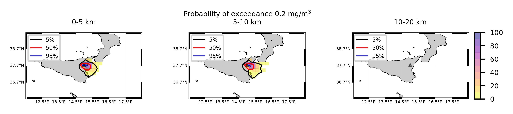
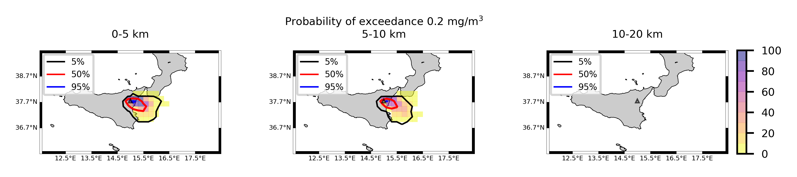
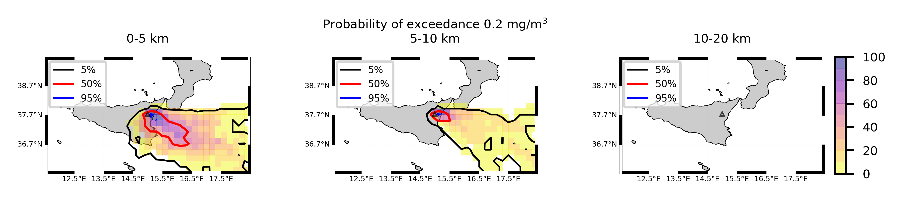
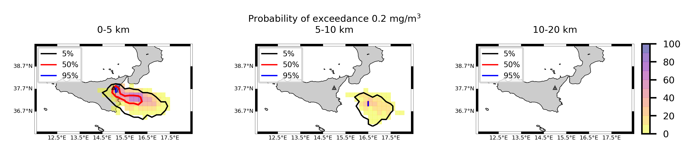
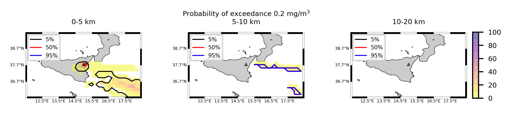
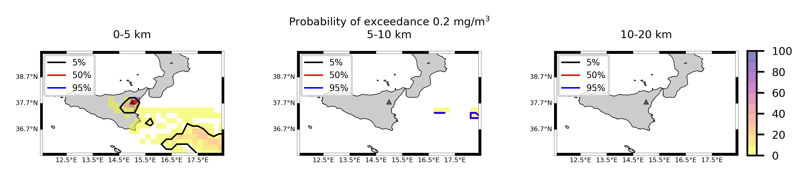

Forecast from VONA_20210228_0811Z
=================================

Contents
========

* [Forecast products](#forecast-products)
	* [Forecast at 2021-02-28 09:10 Z from RED VONA issued at 20210228_0811Z](#forecast-at-2021-02-28-0910-z-from-red-vona-issued-at-20210228_0811z)
	* [Forecast at 2021-02-28 10:10 Z from RED VONA issued at 20210228_0811Z](#forecast-at-2021-02-28-1010-z-from-red-vona-issued-at-20210228_0811z)
	* [Forecast at 2021-02-28 11:10 Z from RED VONA issued at 20210228_0811Z](#forecast-at-2021-02-28-1110-z-from-red-vona-issued-at-20210228_0811z)
	* [Forecast at 2021-02-28 14:10 Z from RED VONA issued at 20210228_0811Z](#forecast-at-2021-02-28-1410-z-from-red-vona-issued-at-20210228_0811z)
	* [Forecast at 2021-02-28 17:10 Z from RED VONA issued at 20210228_0811Z](#forecast-at-2021-02-28-1710-z-from-red-vona-issued-at-20210228_0811z)
	* [Forecast at 2021-02-28 09:40 Z from RED VONA issued at 20210228_0835Z](#forecast-at-2021-02-28-0940-z-from-red-vona-issued-at-20210228_0835z)
	* [Forecast at 2021-02-28 10:40 Z from RED VONA issued at 20210228_0835Z](#forecast-at-2021-02-28-1040-z-from-red-vona-issued-at-20210228_0835z)
	* [Forecast at 2021-02-28 11:40 Z from RED VONA issued at 20210228_0835Z](#forecast-at-2021-02-28-1140-z-from-red-vona-issued-at-20210228_0835z)
	* [Forecast at 2021-02-28 14:40 Z from RED VONA issued at 20210228_0835Z](#forecast-at-2021-02-28-1440-z-from-red-vona-issued-at-20210228_0835z)
	* [Forecast at 2021-02-28 17:40 Z from RED VONA issued at 20210228_0835Z](#forecast-at-2021-02-28-1740-z-from-red-vona-issued-at-20210228_0835z)
	* [Forecast at 2021-02-28 20:40 Z from RED VONA issued at 20210228_0835Z](#forecast-at-2021-02-28-2040-z-from-red-vona-issued-at-20210228_0835z)
	* [Forecast at 2021-02-28 11:50 Z from RED VONA issued at 20210228_1047Z](#forecast-at-2021-02-28-1150-z-from-red-vona-issued-at-20210228_1047z)
	* [Forecast at 2021-02-28 12:50 Z from RED VONA issued at 20210228_1047Z](#forecast-at-2021-02-28-1250-z-from-red-vona-issued-at-20210228_1047z)
	* [Forecast at 2021-02-28 13:50 Z from RED VONA issued at 20210228_1047Z](#forecast-at-2021-02-28-1350-z-from-red-vona-issued-at-20210228_1047z)
	* [Forecast at 2021-02-28 16:50 Z from RED VONA issued at 20210228_1047Z](#forecast-at-2021-02-28-1650-z-from-red-vona-issued-at-20210228_1047z)
	* [Forecast at 2021-02-28 19:50 Z from RED VONA issued at 20210228_1047Z](#forecast-at-2021-02-28-1950-z-from-red-vona-issued-at-20210228_1047z)
	* [Forecast at 2021-02-28 22:50 Z from RED VONA issued at 20210228_1047Z](#forecast-at-2021-02-28-2250-z-from-red-vona-issued-at-20210228_1047z)
	* [Forecast at 2021-02-28 17:30 Z from ORANGE VONA issued at 20210228_1426Z](#forecast-at-2021-02-28-1730-z-from-orange-vona-issued-at-20210228_1426z)
	* [Forecast at 2021-02-28 20:30 Z from ORANGE VONA issued at 20210228_1426Z](#forecast-at-2021-02-28-2030-z-from-orange-vona-issued-at-20210228_1426z)
	* [Forecast at 2021-02-28 23:30 Z from ORANGE VONA issued at 20210228_1426Z](#forecast-at-2021-02-28-2330-z-from-orange-vona-issued-at-20210228_1426z)
	* [Forecast at 2021-03-01 02:30 Z from ORANGE VONA issued at 20210228_1426Z](#forecast-at-2021-03-01-0230-z-from-orange-vona-issued-at-20210228_1426z)

# Forecast products

## Forecast at 2021-02-28 09:10 Z from RED VONA issued at 20210228_0811Z
  

|Eruption start [Z]|Eruption end [Z]|Forecast time [Z]|Column height asl [m]|
| :--- | :--- | :--- | :--- |
|2021-02-28 08:10:00|Ongoing|2021-02-28 09:10:00|6000 ± 500 - from VONA|
  
  

|Percentile|MER [kg/s¹]|Mass air [kg]|Mass air nested dom. [kg]|Mass grd [kg]|Mass grd nested dom. [kg]|
| :--- | :--- | :--- | :--- | :--- | :--- |
|5th|5.17e+03|4.15e+06|4.15e+06|1.60e+07|1.59e+07|
|50th|1.50e+04|1.71e+07|1.71e+07|3.79e+07|3.79e+07|
|95th|2.98e+04|3.61e+07|3.61e+07|6.27e+07|6.26e+07|
  

### Ground Nested Domain 2021-02-28 09:10 Z
  
  
  
  
  
  
  
  
  
  
  
  
  
  
  
  
  
  
  
  
  
  
  
  
  
  

|Location|Ground load [kg/m²] 5th perc|Ground load [kg/m²] 50th perc|Ground load [kg/m²] 95th perc|
| :--- | :--- | :--- | :--- |
|Catania AP (1)|0.00e+00|0.00e+00|0.00e+00|
|Nicolosi (2)|0.00e+00|0.00e+00|2.24e-02|
|Zafferana (3)|0.00e+00|0.00e+00|1.23e-03|
|Linguaglossa (4)|0.00e+00|0.00e+00|0.00e+00|
|Randazzo (5)|0.00e+00|0.00e+00|0.00e+00|
|Bronte (6)|0.00e+00|0.00e+00|0.00e+00|
|Biancavilla (7)|0.00e+00|0.00e+00|0.00e+00|
  

### Atmosphere 2021-02-28 09:10 Z
  

## Forecast at 2021-02-28 10:10 Z from RED VONA issued at 20210228_0811Z
  

|Eruption start [Z]|Eruption end [Z]|Forecast time [Z]|Column height asl [m]|
| :--- | :--- | :--- | :--- |
|2021-02-28 08:10:00|Ongoing|2021-02-28 10:10:00|6000 ± 500 - from VONA|
  
  

|Percentile|MER [kg/s¹]|Mass air [kg]|Mass air nested dom. [kg]|Mass grd [kg]|Mass grd nested dom. [kg]|
| :--- | :--- | :--- | :--- | :--- | :--- |
|5th|3.98e+03|5.11e+06|5.11e+06|5.81e+07|5.81e+07|
|50th|1.71e+04|2.58e+07|2.57e+07|9.56e+07|9.55e+07|
|95th|3.86e+04|4.87e+07|4.87e+07|1.53e+08|1.53e+08|
  

### Ground Nested Domain 2021-02-28 10:10 Z
  
  
  
  
  
  
  
  
  
  
  
  
  
  
  
  
  
  
  
  
  
  
  
  
  
  

|Location|Ground load [kg/m²] 5th perc|Ground load [kg/m²] 50th perc|Ground load [kg/m²] 95th perc|
| :--- | :--- | :--- | :--- |
|Catania AP (1)|0.00e+00|0.00e+00|6.90e-04|
|Nicolosi (2)|0.00e+00|1.23e-04|1.70e-01|
|Zafferana (3)|0.00e+00|1.34e-03|1.15e-01|
|Linguaglossa (4)|0.00e+00|0.00e+00|9.72e-07|
|Randazzo (5)|0.00e+00|0.00e+00|0.00e+00|
|Bronte (6)|0.00e+00|0.00e+00|0.00e+00|
|Biancavilla (7)|0.00e+00|0.00e+00|1.57e-04|
  

### Atmosphere 2021-02-28 10:10 Z
  

## Forecast at 2021-02-28 11:10 Z from RED VONA issued at 20210228_0811Z
  

|Eruption start [Z]|Eruption end [Z]|Forecast time [Z]|Column height asl [m]|
| :--- | :--- | :--- | :--- |
|2021-02-28 08:10:00|Ongoing|2021-02-28 11:10:00|6000 ± 500 - from VONA|
  
  

|Percentile|MER [kg/s¹]|Mass air [kg]|Mass air nested dom. [kg]|Mass grd [kg]|Mass grd nested dom. [kg]|
| :--- | :--- | :--- | :--- | :--- | :--- |
|5th|6.13e+03|9.34e+06|9.33e+06|1.05e+08|1.05e+08|
|50th|1.59e+04|2.49e+07|2.49e+07|1.52e+08|1.52e+08|
|95th|3.78e+04|6.71e+07|6.57e+07|2.45e+08|2.45e+08|
  

### Ground Nested Domain 2021-02-28 11:10 Z
  
  
  
  
  
  
  
  
  
  
  
  
  
  
  
  
  
  
  
  
  
  
  
  
  
  

|Location|Ground load [kg/m²] 5th perc|Ground load [kg/m²] 50th perc|Ground load [kg/m²] 95th perc|
| :--- | :--- | :--- | :--- |
|Catania AP (1)|0.00e+00|0.00e+00|2.48e-03|
|Nicolosi (2)|0.00e+00|1.14e-02|3.63e-01|
|Zafferana (3)|4.67e-05|6.91e-03|5.05e-01|
|Linguaglossa (4)|0.00e+00|0.00e+00|1.11e-03|
|Randazzo (5)|0.00e+00|0.00e+00|0.00e+00|
|Bronte (6)|0.00e+00|0.00e+00|0.00e+00|
|Biancavilla (7)|0.00e+00|0.00e+00|5.34e-03|
  

### Atmosphere 2021-02-28 11:10 Z
  

## Forecast at 2021-02-28 14:10 Z from RED VONA issued at 20210228_0811Z
  

|Eruption start [Z]|Eruption end [Z]|Forecast time [Z]|Column height asl [m]|
| :--- | :--- | :--- | :--- |
|2021-02-28 08:10:00|Ongoing|2021-02-28 14:10:00|6000 ± 500 - from VONA|
  
  

|Percentile|MER [kg/s¹]|Mass air [kg]|Mass air nested dom. [kg]|Mass grd [kg]|Mass grd nested dom. [kg]|
| :--- | :--- | :--- | :--- | :--- | :--- |
|5th|3.54e+03|1.26e+07|1.25e+07|2.15e+08|2.15e+08|
|50th|2.36e+04|3.85e+07|3.62e+07|3.63e+08|3.62e+08|
|95th|5.24e+04|9.45e+07|8.60e+07|6.61e+08|6.60e+08|
  

### Ground Nested Domain 2021-02-28 14:10 Z
  
  
  
  
  
  
  
  
  
  
  
  
  
  
  
  
  
  
  
  
  
  
  
  
  
  

|Location|Ground load [kg/m²] 5th perc|Ground load [kg/m²] 50th perc|Ground load [kg/m²] 95th perc|
| :--- | :--- | :--- | :--- |
|Catania AP (1)|0.00e+00|3.69e-04|4.63e-02|
|Nicolosi (2)|9.13e-03|9.80e-02|8.39e-01|
|Zafferana (3)|3.57e-03|3.08e-02|1.43e+00|
|Linguaglossa (4)|0.00e+00|0.00e+00|2.61e-03|
|Randazzo (5)|0.00e+00|0.00e+00|5.18e-04|
|Bronte (6)|0.00e+00|0.00e+00|5.00e-06|
|Biancavilla (7)|0.00e+00|2.45e-03|1.98e-02|
  

### Atmosphere 2021-02-28 14:10 Z
  

## Forecast at 2021-02-28 17:10 Z from RED VONA issued at 20210228_0811Z
  

|Eruption start [Z]|Eruption end [Z]|Forecast time [Z]|Column height asl [m]|
| :--- | :--- | :--- | :--- |
|2021-02-28 08:10:00|Ongoing|2021-02-28 17:10:00|6000 ± 500 - from VONA|
  
  

|Percentile|MER [kg/s¹]|Mass air [kg]|Mass air nested dom. [kg]|Mass grd [kg]|Mass grd nested dom. [kg]|
| :--- | :--- | :--- | :--- | :--- | :--- |
|5th|3.90e+03|1.43e+07|1.09e+07|2.95e+08|2.95e+08|
|50th|1.88e+04|3.24e+07|2.96e+07|6.47e+08|6.47e+08|
|95th|5.12e+04|9.46e+07|8.10e+07|1.01e+09|9.77e+08|
  

### Ground Nested Domain 2021-02-28 17:10 Z
  
  
  
  
  
  
  
  
  
  
  
  
  
  
  
  
  
  
  
  
  
  
  
  
  
  

|Location|Ground load [kg/m²] 5th perc|Ground load [kg/m²] 50th perc|Ground load [kg/m²] 95th perc|
| :--- | :--- | :--- | :--- |
|Catania AP (1)|9.07e-06|2.38e-03|5.33e-02|
|Nicolosi (2)|3.75e-02|1.80e-01|8.33e+00|
|Zafferana (3)|3.57e-03|1.33e-01|1.43e+00|
|Linguaglossa (4)|0.00e+00|0.00e+00|2.62e-03|
|Randazzo (5)|0.00e+00|0.00e+00|5.18e-04|
|Bronte (6)|0.00e+00|6.67e-06|5.19e-03|
|Biancavilla (7)|4.32e-04|7.35e-03|8.46e-02|
  

### Atmosphere 2021-02-28 17:10 Z
  

## Forecast at 2021-02-28 09:40 Z from RED VONA issued at 20210228_0835Z
  

|Eruption start [Z]|Eruption end [Z]|Forecast time [Z]|Column height asl [m]|
| :--- | :--- | :--- | :--- |
|2021-02-28 08:10:00|Ongoing|2021-02-28 09:40:00|9000 ± 500 - from VONA|
  
  

|Percentile|MER [kg/s¹]|Mass air [kg]|Mass air nested dom. [kg]|Mass grd [kg]|Mass grd nested dom. [kg]|
| :--- | :--- | :--- | :--- | :--- | :--- |
|5th|4.85e+04|9.89e+07|9.88e+07|1.14e+08|1.13e+08|
|50th|1.75e+05|2.78e+08|2.77e+08|4.03e+08|4.02e+08|
|95th|5.94e+05|9.46e+08|9.40e+08|1.07e+09|1.07e+09|
  

### Ground Nested Domain 2021-02-28 09:40 Z
  
  
  
  
  
  
  
  
  
  
  
  
  
  
  
  
  
  
  
  
  
  
  
  
  
  

|Location|Ground load [kg/m²] 5th perc|Ground load [kg/m²] 50th perc|Ground load [kg/m²] 95th perc|
| :--- | :--- | :--- | :--- |
|Catania AP (1)|0.00e+00|0.00e+00|9.61e-01|
|Nicolosi (2)|9.50e-05|1.89e-02|1.05e+00|
|Zafferana (3)|1.31e-02|8.86e-01|3.23e+00|
|Linguaglossa (4)|0.00e+00|0.00e+00|2.15e-02|
|Randazzo (5)|0.00e+00|0.00e+00|2.00e-05|
|Bronte (6)|0.00e+00|0.00e+00|0.00e+00|
|Biancavilla (7)|0.00e+00|0.00e+00|5.42e-06|
  

### Atmosphere 2021-02-28 09:40 Z
  

## Forecast at 2021-02-28 10:40 Z from RED VONA issued at 20210228_0835Z
  

|Eruption start [Z]|Eruption end [Z]|Forecast time [Z]|Column height asl [m]|
| :--- | :--- | :--- | :--- |
|2021-02-28 08:10:00|Ongoing|2021-02-28 10:40:00|9000 ± 500 - from VONA|
  
  

|Percentile|MER [kg/s¹]|Mass air [kg]|Mass air nested dom. [kg]|Mass grd [kg]|Mass grd nested dom. [kg]|
| :--- | :--- | :--- | :--- | :--- | :--- |
|5th|5.77e+04|1.07e+08|1.07e+08|5.71e+08|5.71e+08|
|50th|2.05e+05|4.27e+08|4.07e+08|1.55e+09|1.55e+09|
|95th|5.05e+05|8.93e+08|8.06e+08|2.50e+09|2.50e+09|
  

### Ground Nested Domain 2021-02-28 10:40 Z
  
  
  
  
  
  
  
  
  
  
  
  
  
  
  
  
  
  
  
  
  
  
  
  
  
  

|Location|Ground load [kg/m²] 5th perc|Ground load [kg/m²] 50th perc|Ground load [kg/m²] 95th perc|
| :--- | :--- | :--- | :--- |
|Catania AP (1)|0.00e+00|1.65e-03|1.58e+00|
|Nicolosi (2)|3.90e-04|1.36e-01|2.93e+00|
|Zafferana (3)|4.27e-01|2.78e+00|5.58e+00|
|Linguaglossa (4)|0.00e+00|2.52e-04|1.06e-01|
|Randazzo (5)|0.00e+00|0.00e+00|3.67e-05|
|Bronte (6)|0.00e+00|0.00e+00|0.00e+00|
|Biancavilla (7)|0.00e+00|0.00e+00|1.63e-03|
  

### Atmosphere 2021-02-28 10:40 Z
  

## Forecast at 2021-02-28 11:40 Z from RED VONA issued at 20210228_0835Z
  

|Eruption start [Z]|Eruption end [Z]|Forecast time [Z]|Column height asl [m]|
| :--- | :--- | :--- | :--- |
|2021-02-28 08:10:00|Ongoing|2021-02-28 11:40:00|9000 ± 500 - from VONA|
  
  

|Percentile|MER [kg/s¹]|Mass air [kg]|Mass air nested dom. [kg]|Mass grd [kg]|Mass grd nested dom. [kg]|
| :--- | :--- | :--- | :--- | :--- | :--- |
|5th|6.69e+04|1.41e+08|1.41e+08|1.09e+09|1.09e+09|
|50th|2.18e+05|4.57e+08|3.51e+08|2.10e+09|2.10e+09|
|95th|5.89e+05|9.10e+08|9.04e+08|3.81e+09|3.81e+09|
  

### Ground Nested Domain 2021-02-28 11:40 Z
  
  
  
  
  
  
  
  
  
  
  
  
  
  
  
  
  
  
  
  
  
  
  
  
  
  

|Location|Ground load [kg/m²] 5th perc|Ground load [kg/m²] 50th perc|Ground load [kg/m²] 95th perc|
| :--- | :--- | :--- | :--- |
|Catania AP (1)|0.00e+00|2.02e-02|3.72e+00|
|Nicolosi (2)|1.92e-02|1.72e-01|3.31e+00|
|Zafferana (3)|1.30e+00|4.44e+00|8.87e+00|
|Linguaglossa (4)|0.00e+00|8.52e-03|1.33e-01|
|Randazzo (5)|0.00e+00|0.00e+00|9.00e-05|
|Bronte (6)|0.00e+00|0.00e+00|0.00e+00|
|Biancavilla (7)|0.00e+00|0.00e+00|1.97e-03|
  

### Atmosphere 2021-02-28 11:40 Z
  

## Forecast at 2021-02-28 14:40 Z from RED VONA issued at 20210228_0835Z
  

|Eruption start [Z]|Eruption end [Z]|Forecast time [Z]|Column height asl [m]|
| :--- | :--- | :--- | :--- |
|2021-02-28 08:10:00|Ongoing|2021-02-28 14:40:00|9000 ± 500 - from VONA|
  
  

|Percentile|MER [kg/s¹]|Mass air [kg]|Mass air nested dom. [kg]|Mass grd [kg]|Mass grd nested dom. [kg]|
| :--- | :--- | :--- | :--- | :--- | :--- |
|5th|4.79e+04|1.69e+08|1.08e+08|1.69e+09|1.69e+09|
|50th|1.94e+05|4.68e+08|3.70e+08|4.83e+09|4.75e+09|
|95th|7.15e+05|1.83e+09|1.25e+09|1.01e+10|9.69e+09|
  

### Ground Nested Domain 2021-02-28 14:40 Z
  
  
  
  
  
  
  
  
  
  
  
  
  
  
  
  
  
  
  
  
  
  
  
  
  
  

|Location|Ground load [kg/m²] 5th perc|Ground load [kg/m²] 50th perc|Ground load [kg/m²] 95th perc|
| :--- | :--- | :--- | :--- |
|Catania AP (1)|2.62e-04|1.10e-01|5.51e+00|
|Nicolosi (2)|7.45e-02|8.38e-01|4.58e+00|
|Zafferana (3)|3.70e+00|8.86e+00|1.46e+01|
|Linguaglossa (4)|0.00e+00|2.50e-02|2.67e-01|
|Randazzo (5)|0.00e+00|1.67e-05|3.42e-04|
|Bronte (6)|0.00e+00|0.00e+00|3.00e-05|
|Biancavilla (7)|2.25e-05|2.03e-03|1.12e-02|
  

### Atmosphere 2021-02-28 14:40 Z
  

## Forecast at 2021-02-28 17:40 Z from RED VONA issued at 20210228_0835Z
  

|Eruption start [Z]|Eruption end [Z]|Forecast time [Z]|Column height asl [m]|
| :--- | :--- | :--- | :--- |
|2021-02-28 08:10:00|Ongoing|2021-02-28 17:40:00|9000 ± 500 - from VONA|
  
  

|Percentile|MER [kg/s¹]|Mass air [kg]|Mass air nested dom. [kg]|Mass grd [kg]|Mass grd nested dom. [kg]|
| :--- | :--- | :--- | :--- | :--- | :--- |
|5th|4.89e+04|2.45e+08|1.79e+08|3.26e+09|3.23e+09|
|50th|2.17e+05|6.06e+08|3.67e+08|7.04e+09|6.82e+09|
|95th|9.82e+05|2.90e+09|1.99e+09|1.35e+10|1.33e+10|
  

### Ground Nested Domain 2021-02-28 17:40 Z
  
  
  
  
  
  
  
  
  
  
  
  
  
  
  
  
  
  
  
  
  
  
  
  
  
  

|Location|Ground load [kg/m²] 5th perc|Ground load [kg/m²] 50th perc|Ground load [kg/m²] 95th perc|
| :--- | :--- | :--- | :--- |
|Catania AP (1)|2.09e-02|5.48e-01|2.00e+01|
|Nicolosi (2)|1.14e-01|1.46e+00|1.03e+01|
|Zafferana (3)|6.68e+00|1.50e+01|1.82e+01|
|Linguaglossa (4)|2.43e-03|3.88e-02|6.61e-01|
|Randazzo (5)|0.00e+00|2.00e-05|7.08e-04|
|Bronte (6)|0.00e+00|3.33e-06|1.00e-03|
|Biancavilla (7)|5.31e-04|5.04e-03|3.98e-02|
  

### Atmosphere 2021-02-28 17:40 Z
  

## Forecast at 2021-02-28 20:40 Z from RED VONA issued at 20210228_0835Z
  

|Eruption start [Z]|Eruption end [Z]|Forecast time [Z]|Column height asl [m]|
| :--- | :--- | :--- | :--- |
|2021-02-28 08:10:00|Ongoing|2021-02-28 20:40:00|9000 ± 500 - from VONA|
  
  

|Percentile|MER [kg/s¹]|Mass air [kg]|Mass air nested dom. [kg]|Mass grd [kg]|Mass grd nested dom. [kg]|
| :--- | :--- | :--- | :--- | :--- | :--- |
|5th|6.12e+04|2.30e+08|1.04e+08|5.51e+09|5.46e+09|
|50th|2.47e+05|7.78e+08|3.94e+08|1.10e+10|1.08e+10|
|95th|7.00e+05|2.21e+09|1.45e+09|2.07e+10|1.97e+10|
  

### Ground Nested Domain 2021-02-28 20:40 Z
  
  
  
  
  
  
  
  
  
  
  
  
  
  
  
  
  
  
  
  
  
  
  
  
  
  

|Location|Ground load [kg/m²] 5th perc|Ground load [kg/m²] 50th perc|Ground load [kg/m²] 95th perc|
| :--- | :--- | :--- | :--- |
|Catania AP (1)|1.09e-01|1.17e+00|2.33e+01|
|Nicolosi (2)|1.83e-01|3.60e+00|1.67e+01|
|Zafferana (3)|1.33e+01|1.77e+01|2.72e+01|
|Linguaglossa (4)|2.43e-03|6.14e-02|8.58e-01|
|Randazzo (5)|0.00e+00|2.17e-05|9.02e-04|
|Bronte (6)|0.00e+00|4.67e-05|1.09e-03|
|Biancavilla (7)|1.52e-03|1.05e-02|5.64e-02|
  

### Atmosphere 2021-02-28 20:40 Z
  

## Forecast at 2021-02-28 11:50 Z from RED VONA issued at 20210228_1047Z
  

|Eruption start [Z]|Eruption end [Z]|Forecast time [Z]|Column height asl [m]|
| :--- | :--- | :--- | :--- |
|2021-02-28 08:10:00|Ongoing|2021-02-28 11:50:00|4500 ± 500 - from VONA|
  
  

|Percentile|MER [kg/s¹]|Mass air [kg]|Mass air nested dom. [kg]|Mass grd [kg]|Mass grd nested dom. [kg]|
| :--- | :--- | :--- | :--- | :--- | :--- |
|5th|1.40e+02|1.94e+07|1.40e+07|8.75e+08|8.74e+08|
|50th|1.66e+03|1.20e+08|4.97e+07|1.69e+09|1.69e+09|
|95th|5.55e+03|2.59e+08|1.31e+08|2.83e+09|2.83e+09|
  

### Ground Nested Domain 2021-02-28 11:50 Z
  
  
  
  
  
  
  
  
  
  
  
  
  
  
  
  
  
  
  
  
  
  
  
  
  
  

|Location|Ground load [kg/m²] 5th perc|Ground load [kg/m²] 50th perc|Ground load [kg/m²] 95th perc|
| :--- | :--- | :--- | :--- |
|Catania AP (1)|0.00e+00|6.10e-03|1.83e+00|
|Nicolosi (2)|1.63e-03|1.64e-01|3.31e+00|
|Zafferana (3)|7.04e-01|3.93e+00|7.78e+00|
|Linguaglossa (4)|0.00e+00|3.56e-03|1.31e-01|
|Randazzo (5)|0.00e+00|0.00e+00|3.67e-05|
|Bronte (6)|0.00e+00|0.00e+00|0.00e+00|
|Biancavilla (7)|0.00e+00|1.44e-05|3.30e-03|
  

### Atmosphere 2021-02-28 11:50 Z
  

## Forecast at 2021-02-28 12:50 Z from RED VONA issued at 20210228_1047Z
  

|Eruption start [Z]|Eruption end [Z]|Forecast time [Z]|Column height asl [m]|
| :--- | :--- | :--- | :--- |
|2021-02-28 08:10:00|Ongoing|2021-02-28 12:50:00|4500 ± 500 - from VONA|
  
  

|Percentile|MER [kg/s¹]|Mass air [kg]|Mass air nested dom. [kg]|Mass grd [kg]|Mass grd nested dom. [kg]|
| :--- | :--- | :--- | :--- | :--- | :--- |
|5th|9.17e+01|1.54e+07|6.98e+06|9.00e+08|8.99e+08|
|50th|2.15e+03|8.55e+07|1.94e+07|1.72e+09|1.71e+09|
|95th|1.08e+04|1.97e+08|5.28e+07|2.88e+09|2.87e+09|
  

### Ground Nested Domain 2021-02-28 12:50 Z
  
  
  
  
  
  
  
  
  
  
  
  
  
  
  
  
  
  
  
  
  
  
  
  
  
  

|Location|Ground load [kg/m²] 5th perc|Ground load [kg/m²] 50th perc|Ground load [kg/m²] 95th perc|
| :--- | :--- | :--- | :--- |
|Catania AP (1)|0.00e+00|6.33e-03|1.83e+00|
|Nicolosi (2)|1.73e-03|1.64e-01|3.31e+00|
|Zafferana (3)|7.04e-01|3.94e+00|7.78e+00|
|Linguaglossa (4)|0.00e+00|3.75e-03|1.31e-01|
|Randazzo (5)|0.00e+00|0.00e+00|3.67e-05|
|Bronte (6)|0.00e+00|0.00e+00|0.00e+00|
|Biancavilla (7)|0.00e+00|7.44e-04|7.18e-03|
  

### Atmosphere 2021-02-28 12:50 Z
  

## Forecast at 2021-02-28 13:50 Z from RED VONA issued at 20210228_1047Z
  

|Eruption start [Z]|Eruption end [Z]|Forecast time [Z]|Column height asl [m]|
| :--- | :--- | :--- | :--- |
|2021-02-28 08:10:00|Ongoing|2021-02-28 13:50:00|4500 ± 500 - from VONA|
  
  

|Percentile|MER [kg/s¹]|Mass air [kg]|Mass air nested dom. [kg]|Mass grd [kg]|Mass grd nested dom. [kg]|
| :--- | :--- | :--- | :--- | :--- | :--- |
|5th|1.32e+02|1.37e+07|5.56e+06|9.32e+08|9.31e+08|
|50th|2.24e+03|8.38e+07|1.29e+07|1.74e+09|1.72e+09|
|95th|1.26e+04|1.59e+08|2.99e+07|2.90e+09|2.88e+09|
  

### Ground Nested Domain 2021-02-28 13:50 Z
  
  
  
  
  
  
  
  
  
  
  
  
  
  
  
  
  
  
  
  
  
  
  
  
  
  

|Location|Ground load [kg/m²] 5th perc|Ground load [kg/m²] 50th perc|Ground load [kg/m²] 95th perc|
| :--- | :--- | :--- | :--- |
|Catania AP (1)|2.90e-05|9.66e-03|1.83e+00|
|Nicolosi (2)|2.05e-03|1.64e-01|3.31e+00|
|Zafferana (3)|7.04e-01|3.94e+00|7.78e+00|
|Linguaglossa (4)|0.00e+00|4.11e-03|1.31e-01|
|Randazzo (5)|0.00e+00|0.00e+00|1.18e-04|
|Bronte (6)|0.00e+00|0.00e+00|0.00e+00|
|Biancavilla (7)|0.00e+00|1.40e-03|8.89e-03|
  

### Atmosphere 2021-02-28 13:50 Z
  

## Forecast at 2021-02-28 16:50 Z from RED VONA issued at 20210228_1047Z
  

|Eruption start [Z]|Eruption end [Z]|Forecast time [Z]|Column height asl [m]|
| :--- | :--- | :--- | :--- |
|2021-02-28 08:10:00|Ongoing|2021-02-28 16:50:00|4500 ± 500 - from VONA|
  
  

|Percentile|MER [kg/s¹]|Mass air [kg]|Mass air nested dom. [kg]|Mass grd [kg]|Mass grd nested dom. [kg]|
| :--- | :--- | :--- | :--- | :--- | :--- |
|5th|3.82e+02|1.00e+07|1.77e+06|9.68e+08|9.64e+08|
|50th|2.75e+03|4.27e+07|5.29e+06|1.93e+09|1.88e+09|
|95th|1.36e+04|8.66e+07|1.12e+07|3.59e+09|3.53e+09|
  

### Ground Nested Domain 2021-02-28 16:50 Z
  
  
  
  
  
  
  
  
  
  
  
  
  
  
  
  
  
  
  
  
  
  
  
  
  
  

|Location|Ground load [kg/m²] 5th perc|Ground load [kg/m²] 50th perc|Ground load [kg/m²] 95th perc|
| :--- | :--- | :--- | :--- |
|Catania AP (1)|3.63e-04|1.79e-02|1.83e+00|
|Nicolosi (2)|2.97e-02|1.97e-01|3.33e+00|
|Zafferana (3)|7.04e-01|3.94e+00|8.04e+00|
|Linguaglossa (4)|0.00e+00|4.26e-03|1.31e-01|
|Randazzo (5)|0.00e+00|3.33e-06|1.20e-04|
|Bronte (6)|0.00e+00|5.00e-06|3.20e-04|
|Biancavilla (7)|7.54e-04|4.29e-03|2.58e-02|
  

### Atmosphere 2021-02-28 16:50 Z
  

## Forecast at 2021-02-28 19:50 Z from RED VONA issued at 20210228_1047Z
  

|Eruption start [Z]|Eruption end [Z]|Forecast time [Z]|Column height asl [m]|
| :--- | :--- | :--- | :--- |
|2021-02-28 08:10:00|Ongoing|2021-02-28 19:50:00|4500 ± 500 - from VONA|
  
  

|Percentile|MER [kg/s¹]|Mass air [kg]|Mass air nested dom. [kg]|Mass grd [kg]|Mass grd nested dom. [kg]|
| :--- | :--- | :--- | :--- | :--- | :--- |
|5th|6.73e+01|3.59e+06|6.06e+05|9.80e+08|9.70e+08|
|50th|2.03e+03|2.39e+07|3.82e+06|1.96e+09|1.89e+09|
|95th|8.22e+03|5.35e+07|2.01e+07|3.63e+09|3.55e+09|
  

### Ground Nested Domain 2021-02-28 19:50 Z
  
  
  
  
  
  
  
  
  
  
  
  
  
  
  
  
  
  
  
  
  
  
  
  
  
  

|Location|Ground load [kg/m²] 5th perc|Ground load [kg/m²] 50th perc|Ground load [kg/m²] 95th perc|
| :--- | :--- | :--- | :--- |
|Catania AP (1)|4.90e-04|1.79e-02|1.83e+00|
|Nicolosi (2)|3.22e-02|2.04e-01|3.33e+00|
|Zafferana (3)|7.04e-01|3.94e+00|8.04e+00|
|Linguaglossa (4)|0.00e+00|4.28e-03|1.31e-01|
|Randazzo (5)|0.00e+00|3.33e-06|1.22e-04|
|Bronte (6)|0.00e+00|1.20e-04|1.10e-03|
|Biancavilla (7)|8.98e-04|5.59e-03|3.27e-02|
  

### Atmosphere 2021-02-28 19:50 Z
  

## Forecast at 2021-02-28 22:50 Z from RED VONA issued at 20210228_1047Z
  

|Eruption start [Z]|Eruption end [Z]|Forecast time [Z]|Column height asl [m]|
| :--- | :--- | :--- | :--- |
|2021-02-28 08:10:00|Ongoing|2021-02-28 22:50:00|4500 ± 500 - from VONA|
  
  

|Percentile|MER [kg/s¹]|Mass air [kg]|Mass air nested dom. [kg]|Mass grd [kg]|Mass grd nested dom. [kg]|
| :--- | :--- | :--- | :--- | :--- | :--- |
|5th|1.48e+02|3.25e+06|4.04e+05|9.82e+08|9.71e+08|
|50th|1.30e+03|1.64e+07|3.42e+06|2.02e+09|1.95e+09|
|95th|8.23e+03|3.65e+07|1.26e+07|3.68e+09|3.60e+09|
  

### Ground Nested Domain 2021-02-28 22:50 Z
  
  
  
  
  
  
  
  
  
  
  
  
  
  
  
  
  
  
  
  
  
  
  
  
  
  

|Location|Ground load [kg/m²] 5th perc|Ground load [kg/m²] 50th perc|Ground load [kg/m²] 95th perc|
| :--- | :--- | :--- | :--- |
|Catania AP (1)|4.90e-04|1.79e-02|1.83e+00|
|Nicolosi (2)|3.30e-02|2.04e-01|3.33e+00|
|Zafferana (3)|7.04e-01|3.94e+00|8.04e+00|
|Linguaglossa (4)|0.00e+00|4.28e-03|1.31e-01|
|Randazzo (5)|0.00e+00|3.33e-06|1.22e-04|
|Bronte (6)|0.00e+00|1.27e-04|1.10e-03|
|Biancavilla (7)|1.87e-03|6.37e-03|3.35e-02|
  

### Atmosphere 2021-02-28 22:50 Z
  

## Forecast at 2021-02-28 17:30 Z from ORANGE VONA issued at 20210228_1426Z
  

|Eruption start [Z]|Eruption end [Z]|Forecast time [Z]|Column height asl [m]|
| :--- | :--- | :--- | :--- |
|2021-02-28 08:10:00|2021-02-28 14:30:00|2021-02-28 17:30:00|4500.0 ± 500 - from VONA|
  
  

|Percentile|MER [kg/s¹]|Mass air [kg]|Mass air nested dom. [kg]|Mass grd [kg]|Mass grd nested dom. [kg]|
| :--- | :--- | :--- | :--- | :--- | :--- |
|5th|0.00e+00|1.00e+07|8.26e+04|9.91e+08|9.89e+08|
|50th|0.00e+00|8.34e+07|2.64e+06|2.40e+09|2.29e+09|
|95th|0.00e+00|4.25e+08|2.29e+07|4.67e+09|4.50e+09|
  

### Ground Nested Domain 2021-02-28 17:30 Z
  
  
  
  
  
  
  
  
  
  
  
  
  
  
  
  
  
  
  
  
  
  
  
  
  
  

|Location|Ground load [kg/m²] 5th perc|Ground load [kg/m²] 50th perc|Ground load [kg/m²] 95th perc|
| :--- | :--- | :--- | :--- |
|Catania AP (1)|6.12e-03|1.25e-01|4.48e+00|
|Nicolosi (2)|6.73e-02|4.71e-01|3.85e+00|
|Zafferana (3)|1.36e+00|5.12e+00|8.07e+00|
|Linguaglossa (4)|0.00e+00|8.78e-03|1.31e-01|
|Randazzo (5)|0.00e+00|5.00e-06|7.95e-04|
|Bronte (6)|0.00e+00|3.00e-05|1.41e-03|
|Biancavilla (7)|1.71e-03|5.18e-03|4.09e-02|
  

### Atmosphere 2021-02-28 17:30 Z
  

## Forecast at 2021-02-28 20:30 Z from ORANGE VONA issued at 20210228_1426Z
  

|Eruption start [Z]|Eruption end [Z]|Forecast time [Z]|Column height asl [m]|
| :--- | :--- | :--- | :--- |
|2021-02-28 08:10:00|2021-02-28 14:30:00|2021-02-28 20:30:00|None|
  
  

|Percentile|MER [kg/s¹]|Mass air [kg]|Mass air nested dom. [kg]|Mass grd [kg]|Mass grd nested dom. [kg]|
| :--- | :--- | :--- | :--- | :--- | :--- |
|5th|0.00e+00|5.66e+06|3.96e+03|9.95e+08|9.93e+08|
|50th|0.00e+00|6.29e+07|1.20e+05|2.51e+09|2.29e+09|
|95th|0.00e+00|2.07e+08|1.17e+07|4.83e+09|4.50e+09|
  

### Ground Nested Domain 2021-02-28 20:30 Z
  
  
  
  
  
  
  
  
  
  
  
  
  
  
  
  
  
  
  
  
  
  
  
  
  
  

|Location|Ground load [kg/m²] 5th perc|Ground load [kg/m²] 50th perc|Ground load [kg/m²] 95th perc|
| :--- | :--- | :--- | :--- |
|Catania AP (1)|6.81e-03|1.25e-01|4.48e+00|
|Nicolosi (2)|6.73e-02|4.71e-01|3.85e+00|
|Zafferana (3)|1.36e+00|5.12e+00|8.07e+00|
|Linguaglossa (4)|0.00e+00|8.78e-03|1.31e-01|
|Randazzo (5)|0.00e+00|5.00e-06|8.50e-04|
|Bronte (6)|0.00e+00|3.00e-05|1.57e-03|
|Biancavilla (7)|1.71e-03|5.27e-03|4.14e-02|
  

### Atmosphere 2021-02-28 20:30 Z
  

## Forecast at 2021-02-28 23:30 Z from ORANGE VONA issued at 20210228_1426Z
  

|Eruption start [Z]|Eruption end [Z]|Forecast time [Z]|Column height asl [m]|
| :--- | :--- | :--- | :--- |
|2021-02-28 08:10:00|2021-02-28 14:30:00|2021-02-28 23:30:00|None|
  
  

|Percentile|MER [kg/s¹]|Mass air [kg]|Mass air nested dom. [kg]|Mass grd [kg]|Mass grd nested dom. [kg]|
| :--- | :--- | :--- | :--- | :--- | :--- |
|5th|0.00e+00|2.41e+06|7.97e+02|9.95e+08|9.93e+08|
|50th|0.00e+00|2.43e+07|9.43e+03|2.57e+09|2.29e+09|
|95th|0.00e+00|8.22e+07|2.58e+05|4.92e+09|4.50e+09|
  

### Ground Nested Domain 2021-02-28 23:30 Z
  
  
  
  
  
  
  
  
  
  
  
  
  
  
  
  
  
  
  
  
  
  
  
  
  
  

|Location|Ground load [kg/m²] 5th perc|Ground load [kg/m²] 50th perc|Ground load [kg/m²] 95th perc|
| :--- | :--- | :--- | :--- |
|Catania AP (1)|6.81e-03|1.25e-01|4.48e+00|
|Nicolosi (2)|6.73e-02|4.71e-01|3.85e+00|
|Zafferana (3)|1.36e+00|5.12e+00|8.07e+00|
|Linguaglossa (4)|0.00e+00|8.78e-03|1.31e-01|
|Randazzo (5)|0.00e+00|5.00e-06|8.50e-04|
|Bronte (6)|0.00e+00|3.00e-05|1.57e-03|
|Biancavilla (7)|1.71e-03|5.30e-03|4.14e-02|
  

### Atmosphere 2021-02-28 23:30 Z
  

## Forecast at 2021-03-01 02:30 Z from ORANGE VONA issued at 20210228_1426Z
  

|Eruption start [Z]|Eruption end [Z]|Forecast time [Z]|Column height asl [m]|
| :--- | :--- | :--- | :--- |
|2021-02-28 08:10:00|2021-02-28 14:30:00|2021-03-01 02:30:00|None|
  
  

|Percentile|MER [kg/s¹]|Mass air [kg]|Mass air nested dom. [kg]|Mass grd [kg]|Mass grd nested dom. [kg]|
| :--- | :--- | :--- | :--- | :--- | :--- |
|5th|0.00e+00|8.44e+05|9.66e+00|9.96e+08|9.93e+08|
|50th|0.00e+00|1.32e+07|2.25e+02|2.60e+09|2.29e+09|
|95th|0.00e+00|4.76e+07|1.23e+04|4.94e+09|4.50e+09|
  

### Ground Nested Domain 2021-03-01 02:30 Z
  
  
  
  
  
  
  
  
  
  
  
  
  
  
  
  
  
  
  
  
  
  
  
  
  
  

|Location|Ground load [kg/m²] 5th perc|Ground load [kg/m²] 50th perc|Ground load [kg/m²] 95th perc|
| :--- | :--- | :--- | :--- |
|Catania AP (1)|6.81e-03|1.25e-01|4.48e+00|
|Nicolosi (2)|6.73e-02|4.71e-01|3.85e+00|
|Zafferana (3)|1.36e+00|5.12e+00|8.07e+00|
|Linguaglossa (4)|0.00e+00|8.78e-03|1.31e-01|
|Randazzo (5)|0.00e+00|5.00e-06|8.50e-04|
|Bronte (6)|0.00e+00|3.00e-05|1.57e-03|
|Biancavilla (7)|1.71e-03|5.30e-03|4.14e-02|
  

### Atmosphere 2021-03-01 02:30 Z
  
  
Go to [Supplementary page](Supplementary_page.md)  
Go to [Main directory](https://github.com/federicapardini/Real_time_ash_forecast)
