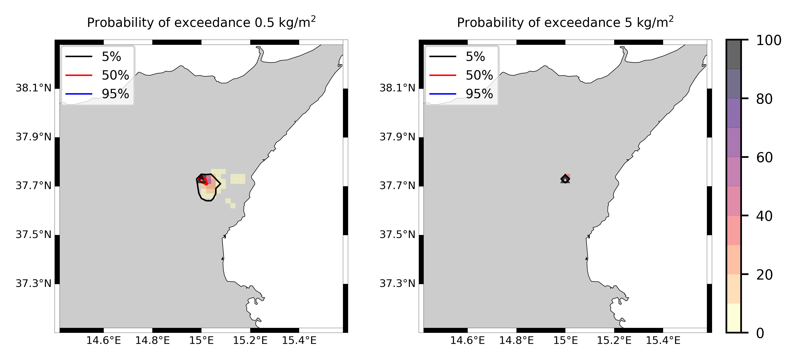

Forecast from VONA_20210228_0811Z
=================================

Contents
========

* [Forecast products](#forecast-products)
	* [Forecast at 2021-02-28 09:10 Z from RED VONA issued at 20210228_0811Z](#forecast-at-2021-02-28-0910-z-from-red-vona-issued-at-20210228_0811z)
	* [Forecast at 2021-02-28 10:10 Z from RED VONA issued at 20210228_0811Z](#forecast-at-2021-02-28-1010-z-from-red-vona-issued-at-20210228_0811z)
	* [Forecast at 2021-02-28 11:10 Z from RED VONA issued at 20210228_0811Z](#forecast-at-2021-02-28-1110-z-from-red-vona-issued-at-20210228_0811z)
	* [Forecast at 2021-02-28 14:10 Z from RED VONA issued at 20210228_0811Z](#forecast-at-2021-02-28-1410-z-from-red-vona-issued-at-20210228_0811z)
	* [Forecast at 2021-02-28 09:40 Z from RED VONA issued at 20210228_0835Z](#forecast-at-2021-02-28-0940-z-from-red-vona-issued-at-20210228_0835z)
	* [Forecast at 2021-02-28 10:40 Z from RED VONA issued at 20210228_0835Z](#forecast-at-2021-02-28-1040-z-from-red-vona-issued-at-20210228_0835z)

# Forecast products

## Forecast at 2021-02-28 09:10 Z from RED VONA issued at 20210228_0811Z
  

|Eruption start [Z]|Eruption end [Z]|Forecast time [Z]|Column height asl [m]|
| :--- | :--- | :--- | :--- |
|2021-02-28 08:10:00|Ongoing|2021-02-28 09:10:00|6000 ± 500 - from VONA|
  
  

|Percentile|MER [kg/s¹]|Mass air [kg]|Mass air nested dom. [kg]|Mass grd [kg]|Mass grd nested dom. [kg]|
| :--- | :--- | :--- | :--- | :--- | :--- |
|5th|4.43e+03|5.45e+06|5.45e+06|1.21e+07|1.21e+07|
|50th|1.51e+04|1.83e+07|1.83e+07|3.51e+07|3.51e+07|
|95th|2.93e+04|3.94e+07|3.94e+07|6.51e+07|6.51e+07|
  

### Ground Nested Domain 2021-02-28 09:10 Z
  
  
  
  
  
  
  
  
  
  
  
  
  
  
  
  
  
  
  
  
  
  
  

|Location|Ground load [kg/m²] 5th perc|Ground load [kg/m²] 50th perc|Ground load [kg/m²] 95th perc|
| :--- | :--- | :--- | :--- |
|Sarro (1)|0.00e+00|0.00e+00|3.01e-02|
|Airone (2)|0.00e+00|2.04e-06|9.83e-02|
|Zafferana Ingresso (3)|0.00e+00|0.00e+00|3.18e-02|
|Zafferana Rotonda (4)|0.00e+00|0.00e+00|2.77e-02|
|Petrulli (5)|0.00e+00|0.00e+00|1.02e-02|
|Milo (6)|0.00e+00|0.00e+00|9.60e-04|
|Fornazzo (7)|0.00e+00|0.00e+00|3.22e-03|
|Rinuccio (8)|0.00e+00|0.00e+00|6.72e-03|
|S. Alfio (9)|0.00e+00|0.00e+00|0.00e+00|
|Macchia (10)|0.00e+00|0.00e+00|0.00e+00|
|S. Venerina (11)|0.00e+00|0.00e+00|0.00e+00|
|Linera (12)|0.00e+00|0.00e+00|2.66e-04|
|Dagala chiesa S. Maria (13)|0.00e+00|0.00e+00|0.00e+00|
|Giarre Piazza Maccheroni (14)|0.00e+00|0.00e+00|0.00e+00|
|Milo parco (15)|0.00e+00|0.00e+00|6.13e-04|
|Catania AP (16)|0.00e+00|0.00e+00|0.00e+00|
|Nicolosi (17)|0.00e+00|0.00e+00|1.91e-02|
|Zafferana (18)|0.00e+00|0.00e+00|3.92e-02|
|Linguaglossa (19)|0.00e+00|0.00e+00|0.00e+00|
|Randazzo (20)|0.00e+00|0.00e+00|0.00e+00|
|Bronte (21)|0.00e+00|0.00e+00|0.00e+00|
|Biancavilla (22)|0.00e+00|0.00e+00|0.00e+00|
  

### Atmosphere 2021-02-28 09:10 Z
  

## Forecast at 2021-02-28 10:10 Z from RED VONA issued at 20210228_0811Z
  

|Eruption start [Z]|Eruption end [Z]|Forecast time [Z]|Column height asl [m]|
| :--- | :--- | :--- | :--- |
|2021-02-28 08:10:00|Ongoing|2021-02-28 10:10:00|6000 ± 500 - from VONA|
  
  

|Percentile|MER [kg/s¹]|Mass air [kg]|Mass air nested dom. [kg]|Mass grd [kg]|Mass grd nested dom. [kg]|
| :--- | :--- | :--- | :--- | :--- | :--- |
|5th|5.95e+03|1.17e+07|1.17e+07|4.63e+07|4.63e+07|
|50th|1.54e+04|3.03e+07|3.02e+07|9.65e+07|9.64e+07|
|95th|3.84e+04|5.25e+07|5.25e+07|1.42e+08|1.42e+08|
  

### Ground Nested Domain 2021-02-28 10:10 Z
  
  
  
  
  
  
  
  
  
  
  
  
  
  
  
  
  
  
  
  
  
  
  

|Location|Ground load [kg/m²] 5th perc|Ground load [kg/m²] 50th perc|Ground load [kg/m²] 95th perc|
| :--- | :--- | :--- | :--- |
|Sarro (1)|0.00e+00|5.49e-04|5.74e-02|
|Airone (2)|0.00e+00|2.86e-03|1.53e-01|
|Zafferana Ingresso (3)|0.00e+00|6.65e-04|1.24e-01|
|Zafferana Rotonda (4)|0.00e+00|5.76e-04|5.78e-02|
|Petrulli (5)|0.00e+00|3.40e-04|3.01e-02|
|Milo (6)|0.00e+00|1.89e-05|3.11e-02|
|Fornazzo (7)|0.00e+00|1.93e-05|1.66e-02|
|Rinuccio (8)|0.00e+00|2.90e-05|3.06e-02|
|S. Alfio (9)|0.00e+00|0.00e+00|8.18e-03|
|Macchia (10)|0.00e+00|0.00e+00|1.35e-03|
|S. Venerina (11)|0.00e+00|0.00e+00|2.00e-03|
|Linera (12)|0.00e+00|0.00e+00|1.09e-02|
|Dagala chiesa S. Maria (13)|0.00e+00|0.00e+00|7.32e-03|
|Giarre Piazza Maccheroni (14)|0.00e+00|0.00e+00|3.11e-04|
|Milo parco (15)|0.00e+00|1.54e-05|2.99e-02|
|Catania AP (16)|0.00e+00|0.00e+00|2.16e-05|
|Nicolosi (17)|0.00e+00|2.41e-03|1.32e-01|
|Zafferana (18)|0.00e+00|8.00e-04|8.31e-02|
|Linguaglossa (19)|0.00e+00|0.00e+00|0.00e+00|
|Randazzo (20)|0.00e+00|0.00e+00|0.00e+00|
|Bronte (21)|0.00e+00|0.00e+00|0.00e+00|
|Biancavilla (22)|0.00e+00|0.00e+00|8.12e-04|
  

### Atmosphere 2021-02-28 10:10 Z
  

## Forecast at 2021-02-28 11:10 Z from RED VONA issued at 20210228_0811Z
  

|Eruption start [Z]|Eruption end [Z]|Forecast time [Z]|Column height asl [m]|
| :--- | :--- | :--- | :--- |
|2021-02-28 08:10:00|Ongoing|2021-02-28 11:10:00|6000 ± 500 - from VONA|
  
  

|Percentile|MER [kg/s¹]|Mass air [kg]|Mass air nested dom. [kg]|Mass grd [kg]|Mass grd nested dom. [kg]|
| :--- | :--- | :--- | :--- | :--- | :--- |
|5th|5.05e+03|1.40e+07|1.39e+07|7.53e+07|7.53e+07|
|50th|1.59e+04|3.17e+07|3.17e+07|1.47e+08|1.47e+08|
|95th|3.80e+04|7.00e+07|7.00e+07|2.42e+08|2.42e+08|
  

### Ground Nested Domain 2021-02-28 11:10 Z
  
  
  
  
  
  
  
  
  
  
  
  
  
  
  
  
  
  
  
  
  
  
  

|Location|Ground load [kg/m²] 5th perc|Ground load [kg/m²] 50th perc|Ground load [kg/m²] 95th perc|
| :--- | :--- | :--- | :--- |
|Sarro (1)|0.00e+00|1.49e-02|1.92e-01|
|Airone (2)|1.04e-05|3.11e-02|2.86e-01|
|Zafferana Ingresso (3)|0.00e+00|9.70e-03|2.75e-01|
|Zafferana Rotonda (4)|0.00e+00|1.07e-02|2.83e-01|
|Petrulli (5)|0.00e+00|1.13e-02|1.24e-01|
|Milo (6)|0.00e+00|6.56e-03|7.72e-02|
|Fornazzo (7)|0.00e+00|8.90e-03|7.30e-02|
|Rinuccio (8)|0.00e+00|1.07e-02|8.66e-02|
|S. Alfio (9)|0.00e+00|2.29e-04|3.50e-02|
|Macchia (10)|0.00e+00|8.33e-06|2.67e-02|
|S. Venerina (11)|0.00e+00|7.78e-05|1.59e-02|
|Linera (12)|0.00e+00|4.70e-04|1.11e-02|
|Dagala chiesa S. Maria (13)|0.00e+00|2.36e-04|2.97e-02|
|Giarre Piazza Maccheroni (14)|0.00e+00|0.00e+00|9.61e-03|
|Milo parco (15)|0.00e+00|6.14e-03|7.14e-02|
|Catania AP (16)|0.00e+00|0.00e+00|1.62e-02|
|Nicolosi (17)|0.00e+00|3.52e-02|3.52e-01|
|Zafferana (18)|0.00e+00|9.62e-03|2.88e-01|
|Linguaglossa (19)|0.00e+00|0.00e+00|2.49e-04|
|Randazzo (20)|0.00e+00|0.00e+00|0.00e+00|
|Bronte (21)|0.00e+00|0.00e+00|0.00e+00|
|Biancavilla (22)|0.00e+00|0.00e+00|1.05e-02|
  

### Atmosphere 2021-02-28 11:10 Z
  

## Forecast at 2021-02-28 14:10 Z from RED VONA issued at 20210228_0811Z
  

|Eruption start [Z]|Eruption end [Z]|Forecast time [Z]|Column height asl [m]|
| :--- | :--- | :--- | :--- |
|2021-02-28 08:10:00|Ongoing|2021-02-28 14:10:00|6000 ± 500 - from VONA|
  
  

|Percentile|MER [kg/s¹]|Mass air [kg]|Mass air nested dom. [kg]|Mass grd [kg]|Mass grd nested dom. [kg]|
| :--- | :--- | :--- | :--- | :--- | :--- |
|5th|4.20e+03|1.29e+07|1.28e+07|2.36e+08|2.36e+08|
|50th|2.04e+04|5.98e+07|5.93e+07|3.59e+08|3.59e+08|
|95th|4.54e+04|1.03e+08|1.01e+08|6.43e+08|6.42e+08|
  

### Ground Nested Domain 2021-02-28 14:10 Z
  
  
  
  
  
  
  
  
  
  
  
  
  
  
  
  
  
  
  
  
  
  
  

|Location|Ground load [kg/m²] 5th perc|Ground load [kg/m²] 50th perc|Ground load [kg/m²] 95th perc|
| :--- | :--- | :--- | :--- |
|Sarro (1)|5.60e-03|7.32e-02|3.73e-01|
|Airone (2)|8.32e-03|1.24e-01|6.91e-01|
|Zafferana Ingresso (3)|6.47e-03|6.57e-02|4.41e-01|
|Zafferana Rotonda (4)|4.25e-03|5.49e-02|4.28e-01|
|Petrulli (5)|2.87e-03|4.89e-02|3.01e-01|
|Milo (6)|8.91e-05|2.31e-02|1.14e+00|
|Fornazzo (7)|9.27e-05|2.69e-02|2.34e+00|
|Rinuccio (8)|1.63e-04|3.53e-02|3.60e+00|
|S. Alfio (9)|1.54e-06|6.89e-03|6.87e-01|
|Macchia (10)|5.56e-06|3.71e-03|2.34e-01|
|S. Venerina (11)|1.57e-04|8.18e-03|1.70e-01|
|Linera (12)|4.52e-04|1.13e-02|2.41e-02|
|Dagala chiesa S. Maria (13)|1.31e-04|6.46e-03|2.53e-01|
|Giarre Piazza Maccheroni (14)|0.00e+00|1.11e-03|8.89e-02|
|Milo parco (15)|7.24e-05|2.23e-02|9.84e-01|
|Catania AP (16)|0.00e+00|3.90e-05|2.75e-02|
|Nicolosi (17)|6.65e-03|8.07e-02|8.42e-01|
|Zafferana (18)|6.95e-03|7.50e-02|4.32e-01|
|Linguaglossa (19)|0.00e+00|0.00e+00|5.83e-03|
|Randazzo (20)|0.00e+00|0.00e+00|6.62e-03|
|Bronte (21)|0.00e+00|0.00e+00|4.67e-05|
|Biancavilla (22)|0.00e+00|3.11e-03|2.27e-02|
  

### Atmosphere 2021-02-28 14:10 Z
  

## Forecast at 2021-02-28 09:40 Z from RED VONA issued at 20210228_0835Z
  

|Eruption start [Z]|Eruption end [Z]|Forecast time [Z]|Column height asl [m]|
| :--- | :--- | :--- | :--- |
|2021-02-28 08:10:00|Ongoing|2021-02-28 09:40:00|9000 ± 500 - from VONA|
  
  

|Percentile|MER [kg/s¹]|Mass air [kg]|Mass air nested dom. [kg]|Mass grd [kg]|Mass grd nested dom. [kg]|
| :--- | :--- | :--- | :--- | :--- | :--- |
|5th|3.47e+04|8.80e+07|8.80e+07|1.03e+08|1.03e+08|
|50th|2.03e+05|3.25e+08|3.25e+08|4.84e+08|4.83e+08|
|95th|1.16e+06|1.91e+09|1.77e+09|2.20e+09|2.19e+09|
  

### Ground Nested Domain 2021-02-28 09:40 Z
  
  
  
  
  
  
  
  
  
  
  
  
  
  
  
  
  
  
  
  
  
  
  

|Location|Ground load [kg/m²] 5th perc|Ground load [kg/m²] 50th perc|Ground load [kg/m²] 95th perc|
| :--- | :--- | :--- | :--- |
|Sarro (1)|6.84e-02|1.18e+00|4.50e+00|
|Airone (2)|9.00e-02|1.18e+00|4.35e+00|
|Zafferana Ingresso (3)|6.10e-02|1.05e+00|4.11e+00|
|Zafferana Rotonda (4)|3.89e-02|1.00e+00|4.68e+00|
|Petrulli (5)|2.86e-02|1.31e+00|6.41e+00|
|Milo (6)|6.45e-03|5.46e-01|6.02e+00|
|Fornazzo (7)|7.99e-04|2.43e-01|4.90e+00|
|Rinuccio (8)|8.51e-04|2.75e-01|4.13e+00|
|S. Alfio (9)|1.17e-04|5.07e-02|5.57e+00|
|Macchia (10)|8.33e-06|6.82e-02|6.04e+00|
|S. Venerina (11)|2.93e-03|5.51e-01|6.44e+00|
|Linera (12)|8.26e-04|3.52e-01|3.10e+00|
|Dagala chiesa S. Maria (13)|1.60e-03|5.80e-01|7.14e+00|
|Giarre Piazza Maccheroni (14)|0.00e+00|9.18e-03|5.24e+00|
|Milo parco (15)|6.53e-03|5.31e-01|6.15e+00|
|Catania AP (16)|0.00e+00|0.00e+00|8.04e-02|
|Nicolosi (17)|0.00e+00|5.16e-02|1.24e+00|
|Zafferana (18)|8.69e-02|1.12e+00|4.21e+00|
|Linguaglossa (19)|0.00e+00|0.00e+00|1.30e-01|
|Randazzo (20)|0.00e+00|0.00e+00|1.67e-05|
|Bronte (21)|0.00e+00|0.00e+00|0.00e+00|
|Biancavilla (22)|0.00e+00|0.00e+00|4.17e-06|
  

### Atmosphere 2021-02-28 09:40 Z
  

## Forecast at 2021-02-28 10:40 Z from RED VONA issued at 20210228_0835Z
  

|Eruption start [Z]|Eruption end [Z]|Forecast time [Z]|Column height asl [m]|
| :--- | :--- | :--- | :--- |
|2021-02-28 08:10:00|Ongoing|2021-02-28 10:40:00|9000 ± 500 - from VONA|
  
  

|Percentile|MER [kg/s¹]|Mass air [kg]|Mass air nested dom. [kg]|Mass grd [kg]|Mass grd nested dom. [kg]|
| :--- | :--- | :--- | :--- | :--- | :--- |
|5th|6.14e+04|2.03e+08|1.99e+08|5.78e+08|5.78e+08|
|50th|1.94e+05|3.46e+08|3.40e+08|1.22e+09|1.22e+09|
|95th|6.64e+05|1.35e+09|1.18e+09|3.52e+09|3.49e+09|
  

### Ground Nested Domain 2021-02-28 10:40 Z
  
  
  
  
  
  
  
  
  
  
  
  
  
  
  
  
  
  
  
  
  
  
  

|Location|Ground load [kg/m²] 5th perc|Ground load [kg/m²] 50th perc|Ground load [kg/m²] 95th perc|
| :--- | :--- | :--- | :--- |
|Sarro (1)|5.40e-01|3.75e+00|1.08e+01|
|Airone (2)|7.67e-01|3.78e+00|1.13e+01|
|Zafferana Ingresso (3)|6.29e-01|3.35e+00|1.19e+01|
|Zafferana Rotonda (4)|7.72e-01|3.36e+00|1.13e+01|
|Petrulli (5)|5.63e-01|2.77e+00|9.27e+00|
|Milo (6)|1.97e-01|3.00e+00|8.80e+00|
|Fornazzo (7)|2.43e-01|3.14e+00|5.91e+00|
|Rinuccio (8)|3.01e-01|2.76e+00|5.60e+00|
|S. Alfio (9)|5.92e-02|1.70e+00|9.00e+00|
|Macchia (10)|3.31e-02|9.75e-01|8.24e+00|
|S. Venerina (11)|2.04e-01|1.51e+00|1.28e+01|
|Linera (12)|1.12e-01|1.83e+00|1.13e+01|
|Dagala chiesa S. Maria (13)|1.31e-01|1.74e+00|1.10e+01|
|Giarre Piazza Maccheroni (14)|1.32e-02|4.16e-01|6.83e+00|
|Milo parco (15)|1.85e-01|2.94e+00|8.95e+00|
|Catania AP (16)|0.00e+00|1.44e-03|3.79e-01|
|Nicolosi (17)|6.11e-03|2.58e-01|2.94e+00|
|Zafferana (18)|5.87e-01|3.76e+00|1.22e+01|
|Linguaglossa (19)|0.00e+00|3.96e-03|2.07e-01|
|Randazzo (20)|0.00e+00|0.00e+00|2.67e-05|
|Bronte (21)|0.00e+00|0.00e+00|0.00e+00|
|Biancavilla (22)|0.00e+00|0.00e+00|5.36e-03|
  

### Atmosphere 2021-02-28 10:40 Z
  
  
Go to [Supplementary page](Supplementary_page.md)  
Go to [Main directory](https://github.com/federicapardini/Real_time_ash_forecast)