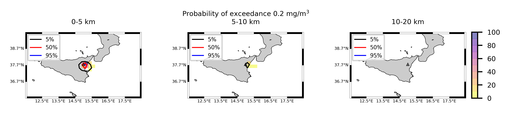

Forecast from VONA_20210228_0811Z
=================================

Contents
========

* [Forecast products](#forecast-products)
	* [Forecast at 2021-02-28 09:10 Z from RED VONA issued at 20210228_0811Z](#forecast-at-2021-02-28-0910-z-from-red-vona-issued-at-20210228_0811z)
	* [Forecast at 2021-02-28 10:10 Z from RED VONA issued at 20210228_0811Z](#forecast-at-2021-02-28-1010-z-from-red-vona-issued-at-20210228_0811z)
	* [Forecast at 2021-02-28 11:10 Z from RED VONA issued at 20210228_0811Z](#forecast-at-2021-02-28-1110-z-from-red-vona-issued-at-20210228_0811z)

# Forecast products

## Forecast at 2021-02-28 09:10 Z from RED VONA issued at 20210228_0811Z
  

|Eruption start [Z]|Eruption end [Z]|Forecast time [Z]|Column height asl [m]|
| :--- | :--- | :--- | :--- |
|2021-02-28 08:10:00|Ongoing|2021-02-28 09:10:00|6000 ± 500 - from VONA|
  
  

|Percentile|MER [kg/s¹]|Mass air [kg]|Mass air nested dom. [kg]|Mass grd [kg]|Mass grd nested dom. [kg]|
| :--- | :--- | :--- | :--- | :--- | :--- |
|5th|5.38e+03|7.27e+06|7.27e+06|1.38e+07|1.38e+07|
|50th|1.44e+04|2.46e+07|2.46e+07|3.05e+07|3.05e+07|
|95th|3.65e+04|6.01e+07|5.46e+07|7.78e+07|7.77e+07|
  

### Ground Nested Domain 2021-02-28 09:10 Z
  
  
  
  
  
  
  
  
  
  
  
  
  
  
  
  
  
  
  
  
  
  
  

|Location|Ground load [kg/m²] 5th perc|Ground load [kg/m²] 50th perc|Ground load [kg/m²] 95th perc|
| :--- | :--- | :--- | :--- |
|Sarro (1)|0.00e+00|0.00e+00|6.64e-03|
|Airone (2)|0.00e+00|3.70e-06|4.61e-02|
|Zafferana Ingresso (3)|0.00e+00|0.00e+00|1.57e-02|
|Zafferana Rotonda (4)|0.00e+00|0.00e+00|2.00e-02|
|Petrulli (5)|0.00e+00|0.00e+00|1.67e-02|
|Milo (6)|0.00e+00|0.00e+00|2.60e-02|
|Fornazzo (7)|0.00e+00|0.00e+00|2.98e-02|
|Rinuccio (8)|0.00e+00|0.00e+00|3.72e-02|
|S. Alfio (9)|0.00e+00|0.00e+00|1.53e-03|
|Macchia (10)|0.00e+00|0.00e+00|2.94e-04|
|S. Venerina (11)|0.00e+00|0.00e+00|1.15e-04|
|Linera (12)|0.00e+00|0.00e+00|1.96e-05|
|Dagala chiesa S. Maria (13)|0.00e+00|0.00e+00|7.48e-05|
|Giarre Piazza Maccheroni (14)|0.00e+00|0.00e+00|0.00e+00|
|Milo parco (15)|0.00e+00|0.00e+00|1.55e-02|
|Catania AP (16)|0.00e+00|0.00e+00|0.00e+00|
|Nicolosi (17)|0.00e+00|0.00e+00|3.33e-04|
|Zafferana (18)|0.00e+00|0.00e+00|1.44e-02|
|Linguaglossa (19)|0.00e+00|0.00e+00|0.00e+00|
|Randazzo (20)|0.00e+00|0.00e+00|0.00e+00|
|Bronte (21)|0.00e+00|0.00e+00|0.00e+00|
|Biancavilla (22)|0.00e+00|0.00e+00|0.00e+00|
  

### Atmosphere 2021-02-28 09:10 Z
  

## Forecast at 2021-02-28 10:10 Z from RED VONA issued at 20210228_0811Z
  

|Eruption start [Z]|Eruption end [Z]|Forecast time [Z]|Column height asl [m]|
| :--- | :--- | :--- | :--- |
|2021-02-28 08:10:00|Ongoing|2021-02-28 10:10:00|6000 ± 500 - from VONA|
  
  

|Percentile|MER [kg/s¹]|Mass air [kg]|Mass air nested dom. [kg]|Mass grd [kg]|Mass grd nested dom. [kg]|
| :--- | :--- | :--- | :--- | :--- | :--- |
|5th|4.23e+03|1.68e+07|1.68e+07|3.79e+07|3.79e+07|
|50th|1.54e+04|3.41e+07|3.41e+07|7.32e+07|7.32e+07|
|95th|3.49e+04|8.49e+07|7.87e+07|1.84e+08|1.82e+08|
  

### Ground Nested Domain 2021-02-28 10:10 Z
  
  
  
  
  
  
  
  
  
  
  
  
  
  
  
  
  
  
  
  
  
  
  

|Location|Ground load [kg/m²] 5th perc|Ground load [kg/m²] 50th perc|Ground load [kg/m²] 95th perc|
| :--- | :--- | :--- | :--- |
|Sarro (1)|0.00e+00|9.55e-04|8.70e-02|
|Airone (2)|1.11e-05|5.04e-03|2.07e-01|
|Zafferana Ingresso (3)|0.00e+00|2.31e-03|1.43e-01|
|Zafferana Rotonda (4)|0.00e+00|2.59e-03|8.14e-02|
|Petrulli (5)|0.00e+00|2.04e-03|5.54e-02|
|Milo (6)|0.00e+00|1.02e-03|8.37e-02|
|Fornazzo (7)|0.00e+00|1.93e-04|1.46e-01|
|Rinuccio (8)|0.00e+00|2.90e-04|1.69e-01|
|S. Alfio (9)|0.00e+00|0.00e+00|5.50e-02|
|Macchia (10)|0.00e+00|0.00e+00|4.52e-03|
|S. Venerina (11)|0.00e+00|2.40e-07|7.92e-03|
|Linera (12)|0.00e+00|0.00e+00|2.31e-02|
|Dagala chiesa S. Maria (13)|0.00e+00|4.47e-06|8.89e-03|
|Giarre Piazza Maccheroni (14)|0.00e+00|0.00e+00|1.08e-04|
|Milo parco (15)|0.00e+00|1.03e-03|6.42e-02|
|Catania AP (16)|0.00e+00|0.00e+00|2.89e-05|
|Nicolosi (17)|0.00e+00|1.17e-05|2.07e-01|
|Zafferana (18)|0.00e+00|1.74e-03|1.53e-01|
|Linguaglossa (19)|0.00e+00|0.00e+00|0.00e+00|
|Randazzo (20)|0.00e+00|0.00e+00|0.00e+00|
|Bronte (21)|0.00e+00|0.00e+00|0.00e+00|
|Biancavilla (22)|0.00e+00|0.00e+00|5.29e-04|
  

### Atmosphere 2021-02-28 10:10 Z
  

## Forecast at 2021-02-28 11:10 Z from RED VONA issued at 20210228_0811Z
  

|Eruption start [Z]|Eruption end [Z]|Forecast time [Z]|Column height asl [m]|
| :--- | :--- | :--- | :--- |
|2021-02-28 08:10:00|Ongoing|2021-02-28 11:10:00|6000 ± 500 - from VONA|
  
  

|Percentile|MER [kg/s¹]|Mass air [kg]|Mass air nested dom. [kg]|Mass grd [kg]|Mass grd nested dom. [kg]|
| :--- | :--- | :--- | :--- | :--- | :--- |
|5th|4.71e+03|2.17e+07|2.17e+07|8.41e+07|8.41e+07|
|50th|1.54e+04|4.45e+07|4.42e+07|1.31e+08|1.31e+08|
|95th|3.36e+04|8.81e+07|8.81e+07|2.47e+08|2.46e+08|
  

### Ground Nested Domain 2021-02-28 11:10 Z
  
  
  
  
  
  
  
  
  
  
  
  
  
  
  
  
  
  
  
  
  
  
  

|Location|Ground load [kg/m²] 5th perc|Ground load [kg/m²] 50th perc|Ground load [kg/m²] 95th perc|
| :--- | :--- | :--- | :--- |
|Sarro (1)|2.64e-06|6.82e-03|1.82e-01|
|Airone (2)|8.53e-04|2.07e-02|3.04e-01|
|Zafferana Ingresso (3)|2.90e-06|6.82e-03|1.82e-01|
|Zafferana Rotonda (4)|0.00e+00|1.47e-02|1.35e-01|
|Petrulli (5)|0.00e+00|1.04e-02|1.97e-01|
|Milo (6)|0.00e+00|5.56e-03|2.15e-01|
|Fornazzo (7)|0.00e+00|3.35e-03|2.02e-01|
|Rinuccio (8)|0.00e+00|4.96e-03|2.74e-01|
|S. Alfio (9)|0.00e+00|2.01e-05|5.70e-02|
|Macchia (10)|0.00e+00|1.32e-04|5.68e-02|
|S. Venerina (11)|0.00e+00|4.11e-04|1.80e-02|
|Linera (12)|0.00e+00|5.24e-04|3.46e-02|
|Dagala chiesa S. Maria (13)|0.00e+00|9.78e-04|3.49e-02|
|Giarre Piazza Maccheroni (14)|0.00e+00|1.63e-07|3.08e-02|
|Milo parco (15)|0.00e+00|5.10e-03|1.97e-01|
|Catania AP (16)|0.00e+00|0.00e+00|5.45e-03|
|Nicolosi (17)|0.00e+00|3.81e-03|3.91e-01|
|Zafferana (18)|6.67e-06|7.33e-03|2.28e-01|
|Linguaglossa (19)|0.00e+00|0.00e+00|2.18e-04|
|Randazzo (20)|0.00e+00|0.00e+00|0.00e+00|
|Bronte (21)|0.00e+00|0.00e+00|0.00e+00|
|Biancavilla (22)|0.00e+00|0.00e+00|1.14e-02|
  

### Atmosphere 2021-02-28 11:10 Z
  
  
Go to [Supplementary page](Supplementary_page.md)  
Go to [Main directory](https://github.com/federicapardini/Real_time_ash_forecast)