Forecast from VONA_20210228_0811Z
=================================

Contents
========

* [Forecast products](#forecast-products)
	* [Forecast at 2021-02-28 09:10 Z from RED VONA issued at 20210228_0811Z](#forecast-at-2021-02-28-0910-z-from-red-vona-issued-at-20210228_0811z)
	* [Forecast at 2021-02-28 10:10 Z from RED VONA issued at 20210228_0811Z](#forecast-at-2021-02-28-1010-z-from-red-vona-issued-at-20210228_0811z)
	* [Forecast at 2021-02-28 11:10 Z from RED VONA issued at 20210228_0811Z](#forecast-at-2021-02-28-1110-z-from-red-vona-issued-at-20210228_0811z)
	* [Forecast at 2021-02-28 14:10 Z from RED VONA issued at 20210228_0811Z](#forecast-at-2021-02-28-1410-z-from-red-vona-issued-at-20210228_0811z)
	* [Forecast at 2021-02-28 09:40 Z from RED VONA issued at 20210228_0835Z](#forecast-at-2021-02-28-0940-z-from-red-vona-issued-at-20210228_0835z)
	* [Forecast at 2021-02-28 10:40 Z from RED VONA issued at 20210228_0835Z](#forecast-at-2021-02-28-1040-z-from-red-vona-issued-at-20210228_0835z)
	* [Forecast at 2021-02-28 11:40 Z from RED VONA issued at 20210228_0835Z](#forecast-at-2021-02-28-1140-z-from-red-vona-issued-at-20210228_0835z)
	* [Forecast at 2021-02-28 14:40 Z from RED VONA issued at 20210228_0835Z](#forecast-at-2021-02-28-1440-z-from-red-vona-issued-at-20210228_0835z)
	* [Forecast at 2021-02-28 17:40 Z from RED VONA issued at 20210228_0835Z](#forecast-at-2021-02-28-1740-z-from-red-vona-issued-at-20210228_0835z)
	* [Forecast at 2021-02-28 20:40 Z from RED VONA issued at 20210228_0835Z](#forecast-at-2021-02-28-2040-z-from-red-vona-issued-at-20210228_0835z)
	* [Forecast at 2021-02-28 11:50 Z from RED VONA issued at 20210228_1047Z](#forecast-at-2021-02-28-1150-z-from-red-vona-issued-at-20210228_1047z)
	* [Forecast at 2021-02-28 12:50 Z from RED VONA issued at 20210228_1047Z](#forecast-at-2021-02-28-1250-z-from-red-vona-issued-at-20210228_1047z)
	* [Forecast at 2021-02-28 13:50 Z from RED VONA issued at 20210228_1047Z](#forecast-at-2021-02-28-1350-z-from-red-vona-issued-at-20210228_1047z)
	* [Forecast at 2021-02-28 16:50 Z from RED VONA issued at 20210228_1047Z](#forecast-at-2021-02-28-1650-z-from-red-vona-issued-at-20210228_1047z)
	* [Forecast at 2021-02-28 19:50 Z from RED VONA issued at 20210228_1047Z](#forecast-at-2021-02-28-1950-z-from-red-vona-issued-at-20210228_1047z)
	* [Forecast at 2021-02-28 22:50 Z from RED VONA issued at 20210228_1047Z](#forecast-at-2021-02-28-2250-z-from-red-vona-issued-at-20210228_1047z)
	* [Forecast at 2021-02-28 16:50 Z from ORANGE VONA issued at 20210228_1426Z](#forecast-at-2021-02-28-1650-z-from-orange-vona-issued-at-20210228_1426z)
	* [Forecast at 2021-02-28 19:50 Z from ORANGE VONA issued at 20210228_1426Z](#forecast-at-2021-02-28-1950-z-from-orange-vona-issued-at-20210228_1426z)
	* [Forecast at 2021-02-28 22:50 Z from ORANGE VONA issued at 20210228_1426Z](#forecast-at-2021-02-28-2250-z-from-orange-vona-issued-at-20210228_1426z)

# Forecast products

## Forecast at 2021-02-28 09:10 Z from RED VONA issued at 20210228_0811Z
  

|Eruption start [Z]|Eruption end [Z]|Forecast time [Z]|Column height asl [m]|
| :--- | :--- | :--- | :--- |
|2021-02-28 08:10:00|Ongoing|2021-02-28 09:10:00|6000 ± 500 - from VONA|
  
  

|Percentile|MER [kg/s¹]|Mass air [kg]|Mass air nested dom. [kg]|Mass grd [kg]|Mass grd nested dom. [kg]|
| :--- | :--- | :--- | :--- | :--- | :--- |
|5th|4.43e+03|5.45e+06|5.45e+06|1.21e+07|1.21e+07|
|50th|1.51e+04|1.83e+07|1.83e+07|3.51e+07|3.51e+07|
|95th|2.93e+04|3.94e+07|3.94e+07|6.51e+07|6.51e+07|
  

### Ground Nested Domain 2021-02-28 09:10 Z
  
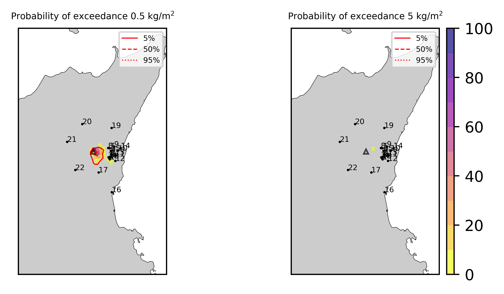  
  
  
  
  
  
  
  
  
  
  
  
  
  
  
  
  
  
  
  
  
  

|Location|Ground load [kg/m²] 5th perc|Ground load [kg/m²] 50th perc|Ground load [kg/m²] 95th perc|
| :--- | :--- | :--- | :--- |
|Sarro (1)|0.00e+00|0.00e+00|3.01e-02|
|Airone (2)|0.00e+00|2.04e-06|9.83e-02|
|Zafferana Ingresso (3)|0.00e+00|0.00e+00|3.18e-02|
|Zafferana Rotonda (4)|0.00e+00|0.00e+00|2.77e-02|
|Petrulli (5)|0.00e+00|0.00e+00|1.02e-02|
|Milo (6)|0.00e+00|0.00e+00|9.60e-04|
|Fornazzo (7)|0.00e+00|0.00e+00|3.22e-03|
|Rinuccio (8)|0.00e+00|0.00e+00|6.72e-03|
|S. Alfio (9)|0.00e+00|0.00e+00|0.00e+00|
|Macchia (10)|0.00e+00|0.00e+00|0.00e+00|
|S. Venerina (11)|0.00e+00|0.00e+00|0.00e+00|
|Linera (12)|0.00e+00|0.00e+00|2.66e-04|
|Dagala chiesa S. Maria (13)|0.00e+00|0.00e+00|0.00e+00|
|Giarre Piazza Maccheroni (14)|0.00e+00|0.00e+00|0.00e+00|
|Milo parco (15)|0.00e+00|0.00e+00|6.13e-04|
|Catania AP (16)|0.00e+00|0.00e+00|0.00e+00|
|Nicolosi (17)|0.00e+00|0.00e+00|1.91e-02|
|Zafferana (18)|0.00e+00|0.00e+00|3.92e-02|
|Linguaglossa (19)|0.00e+00|0.00e+00|0.00e+00|
|Randazzo (20)|0.00e+00|0.00e+00|0.00e+00|
|Bronte (21)|0.00e+00|0.00e+00|0.00e+00|
|Biancavilla (22)|0.00e+00|0.00e+00|0.00e+00|
  

### Atmosphere 2021-02-28 09:10 Z
  
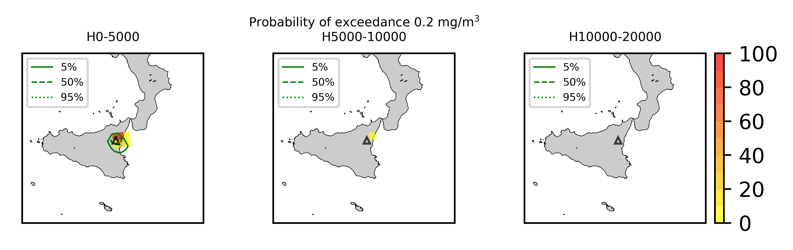
## Forecast at 2021-02-28 10:10 Z from RED VONA issued at 20210228_0811Z
  

|Eruption start [Z]|Eruption end [Z]|Forecast time [Z]|Column height asl [m]|
| :--- | :--- | :--- | :--- |
|2021-02-28 08:10:00|Ongoing|2021-02-28 10:10:00|6000 ± 500 - from VONA|
  
  

|Percentile|MER [kg/s¹]|Mass air [kg]|Mass air nested dom. [kg]|Mass grd [kg]|Mass grd nested dom. [kg]|
| :--- | :--- | :--- | :--- | :--- | :--- |
|5th|5.95e+03|1.17e+07|1.17e+07|4.63e+07|4.63e+07|
|50th|1.54e+04|3.03e+07|3.02e+07|9.65e+07|9.64e+07|
|95th|3.84e+04|5.25e+07|5.25e+07|1.42e+08|1.42e+08|
  

### Ground Nested Domain 2021-02-28 10:10 Z
  
  
  
  
  
  
  
  
  
  
  
  
  
  
  
  
  
  
  
  
  
  
  

|Location|Ground load [kg/m²] 5th perc|Ground load [kg/m²] 50th perc|Ground load [kg/m²] 95th perc|
| :--- | :--- | :--- | :--- |
|Sarro (1)|0.00e+00|5.49e-04|5.74e-02|
|Airone (2)|0.00e+00|2.86e-03|1.53e-01|
|Zafferana Ingresso (3)|0.00e+00|6.65e-04|1.24e-01|
|Zafferana Rotonda (4)|0.00e+00|5.76e-04|5.78e-02|
|Petrulli (5)|0.00e+00|3.40e-04|3.01e-02|
|Milo (6)|0.00e+00|1.89e-05|3.11e-02|
|Fornazzo (7)|0.00e+00|1.93e-05|1.66e-02|
|Rinuccio (8)|0.00e+00|2.90e-05|3.06e-02|
|S. Alfio (9)|0.00e+00|0.00e+00|8.18e-03|
|Macchia (10)|0.00e+00|0.00e+00|1.35e-03|
|S. Venerina (11)|0.00e+00|0.00e+00|2.00e-03|
|Linera (12)|0.00e+00|0.00e+00|1.09e-02|
|Dagala chiesa S. Maria (13)|0.00e+00|0.00e+00|7.32e-03|
|Giarre Piazza Maccheroni (14)|0.00e+00|0.00e+00|3.11e-04|
|Milo parco (15)|0.00e+00|1.54e-05|2.99e-02|
|Catania AP (16)|0.00e+00|0.00e+00|2.16e-05|
|Nicolosi (17)|0.00e+00|2.41e-03|1.32e-01|
|Zafferana (18)|0.00e+00|8.00e-04|8.31e-02|
|Linguaglossa (19)|0.00e+00|0.00e+00|0.00e+00|
|Randazzo (20)|0.00e+00|0.00e+00|0.00e+00|
|Bronte (21)|0.00e+00|0.00e+00|0.00e+00|
|Biancavilla (22)|0.00e+00|0.00e+00|8.12e-04|
  

### Atmosphere 2021-02-28 10:10 Z
  

## Forecast at 2021-02-28 11:10 Z from RED VONA issued at 20210228_0811Z
  

|Eruption start [Z]|Eruption end [Z]|Forecast time [Z]|Column height asl [m]|
| :--- | :--- | :--- | :--- |
|2021-02-28 08:10:00|Ongoing|2021-02-28 11:10:00|6000 ± 500 - from VONA|
  
  

|Percentile|MER [kg/s¹]|Mass air [kg]|Mass air nested dom. [kg]|Mass grd [kg]|Mass grd nested dom. [kg]|
| :--- | :--- | :--- | :--- | :--- | :--- |
|5th|5.05e+03|1.40e+07|1.39e+07|7.53e+07|7.53e+07|
|50th|1.59e+04|3.17e+07|3.17e+07|1.47e+08|1.47e+08|
|95th|3.80e+04|7.00e+07|7.00e+07|2.42e+08|2.42e+08|
  

### Ground Nested Domain 2021-02-28 11:10 Z
  
  
  
  
  
  
  
  
  
  
  
  
  
  
  
  
  
  
  
  
  
  
  

|Location|Ground load [kg/m²] 5th perc|Ground load [kg/m²] 50th perc|Ground load [kg/m²] 95th perc|
| :--- | :--- | :--- | :--- |
|Sarro (1)|0.00e+00|1.49e-02|1.92e-01|
|Airone (2)|1.04e-05|3.11e-02|2.86e-01|
|Zafferana Ingresso (3)|0.00e+00|9.70e-03|2.75e-01|
|Zafferana Rotonda (4)|0.00e+00|1.07e-02|2.83e-01|
|Petrulli (5)|0.00e+00|1.13e-02|1.24e-01|
|Milo (6)|0.00e+00|6.56e-03|7.72e-02|
|Fornazzo (7)|0.00e+00|8.90e-03|7.30e-02|
|Rinuccio (8)|0.00e+00|1.07e-02|8.66e-02|
|S. Alfio (9)|0.00e+00|2.29e-04|3.50e-02|
|Macchia (10)|0.00e+00|8.33e-06|2.67e-02|
|S. Venerina (11)|0.00e+00|7.78e-05|1.59e-02|
|Linera (12)|0.00e+00|4.70e-04|1.11e-02|
|Dagala chiesa S. Maria (13)|0.00e+00|2.36e-04|2.97e-02|
|Giarre Piazza Maccheroni (14)|0.00e+00|0.00e+00|9.61e-03|
|Milo parco (15)|0.00e+00|6.14e-03|7.14e-02|
|Catania AP (16)|0.00e+00|0.00e+00|1.62e-02|
|Nicolosi (17)|0.00e+00|3.52e-02|3.52e-01|
|Zafferana (18)|0.00e+00|9.62e-03|2.88e-01|
|Linguaglossa (19)|0.00e+00|0.00e+00|2.49e-04|
|Randazzo (20)|0.00e+00|0.00e+00|0.00e+00|
|Bronte (21)|0.00e+00|0.00e+00|0.00e+00|
|Biancavilla (22)|0.00e+00|0.00e+00|1.05e-02|
  

### Atmosphere 2021-02-28 11:10 Z
  
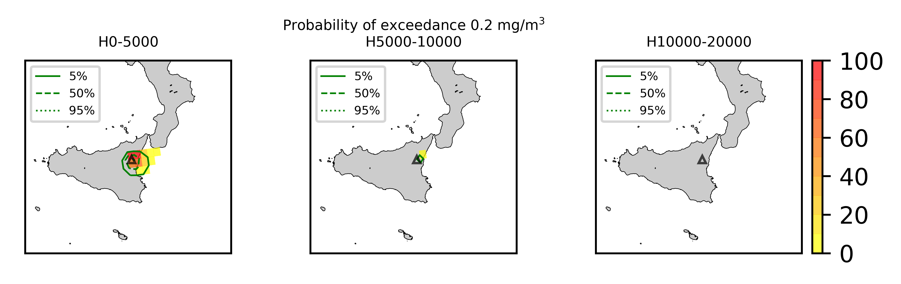
## Forecast at 2021-02-28 14:10 Z from RED VONA issued at 20210228_0811Z
  

|Eruption start [Z]|Eruption end [Z]|Forecast time [Z]|Column height asl [m]|
| :--- | :--- | :--- | :--- |
|2021-02-28 08:10:00|Ongoing|2021-02-28 14:10:00|6000 ± 500 - from VONA|
  
  

|Percentile|MER [kg/s¹]|Mass air [kg]|Mass air nested dom. [kg]|Mass grd [kg]|Mass grd nested dom. [kg]|
| :--- | :--- | :--- | :--- | :--- | :--- |
|5th|4.20e+03|1.29e+07|1.28e+07|2.36e+08|2.36e+08|
|50th|2.04e+04|5.98e+07|5.93e+07|3.59e+08|3.59e+08|
|95th|4.54e+04|1.03e+08|1.01e+08|6.43e+08|6.42e+08|
  

### Ground Nested Domain 2021-02-28 14:10 Z
  
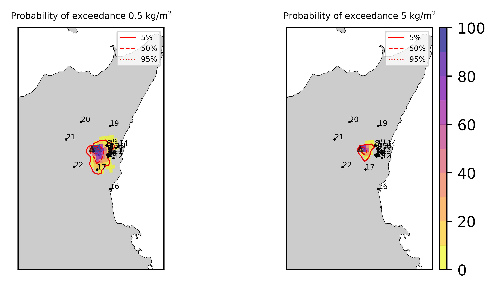  
  
  
  
  
  
  
  
  
  
  
  
  
  
  
  
  
  
  
  
  
  

|Location|Ground load [kg/m²] 5th perc|Ground load [kg/m²] 50th perc|Ground load [kg/m²] 95th perc|
| :--- | :--- | :--- | :--- |
|Sarro (1)|5.60e-03|7.32e-02|3.73e-01|
|Airone (2)|8.32e-03|1.24e-01|6.91e-01|
|Zafferana Ingresso (3)|6.47e-03|6.57e-02|4.41e-01|
|Zafferana Rotonda (4)|4.25e-03|5.49e-02|4.28e-01|
|Petrulli (5)|2.87e-03|4.89e-02|3.01e-01|
|Milo (6)|8.91e-05|2.31e-02|1.14e+00|
|Fornazzo (7)|9.27e-05|2.69e-02|2.34e+00|
|Rinuccio (8)|1.63e-04|3.53e-02|3.60e+00|
|S. Alfio (9)|1.54e-06|6.89e-03|6.87e-01|
|Macchia (10)|5.56e-06|3.71e-03|2.34e-01|
|S. Venerina (11)|1.57e-04|8.18e-03|1.70e-01|
|Linera (12)|4.52e-04|1.13e-02|2.41e-02|
|Dagala chiesa S. Maria (13)|1.31e-04|6.46e-03|2.53e-01|
|Giarre Piazza Maccheroni (14)|0.00e+00|1.11e-03|8.89e-02|
|Milo parco (15)|7.24e-05|2.23e-02|9.84e-01|
|Catania AP (16)|0.00e+00|3.90e-05|2.75e-02|
|Nicolosi (17)|6.65e-03|8.07e-02|8.42e-01|
|Zafferana (18)|6.95e-03|7.50e-02|4.32e-01|
|Linguaglossa (19)|0.00e+00|0.00e+00|5.83e-03|
|Randazzo (20)|0.00e+00|0.00e+00|6.62e-03|
|Bronte (21)|0.00e+00|0.00e+00|4.67e-05|
|Biancavilla (22)|0.00e+00|3.11e-03|2.27e-02|
  

### Atmosphere 2021-02-28 14:10 Z
  
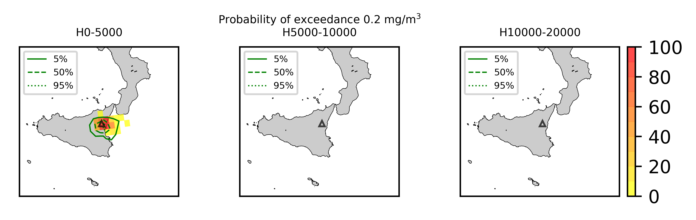
## Forecast at 2021-02-28 09:40 Z from RED VONA issued at 20210228_0835Z
  

|Eruption start [Z]|Eruption end [Z]|Forecast time [Z]|Column height asl [m]|
| :--- | :--- | :--- | :--- |
|2021-02-28 08:10:00|Ongoing|2021-02-28 09:40:00|9000 ± 500 - from VONA|
  
  

|Percentile|MER [kg/s¹]|Mass air [kg]|Mass air nested dom. [kg]|Mass grd [kg]|Mass grd nested dom. [kg]|
| :--- | :--- | :--- | :--- | :--- | :--- |
|5th|3.47e+04|8.80e+07|8.80e+07|1.03e+08|1.03e+08|
|50th|2.03e+05|3.25e+08|3.25e+08|4.84e+08|4.83e+08|
|95th|1.16e+06|1.91e+09|1.77e+09|2.20e+09|2.19e+09|
  

### Ground Nested Domain 2021-02-28 09:40 Z
  
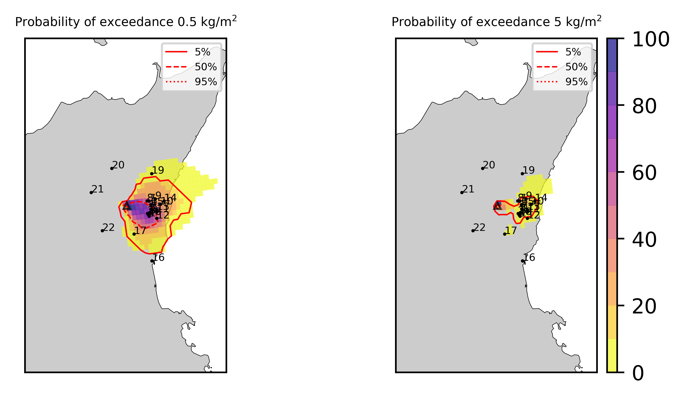  
  
  
  
  
  
  
  
  
  
  
  
  
  
  
  
  
  
  
  
  
  

|Location|Ground load [kg/m²] 5th perc|Ground load [kg/m²] 50th perc|Ground load [kg/m²] 95th perc|
| :--- | :--- | :--- | :--- |
|Sarro (1)|6.84e-02|1.18e+00|4.50e+00|
|Airone (2)|9.00e-02|1.18e+00|4.35e+00|
|Zafferana Ingresso (3)|6.10e-02|1.05e+00|4.11e+00|
|Zafferana Rotonda (4)|3.89e-02|1.00e+00|4.68e+00|
|Petrulli (5)|2.86e-02|1.31e+00|6.41e+00|
|Milo (6)|6.45e-03|5.46e-01|6.02e+00|
|Fornazzo (7)|7.99e-04|2.43e-01|4.90e+00|
|Rinuccio (8)|8.51e-04|2.75e-01|4.13e+00|
|S. Alfio (9)|1.17e-04|5.07e-02|5.57e+00|
|Macchia (10)|8.33e-06|6.82e-02|6.04e+00|
|S. Venerina (11)|2.93e-03|5.51e-01|6.44e+00|
|Linera (12)|8.26e-04|3.52e-01|3.10e+00|
|Dagala chiesa S. Maria (13)|1.60e-03|5.80e-01|7.14e+00|
|Giarre Piazza Maccheroni (14)|0.00e+00|9.18e-03|5.24e+00|
|Milo parco (15)|6.53e-03|5.31e-01|6.15e+00|
|Catania AP (16)|0.00e+00|0.00e+00|8.04e-02|
|Nicolosi (17)|0.00e+00|5.16e-02|1.24e+00|
|Zafferana (18)|8.69e-02|1.12e+00|4.21e+00|
|Linguaglossa (19)|0.00e+00|0.00e+00|1.30e-01|
|Randazzo (20)|0.00e+00|0.00e+00|1.67e-05|
|Bronte (21)|0.00e+00|0.00e+00|0.00e+00|
|Biancavilla (22)|0.00e+00|0.00e+00|4.17e-06|
  

### Atmosphere 2021-02-28 09:40 Z
  
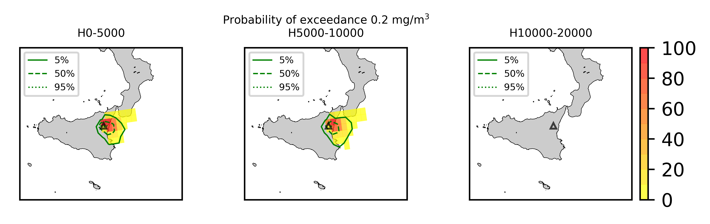
## Forecast at 2021-02-28 10:40 Z from RED VONA issued at 20210228_0835Z
  

|Eruption start [Z]|Eruption end [Z]|Forecast time [Z]|Column height asl [m]|
| :--- | :--- | :--- | :--- |
|2021-02-28 08:10:00|Ongoing|2021-02-28 10:40:00|9000 ± 500 - from VONA|
  
  

|Percentile|MER [kg/s¹]|Mass air [kg]|Mass air nested dom. [kg]|Mass grd [kg]|Mass grd nested dom. [kg]|
| :--- | :--- | :--- | :--- | :--- | :--- |
|5th|6.14e+04|2.03e+08|1.99e+08|5.78e+08|5.78e+08|
|50th|1.94e+05|3.46e+08|3.40e+08|1.22e+09|1.22e+09|
|95th|6.64e+05|1.35e+09|1.18e+09|3.52e+09|3.49e+09|
  

### Ground Nested Domain 2021-02-28 10:40 Z
  
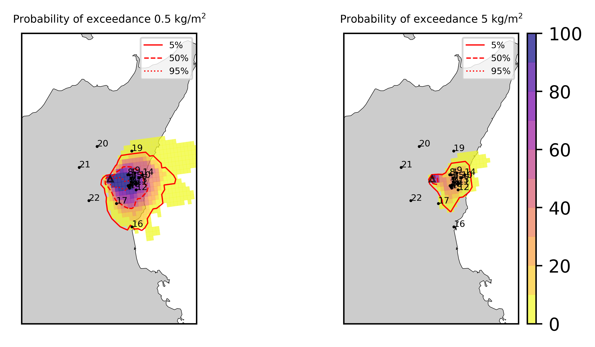  
  
  
  
  
  
  
  
  
  
  
  
  
  
  
  
  
  
  
  
  
  

|Location|Ground load [kg/m²] 5th perc|Ground load [kg/m²] 50th perc|Ground load [kg/m²] 95th perc|
| :--- | :--- | :--- | :--- |
|Sarro (1)|5.40e-01|3.75e+00|1.08e+01|
|Airone (2)|7.67e-01|3.78e+00|1.13e+01|
|Zafferana Ingresso (3)|6.29e-01|3.35e+00|1.19e+01|
|Zafferana Rotonda (4)|7.72e-01|3.36e+00|1.13e+01|
|Petrulli (5)|5.63e-01|2.77e+00|9.27e+00|
|Milo (6)|1.97e-01|3.00e+00|8.80e+00|
|Fornazzo (7)|2.43e-01|3.14e+00|5.91e+00|
|Rinuccio (8)|3.01e-01|2.76e+00|5.60e+00|
|S. Alfio (9)|5.92e-02|1.70e+00|9.00e+00|
|Macchia (10)|3.31e-02|9.75e-01|8.24e+00|
|S. Venerina (11)|2.04e-01|1.51e+00|1.28e+01|
|Linera (12)|1.12e-01|1.83e+00|1.13e+01|
|Dagala chiesa S. Maria (13)|1.31e-01|1.74e+00|1.10e+01|
|Giarre Piazza Maccheroni (14)|1.32e-02|4.16e-01|6.83e+00|
|Milo parco (15)|1.85e-01|2.94e+00|8.95e+00|
|Catania AP (16)|0.00e+00|1.44e-03|3.79e-01|
|Nicolosi (17)|6.11e-03|2.58e-01|2.94e+00|
|Zafferana (18)|5.87e-01|3.76e+00|1.22e+01|
|Linguaglossa (19)|0.00e+00|3.96e-03|2.07e-01|
|Randazzo (20)|0.00e+00|0.00e+00|2.67e-05|
|Bronte (21)|0.00e+00|0.00e+00|0.00e+00|
|Biancavilla (22)|0.00e+00|0.00e+00|5.36e-03|
  

### Atmosphere 2021-02-28 10:40 Z
  
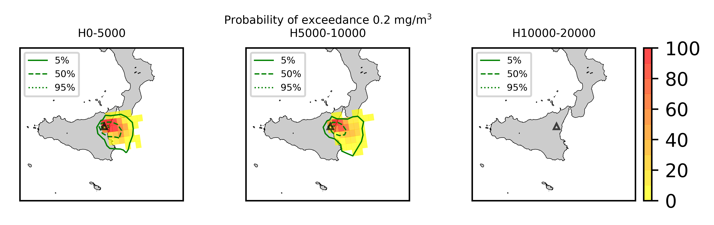
## Forecast at 2021-02-28 11:40 Z from RED VONA issued at 20210228_0835Z
  

|Eruption start [Z]|Eruption end [Z]|Forecast time [Z]|Column height asl [m]|
| :--- | :--- | :--- | :--- |
|2021-02-28 08:10:00|Ongoing|2021-02-28 11:40:00|9000 ± 500 - from VONA|
  
  

|Percentile|MER [kg/s¹]|Mass air [kg]|Mass air nested dom. [kg]|Mass grd [kg]|Mass grd nested dom. [kg]|
| :--- | :--- | :--- | :--- | :--- | :--- |
|5th|7.11e+04|1.61e+08|1.60e+08|9.80e+08|9.79e+08|
|50th|1.79e+05|5.26e+08|4.46e+08|1.83e+09|1.83e+09|
|95th|7.01e+05|2.06e+09|1.57e+09|4.54e+09|4.47e+09|
  

### Ground Nested Domain 2021-02-28 11:40 Z
  
  
  
  
  
  
  
  
  
  
  
  
  
  
  
  
  
  
  
  
  
  
  

|Location|Ground load [kg/m²] 5th perc|Ground load [kg/m²] 50th perc|Ground load [kg/m²] 95th perc|
| :--- | :--- | :--- | :--- |
|Sarro (1)|1.29e+00|6.12e+00|1.53e+01|
|Airone (2)|2.12e+00|5.57e+00|1.41e+01|
|Zafferana Ingresso (3)|1.89e+00|5.31e+00|1.43e+01|
|Zafferana Rotonda (4)|2.07e+00|5.26e+00|1.35e+01|
|Petrulli (5)|1.78e+00|4.89e+00|1.14e+01|
|Milo (6)|9.70e-01|4.37e+00|1.16e+01|
|Fornazzo (7)|6.00e-01|4.57e+00|7.97e+00|
|Rinuccio (8)|6.46e-01|3.94e+00|7.65e+00|
|S. Alfio (9)|1.82e-01|3.72e+00|9.54e+00|
|Macchia (10)|2.24e-01|2.85e+00|8.52e+00|
|S. Venerina (11)|8.43e-01|3.98e+00|1.54e+01|
|Linera (12)|3.77e-01|3.16e+00|1.37e+01|
|Dagala chiesa S. Maria (13)|9.31e-01|3.92e+00|1.31e+01|
|Giarre Piazza Maccheroni (14)|6.15e-02|1.34e+00|7.81e+00|
|Milo parco (15)|9.39e-01|4.42e+00|1.17e+01|
|Catania AP (16)|0.00e+00|1.61e-02|4.60e-01|
|Nicolosi (17)|4.49e-02|6.67e-01|4.31e+00|
|Zafferana (18)|1.79e+00|5.81e+00|1.50e+01|
|Linguaglossa (19)|0.00e+00|5.58e-03|1.72e+00|
|Randazzo (20)|0.00e+00|0.00e+00|3.87e-04|
|Bronte (21)|0.00e+00|0.00e+00|0.00e+00|
|Biancavilla (22)|0.00e+00|9.57e-05|3.50e-02|
  

### Atmosphere 2021-02-28 11:40 Z
  
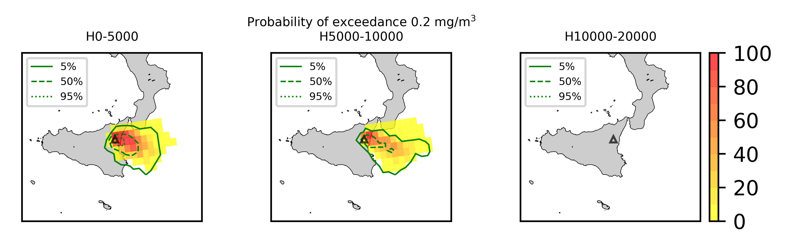
## Forecast at 2021-02-28 14:40 Z from RED VONA issued at 20210228_0835Z
  

|Eruption start [Z]|Eruption end [Z]|Forecast time [Z]|Column height asl [m]|
| :--- | :--- | :--- | :--- |
|2021-02-28 08:10:00|Ongoing|2021-02-28 14:40:00|9000 ± 500 - from VONA|
  
  

|Percentile|MER [kg/s¹]|Mass air [kg]|Mass air nested dom. [kg]|Mass grd [kg]|Mass grd nested dom. [kg]|
| :--- | :--- | :--- | :--- | :--- | :--- |
|5th|5.27e+04|2.28e+08|2.06e+08|1.59e+09|1.55e+09|
|50th|1.66e+05|5.83e+08|4.55e+08|4.19e+09|4.18e+09|
|95th|1.02e+06|3.41e+09|1.57e+09|1.24e+10|1.14e+10|
  

### Ground Nested Domain 2021-02-28 14:40 Z
  
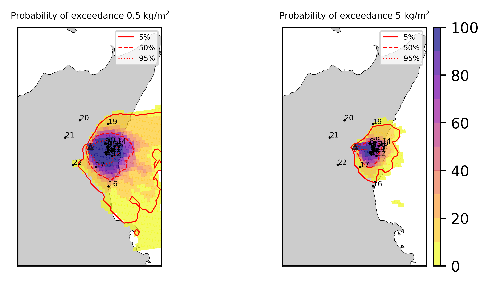  
  
  
  
  
  
  
  
  
  
  
  
  
  
  
  
  
  
  
  
  
  

|Location|Ground load [kg/m²] 5th perc|Ground load [kg/m²] 50th perc|Ground load [kg/m²] 95th perc|
| :--- | :--- | :--- | :--- |
|Sarro (1)|4.05e+00|1.22e+01|2.30e+01|
|Airone (2)|4.56e+00|1.24e+01|2.53e+01|
|Zafferana Ingresso (3)|3.89e+00|1.17e+01|2.58e+01|
|Zafferana Rotonda (4)|3.72e+00|1.13e+01|2.56e+01|
|Petrulli (5)|3.21e+00|1.12e+01|2.09e+01|
|Milo (6)|2.46e+00|8.96e+00|1.96e+01|
|Fornazzo (7)|1.42e+00|6.78e+00|1.77e+01|
|Rinuccio (8)|1.65e+00|6.71e+00|1.77e+01|
|S. Alfio (9)|4.81e-01|4.93e+00|2.24e+01|
|Macchia (10)|7.22e-01|6.79e+00|1.63e+01|
|S. Venerina (11)|1.60e+00|7.07e+00|2.12e+01|
|Linera (12)|1.30e+00|7.36e+00|1.88e+01|
|Dagala chiesa S. Maria (13)|1.79e+00|8.75e+00|1.90e+01|
|Giarre Piazza Maccheroni (14)|2.98e-01|4.11e+00|1.68e+01|
|Milo parco (15)|2.40e+00|9.08e+00|1.95e+01|
|Catania AP (16)|3.90e-03|1.14e-01|2.16e+00|
|Nicolosi (17)|1.59e-01|1.78e+00|9.16e+00|
|Zafferana (18)|4.22e+00|1.21e+01|2.46e+01|
|Linguaglossa (19)|1.62e-05|2.27e-02|2.09e+00|
|Randazzo (20)|0.00e+00|1.00e-05|1.76e-02|
|Bronte (21)|0.00e+00|0.00e+00|6.58e-04|
|Biancavilla (22)|0.00e+00|1.23e-02|2.84e-01|
  

### Atmosphere 2021-02-28 14:40 Z
  
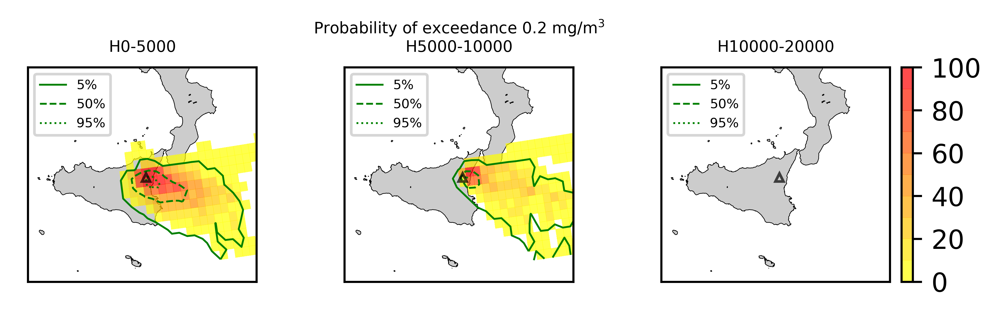
## Forecast at 2021-02-28 17:40 Z from RED VONA issued at 20210228_0835Z
  

|Eruption start [Z]|Eruption end [Z]|Forecast time [Z]|Column height asl [m]|
| :--- | :--- | :--- | :--- |
|2021-02-28 08:10:00|Ongoing|2021-02-28 17:40:00|9000 ± 500 - from VONA|
  
  

|Percentile|MER [kg/s¹]|Mass air [kg]|Mass air nested dom. [kg]|Mass grd [kg]|Mass grd nested dom. [kg]|
| :--- | :--- | :--- | :--- | :--- | :--- |
|5th|6.62e+04|2.67e+08|2.41e+08|3.12e+09|2.90e+09|
|50th|2.52e+05|8.99e+08|7.32e+08|6.47e+09|6.40e+09|
|95th|6.94e+05|1.92e+09|1.40e+09|1.60e+10|1.38e+10|
  

### Ground Nested Domain 2021-02-28 17:40 Z
  
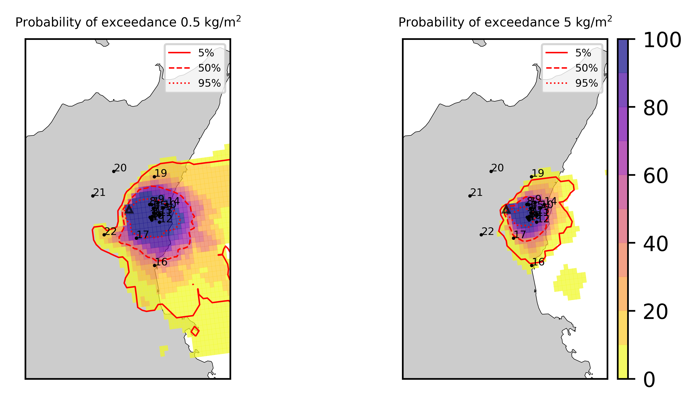  
  
  
  
  
  
  
  
  
  
  
  
  
  
  
  
  
  
  
  
  
  

|Location|Ground load [kg/m²] 5th perc|Ground load [kg/m²] 50th perc|Ground load [kg/m²] 95th perc|
| :--- | :--- | :--- | :--- |
|Sarro (1)|6.79e+00|2.04e+01|3.78e+01|
|Airone (2)|7.56e+00|1.93e+01|3.39e+01|
|Zafferana Ingresso (3)|6.89e+00|1.83e+01|3.37e+01|
|Zafferana Rotonda (4)|7.53e+00|1.88e+01|3.09e+01|
|Petrulli (5)|8.82e+00|1.69e+01|2.94e+01|
|Milo (6)|4.98e+00|1.55e+01|2.53e+01|
|Fornazzo (7)|3.41e+00|1.23e+01|2.41e+01|
|Rinuccio (8)|3.63e+00|1.19e+01|2.48e+01|
|S. Alfio (9)|1.68e+00|8.38e+00|2.92e+01|
|Macchia (10)|1.82e+00|1.02e+01|2.38e+01|
|S. Venerina (11)|6.20e+00|1.48e+01|2.47e+01|
|Linera (12)|3.77e+00|1.16e+01|2.68e+01|
|Dagala chiesa S. Maria (13)|5.46e+00|1.56e+01|2.54e+01|
|Giarre Piazza Maccheroni (14)|6.86e-01|5.33e+00|2.13e+01|
|Milo parco (15)|4.89e+00|1.57e+01|2.51e+01|
|Catania AP (16)|2.83e-02|3.13e-01|3.65e+00|
|Nicolosi (17)|5.00e-01|3.27e+00|1.27e+01|
|Zafferana (18)|6.76e+00|1.98e+01|3.64e+01|
|Linguaglossa (19)|1.62e-05|5.21e-02|2.10e+00|
|Randazzo (20)|0.00e+00|3.83e-05|1.77e-02|
|Bronte (21)|0.00e+00|2.36e-03|5.76e-02|
|Biancavilla (22)|9.96e-03|1.36e-01|8.20e-01|
  

### Atmosphere 2021-02-28 17:40 Z
  
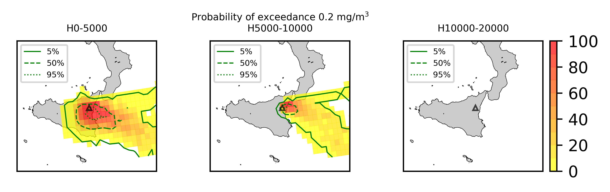
## Forecast at 2021-02-28 20:40 Z from RED VONA issued at 20210228_0835Z
  

|Eruption start [Z]|Eruption end [Z]|Forecast time [Z]|Column height asl [m]|
| :--- | :--- | :--- | :--- |
|2021-02-28 08:10:00|Ongoing|2021-02-28 20:40:00|9000 ± 500 - from VONA|
  
  

|Percentile|MER [kg/s¹]|Mass air [kg]|Mass air nested dom. [kg]|Mass grd [kg]|Mass grd nested dom. [kg]|
| :--- | :--- | :--- | :--- | :--- | :--- |
|5th|3.99e+04|3.96e+08|2.56e+08|6.57e+09|6.46e+09|
|50th|2.88e+05|1.00e+09|7.03e+08|9.29e+09|9.11e+09|
|95th|6.12e+05|2.07e+09|1.49e+09|1.78e+10|1.54e+10|
  

### Ground Nested Domain 2021-02-28 20:40 Z
  
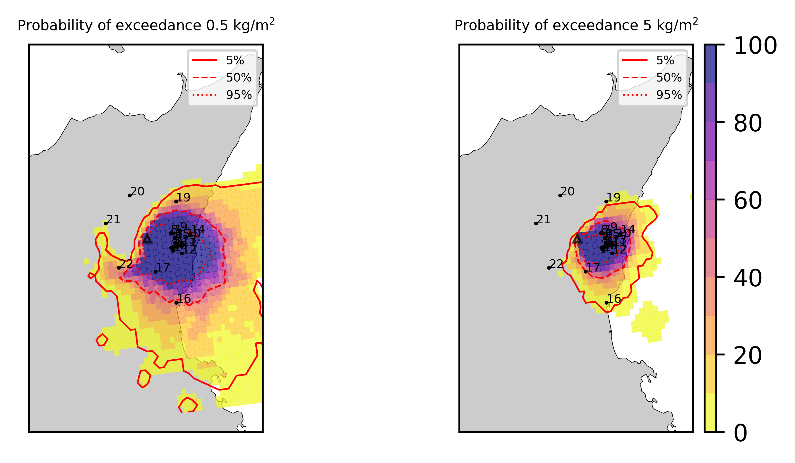  
  
  
  
  
  
  
  
  
  
  
  
  
  
  
  
  
  
  
  
  
  

|Location|Ground load [kg/m²] 5th perc|Ground load [kg/m²] 50th perc|Ground load [kg/m²] 95th perc|
| :--- | :--- | :--- | :--- |
|Sarro (1)|1.61e+01|2.57e+01|4.84e+01|
|Airone (2)|1.95e+01|2.81e+01|5.29e+01|
|Zafferana Ingresso (3)|1.79e+01|2.72e+01|5.30e+01|
|Zafferana Rotonda (4)|1.80e+01|2.71e+01|5.21e+01|
|Petrulli (5)|1.41e+01|2.49e+01|4.97e+01|
|Milo (6)|1.09e+01|2.30e+01|4.15e+01|
|Fornazzo (7)|6.05e+00|1.82e+01|3.40e+01|
|Rinuccio (8)|6.09e+00|1.69e+01|3.14e+01|
|S. Alfio (9)|2.60e+00|1.29e+01|3.38e+01|
|Macchia (10)|4.42e+00|1.20e+01|3.23e+01|
|S. Venerina (11)|1.10e+01|1.94e+01|4.10e+01|
|Linera (12)|7.80e+00|1.80e+01|2.95e+01|
|Dagala chiesa S. Maria (13)|1.02e+01|1.74e+01|4.30e+01|
|Giarre Piazza Maccheroni (14)|1.16e+00|9.02e+00|2.33e+01|
|Milo parco (15)|1.09e+01|2.33e+01|4.17e+01|
|Catania AP (16)|1.58e-01|4.15e-01|7.35e+00|
|Nicolosi (17)|1.47e+00|4.74e+00|1.79e+01|
|Zafferana (18)|1.77e+01|2.80e+01|5.16e+01|
|Linguaglossa (19)|6.63e-04|6.81e-02|2.10e+00|
|Randazzo (20)|0.00e+00|3.83e-05|1.77e-02|
|Bronte (21)|0.00e+00|8.25e-03|9.64e-02|
|Biancavilla (22)|1.01e-02|1.57e-01|9.90e-01|
  

### Atmosphere 2021-02-28 20:40 Z
  

## Forecast at 2021-02-28 11:50 Z from RED VONA issued at 20210228_1047Z
  

|Eruption start [Z]|Eruption end [Z]|Forecast time [Z]|Column height asl [m]|
| :--- | :--- | :--- | :--- |
|2021-02-28 08:10:00|Ongoing|2021-02-28 11:50:00|4500 ± 500 - from VONA|
  
  

|Percentile|MER [kg/s¹]|Mass air [kg]|Mass air nested dom. [kg]|Mass grd [kg]|Mass grd nested dom. [kg]|
| :--- | :--- | :--- | :--- | :--- | :--- |
|5th|4.48e+01|5.69e+07|5.56e+07|7.84e+08|7.83e+08|
|50th|1.42e+03|1.54e+08|1.29e+08|1.55e+09|1.54e+09|
|95th|1.27e+04|7.11e+08|5.02e+08|4.09e+09|3.97e+09|
  

### Ground Nested Domain 2021-02-28 11:50 Z
  
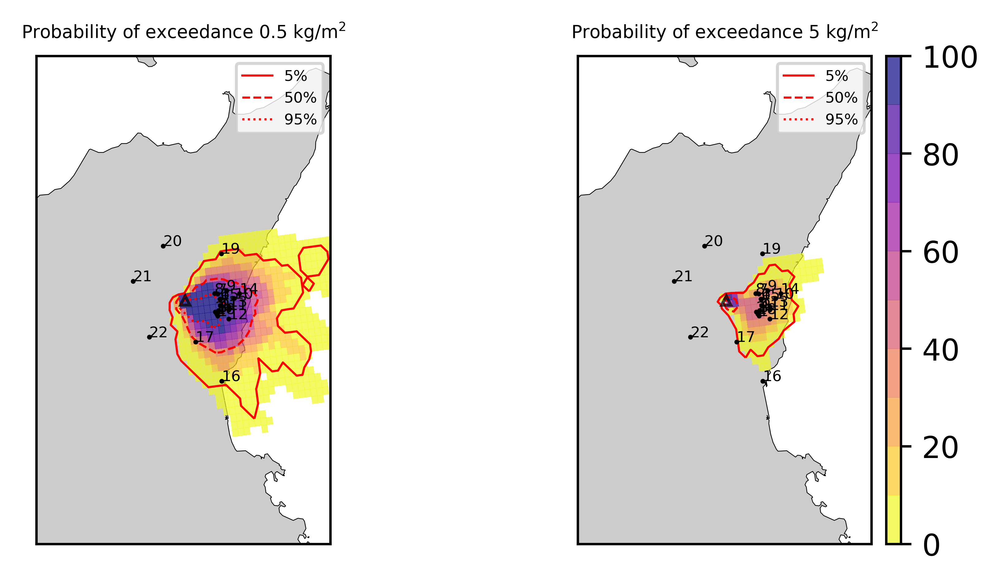  
  
  
  
  
  
  
  
  
  
  
  
  
  
  
  
  
  
  
  
  
  

|Location|Ground load [kg/m²] 5th perc|Ground load [kg/m²] 50th perc|Ground load [kg/m²] 95th perc|
| :--- | :--- | :--- | :--- |
|Sarro (1)|8.70e-01|3.95e+00|1.31e+01|
|Airone (2)|9.22e-01|4.98e+00|1.31e+01|
|Zafferana Ingresso (3)|7.92e-01|5.06e+00|1.36e+01|
|Zafferana Rotonda (4)|9.42e-01|4.72e+00|1.29e+01|
|Petrulli (5)|9.23e-01|3.78e+00|1.06e+01|
|Milo (6)|7.96e-01|3.67e+00|9.40e+00|
|Fornazzo (7)|3.61e-01|3.60e+00|6.33e+00|
|Rinuccio (8)|3.86e-01|3.30e+00|5.90e+00|
|S. Alfio (9)|8.90e-02|2.32e+00|9.23e+00|
|Macchia (10)|2.16e-01|1.89e+00|8.58e+00|
|S. Venerina (11)|4.45e-01|2.86e+00|1.52e+01|
|Linera (12)|2.24e-01|2.83e+00|1.26e+01|
|Dagala chiesa S. Maria (13)|4.10e-01|2.70e+00|1.30e+01|
|Giarre Piazza Maccheroni (14)|7.31e-02|1.05e+00|6.90e+00|
|Milo parco (15)|7.72e-01|3.71e+00|9.55e+00|
|Catania AP (16)|0.00e+00|1.53e-02|4.80e-01|
|Nicolosi (17)|9.42e-03|4.02e-01|3.82e+00|
|Zafferana (18)|8.20e-01|4.71e+00|1.40e+01|
|Linguaglossa (19)|0.00e+00|4.24e-03|3.44e-01|
|Randazzo (20)|0.00e+00|0.00e+00|4.00e-05|
|Bronte (21)|0.00e+00|0.00e+00|0.00e+00|
|Biancavilla (22)|0.00e+00|2.38e-04|3.97e-02|
  

### Atmosphere 2021-02-28 11:50 Z
  
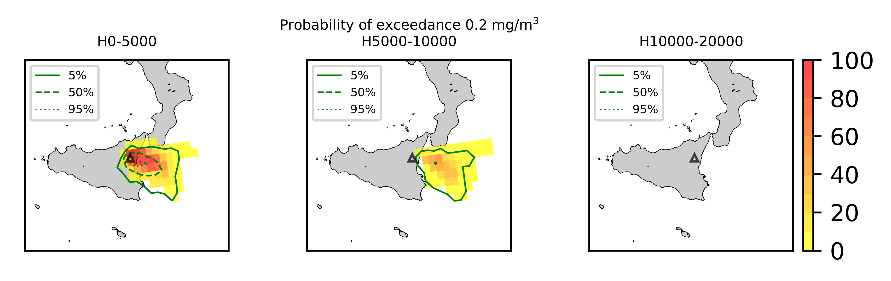
## Forecast at 2021-02-28 12:50 Z from RED VONA issued at 20210228_1047Z
  

|Eruption start [Z]|Eruption end [Z]|Forecast time [Z]|Column height asl [m]|
| :--- | :--- | :--- | :--- |
|2021-02-28 08:10:00|Ongoing|2021-02-28 12:50:00|4500 ± 500 - from VONA|
  
  

|Percentile|MER [kg/s¹]|Mass air [kg]|Mass air nested dom. [kg]|Mass grd [kg]|Mass grd nested dom. [kg]|
| :--- | :--- | :--- | :--- | :--- | :--- |
|5th|1.01e+02|3.19e+07|2.95e+07|8.23e+08|8.22e+08|
|50th|1.95e+03|1.04e+08|7.61e+07|1.62e+09|1.59e+09|
|95th|1.32e+04|5.31e+08|2.76e+08|4.27e+09|4.08e+09|
  

### Ground Nested Domain 2021-02-28 12:50 Z
  
  
  
  
  
  
  
  
  
  
  
  
  
  
  
  
  
  
  
  
  
  
  

|Location|Ground load [kg/m²] 5th perc|Ground load [kg/m²] 50th perc|Ground load [kg/m²] 95th perc|
| :--- | :--- | :--- | :--- |
|Sarro (1)|8.70e-01|3.98e+00|1.31e+01|
|Airone (2)|9.33e-01|4.99e+00|1.31e+01|
|Zafferana Ingresso (3)|8.01e-01|5.09e+00|1.36e+01|
|Zafferana Rotonda (4)|9.52e-01|4.73e+00|1.29e+01|
|Petrulli (5)|9.23e-01|3.82e+00|1.07e+01|
|Milo (6)|8.10e-01|3.69e+00|9.41e+00|
|Fornazzo (7)|3.93e-01|3.60e+00|6.34e+00|
|Rinuccio (8)|4.35e-01|3.30e+00|5.91e+00|
|S. Alfio (9)|8.90e-02|2.33e+00|9.28e+00|
|Macchia (10)|2.16e-01|1.99e+00|8.65e+00|
|S. Venerina (11)|4.47e-01|2.87e+00|1.52e+01|
|Linera (12)|2.28e-01|2.83e+00|1.26e+01|
|Dagala chiesa S. Maria (13)|4.10e-01|2.76e+00|1.30e+01|
|Giarre Piazza Maccheroni (14)|7.31e-02|1.17e+00|6.90e+00|
|Milo parco (15)|7.83e-01|3.73e+00|9.55e+00|
|Catania AP (16)|3.63e-06|2.45e-02|5.09e-01|
|Nicolosi (17)|2.07e-02|4.14e-01|3.83e+00|
|Zafferana (18)|8.20e-01|4.73e+00|1.41e+01|
|Linguaglossa (19)|0.00e+00|4.24e-03|3.46e-01|
|Randazzo (20)|0.00e+00|0.00e+00|2.20e-04|
|Bronte (21)|0.00e+00|0.00e+00|0.00e+00|
|Biancavilla (22)|0.00e+00|1.75e-03|4.93e-02|
  

### Atmosphere 2021-02-28 12:50 Z
  
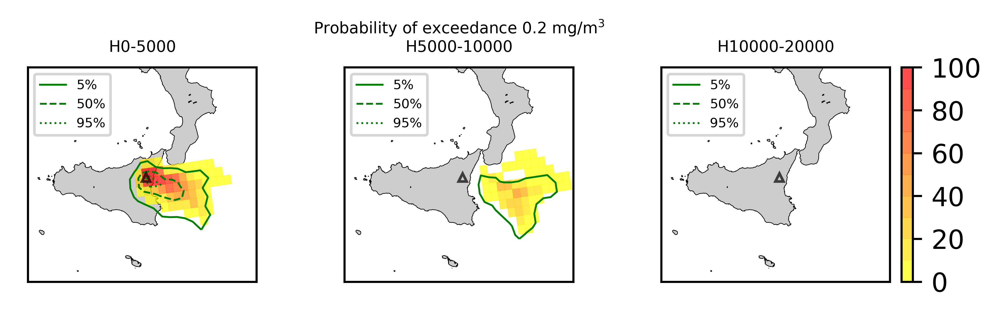
## Forecast at 2021-02-28 13:50 Z from RED VONA issued at 20210228_1047Z
  

|Eruption start [Z]|Eruption end [Z]|Forecast time [Z]|Column height asl [m]|
| :--- | :--- | :--- | :--- |
|2021-02-28 08:10:00|Ongoing|2021-02-28 13:50:00|4500 ± 500 - from VONA|
  
  

|Percentile|MER [kg/s¹]|Mass air [kg]|Mass air nested dom. [kg]|Mass grd [kg]|Mass grd nested dom. [kg]|
| :--- | :--- | :--- | :--- | :--- | :--- |
|5th|7.43e+01|2.22e+07|2.08e+07|8.62e+08|8.59e+08|
|50th|3.22e+03|8.33e+07|5.38e+07|1.68e+09|1.64e+09|
|95th|1.17e+04|4.49e+08|2.32e+08|4.42e+09|4.11e+09|
  

### Ground Nested Domain 2021-02-28 13:50 Z
  
  
  
  
  
  
  
  
  
  
  
  
  
  
  
  
  
  
  
  
  
  
  

|Location|Ground load [kg/m²] 5th perc|Ground load [kg/m²] 50th perc|Ground load [kg/m²] 95th perc|
| :--- | :--- | :--- | :--- |
|Sarro (1)|8.70e-01|3.99e+00|1.31e+01|
|Airone (2)|9.39e-01|4.99e+00|1.31e+01|
|Zafferana Ingresso (3)|8.05e-01|5.10e+00|1.36e+01|
|Zafferana Rotonda (4)|9.55e-01|4.73e+00|1.29e+01|
|Petrulli (5)|9.23e-01|3.82e+00|1.07e+01|
|Milo (6)|8.27e-01|3.69e+00|9.41e+00|
|Fornazzo (7)|4.74e-01|3.60e+00|6.34e+00|
|Rinuccio (8)|5.79e-01|3.30e+00|5.91e+00|
|S. Alfio (9)|1.02e-01|2.33e+00|9.29e+00|
|Macchia (10)|2.19e-01|2.00e+00|8.65e+00|
|S. Venerina (11)|4.47e-01|2.89e+00|1.52e+01|
|Linera (12)|2.29e-01|2.84e+00|1.26e+01|
|Dagala chiesa S. Maria (13)|4.10e-01|2.76e+00|1.30e+01|
|Giarre Piazza Maccheroni (14)|7.33e-02|1.18e+00|6.90e+00|
|Milo parco (15)|7.85e-01|3.73e+00|9.55e+00|
|Catania AP (16)|2.05e-03|2.73e-02|5.17e-01|
|Nicolosi (17)|2.55e-02|4.15e-01|3.89e+00|
|Zafferana (18)|8.20e-01|4.74e+00|1.41e+01|
|Linguaglossa (19)|0.00e+00|4.24e-03|3.46e-01|
|Randazzo (20)|0.00e+00|0.00e+00|2.04e-03|
|Bronte (21)|0.00e+00|0.00e+00|3.83e-05|
|Biancavilla (22)|0.00e+00|7.09e-03|8.86e-02|
  

### Atmosphere 2021-02-28 13:50 Z
  
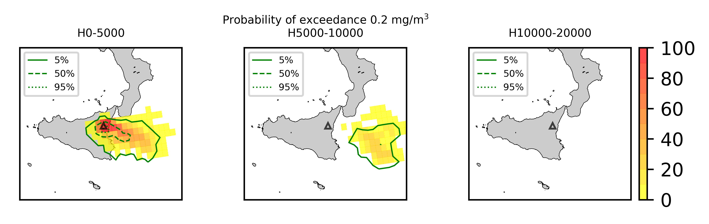
## Forecast at 2021-02-28 16:50 Z from RED VONA issued at 20210228_1047Z
  

|Eruption start [Z]|Eruption end [Z]|Forecast time [Z]|Column height asl [m]|
| :--- | :--- | :--- | :--- |
|2021-02-28 08:10:00|Ongoing|2021-02-28 16:50:00|4500 ± 500 - from VONA|
  
  

|Percentile|MER [kg/s¹]|Mass air [kg]|Mass air nested dom. [kg]|Mass grd [kg]|Mass grd nested dom. [kg]|
| :--- | :--- | :--- | :--- | :--- | :--- |
|5th|1.50e+02|1.46e+07|1.17e+07|9.11e+08|9.03e+08|
|50th|3.42e+03|5.93e+07|4.32e+07|1.71e+09|1.66e+09|
|95th|1.25e+04|3.42e+08|1.92e+08|4.45e+09|4.24e+09|
  

### Ground Nested Domain 2021-02-28 16:50 Z
  
  
  
  
  
  
  
  
  
  
  
  
  
  
  
  
  
  
  
  
  
  
  

|Location|Ground load [kg/m²] 5th perc|Ground load [kg/m²] 50th perc|Ground load [kg/m²] 95th perc|
| :--- | :--- | :--- | :--- |
|Sarro (1)|8.70e-01|3.99e+00|1.31e+01|
|Airone (2)|9.39e-01|5.00e+00|1.31e+01|
|Zafferana Ingresso (3)|8.05e-01|5.10e+00|1.36e+01|
|Zafferana Rotonda (4)|9.55e-01|4.73e+00|1.29e+01|
|Petrulli (5)|9.23e-01|3.83e+00|1.07e+01|
|Milo (6)|8.27e-01|3.69e+00|9.41e+00|
|Fornazzo (7)|4.85e-01|3.61e+00|6.34e+00|
|Rinuccio (8)|5.94e-01|3.30e+00|5.91e+00|
|S. Alfio (9)|1.02e-01|2.33e+00|9.29e+00|
|Macchia (10)|2.19e-01|2.00e+00|8.65e+00|
|S. Venerina (11)|4.47e-01|2.90e+00|1.52e+01|
|Linera (12)|2.30e-01|2.84e+00|1.26e+01|
|Dagala chiesa S. Maria (13)|4.10e-01|2.76e+00|1.30e+01|
|Giarre Piazza Maccheroni (14)|7.33e-02|1.18e+00|6.90e+00|
|Milo parco (15)|7.86e-01|3.73e+00|9.55e+00|
|Catania AP (16)|5.03e-03|2.79e-02|5.18e-01|
|Nicolosi (17)|5.35e-02|4.37e-01|3.90e+00|
|Zafferana (18)|8.20e-01|4.74e+00|1.41e+01|
|Linguaglossa (19)|0.00e+00|4.24e-03|3.50e-01|
|Randazzo (20)|0.00e+00|8.00e-05|1.37e-02|
|Bronte (21)|0.00e+00|2.10e-04|1.18e-02|
|Biancavilla (22)|1.97e-03|2.96e-02|1.07e-01|
  

### Atmosphere 2021-02-28 16:50 Z
  
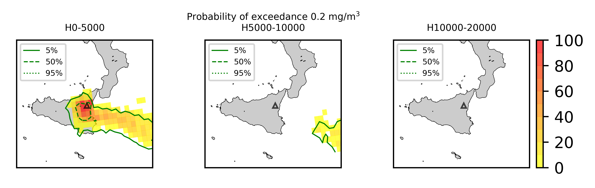
## Forecast at 2021-02-28 19:50 Z from RED VONA issued at 20210228_1047Z
  

|Eruption start [Z]|Eruption end [Z]|Forecast time [Z]|Column height asl [m]|
| :--- | :--- | :--- | :--- |
|2021-02-28 08:10:00|Ongoing|2021-02-28 19:50:00|4500 ± 500 - from VONA|
  
  

|Percentile|MER [kg/s¹]|Mass air [kg]|Mass air nested dom. [kg]|Mass grd [kg]|Mass grd nested dom. [kg]|
| :--- | :--- | :--- | :--- | :--- | :--- |
|5th|2.00e+02|1.30e+07|6.34e+06|9.24e+08|9.13e+08|
|50th|1.79e+03|6.83e+07|2.68e+07|2.00e+09|1.99e+09|
|95th|1.03e+04|1.80e+08|1.13e+08|4.47e+09|4.27e+09|
  

### Ground Nested Domain 2021-02-28 19:50 Z
  
  
  
  
  
  
  
  
  
  
  
  
  
  
  
  
  
  
  
  
  
  
  

|Location|Ground load [kg/m²] 5th perc|Ground load [kg/m²] 50th perc|Ground load [kg/m²] 95th perc|
| :--- | :--- | :--- | :--- |
|Sarro (1)|8.70e-01|4.58e+00|1.31e+01|
|Airone (2)|9.39e-01|5.00e+00|1.31e+01|
|Zafferana Ingresso (3)|8.05e-01|5.16e+00|1.36e+01|
|Zafferana Rotonda (4)|9.55e-01|4.73e+00|1.29e+01|
|Petrulli (5)|9.23e-01|3.83e+00|1.07e+01|
|Milo (6)|8.27e-01|3.69e+00|9.41e+00|
|Fornazzo (7)|4.85e-01|3.61e+00|6.34e+00|
|Rinuccio (8)|5.94e-01|3.30e+00|5.91e+00|
|S. Alfio (9)|1.02e-01|2.33e+00|9.29e+00|
|Macchia (10)|2.19e-01|2.00e+00|8.65e+00|
|S. Venerina (11)|4.47e-01|2.90e+00|1.52e+01|
|Linera (12)|2.30e-01|2.84e+00|1.26e+01|
|Dagala chiesa S. Maria (13)|4.10e-01|2.76e+00|1.30e+01|
|Giarre Piazza Maccheroni (14)|7.33e-02|1.18e+00|6.90e+00|
|Milo parco (15)|7.86e-01|3.73e+00|9.55e+00|
|Catania AP (16)|5.03e-03|4.23e-02|9.19e-01|
|Nicolosi (17)|5.51e-02|6.17e-01|3.92e+00|
|Zafferana (18)|8.20e-01|5.13e+00|1.41e+01|
|Linguaglossa (19)|0.00e+00|4.33e-03|3.50e-01|
|Randazzo (20)|0.00e+00|1.25e-04|1.39e-02|
|Bronte (21)|0.00e+00|4.00e-03|4.18e-02|
|Biancavilla (22)|4.53e-03|4.38e-02|1.40e-01|
  

### Atmosphere 2021-02-28 19:50 Z
  
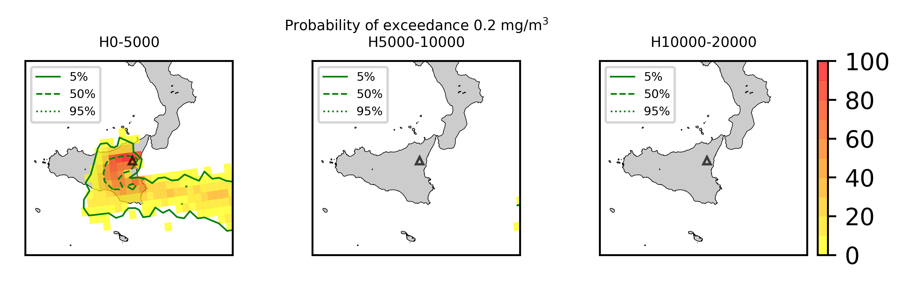
## Forecast at 2021-02-28 22:50 Z from RED VONA issued at 20210228_1047Z
  

|Eruption start [Z]|Eruption end [Z]|Forecast time [Z]|Column height asl [m]|
| :--- | :--- | :--- | :--- |
|2021-02-28 08:10:00|Ongoing|2021-02-28 22:50:00|4500 ± 500 - from VONA|
  
  

|Percentile|MER [kg/s¹]|Mass air [kg]|Mass air nested dom. [kg]|Mass grd [kg]|Mass grd nested dom. [kg]|
| :--- | :--- | :--- | :--- | :--- | :--- |
|5th|1.87e+02|1.35e+07|2.87e+06|9.73e+08|9.28e+08|
|50th|1.36e+03|3.42e+07|1.15e+07|2.06e+09|2.04e+09|
|95th|9.56e+03|1.43e+08|3.58e+07|4.55e+09|4.34e+09|
  

### Ground Nested Domain 2021-02-28 22:50 Z
  
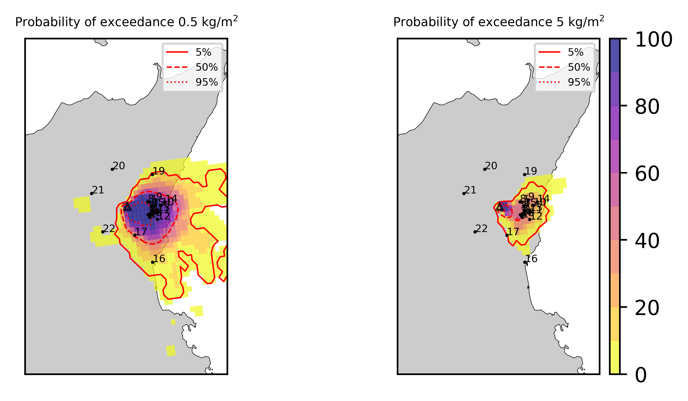  
  
  
  
  
  
  
  
  
  
  
  
  
  
  
  
  
  
  
  
  
  

|Location|Ground load [kg/m²] 5th perc|Ground load [kg/m²] 50th perc|Ground load [kg/m²] 95th perc|
| :--- | :--- | :--- | :--- |
|Sarro (1)|8.70e-01|4.58e+00|1.31e+01|
|Airone (2)|9.39e-01|5.00e+00|1.31e+01|
|Zafferana Ingresso (3)|8.05e-01|5.16e+00|1.36e+01|
|Zafferana Rotonda (4)|9.55e-01|4.73e+00|1.29e+01|
|Petrulli (5)|9.23e-01|3.83e+00|1.07e+01|
|Milo (6)|8.36e-01|3.69e+00|9.41e+00|
|Fornazzo (7)|4.85e-01|3.61e+00|6.34e+00|
|Rinuccio (8)|5.94e-01|3.30e+00|5.91e+00|
|S. Alfio (9)|1.02e-01|2.33e+00|9.29e+00|
|Macchia (10)|2.19e-01|2.00e+00|8.65e+00|
|S. Venerina (11)|4.47e-01|2.90e+00|1.52e+01|
|Linera (12)|2.30e-01|2.84e+00|1.26e+01|
|Dagala chiesa S. Maria (13)|4.10e-01|2.76e+00|1.30e+01|
|Giarre Piazza Maccheroni (14)|7.33e-02|1.18e+00|6.90e+00|
|Milo parco (15)|7.92e-01|3.73e+00|9.55e+00|
|Catania AP (16)|5.03e-03|4.23e-02|9.19e-01|
|Nicolosi (17)|5.51e-02|6.17e-01|3.93e+00|
|Zafferana (18)|8.20e-01|5.13e+00|1.41e+01|
|Linguaglossa (19)|0.00e+00|4.33e-03|3.50e-01|
|Randazzo (20)|0.00e+00|1.25e-04|1.39e-02|
|Bronte (21)|0.00e+00|5.13e-03|4.37e-02|
|Biancavilla (22)|6.55e-03|4.67e-02|1.56e-01|
  

### Atmosphere 2021-02-28 22:50 Z
  
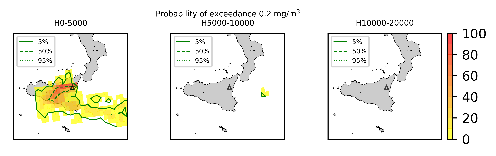
## Forecast at 2021-02-28 16:50 Z from ORANGE VONA issued at 20210228_1426Z
  

|Eruption start [Z]|Eruption end [Z]|Forecast time [Z]|Column height asl [m]|
| :--- | :--- | :--- | :--- |
|2021-02-28 08:10:00|2021-02-28 14:30:00|2021-02-28 16:50:00|4500 ± 500 - from VONA|
  
  

|Percentile|MER [kg/s¹]|Mass air [kg]|Mass air nested dom. [kg]|Mass grd [kg]|Mass grd nested dom. [kg]|
| :--- | :--- | :--- | :--- | :--- | :--- |
|5th|1.53e+02|1.31e+07|8.26e+06|8.79e+08|8.73e+08|
|50th|3.36e+03|4.74e+07|3.42e+07|1.71e+09|1.67e+09|
|95th|1.52e+04|2.52e+08|1.65e+08|4.45e+09|4.19e+09|
  

### Ground Nested Domain 2021-02-28 16:50 Z
  
  
  
  
  
  
  
  
  
  
  
  
  
  
  
  
  
  
  
  
  
  
  

|Location|Ground load [kg/m²] 5th perc|Ground load [kg/m²] 50th perc|Ground load [kg/m²] 95th perc|
| :--- | :--- | :--- | :--- |
|Sarro (1)|8.70e-01|3.99e+00|1.31e+01|
|Airone (2)|9.54e-01|5.00e+00|1.31e+01|
|Zafferana Ingresso (3)|8.11e-01|5.10e+00|1.36e+01|
|Zafferana Rotonda (4)|9.61e-01|4.73e+00|1.29e+01|
|Petrulli (5)|9.23e-01|3.82e+00|1.07e+01|
|Milo (6)|8.28e-01|3.69e+00|9.41e+00|
|Fornazzo (7)|4.82e-01|3.60e+00|6.34e+00|
|Rinuccio (8)|5.89e-01|3.30e+00|5.91e+00|
|S. Alfio (9)|1.02e-01|2.33e+00|9.29e+00|
|Macchia (10)|2.19e-01|2.00e+00|8.65e+00|
|S. Venerina (11)|4.47e-01|2.89e+00|1.52e+01|
|Linera (12)|2.29e-01|2.84e+00|1.26e+01|
|Dagala chiesa S. Maria (13)|4.10e-01|2.76e+00|1.30e+01|
|Giarre Piazza Maccheroni (14)|7.33e-02|1.18e+00|6.90e+00|
|Milo parco (15)|7.86e-01|3.73e+00|9.55e+00|
|Catania AP (16)|2.33e-03|2.78e-02|5.18e-01|
|Nicolosi (17)|3.87e-02|4.18e-01|3.91e+00|
|Zafferana (18)|8.20e-01|4.74e+00|1.41e+01|
|Linguaglossa (19)|0.00e+00|4.24e-03|3.53e-01|
|Randazzo (20)|0.00e+00|2.83e-05|5.16e-03|
|Bronte (21)|0.00e+00|2.23e-04|2.32e-02|
|Biancavilla (22)|3.99e-03|3.02e-02|1.01e-01|
  

### Atmosphere 2021-02-28 16:50 Z
  
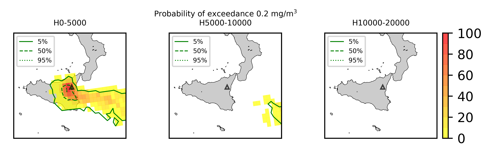
## Forecast at 2021-02-28 19:50 Z from ORANGE VONA issued at 20210228_1426Z
  

|Eruption start [Z]|Eruption end [Z]|Forecast time [Z]|Column height asl [m]|
| :--- | :--- | :--- | :--- |
|2021-02-28 08:10:00|2021-02-28 14:30:00|2021-02-28 19:50:00|None|
  
  

|Percentile|MER [kg/s¹]|Mass air [kg]|Mass air nested dom. [kg]|Mass grd [kg]|Mass grd nested dom. [kg]|
| :--- | :--- | :--- | :--- | :--- | :--- |
|5th|0.00e+00|1.05e+07|1.82e+06|8.84e+08|8.78e+08|
|50th|0.00e+00|3.91e+07|1.76e+07|1.72e+09|1.67e+09|
|95th|0.00e+00|1.77e+08|1.06e+08|4.46e+09|4.22e+09|
  

### Ground Nested Domain 2021-02-28 19:50 Z
  
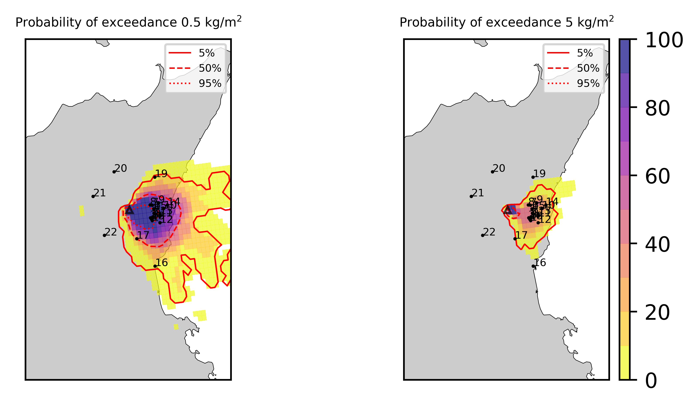  
  
  
  
  
  
  
  
  
  
  
  
  
  
  
  
  
  
  
  
  
  

|Location|Ground load [kg/m²] 5th perc|Ground load [kg/m²] 50th perc|Ground load [kg/m²] 95th perc|
| :--- | :--- | :--- | :--- |
|Sarro (1)|8.70e-01|3.99e+00|1.31e+01|
|Airone (2)|9.54e-01|5.00e+00|1.31e+01|
|Zafferana Ingresso (3)|8.11e-01|5.10e+00|1.36e+01|
|Zafferana Rotonda (4)|9.61e-01|4.73e+00|1.29e+01|
|Petrulli (5)|9.23e-01|3.82e+00|1.07e+01|
|Milo (6)|8.28e-01|3.69e+00|9.41e+00|
|Fornazzo (7)|4.82e-01|3.60e+00|6.34e+00|
|Rinuccio (8)|5.89e-01|3.30e+00|5.91e+00|
|S. Alfio (9)|1.02e-01|2.33e+00|9.29e+00|
|Macchia (10)|2.19e-01|2.00e+00|8.65e+00|
|S. Venerina (11)|4.47e-01|2.89e+00|1.52e+01|
|Linera (12)|2.29e-01|2.84e+00|1.26e+01|
|Dagala chiesa S. Maria (13)|4.10e-01|2.76e+00|1.30e+01|
|Giarre Piazza Maccheroni (14)|7.33e-02|1.18e+00|6.90e+00|
|Milo parco (15)|7.86e-01|3.73e+00|9.55e+00|
|Catania AP (16)|2.33e-03|2.78e-02|5.18e-01|
|Nicolosi (17)|3.87e-02|4.18e-01|3.91e+00|
|Zafferana (18)|8.20e-01|4.74e+00|1.41e+01|
|Linguaglossa (19)|0.00e+00|4.24e-03|3.53e-01|
|Randazzo (20)|0.00e+00|7.17e-05|5.33e-03|
|Bronte (21)|0.00e+00|3.52e-03|8.52e-02|
|Biancavilla (22)|4.45e-03|3.94e-02|1.06e-01|
  

### Atmosphere 2021-02-28 19:50 Z
  
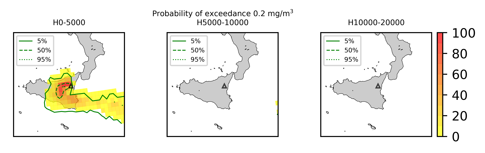
## Forecast at 2021-02-28 22:50 Z from ORANGE VONA issued at 20210228_1426Z
  

|Eruption start [Z]|Eruption end [Z]|Forecast time [Z]|Column height asl [m]|
| :--- | :--- | :--- | :--- |
|2021-02-28 08:10:00|2021-02-28 14:30:00|2021-02-28 22:50:00|None|
  
  

|Percentile|MER [kg/s¹]|Mass air [kg]|Mass air nested dom. [kg]|Mass grd [kg]|Mass grd nested dom. [kg]|
| :--- | :--- | :--- | :--- | :--- | :--- |
|5th|0.00e+00|8.45e+06|3.48e+05|8.89e+08|8.82e+08|
|50th|0.00e+00|3.06e+07|3.72e+06|1.73e+09|1.68e+09|
|95th|0.00e+00|1.34e+08|3.19e+07|4.47e+09|4.24e+09|
  

### Ground Nested Domain 2021-02-28 22:50 Z
  
  
  
  
  
  
  
  
  
  
  
  
  
  
  
  
  
  
  
  
  
  
  

|Location|Ground load [kg/m²] 5th perc|Ground load [kg/m²] 50th perc|Ground load [kg/m²] 95th perc|
| :--- | :--- | :--- | :--- |
|Sarro (1)|8.70e-01|3.99e+00|1.31e+01|
|Airone (2)|9.54e-01|5.00e+00|1.31e+01|
|Zafferana Ingresso (3)|8.11e-01|5.10e+00|1.36e+01|
|Zafferana Rotonda (4)|9.61e-01|4.73e+00|1.29e+01|
|Petrulli (5)|9.23e-01|3.82e+00|1.07e+01|
|Milo (6)|8.28e-01|3.70e+00|9.41e+00|
|Fornazzo (7)|4.82e-01|3.60e+00|6.34e+00|
|Rinuccio (8)|5.89e-01|3.30e+00|5.91e+00|
|S. Alfio (9)|1.02e-01|2.33e+00|9.29e+00|
|Macchia (10)|2.19e-01|2.00e+00|8.65e+00|
|S. Venerina (11)|4.47e-01|2.89e+00|1.52e+01|
|Linera (12)|2.29e-01|2.84e+00|1.26e+01|
|Dagala chiesa S. Maria (13)|4.10e-01|2.76e+00|1.30e+01|
|Giarre Piazza Maccheroni (14)|7.33e-02|1.18e+00|6.90e+00|
|Milo parco (15)|7.86e-01|3.73e+00|9.55e+00|
|Catania AP (16)|2.33e-03|2.78e-02|5.18e-01|
|Nicolosi (17)|3.87e-02|4.18e-01|3.91e+00|
|Zafferana (18)|8.20e-01|4.74e+00|1.41e+01|
|Linguaglossa (19)|0.00e+00|4.24e-03|3.53e-01|
|Randazzo (20)|0.00e+00|7.17e-05|5.52e-03|
|Bronte (21)|5.00e-06|5.25e-03|9.00e-02|
|Biancavilla (22)|4.70e-03|3.94e-02|1.06e-01|
  

### Atmosphere 2021-02-28 22:50 Z
  
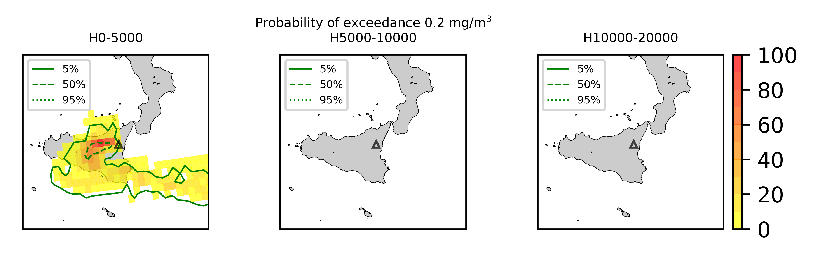  
Go to [Supplementary page](Supplementary_page.md)  
Go to [Main directory](https://github.com/federicapardini/Real_time_ash_forecast)