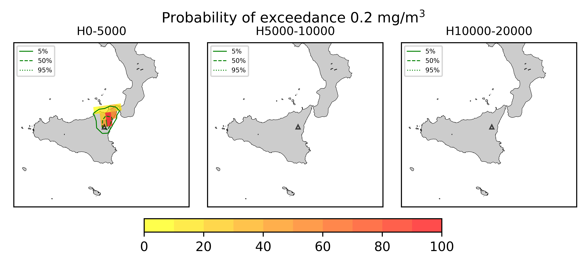
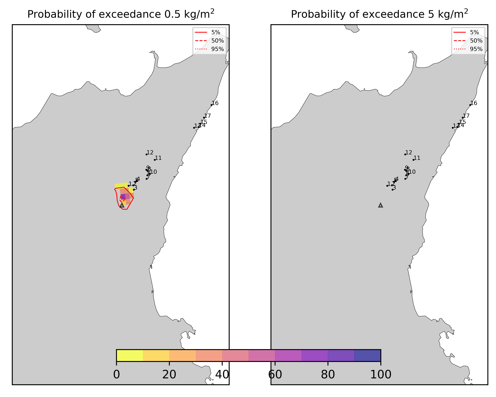
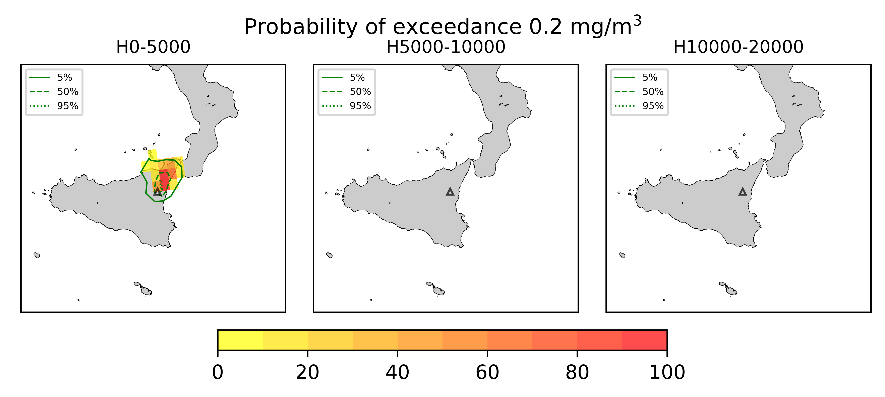
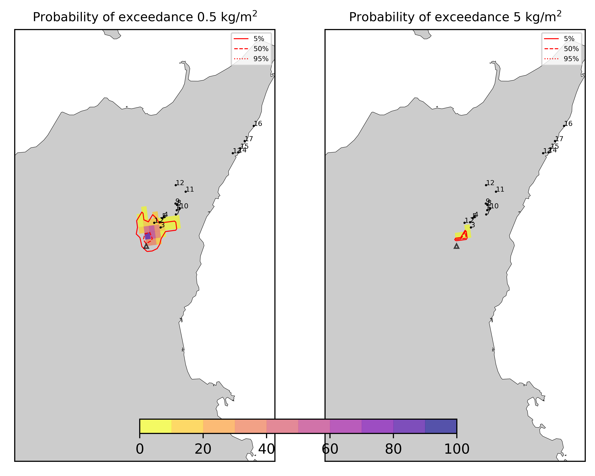
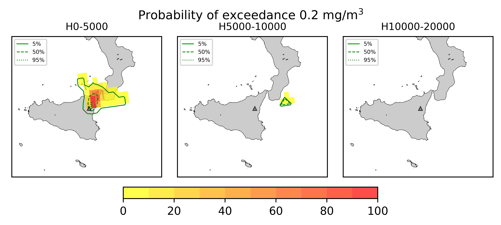

Forecast from VONA_20210304_0228Z
=================================

Contents
========

* [Forecast products](#forecast-products)
	* [Forecast at 2021-03-04 03:30 Z - Ongoing Eruption](#forecast-at-2021-03-04-0330-z---ongoing-eruption)
	* [Forecast at 2021-03-04 04:30 Z - Ongoing Eruption](#forecast-at-2021-03-04-0430-z---ongoing-eruption)
	* [Forecast at 2021-03-04 05:30 Z - Ongoing Eruption](#forecast-at-2021-03-04-0530-z---ongoing-eruption)
	* [Forecast at 2021-03-04 08:30 Z - Ongoing Eruption](#forecast-at-2021-03-04-0830-z---ongoing-eruption)
	* [Forecast at 2021-03-04 11:30 Z - Ongoing Eruption](#forecast-at-2021-03-04-1130-z---ongoing-eruption)
	* [Forecast at 2021-03-04 14:30 Z - Ongoing Eruption](#forecast-at-2021-03-04-1430-z---ongoing-eruption)
	* [Forecast at 2021-03-04 10:50 Z - Ongoing Eruption](#forecast-at-2021-03-04-1050-z---ongoing-eruption)
	* [Forecast at 2021-03-04 11:00 Z - Ongoing Eruption](#forecast-at-2021-03-04-1100-z---ongoing-eruption)
	* [Forecast at 2021-03-04 14:00 Z - Ongoing Eruption](#forecast-at-2021-03-04-1400-z---ongoing-eruption)

# Forecast products

## Forecast at 2021-03-04 03:30 Z - Ongoing Eruption
  

|Eruption start [Z]|Eruption end [Z]|Forecast time [Z]|Column height asl [m]|
| :--- | :--- | :--- | :--- |
|2021-03-04 02:30:00|Ongoing|2021-03-04 03:30:00|5000 ± 500 - from VONA|
  
  

|Percentile|MER [kg/s¹]|Mass air [kg]|Mass air nested dom. [kg]|Mass grd [kg]|Mass grd nested dom. [kg]|
| :--- | :--- | :--- | :--- | :--- | :--- |
|5th|4.32e+02|1.89e+06|1.89e+06|8.80e+03|1.39e+04|
|50th|2.79e+03|8.63e+06|8.63e+06|7.18e+05|7.20e+05|
|95th|6.88e+03|1.88e+07|1.88e+07|5.25e+06|1.88e+07|
  

### Ground Nested Domain 2021-03-04 03:30 Z
  
  
  
  
  
  
  
  
  
  
  
  
  
  
  
  
  
  

|Location|Ground load [kg/m²] 5th perc|Ground load [kg/m²] 50th perc|Ground load [kg/m²] 95th perc|
| :--- | :--- | :--- | :--- |
|Piano Provenzana (1)|0.00e+00|2.85e-04|1.29e-02|
|Bivio Provenzana-Linguaglossa (2)|0.00e+00|2.44e-05|2.28e-03|
|Cunetta pre-Citelli (3)|0.00e+00|1.91e-05|4.32e-03|
|Chalet (4)|0.00e+00|0.00e+00|7.78e-04|
|Ragabo (5)|0.00e+00|0.00e+00|1.00e-03|
|Scilio (6)|0.00e+00|0.00e+00|7.21e-06|
|Gambino vini (7)|0.00e+00|0.00e+00|1.94e-05|
|StazioneFce Linguaglossa (8)|0.00e+00|0.00e+00|3.92e-07|
|Linguaglossa Via Olivio Sozzi (9)|0.00e+00|0.00e+00|1.04e-06|
|Cim.Linguaglossa (10)|0.00e+00|0.00e+00|0.00e+00|
|Gole Bar (11)|0.00e+00|0.00e+00|0.00e+00|
|Francavilla - Orange (12)|0.00e+00|0.00e+00|0.00e+00|
|Roccalumera1 (13)|0.00e+00|0.00e+00|0.00e+00|
|Roccalumera2 (14)|0.00e+00|0.00e+00|0.00e+00|
|Nizza (15)|0.00e+00|0.00e+00|0.00e+00|
|Scaletta Zanclea (16)|0.00e+00|0.00e+00|0.00e+00|
|Alì (17)|0.00e+00|0.00e+00|0.00e+00|
  

### Atmosphere 2021-03-04 03:30 Z
  

## Forecast at 2021-03-04 04:30 Z - Ongoing Eruption
  

|Eruption start [Z]|Eruption end [Z]|Forecast time [Z]|Column height asl [m]|
| :--- | :--- | :--- | :--- |
|2021-03-04 02:30:00|Ongoing|2021-03-04 04:30:00|5000 ± 500 - from VONA|
  
  

|Percentile|MER [kg/s¹]|Mass air [kg]|Mass air nested dom. [kg]|Mass grd [kg]|Mass grd nested dom. [kg]|
| :--- | :--- | :--- | :--- | :--- | :--- |
|5th|4.57e+02|1.80e+06|1.80e+06|2.75e+05|2.80e+05|
|50th|3.18e+03|9.73e+06|9.72e+06|9.29e+05|9.26e+05|
|95th|1.23e+04|3.65e+07|3.64e+07|5.84e+06|3.64e+07|
  

### Ground Nested Domain 2021-03-04 04:30 Z
  
  
  
  
  
  
  
  
  
  
  
  
  
  
  
  
  
  

|Location|Ground load [kg/m²] 5th perc|Ground load [kg/m²] 50th perc|Ground load [kg/m²] 95th perc|
| :--- | :--- | :--- | :--- |
|Piano Provenzana (1)|4.27e-06|4.32e-04|2.41e-02|
|Bivio Provenzana-Linguaglossa (2)|0.00e+00|2.89e-05|2.20e-02|
|Cunetta pre-Citelli (3)|0.00e+00|1.52e-04|2.60e-02|
|Chalet (4)|0.00e+00|0.00e+00|6.67e-03|
|Ragabo (5)|0.00e+00|5.37e-06|1.24e-02|
|Scilio (6)|0.00e+00|0.00e+00|5.69e-04|
|Gambino vini (7)|0.00e+00|0.00e+00|1.13e-03|
|StazioneFce Linguaglossa (8)|0.00e+00|0.00e+00|1.27e-04|
|Linguaglossa Via Olivio Sozzi (9)|0.00e+00|0.00e+00|6.27e-05|
|Cim.Linguaglossa (10)|0.00e+00|0.00e+00|2.78e-04|
|Gole Bar (11)|0.00e+00|0.00e+00|0.00e+00|
|Francavilla - Orange (12)|0.00e+00|0.00e+00|0.00e+00|
|Roccalumera1 (13)|0.00e+00|0.00e+00|0.00e+00|
|Roccalumera2 (14)|0.00e+00|0.00e+00|0.00e+00|
|Nizza (15)|0.00e+00|0.00e+00|0.00e+00|
|Scaletta Zanclea (16)|0.00e+00|0.00e+00|0.00e+00|
|Alì (17)|0.00e+00|0.00e+00|0.00e+00|
  

### Atmosphere 2021-03-04 04:30 Z
  

## Forecast at 2021-03-04 05:30 Z - Ongoing Eruption
  

|Eruption start [Z]|Eruption end [Z]|Forecast time [Z]|Column height asl [m]|
| :--- | :--- | :--- | :--- |
|2021-03-04 02:30:00|Ongoing|2021-03-04 05:30:00|5000 ± 500 - from VONA|
  
  

|Percentile|MER [kg/s¹]|Mass air [kg]|Mass air nested dom. [kg]|Mass grd [kg]|Mass grd nested dom. [kg]|
| :--- | :--- | :--- | :--- | :--- | :--- |
|5th|6.82e+02|2.04e+06|2.04e+06|4.25e+05|4.26e+05|
|50th|3.99e+03|1.25e+07|1.25e+07|2.35e+06|2.35e+06|
|95th|1.00e+04|3.02e+07|3.01e+07|5.77e+06|3.01e+07|
  

### Ground Nested Domain 2021-03-04 05:30 Z
  
  
  
  
  
  
  
  
  
  
  
  
  
  
  
  
  
  

|Location|Ground load [kg/m²] 5th perc|Ground load [kg/m²] 50th perc|Ground load [kg/m²] 95th perc|
| :--- | :--- | :--- | :--- |
|Piano Provenzana (1)|1.28e-05|7.97e-04|1.61e-02|
|Bivio Provenzana-Linguaglossa (2)|0.00e+00|1.95e-04|1.55e-02|
|Cunetta pre-Citelli (3)|0.00e+00|4.34e-04|2.10e-02|
|Chalet (4)|0.00e+00|0.00e+00|7.77e-04|
|Ragabo (5)|0.00e+00|1.51e-05|4.13e-03|
|Scilio (6)|0.00e+00|0.00e+00|9.03e-05|
|Gambino vini (7)|0.00e+00|0.00e+00|2.88e-04|
|StazioneFce Linguaglossa (8)|0.00e+00|0.00e+00|1.04e-06|
|Linguaglossa Via Olivio Sozzi (9)|0.00e+00|0.00e+00|4.20e-07|
|Cim.Linguaglossa (10)|0.00e+00|0.00e+00|1.73e-06|
|Gole Bar (11)|0.00e+00|0.00e+00|0.00e+00|
|Francavilla - Orange (12)|0.00e+00|0.00e+00|0.00e+00|
|Roccalumera1 (13)|0.00e+00|0.00e+00|0.00e+00|
|Roccalumera2 (14)|0.00e+00|0.00e+00|0.00e+00|
|Nizza (15)|0.00e+00|0.00e+00|0.00e+00|
|Scaletta Zanclea (16)|0.00e+00|0.00e+00|0.00e+00|
|Alì (17)|0.00e+00|0.00e+00|0.00e+00|
  

### Atmosphere 2021-03-04 05:30 Z
  

## Forecast at 2021-03-04 08:30 Z - Ongoing Eruption
  

|Eruption start [Z]|Eruption end [Z]|Forecast time [Z]|Column height asl [m]|
| :--- | :--- | :--- | :--- |
|2021-03-04 02:30:00|Ongoing|2021-03-04 08:30:00|5000 ± 500 - from VONA|
  
  

|Percentile|MER [kg/s¹]|Mass air [kg]|Mass air nested dom. [kg]|Mass grd [kg]|Mass grd nested dom. [kg]|
| :--- | :--- | :--- | :--- | :--- | :--- |
|5th|3.44e+02|3.46e+06|3.45e+06|6.97e+05|6.96e+05|
|50th|1.86e+03|1.52e+07|1.52e+07|4.21e+06|4.21e+06|
|95th|6.76e+03|4.23e+07|4.23e+07|1.03e+07|4.23e+07|
  

### Ground Nested Domain 2021-03-04 08:30 Z
  
  
  
  
  
  
  
  
  
  
  
  
  
  
  
  
  
  

|Location|Ground load [kg/m²] 5th perc|Ground load [kg/m²] 50th perc|Ground load [kg/m²] 95th perc|
| :--- | :--- | :--- | :--- |
|Piano Provenzana (1)|4.11e-05|5.11e-03|8.82e-02|
|Bivio Provenzana-Linguaglossa (2)|0.00e+00|2.30e-03|2.73e-02|
|Cunetta pre-Citelli (3)|3.52e-05|2.66e-03|2.31e-02|
|Chalet (4)|0.00e+00|4.37e-04|9.20e-03|
|Ragabo (5)|0.00e+00|6.14e-04|1.19e-02|
|Scilio (6)|0.00e+00|0.00e+00|2.33e-04|
|Gambino vini (7)|0.00e+00|0.00e+00|4.13e-04|
|StazioneFce Linguaglossa (8)|0.00e+00|0.00e+00|6.95e-04|
|Linguaglossa Via Olivio Sozzi (9)|0.00e+00|0.00e+00|1.03e-03|
|Cim.Linguaglossa (10)|0.00e+00|0.00e+00|4.87e-05|
|Gole Bar (11)|0.00e+00|0.00e+00|1.48e-04|
|Francavilla - Orange (12)|0.00e+00|0.00e+00|8.99e-04|
|Roccalumera1 (13)|0.00e+00|0.00e+00|0.00e+00|
|Roccalumera2 (14)|0.00e+00|0.00e+00|0.00e+00|
|Nizza (15)|0.00e+00|0.00e+00|0.00e+00|
|Scaletta Zanclea (16)|0.00e+00|0.00e+00|0.00e+00|
|Alì (17)|0.00e+00|0.00e+00|0.00e+00|
  

### Atmosphere 2021-03-04 08:30 Z
  

## Forecast at 2021-03-04 11:30 Z - Ongoing Eruption
  

|Eruption start [Z]|Eruption end [Z]|Forecast time [Z]|Column height asl [m]|
| :--- | :--- | :--- | :--- |
|2021-03-04 02:30:00|Ongoing|2021-03-04 11:30:00|5000 ± 500 - from VONA|
  
  

|Percentile|MER [kg/s¹]|Mass air [kg]|Mass air nested dom. [kg]|Mass grd [kg]|Mass grd nested dom. [kg]|
| :--- | :--- | :--- | :--- | :--- | :--- |
|5th|3.09e+02|2.84e+06|2.84e+06|1.14e+06|1.16e+06|
|50th|2.73e+03|3.30e+07|3.29e+07|9.47e+06|9.48e+06|
|95th|8.74e+03|7.81e+07|7.80e+07|2.21e+07|7.80e+07|
  

### Ground Nested Domain 2021-03-04 11:30 Z
  
  
  
  
  
  
  
  
  
  
  
  
  
  
  
  
  
  

|Location|Ground load [kg/m²] 5th perc|Ground load [kg/m²] 50th perc|Ground load [kg/m²] 95th perc|
| :--- | :--- | :--- | :--- |
|Piano Provenzana (1)|1.66e-03|1.17e-02|8.65e-02|
|Bivio Provenzana-Linguaglossa (2)|4.99e-04|6.74e-03|4.93e-02|
|Cunetta pre-Citelli (3)|1.25e-04|3.38e-03|6.43e-02|
|Chalet (4)|1.31e-05|1.46e-03|2.42e-02|
|Ragabo (5)|1.13e-04|3.51e-03|3.15e-02|
|Scilio (6)|0.00e+00|3.55e-05|1.04e-02|
|Gambino vini (7)|0.00e+00|4.37e-05|1.22e-02|
|StazioneFce Linguaglossa (8)|0.00e+00|5.45e-05|6.61e-03|
|Linguaglossa Via Olivio Sozzi (9)|0.00e+00|8.50e-05|5.58e-03|
|Cim.Linguaglossa (10)|0.00e+00|8.80e-06|8.40e-03|
|Gole Bar (11)|0.00e+00|0.00e+00|2.37e-03|
|Francavilla - Orange (12)|0.00e+00|0.00e+00|5.56e-04|
|Roccalumera1 (13)|0.00e+00|0.00e+00|0.00e+00|
|Roccalumera2 (14)|0.00e+00|0.00e+00|0.00e+00|
|Nizza (15)|0.00e+00|0.00e+00|0.00e+00|
|Scaletta Zanclea (16)|0.00e+00|0.00e+00|0.00e+00|
|Alì (17)|0.00e+00|0.00e+00|0.00e+00|
  

### Atmosphere 2021-03-04 11:30 Z
  

## Forecast at 2021-03-04 14:30 Z - Ongoing Eruption
  

|Eruption start [Z]|Eruption end [Z]|Forecast time [Z]|Column height asl [m]|
| :--- | :--- | :--- | :--- |
|2021-03-04 02:30:00|Ongoing|2021-03-04 14:30:00|5000 ± 500 - from VONA|
  
  

|Percentile|MER [kg/s¹]|Mass air [kg]|Mass air nested dom. [kg]|Mass grd [kg]|Mass grd nested dom. [kg]|
| :--- | :--- | :--- | :--- | :--- | :--- |
|5th|3.63e+02|6.00e+06|6.00e+06|5.09e+06|5.08e+06|
|50th|4.85e+03|6.17e+07|6.16e+07|1.37e+07|1.37e+07|
|95th|2.36e+04|1.89e+08|1.71e+08|5.96e+07|1.71e+08|
  

### Ground Nested Domain 2021-03-04 14:30 Z
  
  
  
  
  
  
  
  
  
  
  
  
  
  
  
  
  
  

|Location|Ground load [kg/m²] 5th perc|Ground load [kg/m²] 50th perc|Ground load [kg/m²] 95th perc|
| :--- | :--- | :--- | :--- |
|Piano Provenzana (1)|7.41e-03|4.72e-02|3.24e-01|
|Bivio Provenzana-Linguaglossa (2)|3.80e-03|1.05e-02|1.76e-01|
|Cunetta pre-Citelli (3)|1.06e-03|9.39e-03|1.06e-01|
|Chalet (4)|7.50e-04|3.96e-03|9.17e-02|
|Ragabo (5)|2.11e-03|8.68e-03|1.31e-01|
|Scilio (6)|0.00e+00|3.36e-04|1.82e-02|
|Gambino vini (7)|0.00e+00|4.84e-04|2.11e-02|
|StazioneFce Linguaglossa (8)|4.32e-06|3.18e-04|1.29e-02|
|Linguaglossa Via Olivio Sozzi (9)|1.15e-05|5.61e-04|1.43e-02|
|Cim.Linguaglossa (10)|0.00e+00|1.70e-04|1.08e-02|
|Gole Bar (11)|0.00e+00|3.78e-05|3.00e-03|
|Francavilla - Orange (12)|0.00e+00|3.20e-05|4.43e-03|
|Roccalumera1 (13)|0.00e+00|0.00e+00|0.00e+00|
|Roccalumera2 (14)|0.00e+00|0.00e+00|0.00e+00|
|Nizza (15)|0.00e+00|0.00e+00|0.00e+00|
|Scaletta Zanclea (16)|0.00e+00|0.00e+00|0.00e+00|
|Alì (17)|0.00e+00|0.00e+00|0.00e+00|
  

### Atmosphere 2021-03-04 14:30 Z
  

## Forecast at 2021-03-04 10:50 Z - Ongoing Eruption
  

|Eruption start [Z]|Eruption end [Z]|Forecast time [Z]|Column height asl [m]|
| :--- | :--- | :--- | :--- |
|2021-03-04 02:30:00|Ongoing|2021-03-04 10:50:00|6000 ± 500 - from VONA|
  
  

|Percentile|MER [kg/s¹]|Mass air [kg]|Mass air nested dom. [kg]|Mass grd [kg]|Mass grd nested dom. [kg]|
| :--- | :--- | :--- | :--- | :--- | :--- |
|5th|1.66e+03|2.38e+07|2.38e+07|9.69e+05|9.75e+05|
|50th|8.48e+03|8.81e+07|8.80e+07|1.28e+07|1.28e+07|
|95th|1.81e+04|1.72e+08|1.72e+08|2.99e+07|1.72e+08|
  

### Ground Nested Domain 2021-03-04 10:50 Z
  
  
  
  
  
  
  
  
  
  
  
  
  
  
  
  
  
  

|Location|Ground load [kg/m²] 5th perc|Ground load [kg/m²] 50th perc|Ground load [kg/m²] 95th perc|
| :--- | :--- | :--- | :--- |
|Piano Provenzana (1)|1.62e-03|1.17e-02|1.40e-01|
|Bivio Provenzana-Linguaglossa (2)|2.70e-04|3.64e-03|3.60e-02|
|Cunetta pre-Citelli (3)|6.34e-05|2.30e-03|2.66e-02|
|Chalet (4)|3.40e-06|1.34e-03|1.30e-02|
|Ragabo (5)|4.83e-05|2.77e-03|2.27e-02|
|Scilio (6)|0.00e+00|7.38e-06|1.04e-03|
|Gambino vini (7)|0.00e+00|9.49e-07|1.08e-03|
|StazioneFce Linguaglossa (8)|0.00e+00|4.43e-06|1.53e-03|
|Linguaglossa Via Olivio Sozzi (9)|0.00e+00|8.35e-06|2.56e-03|
|Cim.Linguaglossa (10)|0.00e+00|1.34e-07|5.03e-04|
|Gole Bar (11)|0.00e+00|0.00e+00|4.52e-04|
|Francavilla - Orange (12)|0.00e+00|0.00e+00|1.99e-03|
|Roccalumera1 (13)|0.00e+00|0.00e+00|0.00e+00|
|Roccalumera2 (14)|0.00e+00|0.00e+00|0.00e+00|
|Nizza (15)|0.00e+00|0.00e+00|0.00e+00|
|Scaletta Zanclea (16)|0.00e+00|0.00e+00|0.00e+00|
|Alì (17)|0.00e+00|0.00e+00|0.00e+00|
  

### Atmosphere 2021-03-04 10:50 Z
  

## Forecast at 2021-03-04 11:00 Z - Ongoing Eruption
  

|Eruption start [Z]|Eruption end [Z]|Forecast time [Z]|Column height asl [m]|
| :--- | :--- | :--- | :--- |
|2021-03-04 02:30:00|Ongoing|2021-03-04 11:00:00|6500 ± 500 - from VONA|
  
  

|Percentile|MER [kg/s¹]|Mass air [kg]|Mass air nested dom. [kg]|Mass grd [kg]|Mass grd nested dom. [kg]|
| :--- | :--- | :--- | :--- | :--- | :--- |
|5th|4.44e+03|4.54e+07|4.54e+07|1.39e+06|1.40e+06|
|50th|1.25e+04|1.25e+08|1.25e+08|1.15e+07|1.15e+07|
|95th|3.04e+04|2.85e+08|2.83e+08|4.95e+07|2.83e+08|
  

### Ground Nested Domain 2021-03-04 11:00 Z
  
  
  
  
  
  
  
  
  
  
  
  
  
  
  
  
  
  

|Location|Ground load [kg/m²] 5th perc|Ground load [kg/m²] 50th perc|Ground load [kg/m²] 95th perc|
| :--- | :--- | :--- | :--- |
|Piano Provenzana (1)|9.70e-04|2.87e-02|2.66e-01|
|Bivio Provenzana-Linguaglossa (2)|2.93e-04|5.47e-03|2.18e-01|
|Cunetta pre-Citelli (3)|1.61e-04|3.28e-03|2.57e-01|
|Chalet (4)|2.61e-05|1.16e-03|1.18e-01|
|Ragabo (5)|4.23e-05|2.95e-03|1.56e-01|
|Scilio (6)|0.00e+00|2.82e-05|3.62e-02|
|Gambino vini (7)|0.00e+00|2.48e-05|3.19e-02|
|StazioneFce Linguaglossa (8)|0.00e+00|3.87e-05|3.45e-02|
|Linguaglossa Via Olivio Sozzi (9)|0.00e+00|6.72e-05|3.47e-02|
|Cim.Linguaglossa (10)|0.00e+00|1.17e-05|2.85e-02|
|Gole Bar (11)|0.00e+00|0.00e+00|1.21e-02|
|Francavilla - Orange (12)|0.00e+00|3.93e-06|4.81e-03|
|Roccalumera1 (13)|0.00e+00|0.00e+00|1.02e-04|
|Roccalumera2 (14)|0.00e+00|0.00e+00|4.75e-05|
|Nizza (15)|0.00e+00|0.00e+00|9.31e-06|
|Scaletta Zanclea (16)|0.00e+00|0.00e+00|0.00e+00|
|Alì (17)|0.00e+00|0.00e+00|0.00e+00|
  

### Atmosphere 2021-03-04 11:00 Z
  

## Forecast at 2021-03-04 14:00 Z - Ongoing Eruption
  

|Eruption start [Z]|Eruption end [Z]|Forecast time [Z]|Column height asl [m]|
| :--- | :--- | :--- | :--- |
|2021-03-04 02:30:00|Ongoing|2021-03-04 14:00:00|6500 ± 500 - from VONA|
  
  

|Percentile|MER [kg/s¹]|Mass air [kg]|Mass air nested dom. [kg]|Mass grd [kg]|Mass grd nested dom. [kg]|
| :--- | :--- | :--- | :--- | :--- | :--- |
|5th|5.43e+03|6.22e+07|6.21e+07|5.93e+06|5.94e+06|
|50th|2.21e+04|1.99e+08|1.99e+08|3.17e+07|3.17e+07|
|95th|6.37e+04|4.70e+08|3.58e+08|1.49e+08|3.58e+08|
  

### Ground Nested Domain 2021-03-04 14:00 Z
  
  
  
  
  
  
  
  
  
  
  
  
  
  
  
  
  
  

|Location|Ground load [kg/m²] 5th perc|Ground load [kg/m²] 50th perc|Ground load [kg/m²] 95th perc|
| :--- | :--- | :--- | :--- |
|Piano Provenzana (1)|6.54e-03|8.64e-02|6.58e-01|
|Bivio Provenzana-Linguaglossa (2)|2.45e-03|3.28e-02|3.78e-01|
|Cunetta pre-Citelli (3)|1.37e-03|1.35e-02|1.42e+00|
|Chalet (4)|2.26e-04|1.48e-02|1.87e-01|
|Ragabo (5)|8.22e-04|3.22e-02|2.19e-01|
|Scilio (6)|0.00e+00|1.78e-03|1.06e-01|
|Gambino vini (7)|0.00e+00|1.54e-03|1.10e-01|
|StazioneFce Linguaglossa (8)|2.35e-06|2.16e-03|7.62e-02|
|Linguaglossa Via Olivio Sozzi (9)|6.26e-06|3.64e-03|7.40e-02|
|Cim.Linguaglossa (10)|0.00e+00|8.16e-04|9.43e-02|
|Gole Bar (11)|0.00e+00|5.42e-04|2.20e-02|
|Francavilla - Orange (12)|0.00e+00|1.22e-03|1.24e-02|
|Roccalumera1 (13)|0.00e+00|0.00e+00|6.44e-03|
|Roccalumera2 (14)|0.00e+00|0.00e+00|2.90e-03|
|Nizza (15)|0.00e+00|0.00e+00|1.07e-03|
|Scaletta Zanclea (16)|0.00e+00|0.00e+00|3.10e-04|
|Alì (17)|0.00e+00|0.00e+00|9.05e-04|
  

### Atmosphere 2021-03-04 14:00 Z
  
  
Go to [Supplementary page](Supplementary_page.md)  
Go to [Main directory](https://github.com/federicapardini/Real_time_ash_forecast)