Forecast from VONA_20210304_0228Z
=================================

Contents
========

* [Forecast products](#forecast-products)
	* [Forecast at 2021-03-04 03:30 Z from RED VONA issued at 20210304_0228Z](#forecast-at-2021-03-04-0330-z-from-red-vona-issued-at-20210304_0228z)
	* [Forecast at 2021-03-04 04:30 Z from RED VONA issued at 20210304_0228Z](#forecast-at-2021-03-04-0430-z-from-red-vona-issued-at-20210304_0228z)
	* [Forecast at 2021-03-04 05:30 Z from RED VONA issued at 20210304_0228Z](#forecast-at-2021-03-04-0530-z-from-red-vona-issued-at-20210304_0228z)
	* [Forecast at 2021-03-04 08:30 Z from RED VONA issued at 20210304_0228Z](#forecast-at-2021-03-04-0830-z-from-red-vona-issued-at-20210304_0228z)
	* [Forecast at 2021-03-04 11:30 Z from RED VONA issued at 20210304_0228Z](#forecast-at-2021-03-04-1130-z-from-red-vona-issued-at-20210304_0228z)
	* [Forecast at 2021-03-04 14:30 Z from RED VONA issued at 20210304_0228Z](#forecast-at-2021-03-04-1430-z-from-red-vona-issued-at-20210304_0228z)
	* [Forecast at 2021-03-04 08:50 Z from RED VONA issued at 20210304_0751Z](#forecast-at-2021-03-04-0850-z-from-red-vona-issued-at-20210304_0751z)
	* [Forecast at 2021-03-04 09:00 Z from RED VONA issued at 20210304_0755Z](#forecast-at-2021-03-04-0900-z-from-red-vona-issued-at-20210304_0755z)
	* [Forecast at 2021-03-04 10:00 Z from RED VONA issued at 20210304_0755Z](#forecast-at-2021-03-04-1000-z-from-red-vona-issued-at-20210304_0755z)
	* [Forecast at 2021-03-04 11:00 Z from RED VONA issued at 20210304_0755Z](#forecast-at-2021-03-04-1100-z-from-red-vona-issued-at-20210304_0755z)
	* [Forecast at 2021-03-04 14:00 Z from RED VONA issued at 20210304_0755Z](#forecast-at-2021-03-04-1400-z-from-red-vona-issued-at-20210304_0755z)
	* [Forecast at 2021-03-04 09:20 Z from RED VONA issued at 20210304_0817Z](#forecast-at-2021-03-04-0920-z-from-red-vona-issued-at-20210304_0817z)
	* [Forecast at 2021-03-04 10:20 Z from RED VONA issued at 20210304_0817Z](#forecast-at-2021-03-04-1020-z-from-red-vona-issued-at-20210304_0817z)
	* [Forecast at 2021-03-04 11:20 Z from RED VONA issued at 20210304_0817Z](#forecast-at-2021-03-04-1120-z-from-red-vona-issued-at-20210304_0817z)
	* [Forecast at 2021-03-04 14:20 Z from RED VONA issued at 20210304_0817Z](#forecast-at-2021-03-04-1420-z-from-red-vona-issued-at-20210304_0817z)
	* [Forecast at 2021-03-04 17:20 Z from RED VONA issued at 20210304_0817Z](#forecast-at-2021-03-04-1720-z-from-red-vona-issued-at-20210304_0817z)
	* [Forecast at 2021-03-04 20:20 Z from RED VONA issued at 20210304_0817Z](#forecast-at-2021-03-04-2020-z-from-red-vona-issued-at-20210304_0817z)
	* [Forecast at 2021-03-04 11:20 Z from ORANGE VONA issued at 20210304_1016Z](#forecast-at-2021-03-04-1120-z-from-orange-vona-issued-at-20210304_1016z)
	* [Forecast at 2021-03-04 14:20 Z from ORANGE VONA issued at 20210304_1016Z](#forecast-at-2021-03-04-1420-z-from-orange-vona-issued-at-20210304_1016z)
	* [Forecast at 2021-03-04 17:20 Z from ORANGE VONA issued at 20210304_1016Z](#forecast-at-2021-03-04-1720-z-from-orange-vona-issued-at-20210304_1016z)

# Forecast products

## Forecast at 2021-03-04 03:30 Z from RED VONA issued at 20210304_0228Z
  

|Eruption start [Z]|Eruption end [Z]|Forecast time [Z]|Column height asl [m]|
| :--- | :--- | :--- | :--- |
|2021-03-04 02:30:00|Ongoing|2021-03-04 03:30:00|5000 ± 500 - from VONA|
  
  

|Percentile|MER [kg/s¹]|Mass air [kg]|Mass air nested dom. [kg]|Mass grd [kg]|Mass grd nested dom. [kg]|
| :--- | :--- | :--- | :--- | :--- | :--- |
|5th|4.09e+02|7.32e+05|7.32e+05|1.26e+06|1.27e+06|
|50th|3.21e+03|4.72e+06|4.72e+06|8.62e+06|8.62e+06|
|95th|8.61e+03|1.17e+07|1.17e+07|2.28e+07|2.28e+07|
  

### Ground Nested Domain 2021-03-04 03:30 Z
  
  
  
  
  
  
  
  
  
  
  
  
  
  
  
  
  
  
  
  
  
  
  
  
  
  
  
  

|Location|Ground load [kg/m²] 5th perc|Ground load [kg/m²] 50th perc|Ground load [kg/m²] 95th perc|
| :--- | :--- | :--- | :--- |
|Catania AP (1)|0.00e+00|0.00e+00|0.00e+00|
|Siracusa (2)|nan|nan|nan|
|Reggio Calabria (3)|nan|nan|nan|
|Palermo (4)|nan|nan|nan|
|Nicolosi (5)|0.00e+00|0.00e+00|0.00e+00|
|Zafferana (6)|0.00e+00|0.00e+00|0.00e+00|
|Linguaglossa (7)|0.00e+00|0.00e+00|0.00e+00|
|Randazzo (8)|0.00e+00|0.00e+00|0.00e+00|
|Bronte (9)|0.00e+00|0.00e+00|0.00e+00|
|Biancavilla (10)|0.00e+00|0.00e+00|0.00e+00|
|Piano Provenzana (11)|0.00e+00|1.74e-03|5.15e-02|
|Bivio Provenzana-Linguaglossa (12)|0.00e+00|1.62e-05|3.51e-02|
|Cunetta pre-Citelli (13)|0.00e+00|7.72e-04|5.76e-02|
|Chalet (14)|0.00e+00|0.00e+00|4.71e-03|
|Ragabo (15)|0.00e+00|0.00e+00|9.25e-03|
|Scilio (16)|0.00e+00|0.00e+00|1.34e-05|
|Gambino vini (17)|0.00e+00|0.00e+00|4.39e-05|
|StazioneFce Linguaglossa (18)|0.00e+00|0.00e+00|0.00e+00|
|Linguaglossa Via Olivio Sozzi (19)|0.00e+00|0.00e+00|0.00e+00|
|Cim.Linguaglossa (20)|0.00e+00|0.00e+00|0.00e+00|
|Gole Bar (21)|0.00e+00|0.00e+00|0.00e+00|
|Francavilla - Orange (22)|0.00e+00|0.00e+00|0.00e+00|
|Roccalumera1 (23)|0.00e+00|0.00e+00|0.00e+00|
|Roccalumera2 (24)|0.00e+00|0.00e+00|0.00e+00|
|Nizza (25)|0.00e+00|0.00e+00|0.00e+00|
|Scaletta Zanclea (26)|0.00e+00|0.00e+00|0.00e+00|
|Alì (27)|0.00e+00|0.00e+00|0.00e+00|
  

### Atmosphere 2021-03-04 03:30 Z
  

## Forecast at 2021-03-04 04:30 Z from RED VONA issued at 20210304_0228Z
  

|Eruption start [Z]|Eruption end [Z]|Forecast time [Z]|Column height asl [m]|
| :--- | :--- | :--- | :--- |
|2021-03-04 02:30:00|Ongoing|2021-03-04 04:30:00|5000 ± 500 - from VONA|
  
  

|Percentile|MER [kg/s¹]|Mass air [kg]|Mass air nested dom. [kg]|Mass grd [kg]|Mass grd nested dom. [kg]|
| :--- | :--- | :--- | :--- | :--- | :--- |
|5th|1.13e+03|2.66e+06|2.66e+06|6.42e+06|6.43e+06|
|50th|2.64e+03|5.31e+06|5.31e+06|1.95e+07|1.95e+07|
|95th|1.52e+04|2.09e+07|2.09e+07|4.56e+07|4.56e+07|
  

### Ground Nested Domain 2021-03-04 04:30 Z
  
  
  
  
  
  
  
  
  
  
  
  
  
  
  
  
  
  
  
  
  
  
  
  
  
  
  
  

|Location|Ground load [kg/m²] 5th perc|Ground load [kg/m²] 50th perc|Ground load [kg/m²] 95th perc|
| :--- | :--- | :--- | :--- |
|Catania AP (1)|0.00e+00|0.00e+00|0.00e+00|
|Siracusa (2)|nan|nan|nan|
|Reggio Calabria (3)|nan|nan|nan|
|Palermo (4)|nan|nan|nan|
|Nicolosi (5)|0.00e+00|0.00e+00|0.00e+00|
|Zafferana (6)|0.00e+00|0.00e+00|0.00e+00|
|Linguaglossa (7)|0.00e+00|0.00e+00|1.73e-03|
|Randazzo (8)|0.00e+00|0.00e+00|3.49e-03|
|Bronte (9)|0.00e+00|0.00e+00|0.00e+00|
|Biancavilla (10)|0.00e+00|0.00e+00|0.00e+00|
|Piano Provenzana (11)|5.69e-06|1.88e-02|2.20e-01|
|Bivio Provenzana-Linguaglossa (12)|0.00e+00|9.04e-03|8.12e-02|
|Cunetta pre-Citelli (13)|0.00e+00|2.91e-02|1.30e-01|
|Chalet (14)|0.00e+00|3.41e-04|3.31e-02|
|Ragabo (15)|0.00e+00|1.75e-03|4.13e-02|
|Scilio (16)|0.00e+00|1.91e-06|5.80e-03|
|Gambino vini (17)|0.00e+00|5.97e-06|1.07e-02|
|StazioneFce Linguaglossa (18)|0.00e+00|0.00e+00|2.30e-03|
|Linguaglossa Via Olivio Sozzi (19)|0.00e+00|0.00e+00|2.71e-03|
|Cim.Linguaglossa (20)|0.00e+00|0.00e+00|2.39e-03|
|Gole Bar (21)|0.00e+00|0.00e+00|1.48e-03|
|Francavilla - Orange (22)|0.00e+00|0.00e+00|4.22e-04|
|Roccalumera1 (23)|0.00e+00|0.00e+00|0.00e+00|
|Roccalumera2 (24)|0.00e+00|0.00e+00|0.00e+00|
|Nizza (25)|0.00e+00|0.00e+00|0.00e+00|
|Scaletta Zanclea (26)|0.00e+00|0.00e+00|0.00e+00|
|Alì (27)|0.00e+00|0.00e+00|0.00e+00|
  

### Atmosphere 2021-03-04 04:30 Z
  

## Forecast at 2021-03-04 05:30 Z from RED VONA issued at 20210304_0228Z
  

|Eruption start [Z]|Eruption end [Z]|Forecast time [Z]|Column height asl [m]|
| :--- | :--- | :--- | :--- |
|2021-03-04 02:30:00|Ongoing|2021-03-04 05:30:00|5000 ± 500 - from VONA|
  
  

|Percentile|MER [kg/s¹]|Mass air [kg]|Mass air nested dom. [kg]|Mass grd [kg]|Mass grd nested dom. [kg]|
| :--- | :--- | :--- | :--- | :--- | :--- |
|5th|7.27e+02|1.11e+06|1.11e+06|1.85e+07|1.85e+07|
|50th|3.45e+03|7.00e+06|7.00e+06|2.97e+07|2.97e+07|
|95th|1.03e+04|2.37e+07|2.37e+07|7.99e+07|7.99e+07|
  

### Ground Nested Domain 2021-03-04 05:30 Z
  
  
  
  
  
  
  
  
  
  
  
  
  
  
  
  
  
  
  
  
  
  
  
  
  
  
  
  

|Location|Ground load [kg/m²] 5th perc|Ground load [kg/m²] 50th perc|Ground load [kg/m²] 95th perc|
| :--- | :--- | :--- | :--- |
|Catania AP (1)|0.00e+00|0.00e+00|0.00e+00|
|Siracusa (2)|nan|nan|nan|
|Reggio Calabria (3)|nan|nan|nan|
|Palermo (4)|nan|nan|nan|
|Nicolosi (5)|0.00e+00|0.00e+00|0.00e+00|
|Zafferana (6)|0.00e+00|0.00e+00|3.33e-05|
|Linguaglossa (7)|0.00e+00|0.00e+00|6.19e-03|
|Randazzo (8)|0.00e+00|0.00e+00|9.52e-03|
|Bronte (9)|0.00e+00|0.00e+00|0.00e+00|
|Biancavilla (10)|0.00e+00|0.00e+00|0.00e+00|
|Piano Provenzana (11)|1.79e-03|6.64e-02|3.44e-01|
|Bivio Provenzana-Linguaglossa (12)|3.41e-03|4.33e-02|1.42e-01|
|Cunetta pre-Citelli (13)|7.39e-03|6.72e-02|2.96e-01|
|Chalet (14)|4.35e-05|6.55e-03|4.24e-02|
|Ragabo (15)|3.86e-04|1.47e-02|5.72e-02|
|Scilio (16)|0.00e+00|1.01e-04|1.47e-02|
|Gambino vini (17)|0.00e+00|2.41e-04|1.49e-02|
|StazioneFce Linguaglossa (18)|0.00e+00|4.15e-06|6.72e-03|
|Linguaglossa Via Olivio Sozzi (19)|0.00e+00|4.18e-06|8.51e-03|
|Cim.Linguaglossa (20)|0.00e+00|0.00e+00|8.97e-03|
|Gole Bar (21)|0.00e+00|0.00e+00|2.01e-03|
|Francavilla - Orange (22)|0.00e+00|0.00e+00|2.78e-03|
|Roccalumera1 (23)|0.00e+00|0.00e+00|0.00e+00|
|Roccalumera2 (24)|0.00e+00|0.00e+00|0.00e+00|
|Nizza (25)|0.00e+00|0.00e+00|0.00e+00|
|Scaletta Zanclea (26)|0.00e+00|0.00e+00|0.00e+00|
|Alì (27)|0.00e+00|0.00e+00|0.00e+00|
  

### Atmosphere 2021-03-04 05:30 Z
  

## Forecast at 2021-03-04 08:30 Z from RED VONA issued at 20210304_0228Z
  

|Eruption start [Z]|Eruption end [Z]|Forecast time [Z]|Column height asl [m]|
| :--- | :--- | :--- | :--- |
|2021-03-04 02:30:00|Ongoing|2021-03-04 08:30:00|5000 ± 500 - from VONA|
  
  

|Percentile|MER [kg/s¹]|Mass air [kg]|Mass air nested dom. [kg]|Mass grd [kg]|Mass grd nested dom. [kg]|
| :--- | :--- | :--- | :--- | :--- | :--- |
|5th|2.84e+02|2.18e+06|2.18e+06|3.53e+07|3.53e+07|
|50th|2.14e+03|7.86e+06|7.87e+06|5.23e+07|5.24e+07|
|95th|5.83e+03|1.90e+07|1.90e+07|1.06e+08|1.06e+08|
  

### Ground Nested Domain 2021-03-04 08:30 Z
  
  
  
  
  
  
  
  
  
  
  
  
  
  
  
  
  
  
  
  
  
  
  
  
  
  
  
  

|Location|Ground load [kg/m²] 5th perc|Ground load [kg/m²] 50th perc|Ground load [kg/m²] 95th perc|
| :--- | :--- | :--- | :--- |
|Catania AP (1)|0.00e+00|0.00e+00|0.00e+00|
|Siracusa (2)|nan|nan|nan|
|Reggio Calabria (3)|nan|nan|nan|
|Palermo (4)|nan|nan|nan|
|Nicolosi (5)|0.00e+00|0.00e+00|0.00e+00|
|Zafferana (6)|0.00e+00|0.00e+00|5.33e-05|
|Linguaglossa (7)|0.00e+00|1.91e-03|2.75e-02|
|Randazzo (8)|0.00e+00|1.33e-05|2.35e-02|
|Bronte (9)|0.00e+00|0.00e+00|0.00e+00|
|Biancavilla (10)|0.00e+00|0.00e+00|0.00e+00|
|Piano Provenzana (11)|4.43e-02|1.12e-01|3.95e-01|
|Bivio Provenzana-Linguaglossa (12)|1.70e-02|7.18e-02|2.46e-01|
|Cunetta pre-Citelli (13)|1.61e-02|1.23e-01|3.66e-01|
|Chalet (14)|4.24e-04|2.68e-02|9.32e-02|
|Ragabo (15)|3.28e-03|4.55e-02|1.22e-01|
|Scilio (16)|0.00e+00|2.99e-03|2.80e-02|
|Gambino vini (17)|0.00e+00|3.19e-03|3.72e-02|
|StazioneFce Linguaglossa (18)|0.00e+00|2.71e-03|2.47e-02|
|Linguaglossa Via Olivio Sozzi (19)|0.00e+00|2.83e-03|2.80e-02|
|Cim.Linguaglossa (20)|0.00e+00|8.40e-04|1.39e-02|
|Gole Bar (21)|0.00e+00|9.87e-05|1.29e-02|
|Francavilla - Orange (22)|0.00e+00|2.37e-04|8.82e-03|
|Roccalumera1 (23)|0.00e+00|0.00e+00|1.48e-05|
|Roccalumera2 (24)|0.00e+00|0.00e+00|2.09e-06|
|Nizza (25)|0.00e+00|0.00e+00|0.00e+00|
|Scaletta Zanclea (26)|0.00e+00|0.00e+00|0.00e+00|
|Alì (27)|0.00e+00|0.00e+00|0.00e+00|
  

### Atmosphere 2021-03-04 08:30 Z
  

## Forecast at 2021-03-04 11:30 Z from RED VONA issued at 20210304_0228Z
  

|Eruption start [Z]|Eruption end [Z]|Forecast time [Z]|Column height asl [m]|
| :--- | :--- | :--- | :--- |
|2021-03-04 02:30:00|Ongoing|2021-03-04 11:30:00|5000 ± 500 - from VONA|
  
  

|Percentile|MER [kg/s¹]|Mass air [kg]|Mass air nested dom. [kg]|Mass grd [kg]|Mass grd nested dom. [kg]|
| :--- | :--- | :--- | :--- | :--- | :--- |
|5th|1.91e+02|5.71e+06|5.70e+06|4.56e+07|4.56e+07|
|50th|2.98e+03|9.74e+06|9.73e+06|8.16e+07|8.16e+07|
|95th|7.96e+03|3.25e+07|3.25e+07|1.45e+08|1.45e+08|
  

### Ground Nested Domain 2021-03-04 11:30 Z
  
  
  
  
  
  
  
  
  
  
  
  
  
  
  
  
  
  
  
  
  
  
  
  
  
  
  
  

|Location|Ground load [kg/m²] 5th perc|Ground load [kg/m²] 50th perc|Ground load [kg/m²] 95th perc|
| :--- | :--- | :--- | :--- |
|Catania AP (1)|0.00e+00|0.00e+00|0.00e+00|
|Siracusa (2)|nan|nan|nan|
|Reggio Calabria (3)|nan|nan|nan|
|Palermo (4)|nan|nan|nan|
|Nicolosi (5)|0.00e+00|0.00e+00|0.00e+00|
|Zafferana (6)|0.00e+00|0.00e+00|5.33e-05|
|Linguaglossa (7)|0.00e+00|4.65e-03|3.76e-02|
|Randazzo (8)|0.00e+00|4.28e-04|2.54e-02|
|Bronte (9)|0.00e+00|0.00e+00|0.00e+00|
|Biancavilla (10)|0.00e+00|0.00e+00|0.00e+00|
|Piano Provenzana (11)|4.71e-02|1.45e-01|4.42e-01|
|Bivio Provenzana-Linguaglossa (12)|1.70e-02|9.16e-02|2.85e-01|
|Cunetta pre-Citelli (13)|1.61e-02|1.39e-01|5.33e-01|
|Chalet (14)|2.83e-03|4.87e-02|1.73e-01|
|Ragabo (15)|5.67e-03|6.24e-02|2.09e-01|
|Scilio (16)|1.53e-05|7.45e-03|5.84e-02|
|Gambino vini (17)|7.87e-06|8.13e-03|8.33e-02|
|StazioneFce Linguaglossa (18)|0.00e+00|5.67e-03|4.08e-02|
|Linguaglossa Via Olivio Sozzi (19)|0.00e+00|5.88e-03|3.75e-02|
|Cim.Linguaglossa (20)|0.00e+00|6.18e-03|3.91e-02|
|Gole Bar (21)|0.00e+00|5.14e-04|1.32e-02|
|Francavilla - Orange (22)|3.93e-06|9.81e-04|1.57e-02|
|Roccalumera1 (23)|0.00e+00|0.00e+00|1.33e-04|
|Roccalumera2 (24)|0.00e+00|0.00e+00|1.60e-04|
|Nizza (25)|0.00e+00|0.00e+00|1.15e-04|
|Scaletta Zanclea (26)|0.00e+00|0.00e+00|6.68e-05|
|Alì (27)|0.00e+00|0.00e+00|9.32e-05|
  

### Atmosphere 2021-03-04 11:30 Z
  

## Forecast at 2021-03-04 14:30 Z from RED VONA issued at 20210304_0228Z
  

|Eruption start [Z]|Eruption end [Z]|Forecast time [Z]|Column height asl [m]|
| :--- | :--- | :--- | :--- |
|2021-03-04 02:30:00|Ongoing|2021-03-04 14:30:00|5000 ± 500 - from VONA|
  
  

|Percentile|MER [kg/s¹]|Mass air [kg]|Mass air nested dom. [kg]|Mass grd [kg]|Mass grd nested dom. [kg]|
| :--- | :--- | :--- | :--- | :--- | :--- |
|5th|5.19e+02|7.33e+06|7.05e+06|6.06e+07|6.06e+07|
|50th|6.15e+03|1.90e+07|1.85e+07|1.68e+08|1.68e+08|
|95th|1.95e+04|7.68e+07|6.99e+07|2.39e+08|2.39e+08|
  

### Ground Nested Domain 2021-03-04 14:30 Z
  
  
  
  
  
  
  
  
  
  
  
  
  
  
  
  
  
  
  
  
  
  
  
  
  
  
  
  

|Location|Ground load [kg/m²] 5th perc|Ground load [kg/m²] 50th perc|Ground load [kg/m²] 95th perc|
| :--- | :--- | :--- | :--- |
|Catania AP (1)|0.00e+00|0.00e+00|0.00e+00|
|Siracusa (2)|nan|nan|nan|
|Reggio Calabria (3)|nan|nan|nan|
|Palermo (4)|nan|nan|nan|
|Nicolosi (5)|0.00e+00|0.00e+00|0.00e+00|
|Zafferana (6)|0.00e+00|0.00e+00|5.33e-05|
|Linguaglossa (7)|5.83e-05|1.30e-02|8.97e-02|
|Randazzo (8)|0.00e+00|2.33e-03|5.15e-02|
|Bronte (9)|0.00e+00|0.00e+00|0.00e+00|
|Biancavilla (10)|0.00e+00|0.00e+00|0.00e+00|
|Piano Provenzana (11)|7.19e-02|3.30e-01|1.42e+00|
|Bivio Provenzana-Linguaglossa (12)|7.83e-02|2.45e-01|1.32e+00|
|Cunetta pre-Citelli (13)|1.04e-01|3.90e-01|2.41e+00|
|Chalet (14)|4.82e-03|9.03e-02|7.16e-01|
|Ragabo (15)|2.22e-02|1.21e-01|7.42e-01|
|Scilio (16)|2.88e-04|1.78e-02|1.32e-01|
|Gambino vini (17)|4.95e-04|2.21e-02|2.71e-01|
|StazioneFce Linguaglossa (18)|1.21e-04|1.54e-02|1.05e-01|
|Linguaglossa Via Olivio Sozzi (19)|1.92e-04|1.67e-02|1.49e-01|
|Cim.Linguaglossa (20)|7.06e-05|1.06e-02|1.00e-01|
|Gole Bar (21)|0.00e+00|4.13e-03|2.66e-02|
|Francavilla - Orange (22)|2.29e-05|5.86e-03|1.92e-02|
|Roccalumera1 (23)|0.00e+00|5.30e-06|1.38e-03|
|Roccalumera2 (24)|0.00e+00|0.00e+00|7.27e-04|
|Nizza (25)|0.00e+00|0.00e+00|8.31e-04|
|Scaletta Zanclea (26)|0.00e+00|0.00e+00|6.26e-04|
|Alì (27)|0.00e+00|0.00e+00|7.67e-04|
  

### Atmosphere 2021-03-04 14:30 Z
  

## Forecast at 2021-03-04 08:50 Z from RED VONA issued at 20210304_0751Z
  

|Eruption start [Z]|Eruption end [Z]|Forecast time [Z]|Column height asl [m]|
| :--- | :--- | :--- | :--- |
|2021-03-04 02:30:00|Ongoing|2021-03-04 08:50:00|6000 ± 500 - from VONA|
  
  

|Percentile|MER [kg/s¹]|Mass air [kg]|Mass air nested dom. [kg]|Mass grd [kg]|Mass grd nested dom. [kg]|
| :--- | :--- | :--- | :--- | :--- | :--- |
|5th|1.84e+03|6.79e+06|6.79e+06|5.05e+07|5.05e+07|
|50th|6.84e+03|1.57e+07|1.57e+07|6.94e+07|6.94e+07|
|95th|1.52e+04|3.20e+07|3.20e+07|1.21e+08|1.21e+08|
  

### Ground Nested Domain 2021-03-04 08:50 Z
  
  
  
  
  
  
  
  
  
  
  
  
  
  
  
  
  
  
  
  
  
  
  
  
  
  
  
  

|Location|Ground load [kg/m²] 5th perc|Ground load [kg/m²] 50th perc|Ground load [kg/m²] 95th perc|
| :--- | :--- | :--- | :--- |
|Catania AP (1)|0.00e+00|0.00e+00|0.00e+00|
|Siracusa (2)|nan|nan|nan|
|Reggio Calabria (3)|nan|nan|nan|
|Palermo (4)|nan|nan|nan|
|Nicolosi (5)|0.00e+00|0.00e+00|0.00e+00|
|Zafferana (6)|0.00e+00|0.00e+00|5.33e-05|
|Linguaglossa (7)|0.00e+00|2.40e-03|1.87e-02|
|Randazzo (8)|0.00e+00|8.50e-05|3.54e-02|
|Bronte (9)|0.00e+00|0.00e+00|0.00e+00|
|Biancavilla (10)|0.00e+00|0.00e+00|0.00e+00|
|Piano Provenzana (11)|4.73e-02|1.61e-01|3.96e-01|
|Bivio Provenzana-Linguaglossa (12)|1.96e-02|8.42e-02|2.51e-01|
|Cunetta pre-Citelli (13)|3.45e-02|1.40e-01|3.58e-01|
|Chalet (14)|1.06e-03|3.09e-02|9.28e-02|
|Ragabo (15)|6.50e-03|5.19e-02|1.21e-01|
|Scilio (16)|0.00e+00|2.99e-03|2.89e-02|
|Gambino vini (17)|0.00e+00|3.69e-03|5.33e-02|
|StazioneFce Linguaglossa (18)|0.00e+00|3.21e-03|1.94e-02|
|Linguaglossa Via Olivio Sozzi (19)|0.00e+00|3.22e-03|2.48e-02|
|Cim.Linguaglossa (20)|0.00e+00|8.33e-04|2.36e-02|
|Gole Bar (21)|0.00e+00|5.85e-05|1.31e-02|
|Francavilla - Orange (22)|0.00e+00|2.37e-04|9.03e-03|
|Roccalumera1 (23)|0.00e+00|0.00e+00|7.80e-05|
|Roccalumera2 (24)|0.00e+00|0.00e+00|7.23e-05|
|Nizza (25)|0.00e+00|0.00e+00|1.05e-04|
|Scaletta Zanclea (26)|0.00e+00|0.00e+00|0.00e+00|
|Alì (27)|0.00e+00|0.00e+00|0.00e+00|
  

### Atmosphere 2021-03-04 08:50 Z
  

## Forecast at 2021-03-04 09:00 Z from RED VONA issued at 20210304_0755Z
  

|Eruption start [Z]|Eruption end [Z]|Forecast time [Z]|Column height asl [m]|
| :--- | :--- | :--- | :--- |
|2021-03-04 02:30:00|Ongoing|2021-03-04 09:00:00|6500 ± 500 - from VONA|
  
  

|Percentile|MER [kg/s¹]|Mass air [kg]|Mass air nested dom. [kg]|Mass grd [kg]|Mass grd nested dom. [kg]|
| :--- | :--- | :--- | :--- | :--- | :--- |
|5th|3.89e+03|1.10e+07|1.10e+07|4.67e+07|4.68e+07|
|50th|1.20e+04|2.19e+07|2.19e+07|7.99e+07|7.99e+07|
|95th|2.09e+04|5.14e+07|5.13e+07|1.47e+08|1.47e+08|
  

### Ground Nested Domain 2021-03-04 09:00 Z
  
  
  
  
  
  
  
  
  
  
  
  
  
  
  
  
  
  
  
  
  
  
  
  
  
  
  
  

|Location|Ground load [kg/m²] 5th perc|Ground load [kg/m²] 50th perc|Ground load [kg/m²] 95th perc|
| :--- | :--- | :--- | :--- |
|Catania AP (1)|0.00e+00|0.00e+00|0.00e+00|
|Siracusa (2)|nan|nan|nan|
|Reggio Calabria (3)|nan|nan|nan|
|Palermo (4)|nan|nan|nan|
|Nicolosi (5)|0.00e+00|0.00e+00|0.00e+00|
|Zafferana (6)|0.00e+00|0.00e+00|5.33e-05|
|Linguaglossa (7)|0.00e+00|2.86e-03|2.20e-02|
|Randazzo (8)|0.00e+00|8.67e-05|3.76e-02|
|Bronte (9)|0.00e+00|0.00e+00|0.00e+00|
|Biancavilla (10)|0.00e+00|0.00e+00|0.00e+00|
|Piano Provenzana (11)|5.72e-02|1.57e-01|4.35e-01|
|Bivio Provenzana-Linguaglossa (12)|1.96e-02|1.05e-01|3.02e-01|
|Cunetta pre-Citelli (13)|3.62e-02|1.93e-01|4.67e-01|
|Chalet (14)|4.24e-04|3.06e-02|9.57e-02|
|Ragabo (15)|3.28e-03|5.15e-02|1.29e-01|
|Scilio (16)|0.00e+00|6.96e-03|2.90e-02|
|Gambino vini (17)|0.00e+00|6.42e-03|5.67e-02|
|StazioneFce Linguaglossa (18)|0.00e+00|3.77e-03|2.35e-02|
|Linguaglossa Via Olivio Sozzi (19)|0.00e+00|3.71e-03|2.59e-02|
|Cim.Linguaglossa (20)|0.00e+00|1.42e-03|1.97e-02|
|Gole Bar (21)|0.00e+00|3.82e-04|1.29e-02|
|Francavilla - Orange (22)|0.00e+00|3.31e-04|8.99e-03|
|Roccalumera1 (23)|0.00e+00|0.00e+00|9.06e-05|
|Roccalumera2 (24)|0.00e+00|0.00e+00|6.86e-05|
|Nizza (25)|0.00e+00|0.00e+00|8.59e-05|
|Scaletta Zanclea (26)|0.00e+00|0.00e+00|0.00e+00|
|Alì (27)|0.00e+00|0.00e+00|0.00e+00|
  

### Atmosphere 2021-03-04 09:00 Z
  

## Forecast at 2021-03-04 10:00 Z from RED VONA issued at 20210304_0755Z
  

|Eruption start [Z]|Eruption end [Z]|Forecast time [Z]|Column height asl [m]|
| :--- | :--- | :--- | :--- |
|2021-03-04 02:30:00|Ongoing|2021-03-04 10:00:00|6500 ± 500 - from VONA|
  
  

|Percentile|MER [kg/s¹]|Mass air [kg]|Mass air nested dom. [kg]|Mass grd [kg]|Mass grd nested dom. [kg]|
| :--- | :--- | :--- | :--- | :--- | :--- |
|5th|4.60e+03|1.42e+07|1.41e+07|8.71e+07|8.71e+07|
|50th|1.25e+04|3.60e+07|3.59e+07|1.23e+08|1.23e+08|
|95th|3.33e+04|8.07e+07|8.06e+07|2.27e+08|2.27e+08|
  

### Ground Nested Domain 2021-03-04 10:00 Z
  
  
  
  
  
  
  
  
  
  
  
  
  
  
  
  
  
  
  
  
  
  
  
  
  
  
  
  

|Location|Ground load [kg/m²] 5th perc|Ground load [kg/m²] 50th perc|Ground load [kg/m²] 95th perc|
| :--- | :--- | :--- | :--- |
|Catania AP (1)|0.00e+00|0.00e+00|0.00e+00|
|Siracusa (2)|nan|nan|nan|
|Reggio Calabria (3)|nan|nan|nan|
|Palermo (4)|nan|nan|nan|
|Nicolosi (5)|0.00e+00|0.00e+00|0.00e+00|
|Zafferana (6)|0.00e+00|0.00e+00|5.33e-05|
|Linguaglossa (7)|0.00e+00|6.40e-03|3.82e-02|
|Randazzo (8)|0.00e+00|8.67e-05|6.48e-02|
|Bronte (9)|0.00e+00|0.00e+00|0.00e+00|
|Biancavilla (10)|0.00e+00|0.00e+00|0.00e+00|
|Piano Provenzana (11)|1.25e-01|2.76e-01|7.64e-01|
|Bivio Provenzana-Linguaglossa (12)|5.85e-02|1.86e-01|4.08e-01|
|Cunetta pre-Citelli (13)|9.14e-02|3.37e-01|6.14e-01|
|Chalet (14)|4.47e-03|6.43e-02|2.80e-01|
|Ragabo (15)|1.55e-02|1.00e-01|3.40e-01|
|Scilio (16)|0.00e+00|1.66e-02|5.61e-02|
|Gambino vini (17)|0.00e+00|2.33e-02|7.05e-02|
|StazioneFce Linguaglossa (18)|0.00e+00|7.31e-03|5.10e-02|
|Linguaglossa Via Olivio Sozzi (19)|0.00e+00|7.27e-03|4.97e-02|
|Cim.Linguaglossa (20)|0.00e+00|8.76e-03|4.96e-02|
|Gole Bar (21)|0.00e+00|1.92e-03|1.32e-02|
|Francavilla - Orange (22)|0.00e+00|2.48e-03|1.25e-02|
|Roccalumera1 (23)|0.00e+00|0.00e+00|9.06e-05|
|Roccalumera2 (24)|0.00e+00|0.00e+00|6.86e-05|
|Nizza (25)|0.00e+00|0.00e+00|8.59e-05|
|Scaletta Zanclea (26)|0.00e+00|0.00e+00|3.89e-06|
|Alì (27)|0.00e+00|0.00e+00|2.37e-05|
  

### Atmosphere 2021-03-04 10:00 Z
  

## Forecast at 2021-03-04 11:00 Z from RED VONA issued at 20210304_0755Z
  

|Eruption start [Z]|Eruption end [Z]|Forecast time [Z]|Column height asl [m]|
| :--- | :--- | :--- | :--- |
|2021-03-04 02:30:00|Ongoing|2021-03-04 11:00:00|6500 ± 500 - from VONA|
  
  

|Percentile|MER [kg/s¹]|Mass air [kg]|Mass air nested dom. [kg]|Mass grd [kg]|Mass grd nested dom. [kg]|
| :--- | :--- | :--- | :--- | :--- | :--- |
|5th|3.36e+03|1.64e+07|1.64e+07|1.11e+08|1.11e+08|
|50th|1.45e+04|4.92e+07|4.89e+07|1.70e+08|1.70e+08|
|95th|2.81e+04|8.38e+07|8.12e+07|2.96e+08|2.96e+08|
  

### Ground Nested Domain 2021-03-04 11:00 Z
  
  
  
  
  
  
  
  
  
  
  
  
  
  
  
  
  
  
  
  
  
  
  
  
  
  
  
  

|Location|Ground load [kg/m²] 5th perc|Ground load [kg/m²] 50th perc|Ground load [kg/m²] 95th perc|
| :--- | :--- | :--- | :--- |
|Catania AP (1)|0.00e+00|0.00e+00|0.00e+00|
|Siracusa (2)|nan|nan|nan|
|Reggio Calabria (3)|nan|nan|nan|
|Palermo (4)|nan|nan|nan|
|Nicolosi (5)|0.00e+00|0.00e+00|0.00e+00|
|Zafferana (6)|0.00e+00|0.00e+00|5.33e-05|
|Linguaglossa (7)|8.36e-05|2.49e-02|1.12e-01|
|Randazzo (8)|0.00e+00|8.67e-05|6.49e-02|
|Bronte (9)|0.00e+00|0.00e+00|0.00e+00|
|Biancavilla (10)|0.00e+00|0.00e+00|0.00e+00|
|Piano Provenzana (11)|1.82e-01|4.89e-01|1.08e+00|
|Bivio Provenzana-Linguaglossa (12)|6.15e-02|3.37e-01|7.85e-01|
|Cunetta pre-Citelli (13)|9.26e-02|5.76e-01|8.67e-01|
|Chalet (14)|3.70e-02|1.63e-01|3.95e-01|
|Ragabo (15)|5.52e-02|2.14e-01|6.11e-01|
|Scilio (16)|3.89e-03|3.45e-02|1.74e-01|
|Gambino vini (17)|3.26e-03|4.65e-02|1.85e-01|
|StazioneFce Linguaglossa (18)|9.98e-05|2.77e-02|1.07e-01|
|Linguaglossa Via Olivio Sozzi (19)|1.22e-04|3.08e-02|7.48e-02|
|Cim.Linguaglossa (20)|1.78e-04|2.07e-02|1.42e-01|
|Gole Bar (21)|5.58e-06|9.61e-03|3.32e-02|
|Francavilla - Orange (22)|5.75e-04|3.24e-03|2.26e-02|
|Roccalumera1 (23)|0.00e+00|0.00e+00|1.41e-04|
|Roccalumera2 (24)|0.00e+00|0.00e+00|7.65e-05|
|Nizza (25)|0.00e+00|0.00e+00|9.69e-05|
|Scaletta Zanclea (26)|0.00e+00|0.00e+00|5.59e-06|
|Alì (27)|0.00e+00|0.00e+00|2.37e-05|
  

### Atmosphere 2021-03-04 11:00 Z
  

## Forecast at 2021-03-04 14:00 Z from RED VONA issued at 20210304_0755Z
  

|Eruption start [Z]|Eruption end [Z]|Forecast time [Z]|Column height asl [m]|
| :--- | :--- | :--- | :--- |
|2021-03-04 02:30:00|Ongoing|2021-03-04 14:00:00|6500 ± 500 - from VONA|
  
  

|Percentile|MER [kg/s¹]|Mass air [kg]|Mass air nested dom. [kg]|Mass grd [kg]|Mass grd nested dom. [kg]|
| :--- | :--- | :--- | :--- | :--- | :--- |
|5th|3.68e+03|3.01e+07|3.01e+07|2.02e+08|2.02e+08|
|50th|2.04e+04|7.63e+07|7.25e+07|3.61e+08|3.60e+08|
|95th|5.67e+04|1.83e+08|1.70e+08|7.39e+08|7.38e+08|
  

### Ground Nested Domain 2021-03-04 14:00 Z
  
  
  
  
  
  
  
  
  
  
  
  
  
  
  
  
  
  
  
  
  
  
  
  
  
  
  
  

|Location|Ground load [kg/m²] 5th perc|Ground load [kg/m²] 50th perc|Ground load [kg/m²] 95th perc|
| :--- | :--- | :--- | :--- |
|Catania AP (1)|0.00e+00|0.00e+00|0.00e+00|
|Siracusa (2)|nan|nan|nan|
|Reggio Calabria (3)|nan|nan|nan|
|Palermo (4)|nan|nan|nan|
|Nicolosi (5)|0.00e+00|0.00e+00|0.00e+00|
|Zafferana (6)|0.00e+00|0.00e+00|1.22e-03|
|Linguaglossa (7)|5.74e-03|9.95e-02|6.05e-01|
|Randazzo (8)|6.67e-06|6.33e-04|1.51e-01|
|Bronte (9)|0.00e+00|0.00e+00|0.00e+00|
|Biancavilla (10)|0.00e+00|0.00e+00|0.00e+00|
|Piano Provenzana (11)|2.66e-01|1.23e+00|6.02e+00|
|Bivio Provenzana-Linguaglossa (12)|1.37e-01|7.20e-01|3.71e+00|
|Cunetta pre-Citelli (13)|2.42e-01|1.47e+00|4.79e+00|
|Chalet (14)|8.09e-02|3.76e-01|2.39e+00|
|Ragabo (15)|1.01e-01|4.41e-01|2.44e+00|
|Scilio (16)|7.80e-03|1.29e-01|7.48e-01|
|Gambino vini (17)|3.48e-03|1.81e-01|8.48e-01|
|StazioneFce Linguaglossa (18)|1.09e-02|9.98e-02|6.29e-01|
|Linguaglossa Via Olivio Sozzi (19)|1.66e-02|1.02e-01|5.09e-01|
|Cim.Linguaglossa (20)|8.17e-03|1.02e-01|6.39e-01|
|Gole Bar (21)|2.00e-03|3.29e-02|2.94e-01|
|Francavilla - Orange (22)|2.69e-03|2.52e-02|1.04e-01|
|Roccalumera1 (23)|0.00e+00|4.57e-04|8.94e-03|
|Roccalumera2 (24)|0.00e+00|1.74e-04|7.93e-03|
|Nizza (25)|0.00e+00|1.75e-04|1.20e-02|
|Scaletta Zanclea (26)|0.00e+00|4.91e-05|5.63e-03|
|Alì (27)|0.00e+00|2.39e-04|2.22e-02|
  

### Atmosphere 2021-03-04 14:00 Z
  

## Forecast at 2021-03-04 09:20 Z from RED VONA issued at 20210304_0817Z
  

|Eruption start [Z]|Eruption end [Z]|Forecast time [Z]|Column height asl [m]|
| :--- | :--- | :--- | :--- |
|2021-03-04 02:30:00|Ongoing|2021-03-04 09:20:00|11000 ± 500 - from VONA|
  
  

|Percentile|MER [kg/s¹]|Mass air [kg]|Mass air nested dom. [kg]|Mass grd [kg]|Mass grd nested dom. [kg]|
| :--- | :--- | :--- | :--- | :--- | :--- |
|5th|2.63e+05|5.91e+08|5.90e+08|5.30e+08|5.29e+08|
|50th|8.19e+05|1.54e+09|1.54e+09|1.52e+09|1.52e+09|
|95th|2.06e+06|5.08e+09|5.07e+09|2.64e+09|2.63e+09|
  

### Ground Nested Domain 2021-03-04 09:20 Z
  
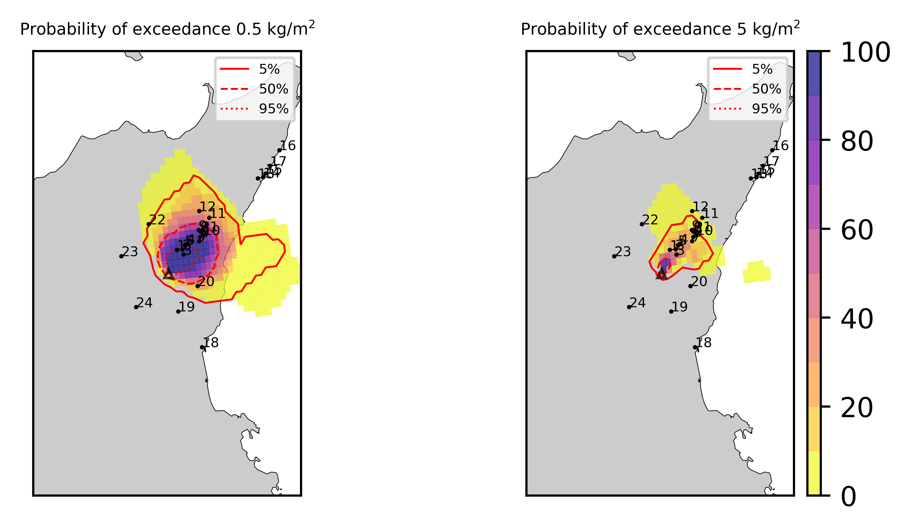  
  
  
  
  
  
  
  
  
  
  
  
  
  
  
  
  
  
  
  
  
  
  
  
  
  
  

|Location|Ground load [kg/m²] 5th perc|Ground load [kg/m²] 50th perc|Ground load [kg/m²] 95th perc|
| :--- | :--- | :--- | :--- |
|Catania AP (1)|0.00e+00|0.00e+00|0.00e+00|
|Siracusa (2)|nan|nan|nan|
|Reggio Calabria (3)|nan|nan|nan|
|Palermo (4)|nan|nan|nan|
|Nicolosi (5)|0.00e+00|2.49e-03|6.31e-02|
|Zafferana (6)|1.68e-02|2.54e-01|3.66e+00|
|Linguaglossa (7)|8.59e-02|1.05e+00|4.29e+00|
|Randazzo (8)|1.76e-03|2.49e-02|1.43e-01|
|Bronte (9)|0.00e+00|0.00e+00|1.50e-03|
|Biancavilla (10)|0.00e+00|1.81e-05|9.24e-04|
|Piano Provenzana (11)|8.53e-01|2.64e+00|7.08e+00|
|Bivio Provenzana-Linguaglossa (12)|8.98e-01|2.89e+00|6.59e+00|
|Cunetta pre-Citelli (13)|8.76e-01|3.86e+00|6.83e+00|
|Chalet (14)|6.35e-01|2.30e+00|7.09e+00|
|Ragabo (15)|6.70e-01|2.32e+00|7.10e+00|
|Scilio (16)|1.82e-01|1.73e+00|6.07e+00|
|Gambino vini (17)|2.98e-01|2.30e+00|7.01e+00|
|StazioneFce Linguaglossa (18)|9.98e-02|1.13e+00|4.39e+00|
|Linguaglossa Via Olivio Sozzi (19)|9.86e-02|9.04e-01|3.80e+00|
|Cim.Linguaglossa (20)|1.10e-01|1.44e+00|5.43e+00|
|Gole Bar (21)|8.55e-03|1.77e-01|2.35e+00|
|Francavilla - Orange (22)|9.59e-03|9.17e-02|2.43e+00|
|Roccalumera1 (23)|0.00e+00|0.00e+00|1.76e-03|
|Roccalumera2 (24)|0.00e+00|0.00e+00|2.21e-04|
|Nizza (25)|0.00e+00|0.00e+00|1.88e-04|
|Scaletta Zanclea (26)|0.00e+00|0.00e+00|0.00e+00|
|Alì (27)|0.00e+00|0.00e+00|5.70e-05|
  

### Atmosphere 2021-03-04 09:20 Z
  

## Forecast at 2021-03-04 10:20 Z from RED VONA issued at 20210304_0817Z
  

|Eruption start [Z]|Eruption end [Z]|Forecast time [Z]|Column height asl [m]|
| :--- | :--- | :--- | :--- |
|2021-03-04 02:30:00|Ongoing|2021-03-04 10:20:00|11000 ± 500 - from VONA|
  
  

|Percentile|MER [kg/s¹]|Mass air [kg]|Mass air nested dom. [kg]|Mass grd [kg]|Mass grd nested dom. [kg]|
| :--- | :--- | :--- | :--- | :--- | :--- |
|5th|3.26e+05|1.41e+09|1.41e+09|2.02e+09|2.02e+09|
|50th|8.97e+05|2.93e+09|2.79e+09|3.67e+09|3.66e+09|
|95th|2.13e+06|5.05e+09|4.42e+09|6.72e+09|6.67e+09|
  

### Ground Nested Domain 2021-03-04 10:20 Z
  
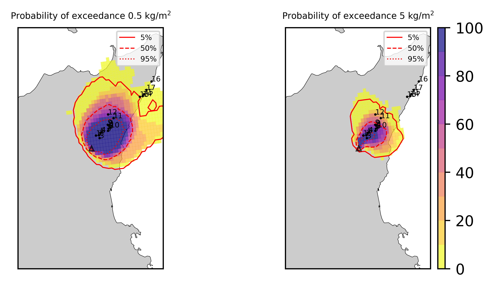  
  
  
  
  
  
  
  
  
  
  
  
  
  
  
  
  
  
  
  
  
  
  
  
  
  
  

|Location|Ground load [kg/m²] 5th perc|Ground load [kg/m²] 50th perc|Ground load [kg/m²] 95th perc|
| :--- | :--- | :--- | :--- |
|Catania AP (1)|0.00e+00|0.00e+00|0.00e+00|
|Siracusa (2)|nan|nan|nan|
|Reggio Calabria (3)|nan|nan|nan|
|Palermo (4)|nan|nan|nan|
|Nicolosi (5)|1.07e-04|1.92e-02|1.40e-01|
|Zafferana (6)|1.07e-01|1.27e+00|5.41e+00|
|Linguaglossa (7)|8.74e-01|4.51e+00|9.61e+00|
|Randazzo (8)|1.48e-02|8.16e-02|2.80e+00|
|Bronte (9)|0.00e+00|0.00e+00|5.99e-03|
|Biancavilla (10)|0.00e+00|1.18e-04|2.12e-03|
|Piano Provenzana (11)|2.97e+00|7.96e+00|1.39e+01|
|Bivio Provenzana-Linguaglossa (12)|4.34e+00|9.39e+00|1.31e+01|
|Cunetta pre-Citelli (13)|7.12e+00|1.03e+01|1.62e+01|
|Chalet (14)|3.65e+00|8.22e+00|1.35e+01|
|Ragabo (15)|3.73e+00|8.29e+00|1.27e+01|
|Scilio (16)|1.64e+00|5.98e+00|1.16e+01|
|Gambino vini (17)|2.24e+00|6.25e+00|1.44e+01|
|StazioneFce Linguaglossa (18)|1.01e+00|4.75e+00|9.75e+00|
|Linguaglossa Via Olivio Sozzi (19)|9.59e-01|4.36e+00|1.10e+01|
|Cim.Linguaglossa (20)|1.13e+00|5.18e+00|1.11e+01|
|Gole Bar (21)|1.52e-01|1.60e+00|6.44e+00|
|Francavilla - Orange (22)|1.35e-01|1.48e+00|6.03e+00|
|Roccalumera1 (23)|0.00e+00|4.23e-03|3.39e-01|
|Roccalumera2 (24)|0.00e+00|6.41e-04|4.53e-01|
|Nizza (25)|0.00e+00|2.07e-04|2.67e-01|
|Scaletta Zanclea (26)|0.00e+00|0.00e+00|3.79e-02|
|Alì (27)|0.00e+00|6.72e-06|8.43e-02|
  

### Atmosphere 2021-03-04 10:20 Z
  

## Forecast at 2021-03-04 11:20 Z from RED VONA issued at 20210304_0817Z
  

|Eruption start [Z]|Eruption end [Z]|Forecast time [Z]|Column height asl [m]|
| :--- | :--- | :--- | :--- |
|2021-03-04 02:30:00|Ongoing|2021-03-04 11:20:00|11000 ± 500 - from VONA|
  
  

|Percentile|MER [kg/s¹]|Mass air [kg]|Mass air nested dom. [kg]|Mass grd [kg]|Mass grd nested dom. [kg]|
| :--- | :--- | :--- | :--- | :--- | :--- |
|5th|2.41e+05|1.77e+09|1.57e+09|3.84e+09|3.83e+09|
|50th|9.52e+05|4.10e+09|3.20e+09|6.70e+09|6.69e+09|
|95th|1.95e+06|5.75e+09|5.22e+09|9.65e+09|9.62e+09|
  

### Ground Nested Domain 2021-03-04 11:20 Z
  
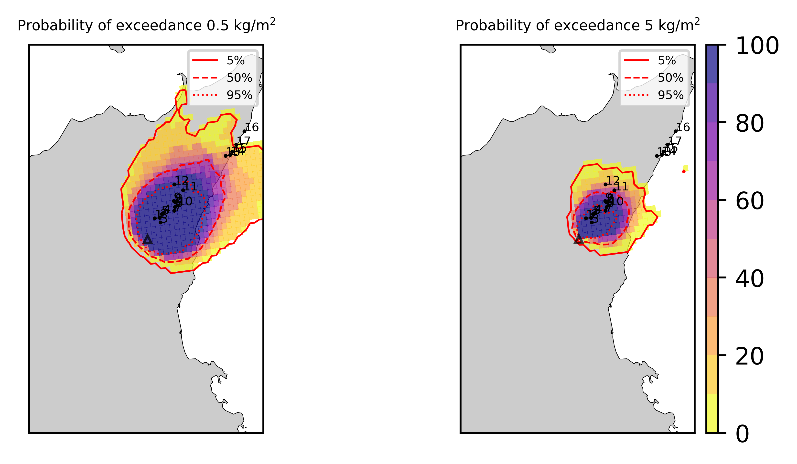  
  
  
  
  
  
  
  
  
  
  
  
  
  
  
  
  
  
  
  
  
  
  
  
  
  
  

|Location|Ground load [kg/m²] 5th perc|Ground load [kg/m²] 50th perc|Ground load [kg/m²] 95th perc|
| :--- | :--- | :--- | :--- |
|Catania AP (1)|0.00e+00|0.00e+00|0.00e+00|
|Siracusa (2)|nan|nan|nan|
|Reggio Calabria (3)|nan|nan|nan|
|Palermo (4)|nan|nan|nan|
|Nicolosi (5)|1.78e-03|5.97e-02|2.40e-01|
|Zafferana (6)|1.73e-01|2.19e+00|7.80e+00|
|Linguaglossa (7)|2.54e+00|7.67e+00|1.60e+01|
|Randazzo (8)|4.06e-02|1.79e-01|3.04e+00|
|Bronte (9)|0.00e+00|3.68e-04|1.12e-02|
|Biancavilla (10)|2.35e-05|1.92e-04|2.99e-03|
|Piano Provenzana (11)|6.92e+00|1.35e+01|1.87e+01|
|Bivio Provenzana-Linguaglossa (12)|9.40e+00|1.43e+01|1.98e+01|
|Cunetta pre-Citelli (13)|9.37e+00|1.45e+01|2.24e+01|
|Chalet (14)|5.17e+00|1.21e+01|1.90e+01|
|Ragabo (15)|7.44e+00|1.27e+01|1.86e+01|
|Scilio (16)|3.54e+00|9.16e+00|1.79e+01|
|Gambino vini (17)|4.15e+00|1.10e+01|1.91e+01|
|StazioneFce Linguaglossa (18)|2.83e+00|7.84e+00|1.63e+01|
|Linguaglossa Via Olivio Sozzi (19)|2.94e+00|7.77e+00|1.58e+01|
|Cim.Linguaglossa (20)|2.69e+00|7.93e+00|1.74e+01|
|Gole Bar (21)|8.62e-01|3.79e+00|1.05e+01|
|Francavilla - Orange (22)|3.45e-01|3.08e+00|1.22e+01|
|Roccalumera1 (23)|8.86e-04|1.30e-01|1.14e+00|
|Roccalumera2 (24)|3.76e-05|4.93e-02|9.74e-01|
|Nizza (25)|0.00e+00|4.50e-02|1.09e+00|
|Scaletta Zanclea (26)|0.00e+00|5.02e-03|2.41e-01|
|Alì (27)|0.00e+00|1.19e-02|6.20e-01|
  

### Atmosphere 2021-03-04 11:20 Z
  

## Forecast at 2021-03-04 14:20 Z from RED VONA issued at 20210304_0817Z
  

|Eruption start [Z]|Eruption end [Z]|Forecast time [Z]|Column height asl [m]|
| :--- | :--- | :--- | :--- |
|2021-03-04 02:30:00|Ongoing|2021-03-04 14:20:00|11000 ± 500 - from VONA|
  
  

|Percentile|MER [kg/s¹]|Mass air [kg]|Mass air nested dom. [kg]|Mass grd [kg]|Mass grd nested dom. [kg]|
| :--- | :--- | :--- | :--- | :--- | :--- |
|5th|3.52e+05|1.81e+09|1.19e+09|9.01e+09|8.99e+09|
|50th|1.16e+06|4.87e+09|3.49e+09|1.61e+10|1.54e+10|
|95th|3.64e+06|1.61e+10|7.01e+09|3.13e+10|2.79e+10|
  

### Ground Nested Domain 2021-03-04 14:20 Z
  
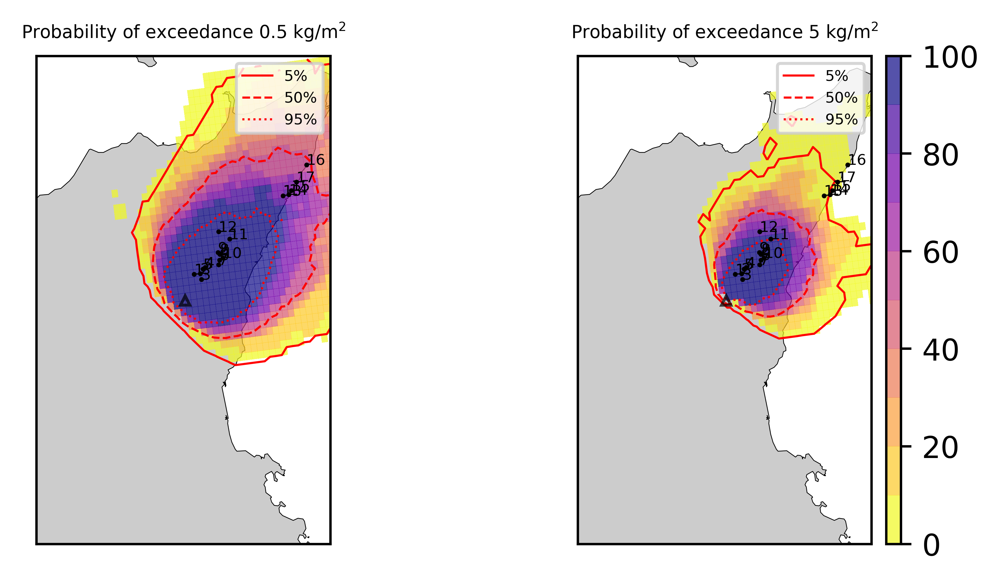  
  
  
  
  
  
  
  
  
  
  
  
  
  
  
  
  
  
  
  
  
  
  
  
  
  
  

|Location|Ground load [kg/m²] 5th perc|Ground load [kg/m²] 50th perc|Ground load [kg/m²] 95th perc|
| :--- | :--- | :--- | :--- |
|Catania AP (1)|0.00e+00|0.00e+00|2.07e-03|
|Siracusa (2)|nan|nan|nan|
|Reggio Calabria (3)|nan|nan|nan|
|Palermo (4)|nan|nan|nan|
|Nicolosi (5)|1.97e-02|1.77e-01|3.28e-01|
|Zafferana (6)|8.75e-01|4.24e+00|1.37e+01|
|Linguaglossa (7)|8.24e+00|1.93e+01|3.64e+01|
|Randazzo (8)|1.60e-01|1.17e+00|5.28e+00|
|Bronte (9)|0.00e+00|1.12e-02|1.20e-01|
|Biancavilla (10)|7.22e-05|2.16e-03|2.61e-02|
|Piano Provenzana (11)|1.61e+01|2.62e+01|3.54e+01|
|Bivio Provenzana-Linguaglossa (12)|1.72e+01|2.88e+01|3.53e+01|
|Cunetta pre-Citelli (13)|2.04e+01|3.14e+01|5.09e+01|
|Chalet (14)|1.62e+01|2.47e+01|3.48e+01|
|Ragabo (15)|1.75e+01|2.51e+01|3.63e+01|
|Scilio (16)|9.51e+00|2.28e+01|3.97e+01|
|Gambino vini (17)|1.28e+01|2.35e+01|3.90e+01|
|StazioneFce Linguaglossa (18)|8.53e+00|1.94e+01|3.60e+01|
|Linguaglossa Via Olivio Sozzi (19)|7.92e+00|1.88e+01|3.28e+01|
|Cim.Linguaglossa (20)|8.15e+00|2.19e+01|3.92e+01|
|Gole Bar (21)|4.03e+00|1.37e+01|2.52e+01|
|Francavilla - Orange (22)|1.91e+00|1.10e+01|2.14e+01|
|Roccalumera1 (23)|2.24e-01|1.76e+00|5.30e+00|
|Roccalumera2 (24)|1.36e-01|1.57e+00|5.64e+00|
|Nizza (25)|1.04e-01|1.48e+00|5.02e+00|
|Scaletta Zanclea (26)|5.19e-03|3.92e-01|2.44e+00|
|Alì (27)|8.90e-02|1.03e+00|3.98e+00|
  

### Atmosphere 2021-03-04 14:20 Z
  

## Forecast at 2021-03-04 17:20 Z from RED VONA issued at 20210304_0817Z
  

|Eruption start [Z]|Eruption end [Z]|Forecast time [Z]|Column height asl [m]|
| :--- | :--- | :--- | :--- |
|2021-03-04 02:30:00|Ongoing|2021-03-04 17:20:00|11000 ± 500 - from VONA|
  
  

|Percentile|MER [kg/s¹]|Mass air [kg]|Mass air nested dom. [kg]|Mass grd [kg]|Mass grd nested dom. [kg]|
| :--- | :--- | :--- | :--- | :--- | :--- |
|5th|2.16e+05|1.92e+09|1.12e+09|1.92e+10|1.84e+10|
|50th|1.19e+06|8.22e+09|3.90e+09|2.97e+10|2.57e+10|
|95th|3.20e+06|2.26e+10|9.22e+09|5.12e+10|4.68e+10|
  

### Ground Nested Domain 2021-03-04 17:20 Z
  
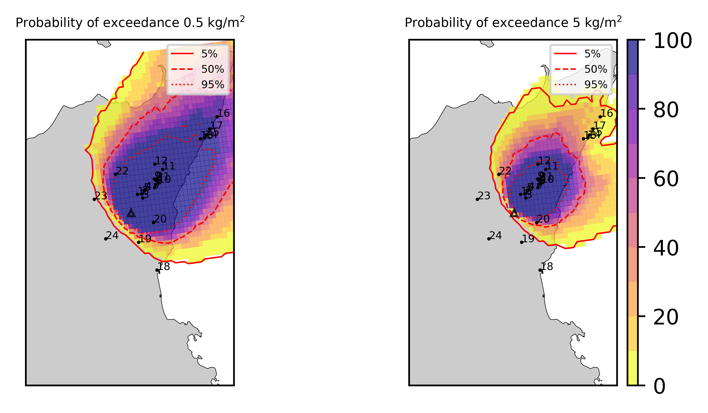  
  
  
  
  
  
  
  
  
  
  
  
  
  
  
  
  
  
  
  
  
  
  
  
  
  
  

|Location|Ground load [kg/m²] 5th perc|Ground load [kg/m²] 50th perc|Ground load [kg/m²] 95th perc|
| :--- | :--- | :--- | :--- |
|Catania AP (1)|0.00e+00|0.00e+00|3.94e-02|
|Siracusa (2)|nan|nan|nan|
|Reggio Calabria (3)|nan|nan|nan|
|Palermo (4)|nan|nan|nan|
|Nicolosi (5)|5.36e-02|2.65e-01|5.32e-01|
|Zafferana (6)|2.22e+00|6.49e+00|1.40e+01|
|Linguaglossa (7)|1.55e+01|2.86e+01|5.55e+01|
|Randazzo (8)|8.23e-01|2.41e+00|1.01e+01|
|Bronte (9)|0.00e+00|7.60e-02|2.30e-01|
|Biancavilla (10)|1.67e-03|6.36e-03|4.15e-02|
|Piano Provenzana (11)|2.64e+01|3.86e+01|5.81e+01|
|Bivio Provenzana-Linguaglossa (12)|3.16e+01|4.07e+01|5.15e+01|
|Cunetta pre-Citelli (13)|3.62e+01|5.14e+01|8.13e+01|
|Chalet (14)|2.35e+01|3.58e+01|5.20e+01|
|Ragabo (15)|2.47e+01|3.68e+01|5.09e+01|
|Scilio (16)|2.07e+01|3.29e+01|5.84e+01|
|Gambino vini (17)|2.34e+01|3.34e+01|5.89e+01|
|StazioneFce Linguaglossa (18)|1.57e+01|2.85e+01|5.52e+01|
|Linguaglossa Via Olivio Sozzi (19)|1.38e+01|2.71e+01|5.29e+01|
|Cim.Linguaglossa (20)|1.92e+01|3.14e+01|5.88e+01|
|Gole Bar (21)|6.52e+00|2.29e+01|3.83e+01|
|Francavilla - Orange (22)|5.61e+00|1.90e+01|4.05e+01|
|Roccalumera1 (23)|6.48e-01|3.35e+00|6.92e+00|
|Roccalumera2 (24)|6.86e-01|3.01e+00|7.59e+00|
|Nizza (25)|7.16e-01|2.72e+00|7.14e+00|
|Scaletta Zanclea (26)|4.33e-01|1.56e+00|4.92e+00|
|Alì (27)|5.65e-01|2.48e+00|5.85e+00|
  

### Atmosphere 2021-03-04 17:20 Z
  

## Forecast at 2021-03-04 20:20 Z from RED VONA issued at 20210304_0817Z
  

|Eruption start [Z]|Eruption end [Z]|Forecast time [Z]|Column height asl [m]|
| :--- | :--- | :--- | :--- |
|2021-03-04 02:30:00|Ongoing|2021-03-04 20:20:00|11000 ± 500 - from VONA|
  
  

|Percentile|MER [kg/s¹]|Mass air [kg]|Mass air nested dom. [kg]|Mass grd [kg]|Mass grd nested dom. [kg]|
| :--- | :--- | :--- | :--- | :--- | :--- |
|5th|3.46e+05|2.40e+09|1.71e+09|2.75e+10|2.62e+10|
|50th|1.14e+06|6.02e+09|3.30e+09|4.07e+10|3.67e+10|
|95th|3.39e+06|1.35e+10|6.10e+09|7.39e+10|5.65e+10|
  

### Ground Nested Domain 2021-03-04 20:20 Z
  
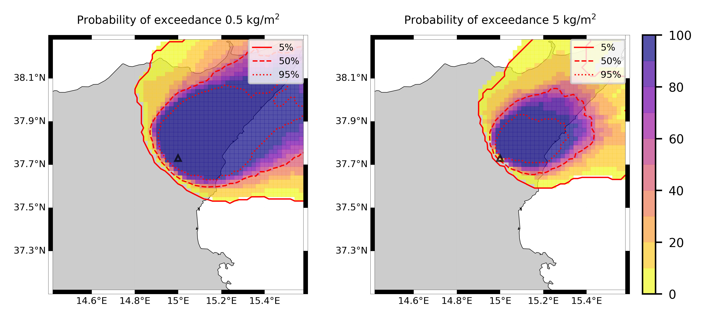  
  
  
  
  
  
  
  
  
  
  
  
  
  
  
  
  
  
  
  
  
  
  
  
  
  
  

|Location|Ground load [kg/m²] 5th perc|Ground load [kg/m²] 50th perc|Ground load [kg/m²] 95th perc|
| :--- | :--- | :--- | :--- |
|Catania AP (1)|0.00e+00|0.00e+00|5.22e-02|
|Siracusa (2)|nan|nan|nan|
|Reggio Calabria (3)|nan|nan|nan|
|Palermo (4)|nan|nan|nan|
|Nicolosi (5)|7.49e-02|3.12e-01|8.11e-01|
|Zafferana (6)|2.45e+00|8.72e+00|1.79e+01|
|Linguaglossa (7)|2.06e+01|4.72e+01|7.01e+01|
|Randazzo (8)|1.68e+00|3.51e+00|1.23e+01|
|Bronte (9)|9.47e-03|9.36e-02|2.58e-01|
|Biancavilla (10)|2.08e-03|8.39e-03|4.70e-02|
|Piano Provenzana (11)|3.26e+01|5.48e+01|7.65e+01|
|Bivio Provenzana-Linguaglossa (12)|3.93e+01|5.79e+01|7.55e+01|
|Cunetta pre-Citelli (13)|5.09e+01|7.34e+01|1.02e+02|
|Chalet (14)|2.94e+01|5.29e+01|6.90e+01|
|Ragabo (15)|3.13e+01|5.39e+01|6.94e+01|
|Scilio (16)|2.83e+01|5.36e+01|7.42e+01|
|Gambino vini (17)|3.12e+01|5.20e+01|7.85e+01|
|StazioneFce Linguaglossa (18)|2.05e+01|4.87e+01|7.04e+01|
|Linguaglossa Via Olivio Sozzi (19)|1.78e+01|4.77e+01|6.85e+01|
|Cim.Linguaglossa (20)|2.68e+01|5.00e+01|7.32e+01|
|Gole Bar (21)|1.02e+01|3.45e+01|6.58e+01|
|Francavilla - Orange (22)|6.73e+00|3.08e+01|5.31e+01|
|Roccalumera1 (23)|1.75e+00|5.69e+00|1.05e+01|
|Roccalumera2 (24)|1.25e+00|5.04e+00|1.06e+01|
|Nizza (25)|1.18e+00|4.65e+00|1.04e+01|
|Scaletta Zanclea (26)|8.65e-01|2.78e+00|7.00e+00|
|Alì (27)|1.07e+00|3.85e+00|9.18e+00|
  

### Atmosphere 2021-03-04 20:20 Z
  

## Forecast at 2021-03-04 11:20 Z from ORANGE VONA issued at 20210304_1016Z
  

|Eruption start [Z]|Eruption end [Z]|Forecast time [Z]|Column height asl [m]|
| :--- | :--- | :--- | :--- |
|2021-03-04 02:30:00|2021-03-04 10:20:00|2021-03-04 11:20:00|11000.0 ± 500 - from VONA|
  
  

|Percentile|MER [kg/s¹]|Mass air [kg]|Mass air nested dom. [kg]|Mass grd [kg]|Mass grd nested dom. [kg]|
| :--- | :--- | :--- | :--- | :--- | :--- |
|5th|2.24e+05|7.86e+08|3.98e+08|3.12e+09|3.11e+09|
|50th|7.08e+05|1.47e+09|1.16e+09|5.12e+09|5.10e+09|
|95th|3.23e+06|3.42e+09|2.10e+09|7.80e+09|7.48e+09|
  

### Ground Nested Domain 2021-03-04 11:20 Z
  
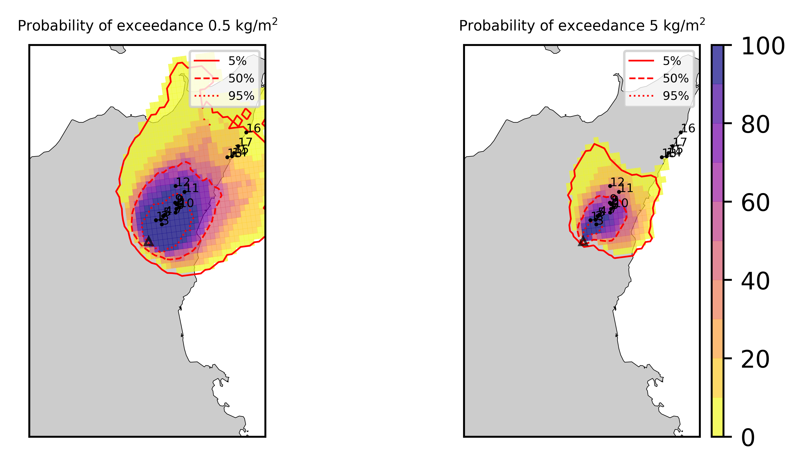  
  
  
  
  
  
  
  
  
  
  
  
  
  
  
  
  
  
  
  
  
  
  
  
  
  
  

|Location|Ground load [kg/m²] 5th perc|Ground load [kg/m²] 50th perc|Ground load [kg/m²] 95th perc|
| :--- | :--- | :--- | :--- |
|Catania AP (1)|0.00e+00|0.00e+00|0.00e+00|
|Siracusa (2)|nan|nan|nan|
|Reggio Calabria (3)|nan|nan|nan|
|Palermo (4)|nan|nan|nan|
|Nicolosi (5)|1.07e-04|1.97e-02|2.37e-01|
|Zafferana (6)|1.13e-01|1.43e+00|6.48e+00|
|Linguaglossa (7)|1.66e+00|5.87e+00|1.23e+01|
|Randazzo (8)|2.74e-02|1.16e-01|3.04e+00|
|Bronte (9)|0.00e+00|0.00e+00|1.15e-02|
|Biancavilla (10)|0.00e+00|1.95e-04|2.48e-03|
|Piano Provenzana (11)|4.02e+00|1.01e+01|1.70e+01|
|Bivio Provenzana-Linguaglossa (12)|6.38e+00|1.15e+01|1.69e+01|
|Cunetta pre-Citelli (13)|7.98e+00|1.28e+01|1.86e+01|
|Chalet (14)|5.07e+00|1.04e+01|1.53e+01|
|Ragabo (15)|5.07e+00|1.01e+01|1.52e+01|
|Scilio (16)|2.39e+00|6.73e+00|1.44e+01|
|Gambino vini (17)|2.89e+00|7.98e+00|1.69e+01|
|StazioneFce Linguaglossa (18)|1.85e+00|6.24e+00|1.28e+01|
|Linguaglossa Via Olivio Sozzi (19)|1.90e+00|5.69e+00|1.46e+01|
|Cim.Linguaglossa (20)|1.79e+00|6.37e+00|1.40e+01|
|Gole Bar (21)|5.68e-01|3.79e+00|8.58e+00|
|Francavilla - Orange (22)|3.16e-01|2.63e+00|6.78e+00|
|Roccalumera1 (23)|2.21e-05|2.22e-01|1.21e+00|
|Roccalumera2 (24)|9.20e-06|1.62e-01|9.72e-01|
|Nizza (25)|0.00e+00|1.12e-01|8.46e-01|
|Scaletta Zanclea (26)|0.00e+00|4.14e-02|7.85e-01|
|Alì (27)|0.00e+00|1.11e-01|5.41e-01|
  

### Atmosphere 2021-03-04 11:20 Z
  
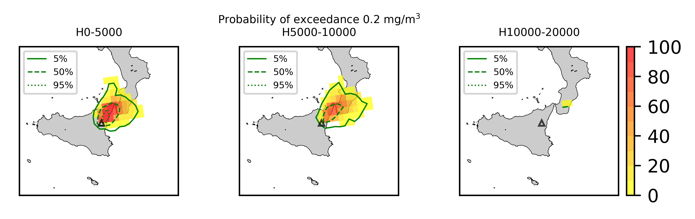
## Forecast at 2021-03-04 14:20 Z from ORANGE VONA issued at 20210304_1016Z
  

|Eruption start [Z]|Eruption end [Z]|Forecast time [Z]|Column height asl [m]|
| :--- | :--- | :--- | :--- |
|2021-03-04 02:30:00|2021-03-04 10:20:00|2021-03-04 14:20:00|None|
  
  

|Percentile|MER [kg/s¹]|Mass air [kg]|Mass air nested dom. [kg]|Mass grd [kg]|Mass grd nested dom. [kg]|
| :--- | :--- | :--- | :--- | :--- | :--- |
|5th|0.00e+00|2.26e+08|2.84e+07|3.49e+09|3.44e+09|
|50th|0.00e+00|4.87e+08|2.16e+08|6.17e+09|5.62e+09|
|95th|0.00e+00|1.75e+09|4.52e+08|8.56e+09|8.21e+09|
  

### Ground Nested Domain 2021-03-04 14:20 Z
  
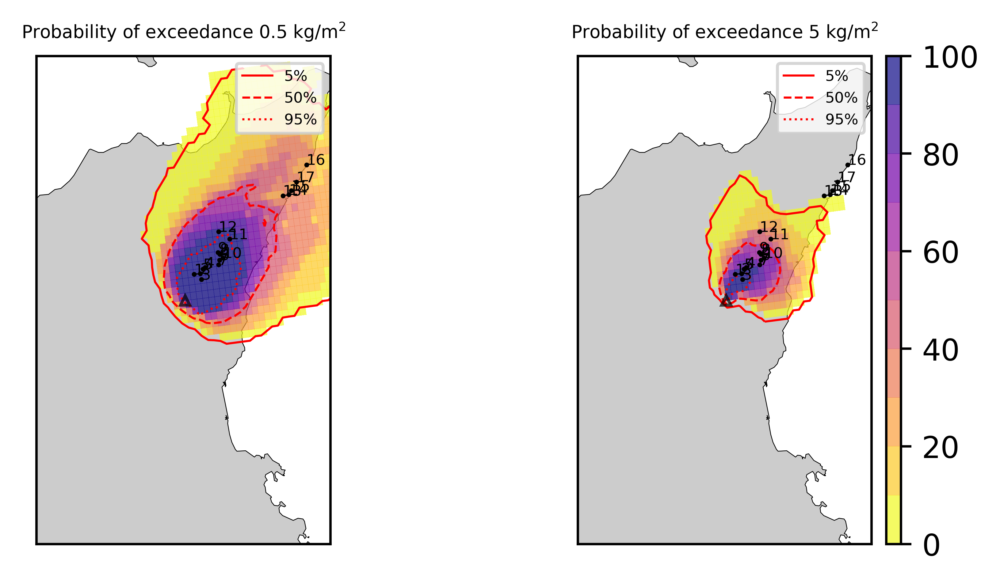  
  
  
  
  
  
  
  
  
  
  
  
  
  
  
  
  
  
  
  
  
  
  
  
  
  
  

|Location|Ground load [kg/m²] 5th perc|Ground load [kg/m²] 50th perc|Ground load [kg/m²] 95th perc|
| :--- | :--- | :--- | :--- |
|Catania AP (1)|0.00e+00|0.00e+00|0.00e+00|
|Siracusa (2)|nan|nan|nan|
|Reggio Calabria (3)|nan|nan|nan|
|Palermo (4)|nan|nan|nan|
|Nicolosi (5)|1.07e-04|2.06e-02|2.37e-01|
|Zafferana (6)|1.13e-01|1.43e+00|6.49e+00|
|Linguaglossa (7)|1.69e+00|6.37e+00|1.26e+01|
|Randazzo (8)|2.78e-02|1.27e-01|3.07e+00|
|Bronte (9)|0.00e+00|0.00e+00|1.15e-02|
|Biancavilla (10)|0.00e+00|1.95e-04|2.48e-03|
|Piano Provenzana (11)|4.26e+00|1.07e+01|1.70e+01|
|Bivio Provenzana-Linguaglossa (12)|6.62e+00|1.16e+01|1.76e+01|
|Cunetta pre-Citelli (13)|8.00e+00|1.29e+01|1.89e+01|
|Chalet (14)|5.24e+00|1.09e+01|1.69e+01|
|Ragabo (15)|5.26e+00|1.08e+01|1.71e+01|
|Scilio (16)|2.40e+00|6.98e+00|1.45e+01|
|Gambino vini (17)|2.90e+00|8.41e+00|1.73e+01|
|StazioneFce Linguaglossa (18)|1.89e+00|6.51e+00|1.28e+01|
|Linguaglossa Via Olivio Sozzi (19)|1.95e+00|6.35e+00|1.46e+01|
|Cim.Linguaglossa (20)|1.81e+00|6.75e+00|1.41e+01|
|Gole Bar (21)|6.40e-01|4.02e+00|8.87e+00|
|Francavilla - Orange (22)|3.37e-01|2.79e+00|7.05e+00|
|Roccalumera1 (23)|1.35e-01|7.79e-01|2.78e+00|
|Roccalumera2 (24)|1.23e-01|7.21e-01|1.99e+00|
|Nizza (25)|7.05e-02|5.50e-01|1.90e+00|
|Scaletta Zanclea (26)|2.53e-02|3.29e-01|2.19e+00|
|Alì (27)|4.41e-02|4.89e-01|1.62e+00|
  

### Atmosphere 2021-03-04 14:20 Z
  
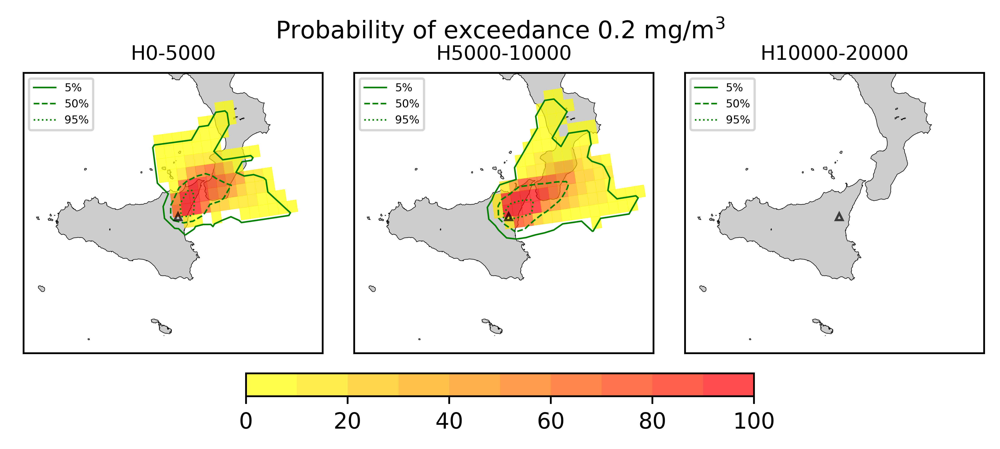
## Forecast at 2021-03-04 17:20 Z from ORANGE VONA issued at 20210304_1016Z
  

|Eruption start [Z]|Eruption end [Z]|Forecast time [Z]|Column height asl [m]|
| :--- | :--- | :--- | :--- |
|2021-03-04 02:30:00|2021-03-04 10:20:00|2021-03-04 17:20:00|None|
  
  

|Percentile|MER [kg/s¹]|Mass air [kg]|Mass air nested dom. [kg]|Mass grd [kg]|Mass grd nested dom. [kg]|
| :--- | :--- | :--- | :--- | :--- | :--- |
|5th|0.00e+00|8.39e+07|1.58e+07|3.54e+09|3.47e+09|
|50th|0.00e+00|3.72e+08|7.59e+07|6.27e+09|5.64e+09|
|95th|0.00e+00|1.28e+09|2.75e+08|8.70e+09|8.29e+09|
  

### Ground Nested Domain 2021-03-04 17:20 Z
  
  
  
  
  
  
  
  
  
  
  
  
  
  
  
  
  
  
  
  
  
  
  
  
  
  
  
  

|Location|Ground load [kg/m²] 5th perc|Ground load [kg/m²] 50th perc|Ground load [kg/m²] 95th perc|
| :--- | :--- | :--- | :--- |
|Catania AP (1)|0.00e+00|0.00e+00|0.00e+00|
|Siracusa (2)|nan|nan|nan|
|Reggio Calabria (3)|nan|nan|nan|
|Palermo (4)|nan|nan|nan|
|Nicolosi (5)|1.07e-04|2.06e-02|2.37e-01|
|Zafferana (6)|1.13e-01|1.43e+00|6.49e+00|
|Linguaglossa (7)|1.70e+00|6.44e+00|1.26e+01|
|Randazzo (8)|6.06e-02|1.85e-01|3.10e+00|
|Bronte (9)|0.00e+00|0.00e+00|1.16e-02|
|Biancavilla (10)|0.00e+00|1.95e-04|2.48e-03|
|Piano Provenzana (11)|4.35e+00|1.07e+01|1.70e+01|
|Bivio Provenzana-Linguaglossa (12)|6.73e+00|1.16e+01|1.76e+01|
|Cunetta pre-Citelli (13)|8.02e+00|1.29e+01|1.89e+01|
|Chalet (14)|5.35e+00|1.10e+01|1.70e+01|
|Ragabo (15)|5.38e+00|1.10e+01|1.72e+01|
|Scilio (16)|2.41e+00|7.15e+00|1.46e+01|
|Gambino vini (17)|2.94e+00|8.49e+00|1.74e+01|
|StazioneFce Linguaglossa (18)|1.89e+00|6.56e+00|1.28e+01|
|Linguaglossa Via Olivio Sozzi (19)|1.96e+00|6.40e+00|1.46e+01|
|Cim.Linguaglossa (20)|1.82e+00|6.83e+00|1.42e+01|
|Gole Bar (21)|6.47e-01|4.03e+00|8.87e+00|
|Francavilla - Orange (22)|3.61e-01|2.80e+00|7.10e+00|
|Roccalumera1 (23)|1.46e-01|7.79e-01|2.78e+00|
|Roccalumera2 (24)|1.23e-01|7.21e-01|1.99e+00|
|Nizza (25)|7.94e-02|5.62e-01|1.90e+00|
|Scaletta Zanclea (26)|2.64e-02|3.85e-01|2.20e+00|
|Alì (27)|5.11e-02|4.89e-01|1.62e+00|
  

### Atmosphere 2021-03-04 17:20 Z
  
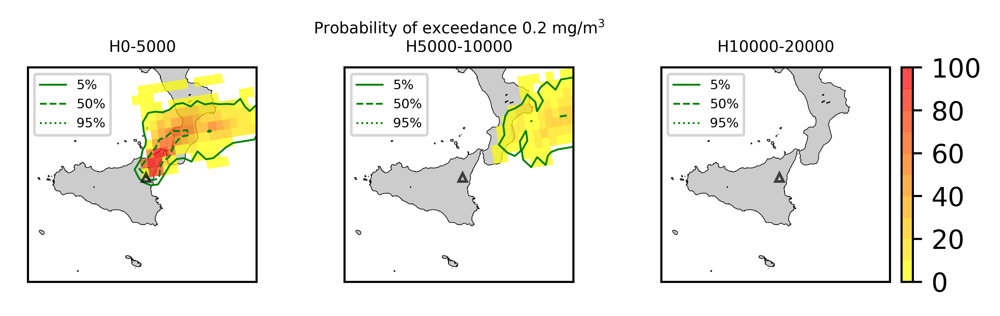  
Go to [Supplementary page](Supplementary_page.md)  
Go to [Main directory](https://github.com/federicapardini/Real_time_ash_forecast)