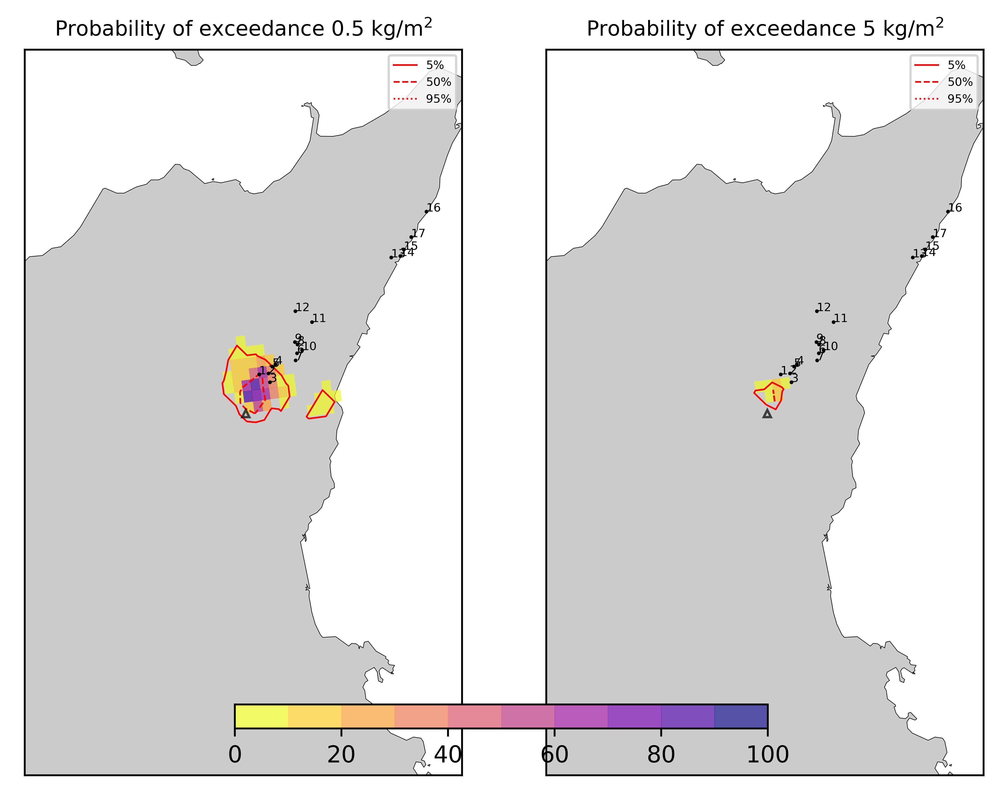
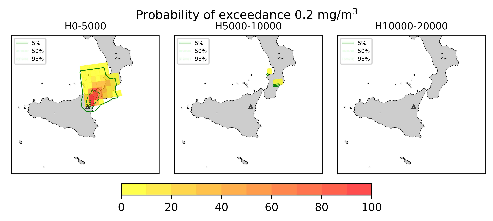
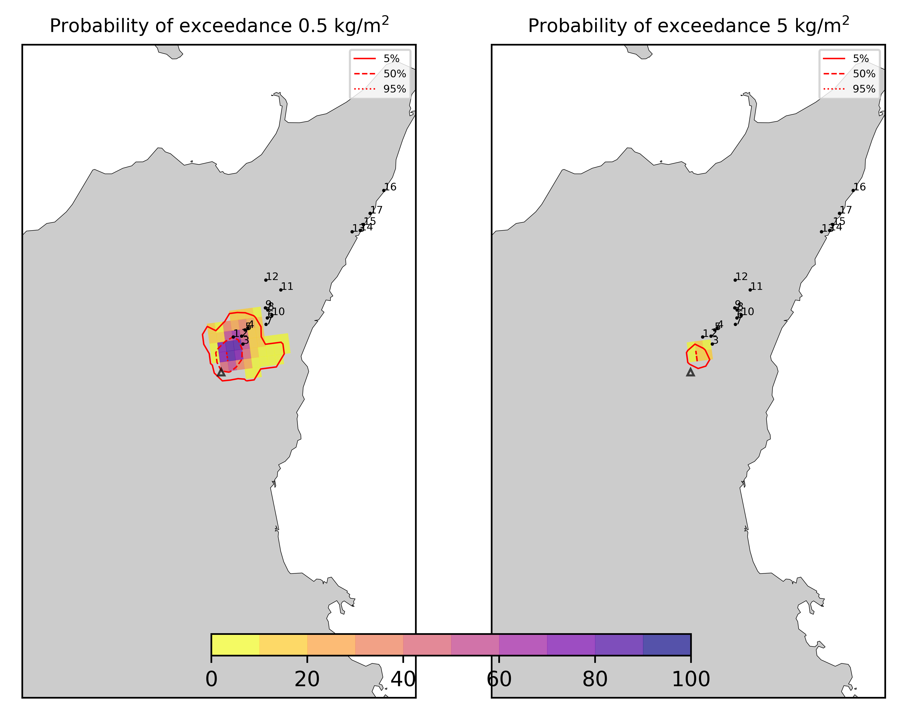
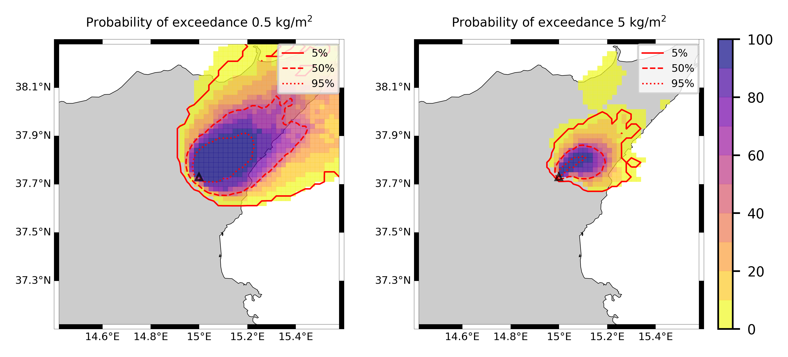
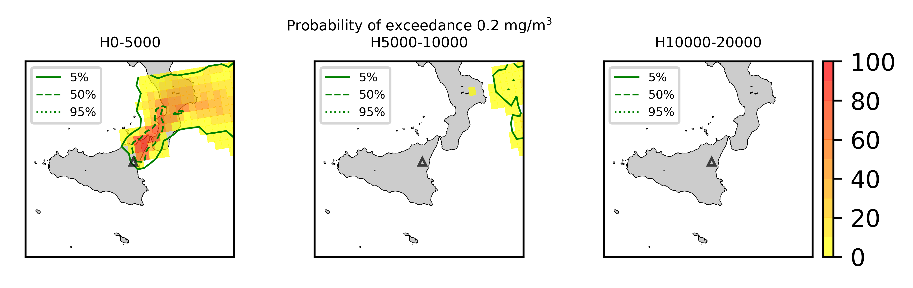

Forecast from VONA_20210304_0228Z
=================================

Contents
========

* [Forecast products](#forecast-products)
	* [Forecast at 2021-03-04 03:30 Z - Ongoing Eruption](#forecast-at-2021-03-04-0330-z---ongoing-eruption)
	* [Forecast at 2021-03-04 04:30 Z - Ongoing Eruption](#forecast-at-2021-03-04-0430-z---ongoing-eruption)
	* [Forecast at 2021-03-04 05:30 Z - Ongoing Eruption](#forecast-at-2021-03-04-0530-z---ongoing-eruption)
	* [Forecast at 2021-03-04 08:30 Z - Ongoing Eruption](#forecast-at-2021-03-04-0830-z---ongoing-eruption)
	* [Forecast at 2021-03-04 11:30 Z - Ongoing Eruption](#forecast-at-2021-03-04-1130-z---ongoing-eruption)
	* [Forecast at 2021-03-04 14:30 Z - Ongoing Eruption](#forecast-at-2021-03-04-1430-z---ongoing-eruption)
	* [Forecast at 2021-03-04 10:50 Z - Ongoing Eruption](#forecast-at-2021-03-04-1050-z---ongoing-eruption)
	* [Forecast at 2021-03-04 11:00 Z - Ongoing Eruption](#forecast-at-2021-03-04-1100-z---ongoing-eruption)
	* [Forecast at 2021-03-04 14:00 Z - Ongoing Eruption](#forecast-at-2021-03-04-1400-z---ongoing-eruption)
	* [Forecast at 2021-03-04 17:00 Z - Ongoing Eruption](#forecast-at-2021-03-04-1700-z---ongoing-eruption)
	* [Forecast at 2021-03-04 20:00 Z - Ongoing Eruption](#forecast-at-2021-03-04-2000-z---ongoing-eruption)
	* [Forecast at 2021-03-04 11:20 Z - Ongoing Eruption](#forecast-at-2021-03-04-1120-z---ongoing-eruption)
	* [Forecast at 2021-03-04 14:20 Z - Ongoing Eruption](#forecast-at-2021-03-04-1420-z---ongoing-eruption)
	* [Forecast at 2021-03-04 17:20 Z - Ongoing Eruption](#forecast-at-2021-03-04-1720-z---ongoing-eruption)
	* [Forecast at 2021-03-04 20:20 Z - Ongoing Eruption](#forecast-at-2021-03-04-2020-z---ongoing-eruption)

# Forecast products

## Forecast at 2021-03-04 03:30 Z - Ongoing Eruption
  

|Eruption start [Z]|Eruption end [Z]|Forecast time [Z]|Column height asl [m]|
| :--- | :--- | :--- | :--- |
|2021-03-04 02:30:00|Ongoing|2021-03-04 03:30:00|5000 ± 500 - from VONA|
  
  

|Percentile|MER [kg/s¹]|Mass air [kg]|Mass air nested dom. [kg]|Mass grd [kg]|Mass grd nested dom. [kg]|
| :--- | :--- | :--- | :--- | :--- | :--- |
|5th|2.47e+02|1.14e+06|1.14e+06|8.80e+03|1.05e+04|
|50th|3.02e+03|9.54e+06|9.53e+06|8.55e+05|8.53e+05|
|95th|1.03e+04|2.78e+07|2.78e+07|4.82e+06|4.80e+06|
  

### Ground Nested Domain 2021-03-04 03:30 Z
  
  
  
  
  
  
  
  
  
  
  
  
  
  
  
  
  
  

|Location|Ground load [kg/m²] 5th perc|Ground load [kg/m²] 50th perc|Ground load [kg/m²] 95th perc|
| :--- | :--- | :--- | :--- |
|Piano Provenzana (1)|0.00e+00|1.47e-04|1.24e-02|
|Bivio Provenzana-Linguaglossa (2)|0.00e+00|1.08e-05|9.15e-03|
|Cunetta pre-Citelli (3)|0.00e+00|2.18e-05|1.05e-02|
|Chalet (4)|0.00e+00|0.00e+00|1.03e-03|
|Ragabo (5)|0.00e+00|0.00e+00|4.01e-03|
|Scilio (6)|0.00e+00|0.00e+00|1.90e-04|
|Gambino vini (7)|0.00e+00|0.00e+00|2.85e-04|
|StazioneFce Linguaglossa (8)|0.00e+00|0.00e+00|5.82e-05|
|Linguaglossa Via Olivio Sozzi (9)|0.00e+00|0.00e+00|2.48e-05|
|Cim.Linguaglossa (10)|0.00e+00|0.00e+00|1.12e-04|
|Gole Bar (11)|0.00e+00|0.00e+00|0.00e+00|
|Francavilla - Orange (12)|0.00e+00|0.00e+00|0.00e+00|
|Roccalumera1 (13)|0.00e+00|0.00e+00|0.00e+00|
|Roccalumera2 (14)|0.00e+00|0.00e+00|0.00e+00|
|Nizza (15)|0.00e+00|0.00e+00|0.00e+00|
|Scaletta Zanclea (16)|0.00e+00|0.00e+00|0.00e+00|
|Alì (17)|0.00e+00|0.00e+00|0.00e+00|
  

### Atmosphere 2021-03-04 03:30 Z
  

## Forecast at 2021-03-04 04:30 Z - Ongoing Eruption
  

|Eruption start [Z]|Eruption end [Z]|Forecast time [Z]|Column height asl [m]|
| :--- | :--- | :--- | :--- |
|2021-03-04 02:30:00|Ongoing|2021-03-04 04:30:00|5000 ± 500 - from VONA|
  
  

|Percentile|MER [kg/s¹]|Mass air [kg]|Mass air nested dom. [kg]|Mass grd [kg]|Mass grd nested dom. [kg]|
| :--- | :--- | :--- | :--- | :--- | :--- |
|5th|4.28e+02|1.29e+06|1.29e+06|8.51e+04|1.01e+05|
|50th|3.35e+03|1.13e+07|1.13e+07|2.10e+06|2.10e+06|
|95th|7.84e+03|2.49e+07|2.48e+07|5.97e+06|5.95e+06|
  

### Ground Nested Domain 2021-03-04 04:30 Z
  
  
  
  
  
  
  
  
  
  
  
  
  
  
  
  
  
  

|Location|Ground load [kg/m²] 5th perc|Ground load [kg/m²] 50th perc|Ground load [kg/m²] 95th perc|
| :--- | :--- | :--- | :--- |
|Piano Provenzana (1)|1.53e-05|4.65e-03|1.80e-02|
|Bivio Provenzana-Linguaglossa (2)|0.00e+00|1.06e-03|1.86e-02|
|Cunetta pre-Citelli (3)|0.00e+00|1.04e-03|1.73e-02|
|Chalet (4)|0.00e+00|1.60e-06|6.96e-03|
|Ragabo (5)|0.00e+00|5.36e-05|7.44e-03|
|Scilio (6)|0.00e+00|0.00e+00|2.52e-04|
|Gambino vini (7)|0.00e+00|0.00e+00|3.02e-04|
|StazioneFce Linguaglossa (8)|0.00e+00|0.00e+00|7.78e-05|
|Linguaglossa Via Olivio Sozzi (9)|0.00e+00|0.00e+00|6.99e-05|
|Cim.Linguaglossa (10)|0.00e+00|0.00e+00|1.17e-04|
|Gole Bar (11)|0.00e+00|0.00e+00|0.00e+00|
|Francavilla - Orange (12)|0.00e+00|0.00e+00|0.00e+00|
|Roccalumera1 (13)|0.00e+00|0.00e+00|0.00e+00|
|Roccalumera2 (14)|0.00e+00|0.00e+00|0.00e+00|
|Nizza (15)|0.00e+00|0.00e+00|0.00e+00|
|Scaletta Zanclea (16)|0.00e+00|0.00e+00|0.00e+00|
|Alì (17)|0.00e+00|0.00e+00|0.00e+00|
  

### Atmosphere 2021-03-04 04:30 Z
  

## Forecast at 2021-03-04 05:30 Z - Ongoing Eruption
  

|Eruption start [Z]|Eruption end [Z]|Forecast time [Z]|Column height asl [m]|
| :--- | :--- | :--- | :--- |
|2021-03-04 02:30:00|Ongoing|2021-03-04 05:30:00|5000 ± 500 - from VONA|
  
  

|Percentile|MER [kg/s¹]|Mass air [kg]|Mass air nested dom. [kg]|Mass grd [kg]|Mass grd nested dom. [kg]|
| :--- | :--- | :--- | :--- | :--- | :--- |
|5th|5.26e+02|1.54e+06|1.54e+06|1.06e+06|1.07e+06|
|50th|4.04e+03|1.28e+07|1.28e+07|3.29e+06|3.30e+06|
|95th|1.45e+04|4.24e+07|4.23e+07|8.87e+06|8.87e+06|
  

### Ground Nested Domain 2021-03-04 05:30 Z
  
  
  
  
  
  
  
  
  
  
  
  
  
  
  
  
  
  

|Location|Ground load [kg/m²] 5th perc|Ground load [kg/m²] 50th perc|Ground load [kg/m²] 95th perc|
| :--- | :--- | :--- | :--- |
|Piano Provenzana (1)|1.75e-04|1.02e-02|2.11e-02|
|Bivio Provenzana-Linguaglossa (2)|0.00e+00|1.56e-03|4.76e-02|
|Cunetta pre-Citelli (3)|8.46e-06|2.07e-03|8.33e-02|
|Chalet (4)|0.00e+00|8.71e-06|6.96e-03|
|Ragabo (5)|0.00e+00|8.65e-05|1.67e-02|
|Scilio (6)|0.00e+00|0.00e+00|8.43e-04|
|Gambino vini (7)|0.00e+00|0.00e+00|2.67e-03|
|StazioneFce Linguaglossa (8)|0.00e+00|0.00e+00|9.56e-05|
|Linguaglossa Via Olivio Sozzi (9)|0.00e+00|0.00e+00|6.99e-05|
|Cim.Linguaglossa (10)|0.00e+00|0.00e+00|1.83e-04|
|Gole Bar (11)|0.00e+00|0.00e+00|0.00e+00|
|Francavilla - Orange (12)|0.00e+00|0.00e+00|0.00e+00|
|Roccalumera1 (13)|0.00e+00|0.00e+00|0.00e+00|
|Roccalumera2 (14)|0.00e+00|0.00e+00|0.00e+00|
|Nizza (15)|0.00e+00|0.00e+00|0.00e+00|
|Scaletta Zanclea (16)|0.00e+00|0.00e+00|0.00e+00|
|Alì (17)|0.00e+00|0.00e+00|0.00e+00|
  

### Atmosphere 2021-03-04 05:30 Z
  

## Forecast at 2021-03-04 08:30 Z - Ongoing Eruption
  

|Eruption start [Z]|Eruption end [Z]|Forecast time [Z]|Column height asl [m]|
| :--- | :--- | :--- | :--- |
|2021-03-04 02:30:00|Ongoing|2021-03-04 08:30:00|5000 ± 500 - from VONA|
  
  

|Percentile|MER [kg/s¹]|Mass air [kg]|Mass air nested dom. [kg]|Mass grd [kg]|Mass grd nested dom. [kg]|
| :--- | :--- | :--- | :--- | :--- | :--- |
|5th|2.43e+02|3.99e+06|3.99e+06|1.24e+06|1.25e+06|
|50th|1.84e+03|1.58e+07|1.58e+07|6.50e+06|6.49e+06|
|95th|1.02e+04|6.11e+07|6.11e+07|1.59e+07|1.59e+07|
  

### Ground Nested Domain 2021-03-04 08:30 Z
  
  
  
  
  
  
  
  
  
  
  
  
  
  
  
  
  
  

|Location|Ground load [kg/m²] 5th perc|Ground load [kg/m²] 50th perc|Ground load [kg/m²] 95th perc|
| :--- | :--- | :--- | :--- |
|Piano Provenzana (1)|2.08e-03|1.27e-02|8.63e-02|
|Bivio Provenzana-Linguaglossa (2)|9.48e-05|6.08e-03|6.28e-02|
|Cunetta pre-Citelli (3)|9.39e-05|5.80e-03|2.08e-01|
|Chalet (4)|1.80e-06|1.37e-03|3.82e-02|
|Ragabo (5)|1.50e-05|4.12e-03|4.08e-02|
|Scilio (6)|0.00e+00|2.34e-05|1.22e-02|
|Gambino vini (7)|0.00e+00|2.09e-05|2.23e-02|
|StazioneFce Linguaglossa (8)|0.00e+00|2.35e-06|1.08e-02|
|Linguaglossa Via Olivio Sozzi (9)|0.00e+00|6.26e-06|1.12e-02|
|Cim.Linguaglossa (10)|0.00e+00|0.00e+00|5.93e-03|
|Gole Bar (11)|0.00e+00|0.00e+00|2.76e-03|
|Francavilla - Orange (12)|0.00e+00|0.00e+00|8.34e-04|
|Roccalumera1 (13)|0.00e+00|0.00e+00|0.00e+00|
|Roccalumera2 (14)|0.00e+00|0.00e+00|0.00e+00|
|Nizza (15)|0.00e+00|0.00e+00|0.00e+00|
|Scaletta Zanclea (16)|0.00e+00|0.00e+00|0.00e+00|
|Alì (17)|0.00e+00|0.00e+00|0.00e+00|
  

### Atmosphere 2021-03-04 08:30 Z
  

## Forecast at 2021-03-04 11:30 Z - Ongoing Eruption
  

|Eruption start [Z]|Eruption end [Z]|Forecast time [Z]|Column height asl [m]|
| :--- | :--- | :--- | :--- |
|2021-03-04 02:30:00|Ongoing|2021-03-04 11:30:00|5000 ± 500 - from VONA|
  
  

|Percentile|MER [kg/s¹]|Mass air [kg]|Mass air nested dom. [kg]|Mass grd [kg]|Mass grd nested dom. [kg]|
| :--- | :--- | :--- | :--- | :--- | :--- |
|5th|3.59e+02|4.29e+06|4.29e+06|2.11e+06|2.13e+06|
|50th|3.14e+03|2.89e+07|2.88e+07|1.32e+07|1.32e+07|
|95th|1.13e+04|9.79e+07|9.79e+07|2.59e+07|2.59e+07|
  

### Ground Nested Domain 2021-03-04 11:30 Z
  
  
  
  
  
  
  
  
  
  
  
  
  
  
  
  
  
  

|Location|Ground load [kg/m²] 5th perc|Ground load [kg/m²] 50th perc|Ground load [kg/m²] 95th perc|
| :--- | :--- | :--- | :--- |
|Piano Provenzana (1)|4.98e-03|2.00e-02|1.31e-01|
|Bivio Provenzana-Linguaglossa (2)|2.95e-04|1.31e-02|9.81e-02|
|Cunetta pre-Citelli (3)|1.18e-04|8.65e-03|2.17e-01|
|Chalet (4)|5.44e-05|2.78e-03|8.39e-02|
|Ragabo (5)|1.95e-04|6.47e-03|8.27e-02|
|Scilio (6)|0.00e+00|2.94e-04|2.05e-02|
|Gambino vini (7)|0.00e+00|2.35e-04|2.97e-02|
|StazioneFce Linguaglossa (8)|0.00e+00|9.82e-05|2.14e-02|
|Linguaglossa Via Olivio Sozzi (9)|0.00e+00|6.17e-05|2.56e-02|
|Cim.Linguaglossa (10)|0.00e+00|4.26e-05|1.06e-02|
|Gole Bar (11)|0.00e+00|0.00e+00|4.99e-03|
|Francavilla - Orange (12)|0.00e+00|8.04e-06|2.36e-03|
|Roccalumera1 (13)|0.00e+00|0.00e+00|0.00e+00|
|Roccalumera2 (14)|0.00e+00|0.00e+00|0.00e+00|
|Nizza (15)|0.00e+00|0.00e+00|0.00e+00|
|Scaletta Zanclea (16)|0.00e+00|0.00e+00|0.00e+00|
|Alì (17)|0.00e+00|0.00e+00|0.00e+00|
  

### Atmosphere 2021-03-04 11:30 Z
  

## Forecast at 2021-03-04 14:30 Z - Ongoing Eruption
  

|Eruption start [Z]|Eruption end [Z]|Forecast time [Z]|Column height asl [m]|
| :--- | :--- | :--- | :--- |
|2021-03-04 02:30:00|Ongoing|2021-03-04 14:30:00|5000 ± 500 - from VONA|
  
  

|Percentile|MER [kg/s¹]|Mass air [kg]|Mass air nested dom. [kg]|Mass grd [kg]|Mass grd nested dom. [kg]|
| :--- | :--- | :--- | :--- | :--- | :--- |
|5th|1.85e+02|5.62e+06|5.62e+06|1.06e+07|1.06e+07|
|50th|5.27e+03|5.02e+07|5.02e+07|1.83e+07|1.83e+07|
|95th|2.02e+04|1.76e+08|1.71e+08|5.19e+07|5.19e+07|
  

### Ground Nested Domain 2021-03-04 14:30 Z
  
  
  
  
  
  
  
  
  
  
  
  
  
  
  
  
  
  

|Location|Ground load [kg/m²] 5th perc|Ground load [kg/m²] 50th perc|Ground load [kg/m²] 95th perc|
| :--- | :--- | :--- | :--- |
|Piano Provenzana (1)|1.40e-02|3.66e-02|3.14e-01|
|Bivio Provenzana-Linguaglossa (2)|4.39e-03|4.76e-02|1.22e-01|
|Cunetta pre-Citelli (3)|2.45e-03|5.01e-02|2.18e-01|
|Chalet (4)|1.13e-03|3.27e-02|8.73e-02|
|Ragabo (5)|2.15e-03|4.39e-02|9.34e-02|
|Scilio (6)|8.00e-06|2.80e-03|2.19e-02|
|Gambino vini (7)|0.00e+00|2.54e-03|3.08e-02|
|StazioneFce Linguaglossa (8)|7.46e-06|2.76e-03|2.20e-02|
|Linguaglossa Via Olivio Sozzi (9)|1.93e-05|3.53e-03|2.56e-02|
|Cim.Linguaglossa (10)|0.00e+00|1.46e-03|1.41e-02|
|Gole Bar (11)|0.00e+00|2.92e-04|8.43e-03|
|Francavilla - Orange (12)|0.00e+00|6.04e-04|4.53e-03|
|Roccalumera1 (13)|0.00e+00|0.00e+00|1.69e-05|
|Roccalumera2 (14)|0.00e+00|0.00e+00|2.59e-05|
|Nizza (15)|0.00e+00|0.00e+00|2.44e-05|
|Scaletta Zanclea (16)|0.00e+00|0.00e+00|1.32e-07|
|Alì (17)|0.00e+00|0.00e+00|2.18e-05|
  

### Atmosphere 2021-03-04 14:30 Z
  

## Forecast at 2021-03-04 10:50 Z - Ongoing Eruption
  

|Eruption start [Z]|Eruption end [Z]|Forecast time [Z]|Column height asl [m]|
| :--- | :--- | :--- | :--- |
|2021-03-04 02:30:00|Ongoing|2021-03-04 10:50:00|6000 ± 500 - from VONA|
  
  

|Percentile|MER [kg/s¹]|Mass air [kg]|Mass air nested dom. [kg]|Mass grd [kg]|Mass grd nested dom. [kg]|
| :--- | :--- | :--- | :--- | :--- | :--- |
|5th|2.39e+03|3.67e+07|3.67e+07|2.70e+06|2.72e+06|
|50th|7.07e+03|7.16e+07|7.15e+07|1.55e+07|1.55e+07|
|95th|2.34e+04|1.73e+08|1.73e+08|4.65e+07|4.65e+07|
  

### Ground Nested Domain 2021-03-04 10:50 Z
  
  
  
  
  
  
  
  
  
  
  
  
  
  
  
  
  
  

|Location|Ground load [kg/m²] 5th perc|Ground load [kg/m²] 50th perc|Ground load [kg/m²] 95th perc|
| :--- | :--- | :--- | :--- |
|Piano Provenzana (1)|2.13e-03|1.88e-02|2.25e-01|
|Bivio Provenzana-Linguaglossa (2)|1.15e-03|1.76e-02|1.38e-01|
|Cunetta pre-Citelli (3)|9.03e-04|1.55e-02|1.77e-01|
|Chalet (4)|6.73e-06|4.39e-03|1.07e-01|
|Ragabo (5)|8.90e-05|7.82e-03|1.04e-01|
|Scilio (6)|0.00e+00|1.40e-04|2.65e-02|
|Gambino vini (7)|0.00e+00|5.35e-05|2.93e-02|
|StazioneFce Linguaglossa (8)|0.00e+00|4.10e-04|2.25e-02|
|Linguaglossa Via Olivio Sozzi (9)|0.00e+00|5.10e-04|2.16e-02|
|Cim.Linguaglossa (10)|0.00e+00|5.44e-05|1.65e-02|
|Gole Bar (11)|0.00e+00|2.79e-06|9.47e-03|
|Francavilla - Orange (12)|0.00e+00|8.92e-06|3.36e-03|
|Roccalumera1 (13)|0.00e+00|0.00e+00|0.00e+00|
|Roccalumera2 (14)|0.00e+00|0.00e+00|0.00e+00|
|Nizza (15)|0.00e+00|0.00e+00|0.00e+00|
|Scaletta Zanclea (16)|0.00e+00|0.00e+00|0.00e+00|
|Alì (17)|0.00e+00|0.00e+00|0.00e+00|
  

### Atmosphere 2021-03-04 10:50 Z
  

## Forecast at 2021-03-04 11:00 Z - Ongoing Eruption
  

|Eruption start [Z]|Eruption end [Z]|Forecast time [Z]|Column height asl [m]|
| :--- | :--- | :--- | :--- |
|2021-03-04 02:30:00|Ongoing|2021-03-04 11:00:00|6500 ± 500 - from VONA|
  
  

|Percentile|MER [kg/s¹]|Mass air [kg]|Mass air nested dom. [kg]|Mass grd [kg]|Mass grd nested dom. [kg]|
| :--- | :--- | :--- | :--- | :--- | :--- |
|5th|3.25e+03|3.41e+07|3.41e+07|3.21e+06|3.24e+06|
|50th|1.36e+04|1.31e+08|1.31e+08|1.95e+07|1.95e+07|
|95th|2.24e+04|2.21e+08|2.21e+08|4.76e+07|4.76e+07|
  

### Ground Nested Domain 2021-03-04 11:00 Z
  
  
  
  
  
  
  
  
  
  
  
  
  
  
  
  
  
  

|Location|Ground load [kg/m²] 5th perc|Ground load [kg/m²] 50th perc|Ground load [kg/m²] 95th perc|
| :--- | :--- | :--- | :--- |
|Piano Provenzana (1)|2.29e-03|3.23e-02|2.26e-01|
|Bivio Provenzana-Linguaglossa (2)|1.04e-04|2.79e-02|1.29e-01|
|Cunetta pre-Citelli (3)|9.67e-05|1.63e-02|1.89e-01|
|Chalet (4)|0.00e+00|5.81e-03|8.28e-02|
|Ragabo (5)|1.58e-05|1.58e-02|9.75e-02|
|Scilio (6)|0.00e+00|1.10e-03|3.87e-02|
|Gambino vini (7)|0.00e+00|9.14e-04|3.93e-02|
|StazioneFce Linguaglossa (8)|0.00e+00|6.49e-04|3.55e-02|
|Linguaglossa Via Olivio Sozzi (9)|0.00e+00|6.75e-04|3.54e-02|
|Cim.Linguaglossa (10)|0.00e+00|3.30e-04|2.97e-02|
|Gole Bar (11)|0.00e+00|1.97e-05|2.45e-02|
|Francavilla - Orange (12)|0.00e+00|4.36e-05|9.24e-03|
|Roccalumera1 (13)|0.00e+00|0.00e+00|6.17e-07|
|Roccalumera2 (14)|0.00e+00|0.00e+00|0.00e+00|
|Nizza (15)|0.00e+00|0.00e+00|0.00e+00|
|Scaletta Zanclea (16)|0.00e+00|0.00e+00|0.00e+00|
|Alì (17)|0.00e+00|0.00e+00|0.00e+00|
  

### Atmosphere 2021-03-04 11:00 Z
  

## Forecast at 2021-03-04 14:00 Z - Ongoing Eruption
  

|Eruption start [Z]|Eruption end [Z]|Forecast time [Z]|Column height asl [m]|
| :--- | :--- | :--- | :--- |
|2021-03-04 02:30:00|Ongoing|2021-03-04 14:00:00|6500 ± 500 - from VONA|
  
  

|Percentile|MER [kg/s¹]|Mass air [kg]|Mass air nested dom. [kg]|Mass grd [kg]|Mass grd nested dom. [kg]|
| :--- | :--- | :--- | :--- | :--- | :--- |
|5th|6.09e+03|7.32e+07|7.31e+07|8.47e+06|8.49e+06|
|50th|1.78e+04|1.66e+08|1.66e+08|4.55e+07|4.55e+07|
|95th|5.91e+04|4.96e+08|3.86e+08|1.30e+08|1.30e+08|
  

### Ground Nested Domain 2021-03-04 14:00 Z
  
  
  
  
  
  
  
  
  
  
  
  
  
  
  
  
  
  

|Location|Ground load [kg/m²] 5th perc|Ground load [kg/m²] 50th perc|Ground load [kg/m²] 95th perc|
| :--- | :--- | :--- | :--- |
|Piano Provenzana (1)|6.12e-03|1.55e-01|7.85e-01|
|Bivio Provenzana-Linguaglossa (2)|1.49e-03|9.58e-02|6.36e-01|
|Cunetta pre-Citelli (3)|1.45e-03|7.78e-02|9.33e-01|
|Chalet (4)|2.52e-04|4.57e-02|3.42e-01|
|Ragabo (5)|5.11e-04|5.98e-02|3.67e-01|
|Scilio (6)|0.00e+00|1.24e-02|1.68e-01|
|Gambino vini (7)|0.00e+00|9.52e-03|1.44e-01|
|StazioneFce Linguaglossa (8)|1.18e-06|1.17e-02|1.36e-01|
|Linguaglossa Via Olivio Sozzi (9)|3.13e-06|1.52e-02|1.15e-01|
|Cim.Linguaglossa (10)|0.00e+00|7.84e-03|1.50e-01|
|Gole Bar (11)|0.00e+00|5.06e-03|5.22e-02|
|Francavilla - Orange (12)|0.00e+00|3.92e-03|4.36e-02|
|Roccalumera1 (13)|0.00e+00|0.00e+00|4.96e-03|
|Roccalumera2 (14)|0.00e+00|0.00e+00|4.70e-03|
|Nizza (15)|0.00e+00|0.00e+00|6.50e-03|
|Scaletta Zanclea (16)|0.00e+00|0.00e+00|2.45e-03|
|Alì (17)|0.00e+00|0.00e+00|6.57e-03|
  

### Atmosphere 2021-03-04 14:00 Z
  

## Forecast at 2021-03-04 17:00 Z - Ongoing Eruption
  

|Eruption start [Z]|Eruption end [Z]|Forecast time [Z]|Column height asl [m]|
| :--- | :--- | :--- | :--- |
|2021-03-04 02:30:00|Ongoing|2021-03-04 17:00:00|6500 ± 500 - from VONA|
  
  

|Percentile|MER [kg/s¹]|Mass air [kg]|Mass air nested dom. [kg]|Mass grd [kg]|Mass grd nested dom. [kg]|
| :--- | :--- | :--- | :--- | :--- | :--- |
|5th|6.13e+03|5.92e+07|5.91e+07|2.17e+07|2.18e+07|
|50th|2.67e+04|2.54e+08|2.23e+08|6.72e+07|6.71e+07|
|95th|4.75e+04|4.83e+08|2.94e+08|1.77e+08|1.76e+08|
  

### Ground Nested Domain 2021-03-04 17:00 Z
  
  
  
  
  
  
  
  
  
  
  
  
  
  
  
  
  
  

|Location|Ground load [kg/m²] 5th perc|Ground load [kg/m²] 50th perc|Ground load [kg/m²] 95th perc|
| :--- | :--- | :--- | :--- |
|Piano Provenzana (1)|1.42e-02|2.83e-01|1.07e+00|
|Bivio Provenzana-Linguaglossa (2)|3.62e-03|3.15e-01|1.23e+00|
|Cunetta pre-Citelli (3)|2.23e-03|2.19e-01|1.65e+00|
|Chalet (4)|1.12e-03|1.74e-01|8.47e-01|
|Ragabo (5)|1.64e-03|1.93e-01|8.23e-01|
|Scilio (6)|1.10e-04|3.29e-02|1.96e-01|
|Gambino vini (7)|1.11e-04|2.58e-02|2.63e-01|
|StazioneFce Linguaglossa (8)|2.46e-04|3.26e-02|1.40e-01|
|Linguaglossa Via Olivio Sozzi (9)|3.94e-04|3.44e-02|1.53e-01|
|Cim.Linguaglossa (10)|8.33e-05|2.94e-02|1.51e-01|
|Gole Bar (11)|5.58e-06|1.21e-02|5.25e-02|
|Francavilla - Orange (12)|8.39e-05|1.33e-02|5.97e-02|
|Roccalumera1 (13)|0.00e+00|0.00e+00|6.49e-03|
|Roccalumera2 (14)|0.00e+00|0.00e+00|5.73e-03|
|Nizza (15)|0.00e+00|0.00e+00|8.04e-03|
|Scaletta Zanclea (16)|0.00e+00|0.00e+00|3.14e-03|
|Alì (17)|0.00e+00|0.00e+00|9.69e-03|
  

### Atmosphere 2021-03-04 17:00 Z
  

## Forecast at 2021-03-04 20:00 Z - Ongoing Eruption
  

|Eruption start [Z]|Eruption end [Z]|Forecast time [Z]|Column height asl [m]|
| :--- | :--- | :--- | :--- |
|2021-03-04 02:30:00|Ongoing|2021-03-04 20:00:00|6500 ± 500 - from VONA|
  
  

|Percentile|MER [kg/s¹]|Mass air [kg]|Mass air nested dom. [kg]|Mass grd [kg]|Mass grd nested dom. [kg]|
| :--- | :--- | :--- | :--- | :--- | :--- |
|5th|7.09e+03|6.38e+07|6.37e+07|2.32e+07|2.32e+07|
|50th|2.55e+04|2.29e+08|1.86e+08|9.45e+07|9.42e+07|
|95th|4.54e+04|3.74e+08|2.27e+08|2.46e+08|2.46e+08|
  

### Ground Nested Domain 2021-03-04 20:00 Z
  
  
  
  
  
  
  
  
  
  
  
  
  
  
  
  
  
  

|Location|Ground load [kg/m²] 5th perc|Ground load [kg/m²] 50th perc|Ground load [kg/m²] 95th perc|
| :--- | :--- | :--- | :--- |
|Piano Provenzana (1)|1.22e-01|6.27e-01|1.66e+00|
|Bivio Provenzana-Linguaglossa (2)|6.43e-02|3.43e-01|1.58e+00|
|Cunetta pre-Citelli (3)|2.05e-02|3.92e-01|2.17e+00|
|Chalet (4)|3.33e-02|1.79e-01|1.07e+00|
|Ragabo (5)|4.26e-02|2.11e-01|1.15e+00|
|Scilio (6)|2.60e-03|3.43e-02|2.52e-01|
|Gambino vini (7)|1.96e-03|2.73e-02|2.84e-01|
|StazioneFce Linguaglossa (8)|5.86e-03|3.56e-02|1.80e-01|
|Linguaglossa Via Olivio Sozzi (9)|9.40e-03|4.77e-02|2.09e-01|
|Cim.Linguaglossa (10)|2.30e-03|3.03e-02|2.01e-01|
|Gole Bar (11)|2.46e-03|1.88e-02|6.83e-02|
|Francavilla - Orange (12)|1.33e-03|1.58e-02|1.00e-01|
|Roccalumera1 (13)|0.00e+00|5.39e-04|8.99e-03|
|Roccalumera2 (14)|0.00e+00|1.60e-04|8.45e-03|
|Nizza (15)|0.00e+00|1.11e-04|1.04e-02|
|Scaletta Zanclea (16)|0.00e+00|2.79e-06|1.20e-02|
|Alì (17)|0.00e+00|2.35e-05|1.21e-02|
  

### Atmosphere 2021-03-04 20:00 Z
  

## Forecast at 2021-03-04 11:20 Z - Ongoing Eruption
  

|Eruption start [Z]|Eruption end [Z]|Forecast time [Z]|Column height asl [m]|
| :--- | :--- | :--- | :--- |
|2021-03-04 02:30:00|Ongoing|2021-03-04 11:20:00|11000 ± 500 - from VONA|
  
  

|Percentile|MER [kg/s¹]|Mass air [kg]|Mass air nested dom. [kg]|Mass grd [kg]|Mass grd nested dom. [kg]|
| :--- | :--- | :--- | :--- | :--- | :--- |
|5th|2.31e+05|2.51e+09|2.50e+09|1.59e+07|1.59e+07|
|50th|8.57e+05|7.32e+09|5.96e+09|5.45e+08|5.32e+08|
|95th|2.94e+06|2.60e+10|1.15e+10|3.51e+09|3.49e+09|
  

### Ground Nested Domain 2021-03-04 11:20 Z
  
  
  
  
  
  
  
  
  
  
  
  
  
  
  
  
  
  

|Location|Ground load [kg/m²] 5th perc|Ground load [kg/m²] 50th perc|Ground load [kg/m²] 95th perc|
| :--- | :--- | :--- | :--- |
|Piano Provenzana (1)|5.94e-02|1.88e+00|8.03e+00|
|Bivio Provenzana-Linguaglossa (2)|1.39e-02|1.75e+00|7.21e+00|
|Cunetta pre-Citelli (3)|7.04e-03|1.76e+00|8.19e+00|
|Chalet (4)|5.73e-03|1.39e+00|8.95e+00|
|Ragabo (5)|9.55e-03|1.40e+00|8.48e+00|
|Scilio (6)|1.47e-03|7.74e-01|7.25e+00|
|Gambino vini (7)|1.26e-03|7.88e-01|7.03e+00|
|StazioneFce Linguaglossa (8)|2.12e-03|6.16e-01|6.69e+00|
|Linguaglossa Via Olivio Sozzi (9)|2.40e-03|6.22e-01|6.68e+00|
|Cim.Linguaglossa (10)|1.40e-03|6.12e-01|6.53e+00|
|Gole Bar (11)|1.51e-03|2.10e-01|3.13e+00|
|Francavilla - Orange (12)|2.27e-03|1.60e-01|3.39e+00|
|Roccalumera1 (13)|0.00e+00|2.37e-03|3.47e-01|
|Roccalumera2 (14)|0.00e+00|1.51e-03|2.59e-01|
|Nizza (15)|0.00e+00|2.02e-03|1.38e-01|
|Scaletta Zanclea (16)|0.00e+00|2.39e-04|3.30e-02|
|Alì (17)|0.00e+00|8.17e-04|8.54e-02|
  

### Atmosphere 2021-03-04 11:20 Z
  

## Forecast at 2021-03-04 14:20 Z - Ongoing Eruption
  

|Eruption start [Z]|Eruption end [Z]|Forecast time [Z]|Column height asl [m]|
| :--- | :--- | :--- | :--- |
|2021-03-04 02:30:00|Ongoing|2021-03-04 14:20:00|11000 ± 500 - from VONA|
  
  

|Percentile|MER [kg/s¹]|Mass air [kg]|Mass air nested dom. [kg]|Mass grd [kg]|Mass grd nested dom. [kg]|
| :--- | :--- | :--- | :--- | :--- | :--- |
|5th|4.00e+05|4.23e+09|3.35e+09|8.69e+07|8.67e+07|
|50th|1.02e+06|9.43e+09|5.37e+09|1.85e+09|1.82e+09|
|95th|2.76e+06|2.79e+10|9.78e+09|4.86e+09|4.81e+09|
  

### Ground Nested Domain 2021-03-04 14:20 Z
  
  
  
  
  
  
  
  
  
  
  
  
  
  
  
  
  
  

|Location|Ground load [kg/m²] 5th perc|Ground load [kg/m²] 50th perc|Ground load [kg/m²] 95th perc|
| :--- | :--- | :--- | :--- |
|Piano Provenzana (1)|3.91e-01|6.14e+00|1.25e+01|
|Bivio Provenzana-Linguaglossa (2)|4.04e-01|7.06e+00|1.15e+01|
|Cunetta pre-Citelli (3)|2.55e-01|6.61e+00|1.31e+01|
|Chalet (4)|2.90e-01|4.77e+00|1.04e+01|
|Ragabo (5)|3.52e-01|5.35e+00|9.88e+00|
|Scilio (6)|1.00e-01|3.38e+00|9.27e+00|
|Gambino vini (7)|1.05e-01|3.32e+00|9.63e+00|
|StazioneFce Linguaglossa (8)|9.94e-02|2.78e+00|8.19e+00|
|Linguaglossa Via Olivio Sozzi (9)|1.11e-01|2.63e+00|8.06e+00|
|Cim.Linguaglossa (10)|8.27e-02|3.04e+00|8.49e+00|
|Gole Bar (11)|5.21e-02|1.48e+00|3.88e+00|
|Francavilla - Orange (12)|6.98e-02|9.33e-01|4.73e+00|
|Roccalumera1 (13)|8.60e-04|6.01e-02|4.45e-01|
|Roccalumera2 (14)|1.38e-03|5.75e-02|3.50e-01|
|Nizza (15)|1.95e-03|3.75e-02|2.19e-01|
|Scaletta Zanclea (16)|4.97e-05|1.55e-02|7.52e-02|
|Alì (17)|1.36e-04|1.35e-02|1.30e-01|
  

### Atmosphere 2021-03-04 14:20 Z
  

## Forecast at 2021-03-04 17:20 Z - Ongoing Eruption
  

|Eruption start [Z]|Eruption end [Z]|Forecast time [Z]|Column height asl [m]|
| :--- | :--- | :--- | :--- |
|2021-03-04 02:30:00|Ongoing|2021-03-04 17:20:00|11000 ± 500 - from VONA|
  
  

|Percentile|MER [kg/s¹]|Mass air [kg]|Mass air nested dom. [kg]|Mass grd [kg]|Mass grd nested dom. [kg]|
| :--- | :--- | :--- | :--- | :--- | :--- |
|5th|3.71e+05|3.52e+09|2.74e+09|7.30e+08|7.16e+08|
|50th|1.14e+06|1.16e+10|5.42e+09|3.05e+09|3.01e+09|
|95th|2.68e+06|2.34e+10|1.05e+10|6.55e+09|6.50e+09|
  

### Ground Nested Domain 2021-03-04 17:20 Z
  
  
  
  
  
  
  
  
  
  
  
  
  
  
  
  
  
  

|Location|Ground load [kg/m²] 5th perc|Ground load [kg/m²] 50th perc|Ground load [kg/m²] 95th perc|
| :--- | :--- | :--- | :--- |
|Piano Provenzana (1)|1.39e+00|1.01e+01|2.53e+01|
|Bivio Provenzana-Linguaglossa (2)|2.80e+00|1.21e+01|1.87e+01|
|Cunetta pre-Citelli (3)|2.06e+00|1.31e+01|1.87e+01|
|Chalet (4)|2.25e+00|8.65e+00|1.49e+01|
|Ragabo (5)|2.18e+00|9.04e+00|1.54e+01|
|Scilio (6)|1.16e+00|5.57e+00|1.20e+01|
|Gambino vini (7)|1.18e+00|6.28e+00|1.26e+01|
|StazioneFce Linguaglossa (8)|1.04e+00|4.31e+00|1.01e+01|
|Linguaglossa Via Olivio Sozzi (9)|1.08e+00|4.09e+00|9.67e+00|
|Cim.Linguaglossa (10)|1.07e+00|4.41e+00|1.10e+01|
|Gole Bar (11)|3.78e-01|2.08e+00|5.60e+00|
|Francavilla - Orange (12)|2.85e-01|1.51e+00|6.29e+00|
|Roccalumera1 (13)|2.32e-02|1.86e-01|7.97e-01|
|Roccalumera2 (14)|2.13e-02|1.82e-01|6.85e-01|
|Nizza (15)|1.42e-02|1.43e-01|4.77e-01|
|Scaletta Zanclea (16)|4.27e-03|4.46e-02|1.46e-01|
|Alì (17)|7.44e-03|9.70e-02|2.43e-01|
  

### Atmosphere 2021-03-04 17:20 Z
  

## Forecast at 2021-03-04 20:20 Z - Ongoing Eruption
  

|Eruption start [Z]|Eruption end [Z]|Forecast time [Z]|Column height asl [m]|
| :--- | :--- | :--- | :--- |
|2021-03-04 02:30:00|Ongoing|2021-03-04 20:20:00|11000 ± 500 - from VONA|
  
  

|Percentile|MER [kg/s¹]|Mass air [kg]|Mass air nested dom. [kg]|Mass grd [kg]|Mass grd nested dom. [kg]|
| :--- | :--- | :--- | :--- | :--- | :--- |
|5th|2.61e+05|2.54e+09|2.28e+09|1.14e+09|1.12e+09|
|50th|9.92e+05|9.40e+09|5.26e+09|4.16e+09|4.10e+09|
|95th|3.98e+06|3.47e+10|1.33e+10|9.18e+09|9.02e+09|
  

### Ground Nested Domain 2021-03-04 20:20 Z
  
  
  
  
  
  
  
  
  
  
  
  
  
  
  
  
  
  

|Location|Ground load [kg/m²] 5th perc|Ground load [kg/m²] 50th perc|Ground load [kg/m²] 95th perc|
| :--- | :--- | :--- | :--- |
|Piano Provenzana (1)|1.98e+00|1.55e+01|3.37e+01|
|Bivio Provenzana-Linguaglossa (2)|3.18e+00|1.68e+01|3.86e+01|
|Cunetta pre-Citelli (3)|3.77e+00|1.58e+01|3.70e+01|
|Chalet (4)|3.20e+00|1.10e+01|2.08e+01|
|Ragabo (5)|3.34e+00|1.22e+01|2.23e+01|
|Scilio (6)|1.66e+00|6.72e+00|1.63e+01|
|Gambino vini (7)|1.86e+00|7.38e+00|1.83e+01|
|StazioneFce Linguaglossa (8)|1.44e+00|5.92e+00|1.35e+01|
|Linguaglossa Via Olivio Sozzi (9)|1.44e+00|5.86e+00|1.31e+01|
|Cim.Linguaglossa (10)|1.29e+00|5.74e+00|1.47e+01|
|Gole Bar (11)|5.09e-01|3.54e+00|7.67e+00|
|Francavilla - Orange (12)|3.60e-01|2.02e+00|8.15e+00|
|Roccalumera1 (13)|2.43e-02|2.93e-01|9.20e-01|
|Roccalumera2 (14)|2.16e-02|2.51e-01|7.57e-01|
|Nizza (15)|1.45e-02|1.88e-01|5.61e-01|
|Scaletta Zanclea (16)|4.29e-03|7.71e-02|3.85e-01|
|Alì (17)|7.44e-03|1.39e-01|4.29e-01|
  

### Atmosphere 2021-03-04 20:20 Z
  
  
Go to [Supplementary page](Supplementary_page.md)  
Go to [Main directory](https://github.com/federicapardini/Real_time_ash_forecast)