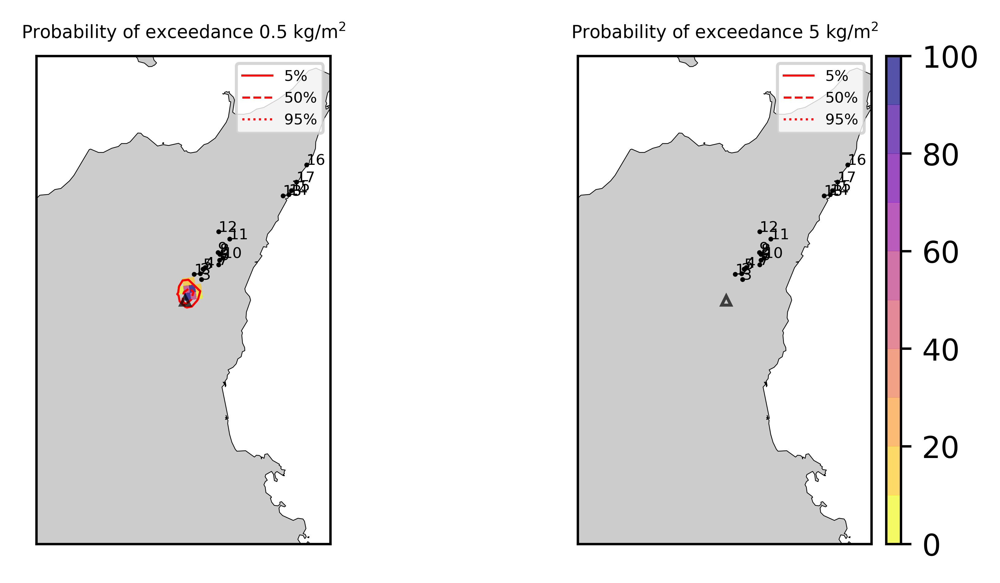
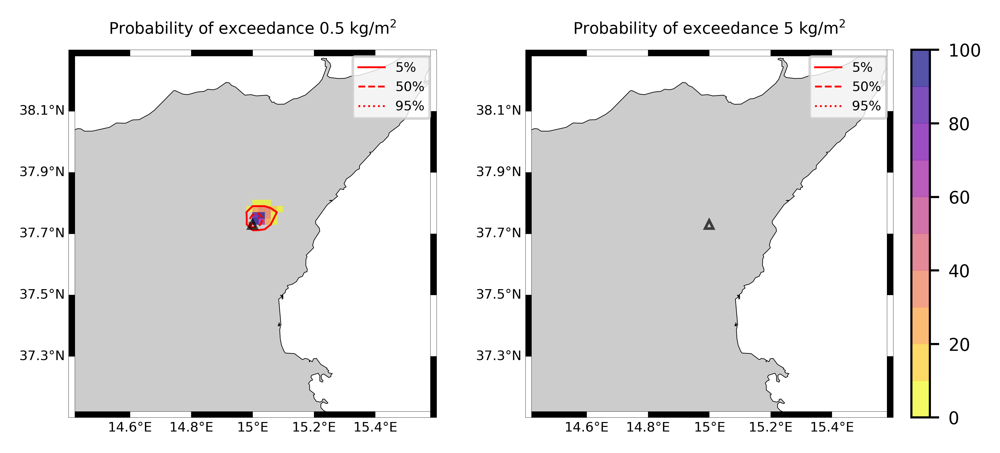
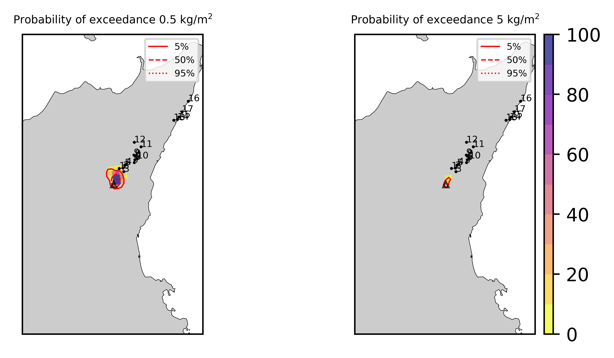

Forecast from VONA_20210304_0228Z
=================================

Contents
========

* [Forecast products](#forecast-products)
	* [Forecast at 2021-03-04 03:30 Z from RED VONA issued at 20210304_0228Z](#forecast-at-2021-03-04-0330-z-from-red-vona-issued-at-20210304_0228z)
	* [Forecast at 2021-03-04 04:30 Z from RED VONA issued at 20210304_0228Z](#forecast-at-2021-03-04-0430-z-from-red-vona-issued-at-20210304_0228z)
	* [Forecast at 2021-03-04 05:30 Z from RED VONA issued at 20210304_0228Z](#forecast-at-2021-03-04-0530-z-from-red-vona-issued-at-20210304_0228z)
	* [Forecast at 2021-03-04 08:30 Z from RED VONA issued at 20210304_0228Z](#forecast-at-2021-03-04-0830-z-from-red-vona-issued-at-20210304_0228z)

# Forecast products

## Forecast at 2021-03-04 03:30 Z from RED VONA issued at 20210304_0228Z
  

|Eruption start [Z]|Eruption end [Z]|Forecast time [Z]|Column height asl [m]|
| :--- | :--- | :--- | :--- |
|2021-03-04 02:30:00|Ongoing|2021-03-04 03:30:00|5000 ± 500 - from VONA|
  
  

|Percentile|MER [kg/s¹]|Mass air [kg]|Mass air nested dom. [kg]|Mass grd [kg]|Mass grd nested dom. [kg]|
| :--- | :--- | :--- | :--- | :--- | :--- |
|5th|6.64e+02|6.42e+05|6.42e+05|2.13e+06|2.13e+06|
|50th|2.33e+03|1.66e+06|1.66e+06|5.71e+06|5.72e+06|
|95th|1.06e+04|7.48e+06|7.47e+06|2.95e+07|2.95e+07|
  

### Ground Nested Domain 2021-03-04 03:30 Z
  
  
  
  
  
  
  
  
  
  
  
  
  
  
  
  
  
  

|Location|Ground load [kg/m²] 5th perc|Ground load [kg/m²] 50th perc|Ground load [kg/m²] 95th perc|
| :--- | :--- | :--- | :--- |
|Piano Provenzana (1)|0.00e+00|1.93e-04|4.27e-02|
|Bivio Provenzana-Linguaglossa (2)|0.00e+00|0.00e+00|1.78e-02|
|Cunetta pre-Citelli (3)|0.00e+00|1.85e-05|1.23e-01|
|Chalet (4)|0.00e+00|0.00e+00|1.38e-03|
|Ragabo (5)|0.00e+00|0.00e+00|3.36e-03|
|Scilio (6)|0.00e+00|0.00e+00|2.53e-04|
|Gambino vini (7)|0.00e+00|0.00e+00|1.44e-03|
|StazioneFce Linguaglossa (8)|0.00e+00|0.00e+00|2.49e-05|
|Linguaglossa Via Olivio Sozzi (9)|0.00e+00|0.00e+00|1.01e-05|
|Cim.Linguaglossa (10)|0.00e+00|0.00e+00|5.00e-05|
|Gole Bar (11)|0.00e+00|0.00e+00|0.00e+00|
|Francavilla - Orange (12)|0.00e+00|0.00e+00|0.00e+00|
|Roccalumera1 (13)|0.00e+00|0.00e+00|0.00e+00|
|Roccalumera2 (14)|0.00e+00|0.00e+00|0.00e+00|
|Nizza (15)|0.00e+00|0.00e+00|0.00e+00|
|Scaletta Zanclea (16)|0.00e+00|0.00e+00|0.00e+00|
|Alì (17)|0.00e+00|0.00e+00|0.00e+00|
  

### Atmosphere 2021-03-04 03:30 Z
  

## Forecast at 2021-03-04 04:30 Z from RED VONA issued at 20210304_0228Z
  

|Eruption start [Z]|Eruption end [Z]|Forecast time [Z]|Column height asl [m]|
| :--- | :--- | :--- | :--- |
|2021-03-04 02:30:00|Ongoing|2021-03-04 04:30:00|5000 ± 500 - from VONA|
  
  

|Percentile|MER [kg/s¹]|Mass air [kg]|Mass air nested dom. [kg]|Mass grd [kg]|Mass grd nested dom. [kg]|
| :--- | :--- | :--- | :--- | :--- | :--- |
|5th|1.79e+02|6.64e+05|6.64e+05|9.85e+06|9.86e+06|
|50th|3.37e+03|2.52e+06|2.52e+06|1.82e+07|1.82e+07|
|95th|1.07e+04|1.15e+07|1.15e+07|5.80e+07|5.80e+07|
  

### Ground Nested Domain 2021-03-04 04:30 Z
  
  
  
  
  
  
  
  
  
  
  
  
  
  
  
  
  
  

|Location|Ground load [kg/m²] 5th perc|Ground load [kg/m²] 50th perc|Ground load [kg/m²] 95th perc|
| :--- | :--- | :--- | :--- |
|Piano Provenzana (1)|9.40e-04|1.62e-02|8.45e-02|
|Bivio Provenzana-Linguaglossa (2)|0.00e+00|6.36e-03|8.58e-02|
|Cunetta pre-Citelli (3)|9.24e-06|9.61e-03|1.90e-01|
|Chalet (4)|0.00e+00|2.37e-04|1.82e-02|
|Ragabo (5)|0.00e+00|1.38e-03|2.67e-02|
|Scilio (6)|0.00e+00|0.00e+00|4.93e-03|
|Gambino vini (7)|0.00e+00|0.00e+00|1.65e-02|
|StazioneFce Linguaglossa (8)|0.00e+00|0.00e+00|3.45e-03|
|Linguaglossa Via Olivio Sozzi (9)|0.00e+00|0.00e+00|1.62e-03|
|Cim.Linguaglossa (10)|0.00e+00|0.00e+00|5.01e-03|
|Gole Bar (11)|0.00e+00|0.00e+00|4.38e-05|
|Francavilla - Orange (12)|0.00e+00|0.00e+00|1.43e-04|
|Roccalumera1 (13)|0.00e+00|0.00e+00|0.00e+00|
|Roccalumera2 (14)|0.00e+00|0.00e+00|0.00e+00|
|Nizza (15)|0.00e+00|0.00e+00|0.00e+00|
|Scaletta Zanclea (16)|0.00e+00|0.00e+00|0.00e+00|
|Alì (17)|0.00e+00|0.00e+00|0.00e+00|
  

### Atmosphere 2021-03-04 04:30 Z
  

## Forecast at 2021-03-04 05:30 Z from RED VONA issued at 20210304_0228Z
  

|Eruption start [Z]|Eruption end [Z]|Forecast time [Z]|Column height asl [m]|
| :--- | :--- | :--- | :--- |
|2021-03-04 02:30:00|Ongoing|2021-03-04 05:30:00|5000 ± 500 - from VONA|
  
  

|Percentile|MER [kg/s¹]|Mass air [kg]|Mass air nested dom. [kg]|Mass grd [kg]|Mass grd nested dom. [kg]|
| :--- | :--- | :--- | :--- | :--- | :--- |
|5th|6.16e+02|5.94e+05|5.94e+05|1.89e+07|1.89e+07|
|50th|3.45e+03|3.31e+06|3.31e+06|3.51e+07|3.51e+07|
|95th|8.95e+03|7.55e+06|7.54e+06|8.18e+07|8.17e+07|
  

### Ground Nested Domain 2021-03-04 05:30 Z
  
  
  
  
  
  
  
  
  
  
  
  
  
  
  
  
  
  

|Location|Ground load [kg/m²] 5th perc|Ground load [kg/m²] 50th perc|Ground load [kg/m²] 95th perc|
| :--- | :--- | :--- | :--- |
|Piano Provenzana (1)|2.71e-03|3.48e-02|1.13e-01|
|Bivio Provenzana-Linguaglossa (2)|6.14e-05|2.70e-02|1.08e-01|
|Cunetta pre-Citelli (3)|6.59e-05|4.52e-02|1.93e-01|
|Chalet (4)|0.00e+00|3.96e-03|4.31e-02|
|Ragabo (5)|3.79e-05|9.14e-03|4.63e-02|
|Scilio (6)|0.00e+00|3.55e-05|1.05e-02|
|Gambino vini (7)|0.00e+00|7.87e-06|1.81e-02|
|StazioneFce Linguaglossa (8)|0.00e+00|3.40e-05|3.86e-03|
|Linguaglossa Via Olivio Sozzi (9)|0.00e+00|2.60e-05|2.15e-03|
|Cim.Linguaglossa (10)|0.00e+00|2.40e-06|8.37e-03|
|Gole Bar (11)|0.00e+00|0.00e+00|4.38e-05|
|Francavilla - Orange (12)|0.00e+00|0.00e+00|3.58e-04|
|Roccalumera1 (13)|0.00e+00|0.00e+00|0.00e+00|
|Roccalumera2 (14)|0.00e+00|0.00e+00|0.00e+00|
|Nizza (15)|0.00e+00|0.00e+00|0.00e+00|
|Scaletta Zanclea (16)|0.00e+00|0.00e+00|0.00e+00|
|Alì (17)|0.00e+00|0.00e+00|0.00e+00|
  

### Atmosphere 2021-03-04 05:30 Z
  

## Forecast at 2021-03-04 08:30 Z from RED VONA issued at 20210304_0228Z
  

|Eruption start [Z]|Eruption end [Z]|Forecast time [Z]|Column height asl [m]|
| :--- | :--- | :--- | :--- |
|2021-03-04 02:30:00|Ongoing|2021-03-04 08:30:00|5000 ± 500 - from VONA|
  
  

|Percentile|MER [kg/s¹]|Mass air [kg]|Mass air nested dom. [kg]|Mass grd [kg]|Mass grd nested dom. [kg]|
| :--- | :--- | :--- | :--- | :--- | :--- |
|5th|2.13e+02|2.61e+05|2.61e+05|2.68e+07|2.68e+07|
|50th|1.90e+03|2.95e+06|2.94e+06|5.63e+07|5.63e+07|
|95th|9.53e+03|1.14e+07|1.14e+07|1.23e+08|1.23e+08|
  

### Ground Nested Domain 2021-03-04 08:30 Z
  
  
  
  
  
  
  
  
  
  
  
  
  
  
  
  
  
  

|Location|Ground load [kg/m²] 5th perc|Ground load [kg/m²] 50th perc|Ground load [kg/m²] 95th perc|
| :--- | :--- | :--- | :--- |
|Piano Provenzana (1)|2.94e-02|6.85e-02|1.31e-01|
|Bivio Provenzana-Linguaglossa (2)|6.63e-03|4.39e-02|1.16e-01|
|Cunetta pre-Citelli (3)|5.58e-03|9.14e-02|2.18e-01|
|Chalet (4)|5.97e-04|8.86e-03|7.66e-02|
|Ragabo (5)|2.67e-03|1.65e-02|8.07e-02|
|Scilio (6)|0.00e+00|7.34e-04|1.64e-02|
|Gambino vini (7)|0.00e+00|1.55e-03|3.11e-02|
|StazioneFce Linguaglossa (8)|3.14e-06|2.48e-04|9.51e-03|
|Linguaglossa Via Olivio Sozzi (9)|1.68e-06|3.26e-04|1.13e-02|
|Cim.Linguaglossa (10)|0.00e+00|2.36e-04|1.69e-02|
|Gole Bar (11)|0.00e+00|1.86e-06|5.24e-04|
|Francavilla - Orange (12)|0.00e+00|0.00e+00|9.25e-04|
|Roccalumera1 (13)|0.00e+00|0.00e+00|0.00e+00|
|Roccalumera2 (14)|0.00e+00|0.00e+00|0.00e+00|
|Nizza (15)|0.00e+00|0.00e+00|0.00e+00|
|Scaletta Zanclea (16)|0.00e+00|0.00e+00|0.00e+00|
|Alì (17)|0.00e+00|0.00e+00|0.00e+00|
  

### Atmosphere 2021-03-04 08:30 Z
  
  
Go to [Supplementary page](Supplementary_page.md)  
Go to [Main directory](https://github.com/federicapardini/Real_time_ash_forecast)