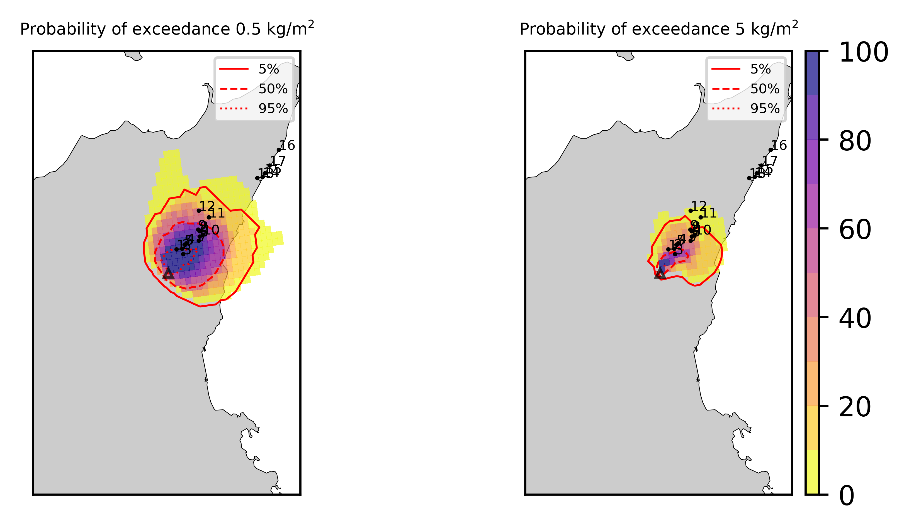
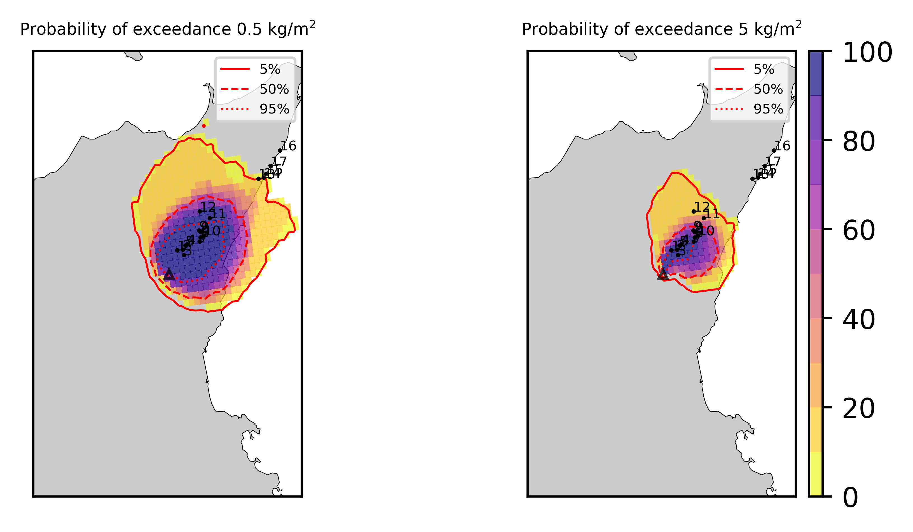
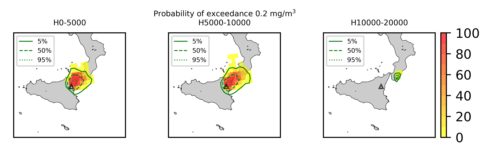
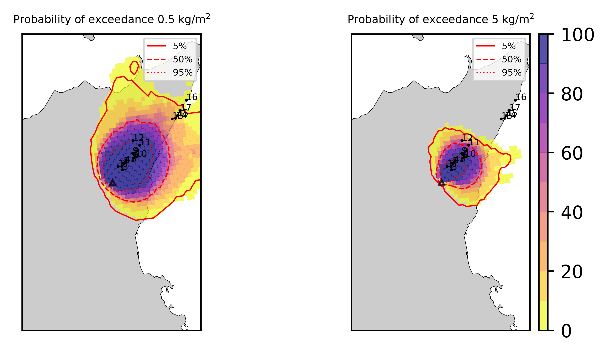
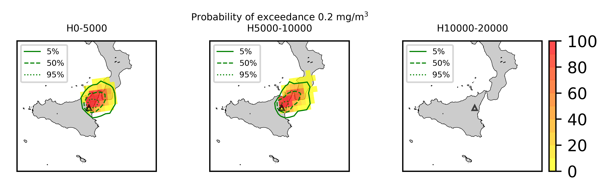
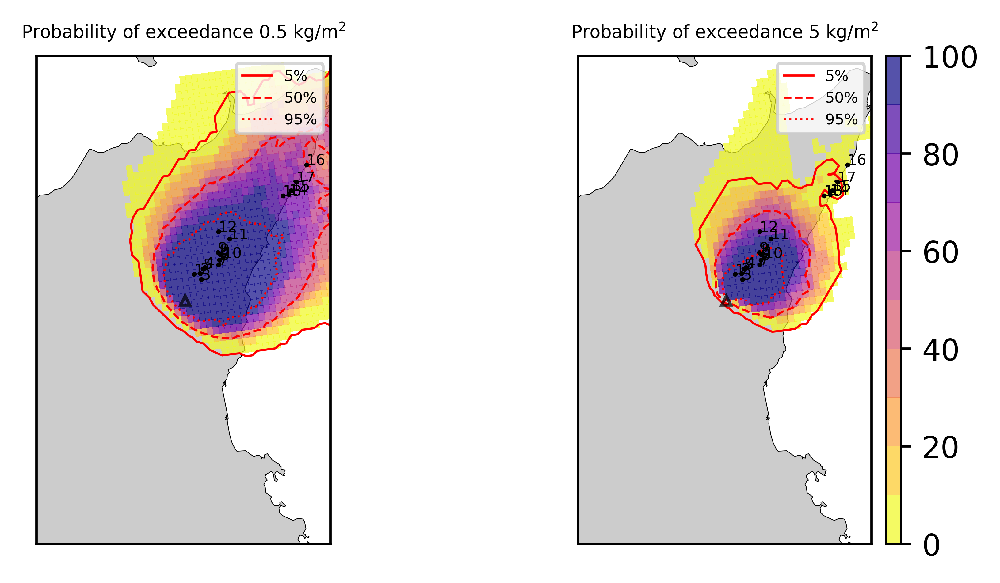
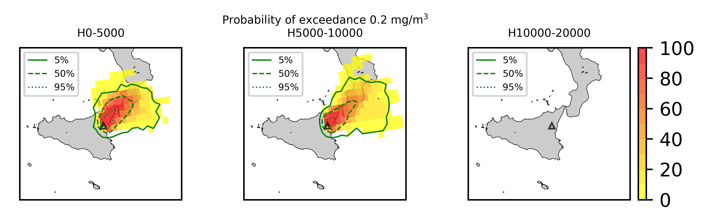
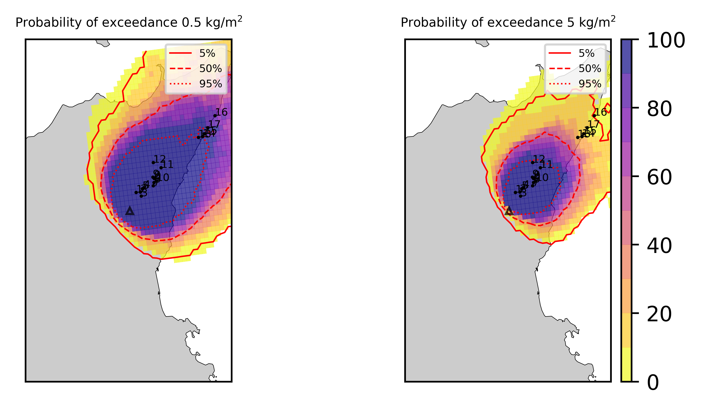
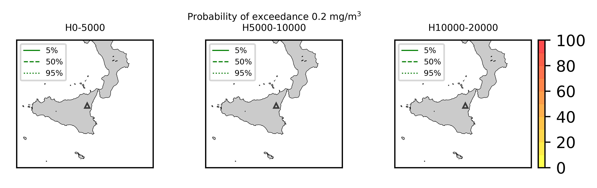

Forecast from VONA_20210304_0228Z
=================================

Contents
========

* [Forecast products](#forecast-products)
	* [Forecast at 2021-03-04 03:30 Z from RED VONA issued at 20210304_0228Z](#forecast-at-2021-03-04-0330-z-from-red-vona-issued-at-20210304_0228z)
	* [Forecast at 2021-03-04 04:30 Z from RED VONA issued at 20210304_0228Z](#forecast-at-2021-03-04-0430-z-from-red-vona-issued-at-20210304_0228z)
	* [Forecast at 2021-03-04 05:30 Z from RED VONA issued at 20210304_0228Z](#forecast-at-2021-03-04-0530-z-from-red-vona-issued-at-20210304_0228z)
	* [Forecast at 2021-03-04 08:30 Z from RED VONA issued at 20210304_0228Z](#forecast-at-2021-03-04-0830-z-from-red-vona-issued-at-20210304_0228z)
	* [Forecast at 2021-03-04 11:30 Z from RED VONA issued at 20210304_0228Z](#forecast-at-2021-03-04-1130-z-from-red-vona-issued-at-20210304_0228z)
	* [Forecast at 2021-03-04 14:30 Z from RED VONA issued at 20210304_0228Z](#forecast-at-2021-03-04-1430-z-from-red-vona-issued-at-20210304_0228z)
	* [Forecast at 2021-03-04 08:50 Z from RED VONA issued at 20210304_0751Z](#forecast-at-2021-03-04-0850-z-from-red-vona-issued-at-20210304_0751z)
	* [Forecast at 2021-03-04 09:00 Z from RED VONA issued at 20210304_0755Z](#forecast-at-2021-03-04-0900-z-from-red-vona-issued-at-20210304_0755z)
	* [Forecast at 2021-03-04 10:00 Z from RED VONA issued at 20210304_0755Z](#forecast-at-2021-03-04-1000-z-from-red-vona-issued-at-20210304_0755z)
	* [Forecast at 2021-03-04 11:00 Z from RED VONA issued at 20210304_0755Z](#forecast-at-2021-03-04-1100-z-from-red-vona-issued-at-20210304_0755z)
	* [Forecast at 2021-03-04 09:20 Z from RED VONA issued at 20210304_0817Z](#forecast-at-2021-03-04-0920-z-from-red-vona-issued-at-20210304_0817z)
	* [Forecast at 2021-03-04 10:20 Z from RED VONA issued at 20210304_0817Z](#forecast-at-2021-03-04-1020-z-from-red-vona-issued-at-20210304_0817z)
	* [Forecast at 2021-03-04 11:20 Z from RED VONA issued at 20210304_0817Z](#forecast-at-2021-03-04-1120-z-from-red-vona-issued-at-20210304_0817z)
	* [Forecast at 2021-03-04 14:20 Z from RED VONA issued at 20210304_0817Z](#forecast-at-2021-03-04-1420-z-from-red-vona-issued-at-20210304_0817z)
	* [Forecast at 2021-03-04 17:20 Z from RED VONA issued at 20210304_0817Z](#forecast-at-2021-03-04-1720-z-from-red-vona-issued-at-20210304_0817z)

# Forecast products

## Forecast at 2021-03-04 03:30 Z from RED VONA issued at 20210304_0228Z
  

|Eruption start [Z]|Eruption end [Z]|Forecast time [Z]|Column height asl [m]|
| :--- | :--- | :--- | :--- |
|2021-03-04 02:30:00|Ongoing|2021-03-04 03:30:00|5000 ± 500 - from VONA|
  
  

|Percentile|MER [kg/s¹]|Mass air [kg]|Mass air nested dom. [kg]|Mass grd [kg]|Mass grd nested dom. [kg]|
| :--- | :--- | :--- | :--- | :--- | :--- |
|5th|6.64e+02|6.42e+05|6.42e+05|2.13e+06|2.13e+06|
|50th|2.33e+03|1.66e+06|1.66e+06|5.71e+06|5.72e+06|
|95th|1.06e+04|7.48e+06|7.47e+06|2.95e+07|2.95e+07|
  

### Ground Nested Domain 2021-03-04 03:30 Z
  
  
  
  
  
  
  
  
  
  
  
  
  
  
  
  
  
  

|Location|Ground load [kg/m²] 5th perc|Ground load [kg/m²] 50th perc|Ground load [kg/m²] 95th perc|
| :--- | :--- | :--- | :--- |
|Piano Provenzana (1)|0.00e+00|1.93e-04|4.27e-02|
|Bivio Provenzana-Linguaglossa (2)|0.00e+00|0.00e+00|1.78e-02|
|Cunetta pre-Citelli (3)|0.00e+00|1.85e-05|1.23e-01|
|Chalet (4)|0.00e+00|0.00e+00|1.38e-03|
|Ragabo (5)|0.00e+00|0.00e+00|3.36e-03|
|Scilio (6)|0.00e+00|0.00e+00|2.53e-04|
|Gambino vini (7)|0.00e+00|0.00e+00|1.44e-03|
|StazioneFce Linguaglossa (8)|0.00e+00|0.00e+00|2.49e-05|
|Linguaglossa Via Olivio Sozzi (9)|0.00e+00|0.00e+00|1.01e-05|
|Cim.Linguaglossa (10)|0.00e+00|0.00e+00|5.00e-05|
|Gole Bar (11)|0.00e+00|0.00e+00|0.00e+00|
|Francavilla - Orange (12)|0.00e+00|0.00e+00|0.00e+00|
|Roccalumera1 (13)|0.00e+00|0.00e+00|0.00e+00|
|Roccalumera2 (14)|0.00e+00|0.00e+00|0.00e+00|
|Nizza (15)|0.00e+00|0.00e+00|0.00e+00|
|Scaletta Zanclea (16)|0.00e+00|0.00e+00|0.00e+00|
|Alì (17)|0.00e+00|0.00e+00|0.00e+00|
  

### Atmosphere 2021-03-04 03:30 Z
  

## Forecast at 2021-03-04 04:30 Z from RED VONA issued at 20210304_0228Z
  

|Eruption start [Z]|Eruption end [Z]|Forecast time [Z]|Column height asl [m]|
| :--- | :--- | :--- | :--- |
|2021-03-04 02:30:00|Ongoing|2021-03-04 04:30:00|5000 ± 500 - from VONA|
  
  

|Percentile|MER [kg/s¹]|Mass air [kg]|Mass air nested dom. [kg]|Mass grd [kg]|Mass grd nested dom. [kg]|
| :--- | :--- | :--- | :--- | :--- | :--- |
|5th|1.79e+02|6.64e+05|6.64e+05|9.85e+06|9.86e+06|
|50th|3.37e+03|2.52e+06|2.52e+06|1.82e+07|1.82e+07|
|95th|1.07e+04|1.15e+07|1.15e+07|5.80e+07|5.80e+07|
  

### Ground Nested Domain 2021-03-04 04:30 Z
  
  
  
  
  
  
  
  
  
  
  
  
  
  
  
  
  
  

|Location|Ground load [kg/m²] 5th perc|Ground load [kg/m²] 50th perc|Ground load [kg/m²] 95th perc|
| :--- | :--- | :--- | :--- |
|Piano Provenzana (1)|9.40e-04|1.62e-02|8.45e-02|
|Bivio Provenzana-Linguaglossa (2)|0.00e+00|6.36e-03|8.58e-02|
|Cunetta pre-Citelli (3)|9.24e-06|9.61e-03|1.90e-01|
|Chalet (4)|0.00e+00|2.37e-04|1.82e-02|
|Ragabo (5)|0.00e+00|1.38e-03|2.67e-02|
|Scilio (6)|0.00e+00|0.00e+00|4.93e-03|
|Gambino vini (7)|0.00e+00|0.00e+00|1.65e-02|
|StazioneFce Linguaglossa (8)|0.00e+00|0.00e+00|3.45e-03|
|Linguaglossa Via Olivio Sozzi (9)|0.00e+00|0.00e+00|1.62e-03|
|Cim.Linguaglossa (10)|0.00e+00|0.00e+00|5.01e-03|
|Gole Bar (11)|0.00e+00|0.00e+00|4.38e-05|
|Francavilla - Orange (12)|0.00e+00|0.00e+00|1.43e-04|
|Roccalumera1 (13)|0.00e+00|0.00e+00|0.00e+00|
|Roccalumera2 (14)|0.00e+00|0.00e+00|0.00e+00|
|Nizza (15)|0.00e+00|0.00e+00|0.00e+00|
|Scaletta Zanclea (16)|0.00e+00|0.00e+00|0.00e+00|
|Alì (17)|0.00e+00|0.00e+00|0.00e+00|
  

### Atmosphere 2021-03-04 04:30 Z
  

## Forecast at 2021-03-04 05:30 Z from RED VONA issued at 20210304_0228Z
  

|Eruption start [Z]|Eruption end [Z]|Forecast time [Z]|Column height asl [m]|
| :--- | :--- | :--- | :--- |
|2021-03-04 02:30:00|Ongoing|2021-03-04 05:30:00|5000 ± 500 - from VONA|
  
  

|Percentile|MER [kg/s¹]|Mass air [kg]|Mass air nested dom. [kg]|Mass grd [kg]|Mass grd nested dom. [kg]|
| :--- | :--- | :--- | :--- | :--- | :--- |
|5th|6.16e+02|5.94e+05|5.94e+05|1.89e+07|1.89e+07|
|50th|3.45e+03|3.31e+06|3.31e+06|3.51e+07|3.51e+07|
|95th|8.95e+03|7.55e+06|7.54e+06|8.18e+07|8.17e+07|
  

### Ground Nested Domain 2021-03-04 05:30 Z
  
  
  
  
  
  
  
  
  
  
  
  
  
  
  
  
  
  

|Location|Ground load [kg/m²] 5th perc|Ground load [kg/m²] 50th perc|Ground load [kg/m²] 95th perc|
| :--- | :--- | :--- | :--- |
|Piano Provenzana (1)|2.71e-03|3.48e-02|1.13e-01|
|Bivio Provenzana-Linguaglossa (2)|6.14e-05|2.70e-02|1.08e-01|
|Cunetta pre-Citelli (3)|6.59e-05|4.52e-02|1.93e-01|
|Chalet (4)|0.00e+00|3.96e-03|4.31e-02|
|Ragabo (5)|3.79e-05|9.14e-03|4.63e-02|
|Scilio (6)|0.00e+00|3.55e-05|1.05e-02|
|Gambino vini (7)|0.00e+00|7.87e-06|1.81e-02|
|StazioneFce Linguaglossa (8)|0.00e+00|3.40e-05|3.86e-03|
|Linguaglossa Via Olivio Sozzi (9)|0.00e+00|2.60e-05|2.15e-03|
|Cim.Linguaglossa (10)|0.00e+00|2.40e-06|8.37e-03|
|Gole Bar (11)|0.00e+00|0.00e+00|4.38e-05|
|Francavilla - Orange (12)|0.00e+00|0.00e+00|3.58e-04|
|Roccalumera1 (13)|0.00e+00|0.00e+00|0.00e+00|
|Roccalumera2 (14)|0.00e+00|0.00e+00|0.00e+00|
|Nizza (15)|0.00e+00|0.00e+00|0.00e+00|
|Scaletta Zanclea (16)|0.00e+00|0.00e+00|0.00e+00|
|Alì (17)|0.00e+00|0.00e+00|0.00e+00|
  

### Atmosphere 2021-03-04 05:30 Z
  

## Forecast at 2021-03-04 08:30 Z from RED VONA issued at 20210304_0228Z
  

|Eruption start [Z]|Eruption end [Z]|Forecast time [Z]|Column height asl [m]|
| :--- | :--- | :--- | :--- |
|2021-03-04 02:30:00|Ongoing|2021-03-04 08:30:00|5000 ± 500 - from VONA|
  
  

|Percentile|MER [kg/s¹]|Mass air [kg]|Mass air nested dom. [kg]|Mass grd [kg]|Mass grd nested dom. [kg]|
| :--- | :--- | :--- | :--- | :--- | :--- |
|5th|2.13e+02|2.61e+05|2.61e+05|2.68e+07|2.68e+07|
|50th|1.90e+03|2.95e+06|2.94e+06|5.63e+07|5.63e+07|
|95th|9.53e+03|1.14e+07|1.14e+07|1.23e+08|1.23e+08|
  

### Ground Nested Domain 2021-03-04 08:30 Z
  
  
  
  
  
  
  
  
  
  
  
  
  
  
  
  
  
  

|Location|Ground load [kg/m²] 5th perc|Ground load [kg/m²] 50th perc|Ground load [kg/m²] 95th perc|
| :--- | :--- | :--- | :--- |
|Piano Provenzana (1)|2.94e-02|6.85e-02|1.31e-01|
|Bivio Provenzana-Linguaglossa (2)|6.63e-03|4.39e-02|1.16e-01|
|Cunetta pre-Citelli (3)|5.58e-03|9.14e-02|2.18e-01|
|Chalet (4)|5.97e-04|8.86e-03|7.66e-02|
|Ragabo (5)|2.67e-03|1.65e-02|8.07e-02|
|Scilio (6)|0.00e+00|7.34e-04|1.64e-02|
|Gambino vini (7)|0.00e+00|1.55e-03|3.11e-02|
|StazioneFce Linguaglossa (8)|3.14e-06|2.48e-04|9.51e-03|
|Linguaglossa Via Olivio Sozzi (9)|1.68e-06|3.26e-04|1.13e-02|
|Cim.Linguaglossa (10)|0.00e+00|2.36e-04|1.69e-02|
|Gole Bar (11)|0.00e+00|1.86e-06|5.24e-04|
|Francavilla - Orange (12)|0.00e+00|0.00e+00|9.25e-04|
|Roccalumera1 (13)|0.00e+00|0.00e+00|0.00e+00|
|Roccalumera2 (14)|0.00e+00|0.00e+00|0.00e+00|
|Nizza (15)|0.00e+00|0.00e+00|0.00e+00|
|Scaletta Zanclea (16)|0.00e+00|0.00e+00|0.00e+00|
|Alì (17)|0.00e+00|0.00e+00|0.00e+00|
  

### Atmosphere 2021-03-04 08:30 Z
  

## Forecast at 2021-03-04 11:30 Z from RED VONA issued at 20210304_0228Z
  

|Eruption start [Z]|Eruption end [Z]|Forecast time [Z]|Column height asl [m]|
| :--- | :--- | :--- | :--- |
|2021-03-04 02:30:00|Ongoing|2021-03-04 11:30:00|5000 ± 500 - from VONA|
  
  

|Percentile|MER [kg/s¹]|Mass air [kg]|Mass air nested dom. [kg]|Mass grd [kg]|Mass grd nested dom. [kg]|
| :--- | :--- | :--- | :--- | :--- | :--- |
|5th|5.17e+02|1.60e+06|1.60e+06|3.91e+07|3.91e+07|
|50th|1.91e+03|5.16e+06|5.15e+06|8.44e+07|8.44e+07|
|95th|8.53e+03|1.33e+07|1.33e+07|1.81e+08|1.81e+08|
  

### Ground Nested Domain 2021-03-04 11:30 Z
  
  
  
  
  
  
  
  
  
  
  
  
  
  
  
  
  
  

|Location|Ground load [kg/m²] 5th perc|Ground load [kg/m²] 50th perc|Ground load [kg/m²] 95th perc|
| :--- | :--- | :--- | :--- |
|Piano Provenzana (1)|3.39e-02|7.00e-02|2.91e-01|
|Bivio Provenzana-Linguaglossa (2)|7.84e-03|5.06e-02|1.62e-01|
|Cunetta pre-Citelli (3)|1.93e-02|1.08e-01|3.51e-01|
|Chalet (4)|3.00e-03|1.85e-02|9.16e-02|
|Ragabo (5)|6.88e-03|2.75e-02|9.92e-02|
|Scilio (6)|1.80e-05|4.65e-03|2.46e-02|
|Gambino vini (7)|7.87e-06|3.92e-03|3.12e-02|
|StazioneFce Linguaglossa (8)|1.36e-05|3.10e-03|1.07e-02|
|Linguaglossa Via Olivio Sozzi (9)|2.67e-05|3.23e-03|1.17e-02|
|Cim.Linguaglossa (10)|5.34e-07|3.07e-03|1.72e-02|
|Gole Bar (11)|0.00e+00|4.41e-05|2.94e-03|
|Francavilla - Orange (12)|0.00e+00|3.58e-04|3.43e-03|
|Roccalumera1 (13)|0.00e+00|0.00e+00|0.00e+00|
|Roccalumera2 (14)|0.00e+00|0.00e+00|0.00e+00|
|Nizza (15)|0.00e+00|0.00e+00|0.00e+00|
|Scaletta Zanclea (16)|0.00e+00|0.00e+00|0.00e+00|
|Alì (17)|0.00e+00|0.00e+00|1.34e-05|
  

### Atmosphere 2021-03-04 11:30 Z
  

## Forecast at 2021-03-04 14:30 Z from RED VONA issued at 20210304_0228Z
  

|Eruption start [Z]|Eruption end [Z]|Forecast time [Z]|Column height asl [m]|
| :--- | :--- | :--- | :--- |
|2021-03-04 02:30:00|Ongoing|2021-03-04 14:30:00|5000 ± 500 - from VONA|
  
  

|Percentile|MER [kg/s¹]|Mass air [kg]|Mass air nested dom. [kg]|Mass grd [kg]|Mass grd nested dom. [kg]|
| :--- | :--- | :--- | :--- | :--- | :--- |
|5th|7.78e+02|3.40e+06|3.15e+06|7.13e+07|7.14e+07|
|50th|4.90e+03|8.12e+06|8.02e+06|1.52e+08|1.52e+08|
|95th|1.66e+04|4.00e+07|3.99e+07|2.54e+08|2.54e+08|
  

### Ground Nested Domain 2021-03-04 14:30 Z
  
  
  
  
  
  
  
  
  
  
  
  
  
  
  
  
  
  

|Location|Ground load [kg/m²] 5th perc|Ground load [kg/m²] 50th perc|Ground load [kg/m²] 95th perc|
| :--- | :--- | :--- | :--- |
|Piano Provenzana (1)|4.27e-02|1.93e-01|4.82e-01|
|Bivio Provenzana-Linguaglossa (2)|9.02e-03|9.07e-02|7.31e-01|
|Cunetta pre-Citelli (3)|2.04e-02|2.19e-01|8.71e-01|
|Chalet (4)|7.47e-03|6.74e-02|2.02e-01|
|Ragabo (5)|7.99e-03|6.06e-02|2.95e-01|
|Scilio (6)|5.89e-04|1.46e-02|3.95e-02|
|Gambino vini (7)|7.61e-04|1.27e-02|6.96e-02|
|StazioneFce Linguaglossa (8)|8.03e-05|9.89e-03|5.91e-02|
|Linguaglossa Via Olivio Sozzi (9)|6.43e-05|1.12e-02|5.69e-02|
|Cim.Linguaglossa (10)|2.91e-05|1.04e-02|2.71e-02|
|Gole Bar (11)|1.86e-06|2.83e-03|1.31e-02|
|Francavilla - Orange (12)|1.50e-05|1.59e-03|1.74e-02|
|Roccalumera1 (13)|0.00e+00|0.00e+00|7.87e-05|
|Roccalumera2 (14)|0.00e+00|0.00e+00|2.15e-04|
|Nizza (15)|0.00e+00|0.00e+00|2.84e-04|
|Scaletta Zanclea (16)|0.00e+00|0.00e+00|6.79e-05|
|Alì (17)|0.00e+00|0.00e+00|3.63e-04|
  

### Atmosphere 2021-03-04 14:30 Z
  

## Forecast at 2021-03-04 08:50 Z from RED VONA issued at 20210304_0751Z
  

|Eruption start [Z]|Eruption end [Z]|Forecast time [Z]|Column height asl [m]|
| :--- | :--- | :--- | :--- |
|2021-03-04 02:30:00|Ongoing|2021-03-04 08:50:00|6000 ± 500 - from VONA|
  
  

|Percentile|MER [kg/s¹]|Mass air [kg]|Mass air nested dom. [kg]|Mass grd [kg]|Mass grd nested dom. [kg]|
| :--- | :--- | :--- | :--- | :--- | :--- |
|5th|1.56e+03|1.68e+06|1.68e+06|4.14e+07|4.14e+07|
|50th|7.62e+03|7.04e+06|7.03e+06|7.73e+07|7.73e+07|
|95th|1.45e+04|1.60e+07|1.60e+07|1.34e+08|1.34e+08|
  

### Ground Nested Domain 2021-03-04 08:50 Z
  
  
  
  
  
  
  
  
  
  
  
  
  
  
  
  
  
  

|Location|Ground load [kg/m²] 5th perc|Ground load [kg/m²] 50th perc|Ground load [kg/m²] 95th perc|
| :--- | :--- | :--- | :--- |
|Piano Provenzana (1)|2.93e-02|7.28e-02|2.71e-01|
|Bivio Provenzana-Linguaglossa (2)|6.67e-03|4.95e-02|1.65e-01|
|Cunetta pre-Citelli (3)|5.58e-03|9.21e-02|2.79e-01|
|Chalet (4)|5.97e-04|1.14e-02|7.96e-02|
|Ragabo (5)|2.67e-03|1.65e-02|8.71e-02|
|Scilio (6)|0.00e+00|1.09e-03|1.98e-02|
|Gambino vini (7)|0.00e+00|1.95e-03|4.29e-02|
|StazioneFce Linguaglossa (8)|3.14e-06|2.42e-04|6.46e-03|
|Linguaglossa Via Olivio Sozzi (9)|1.68e-06|3.26e-04|6.19e-03|
|Cim.Linguaglossa (10)|0.00e+00|2.61e-04|1.75e-02|
|Gole Bar (11)|0.00e+00|4.31e-06|1.65e-03|
|Francavilla - Orange (12)|0.00e+00|0.00e+00|6.24e-03|
|Roccalumera1 (13)|0.00e+00|0.00e+00|0.00e+00|
|Roccalumera2 (14)|0.00e+00|0.00e+00|0.00e+00|
|Nizza (15)|0.00e+00|0.00e+00|0.00e+00|
|Scaletta Zanclea (16)|0.00e+00|0.00e+00|0.00e+00|
|Alì (17)|0.00e+00|0.00e+00|0.00e+00|
  

### Atmosphere 2021-03-04 08:50 Z
  

## Forecast at 2021-03-04 09:00 Z from RED VONA issued at 20210304_0755Z
  

|Eruption start [Z]|Eruption end [Z]|Forecast time [Z]|Column height asl [m]|
| :--- | :--- | :--- | :--- |
|2021-03-04 02:30:00|Ongoing|2021-03-04 09:00:00|6500 ± 500 - from VONA|
  
  

|Percentile|MER [kg/s¹]|Mass air [kg]|Mass air nested dom. [kg]|Mass grd [kg]|Mass grd nested dom. [kg]|
| :--- | :--- | :--- | :--- | :--- | :--- |
|5th|2.78e+03|5.56e+06|5.56e+06|4.77e+07|4.77e+07|
|50th|8.91e+03|8.25e+06|8.25e+06|8.86e+07|8.87e+07|
|95th|2.77e+04|3.81e+07|3.81e+07|1.37e+08|1.37e+08|
  

### Ground Nested Domain 2021-03-04 09:00 Z
  
  
  
  
  
  
  
  
  
  
  
  
  
  
  
  
  
  

|Location|Ground load [kg/m²] 5th perc|Ground load [kg/m²] 50th perc|Ground load [kg/m²] 95th perc|
| :--- | :--- | :--- | :--- |
|Piano Provenzana (1)|3.34e-02|1.05e-01|2.37e-01|
|Bivio Provenzana-Linguaglossa (2)|1.41e-02|5.25e-02|1.76e-01|
|Cunetta pre-Citelli (3)|1.82e-02|1.02e-01|3.68e-01|
|Chalet (4)|2.38e-03|1.20e-02|9.88e-02|
|Ragabo (5)|4.00e-03|2.22e-02|1.05e-01|
|Scilio (6)|0.00e+00|1.75e-03|2.49e-02|
|Gambino vini (7)|0.00e+00|3.18e-03|5.16e-02|
|StazioneFce Linguaglossa (8)|3.14e-06|2.42e-04|8.56e-03|
|Linguaglossa Via Olivio Sozzi (9)|1.68e-06|3.49e-04|6.59e-03|
|Cim.Linguaglossa (10)|0.00e+00|2.70e-04|1.62e-02|
|Gole Bar (11)|0.00e+00|1.86e-06|3.41e-03|
|Francavilla - Orange (12)|0.00e+00|6.93e-05|5.15e-03|
|Roccalumera1 (13)|0.00e+00|0.00e+00|0.00e+00|
|Roccalumera2 (14)|0.00e+00|0.00e+00|0.00e+00|
|Nizza (15)|0.00e+00|0.00e+00|0.00e+00|
|Scaletta Zanclea (16)|0.00e+00|0.00e+00|0.00e+00|
|Alì (17)|0.00e+00|0.00e+00|0.00e+00|
  

### Atmosphere 2021-03-04 09:00 Z
  

## Forecast at 2021-03-04 10:00 Z from RED VONA issued at 20210304_0755Z
  

|Eruption start [Z]|Eruption end [Z]|Forecast time [Z]|Column height asl [m]|
| :--- | :--- | :--- | :--- |
|2021-03-04 02:30:00|Ongoing|2021-03-04 10:00:00|6500 ± 500 - from VONA|
  
  

|Percentile|MER [kg/s¹]|Mass air [kg]|Mass air nested dom. [kg]|Mass grd [kg]|Mass grd nested dom. [kg]|
| :--- | :--- | :--- | :--- | :--- | :--- |
|5th|5.29e+03|5.01e+06|5.00e+06|8.86e+07|8.86e+07|
|50th|1.33e+04|8.63e+06|8.63e+06|1.23e+08|1.23e+08|
|95th|3.01e+04|3.26e+07|3.27e+07|1.88e+08|1.88e+08|
  

### Ground Nested Domain 2021-03-04 10:00 Z
  
  
  
  
  
  
  
  
  
  
  
  
  
  
  
  
  
  

|Location|Ground load [kg/m²] 5th perc|Ground load [kg/m²] 50th perc|Ground load [kg/m²] 95th perc|
| :--- | :--- | :--- | :--- |
|Piano Provenzana (1)|4.17e-02|1.14e-01|9.41e-01|
|Bivio Provenzana-Linguaglossa (2)|1.44e-02|7.98e-02|6.49e-01|
|Cunetta pre-Citelli (3)|2.17e-02|1.32e-01|7.71e-01|
|Chalet (4)|3.54e-03|1.64e-02|1.87e-01|
|Ragabo (5)|6.88e-03|3.13e-02|2.77e-01|
|Scilio (6)|2.67e-06|2.12e-03|2.59e-02|
|Gambino vini (7)|0.00e+00|3.72e-03|5.36e-02|
|StazioneFce Linguaglossa (8)|3.14e-06|3.45e-04|8.99e-03|
|Linguaglossa Via Olivio Sozzi (9)|1.68e-06|3.49e-04|6.59e-03|
|Cim.Linguaglossa (10)|0.00e+00|3.23e-04|1.70e-02|
|Gole Bar (11)|0.00e+00|4.31e-06|3.41e-03|
|Francavilla - Orange (12)|0.00e+00|6.93e-05|5.15e-03|
|Roccalumera1 (13)|0.00e+00|0.00e+00|0.00e+00|
|Roccalumera2 (14)|0.00e+00|0.00e+00|0.00e+00|
|Nizza (15)|0.00e+00|0.00e+00|0.00e+00|
|Scaletta Zanclea (16)|0.00e+00|0.00e+00|0.00e+00|
|Alì (17)|0.00e+00|0.00e+00|0.00e+00|
  

### Atmosphere 2021-03-04 10:00 Z
  

## Forecast at 2021-03-04 11:00 Z from RED VONA issued at 20210304_0755Z
  

|Eruption start [Z]|Eruption end [Z]|Forecast time [Z]|Column height asl [m]|
| :--- | :--- | :--- | :--- |
|2021-03-04 02:30:00|Ongoing|2021-03-04 11:00:00|6500 ± 500 - from VONA|
  
  

|Percentile|MER [kg/s¹]|Mass air [kg]|Mass air nested dom. [kg]|Mass grd [kg]|Mass grd nested dom. [kg]|
| :--- | :--- | :--- | :--- | :--- | :--- |
|5th|3.46e+03|2.60e+06|2.60e+06|1.16e+08|1.16e+08|
|50th|1.49e+04|1.22e+07|1.21e+07|1.65e+08|1.65e+08|
|95th|3.51e+04|3.84e+07|3.84e+07|2.61e+08|2.61e+08|
  

### Ground Nested Domain 2021-03-04 11:00 Z
  
  
  
  
  
  
  
  
  
  
  
  
  
  
  
  
  
  

|Location|Ground load [kg/m²] 5th perc|Ground load [kg/m²] 50th perc|Ground load [kg/m²] 95th perc|
| :--- | :--- | :--- | :--- |
|Piano Provenzana (1)|6.16e-02|1.57e-01|1.05e+00|
|Bivio Provenzana-Linguaglossa (2)|4.22e-02|1.31e-01|6.54e-01|
|Cunetta pre-Citelli (3)|8.32e-02|3.58e-01|1.08e+00|
|Chalet (4)|5.25e-03|4.80e-02|1.87e-01|
|Ragabo (5)|1.76e-02|4.98e-02|3.00e-01|
|Scilio (6)|3.24e-06|4.16e-03|2.59e-02|
|Gambino vini (7)|0.00e+00|5.33e-03|5.52e-02|
|StazioneFce Linguaglossa (8)|4.15e-06|2.25e-03|8.99e-03|
|Linguaglossa Via Olivio Sozzi (9)|8.35e-06|1.56e-03|1.26e-02|
|Cim.Linguaglossa (10)|0.00e+00|2.27e-03|1.70e-02|
|Gole Bar (11)|0.00e+00|1.49e-05|3.41e-03|
|Francavilla - Orange (12)|0.00e+00|9.33e-05|5.15e-03|
|Roccalumera1 (13)|0.00e+00|0.00e+00|0.00e+00|
|Roccalumera2 (14)|0.00e+00|0.00e+00|0.00e+00|
|Nizza (15)|0.00e+00|0.00e+00|0.00e+00|
|Scaletta Zanclea (16)|0.00e+00|0.00e+00|0.00e+00|
|Alì (17)|0.00e+00|0.00e+00|0.00e+00|
  

### Atmosphere 2021-03-04 11:00 Z
  

## Forecast at 2021-03-04 09:20 Z from RED VONA issued at 20210304_0817Z
  

|Eruption start [Z]|Eruption end [Z]|Forecast time [Z]|Column height asl [m]|
| :--- | :--- | :--- | :--- |
|2021-03-04 02:30:00|Ongoing|2021-03-04 09:20:00|11000 ± 500 - from VONA|
  
  

|Percentile|MER [kg/s¹]|Mass air [kg]|Mass air nested dom. [kg]|Mass grd [kg]|Mass grd nested dom. [kg]|
| :--- | :--- | :--- | :--- | :--- | :--- |
|5th|2.34e+05|3.96e+08|3.95e+08|5.50e+08|5.49e+08|
|50th|9.37e+05|1.33e+09|1.33e+09|1.95e+09|1.95e+09|
|95th|2.63e+06|3.72e+09|3.68e+09|4.67e+09|4.66e+09|
  

### Ground Nested Domain 2021-03-04 09:20 Z
  
  
  
  
  
  
  
  
  
  
  
  
  
  
  
  
  
  

|Location|Ground load [kg/m²] 5th perc|Ground load [kg/m²] 50th perc|Ground load [kg/m²] 95th perc|
| :--- | :--- | :--- | :--- |
|Piano Provenzana (1)|8.83e-01|3.06e+00|9.80e+00|
|Bivio Provenzana-Linguaglossa (2)|1.48e+00|4.78e+00|1.20e+01|
|Cunetta pre-Citelli (3)|2.68e+00|6.02e+00|1.14e+01|
|Chalet (4)|1.07e+00|3.73e+00|1.27e+01|
|Ragabo (5)|1.10e+00|3.80e+00|1.24e+01|
|Scilio (6)|2.53e-01|2.54e+00|8.20e+00|
|Gambino vini (7)|4.00e-01|2.77e+00|1.08e+01|
|StazioneFce Linguaglossa (8)|1.42e-01|2.09e+00|6.22e+00|
|Linguaglossa Via Olivio Sozzi (9)|1.37e-01|1.66e+00|6.46e+00|
|Cim.Linguaglossa (10)|1.59e-01|1.91e+00|6.26e+00|
|Gole Bar (11)|1.39e-02|3.03e-01|1.80e+00|
|Francavilla - Orange (12)|8.73e-03|8.53e-02|1.97e+00|
|Roccalumera1 (13)|0.00e+00|0.00e+00|8.15e-05|
|Roccalumera2 (14)|0.00e+00|0.00e+00|2.09e-06|
|Nizza (15)|0.00e+00|0.00e+00|0.00e+00|
|Scaletta Zanclea (16)|0.00e+00|0.00e+00|0.00e+00|
|Alì (17)|0.00e+00|0.00e+00|0.00e+00|
  

### Atmosphere 2021-03-04 09:20 Z
  

## Forecast at 2021-03-04 10:20 Z from RED VONA issued at 20210304_0817Z
  

|Eruption start [Z]|Eruption end [Z]|Forecast time [Z]|Column height asl [m]|
| :--- | :--- | :--- | :--- |
|2021-03-04 02:30:00|Ongoing|2021-03-04 10:20:00|11000 ± 500 - from VONA|
  
  

|Percentile|MER [kg/s¹]|Mass air [kg]|Mass air nested dom. [kg]|Mass grd [kg]|Mass grd nested dom. [kg]|
| :--- | :--- | :--- | :--- | :--- | :--- |
|5th|2.81e+05|6.23e+08|6.21e+08|1.72e+09|1.71e+09|
|50th|1.19e+06|2.00e+09|1.97e+09|4.74e+09|4.73e+09|
|95th|2.58e+06|4.90e+09|4.41e+09|9.85e+09|9.82e+09|
  

### Ground Nested Domain 2021-03-04 10:20 Z
  
  
  
  
  
  
  
  
  
  
  
  
  
  
  
  
  
  

|Location|Ground load [kg/m²] 5th perc|Ground load [kg/m²] 50th perc|Ground load [kg/m²] 95th perc|
| :--- | :--- | :--- | :--- |
|Piano Provenzana (1)|3.45e+00|1.12e+01|1.70e+01|
|Bivio Provenzana-Linguaglossa (2)|5.63e+00|1.29e+01|1.72e+01|
|Cunetta pre-Citelli (3)|7.53e+00|1.40e+01|2.23e+01|
|Chalet (4)|4.02e+00|1.25e+01|2.18e+01|
|Ragabo (5)|4.20e+00|1.24e+01|2.02e+01|
|Scilio (6)|2.27e+00|9.13e+00|1.84e+01|
|Gambino vini (7)|2.94e+00|1.21e+01|1.99e+01|
|StazioneFce Linguaglossa (8)|1.56e+00|7.20e+00|1.65e+01|
|Linguaglossa Via Olivio Sozzi (9)|1.59e+00|7.86e+00|1.72e+01|
|Cim.Linguaglossa (10)|1.58e+00|8.07e+00|1.53e+01|
|Gole Bar (11)|2.91e-01|2.26e+00|6.22e+00|
|Francavilla - Orange (12)|1.77e-01|2.07e+00|6.11e+00|
|Roccalumera1 (13)|0.00e+00|8.37e-03|5.97e-01|
|Roccalumera2 (14)|0.00e+00|3.84e-03|5.48e-01|
|Nizza (15)|0.00e+00|2.11e-03|3.50e-01|
|Scaletta Zanclea (16)|0.00e+00|0.00e+00|1.65e-02|
|Alì (17)|0.00e+00|2.12e-04|1.45e-01|
  

### Atmosphere 2021-03-04 10:20 Z
  

## Forecast at 2021-03-04 11:20 Z from RED VONA issued at 20210304_0817Z
  

|Eruption start [Z]|Eruption end [Z]|Forecast time [Z]|Column height asl [m]|
| :--- | :--- | :--- | :--- |
|2021-03-04 02:30:00|Ongoing|2021-03-04 11:20:00|11000 ± 500 - from VONA|
  
  

|Percentile|MER [kg/s¹]|Mass air [kg]|Mass air nested dom. [kg]|Mass grd [kg]|Mass grd nested dom. [kg]|
| :--- | :--- | :--- | :--- | :--- | :--- |
|5th|2.33e+05|8.84e+08|8.70e+08|4.50e+09|4.50e+09|
|50th|9.43e+05|2.45e+09|2.33e+09|8.64e+09|8.62e+09|
|95th|2.04e+06|5.19e+09|4.46e+09|1.41e+10|1.38e+10|
  

### Ground Nested Domain 2021-03-04 11:20 Z
  
  
  
  
  
  
  
  
  
  
  
  
  
  
  
  
  
  

|Location|Ground load [kg/m²] 5th perc|Ground load [kg/m²] 50th perc|Ground load [kg/m²] 95th perc|
| :--- | :--- | :--- | :--- |
|Piano Provenzana (1)|8.75e+00|1.58e+01|2.20e+01|
|Bivio Provenzana-Linguaglossa (2)|1.11e+01|1.99e+01|2.42e+01|
|Cunetta pre-Citelli (3)|1.22e+01|2.17e+01|2.88e+01|
|Chalet (4)|8.04e+00|2.10e+01|2.82e+01|
|Ragabo (5)|8.53e+00|2.08e+01|2.68e+01|
|Scilio (6)|5.22e+00|1.60e+01|2.64e+01|
|Gambino vini (7)|5.74e+00|1.83e+01|3.03e+01|
|StazioneFce Linguaglossa (8)|3.65e+00|1.28e+01|2.41e+01|
|Linguaglossa Via Olivio Sozzi (9)|3.19e+00|1.15e+01|2.31e+01|
|Cim.Linguaglossa (10)|4.09e+00|1.37e+01|2.52e+01|
|Gole Bar (11)|8.77e-01|4.91e+00|1.18e+01|
|Francavilla - Orange (12)|4.58e-01|3.48e+00|8.75e+00|
|Roccalumera1 (13)|1.14e-04|1.67e-01|8.58e-01|
|Roccalumera2 (14)|3.89e-05|1.60e-01|8.66e-01|
|Nizza (15)|0.00e+00|9.61e-02|8.75e-01|
|Scaletta Zanclea (16)|0.00e+00|1.76e-02|3.34e-01|
|Alì (17)|0.00e+00|7.53e-02|6.24e-01|
  

### Atmosphere 2021-03-04 11:20 Z
  

## Forecast at 2021-03-04 14:20 Z from RED VONA issued at 20210304_0817Z
  

|Eruption start [Z]|Eruption end [Z]|Forecast time [Z]|Column height asl [m]|
| :--- | :--- | :--- | :--- |
|2021-03-04 02:30:00|Ongoing|2021-03-04 14:20:00|11000 ± 500 - from VONA|
  
  

|Percentile|MER [kg/s¹]|Mass air [kg]|Mass air nested dom. [kg]|Mass grd [kg]|Mass grd nested dom. [kg]|
| :--- | :--- | :--- | :--- | :--- | :--- |
|5th|2.66e+05|1.23e+09|7.06e+08|1.37e+10|1.37e+10|
|50th|1.21e+06|4.02e+09|2.78e+09|1.78e+10|1.76e+10|
|95th|1.95e+06|8.17e+09|6.55e+09|3.09e+10|3.02e+10|
  

### Ground Nested Domain 2021-03-04 14:20 Z
  
  
  
  
  
  
  
  
  
  
  
  
  
  
  
  
  
  

|Location|Ground load [kg/m²] 5th perc|Ground load [kg/m²] 50th perc|Ground load [kg/m²] 95th perc|
| :--- | :--- | :--- | :--- |
|Piano Provenzana (1)|1.76e+01|3.37e+01|4.51e+01|
|Bivio Provenzana-Linguaglossa (2)|2.00e+01|3.85e+01|4.29e+01|
|Cunetta pre-Citelli (3)|2.86e+01|3.63e+01|6.51e+01|
|Chalet (4)|1.77e+01|3.78e+01|4.66e+01|
|Ragabo (5)|1.83e+01|3.84e+01|4.54e+01|
|Scilio (6)|1.28e+01|3.18e+01|4.88e+01|
|Gambino vini (7)|1.53e+01|3.50e+01|5.35e+01|
|StazioneFce Linguaglossa (8)|1.03e+01|2.70e+01|4.37e+01|
|Linguaglossa Via Olivio Sozzi (9)|9.79e+00|2.76e+01|4.34e+01|
|Cim.Linguaglossa (10)|1.19e+01|2.85e+01|4.67e+01|
|Gole Bar (11)|4.87e+00|1.25e+01|2.90e+01|
|Francavilla - Orange (12)|3.78e+00|1.13e+01|2.93e+01|
|Roccalumera1 (13)|2.55e-01|1.25e+00|4.63e+00|
|Roccalumera2 (14)|1.96e-01|9.33e-01|4.08e+00|
|Nizza (15)|1.79e-01|8.69e-01|3.60e+00|
|Scaletta Zanclea (16)|9.83e-02|5.65e-01|1.45e+00|
|Alì (17)|1.36e-01|7.77e-01|2.73e+00|
  

### Atmosphere 2021-03-04 14:20 Z
  

## Forecast at 2021-03-04 17:20 Z from RED VONA issued at 20210304_0817Z
  

|Eruption start [Z]|Eruption end [Z]|Forecast time [Z]|Column height asl [m]|
| :--- | :--- | :--- | :--- |
|2021-03-04 02:30:00|Ongoing|2021-03-04 17:20:00|11000 ± 500 - from VONA|
  
  

|Percentile|MER [kg/s¹]|Mass air [kg]|Mass air nested dom. [kg]|Mass grd [kg]|Mass grd nested dom. [kg]|
| :--- | :--- | :--- | :--- | :--- | :--- |
|5th|1.95e+05|8.50e+08|5.71e+08|1.73e+10|1.71e+10|
|50th|1.14e+06|4.02e+09|2.48e+09|3.18e+10|3.12e+10|
|95th|3.69e+06|1.45e+10|6.87e+09|5.18e+10|4.65e+10|
  

### Ground Nested Domain 2021-03-04 17:20 Z
  
  
  
  
  
  
  
  
  
  
  
  
  
  
  
  
  
  

|Location|Ground load [kg/m²] 5th perc|Ground load [kg/m²] 50th perc|Ground load [kg/m²] 95th perc|
| :--- | :--- | :--- | :--- |
|Piano Provenzana (1)|2.73e+01|4.44e+01|1.01e+02|
|Bivio Provenzana-Linguaglossa (2)|3.12e+01|5.20e+01|7.22e+01|
|Cunetta pre-Citelli (3)|3.61e+01|5.80e+01|9.24e+01|
|Chalet (4)|3.26e+01|4.91e+01|7.22e+01|
|Ragabo (5)|3.23e+01|4.94e+01|7.27e+01|
|Scilio (6)|2.21e+01|5.06e+01|7.42e+01|
|Gambino vini (7)|2.54e+01|5.38e+01|6.75e+01|
|StazioneFce Linguaglossa (8)|1.94e+01|4.40e+01|7.05e+01|
|Linguaglossa Via Olivio Sozzi (9)|1.93e+01|4.04e+01|6.93e+01|
|Cim.Linguaglossa (10)|1.88e+01|5.03e+01|7.20e+01|
|Gole Bar (11)|9.58e+00|2.48e+01|4.75e+01|
|Francavilla - Orange (12)|7.83e+00|1.73e+01|4.32e+01|
|Roccalumera1 (13)|5.91e-01|2.68e+00|8.37e+00|
|Roccalumera2 (14)|5.37e-01|2.43e+00|8.66e+00|
|Nizza (15)|5.27e-01|2.26e+00|8.06e+00|
|Scaletta Zanclea (16)|1.51e-01|1.38e+00|4.01e+00|
|Alì (17)|4.64e-01|1.71e+00|6.40e+00|
  

### Atmosphere 2021-03-04 17:20 Z
  
  
Go to [Supplementary page](Supplementary_page.md)  
Go to [Main directory](https://github.com/federicapardini/Real_time_ash_forecast)