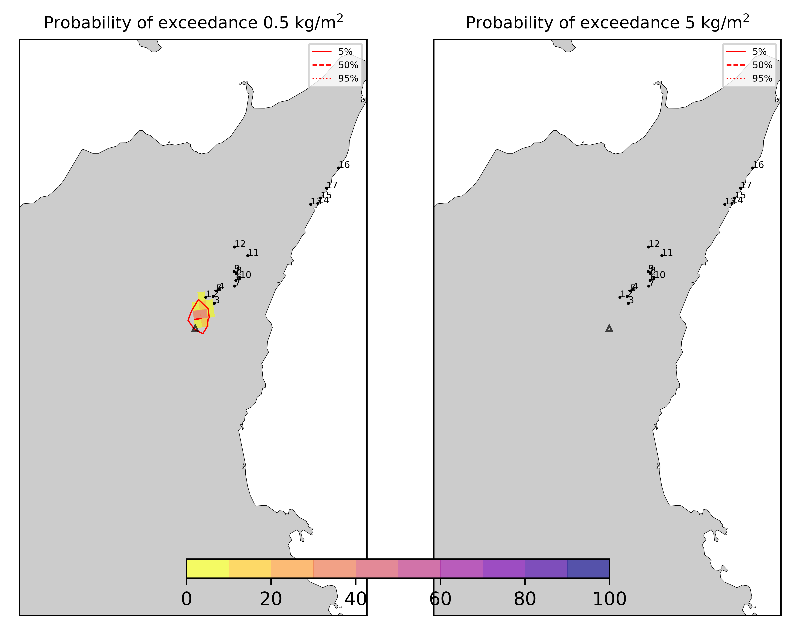
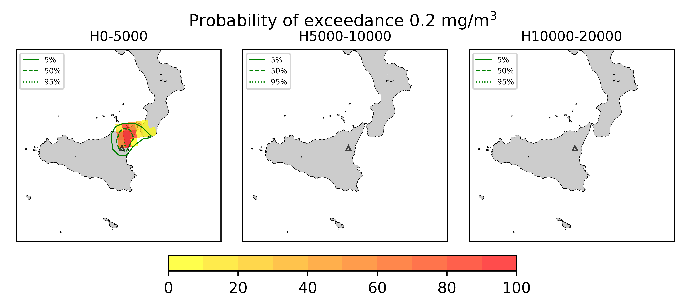
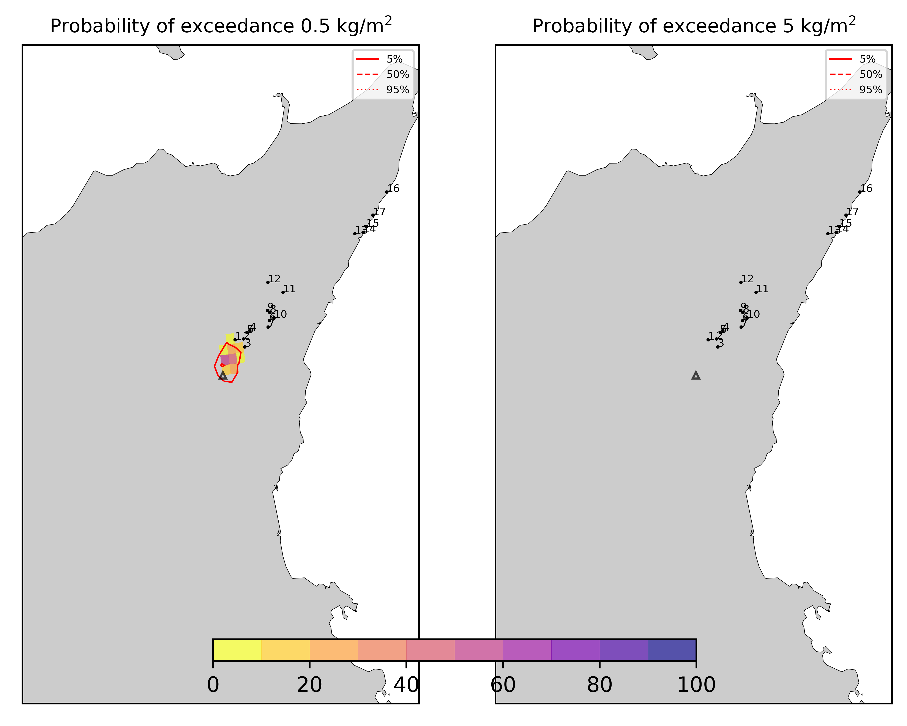

Forecast from VONA_20210304_0228Z
=================================

Contents
========

* [Forecast products](#forecast-products)
	* [Forecast at 2021-03-04 03:30 Z from RED VONA issued at 20210304_0228Z](#forecast-at-2021-03-04-0330-z-from-red-vona-issued-at-20210304_0228z)
	* [Forecast at 2021-03-04 04:30 Z from RED VONA issued at 20210304_0228Z](#forecast-at-2021-03-04-0430-z-from-red-vona-issued-at-20210304_0228z)
	* [Forecast at 2021-03-04 05:30 Z from RED VONA issued at 20210304_0228Z](#forecast-at-2021-03-04-0530-z-from-red-vona-issued-at-20210304_0228z)
	* [Forecast at 2021-03-04 08:30 Z from RED VONA issued at 20210304_0228Z](#forecast-at-2021-03-04-0830-z-from-red-vona-issued-at-20210304_0228z)
	* [Forecast at 2021-03-04 11:30 Z from RED VONA issued at 20210304_0228Z](#forecast-at-2021-03-04-1130-z-from-red-vona-issued-at-20210304_0228z)
	* [Forecast at 2021-03-04 14:30 Z from RED VONA issued at 20210304_0228Z](#forecast-at-2021-03-04-1430-z-from-red-vona-issued-at-20210304_0228z)
	* [Forecast at 2021-03-04 09:20 Z from RED VONA issued at 20210304_0616Z](#forecast-at-2021-03-04-0920-z-from-red-vona-issued-at-20210304_0616z)
	* [Forecast at 2021-03-04 12:20 Z from RED VONA issued at 20210304_0616Z](#forecast-at-2021-03-04-1220-z-from-red-vona-issued-at-20210304_0616z)

# Forecast products

## Forecast at 2021-03-04 03:30 Z from RED VONA issued at 20210304_0228Z
  

|Eruption start [Z]|Eruption end [Z]|Forecast time [Z]|Column height asl [m]|
| :--- | :--- | :--- | :--- |
|2021-03-04 02:30:00|Ongoing|2021-03-04 03:30:00|5000 ± 500 - from VONA|
  
  

|Percentile|MER [kg/s¹]|Mass air [kg]|Mass air nested dom. [kg]|Mass grd [kg]|Mass grd nested dom. [kg]|
| :--- | :--- | :--- | :--- | :--- | :--- |
|5th|4.57e+02|1.94e+06|1.94e+06|1.17e+04|1.74e+04|
|50th|2.93e+03|1.11e+07|1.11e+07|4.52e+05|4.54e+05|
|95th|8.38e+03|2.16e+07|2.16e+07|3.75e+06|3.74e+06|
  

### Ground Nested Domain 2021-03-04 03:30 Z
  
  
  
  
  
  
  
  
  
  
  
  
  
  
  
  
  
  

|Location|Ground load [kg/m²] 5th perc|Ground load [kg/m²] 50th perc|Ground load [kg/m²] 95th perc|
| :--- | :--- | :--- | :--- |
|Piano Provenzana (1)|0.00e+00|4.84e-05|1.49e-02|
|Bivio Provenzana-Linguaglossa (2)|0.00e+00|0.00e+00|2.28e-03|
|Cunetta pre-Citelli (3)|0.00e+00|0.00e+00|4.28e-03|
|Chalet (4)|0.00e+00|0.00e+00|6.68e-04|
|Ragabo (5)|0.00e+00|0.00e+00|8.94e-04|
|Scilio (6)|0.00e+00|0.00e+00|3.44e-05|
|Gambino vini (7)|0.00e+00|0.00e+00|3.58e-05|
|StazioneFce Linguaglossa (8)|0.00e+00|0.00e+00|2.47e-06|
|Linguaglossa Via Olivio Sozzi (9)|0.00e+00|0.00e+00|1.88e-06|
|Cim.Linguaglossa (10)|0.00e+00|0.00e+00|3.46e-06|
|Gole Bar (11)|0.00e+00|0.00e+00|0.00e+00|
|Francavilla - Orange (12)|0.00e+00|0.00e+00|0.00e+00|
|Roccalumera1 (13)|0.00e+00|0.00e+00|0.00e+00|
|Roccalumera2 (14)|0.00e+00|0.00e+00|0.00e+00|
|Nizza (15)|0.00e+00|0.00e+00|0.00e+00|
|Scaletta Zanclea (16)|0.00e+00|0.00e+00|0.00e+00|
|Alì (17)|0.00e+00|0.00e+00|0.00e+00|
  

### Atmosphere 2021-03-04 03:30 Z
  

## Forecast at 2021-03-04 04:30 Z from RED VONA issued at 20210304_0228Z
  

|Eruption start [Z]|Eruption end [Z]|Forecast time [Z]|Column height asl [m]|
| :--- | :--- | :--- | :--- |
|2021-03-04 02:30:00|Ongoing|2021-03-04 04:30:00|5000 ± 500 - from VONA|
  
  

|Percentile|MER [kg/s¹]|Mass air [kg]|Mass air nested dom. [kg]|Mass grd [kg]|Mass grd nested dom. [kg]|
| :--- | :--- | :--- | :--- | :--- | :--- |
|5th|5.24e+02|3.22e+06|3.22e+06|1.52e+05|1.60e+05|
|50th|3.32e+03|2.19e+07|2.18e+07|2.46e+06|2.46e+06|
|95th|9.70e+03|4.86e+07|4.86e+07|6.99e+06|6.99e+06|
  

### Ground Nested Domain 2021-03-04 04:30 Z
  
  
  
  
  
  
  
  
  
  
  
  
  
  
  
  
  
  

|Location|Ground load [kg/m²] 5th perc|Ground load [kg/m²] 50th perc|Ground load [kg/m²] 95th perc|
| :--- | :--- | :--- | :--- |
|Piano Provenzana (1)|0.00e+00|2.77e-03|4.32e-02|
|Bivio Provenzana-Linguaglossa (2)|0.00e+00|3.20e-04|1.03e-02|
|Cunetta pre-Citelli (3)|0.00e+00|2.91e-04|1.01e-02|
|Chalet (4)|0.00e+00|5.15e-06|6.56e-03|
|Ragabo (5)|0.00e+00|5.27e-05|8.04e-03|
|Scilio (6)|0.00e+00|0.00e+00|4.60e-04|
|Gambino vini (7)|0.00e+00|0.00e+00|3.44e-04|
|StazioneFce Linguaglossa (8)|0.00e+00|0.00e+00|5.18e-04|
|Linguaglossa Via Olivio Sozzi (9)|0.00e+00|0.00e+00|7.06e-04|
|Cim.Linguaglossa (10)|0.00e+00|0.00e+00|2.58e-04|
|Gole Bar (11)|0.00e+00|0.00e+00|3.72e-06|
|Francavilla - Orange (12)|0.00e+00|0.00e+00|4.91e-06|
|Roccalumera1 (13)|0.00e+00|0.00e+00|0.00e+00|
|Roccalumera2 (14)|0.00e+00|0.00e+00|0.00e+00|
|Nizza (15)|0.00e+00|0.00e+00|0.00e+00|
|Scaletta Zanclea (16)|0.00e+00|0.00e+00|0.00e+00|
|Alì (17)|0.00e+00|0.00e+00|0.00e+00|
  

### Atmosphere 2021-03-04 04:30 Z
  

## Forecast at 2021-03-04 05:30 Z from RED VONA issued at 20210304_0228Z
  

|Eruption start [Z]|Eruption end [Z]|Forecast time [Z]|Column height asl [m]|
| :--- | :--- | :--- | :--- |
|2021-03-04 02:30:00|Ongoing|2021-03-04 05:30:00|5000 ± 500 - from VONA|
  
  

|Percentile|MER [kg/s¹]|Mass air [kg]|Mass air nested dom. [kg]|Mass grd [kg]|Mass grd nested dom. [kg]|
| :--- | :--- | :--- | :--- | :--- | :--- |
|5th|5.56e+02|1.69e+07|1.69e+07|1.24e+06|1.24e+06|
|50th|3.83e+03|3.64e+07|3.64e+07|4.58e+06|4.59e+06|
|95th|1.30e+04|6.42e+07|6.41e+07|1.02e+07|1.02e+07|
  

### Ground Nested Domain 2021-03-04 05:30 Z
  
  
  
  
  
  
  
  
  
  
  
  
  
  
  
  
  
  

|Location|Ground load [kg/m²] 5th perc|Ground load [kg/m²] 50th perc|Ground load [kg/m²] 95th perc|
| :--- | :--- | :--- | :--- |
|Piano Provenzana (1)|2.40e-03|1.42e-02|8.97e-02|
|Bivio Provenzana-Linguaglossa (2)|1.18e-04|2.44e-03|3.48e-02|
|Cunetta pre-Citelli (3)|6.02e-05|1.84e-03|3.31e-02|
|Chalet (4)|0.00e+00|5.77e-04|1.02e-02|
|Ragabo (5)|0.00e+00|1.09e-03|1.56e-02|
|Scilio (6)|0.00e+00|6.67e-07|8.28e-04|
|Gambino vini (7)|0.00e+00|0.00e+00|7.77e-04|
|StazioneFce Linguaglossa (8)|0.00e+00|0.00e+00|1.02e-03|
|Linguaglossa Via Olivio Sozzi (9)|0.00e+00|0.00e+00|1.44e-03|
|Cim.Linguaglossa (10)|0.00e+00|0.00e+00|4.46e-04|
|Gole Bar (11)|0.00e+00|0.00e+00|4.73e-04|
|Francavilla - Orange (12)|0.00e+00|0.00e+00|5.02e-04|
|Roccalumera1 (13)|0.00e+00|0.00e+00|0.00e+00|
|Roccalumera2 (14)|0.00e+00|0.00e+00|0.00e+00|
|Nizza (15)|0.00e+00|0.00e+00|0.00e+00|
|Scaletta Zanclea (16)|0.00e+00|0.00e+00|0.00e+00|
|Alì (17)|0.00e+00|0.00e+00|0.00e+00|
  

### Atmosphere 2021-03-04 05:30 Z
  

## Forecast at 2021-03-04 08:30 Z from RED VONA issued at 20210304_0228Z
  

|Eruption start [Z]|Eruption end [Z]|Forecast time [Z]|Column height asl [m]|
| :--- | :--- | :--- | :--- |
|2021-03-04 02:30:00|Ongoing|2021-03-04 08:30:00|5000 ± 500 - from VONA|
  
  

|Percentile|MER [kg/s¹]|Mass air [kg]|Mass air nested dom. [kg]|Mass grd [kg]|Mass grd nested dom. [kg]|
| :--- | :--- | :--- | :--- | :--- | :--- |
|5th|3.05e+02|2.37e+07|2.37e+07|2.54e+06|2.55e+06|
|50th|1.96e+03|5.70e+07|5.69e+07|1.27e+07|1.27e+07|
|95th|7.70e+03|9.94e+07|9.83e+07|2.86e+07|2.86e+07|
  

### Ground Nested Domain 2021-03-04 08:30 Z
  
  
  
  
  
  
  
  
  
  
  
  
  
  
  
  
  
  

|Location|Ground load [kg/m²] 5th perc|Ground load [kg/m²] 50th perc|Ground load [kg/m²] 95th perc|
| :--- | :--- | :--- | :--- |
|Piano Provenzana (1)|5.99e-03|5.51e-02|1.78e-01|
|Bivio Provenzana-Linguaglossa (2)|2.63e-04|1.55e-02|5.42e-02|
|Cunetta pre-Citelli (3)|8.93e-05|1.06e-02|7.14e-02|
|Chalet (4)|2.96e-05|5.03e-03|3.84e-02|
|Ragabo (5)|1.48e-04|1.13e-02|4.66e-02|
|Scilio (6)|0.00e+00|2.51e-04|8.84e-03|
|Gambino vini (7)|0.00e+00|1.98e-04|1.19e-02|
|StazioneFce Linguaglossa (8)|0.00e+00|4.01e-04|7.15e-03|
|Linguaglossa Via Olivio Sozzi (9)|0.00e+00|8.32e-04|1.12e-02|
|Cim.Linguaglossa (10)|0.00e+00|5.97e-05|5.47e-03|
|Gole Bar (11)|0.00e+00|2.20e-05|5.77e-03|
|Francavilla - Orange (12)|0.00e+00|5.45e-05|1.01e-02|
|Roccalumera1 (13)|0.00e+00|0.00e+00|6.17e-07|
|Roccalumera2 (14)|0.00e+00|0.00e+00|0.00e+00|
|Nizza (15)|0.00e+00|0.00e+00|0.00e+00|
|Scaletta Zanclea (16)|0.00e+00|0.00e+00|0.00e+00|
|Alì (17)|0.00e+00|0.00e+00|3.36e-06|
  

### Atmosphere 2021-03-04 08:30 Z
  

## Forecast at 2021-03-04 11:30 Z from RED VONA issued at 20210304_0228Z
  

|Eruption start [Z]|Eruption end [Z]|Forecast time [Z]|Column height asl [m]|
| :--- | :--- | :--- | :--- |
|2021-03-04 02:30:00|Ongoing|2021-03-04 11:30:00|5000 ± 500 - from VONA|
  
  

|Percentile|MER [kg/s¹]|Mass air [kg]|Mass air nested dom. [kg]|Mass grd [kg]|Mass grd nested dom. [kg]|
| :--- | :--- | :--- | :--- | :--- | :--- |
|5th|2.14e+02|5.08e+07|5.07e+07|7.10e+06|7.12e+06|
|50th|2.53e+03|7.57e+07|7.56e+07|2.06e+07|2.06e+07|
|95th|1.42e+04|1.95e+08|1.63e+08|4.60e+07|4.60e+07|
  

### Ground Nested Domain 2021-03-04 11:30 Z
  
  
  
  
  
  
  
  
  
  
  
  
  
  
  
  
  
  

|Location|Ground load [kg/m²] 5th perc|Ground load [kg/m²] 50th perc|Ground load [kg/m²] 95th perc|
| :--- | :--- | :--- | :--- |
|Piano Provenzana (1)|1.15e-02|6.46e-02|2.31e-01|
|Bivio Provenzana-Linguaglossa (2)|2.09e-03|2.18e-02|7.42e-02|
|Cunetta pre-Citelli (3)|1.71e-03|1.36e-02|8.78e-02|
|Chalet (4)|5.50e-04|1.32e-02|5.88e-02|
|Ragabo (5)|1.35e-03|1.92e-02|6.73e-02|
|Scilio (6)|6.87e-06|1.40e-03|1.94e-02|
|Gambino vini (7)|1.42e-06|1.00e-03|1.58e-02|
|StazioneFce Linguaglossa (8)|5.36e-05|2.33e-03|1.80e-02|
|Linguaglossa Via Olivio Sozzi (9)|1.26e-04|3.56e-03|2.28e-02|
|Cim.Linguaglossa (10)|6.01e-07|7.10e-04|1.16e-02|
|Gole Bar (11)|0.00e+00|3.24e-04|8.94e-03|
|Francavilla - Orange (12)|4.44e-05|2.32e-03|1.86e-02|
|Roccalumera1 (13)|0.00e+00|0.00e+00|7.12e-04|
|Roccalumera2 (14)|0.00e+00|0.00e+00|5.84e-04|
|Nizza (15)|0.00e+00|0.00e+00|9.84e-04|
|Scaletta Zanclea (16)|0.00e+00|0.00e+00|1.26e-03|
|Alì (17)|0.00e+00|0.00e+00|1.70e-03|
  

### Atmosphere 2021-03-04 11:30 Z
  

## Forecast at 2021-03-04 14:30 Z from RED VONA issued at 20210304_0228Z
  

|Eruption start [Z]|Eruption end [Z]|Forecast time [Z]|Column height asl [m]|
| :--- | :--- | :--- | :--- |
|2021-03-04 02:30:00|Ongoing|2021-03-04 14:30:00|5000 ± 500 - from VONA|
  
  

|Percentile|MER [kg/s¹]|Mass air [kg]|Mass air nested dom. [kg]|Mass grd [kg]|Mass grd nested dom. [kg]|
| :--- | :--- | :--- | :--- | :--- | :--- |
|5th|3.77e+02|7.58e+07|6.14e+07|1.18e+07|1.18e+07|
|50th|4.55e+03|1.61e+08|1.15e+08|3.19e+07|3.19e+07|
|95th|2.40e+04|2.92e+08|2.07e+08|7.12e+07|7.11e+07|
  

### Ground Nested Domain 2021-03-04 14:30 Z
  
  
  
  
  
  
  
  
  
  
  
  
  
  
  
  
  
  

|Location|Ground load [kg/m²] 5th perc|Ground load [kg/m²] 50th perc|Ground load [kg/m²] 95th perc|
| :--- | :--- | :--- | :--- |
|Piano Provenzana (1)|1.73e-02|1.30e-01|2.97e-01|
|Bivio Provenzana-Linguaglossa (2)|6.52e-03|4.90e-02|1.65e-01|
|Cunetta pre-Citelli (3)|2.12e-03|2.45e-02|2.52e-01|
|Chalet (4)|3.67e-03|3.03e-02|9.50e-02|
|Ragabo (5)|7.15e-03|4.60e-02|1.05e-01|
|Scilio (6)|1.74e-04|8.15e-03|3.46e-02|
|Gambino vini (7)|1.19e-04|5.73e-03|4.66e-02|
|StazioneFce Linguaglossa (8)|3.52e-04|9.66e-03|3.56e-02|
|Linguaglossa Via Olivio Sozzi (9)|6.11e-04|1.37e-02|4.39e-02|
|Cim.Linguaglossa (10)|8.96e-05|6.27e-03|2.75e-02|
|Gole Bar (11)|4.35e-05|5.05e-03|1.52e-02|
|Francavilla - Orange (12)|1.38e-04|6.42e-03|2.75e-02|
|Roccalumera1 (13)|0.00e+00|8.28e-05|2.20e-03|
|Roccalumera2 (14)|0.00e+00|4.27e-05|1.99e-03|
|Nizza (15)|0.00e+00|4.04e-05|2.82e-03|
|Scaletta Zanclea (16)|0.00e+00|4.98e-05|4.14e-03|
|Alì (17)|0.00e+00|6.20e-05|3.69e-03|
  

### Atmosphere 2021-03-04 14:30 Z
  

## Forecast at 2021-03-04 09:20 Z from RED VONA issued at 20210304_0616Z
  

|Eruption start [Z]|Eruption end [Z]|Forecast time [Z]|Column height asl [m]|
| :--- | :--- | :--- | :--- |
|2021-03-04 02:30:00|Ongoing|2021-03-04 09:20:00|5000 ± 500 - from VONA|
  
  

|Percentile|MER [kg/s¹]|Mass air [kg]|Mass air nested dom. [kg]|Mass grd [kg]|Mass grd nested dom. [kg]|
| :--- | :--- | :--- | :--- | :--- | :--- |
|5th|2.47e+02|2.28e+07|2.28e+07|2.72e+06|2.72e+06|
|50th|1.37e+03|5.66e+07|5.66e+07|1.27e+07|1.27e+07|
|95th|1.12e+04|1.30e+08|1.25e+08|3.17e+07|3.17e+07|
  

### Ground Nested Domain 2021-03-04 09:20 Z
  
  
  
  
  
  
  
  
  
  
  
  
  
  
  
  
  
  

|Location|Ground load [kg/m²] 5th perc|Ground load [kg/m²] 50th perc|Ground load [kg/m²] 95th perc|
| :--- | :--- | :--- | :--- |
|Piano Provenzana (1)|7.32e-03|6.73e-02|1.76e-01|
|Bivio Provenzana-Linguaglossa (2)|4.89e-04|1.23e-02|1.02e-01|
|Cunetta pre-Citelli (3)|2.17e-04|8.84e-03|1.23e-01|
|Chalet (4)|9.35e-05|7.04e-03|6.44e-02|
|Ragabo (5)|2.12e-04|1.00e-02|7.72e-02|
|Scilio (6)|0.00e+00|4.33e-04|2.56e-02|
|Gambino vini (7)|0.00e+00|1.94e-04|2.48e-02|
|StazioneFce Linguaglossa (8)|1.18e-06|1.21e-03|2.48e-02|
|Linguaglossa Via Olivio Sozzi (9)|3.13e-06|1.39e-03|2.76e-02|
|Cim.Linguaglossa (10)|0.00e+00|4.50e-04|1.89e-02|
|Gole Bar (11)|0.00e+00|1.58e-04|8.11e-03|
|Francavilla - Orange (12)|2.39e-06|9.75e-04|1.17e-02|
|Roccalumera1 (13)|0.00e+00|0.00e+00|2.23e-04|
|Roccalumera2 (14)|0.00e+00|0.00e+00|2.45e-04|
|Nizza (15)|0.00e+00|0.00e+00|4.10e-05|
|Scaletta Zanclea (16)|0.00e+00|0.00e+00|5.69e-04|
|Alì (17)|0.00e+00|0.00e+00|2.60e-05|
  

### Atmosphere 2021-03-04 09:20 Z
  

## Forecast at 2021-03-04 12:20 Z from RED VONA issued at 20210304_0616Z
  

|Eruption start [Z]|Eruption end [Z]|Forecast time [Z]|Column height asl [m]|
| :--- | :--- | :--- | :--- |
|2021-03-04 02:30:00|Ongoing|2021-03-04 12:20:00|5000 ± 500 - from VONA|
  
  

|Percentile|MER [kg/s¹]|Mass air [kg]|Mass air nested dom. [kg]|Mass grd [kg]|Mass grd nested dom. [kg]|
| :--- | :--- | :--- | :--- | :--- | :--- |
|5th|2.59e+02|4.45e+07|4.44e+07|7.71e+06|7.74e+06|
|50th|3.65e+03|9.87e+07|9.78e+07|1.97e+07|1.97e+07|
|95th|1.35e+04|1.95e+08|1.74e+08|4.03e+07|4.02e+07|
  

### Ground Nested Domain 2021-03-04 12:20 Z
  
  
  
  
  
  
  
  
  
  
  
  
  
  
  
  
  
  

|Location|Ground load [kg/m²] 5th perc|Ground load [kg/m²] 50th perc|Ground load [kg/m²] 95th perc|
| :--- | :--- | :--- | :--- |
|Piano Provenzana (1)|1.55e-02|9.49e-02|2.29e-01|
|Bivio Provenzana-Linguaglossa (2)|2.40e-03|2.79e-02|1.32e-01|
|Cunetta pre-Citelli (3)|1.24e-03|1.22e-02|1.32e-01|
|Chalet (4)|2.31e-03|1.04e-02|1.10e-01|
|Ragabo (5)|2.88e-03|1.92e-02|1.22e-01|
|Scilio (6)|4.29e-05|1.75e-03|6.73e-02|
|Gambino vini (7)|1.82e-05|1.29e-03|4.55e-02|
|StazioneFce Linguaglossa (8)|3.96e-04|2.28e-03|6.88e-02|
|Linguaglossa Via Olivio Sozzi (9)|7.24e-04|3.31e-03|6.70e-02|
|Cim.Linguaglossa (10)|2.63e-05|1.08e-03|5.53e-02|
|Gole Bar (11)|8.85e-05|5.94e-04|2.59e-02|
|Francavilla - Orange (12)|2.24e-04|3.15e-03|2.69e-02|
|Roccalumera1 (13)|0.00e+00|0.00e+00|2.03e-03|
|Roccalumera2 (14)|0.00e+00|0.00e+00|1.11e-03|
|Nizza (15)|0.00e+00|0.00e+00|1.04e-03|
|Scaletta Zanclea (16)|0.00e+00|0.00e+00|1.62e-03|
|Alì (17)|0.00e+00|0.00e+00|1.22e-03|
  

### Atmosphere 2021-03-04 12:20 Z
  
  
Go to [Supplementary page](Supplementary_page.md)  
Go to [Main directory](https://github.com/federicapardini/Real_time_ash_forecast)