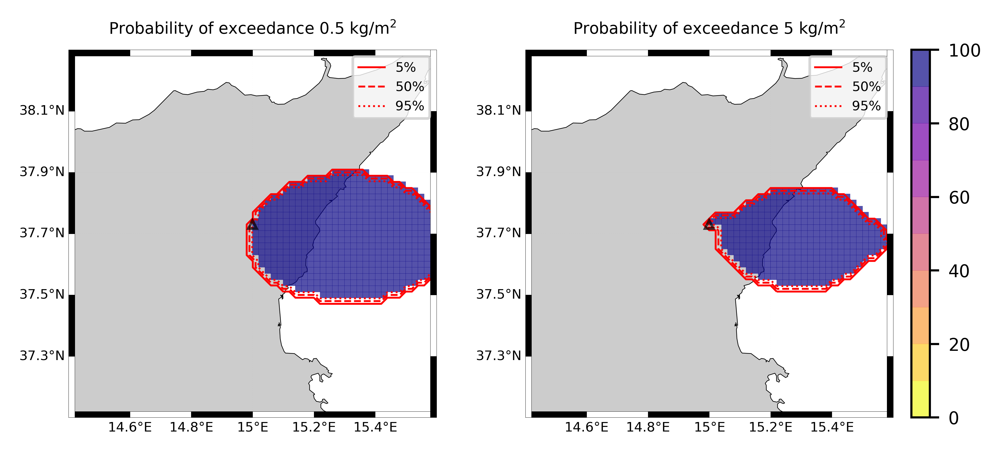

Forecast from VONA_20210304_0228Z
=================================

Contents
========

* [Forecast products](#forecast-products)
	* [Forecast at 2021-03-04 03:30 Z from RED VONA issued at 20210304_0228Z](#forecast-at-2021-03-04-0330-z-from-red-vona-issued-at-20210304_0228z)
	* [Forecast at 2021-03-04 04:30 Z from RED VONA issued at 20210304_0228Z](#forecast-at-2021-03-04-0430-z-from-red-vona-issued-at-20210304_0228z)
	* [Forecast at 2021-03-04 05:30 Z from RED VONA issued at 20210304_0228Z](#forecast-at-2021-03-04-0530-z-from-red-vona-issued-at-20210304_0228z)
	* [Forecast at 2021-03-04 08:30 Z from RED VONA issued at 20210304_0228Z](#forecast-at-2021-03-04-0830-z-from-red-vona-issued-at-20210304_0228z)
	* [Forecast at 2021-03-04 11:30 Z from RED VONA issued at 20210304_0228Z](#forecast-at-2021-03-04-1130-z-from-red-vona-issued-at-20210304_0228z)
	* [Forecast at 2021-03-04 13:20 Z from ORANGE VONA issued at 20210304_1016Z](#forecast-at-2021-03-04-1320-z-from-orange-vona-issued-at-20210304_1016z)
	* [Forecast at 2021-03-04 16:20 Z from ORANGE VONA issued at 20210304_1016Z](#forecast-at-2021-03-04-1620-z-from-orange-vona-issued-at-20210304_1016z)

# Forecast products

## Forecast at 2021-03-04 03:30 Z from RED VONA issued at 20210304_0228Z
  

|Eruption start [Z]|Eruption end [Z]|Forecast time [Z]|Column height asl [m]|
| :--- | :--- | :--- | :--- |
|2021-03-04 02:30:00|Ongoing|2021-03-04 03:30:00|5000 ± 500 - from VONA|
  
  

|Percentile|MER [kg/s¹]|Mass air [kg]|Mass air nested dom. [kg]|Mass grd [kg]|Mass grd nested dom. [kg]|
| :--- | :--- | :--- | :--- | :--- | :--- |
|5th|2.44e+06|5.82e+09|5.81e+09|3.79e+09|3.78e+09|
|50th|2.73e+06|5.82e+09|5.81e+09|3.79e+09|3.78e+09|
|95th|3.02e+06|5.82e+09|5.81e+09|3.79e+09|3.78e+09|
  

### Ground Nested Domain 2021-03-04 03:30 Z
  
  
  
  
  
  
  
  
  
  
  
  
  
  
  
  
  
  
  
  
  
  
  
  
  
  
  
  

|Location|Ground load [kg/m²] 5th perc|Ground load [kg/m²] 50th perc|Ground load [kg/m²] 95th perc|
| :--- | :--- | :--- | :--- |
|Catania AP (1)|4.70e-04|4.70e-04|4.70e-04|
|Siracusa (2)|nan|nan|nan|
|Reggio Calabria (3)|nan|nan|nan|
|Palermo (4)|nan|nan|nan|
|Nicolosi (5)|8.91e-02|8.91e-02|8.91e-02|
|Zafferana (6)|7.51e+00|7.51e+00|7.51e+00|
|Linguaglossa (7)|4.38e-03|4.38e-03|4.38e-03|
|Randazzo (8)|0.00e+00|0.00e+00|0.00e+00|
|Bronte (9)|0.00e+00|0.00e+00|0.00e+00|
|Biancavilla (10)|0.00e+00|0.00e+00|0.00e+00|
|Piano Provenzana (11)|1.41e-02|1.41e-02|1.41e-02|
|Bivio Provenzana-Linguaglossa (12)|2.79e-02|2.79e-02|2.79e-02|
|Cunetta pre-Citelli (13)|6.24e-02|6.24e-02|6.24e-02|
|Chalet (14)|1.64e-02|1.64e-02|1.64e-02|
|Ragabo (15)|1.85e-02|1.85e-02|1.85e-02|
|Scilio (16)|1.81e-02|1.81e-02|1.81e-02|
|Gambino vini (17)|4.96e-02|4.96e-02|4.96e-02|
|StazioneFce Linguaglossa (18)|4.83e-03|4.83e-03|4.83e-03|
|Linguaglossa Via Olivio Sozzi (19)|2.36e-03|2.36e-03|2.36e-03|
|Cim.Linguaglossa (20)|1.06e-02|1.06e-02|1.06e-02|
|Gole Bar (21)|0.00e+00|0.00e+00|0.00e+00|
|Francavilla - Orange (22)|0.00e+00|0.00e+00|0.00e+00|
|Roccalumera1 (23)|0.00e+00|0.00e+00|0.00e+00|
|Roccalumera2 (24)|0.00e+00|0.00e+00|0.00e+00|
|Nizza (25)|0.00e+00|0.00e+00|0.00e+00|
|Scaletta Zanclea (26)|0.00e+00|0.00e+00|0.00e+00|
|Alì (27)|0.00e+00|0.00e+00|0.00e+00|
  

### Atmosphere 2021-03-04 03:30 Z
  

## Forecast at 2021-03-04 04:30 Z from RED VONA issued at 20210304_0228Z
  

|Eruption start [Z]|Eruption end [Z]|Forecast time [Z]|Column height asl [m]|
| :--- | :--- | :--- | :--- |
|2021-03-04 02:30:00|Ongoing|2021-03-04 04:30:00|5000 ± 500 - from VONA|
  
  

|Percentile|MER [kg/s¹]|Mass air [kg]|Mass air nested dom. [kg]|Mass grd [kg]|Mass grd nested dom. [kg]|
| :--- | :--- | :--- | :--- | :--- | :--- |
|5th|3.02e+06|6.22e+09|6.20e+09|1.40e+10|1.39e+10|
|50th|3.02e+06|6.22e+09|6.20e+09|1.40e+10|1.39e+10|
|95th|3.02e+06|6.22e+09|6.20e+09|1.40e+10|1.39e+10|
  

### Ground Nested Domain 2021-03-04 04:30 Z
  
  
  
  
  
  
  
  
  
  
  
  
  
  
  
  
  
  
  
  
  
  
  
  
  
  
  
  

|Location|Ground load [kg/m²] 5th perc|Ground load [kg/m²] 50th perc|Ground load [kg/m²] 95th perc|
| :--- | :--- | :--- | :--- |
|Catania AP (1)|2.66e-02|2.66e-02|2.66e-02|
|Siracusa (2)|nan|nan|nan|
|Reggio Calabria (3)|nan|nan|nan|
|Palermo (4)|nan|nan|nan|
|Nicolosi (5)|3.24e-01|3.24e-01|3.24e-01|
|Zafferana (6)|1.98e+01|1.98e+01|1.98e+01|
|Linguaglossa (7)|5.45e-02|5.45e-02|5.45e-02|
|Randazzo (8)|0.00e+00|0.00e+00|0.00e+00|
|Bronte (9)|0.00e+00|0.00e+00|0.00e+00|
|Biancavilla (10)|0.00e+00|0.00e+00|0.00e+00|
|Piano Provenzana (11)|7.76e-02|7.76e-02|7.76e-02|
|Bivio Provenzana-Linguaglossa (12)|1.52e-01|1.52e-01|1.52e-01|
|Cunetta pre-Citelli (13)|2.94e-01|2.94e-01|2.94e-01|
|Chalet (14)|1.09e-01|1.09e-01|1.09e-01|
|Ragabo (15)|1.14e-01|1.14e-01|1.14e-01|
|Scilio (16)|1.47e-01|1.47e-01|1.47e-01|
|Gambino vini (17)|2.99e-01|2.99e-01|2.99e-01|
|StazioneFce Linguaglossa (18)|5.64e-02|5.64e-02|5.64e-02|
|Linguaglossa Via Olivio Sozzi (19)|3.03e-02|3.03e-02|3.03e-02|
|Cim.Linguaglossa (20)|1.23e-01|1.23e-01|1.23e-01|
|Gole Bar (21)|0.00e+00|0.00e+00|0.00e+00|
|Francavilla - Orange (22)|0.00e+00|0.00e+00|0.00e+00|
|Roccalumera1 (23)|0.00e+00|0.00e+00|0.00e+00|
|Roccalumera2 (24)|0.00e+00|0.00e+00|0.00e+00|
|Nizza (25)|0.00e+00|0.00e+00|0.00e+00|
|Scaletta Zanclea (26)|0.00e+00|0.00e+00|0.00e+00|
|Alì (27)|0.00e+00|0.00e+00|0.00e+00|
  

### Atmosphere 2021-03-04 04:30 Z
  

## Forecast at 2021-03-04 05:30 Z from RED VONA issued at 20210304_0228Z
  

|Eruption start [Z]|Eruption end [Z]|Forecast time [Z]|Column height asl [m]|
| :--- | :--- | :--- | :--- |
|2021-03-04 02:30:00|Ongoing|2021-03-04 05:30:00|5000 ± 500 - from VONA|
  
  

|Percentile|MER [kg/s¹]|Mass air [kg]|Mass air nested dom. [kg]|Mass grd [kg]|Mass grd nested dom. [kg]|
| :--- | :--- | :--- | :--- | :--- | :--- |
|5th|3.02e+06|6.43e+09|6.41e+09|2.45e+10|2.44e+10|
|50th|3.02e+06|6.43e+09|6.41e+09|2.45e+10|2.44e+10|
|95th|3.02e+06|6.43e+09|6.41e+09|2.45e+10|2.44e+10|
  

### Ground Nested Domain 2021-03-04 05:30 Z
  
  
  
  
  
  
  
  
  
  
  
  
  
  
  
  
  
  
  
  
  
  
  
  
  
  
  
  

|Location|Ground load [kg/m²] 5th perc|Ground load [kg/m²] 50th perc|Ground load [kg/m²] 95th perc|
| :--- | :--- | :--- | :--- |
|Catania AP (1)|4.08e-02|4.08e-02|4.08e-02|
|Siracusa (2)|nan|nan|nan|
|Reggio Calabria (3)|nan|nan|nan|
|Palermo (4)|nan|nan|nan|
|Nicolosi (5)|4.85e-01|4.85e-01|4.85e-01|
|Zafferana (6)|3.01e+01|3.01e+01|3.01e+01|
|Linguaglossa (7)|1.37e-01|1.37e-01|1.37e-01|
|Randazzo (8)|0.00e+00|0.00e+00|0.00e+00|
|Bronte (9)|0.00e+00|0.00e+00|0.00e+00|
|Biancavilla (10)|0.00e+00|0.00e+00|0.00e+00|
|Piano Provenzana (11)|1.48e-01|1.48e-01|1.48e-01|
|Bivio Provenzana-Linguaglossa (12)|2.95e-01|2.95e-01|2.95e-01|
|Cunetta pre-Citelli (13)|5.58e-01|5.58e-01|5.58e-01|
|Chalet (14)|2.23e-01|2.23e-01|2.23e-01|
|Ragabo (15)|2.29e-01|2.29e-01|2.29e-01|
|Scilio (16)|3.21e-01|3.21e-01|3.21e-01|
|Gambino vini (17)|6.14e-01|6.14e-01|6.14e-01|
|StazioneFce Linguaglossa (18)|1.38e-01|1.38e-01|1.38e-01|
|Linguaglossa Via Olivio Sozzi (19)|8.14e-02|8.14e-02|8.14e-02|
|Cim.Linguaglossa (20)|2.85e-01|2.85e-01|2.85e-01|
|Gole Bar (21)|0.00e+00|0.00e+00|0.00e+00|
|Francavilla - Orange (22)|0.00e+00|0.00e+00|0.00e+00|
|Roccalumera1 (23)|0.00e+00|0.00e+00|0.00e+00|
|Roccalumera2 (24)|0.00e+00|0.00e+00|0.00e+00|
|Nizza (25)|0.00e+00|0.00e+00|0.00e+00|
|Scaletta Zanclea (26)|0.00e+00|0.00e+00|0.00e+00|
|Alì (27)|0.00e+00|0.00e+00|0.00e+00|
  

### Atmosphere 2021-03-04 05:30 Z
  

## Forecast at 2021-03-04 08:30 Z from RED VONA issued at 20210304_0228Z
  

|Eruption start [Z]|Eruption end [Z]|Forecast time [Z]|Column height asl [m]|
| :--- | :--- | :--- | :--- |
|2021-03-04 02:30:00|Ongoing|2021-03-04 08:30:00|5000 ± 500 - from VONA|
  
  

|Percentile|MER [kg/s¹]|Mass air [kg]|Mass air nested dom. [kg]|Mass grd [kg]|Mass grd nested dom. [kg]|
| :--- | :--- | :--- | :--- | :--- | :--- |
|5th|3.02e+06|7.33e+09|7.28e+09|6.05e+10|6.03e+10|
|50th|3.63e+06|7.33e+09|7.28e+09|6.05e+10|6.03e+10|
|95th|3.63e+06|7.33e+09|7.28e+09|6.05e+10|6.03e+10|
  

### Ground Nested Domain 2021-03-04 08:30 Z
  
  
  
  
  
  
  
  
  
  
  
  
  
  
  
  
  
  
  
  
  
  
  
  
  
  
  
  

|Location|Ground load [kg/m²] 5th perc|Ground load [kg/m²] 50th perc|Ground load [kg/m²] 95th perc|
| :--- | :--- | :--- | :--- |
|Catania AP (1)|1.13e-01|1.13e-01|1.13e-01|
|Siracusa (2)|nan|nan|nan|
|Reggio Calabria (3)|nan|nan|nan|
|Palermo (4)|nan|nan|nan|
|Nicolosi (5)|8.47e-01|8.47e-01|8.47e-01|
|Zafferana (6)|4.77e+01|4.77e+01|4.77e+01|
|Linguaglossa (7)|7.57e-01|7.57e-01|7.57e-01|
|Randazzo (8)|1.10e-04|1.10e-04|1.10e-04|
|Bronte (9)|0.00e+00|0.00e+00|0.00e+00|
|Biancavilla (10)|0.00e+00|0.00e+00|0.00e+00|
|Piano Provenzana (11)|4.29e-01|4.29e-01|4.29e-01|
|Bivio Provenzana-Linguaglossa (12)|8.35e-01|8.35e-01|8.35e-01|
|Cunetta pre-Citelli (13)|1.42e+00|1.42e+00|1.42e+00|
|Chalet (14)|7.31e-01|7.31e-01|7.31e-01|
|Ragabo (15)|7.18e-01|7.18e-01|7.18e-01|
|Scilio (16)|1.27e+00|1.27e+00|1.27e+00|
|Gambino vini (17)|2.00e+00|2.00e+00|2.00e+00|
|StazioneFce Linguaglossa (18)|7.25e-01|7.25e-01|7.25e-01|
|Linguaglossa Via Olivio Sozzi (19)|5.04e-01|5.04e-01|5.04e-01|
|Cim.Linguaglossa (20)|1.31e+00|1.31e+00|1.31e+00|
|Gole Bar (21)|1.68e-01|1.68e-01|1.68e-01|
|Francavilla - Orange (22)|1.85e-02|1.85e-02|1.85e-02|
|Roccalumera1 (23)|0.00e+00|0.00e+00|0.00e+00|
|Roccalumera2 (24)|0.00e+00|0.00e+00|0.00e+00|
|Nizza (25)|0.00e+00|0.00e+00|0.00e+00|
|Scaletta Zanclea (26)|0.00e+00|0.00e+00|0.00e+00|
|Alì (27)|0.00e+00|0.00e+00|0.00e+00|
  

### Atmosphere 2021-03-04 08:30 Z
  

## Forecast at 2021-03-04 11:30 Z from RED VONA issued at 20210304_0228Z
  

|Eruption start [Z]|Eruption end [Z]|Forecast time [Z]|Column height asl [m]|
| :--- | :--- | :--- | :--- |
|2021-03-04 02:30:00|Ongoing|2021-03-04 11:30:00|5000 ± 500 - from VONA|
  
  

|Percentile|MER [kg/s¹]|Mass air [kg]|Mass air nested dom. [kg]|Mass grd [kg]|Mass grd nested dom. [kg]|
| :--- | :--- | :--- | :--- | :--- | :--- |
|5th|3.63e+06|9.37e+09|9.27e+09|1.01e+11|1.01e+11|
|50th|4.24e+06|9.37e+09|9.27e+09|1.01e+11|1.01e+11|
|95th|4.24e+06|9.37e+09|9.27e+09|1.01e+11|1.01e+11|
  

### Ground Nested Domain 2021-03-04 11:30 Z
  
  
  
  
  
  
  
  
  
  
  
  
  
  
  
  
  
  
  
  
  
  
  
  
  
  
  
  

|Location|Ground load [kg/m²] 5th perc|Ground load [kg/m²] 50th perc|Ground load [kg/m²] 95th perc|
| :--- | :--- | :--- | :--- |
|Catania AP (1)|1.78e-01|1.78e-01|1.78e-01|
|Siracusa (2)|nan|nan|nan|
|Reggio Calabria (3)|nan|nan|nan|
|Palermo (4)|nan|nan|nan|
|Nicolosi (5)|9.91e-01|9.91e-01|9.91e-01|
|Zafferana (6)|5.33e+01|5.33e+01|5.33e+01|
|Linguaglossa (7)|1.32e+00|1.32e+00|1.32e+00|
|Randazzo (8)|2.60e-04|2.60e-04|2.60e-04|
|Bronte (9)|0.00e+00|0.00e+00|0.00e+00|
|Biancavilla (10)|0.00e+00|0.00e+00|0.00e+00|
|Piano Provenzana (11)|5.97e-01|5.97e-01|5.97e-01|
|Bivio Provenzana-Linguaglossa (12)|1.15e+00|1.15e+00|1.15e+00|
|Cunetta pre-Citelli (13)|2.04e+00|2.04e+00|2.04e+00|
|Chalet (14)|1.08e+00|1.08e+00|1.08e+00|
|Ragabo (15)|1.04e+00|1.04e+00|1.04e+00|
|Scilio (16)|2.02e+00|2.02e+00|2.02e+00|
|Gambino vini (17)|2.97e+00|2.97e+00|2.97e+00|
|StazioneFce Linguaglossa (18)|1.25e+00|1.25e+00|1.25e+00|
|Linguaglossa Via Olivio Sozzi (19)|9.07e-01|9.07e-01|9.07e-01|
|Cim.Linguaglossa (20)|2.17e+00|2.17e+00|2.17e+00|
|Gole Bar (21)|4.43e-01|4.43e-01|4.43e-01|
|Francavilla - Orange (22)|7.35e-02|7.35e-02|7.35e-02|
|Roccalumera1 (23)|0.00e+00|0.00e+00|0.00e+00|
|Roccalumera2 (24)|0.00e+00|0.00e+00|0.00e+00|
|Nizza (25)|0.00e+00|0.00e+00|0.00e+00|
|Scaletta Zanclea (26)|0.00e+00|0.00e+00|0.00e+00|
|Alì (27)|0.00e+00|0.00e+00|0.00e+00|
  

### Atmosphere 2021-03-04 11:30 Z
  

## Forecast at 2021-03-04 13:20 Z from ORANGE VONA issued at 20210304_1016Z
  

|Eruption start [Z]|Eruption end [Z]|Forecast time [Z]|Column height asl [m]|
| :--- | :--- | :--- | :--- |
|2021-03-04 02:30:00|2021-03-04 10:20:00|2021-03-04 13:20:00|5000 ± 500 - from VONA|
  
  

|Percentile|MER [kg/s¹]|Mass air [kg]|Mass air nested dom. [kg]|Mass grd [kg]|Mass grd nested dom. [kg]|
| :--- | :--- | :--- | :--- | :--- | :--- |
|5th|0.00e+00|1.06e+06|1.86e+02|9.35e+10|9.30e+10|
|50th|0.00e+00|1.06e+06|1.86e+02|9.35e+10|9.30e+10|
|95th|0.00e+00|1.06e+06|1.86e+02|9.35e+10|9.30e+10|
  

### Ground Nested Domain 2021-03-04 13:20 Z
  
  
  
  
  
  
  
  
  
  
  
  
  
  
  
  
  
  
  
  
  
  
  
  
  
  
  
  

|Location|Ground load [kg/m²] 5th perc|Ground load [kg/m²] 50th perc|Ground load [kg/m²] 95th perc|
| :--- | :--- | :--- | :--- |
|Catania AP (1)|1.64e-01|1.64e-01|1.64e-01|
|Siracusa (2)|nan|nan|nan|
|Reggio Calabria (3)|nan|nan|nan|
|Palermo (4)|nan|nan|nan|
|Nicolosi (5)|9.52e-01|9.52e-01|9.52e-01|
|Zafferana (6)|5.26e+01|5.26e+01|5.26e+01|
|Linguaglossa (7)|1.25e+00|1.25e+00|1.25e+00|
|Randazzo (8)|2.15e-04|2.15e-04|2.15e-04|
|Bronte (9)|0.00e+00|0.00e+00|0.00e+00|
|Biancavilla (10)|0.00e+00|0.00e+00|0.00e+00|
|Piano Provenzana (11)|5.65e-01|5.65e-01|5.65e-01|
|Bivio Provenzana-Linguaglossa (12)|1.10e+00|1.10e+00|1.10e+00|
|Cunetta pre-Citelli (13)|1.86e+00|1.86e+00|1.86e+00|
|Chalet (14)|1.02e+00|1.02e+00|1.02e+00|
|Ragabo (15)|9.87e-01|9.87e-01|9.87e-01|
|Scilio (16)|1.92e+00|1.92e+00|1.92e+00|
|Gambino vini (17)|2.84e+00|2.84e+00|2.84e+00|
|StazioneFce Linguaglossa (18)|1.18e+00|1.18e+00|1.18e+00|
|Linguaglossa Via Olivio Sozzi (19)|8.53e-01|8.53e-01|8.53e-01|
|Cim.Linguaglossa (20)|2.06e+00|2.06e+00|2.06e+00|
|Gole Bar (21)|4.11e-01|4.11e-01|4.11e-01|
|Francavilla - Orange (22)|6.54e-02|6.54e-02|6.54e-02|
|Roccalumera1 (23)|0.00e+00|0.00e+00|0.00e+00|
|Roccalumera2 (24)|0.00e+00|0.00e+00|0.00e+00|
|Nizza (25)|0.00e+00|0.00e+00|0.00e+00|
|Scaletta Zanclea (26)|0.00e+00|0.00e+00|0.00e+00|
|Alì (27)|0.00e+00|0.00e+00|0.00e+00|
  

### Atmosphere 2021-03-04 13:20 Z
  

## Forecast at 2021-03-04 16:20 Z from ORANGE VONA issued at 20210304_1016Z
  

|Eruption start [Z]|Eruption end [Z]|Forecast time [Z]|Column height asl [m]|
| :--- | :--- | :--- | :--- |
|2021-03-04 02:30:00|2021-03-04 10:20:00|2021-03-04 16:20:00|None|
  
  

|Percentile|MER [kg/s¹]|Mass air [kg]|Mass air nested dom. [kg]|Mass grd [kg]|Mass grd nested dom. [kg]|
| :--- | :--- | :--- | :--- | :--- | :--- |
|5th|0.00e+00|9.27e+04|6.83e-01|9.35e+10|9.30e+10|
|50th|0.00e+00|9.27e+04|6.83e-01|9.35e+10|9.30e+10|
|95th|0.00e+00|9.27e+04|6.83e-01|9.35e+10|9.30e+10|
  

### Ground Nested Domain 2021-03-04 16:20 Z
  
  
  
  
  
  
  
  
  
  
  
  
  
  
  
  
  
  
  
  
  
  
  
  
  
  
  
  

|Location|Ground load [kg/m²] 5th perc|Ground load [kg/m²] 50th perc|Ground load [kg/m²] 95th perc|
| :--- | :--- | :--- | :--- |
|Catania AP (1)|1.64e-01|1.64e-01|1.64e-01|
|Siracusa (2)|nan|nan|nan|
|Reggio Calabria (3)|nan|nan|nan|
|Palermo (4)|nan|nan|nan|
|Nicolosi (5)|9.52e-01|9.52e-01|9.52e-01|
|Zafferana (6)|5.26e+01|5.26e+01|5.26e+01|
|Linguaglossa (7)|1.25e+00|1.25e+00|1.25e+00|
|Randazzo (8)|2.15e-04|2.15e-04|2.15e-04|
|Bronte (9)|0.00e+00|0.00e+00|0.00e+00|
|Biancavilla (10)|0.00e+00|0.00e+00|0.00e+00|
|Piano Provenzana (11)|5.65e-01|5.65e-01|5.65e-01|
|Bivio Provenzana-Linguaglossa (12)|1.10e+00|1.10e+00|1.10e+00|
|Cunetta pre-Citelli (13)|1.86e+00|1.86e+00|1.86e+00|
|Chalet (14)|1.02e+00|1.02e+00|1.02e+00|
|Ragabo (15)|9.87e-01|9.87e-01|9.87e-01|
|Scilio (16)|1.92e+00|1.92e+00|1.92e+00|
|Gambino vini (17)|2.84e+00|2.84e+00|2.84e+00|
|StazioneFce Linguaglossa (18)|1.18e+00|1.18e+00|1.18e+00|
|Linguaglossa Via Olivio Sozzi (19)|8.53e-01|8.53e-01|8.53e-01|
|Cim.Linguaglossa (20)|2.06e+00|2.06e+00|2.06e+00|
|Gole Bar (21)|4.11e-01|4.11e-01|4.11e-01|
|Francavilla - Orange (22)|6.54e-02|6.54e-02|6.54e-02|
|Roccalumera1 (23)|0.00e+00|0.00e+00|0.00e+00|
|Roccalumera2 (24)|0.00e+00|0.00e+00|0.00e+00|
|Nizza (25)|0.00e+00|0.00e+00|0.00e+00|
|Scaletta Zanclea (26)|0.00e+00|0.00e+00|0.00e+00|
|Alì (27)|0.00e+00|0.00e+00|0.00e+00|
  

### Atmosphere 2021-03-04 16:20 Z
  
  
Go to [Supplementary page](Supplementary_page.md)  
Go to [Main directory](https://github.com/federicapardini/Real_time_ash_forecast)