Forecast from VONA_20210304_0228Z
=================================

Contents
========

* [Forecast products](#forecast-products)
	* [Forecast at 2021-03-04 03:30 Z from RED VONA issued at 20210304_0228Z](#forecast-at-2021-03-04-0330-z-from-red-vona-issued-at-20210304_0228z)
	* [Forecast at 2021-03-04 04:30 Z from RED VONA issued at 20210304_0228Z](#forecast-at-2021-03-04-0430-z-from-red-vona-issued-at-20210304_0228z)
	* [Forecast at 2021-03-04 05:30 Z from RED VONA issued at 20210304_0228Z](#forecast-at-2021-03-04-0530-z-from-red-vona-issued-at-20210304_0228z)
	* [Forecast at 2021-03-04 08:30 Z from RED VONA issued at 20210304_0228Z](#forecast-at-2021-03-04-0830-z-from-red-vona-issued-at-20210304_0228z)
	* [Forecast at 2021-03-04 11:30 Z from RED VONA issued at 20210304_0228Z](#forecast-at-2021-03-04-1130-z-from-red-vona-issued-at-20210304_0228z)
	* [Forecast at 2021-03-04 14:30 Z from RED VONA issued at 20210304_0228Z](#forecast-at-2021-03-04-1430-z-from-red-vona-issued-at-20210304_0228z)
	* [Forecast at 2021-03-04 08:50 Z from RED VONA issued at 20210304_0751Z](#forecast-at-2021-03-04-0850-z-from-red-vona-issued-at-20210304_0751z)
	* [Forecast at 2021-03-04 09:00 Z from RED VONA issued at 20210304_0755Z](#forecast-at-2021-03-04-0900-z-from-red-vona-issued-at-20210304_0755z)
	* [Forecast at 2021-03-04 10:00 Z from RED VONA issued at 20210304_0755Z](#forecast-at-2021-03-04-1000-z-from-red-vona-issued-at-20210304_0755z)
	* [Forecast at 2021-03-04 09:20 Z from RED VONA issued at 20210304_0817Z](#forecast-at-2021-03-04-0920-z-from-red-vona-issued-at-20210304_0817z)
	* [Forecast at 2021-03-04 10:20 Z from RED VONA issued at 20210304_0817Z](#forecast-at-2021-03-04-1020-z-from-red-vona-issued-at-20210304_0817z)
	* [Forecast at 2021-03-04 11:20 Z from RED VONA issued at 20210304_0817Z](#forecast-at-2021-03-04-1120-z-from-red-vona-issued-at-20210304_0817z)
	* [Forecast at 2021-03-04 14:20 Z from RED VONA issued at 20210304_0817Z](#forecast-at-2021-03-04-1420-z-from-red-vona-issued-at-20210304_0817z)
	* [Forecast at 2021-03-04 17:20 Z from RED VONA issued at 20210304_0817Z](#forecast-at-2021-03-04-1720-z-from-red-vona-issued-at-20210304_0817z)
	* [Forecast at 2021-03-04 10:20 Z from RED VONA issued at 20210304_1016Z](#forecast-at-2021-03-04-1020-z-from-red-vona-issued-at-20210304_1016z)

# Forecast products

## Forecast at 2021-03-04 03:30 Z from RED VONA issued at 20210304_0228Z
  

|Eruption start [Z]|Eruption end [Z]|Forecast time [Z]|Column height asl [m]|
| :--- | :--- | :--- | :--- |
|2021-03-04 02:30:00|Ongoing|2021-03-04 03:30:00|5000 ± 500 - from VONA|
  
  

|Percentile|MER [kg/s¹]|Mass air [kg]|Mass air nested dom. [kg]|Mass grd [kg]|Mass grd nested dom. [kg]|
| :--- | :--- | :--- | :--- | :--- | :--- |
|5th|4.29e+02|6.61e+05|6.61e+05|1.40e+06|1.40e+06|
|50th|3.56e+03|4.09e+06|4.08e+06|1.04e+07|1.04e+07|
|95th|9.05e+03|9.00e+06|8.99e+06|2.13e+07|2.13e+07|
  

### Ground Nested Domain 2021-03-04 03:30 Z
  
  
  
  
  
  
  
  
  
  
  
  
  
  
  
  
  
  

|Location|Ground load [kg/m²] 5th perc|Ground load [kg/m²] 50th perc|Ground load [kg/m²] 95th perc|
| :--- | :--- | :--- | :--- |
|Piano Provenzana (1)|0.00e+00|9.52e-04|5.30e-02|
|Bivio Provenzana-Linguaglossa (2)|0.00e+00|1.33e-04|1.50e-02|
|Cunetta pre-Citelli (3)|0.00e+00|7.33e-04|3.96e-02|
|Chalet (4)|0.00e+00|0.00e+00|1.03e-03|
|Ragabo (5)|0.00e+00|3.16e-06|3.45e-03|
|Scilio (6)|0.00e+00|0.00e+00|5.73e-06|
|Gambino vini (7)|0.00e+00|0.00e+00|2.00e-05|
|StazioneFce Linguaglossa (8)|0.00e+00|0.00e+00|0.00e+00|
|Linguaglossa Via Olivio Sozzi (9)|0.00e+00|0.00e+00|0.00e+00|
|Cim.Linguaglossa (10)|0.00e+00|0.00e+00|0.00e+00|
|Gole Bar (11)|0.00e+00|0.00e+00|0.00e+00|
|Francavilla - Orange (12)|0.00e+00|0.00e+00|0.00e+00|
|Roccalumera1 (13)|0.00e+00|0.00e+00|0.00e+00|
|Roccalumera2 (14)|0.00e+00|0.00e+00|0.00e+00|
|Nizza (15)|0.00e+00|0.00e+00|0.00e+00|
|Scaletta Zanclea (16)|0.00e+00|0.00e+00|0.00e+00|
|Alì (17)|0.00e+00|0.00e+00|0.00e+00|
  

### Atmosphere 2021-03-04 03:30 Z
  

## Forecast at 2021-03-04 04:30 Z from RED VONA issued at 20210304_0228Z
  

|Eruption start [Z]|Eruption end [Z]|Forecast time [Z]|Column height asl [m]|
| :--- | :--- | :--- | :--- |
|2021-03-04 02:30:00|Ongoing|2021-03-04 04:30:00|5000 ± 500 - from VONA|
  
  

|Percentile|MER [kg/s¹]|Mass air [kg]|Mass air nested dom. [kg]|Mass grd [kg]|Mass grd nested dom. [kg]|
| :--- | :--- | :--- | :--- | :--- | :--- |
|5th|6.17e+02|2.05e+06|2.05e+06|7.76e+06|7.76e+06|
|50th|3.60e+03|4.40e+06|4.40e+06|2.22e+07|2.22e+07|
|95th|1.36e+04|1.54e+07|1.54e+07|6.39e+07|6.38e+07|
  

### Ground Nested Domain 2021-03-04 04:30 Z
  
  
  
  
  
  
  
  
  
  
  
  
  
  
  
  
  
  

|Location|Ground load [kg/m²] 5th perc|Ground load [kg/m²] 50th perc|Ground load [kg/m²] 95th perc|
| :--- | :--- | :--- | :--- |
|Piano Provenzana (1)|2.38e-05|2.15e-02|1.64e-01|
|Bivio Provenzana-Linguaglossa (2)|0.00e+00|1.74e-02|6.85e-02|
|Cunetta pre-Citelli (3)|0.00e+00|2.10e-02|2.22e-01|
|Chalet (4)|0.00e+00|6.38e-04|2.59e-02|
|Ragabo (5)|0.00e+00|4.88e-03|4.10e-02|
|Scilio (6)|0.00e+00|0.00e+00|6.75e-03|
|Gambino vini (7)|0.00e+00|0.00e+00|1.21e-02|
|StazioneFce Linguaglossa (8)|0.00e+00|0.00e+00|2.16e-03|
|Linguaglossa Via Olivio Sozzi (9)|0.00e+00|0.00e+00|9.25e-04|
|Cim.Linguaglossa (10)|0.00e+00|0.00e+00|3.70e-03|
|Gole Bar (11)|0.00e+00|0.00e+00|4.74e-04|
|Francavilla - Orange (12)|0.00e+00|0.00e+00|1.80e-03|
|Roccalumera1 (13)|0.00e+00|0.00e+00|0.00e+00|
|Roccalumera2 (14)|0.00e+00|0.00e+00|0.00e+00|
|Nizza (15)|0.00e+00|0.00e+00|0.00e+00|
|Scaletta Zanclea (16)|0.00e+00|0.00e+00|0.00e+00|
|Alì (17)|0.00e+00|0.00e+00|0.00e+00|
  

### Atmosphere 2021-03-04 04:30 Z
  

## Forecast at 2021-03-04 05:30 Z from RED VONA issued at 20210304_0228Z
  

|Eruption start [Z]|Eruption end [Z]|Forecast time [Z]|Column height asl [m]|
| :--- | :--- | :--- | :--- |
|2021-03-04 02:30:00|Ongoing|2021-03-04 05:30:00|5000 ± 500 - from VONA|
  
  

|Percentile|MER [kg/s¹]|Mass air [kg]|Mass air nested dom. [kg]|Mass grd [kg]|Mass grd nested dom. [kg]|
| :--- | :--- | :--- | :--- | :--- | :--- |
|5th|3.72e+02|1.78e+06|1.78e+06|2.01e+07|2.01e+07|
|50th|5.09e+03|5.60e+06|5.60e+06|3.84e+07|3.84e+07|
|95th|8.39e+03|1.33e+07|1.33e+07|8.01e+07|8.00e+07|
  

### Ground Nested Domain 2021-03-04 05:30 Z
  
  
  
  
  
  
  
  
  
  
  
  
  
  
  
  
  
  

|Location|Ground load [kg/m²] 5th perc|Ground load [kg/m²] 50th perc|Ground load [kg/m²] 95th perc|
| :--- | :--- | :--- | :--- |
|Piano Provenzana (1)|7.82e-04|7.53e-02|2.08e-01|
|Bivio Provenzana-Linguaglossa (2)|3.70e-05|3.34e-02|9.39e-02|
|Cunetta pre-Citelli (3)|8.78e-05|4.51e-02|2.99e-01|
|Chalet (4)|0.00e+00|6.11e-03|3.80e-02|
|Ragabo (5)|9.47e-06|1.46e-02|4.73e-02|
|Scilio (6)|0.00e+00|1.04e-04|1.21e-02|
|Gambino vini (7)|0.00e+00|3.77e-05|3.02e-02|
|StazioneFce Linguaglossa (8)|0.00e+00|4.26e-05|5.95e-03|
|Linguaglossa Via Olivio Sozzi (9)|0.00e+00|3.85e-05|7.08e-03|
|Cim.Linguaglossa (10)|0.00e+00|8.26e-06|5.60e-03|
|Gole Bar (11)|0.00e+00|0.00e+00|8.32e-04|
|Francavilla - Orange (12)|0.00e+00|0.00e+00|2.00e-03|
|Roccalumera1 (13)|0.00e+00|0.00e+00|0.00e+00|
|Roccalumera2 (14)|0.00e+00|0.00e+00|0.00e+00|
|Nizza (15)|0.00e+00|0.00e+00|0.00e+00|
|Scaletta Zanclea (16)|0.00e+00|0.00e+00|0.00e+00|
|Alì (17)|0.00e+00|0.00e+00|0.00e+00|
  

### Atmosphere 2021-03-04 05:30 Z
  

## Forecast at 2021-03-04 08:30 Z from RED VONA issued at 20210304_0228Z
  

|Eruption start [Z]|Eruption end [Z]|Forecast time [Z]|Column height asl [m]|
| :--- | :--- | :--- | :--- |
|2021-03-04 02:30:00|Ongoing|2021-03-04 08:30:00|5000 ± 500 - from VONA|
  
  

|Percentile|MER [kg/s¹]|Mass air [kg]|Mass air nested dom. [kg]|Mass grd [kg]|Mass grd nested dom. [kg]|
| :--- | :--- | :--- | :--- | :--- | :--- |
|5th|2.41e+02|8.72e+05|8.71e+05|3.28e+07|3.28e+07|
|50th|1.78e+03|4.20e+06|4.20e+06|6.17e+07|6.18e+07|
|95th|7.39e+03|1.33e+07|1.33e+07|9.62e+07|9.62e+07|
  

### Ground Nested Domain 2021-03-04 08:30 Z
  
  
  
  
  
  
  
  
  
  
  
  
  
  
  
  
  
  

|Location|Ground load [kg/m²] 5th perc|Ground load [kg/m²] 50th perc|Ground load [kg/m²] 95th perc|
| :--- | :--- | :--- | :--- |
|Piano Provenzana (1)|1.11e-02|1.19e-01|4.00e-01|
|Bivio Provenzana-Linguaglossa (2)|1.20e-02|6.01e-02|2.70e-01|
|Cunetta pre-Citelli (3)|1.41e-02|8.67e-02|3.19e-01|
|Chalet (4)|5.16e-04|1.46e-02|5.99e-02|
|Ragabo (5)|1.79e-03|2.59e-02|8.24e-02|
|Scilio (6)|0.00e+00|3.03e-03|2.67e-02|
|Gambino vini (7)|0.00e+00|2.63e-03|3.71e-02|
|StazioneFce Linguaglossa (8)|0.00e+00|2.06e-03|2.58e-02|
|Linguaglossa Via Olivio Sozzi (9)|0.00e+00|1.09e-03|1.94e-02|
|Cim.Linguaglossa (10)|0.00e+00|1.84e-03|2.37e-02|
|Gole Bar (11)|0.00e+00|4.71e-05|2.18e-03|
|Francavilla - Orange (12)|0.00e+00|4.32e-05|7.49e-03|
|Roccalumera1 (13)|0.00e+00|0.00e+00|0.00e+00|
|Roccalumera2 (14)|0.00e+00|0.00e+00|0.00e+00|
|Nizza (15)|0.00e+00|0.00e+00|0.00e+00|
|Scaletta Zanclea (16)|0.00e+00|0.00e+00|0.00e+00|
|Alì (17)|0.00e+00|0.00e+00|0.00e+00|
  

### Atmosphere 2021-03-04 08:30 Z
  

## Forecast at 2021-03-04 11:30 Z from RED VONA issued at 20210304_0228Z
  

|Eruption start [Z]|Eruption end [Z]|Forecast time [Z]|Column height asl [m]|
| :--- | :--- | :--- | :--- |
|2021-03-04 02:30:00|Ongoing|2021-03-04 11:30:00|5000 ± 500 - from VONA|
  
  

|Percentile|MER [kg/s¹]|Mass air [kg]|Mass air nested dom. [kg]|Mass grd [kg]|Mass grd nested dom. [kg]|
| :--- | :--- | :--- | :--- | :--- | :--- |
|5th|2.60e+02|2.65e+06|2.65e+06|5.09e+07|5.09e+07|
|50th|2.43e+03|6.30e+06|6.67e+06|9.79e+07|9.00e+07|
|95th|8.67e+03|1.76e+07|1.75e+07|1.70e+08|1.70e+08|
  

### Ground Nested Domain 2021-03-04 11:30 Z
  
  
  
  
  
  
  
  
  
  
  
  
  
  
  
  
  
  

|Location|Ground load [kg/m²] 5th perc|Ground load [kg/m²] 50th perc|Ground load [kg/m²] 95th perc|
| :--- | :--- | :--- | :--- |
|Piano Provenzana (1)|1.30e-02|1.31e-01|4.33e-01|
|Bivio Provenzana-Linguaglossa (2)|1.44e-02|6.03e-02|2.99e-01|
|Cunetta pre-Citelli (3)|1.43e-02|1.06e-01|4.24e-01|
|Chalet (4)|6.90e-04|2.42e-02|7.11e-02|
|Ragabo (5)|3.93e-03|3.53e-02|1.39e-01|
|Scilio (6)|1.33e-06|3.72e-03|4.37e-02|
|Gambino vini (7)|0.00e+00|4.58e-03|6.74e-02|
|StazioneFce Linguaglossa (8)|1.57e-06|3.48e-03|2.60e-02|
|Linguaglossa Via Olivio Sozzi (9)|4.18e-06|2.60e-03|1.97e-02|
|Cim.Linguaglossa (10)|0.00e+00|2.79e-03|2.75e-02|
|Gole Bar (11)|0.00e+00|1.85e-04|7.38e-03|
|Francavilla - Orange (12)|0.00e+00|1.25e-04|1.08e-02|
|Roccalumera1 (13)|0.00e+00|0.00e+00|5.30e-06|
|Roccalumera2 (14)|0.00e+00|0.00e+00|2.89e-06|
|Nizza (15)|0.00e+00|0.00e+00|8.13e-06|
|Scaletta Zanclea (16)|0.00e+00|0.00e+00|0.00e+00|
|Alì (17)|0.00e+00|0.00e+00|0.00e+00|
  

### Atmosphere 2021-03-04 11:30 Z
  

## Forecast at 2021-03-04 14:30 Z from RED VONA issued at 20210304_0228Z
  

|Eruption start [Z]|Eruption end [Z]|Forecast time [Z]|Column height asl [m]|
| :--- | :--- | :--- | :--- |
|2021-03-04 02:30:00|Ongoing|2021-03-04 14:30:00|5000 ± 500 - from VONA|
  
  

|Percentile|MER [kg/s¹]|Mass air [kg]|Mass air nested dom. [kg]|Mass grd [kg]|Mass grd nested dom. [kg]|
| :--- | :--- | :--- | :--- | :--- | :--- |
|5th|4.42e+02|4.87e+06|4.85e+06|8.47e+07|8.47e+07|
|50th|6.25e+03|1.30e+07|1.30e+07|1.64e+08|1.64e+08|
|95th|2.06e+04|4.77e+07|4.72e+07|2.91e+08|2.91e+08|
  

### Ground Nested Domain 2021-03-04 14:30 Z
  
  
  
  
  
  
  
  
  
  
  
  
  
  
  
  
  
  

|Location|Ground load [kg/m²] 5th perc|Ground load [kg/m²] 50th perc|Ground load [kg/m²] 95th perc|
| :--- | :--- | :--- | :--- |
|Piano Provenzana (1)|3.91e-02|2.59e-01|8.91e-01|
|Bivio Provenzana-Linguaglossa (2)|2.15e-02|1.23e-01|4.18e-01|
|Cunetta pre-Citelli (3)|2.02e-02|2.27e-01|6.86e-01|
|Chalet (4)|3.56e-03|4.51e-02|1.42e-01|
|Ragabo (5)|1.29e-02|5.76e-02|1.79e-01|
|Scilio (6)|9.38e-05|7.34e-03|6.48e-02|
|Gambino vini (7)|4.55e-05|6.75e-03|8.89e-02|
|StazioneFce Linguaglossa (8)|2.85e-04|7.76e-03|3.25e-02|
|Linguaglossa Via Olivio Sozzi (9)|4.07e-04|9.50e-03|2.87e-02|
|Cim.Linguaglossa (10)|6.30e-05|5.45e-03|3.91e-02|
|Gole Bar (11)|9.41e-06|1.33e-03|1.11e-02|
|Francavilla - Orange (12)|4.01e-05|1.06e-03|1.10e-02|
|Roccalumera1 (13)|0.00e+00|0.00e+00|1.43e-04|
|Roccalumera2 (14)|0.00e+00|0.00e+00|7.59e-05|
|Nizza (15)|0.00e+00|0.00e+00|4.12e-05|
|Scaletta Zanclea (16)|0.00e+00|0.00e+00|5.49e-05|
|Alì (17)|0.00e+00|0.00e+00|2.52e-05|
  

### Atmosphere 2021-03-04 14:30 Z
  

## Forecast at 2021-03-04 08:50 Z from RED VONA issued at 20210304_0751Z
  

|Eruption start [Z]|Eruption end [Z]|Forecast time [Z]|Column height asl [m]|
| :--- | :--- | :--- | :--- |
|2021-03-04 02:30:00|Ongoing|2021-03-04 08:50:00|6000 ± 500 - from VONA|
  
  

|Percentile|MER [kg/s¹]|Mass air [kg]|Mass air nested dom. [kg]|Mass grd [kg]|Mass grd nested dom. [kg]|
| :--- | :--- | :--- | :--- | :--- | :--- |
|5th|1.67e+03|3.91e+06|3.91e+06|4.27e+07|4.27e+07|
|50th|6.09e+03|1.07e+07|1.07e+07|8.56e+07|8.56e+07|
|95th|1.94e+04|2.35e+07|2.35e+07|1.47e+08|1.47e+08|
  

### Ground Nested Domain 2021-03-04 08:50 Z
  
  
  
  
  
  
  
  
  
  
  
  
  
  
  
  
  
  

|Location|Ground load [kg/m²] 5th perc|Ground load [kg/m²] 50th perc|Ground load [kg/m²] 95th perc|
| :--- | :--- | :--- | :--- |
|Piano Provenzana (1)|1.94e-02|1.32e-01|3.85e-01|
|Bivio Provenzana-Linguaglossa (2)|1.79e-02|6.69e-02|2.19e-01|
|Cunetta pre-Citelli (3)|2.65e-02|1.13e-01|5.57e-01|
|Chalet (4)|5.01e-04|1.66e-02|7.35e-02|
|Ragabo (5)|2.51e-03|3.53e-02|1.14e-01|
|Scilio (6)|0.00e+00|3.03e-03|2.65e-02|
|Gambino vini (7)|0.00e+00|3.64e-03|3.82e-02|
|StazioneFce Linguaglossa (8)|0.00e+00|2.21e-03|2.57e-02|
|Linguaglossa Via Olivio Sozzi (9)|0.00e+00|1.39e-03|1.93e-02|
|Cim.Linguaglossa (10)|0.00e+00|1.84e-03|2.32e-02|
|Gole Bar (11)|0.00e+00|4.90e-05|2.17e-03|
|Francavilla - Orange (12)|0.00e+00|4.32e-05|7.35e-03|
|Roccalumera1 (13)|0.00e+00|0.00e+00|0.00e+00|
|Roccalumera2 (14)|0.00e+00|0.00e+00|0.00e+00|
|Nizza (15)|0.00e+00|0.00e+00|0.00e+00|
|Scaletta Zanclea (16)|0.00e+00|0.00e+00|0.00e+00|
|Alì (17)|0.00e+00|0.00e+00|0.00e+00|
  

### Atmosphere 2021-03-04 08:50 Z
  

## Forecast at 2021-03-04 09:00 Z from RED VONA issued at 20210304_0755Z
  

|Eruption start [Z]|Eruption end [Z]|Forecast time [Z]|Column height asl [m]|
| :--- | :--- | :--- | :--- |
|2021-03-04 02:30:00|Ongoing|2021-03-04 09:00:00|6500 ± 500 - from VONA|
  
  

|Percentile|MER [kg/s¹]|Mass air [kg]|Mass air nested dom. [kg]|Mass grd [kg]|Mass grd nested dom. [kg]|
| :--- | :--- | :--- | :--- | :--- | :--- |
|5th|2.69e+03|4.46e+06|4.46e+06|5.00e+07|5.00e+07|
|50th|1.06e+04|1.60e+07|1.60e+07|9.23e+07|9.23e+07|
|95th|3.00e+04|5.52e+07|5.51e+07|1.63e+08|1.63e+08|
  

### Ground Nested Domain 2021-03-04 09:00 Z
  
  
  
  
  
  
  
  
  
  
  
  
  
  
  
  
  
  

|Location|Ground load [kg/m²] 5th perc|Ground load [kg/m²] 50th perc|Ground load [kg/m²] 95th perc|
| :--- | :--- | :--- | :--- |
|Piano Provenzana (1)|1.13e-02|1.33e-01|6.02e-01|
|Bivio Provenzana-Linguaglossa (2)|1.35e-02|7.59e-02|3.55e-01|
|Cunetta pre-Citelli (3)|1.43e-02|1.18e-01|5.41e-01|
|Chalet (4)|1.37e-03|1.47e-02|7.56e-02|
|Ragabo (5)|4.66e-03|2.94e-02|1.11e-01|
|Scilio (6)|0.00e+00|3.03e-03|4.76e-02|
|Gambino vini (7)|0.00e+00|4.31e-03|9.23e-02|
|StazioneFce Linguaglossa (8)|0.00e+00|2.22e-03|2.59e-02|
|Linguaglossa Via Olivio Sozzi (9)|0.00e+00|1.49e-03|1.94e-02|
|Cim.Linguaglossa (10)|0.00e+00|2.77e-03|2.94e-02|
|Gole Bar (11)|0.00e+00|8.86e-05|1.59e-03|
|Francavilla - Orange (12)|0.00e+00|4.32e-05|7.40e-03|
|Roccalumera1 (13)|0.00e+00|0.00e+00|0.00e+00|
|Roccalumera2 (14)|0.00e+00|0.00e+00|0.00e+00|
|Nizza (15)|0.00e+00|0.00e+00|0.00e+00|
|Scaletta Zanclea (16)|0.00e+00|0.00e+00|0.00e+00|
|Alì (17)|0.00e+00|0.00e+00|0.00e+00|
  

### Atmosphere 2021-03-04 09:00 Z
  

## Forecast at 2021-03-04 10:00 Z from RED VONA issued at 20210304_0755Z
  

|Eruption start [Z]|Eruption end [Z]|Forecast time [Z]|Column height asl [m]|
| :--- | :--- | :--- | :--- |
|2021-03-04 02:30:00|Ongoing|2021-03-04 10:00:00|6500 ± 500 - from VONA|
  
  

|Percentile|MER [kg/s¹]|Mass air [kg]|Mass air nested dom. [kg]|Mass grd [kg]|Mass grd nested dom. [kg]|
| :--- | :--- | :--- | :--- | :--- | :--- |
|5th|2.52e+03|3.27e+06|3.27e+06|5.80e+07|5.80e+07|
|50th|1.48e+04|1.86e+07|1.86e+07|1.33e+08|1.33e+08|
|95th|2.96e+04|3.82e+07|3.82e+07|2.38e+08|2.38e+08|
  

### Ground Nested Domain 2021-03-04 10:00 Z
  
  
  
  
  
  
  
  
  
  
  
  
  
  
  
  
  
  

|Location|Ground load [kg/m²] 5th perc|Ground load [kg/m²] 50th perc|Ground load [kg/m²] 95th perc|
| :--- | :--- | :--- | :--- |
|Piano Provenzana (1)|1.39e-02|1.85e-01|8.77e-01|
|Bivio Provenzana-Linguaglossa (2)|1.36e-02|1.13e-01|3.96e-01|
|Cunetta pre-Citelli (3)|1.47e-02|2.40e-01|6.38e-01|
|Chalet (4)|5.59e-03|2.62e-02|1.36e-01|
|Ragabo (5)|7.59e-03|4.55e-02|1.80e-01|
|Scilio (6)|0.00e+00|4.35e-03|4.76e-02|
|Gambino vini (7)|0.00e+00|5.52e-03|9.23e-02|
|StazioneFce Linguaglossa (8)|0.00e+00|2.86e-03|2.59e-02|
|Linguaglossa Via Olivio Sozzi (9)|0.00e+00|2.15e-03|1.94e-02|
|Cim.Linguaglossa (10)|0.00e+00|2.91e-03|2.94e-02|
|Gole Bar (11)|0.00e+00|8.86e-05|1.59e-03|
|Francavilla - Orange (12)|0.00e+00|4.32e-05|7.40e-03|
|Roccalumera1 (13)|0.00e+00|0.00e+00|0.00e+00|
|Roccalumera2 (14)|0.00e+00|0.00e+00|0.00e+00|
|Nizza (15)|0.00e+00|0.00e+00|0.00e+00|
|Scaletta Zanclea (16)|0.00e+00|0.00e+00|0.00e+00|
|Alì (17)|0.00e+00|0.00e+00|0.00e+00|
  

### Atmosphere 2021-03-04 10:00 Z
  

## Forecast at 2021-03-04 09:20 Z from RED VONA issued at 20210304_0817Z
  

|Eruption start [Z]|Eruption end [Z]|Forecast time [Z]|Column height asl [m]|
| :--- | :--- | :--- | :--- |
|2021-03-04 02:30:00|Ongoing|2021-03-04 09:20:00|11000 ± 500 - from VONA|
  
  

|Percentile|MER [kg/s¹]|Mass air [kg]|Mass air nested dom. [kg]|Mass grd [kg]|Mass grd nested dom. [kg]|
| :--- | :--- | :--- | :--- | :--- | :--- |
|5th|3.03e+05|5.28e+08|5.27e+08|7.48e+08|7.47e+08|
|50th|7.38e+05|1.31e+09|1.31e+09|1.71e+09|1.70e+09|
|95th|1.52e+06|3.14e+09|3.13e+09|2.35e+09|2.35e+09|
  

### Ground Nested Domain 2021-03-04 09:20 Z
  
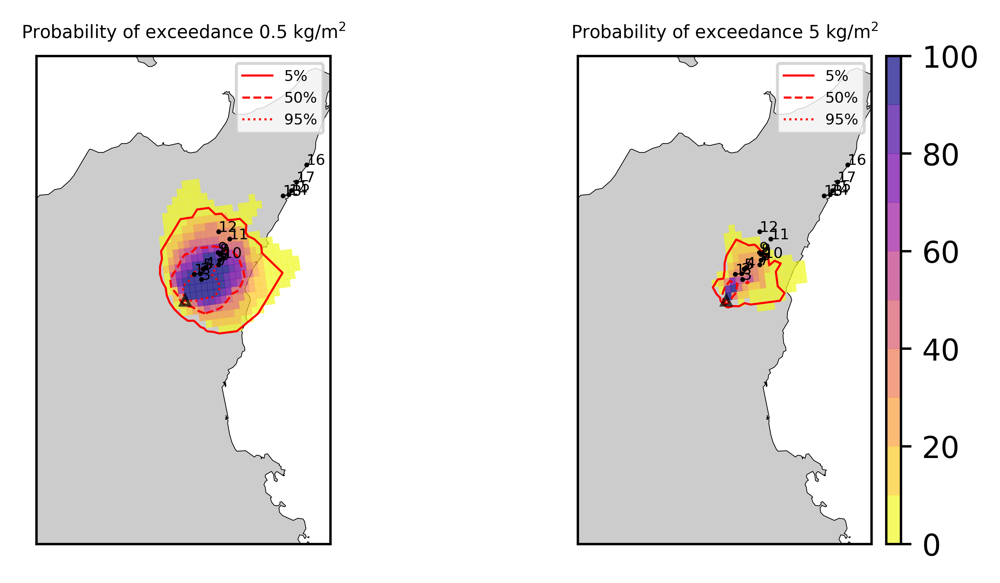  
  
  
  
  
  
  
  
  
  
  
  
  
  
  
  
  

|Location|Ground load [kg/m²] 5th perc|Ground load [kg/m²] 50th perc|Ground load [kg/m²] 95th perc|
| :--- | :--- | :--- | :--- |
|Piano Provenzana (1)|7.79e-01|3.29e+00|7.95e+00|
|Bivio Provenzana-Linguaglossa (2)|1.42e+00|3.52e+00|9.82e+00|
|Cunetta pre-Citelli (3)|2.95e+00|4.79e+00|7.71e+00|
|Chalet (4)|6.56e-01|2.66e+00|1.27e+01|
|Ragabo (5)|9.60e-01|2.59e+00|1.20e+01|
|Scilio (6)|3.21e-01|1.72e+00|6.63e+00|
|Gambino vini (7)|5.07e-01|2.53e+00|7.97e+00|
|StazioneFce Linguaglossa (8)|1.27e-01|1.01e+00|5.47e+00|
|Linguaglossa Via Olivio Sozzi (9)|1.05e-01|9.18e-01|4.89e+00|
|Cim.Linguaglossa (10)|1.95e-01|1.20e+00|5.44e+00|
|Gole Bar (11)|2.41e-02|1.72e-01|1.68e+00|
|Francavilla - Orange (12)|1.43e-02|7.84e-02|1.77e+00|
|Roccalumera1 (13)|0.00e+00|0.00e+00|2.02e-04|
|Roccalumera2 (14)|0.00e+00|0.00e+00|2.09e-05|
|Nizza (15)|0.00e+00|0.00e+00|0.00e+00|
|Scaletta Zanclea (16)|0.00e+00|0.00e+00|0.00e+00|
|Alì (17)|0.00e+00|0.00e+00|0.00e+00|
  

### Atmosphere 2021-03-04 09:20 Z
  
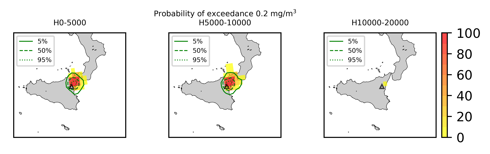
## Forecast at 2021-03-04 10:20 Z from RED VONA issued at 20210304_0817Z
  

|Eruption start [Z]|Eruption end [Z]|Forecast time [Z]|Column height asl [m]|
| :--- | :--- | :--- | :--- |
|2021-03-04 02:30:00|Ongoing|2021-03-04 10:20:00|11000 ± 500 - from VONA|
  
  

|Percentile|MER [kg/s¹]|Mass air [kg]|Mass air nested dom. [kg]|Mass grd [kg]|Mass grd nested dom. [kg]|
| :--- | :--- | :--- | :--- | :--- | :--- |
|5th|2.38e+05|1.15e+09|1.15e+09|2.17e+09|2.16e+09|
|50th|1.19e+06|2.14e+09|1.99e+09|4.14e+09|4.13e+09|
|95th|2.24e+06|4.19e+09|3.99e+09|6.57e+09|6.56e+09|
  

### Ground Nested Domain 2021-03-04 10:20 Z
  
  
  
  
  
  
  
  
  
  
  
  
  
  
  
  
  
  

|Location|Ground load [kg/m²] 5th perc|Ground load [kg/m²] 50th perc|Ground load [kg/m²] 95th perc|
| :--- | :--- | :--- | :--- |
|Piano Provenzana (1)|4.14e+00|9.15e+00|1.44e+01|
|Bivio Provenzana-Linguaglossa (2)|5.42e+00|1.04e+01|1.65e+01|
|Cunetta pre-Citelli (3)|7.35e+00|1.13e+01|1.68e+01|
|Chalet (4)|3.83e+00|9.72e+00|1.80e+01|
|Ragabo (5)|4.01e+00|9.79e+00|1.77e+01|
|Scilio (6)|2.34e+00|7.47e+00|1.44e+01|
|Gambino vini (7)|2.96e+00|8.80e+00|1.58e+01|
|StazioneFce Linguaglossa (8)|1.45e+00|6.81e+00|1.18e+01|
|Linguaglossa Via Olivio Sozzi (9)|1.28e+00|6.40e+00|1.09e+01|
|Cim.Linguaglossa (10)|1.88e+00|6.45e+00|1.38e+01|
|Gole Bar (11)|4.06e-01|2.16e+00|5.00e+00|
|Francavilla - Orange (12)|2.26e-01|1.75e+00|4.80e+00|
|Roccalumera1 (13)|1.01e-05|1.48e-02|2.79e-01|
|Roccalumera2 (14)|0.00e+00|5.34e-03|1.71e-01|
|Nizza (15)|0.00e+00|5.43e-03|1.35e-01|
|Scaletta Zanclea (16)|0.00e+00|0.00e+00|2.79e-02|
|Alì (17)|0.00e+00|1.41e-03|8.96e-02|
  

### Atmosphere 2021-03-04 10:20 Z
  
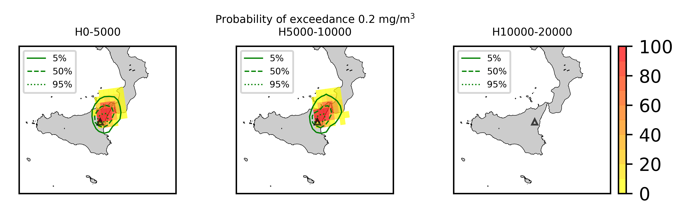
## Forecast at 2021-03-04 11:20 Z from RED VONA issued at 20210304_0817Z
  

|Eruption start [Z]|Eruption end [Z]|Forecast time [Z]|Column height asl [m]|
| :--- | :--- | :--- | :--- |
|2021-03-04 02:30:00|Ongoing|2021-03-04 11:20:00|11000 ± 500 - from VONA|
  
  

|Percentile|MER [kg/s¹]|Mass air [kg]|Mass air nested dom. [kg]|Mass grd [kg]|Mass grd nested dom. [kg]|
| :--- | :--- | :--- | :--- | :--- | :--- |
|5th|2.82e+05|1.38e+09|1.32e+09|4.66e+09|4.65e+09|
|50th|1.02e+06|3.01e+09|2.67e+09|7.22e+09|7.20e+09|
|95th|2.53e+06|5.81e+09|4.86e+09|1.04e+10|1.03e+10|
  

### Ground Nested Domain 2021-03-04 11:20 Z
  
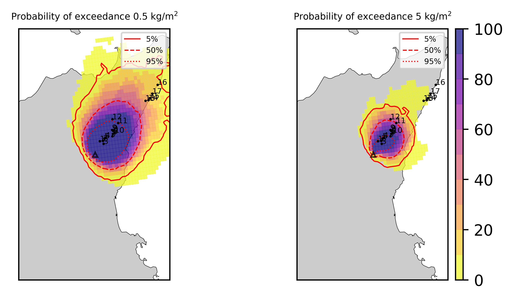  
  
  
  
  
  
  
  
  
  
  
  
  
  
  
  
  

|Location|Ground load [kg/m²] 5th perc|Ground load [kg/m²] 50th perc|Ground load [kg/m²] 95th perc|
| :--- | :--- | :--- | :--- |
|Piano Provenzana (1)|8.79e+00|1.39e+01|2.30e+01|
|Bivio Provenzana-Linguaglossa (2)|1.07e+01|1.52e+01|2.51e+01|
|Cunetta pre-Citelli (3)|1.05e+01|1.79e+01|2.49e+01|
|Chalet (4)|7.55e+00|1.53e+01|2.87e+01|
|Ragabo (5)|8.50e+00|1.52e+01|2.73e+01|
|Scilio (6)|5.59e+00|1.40e+01|2.37e+01|
|Gambino vini (7)|7.03e+00|1.59e+01|2.53e+01|
|StazioneFce Linguaglossa (8)|3.65e+00|1.01e+01|2.26e+01|
|Linguaglossa Via Olivio Sozzi (9)|3.04e+00|1.04e+01|2.07e+01|
|Cim.Linguaglossa (10)|4.83e+00|1.21e+01|2.13e+01|
|Gole Bar (11)|1.25e+00|4.25e+00|1.12e+01|
|Francavilla - Orange (12)|4.56e-01|4.03e+00|9.07e+00|
|Roccalumera1 (13)|7.60e-04|1.87e-01|8.66e-01|
|Roccalumera2 (14)|1.96e-04|1.33e-01|8.33e-01|
|Nizza (15)|1.63e-04|1.03e-01|8.17e-01|
|Scaletta Zanclea (16)|0.00e+00|2.81e-02|2.23e-01|
|Alì (17)|6.72e-06|9.12e-02|4.96e-01|
  

### Atmosphere 2021-03-04 11:20 Z
  
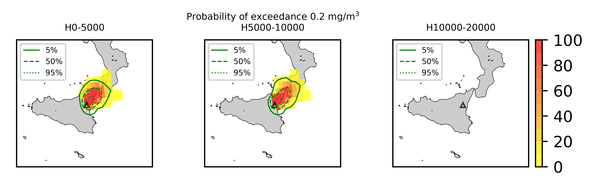
## Forecast at 2021-03-04 14:20 Z from RED VONA issued at 20210304_0817Z
  

|Eruption start [Z]|Eruption end [Z]|Forecast time [Z]|Column height asl [m]|
| :--- | :--- | :--- | :--- |
|2021-03-04 02:30:00|Ongoing|2021-03-04 14:20:00|11000 ± 500 - from VONA|
  
  

|Percentile|MER [kg/s¹]|Mass air [kg]|Mass air nested dom. [kg]|Mass grd [kg]|Mass grd nested dom. [kg]|
| :--- | :--- | :--- | :--- | :--- | :--- |
|5th|2.95e+05|1.45e+09|1.29e+09|1.12e+10|1.07e+10|
|50th|1.16e+06|3.98e+09|2.51e+09|1.84e+10|1.77e+10|
|95th|2.37e+06|9.01e+09|6.39e+09|2.70e+10|2.60e+10|
  

### Ground Nested Domain 2021-03-04 14:20 Z
  
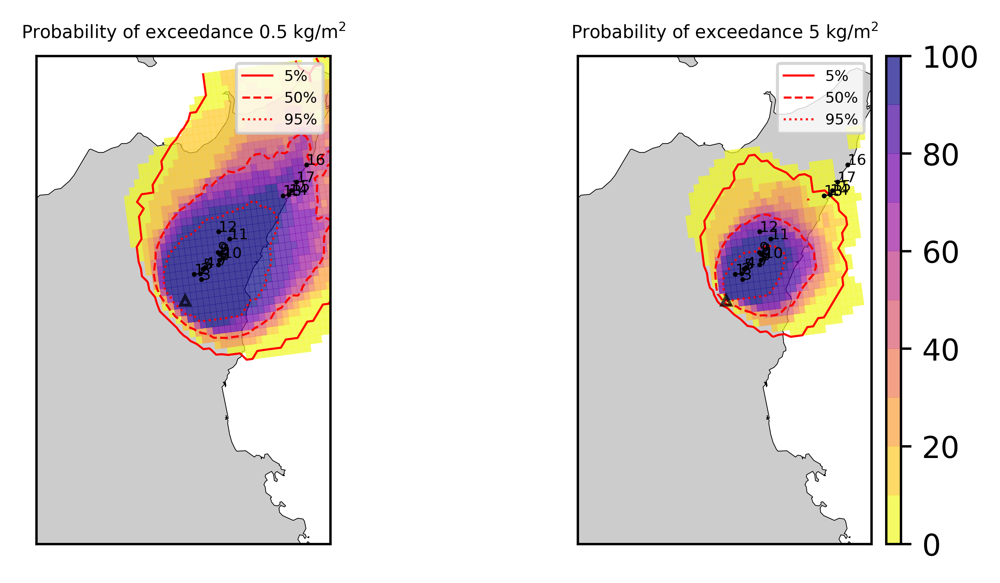  
  
  
  
  
  
  
  
  
  
  
  
  
  
  
  
  

|Location|Ground load [kg/m²] 5th perc|Ground load [kg/m²] 50th perc|Ground load [kg/m²] 95th perc|
| :--- | :--- | :--- | :--- |
|Piano Provenzana (1)|1.65e+01|2.93e+01|5.29e+01|
|Bivio Provenzana-Linguaglossa (2)|1.85e+01|3.04e+01|5.10e+01|
|Cunetta pre-Citelli (3)|2.11e+01|3.34e+01|5.78e+01|
|Chalet (4)|1.56e+01|2.95e+01|4.99e+01|
|Ragabo (5)|1.56e+01|3.02e+01|5.03e+01|
|Scilio (6)|1.02e+01|2.74e+01|4.92e+01|
|Gambino vini (7)|1.30e+01|2.92e+01|5.10e+01|
|StazioneFce Linguaglossa (8)|7.73e+00|2.48e+01|4.54e+01|
|Linguaglossa Via Olivio Sozzi (9)|7.22e+00|2.27e+01|4.43e+01|
|Cim.Linguaglossa (10)|8.66e+00|2.55e+01|4.79e+01|
|Gole Bar (11)|3.00e+00|1.19e+01|3.39e+01|
|Francavilla - Orange (12)|1.90e+00|1.12e+01|2.71e+01|
|Roccalumera1 (13)|3.51e-01|1.20e+00|5.16e+00|
|Roccalumera2 (14)|2.33e-01|7.57e-01|5.10e+00|
|Nizza (15)|2.09e-01|1.02e+00|4.80e+00|
|Scaletta Zanclea (16)|8.20e-02|5.57e-01|2.06e+00|
|Alì (17)|2.03e-01|1.21e+00|4.10e+00|
  

### Atmosphere 2021-03-04 14:20 Z
  
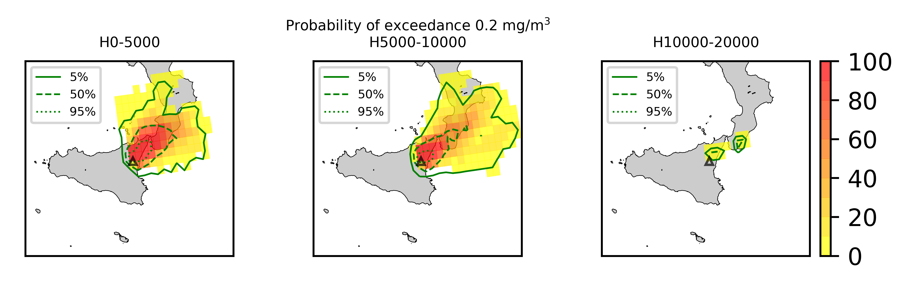
## Forecast at 2021-03-04 17:20 Z from RED VONA issued at 20210304_0817Z
  

|Eruption start [Z]|Eruption end [Z]|Forecast time [Z]|Column height asl [m]|
| :--- | :--- | :--- | :--- |
|2021-03-04 02:30:00|Ongoing|2021-03-04 17:20:00|11000 ± 500 - from VONA|
  
  

|Percentile|MER [kg/s¹]|Mass air [kg]|Mass air nested dom. [kg]|Mass grd [kg]|Mass grd nested dom. [kg]|
| :--- | :--- | :--- | :--- | :--- | :--- |
|5th|3.40e+05|1.83e+09|1.20e+09|2.10e+10|1.93e+10|
|50th|1.06e+06|4.18e+09|2.63e+09|2.87e+10|2.97e+10|
|95th|2.66e+06|1.23e+10|6.90e+09|4.02e+10|3.81e+10|
  

### Ground Nested Domain 2021-03-04 17:20 Z
  
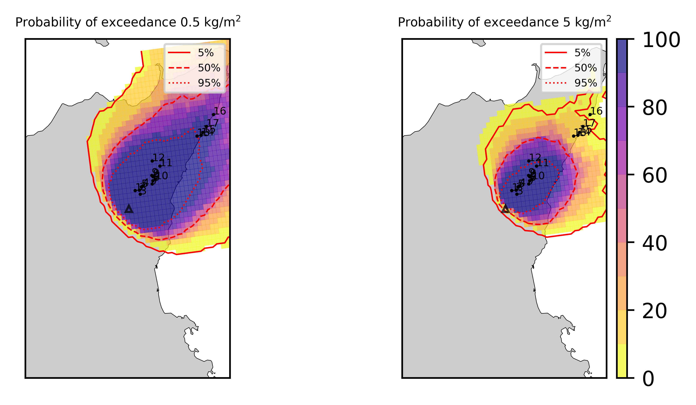  
  
  
  
  
  
  
  
  
  
  
  
  
  
  
  
  

|Location|Ground load [kg/m²] 5th perc|Ground load [kg/m²] 50th perc|Ground load [kg/m²] 95th perc|
| :--- | :--- | :--- | :--- |
|Piano Provenzana (1)|2.20e+01|3.76e+01|6.64e+01|
|Bivio Provenzana-Linguaglossa (2)|3.27e+01|4.08e+01|8.19e+01|
|Cunetta pre-Citelli (3)|3.54e+01|5.21e+01|1.04e+02|
|Chalet (4)|2.66e+01|3.72e+01|7.17e+01|
|Ragabo (5)|2.72e+01|3.71e+01|7.16e+01|
|Scilio (6)|2.20e+01|3.80e+01|7.17e+01|
|Gambino vini (7)|2.69e+01|3.83e+01|7.74e+01|
|StazioneFce Linguaglossa (8)|1.72e+01|3.46e+01|5.91e+01|
|Linguaglossa Via Olivio Sozzi (9)|1.54e+01|3.49e+01|5.80e+01|
|Cim.Linguaglossa (10)|2.11e+01|3.61e+01|6.70e+01|
|Gole Bar (11)|8.21e+00|2.27e+01|4.47e+01|
|Francavilla - Orange (12)|3.99e+00|2.07e+01|4.00e+01|
|Roccalumera1 (13)|5.69e-01|2.12e+00|7.81e+00|
|Roccalumera2 (14)|4.25e-01|1.90e+00|6.79e+00|
|Nizza (15)|3.67e-01|1.71e+00|6.57e+00|
|Scaletta Zanclea (16)|2.63e-01|1.24e+00|3.60e+00|
|Alì (17)|2.83e-01|1.54e+00|5.95e+00|
  

### Atmosphere 2021-03-04 17:20 Z
  
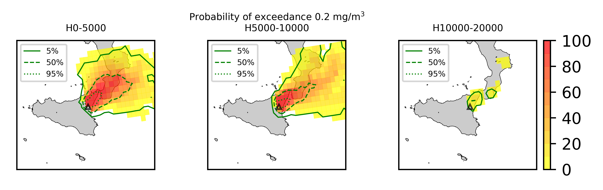
## Forecast at 2021-03-04 10:20 Z from RED VONA issued at 20210304_1016Z
  

|Eruption start [Z]|Eruption end [Z]|Forecast time [Z]|Column height asl [m]|
| :--- | :--- | :--- | :--- |
|2021-03-04 02:30:00|Ongoing|2021-03-04 10:20:00|11000.0 ± 500 - from VONA|
  
  

|Percentile|MER [kg/s¹]|Mass air [kg]|Mass air nested dom. [kg]|Mass grd [kg]|Mass grd nested dom. [kg]|
| :--- | :--- | :--- | :--- | :--- | :--- |
|5th|3.51e+05|7.53e+08|7.52e+08|2.43e+09|2.43e+09|
|50th|9.10e+05|2.47e+09|2.45e+09|3.57e+09|3.56e+09|
|95th|2.18e+06|4.56e+09|4.54e+09|8.27e+09|8.24e+09|
  

### Ground Nested Domain 2021-03-04 10:20 Z
  
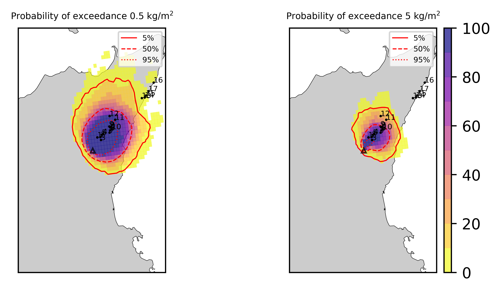  
  
  
  
  
  
  
  
  
  
  
  
  
  
  
  
  

|Location|Ground load [kg/m²] 5th perc|Ground load [kg/m²] 50th perc|Ground load [kg/m²] 95th perc|
| :--- | :--- | :--- | :--- |
|Piano Provenzana (1)|4.82e+00|9.99e+00|1.65e+01|
|Bivio Provenzana-Linguaglossa (2)|5.81e+00|9.98e+00|1.70e+01|
|Cunetta pre-Citelli (3)|7.77e+00|1.10e+01|1.38e+01|
|Chalet (4)|4.30e+00|1.01e+01|1.75e+01|
|Ragabo (5)|4.62e+00|1.01e+01|1.67e+01|
|Scilio (6)|2.14e+00|6.66e+00|1.80e+01|
|Gambino vini (7)|2.53e+00|6.99e+00|1.91e+01|
|StazioneFce Linguaglossa (8)|1.14e+00|5.09e+00|1.77e+01|
|Linguaglossa Via Olivio Sozzi (9)|9.90e-01|5.51e+00|1.66e+01|
|Cim.Linguaglossa (10)|1.59e+00|5.55e+00|1.73e+01|
|Gole Bar (11)|2.07e-01|1.67e+00|8.78e+00|
|Francavilla - Orange (12)|1.11e-01|1.65e+00|6.71e+00|
|Roccalumera1 (13)|0.00e+00|3.71e-03|4.95e-01|
|Roccalumera2 (14)|0.00e+00|6.82e-03|3.26e-01|
|Nizza (15)|0.00e+00|2.47e-03|2.16e-01|
|Scaletta Zanclea (16)|0.00e+00|1.61e-05|2.87e-02|
|Alì (17)|0.00e+00|2.58e-03|3.51e-02|
  

### Atmosphere 2021-03-04 10:20 Z
  
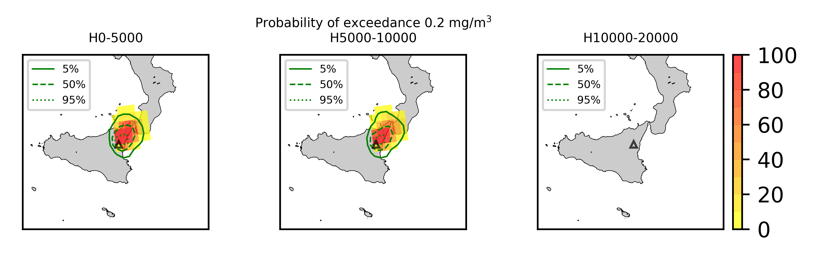  
Go to [Supplementary page](Supplementary_page.md)  
Go to [Main directory](https://github.com/federicapardini/Real_time_ash_forecast)