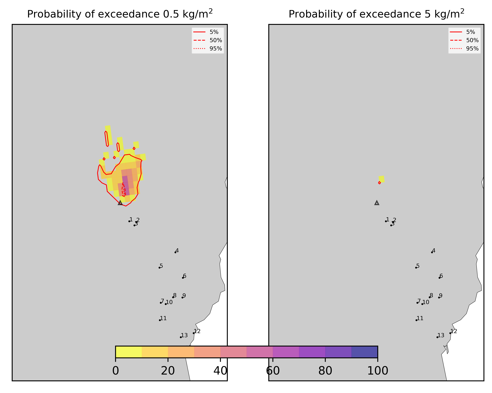
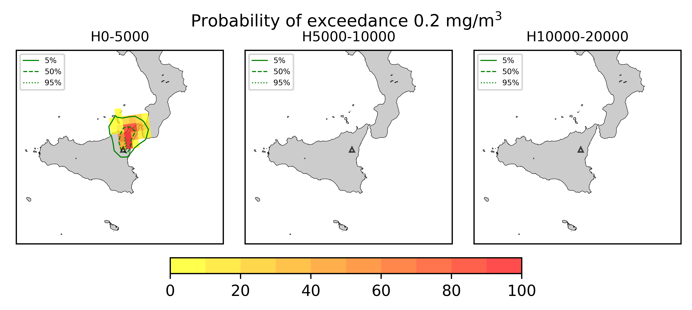
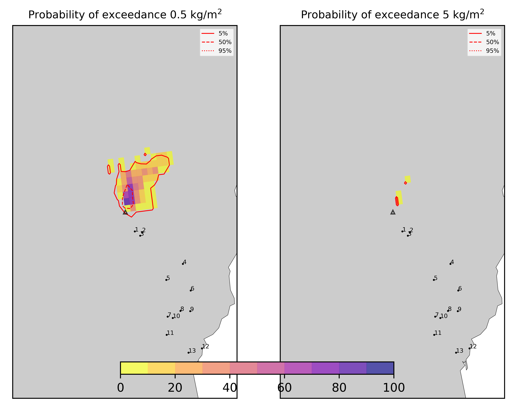

Forecast from VONA bulletin - 20210304_0228Z
============================================

Contents
========

* [Forecast products](#forecast-products)
	* [Forecast at 2021-03-04 05:30 Z - Ongoing Eruption](#forecast-at-2021-03-04-0530-z---ongoing-eruption)
	* [Forecast at 2021-03-04 08:30 Z - Ongoing Eruption](#forecast-at-2021-03-04-0830-z---ongoing-eruption)
	* [Forecast at 2021-03-04 11:30 Z - Ongoing Eruption](#forecast-at-2021-03-04-1130-z---ongoing-eruption)
	* [Forecast at 2021-03-04 14:30 Z - Ongoing Eruption](#forecast-at-2021-03-04-1430-z---ongoing-eruption)

# Forecast products

## Forecast at 2021-03-04 05:30 Z - Ongoing Eruption
  

|Eruption start [Z]|Eruption end [Z]|Forecast time [Z]|Column height asl [m]|
| :--- | :--- | :--- | :--- |
|2021-03-04 02:30:00|Ongoing|2021-03-04 05:30:00|5000 ± 500 - from VONA|
  
  

|Percentile|MER [kg/s¹]|Mass air [kg]|Mass air nested dom. [kg]|Mass grd [kg]|Mass grd nested dom. [kg]|
| :--- | :--- | :--- | :--- | :--- | :--- |
|5th|3.05e+02|3.42e+06|3.25e+06|2.76e+05|2.81e+05|
|50th|2.95e+03|2.67e+07|2.60e+07|4.89e+06|4.91e+06|
|95th|9.66e+03|7.12e+07|6.66e+07|2.13e+07|6.66e+07|
  

### Ground Nested Domain 2021-03-04 05:30 Z
  
  
  
  
  
  
  
  
  
  
  
  
  
  

|Location|Ground load [kg/m²] 5th perc|Ground load [kg/m²] 50th perc|Ground load [kg/m²] 95th perc|
| :--- | :--- | :--- | :--- |
|Schiena Asino (1)|0.00e+00|0.00e+00|5.63e-03|
|Rif.Vescovo (2)|0.00e+00|0.00e+00|4.96e-03|
|Serra Pituzza (3)|0.00e+00|0.00e+00|2.70e-03|
|Monterosso (4)|0.00e+00|0.00e+00|0.00e+00|
|Cim.Pedara (5)|0.00e+00|0.00e+00|0.00e+00|
|Cim.Viagrande (6)|0.00e+00|0.00e+00|0.00e+00|
|Cim.Mascalucia (7)|0.00e+00|0.00e+00|0.00e+00|
|Cim.Tremestieri (8)|0.00e+00|0.00e+00|0.00e+00|
|Cim.S.Giov.La Punta (9)|0.00e+00|0.00e+00|0.00e+00|
|Cim.Gravina (10)|0.00e+00|0.00e+00|0.00e+00|
|ENI S.Giov.Galermo (11)|0.00e+00|0.00e+00|0.00e+00|
|Bio Piazza Europa (12)|0.00e+00|0.00e+00|0.00e+00|
|INGV-OE (13)|0.00e+00|0.00e+00|0.00e+00|
  

### Atmosphere 2021-03-04 05:30 Z
  

## Forecast at 2021-03-04 08:30 Z - Ongoing Eruption
  

|Eruption start [Z]|Eruption end [Z]|Forecast time [Z]|Column height asl [m]|
| :--- | :--- | :--- | :--- |
|2021-03-04 02:30:00|Ongoing|2021-03-04 08:30:00|5000 ± 500 - from VONA|
  
  

|Percentile|MER [kg/s¹]|Mass air [kg]|Mass air nested dom. [kg]|Mass grd [kg]|Mass grd nested dom. [kg]|
| :--- | :--- | :--- | :--- | :--- | :--- |
|5th|3.95e+02|9.58e+06|5.39e+06|2.43e+06|2.45e+06|
|50th|1.49e+03|4.13e+07|2.39e+07|9.88e+06|9.89e+06|
|95th|7.97e+03|9.07e+07|5.38e+07|3.39e+07|5.38e+07|
  

### Ground Nested Domain 2021-03-04 08:30 Z
  
  
  
  
  
  
  
  
  
  
  
  
  
  

|Location|Ground load [kg/m²] 5th perc|Ground load [kg/m²] 50th perc|Ground load [kg/m²] 95th perc|
| :--- | :--- | :--- | :--- |
|Schiena Asino (1)|0.00e+00|2.32e-07|4.13e-03|
|Rif.Vescovo (2)|0.00e+00|0.00e+00|3.62e-03|
|Serra Pituzza (3)|0.00e+00|0.00e+00|1.92e-03|
|Monterosso (4)|0.00e+00|0.00e+00|0.00e+00|
|Cim.Pedara (5)|0.00e+00|0.00e+00|0.00e+00|
|Cim.Viagrande (6)|0.00e+00|0.00e+00|0.00e+00|
|Cim.Mascalucia (7)|0.00e+00|0.00e+00|0.00e+00|
|Cim.Tremestieri (8)|0.00e+00|0.00e+00|0.00e+00|
|Cim.S.Giov.La Punta (9)|0.00e+00|0.00e+00|0.00e+00|
|Cim.Gravina (10)|0.00e+00|0.00e+00|0.00e+00|
|ENI S.Giov.Galermo (11)|0.00e+00|0.00e+00|0.00e+00|
|Bio Piazza Europa (12)|0.00e+00|0.00e+00|0.00e+00|
|INGV-OE (13)|0.00e+00|0.00e+00|0.00e+00|
  

### Atmosphere 2021-03-04 08:30 Z
  

## Forecast at 2021-03-04 11:30 Z - Ongoing Eruption
  

|Eruption start [Z]|Eruption end [Z]|Forecast time [Z]|Column height asl [m]|
| :--- | :--- | :--- | :--- |
|2021-03-04 02:30:00|Ongoing|2021-03-04 11:30:00|5000 ± 500 - from VONA|
  
  

|Percentile|MER [kg/s¹]|Mass air [kg]|Mass air nested dom. [kg]|Mass grd [kg]|Mass grd nested dom. [kg]|
| :--- | :--- | :--- | :--- | :--- | :--- |
|5th|3.08e+02|1.97e+07|1.03e+07|3.03e+06|3.07e+06|
|50th|2.51e+03|7.55e+07|3.46e+07|1.64e+07|1.62e+07|
|95th|9.60e+03|1.20e+08|7.41e+07|4.23e+07|7.41e+07|
  

### Ground Nested Domain 2021-03-04 11:30 Z
  
  
  
  
  
  
  
  
  
  
  
  
  
  

|Location|Ground load [kg/m²] 5th perc|Ground load [kg/m²] 50th perc|Ground load [kg/m²] 95th perc|
| :--- | :--- | :--- | :--- |
|Schiena Asino (1)|0.00e+00|2.32e-07|4.13e-03|
|Rif.Vescovo (2)|0.00e+00|0.00e+00|3.62e-03|
|Serra Pituzza (3)|0.00e+00|0.00e+00|1.92e-03|
|Monterosso (4)|0.00e+00|0.00e+00|0.00e+00|
|Cim.Pedara (5)|0.00e+00|0.00e+00|0.00e+00|
|Cim.Viagrande (6)|0.00e+00|0.00e+00|0.00e+00|
|Cim.Mascalucia (7)|0.00e+00|0.00e+00|0.00e+00|
|Cim.Tremestieri (8)|0.00e+00|0.00e+00|0.00e+00|
|Cim.S.Giov.La Punta (9)|0.00e+00|0.00e+00|0.00e+00|
|Cim.Gravina (10)|0.00e+00|0.00e+00|0.00e+00|
|ENI S.Giov.Galermo (11)|0.00e+00|0.00e+00|0.00e+00|
|Bio Piazza Europa (12)|0.00e+00|0.00e+00|0.00e+00|
|INGV-OE (13)|0.00e+00|0.00e+00|0.00e+00|
  

### Atmosphere 2021-03-04 11:30 Z
  

## Forecast at 2021-03-04 14:30 Z - Ongoing Eruption
  

|Eruption start [Z]|Eruption end [Z]|Forecast time [Z]|Column height asl [m]|
| :--- | :--- | :--- | :--- |
|2021-03-04 02:30:00|Ongoing|2021-03-04 14:30:00|5000 ± 500 - from VONA|
  
  

|Percentile|MER [kg/s¹]|Mass air [kg]|Mass air nested dom. [kg]|Mass grd [kg]|Mass grd nested dom. [kg]|
| :--- | :--- | :--- | :--- | :--- | :--- |
|5th|3.85e+02|4.79e+07|1.83e+07|4.07e+06|4.10e+06|
|50th|5.53e+03|1.17e+08|4.46e+07|2.68e+07|2.62e+07|
|95th|2.36e+04|2.76e+08|1.01e+08|7.34e+07|1.01e+08|
  

### Ground Nested Domain 2021-03-04 14:30 Z
  
  
  
  
  
  
  
  
  
  
  
  
  
  

|Location|Ground load [kg/m²] 5th perc|Ground load [kg/m²] 50th perc|Ground load [kg/m²] 95th perc|
| :--- | :--- | :--- | :--- |
|Schiena Asino (1)|0.00e+00|4.64e-07|4.13e-03|
|Rif.Vescovo (2)|0.00e+00|0.00e+00|3.62e-03|
|Serra Pituzza (3)|0.00e+00|0.00e+00|1.92e-03|
|Monterosso (4)|0.00e+00|0.00e+00|0.00e+00|
|Cim.Pedara (5)|0.00e+00|0.00e+00|0.00e+00|
|Cim.Viagrande (6)|0.00e+00|0.00e+00|0.00e+00|
|Cim.Mascalucia (7)|0.00e+00|0.00e+00|0.00e+00|
|Cim.Tremestieri (8)|0.00e+00|0.00e+00|0.00e+00|
|Cim.S.Giov.La Punta (9)|0.00e+00|0.00e+00|0.00e+00|
|Cim.Gravina (10)|0.00e+00|0.00e+00|0.00e+00|
|ENI S.Giov.Galermo (11)|0.00e+00|0.00e+00|0.00e+00|
|Bio Piazza Europa (12)|0.00e+00|0.00e+00|0.00e+00|
|INGV-OE (13)|0.00e+00|0.00e+00|0.00e+00|
  

### Atmosphere 2021-03-04 14:30 Z
  
  
Go to [Supplementary page](Supplementary_page.md)  
Go to [Main directory](https://github.com/federicapardini/Real_time_ash_forecast)