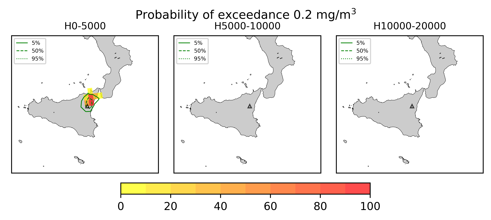

Forecast from VONA_20210304_0228Z
=================================

Contents
========

* [Forecast products](#forecast-products)
	* [Forecast at 2021-03-04 03:30 Z - Ongoing Eruption](#forecast-at-2021-03-04-0330-z---ongoing-eruption)
	* [Forecast at 2021-03-04 04:30 Z - Ongoing Eruption](#forecast-at-2021-03-04-0430-z---ongoing-eruption)
	* [Forecast at 2021-03-04 05:30 Z - Ongoing Eruption](#forecast-at-2021-03-04-0530-z---ongoing-eruption)
	* [Forecast at 2021-03-04 08:30 Z - Ongoing Eruption](#forecast-at-2021-03-04-0830-z---ongoing-eruption)
	* [Forecast at 2021-03-04 11:30 Z - Ongoing Eruption](#forecast-at-2021-03-04-1130-z---ongoing-eruption)
	* [Forecast at 2021-03-04 09:20 Z - Ongoing Eruption](#forecast-at-2021-03-04-0920-z---ongoing-eruption)

# Forecast products

## Forecast at 2021-03-04 03:30 Z - Ongoing Eruption
  

|Eruption start [Z]|Eruption end [Z]|Forecast time [Z]|Column height asl [m]|
| :--- | :--- | :--- | :--- |
|2021-03-04 02:30:00|Ongoing|2021-03-04 03:30:00|9000 ± 500 - from VONA|
  
  

|Percentile|MER [kg/s¹]|Mass air [kg]|Mass air nested dom. [kg]|Mass grd [kg]|Mass grd nested dom. [kg]|
| :--- | :--- | :--- | :--- | :--- | :--- |
|5th|1.68e+04|5.51e+07|5.51e+07|1.17e+05|1.28e+05|
|50th|3.50e+04|1.23e+08|1.23e+08|9.19e+06|9.19e+06|
|95th|7.36e+04|1.92e+08|1.92e+08|3.03e+07|1.92e+08|
  

### Ground Nested Domain 2021-03-04 03:30 Z
  
  
  
  
  
  
  
  
  
  
  
  
  
  
  
  
  
  

|Location|Ground load [kg/m²] 5th perc|Ground load [kg/m²] 50th perc|Ground load [kg/m²] 95th perc|
| :--- | :--- | :--- | :--- |
|Piano Provenzana (1)|4.46e-05|1.96e-02|1.29e-01|
|Bivio Provenzana-Linguaglossa (2)|2.44e-05|1.11e-02|1.00e-01|
|Cunetta pre-Citelli (3)|8.62e-05|9.19e-03|1.68e-01|
|Chalet (4)|0.00e+00|6.97e-04|4.35e-02|
|Ragabo (5)|0.00e+00|2.61e-03|5.54e-02|
|Scilio (6)|0.00e+00|3.48e-05|4.57e-03|
|Gambino vini (7)|0.00e+00|1.10e-04|9.73e-03|
|StazioneFce Linguaglossa (8)|0.00e+00|0.00e+00|1.20e-03|
|Linguaglossa Via Olivio Sozzi (9)|0.00e+00|0.00e+00|1.07e-03|
|Cim.Linguaglossa (10)|0.00e+00|0.00e+00|1.50e-03|
|Gole Bar (11)|0.00e+00|0.00e+00|1.27e-05|
|Francavilla - Orange (12)|0.00e+00|0.00e+00|3.93e-06|
|Roccalumera1 (13)|0.00e+00|0.00e+00|0.00e+00|
|Roccalumera2 (14)|0.00e+00|0.00e+00|0.00e+00|
|Nizza (15)|0.00e+00|0.00e+00|0.00e+00|
|Scaletta Zanclea (16)|0.00e+00|0.00e+00|0.00e+00|
|Alì (17)|0.00e+00|0.00e+00|0.00e+00|
  

### Atmosphere 2021-03-04 03:30 Z
  

## Forecast at 2021-03-04 04:30 Z - Ongoing Eruption
  

|Eruption start [Z]|Eruption end [Z]|Forecast time [Z]|Column height asl [m]|
| :--- | :--- | :--- | :--- |
|2021-03-04 02:30:00|Ongoing|2021-03-04 04:30:00|9000 ± 500 - from VONA|
  
  

|Percentile|MER [kg/s¹]|Mass air [kg]|Mass air nested dom. [kg]|Mass grd [kg]|Mass grd nested dom. [kg]|
| :--- | :--- | :--- | :--- | :--- | :--- |
|5th|1.80e+04|5.77e+07|5.76e+07|1.53e+06|1.54e+06|
|50th|4.49e+04|1.46e+08|1.45e+08|1.72e+07|1.72e+07|
|95th|1.01e+05|3.16e+08|3.15e+08|3.62e+07|3.15e+08|
  

### Ground Nested Domain 2021-03-04 04:30 Z
  
  
  
  
  
  
  
  
  
  
  
  
  
  
  
  
  
  

|Location|Ground load [kg/m²] 5th perc|Ground load [kg/m²] 50th perc|Ground load [kg/m²] 95th perc|
| :--- | :--- | :--- | :--- |
|Piano Provenzana (1)|1.90e-03|5.35e-02|1.91e-01|
|Bivio Provenzana-Linguaglossa (2)|2.21e-03|3.39e-02|1.83e-01|
|Cunetta pre-Citelli (3)|7.47e-03|5.91e-02|2.31e-01|
|Chalet (4)|0.00e+00|6.91e-03|7.24e-02|
|Ragabo (5)|2.95e-04|1.27e-02|6.69e-02|
|Scilio (6)|0.00e+00|6.69e-04|1.04e-02|
|Gambino vini (7)|0.00e+00|1.62e-03|1.65e-02|
|StazioneFce Linguaglossa (8)|0.00e+00|1.47e-04|3.71e-03|
|Linguaglossa Via Olivio Sozzi (9)|0.00e+00|9.08e-05|2.76e-03|
|Cim.Linguaglossa (10)|0.00e+00|2.70e-04|5.11e-03|
|Gole Bar (11)|0.00e+00|0.00e+00|3.79e-05|
|Francavilla - Orange (12)|0.00e+00|0.00e+00|8.84e-06|
|Roccalumera1 (13)|0.00e+00|0.00e+00|0.00e+00|
|Roccalumera2 (14)|0.00e+00|0.00e+00|0.00e+00|
|Nizza (15)|0.00e+00|0.00e+00|0.00e+00|
|Scaletta Zanclea (16)|0.00e+00|0.00e+00|0.00e+00|
|Alì (17)|0.00e+00|0.00e+00|0.00e+00|
  

### Atmosphere 2021-03-04 04:30 Z
  

## Forecast at 2021-03-04 05:30 Z - Ongoing Eruption
  

|Eruption start [Z]|Eruption end [Z]|Forecast time [Z]|Column height asl [m]|
| :--- | :--- | :--- | :--- |
|2021-03-04 02:30:00|Ongoing|2021-03-04 05:30:00|9000 ± 500 - from VONA|
  
  

|Percentile|MER [kg/s¹]|Mass air [kg]|Mass air nested dom. [kg]|Mass grd [kg]|Mass grd nested dom. [kg]|
| :--- | :--- | :--- | :--- | :--- | :--- |
|5th|1.85e+04|5.78e+07|5.77e+07|4.18e+06|4.19e+06|
|50th|3.94e+04|1.23e+08|1.23e+08|2.64e+07|2.63e+07|
|95th|1.51e+05|4.28e+08|4.27e+08|5.36e+07|4.27e+08|
  

### Ground Nested Domain 2021-03-04 05:30 Z
  
  
  
  
  
  
  
  
  
  
  
  
  
  
  
  
  
  

|Location|Ground load [kg/m²] 5th perc|Ground load [kg/m²] 50th perc|Ground load [kg/m²] 95th perc|
| :--- | :--- | :--- | :--- |
|Piano Provenzana (1)|7.76e-03|6.35e-02|2.28e-01|
|Bivio Provenzana-Linguaglossa (2)|2.58e-03|2.84e-02|2.00e-01|
|Cunetta pre-Citelli (3)|1.09e-02|7.09e-02|2.77e-01|
|Chalet (4)|1.21e-04|4.90e-03|4.73e-02|
|Ragabo (5)|4.87e-04|7.31e-03|5.88e-02|
|Scilio (6)|4.77e-06|2.97e-04|7.91e-03|
|Gambino vini (7)|1.49e-05|7.17e-04|1.55e-02|
|StazioneFce Linguaglossa (8)|0.00e+00|6.27e-05|2.78e-03|
|Linguaglossa Via Olivio Sozzi (9)|0.00e+00|5.97e-05|2.44e-03|
|Cim.Linguaglossa (10)|0.00e+00|7.63e-05|3.42e-03|
|Gole Bar (11)|0.00e+00|0.00e+00|4.48e-05|
|Francavilla - Orange (12)|0.00e+00|0.00e+00|8.84e-06|
|Roccalumera1 (13)|0.00e+00|0.00e+00|0.00e+00|
|Roccalumera2 (14)|0.00e+00|0.00e+00|0.00e+00|
|Nizza (15)|0.00e+00|0.00e+00|0.00e+00|
|Scaletta Zanclea (16)|0.00e+00|0.00e+00|0.00e+00|
|Alì (17)|0.00e+00|0.00e+00|0.00e+00|
  

### Atmosphere 2021-03-04 05:30 Z
  

## Forecast at 2021-03-04 08:30 Z - Ongoing Eruption
  

|Eruption start [Z]|Eruption end [Z]|Forecast time [Z]|Column height asl [m]|
| :--- | :--- | :--- | :--- |
|2021-03-04 02:30:00|Ongoing|2021-03-04 08:30:00|9000 ± 500 - from VONA|
  
  

|Percentile|MER [kg/s¹]|Mass air [kg]|Mass air nested dom. [kg]|Mass grd [kg]|Mass grd nested dom. [kg]|
| :--- | :--- | :--- | :--- | :--- | :--- |
|5th|1.78e+04|2.04e+08|2.04e+08|8.52e+06|8.52e+06|
|50th|5.00e+04|4.84e+08|4.80e+08|6.92e+07|6.91e+07|
|95th|1.65e+05|1.58e+09|1.25e+09|2.54e+08|1.25e+09|
  

### Ground Nested Domain 2021-03-04 08:30 Z
  
  
  
  
  
  
  
  
  
  
  
  
  
  
  
  
  
  

|Location|Ground load [kg/m²] 5th perc|Ground load [kg/m²] 50th perc|Ground load [kg/m²] 95th perc|
| :--- | :--- | :--- | :--- |
|Piano Provenzana (1)|7.07e-02|2.01e-01|1.10e+00|
|Bivio Provenzana-Linguaglossa (2)|1.97e-02|1.44e-01|1.32e+00|
|Cunetta pre-Citelli (3)|3.15e-02|2.32e-01|2.87e+00|
|Chalet (4)|2.07e-03|5.05e-02|1.20e+00|
|Ragabo (5)|4.66e-03|5.92e-02|1.09e+00|
|Scilio (6)|5.47e-04|6.48e-03|3.86e-01|
|Gambino vini (7)|5.19e-04|7.95e-03|5.91e-01|
|StazioneFce Linguaglossa (8)|2.44e-04|5.73e-03|2.30e-01|
|Linguaglossa Via Olivio Sozzi (9)|2.37e-04|5.20e-03|2.13e-01|
|Cim.Linguaglossa (10)|2.81e-04|4.40e-03|2.64e-01|
|Gole Bar (11)|1.27e-05|8.38e-04|5.57e-02|
|Francavilla - Orange (12)|2.95e-06|1.38e-03|5.07e-02|
|Roccalumera1 (13)|0.00e+00|0.00e+00|1.89e-04|
|Roccalumera2 (14)|0.00e+00|0.00e+00|1.06e-04|
|Nizza (15)|0.00e+00|0.00e+00|1.08e-05|
|Scaletta Zanclea (16)|0.00e+00|0.00e+00|0.00e+00|
|Alì (17)|0.00e+00|0.00e+00|0.00e+00|
  

### Atmosphere 2021-03-04 08:30 Z
  

## Forecast at 2021-03-04 11:30 Z - Ongoing Eruption
  

|Eruption start [Z]|Eruption end [Z]|Forecast time [Z]|Column height asl [m]|
| :--- | :--- | :--- | :--- |
|2021-03-04 02:30:00|Ongoing|2021-03-04 11:30:00|9000 ± 500 - from VONA|
  
  

|Percentile|MER [kg/s¹]|Mass air [kg]|Mass air nested dom. [kg]|Mass grd [kg]|Mass grd nested dom. [kg]|
| :--- | :--- | :--- | :--- | :--- | :--- |
|5th|2.29e+04|2.61e+08|2.61e+08|3.90e+07|3.90e+07|
|50th|8.51e+04|8.39e+08|7.36e+08|1.87e+08|1.87e+08|
|95th|4.37e+05|3.61e+09|1.95e+09|4.57e+08|1.95e+09|
  

### Ground Nested Domain 2021-03-04 11:30 Z
  
  
  
  
  
  
  
  
  
  
  
  
  
  
  
  
  
  

|Location|Ground load [kg/m²] 5th perc|Ground load [kg/m²] 50th perc|Ground load [kg/m²] 95th perc|
| :--- | :--- | :--- | :--- |
|Piano Provenzana (1)|1.51e-01|9.55e-01|2.32e+00|
|Bivio Provenzana-Linguaglossa (2)|5.30e-02|5.74e-01|2.38e+00|
|Cunetta pre-Citelli (3)|4.45e-02|9.95e-01|3.01e+00|
|Chalet (4)|2.56e-02|3.56e-01|1.77e+00|
|Ragabo (5)|4.60e-02|3.81e-01|1.84e+00|
|Scilio (6)|5.62e-03|7.44e-02|6.84e-01|
|Gambino vini (7)|5.40e-03|7.80e-02|9.41e-01|
|StazioneFce Linguaglossa (8)|3.95e-03|5.52e-02|4.96e-01|
|Linguaglossa Via Olivio Sozzi (9)|4.16e-03|6.09e-02|5.54e-01|
|Cim.Linguaglossa (10)|3.40e-03|4.59e-02|5.58e-01|
|Gole Bar (11)|5.08e-04|1.04e-02|1.55e-01|
|Francavilla - Orange (12)|5.40e-05|1.30e-02|1.30e-01|
|Roccalumera1 (13)|0.00e+00|1.23e-06|4.25e-02|
|Roccalumera2 (14)|0.00e+00|0.00e+00|3.25e-02|
|Nizza (15)|0.00e+00|0.00e+00|1.93e-02|
|Scaletta Zanclea (16)|0.00e+00|0.00e+00|7.38e-04|
|Alì (17)|0.00e+00|8.98e-07|6.79e-03|
  

### Atmosphere 2021-03-04 11:30 Z
  

## Forecast at 2021-03-04 09:20 Z - Ongoing Eruption
  

|Eruption start [Z]|Eruption end [Z]|Forecast time [Z]|Column height asl [m]|
| :--- | :--- | :--- | :--- |
|2021-03-04 02:30:00|Ongoing|2021-03-04 09:20:00|5000 ± 500 - from VONA|
  
  

|Percentile|MER [kg/s¹]|Mass air [kg]|Mass air nested dom. [kg]|Mass grd [kg]|Mass grd nested dom. [kg]|
| :--- | :--- | :--- | :--- | :--- | :--- |
|5th|2.80e+02|4.03e+06|4.03e+06|7.48e+06|7.48e+06|
|50th|1.39e+03|1.39e+07|1.39e+07|2.94e+07|2.94e+07|
|95th|6.43e+03|4.55e+07|4.54e+07|6.11e+07|4.54e+07|
  

### Ground Nested Domain 2021-03-04 09:20 Z
  
  
  
  
  
  
  
  
  
  
  
  
  
  
  
  
  
  

|Location|Ground load [kg/m²] 5th perc|Ground load [kg/m²] 50th perc|Ground load [kg/m²] 95th perc|
| :--- | :--- | :--- | :--- |
|Piano Provenzana (1)|2.25e-02|6.91e-02|1.61e-01|
|Bivio Provenzana-Linguaglossa (2)|3.43e-03|4.06e-02|2.14e-01|
|Cunetta pre-Citelli (3)|9.24e-03|9.45e-02|4.06e-01|
|Chalet (4)|2.59e-04|1.28e-02|4.66e-02|
|Ragabo (5)|8.88e-04|1.72e-02|8.68e-02|
|Scilio (6)|2.03e-05|2.81e-03|1.41e-02|
|Gambino vini (7)|5.84e-05|3.06e-03|2.20e-02|
|StazioneFce Linguaglossa (8)|1.68e-05|1.46e-03|7.11e-03|
|Linguaglossa Via Olivio Sozzi (9)|1.13e-05|1.48e-03|5.74e-03|
|Cim.Linguaglossa (10)|2.00e-07|1.55e-03|7.18e-03|
|Gole Bar (11)|0.00e+00|1.97e-05|1.81e-03|
|Francavilla - Orange (12)|0.00e+00|7.61e-05|9.94e-04|
|Roccalumera1 (13)|0.00e+00|0.00e+00|0.00e+00|
|Roccalumera2 (14)|0.00e+00|0.00e+00|0.00e+00|
|Nizza (15)|0.00e+00|0.00e+00|0.00e+00|
|Scaletta Zanclea (16)|0.00e+00|0.00e+00|0.00e+00|
|Alì (17)|0.00e+00|0.00e+00|0.00e+00|
  

### Atmosphere 2021-03-04 09:20 Z
  
  
Go to [Supplementary page](Supplementary_page.md)  
Go to [Main directory](https://github.com/federicapardini/Real_time_ash_forecast)