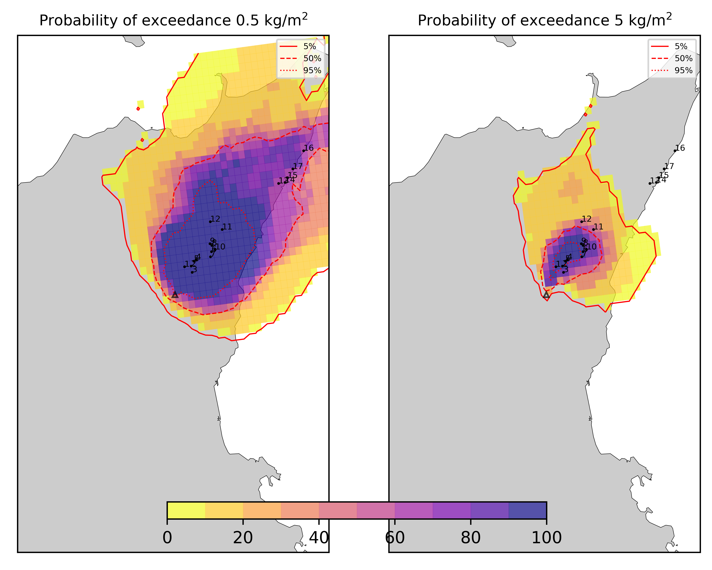

Forecast from VONA_20210304_0228Z
=================================

Contents
========

* [Forecast products](#forecast-products)
	* [Forecast at 2021-03-04 03:30 Z from RED VONA issued at 20210304_0228Z](#forecast-at-2021-03-04-0330-z-from-red-vona-issued-at-20210304_0228z)
	* [Forecast at 2021-03-04 04:30 Z from RED VONA issued at 20210304_0228Z](#forecast-at-2021-03-04-0430-z-from-red-vona-issued-at-20210304_0228z)
	* [Forecast at 2021-03-04 05:30 Z from RED VONA issued at 20210304_0228Z](#forecast-at-2021-03-04-0530-z-from-red-vona-issued-at-20210304_0228z)
	* [Forecast at 2021-03-04 08:30 Z from RED VONA issued at 20210304_0228Z](#forecast-at-2021-03-04-0830-z-from-red-vona-issued-at-20210304_0228z)
	* [Forecast at 2021-03-04 11:30 Z from RED VONA issued at 20210304_0228Z](#forecast-at-2021-03-04-1130-z-from-red-vona-issued-at-20210304_0228z)
	* [Forecast at 2021-03-04 14:30 Z from RED VONA issued at 20210304_0228Z](#forecast-at-2021-03-04-1430-z-from-red-vona-issued-at-20210304_0228z)
	* [Forecast at 2021-03-04 10:50 Z from RED VONA issued at 20210304_0751Z](#forecast-at-2021-03-04-1050-z-from-red-vona-issued-at-20210304_0751z)
	* [Forecast at 2021-03-04 11:00 Z from RED VONA issued at 20210304_0755Z](#forecast-at-2021-03-04-1100-z-from-red-vona-issued-at-20210304_0755z)
	* [Forecast at 2021-03-04 14:00 Z from RED VONA issued at 20210304_0755Z](#forecast-at-2021-03-04-1400-z-from-red-vona-issued-at-20210304_0755z)
	* [Forecast at 2021-03-04 17:00 Z from RED VONA issued at 20210304_0755Z](#forecast-at-2021-03-04-1700-z-from-red-vona-issued-at-20210304_0755z)
	* [Forecast at 2021-03-04 11:20 Z from RED VONA issued at 20210304_0817Z](#forecast-at-2021-03-04-1120-z-from-red-vona-issued-at-20210304_0817z)
	* [Forecast at 2021-03-04 14:20 Z from RED VONA issued at 20210304_0817Z](#forecast-at-2021-03-04-1420-z-from-red-vona-issued-at-20210304_0817z)
	* [Forecast at 2021-03-04 17:20 Z from RED VONA issued at 20210304_0817Z](#forecast-at-2021-03-04-1720-z-from-red-vona-issued-at-20210304_0817z)
	* [Forecast at 2021-03-04 20:20 Z from RED VONA issued at 20210304_0817Z](#forecast-at-2021-03-04-2020-z-from-red-vona-issued-at-20210304_0817z)

# Forecast products

## Forecast at 2021-03-04 03:30 Z from RED VONA issued at 20210304_0228Z
  

|Eruption start [Z]|Eruption end [Z]|Forecast time [Z]|Column height asl [m]|
| :--- | :--- | :--- | :--- |
|2021-03-04 02:30:00|Ongoing|2021-03-04 03:30:00|5000 ± 500 - from VONA|
  
  

|Percentile|MER [kg/s¹]|Mass air [kg]|Mass air nested dom. [kg]|Mass grd [kg]|Mass grd nested dom. [kg]|
| :--- | :--- | :--- | :--- | :--- | :--- |
|5th|5.50e+02|2.36e+06|2.36e+06|2.05e+04|2.41e+04|
|50th|1.98e+03|7.02e+06|7.02e+06|5.55e+05|5.56e+05|
|95th|9.13e+03|2.70e+07|2.69e+07|6.51e+06|6.51e+06|
  

### Ground Nested Domain 2021-03-04 03:30 Z
  
  
  
  
  
  
  
  
  
  
  
  
  
  
  
  
  
  

|Location|Ground load [kg/m²] 5th perc|Ground load [kg/m²] 50th perc|Ground load [kg/m²] 95th perc|
| :--- | :--- | :--- | :--- |
|Piano Provenzana (1)|0.00e+00|3.67e-05|1.09e-02|
|Bivio Provenzana-Linguaglossa (2)|0.00e+00|0.00e+00|1.32e-02|
|Cunetta pre-Citelli (3)|0.00e+00|0.00e+00|1.67e-02|
|Chalet (4)|0.00e+00|0.00e+00|4.84e-04|
|Ragabo (5)|0.00e+00|0.00e+00|3.06e-03|
|Scilio (6)|0.00e+00|0.00e+00|1.72e-04|
|Gambino vini (7)|0.00e+00|0.00e+00|3.46e-04|
|StazioneFce Linguaglossa (8)|0.00e+00|0.00e+00|4.24e-05|
|Linguaglossa Via Olivio Sozzi (9)|0.00e+00|0.00e+00|2.01e-05|
|Cim.Linguaglossa (10)|0.00e+00|0.00e+00|7.09e-05|
|Gole Bar (11)|0.00e+00|0.00e+00|0.00e+00|
|Francavilla - Orange (12)|0.00e+00|0.00e+00|0.00e+00|
|Roccalumera1 (13)|0.00e+00|0.00e+00|0.00e+00|
|Roccalumera2 (14)|0.00e+00|0.00e+00|0.00e+00|
|Nizza (15)|0.00e+00|0.00e+00|0.00e+00|
|Scaletta Zanclea (16)|0.00e+00|0.00e+00|0.00e+00|
|Alì (17)|0.00e+00|0.00e+00|0.00e+00|
  

### Atmosphere 2021-03-04 03:30 Z
  

## Forecast at 2021-03-04 04:30 Z from RED VONA issued at 20210304_0228Z
  

|Eruption start [Z]|Eruption end [Z]|Forecast time [Z]|Column height asl [m]|
| :--- | :--- | :--- | :--- |
|2021-03-04 02:30:00|Ongoing|2021-03-04 04:30:00|5000 ± 500 - from VONA|
  
  

|Percentile|MER [kg/s¹]|Mass air [kg]|Mass air nested dom. [kg]|Mass grd [kg]|Mass grd nested dom. [kg]|
| :--- | :--- | :--- | :--- | :--- | :--- |
|5th|7.38e+02|7.12e+06|7.11e+06|2.58e+05|2.70e+05|
|50th|2.69e+03|2.39e+07|2.39e+07|2.35e+06|2.34e+06|
|95th|1.12e+04|3.80e+07|3.80e+07|8.97e+06|8.98e+06|
  

### Ground Nested Domain 2021-03-04 04:30 Z
  
  
  
  
  
  
  
  
  
  
  
  
  
  
  
  
  
  

|Location|Ground load [kg/m²] 5th perc|Ground load [kg/m²] 50th perc|Ground load [kg/m²] 95th perc|
| :--- | :--- | :--- | :--- |
|Piano Provenzana (1)|2.50e-04|5.55e-03|3.10e-02|
|Bivio Provenzana-Linguaglossa (2)|0.00e+00|5.07e-04|2.31e-02|
|Cunetta pre-Citelli (3)|0.00e+00|4.94e-04|2.78e-02|
|Chalet (4)|0.00e+00|2.31e-04|7.56e-03|
|Ragabo (5)|0.00e+00|3.02e-04|9.01e-03|
|Scilio (6)|0.00e+00|0.00e+00|1.75e-03|
|Gambino vini (7)|0.00e+00|0.00e+00|2.31e-03|
|StazioneFce Linguaglossa (8)|0.00e+00|0.00e+00|1.11e-03|
|Linguaglossa Via Olivio Sozzi (9)|0.00e+00|0.00e+00|7.92e-04|
|Cim.Linguaglossa (10)|0.00e+00|0.00e+00|1.26e-03|
|Gole Bar (11)|0.00e+00|0.00e+00|4.66e-05|
|Francavilla - Orange (12)|0.00e+00|0.00e+00|1.96e-06|
|Roccalumera1 (13)|0.00e+00|0.00e+00|0.00e+00|
|Roccalumera2 (14)|0.00e+00|0.00e+00|0.00e+00|
|Nizza (15)|0.00e+00|0.00e+00|0.00e+00|
|Scaletta Zanclea (16)|0.00e+00|0.00e+00|0.00e+00|
|Alì (17)|0.00e+00|0.00e+00|0.00e+00|
  

### Atmosphere 2021-03-04 04:30 Z
  

## Forecast at 2021-03-04 05:30 Z from RED VONA issued at 20210304_0228Z
  

|Eruption start [Z]|Eruption end [Z]|Forecast time [Z]|Column height asl [m]|
| :--- | :--- | :--- | :--- |
|2021-03-04 02:30:00|Ongoing|2021-03-04 05:30:00|5000 ± 500 - from VONA|
  
  

|Percentile|MER [kg/s¹]|Mass air [kg]|Mass air nested dom. [kg]|Mass grd [kg]|Mass grd nested dom. [kg]|
| :--- | :--- | :--- | :--- | :--- | :--- |
|5th|6.77e+02|1.44e+07|1.44e+07|9.95e+05|1.01e+06|
|50th|3.67e+03|3.33e+07|3.33e+07|4.71e+06|4.72e+06|
|95th|7.66e+03|5.41e+07|5.41e+07|1.26e+07|1.26e+07|
  

### Ground Nested Domain 2021-03-04 05:30 Z
  
  
  
  
  
  
  
  
  
  
  
  
  
  
  
  
  
  

|Location|Ground load [kg/m²] 5th perc|Ground load [kg/m²] 50th perc|Ground load [kg/m²] 95th perc|
| :--- | :--- | :--- | :--- |
|Piano Provenzana (1)|6.25e-04|2.20e-02|8.99e-02|
|Bivio Provenzana-Linguaglossa (2)|3.63e-05|2.22e-03|4.07e-02|
|Cunetta pre-Citelli (3)|2.82e-06|1.52e-03|4.32e-02|
|Chalet (4)|6.00e-07|6.81e-04|1.17e-02|
|Ragabo (5)|3.08e-05|9.26e-04|1.68e-02|
|Scilio (6)|0.00e+00|2.00e-06|3.90e-03|
|Gambino vini (7)|0.00e+00|0.00e+00|5.11e-03|
|StazioneFce Linguaglossa (8)|0.00e+00|1.57e-06|2.71e-03|
|Linguaglossa Via Olivio Sozzi (9)|0.00e+00|4.18e-06|2.60e-03|
|Cim.Linguaglossa (10)|0.00e+00|0.00e+00|2.93e-03|
|Gole Bar (11)|0.00e+00|0.00e+00|1.60e-04|
|Francavilla - Orange (12)|0.00e+00|0.00e+00|6.42e-04|
|Roccalumera1 (13)|0.00e+00|0.00e+00|0.00e+00|
|Roccalumera2 (14)|0.00e+00|0.00e+00|0.00e+00|
|Nizza (15)|0.00e+00|0.00e+00|0.00e+00|
|Scaletta Zanclea (16)|0.00e+00|0.00e+00|0.00e+00|
|Alì (17)|0.00e+00|0.00e+00|0.00e+00|
  

### Atmosphere 2021-03-04 05:30 Z
  

## Forecast at 2021-03-04 08:30 Z from RED VONA issued at 20210304_0228Z
  

|Eruption start [Z]|Eruption end [Z]|Forecast time [Z]|Column height asl [m]|
| :--- | :--- | :--- | :--- |
|2021-03-04 02:30:00|Ongoing|2021-03-04 08:30:00|5000 ± 500 - from VONA|
  
  

|Percentile|MER [kg/s¹]|Mass air [kg]|Mass air nested dom. [kg]|Mass grd [kg]|Mass grd nested dom. [kg]|
| :--- | :--- | :--- | :--- | :--- | :--- |
|5th|2.44e+02|2.43e+07|2.43e+07|2.67e+06|2.68e+06|
|50th|1.87e+03|5.11e+07|5.11e+07|1.40e+07|1.40e+07|
|95th|8.27e+03|9.45e+07|9.44e+07|2.13e+07|2.13e+07|
  

### Ground Nested Domain 2021-03-04 08:30 Z
  
  
  
  
  
  
  
  
  
  
  
  
  
  
  
  
  
  

|Location|Ground load [kg/m²] 5th perc|Ground load [kg/m²] 50th perc|Ground load [kg/m²] 95th perc|
| :--- | :--- | :--- | :--- |
|Piano Provenzana (1)|3.70e-03|5.67e-02|1.53e-01|
|Bivio Provenzana-Linguaglossa (2)|6.08e-04|1.27e-02|9.46e-02|
|Cunetta pre-Citelli (3)|2.78e-04|9.88e-03|9.61e-02|
|Chalet (4)|7.28e-05|4.01e-03|7.63e-02|
|Ragabo (5)|3.01e-04|6.73e-03|8.12e-02|
|Scilio (6)|4.00e-06|1.34e-04|1.54e-02|
|Gambino vini (7)|0.00e+00|1.46e-04|1.49e-02|
|StazioneFce Linguaglossa (8)|0.00e+00|2.06e-04|1.29e-02|
|Linguaglossa Via Olivio Sozzi (9)|0.00e+00|5.09e-04|1.30e-02|
|Cim.Linguaglossa (10)|0.00e+00|2.09e-05|1.13e-02|
|Gole Bar (11)|0.00e+00|0.00e+00|3.77e-03|
|Francavilla - Orange (12)|0.00e+00|6.24e-05|6.35e-03|
|Roccalumera1 (13)|0.00e+00|0.00e+00|9.22e-06|
|Roccalumera2 (14)|0.00e+00|0.00e+00|1.44e-06|
|Nizza (15)|0.00e+00|0.00e+00|3.54e-06|
|Scaletta Zanclea (16)|0.00e+00|0.00e+00|0.00e+00|
|Alì (17)|0.00e+00|0.00e+00|3.36e-06|
  

### Atmosphere 2021-03-04 08:30 Z
  

## Forecast at 2021-03-04 11:30 Z from RED VONA issued at 20210304_0228Z
  

|Eruption start [Z]|Eruption end [Z]|Forecast time [Z]|Column height asl [m]|
| :--- | :--- | :--- | :--- |
|2021-03-04 02:30:00|Ongoing|2021-03-04 11:30:00|5000 ± 500 - from VONA|
  
  

|Percentile|MER [kg/s¹]|Mass air [kg]|Mass air nested dom. [kg]|Mass grd [kg]|Mass grd nested dom. [kg]|
| :--- | :--- | :--- | :--- | :--- | :--- |
|5th|1.59e+02|3.79e+07|3.78e+07|5.79e+06|5.82e+06|
|50th|2.41e+03|8.07e+07|7.95e+07|2.42e+07|2.42e+07|
|95th|8.08e+03|1.29e+08|1.20e+08|3.15e+07|3.15e+07|
  

### Ground Nested Domain 2021-03-04 11:30 Z
  
  
  
  
  
  
  
  
  
  
  
  
  
  
  
  
  
  

|Location|Ground load [kg/m²] 5th perc|Ground load [kg/m²] 50th perc|Ground load [kg/m²] 95th perc|
| :--- | :--- | :--- | :--- |
|Piano Provenzana (1)|6.64e-03|7.45e-02|1.73e-01|
|Bivio Provenzana-Linguaglossa (2)|1.11e-03|1.45e-02|1.08e-01|
|Cunetta pre-Citelli (3)|3.75e-04|1.46e-02|1.00e-01|
|Chalet (4)|4.12e-04|6.14e-03|1.03e-01|
|Ragabo (5)|8.51e-04|8.92e-03|1.02e-01|
|Scilio (6)|3.83e-05|8.54e-04|1.91e-02|
|Gambino vini (7)|2.92e-05|6.42e-04|1.73e-02|
|StazioneFce Linguaglossa (8)|3.34e-05|1.55e-03|2.48e-02|
|Linguaglossa Via Olivio Sozzi (9)|4.93e-05|2.30e-03|2.76e-02|
|Cim.Linguaglossa (10)|9.20e-06|6.15e-04|1.68e-02|
|Gole Bar (11)|0.00e+00|2.94e-04|8.54e-03|
|Francavilla - Orange (12)|1.15e-04|2.47e-03|1.10e-02|
|Roccalumera1 (13)|0.00e+00|0.00e+00|2.29e-04|
|Roccalumera2 (14)|0.00e+00|0.00e+00|9.27e-05|
|Nizza (15)|0.00e+00|0.00e+00|1.28e-04|
|Scaletta Zanclea (16)|0.00e+00|0.00e+00|6.04e-05|
|Alì (17)|0.00e+00|0.00e+00|1.09e-04|
  

### Atmosphere 2021-03-04 11:30 Z
  

## Forecast at 2021-03-04 14:30 Z from RED VONA issued at 20210304_0228Z
  

|Eruption start [Z]|Eruption end [Z]|Forecast time [Z]|Column height asl [m]|
| :--- | :--- | :--- | :--- |
|2021-03-04 02:30:00|Ongoing|2021-03-04 14:30:00|5000 ± 500 - from VONA|
  
  

|Percentile|MER [kg/s¹]|Mass air [kg]|Mass air nested dom. [kg]|Mass grd [kg]|Mass grd nested dom. [kg]|
| :--- | :--- | :--- | :--- | :--- | :--- |
|5th|3.11e+02|8.84e+07|6.90e+07|1.06e+07|1.06e+07|
|50th|5.54e+03|1.45e+08|1.09e+08|3.07e+07|3.08e+07|
|95th|2.03e+04|2.35e+08|1.88e+08|6.26e+07|6.27e+07|
  

### Ground Nested Domain 2021-03-04 14:30 Z
  
  
  
  
  
  
  
  
  
  
  
  
  
  
  
  
  
  

|Location|Ground load [kg/m²] 5th perc|Ground load [kg/m²] 50th perc|Ground load [kg/m²] 95th perc|
| :--- | :--- | :--- | :--- |
|Piano Provenzana (1)|3.98e-02|1.32e-01|3.03e-01|
|Bivio Provenzana-Linguaglossa (2)|1.89e-02|5.84e-02|1.49e-01|
|Cunetta pre-Citelli (3)|1.11e-02|4.55e-02|2.58e-01|
|Chalet (4)|1.30e-02|2.92e-02|1.05e-01|
|Ragabo (5)|1.40e-02|4.20e-02|1.10e-01|
|Scilio (6)|2.20e-03|1.10e-02|4.05e-02|
|Gambino vini (7)|2.13e-03|9.09e-03|3.35e-02|
|StazioneFce Linguaglossa (8)|2.78e-03|1.29e-02|5.37e-02|
|Linguaglossa Via Olivio Sozzi (9)|4.18e-03|1.55e-02|6.45e-02|
|Cim.Linguaglossa (10)|1.20e-03|7.50e-03|3.24e-02|
|Gole Bar (11)|3.63e-04|4.40e-03|1.60e-02|
|Francavilla - Orange (12)|1.72e-03|5.84e-03|2.11e-02|
|Roccalumera1 (13)|0.00e+00|2.55e-05|1.25e-03|
|Roccalumera2 (14)|0.00e+00|6.05e-06|6.54e-04|
|Nizza (15)|0.00e+00|4.07e-06|6.46e-04|
|Scaletta Zanclea (16)|0.00e+00|4.54e-05|8.72e-04|
|Alì (17)|0.00e+00|1.68e-05|6.27e-04|
  

### Atmosphere 2021-03-04 14:30 Z
  

## Forecast at 2021-03-04 10:50 Z from RED VONA issued at 20210304_0751Z
  

|Eruption start [Z]|Eruption end [Z]|Forecast time [Z]|Column height asl [m]|
| :--- | :--- | :--- | :--- |
|2021-03-04 02:30:00|Ongoing|2021-03-04 10:50:00|6000 ± 500 - from VONA|
  
  

|Percentile|MER [kg/s¹]|Mass air [kg]|Mass air nested dom. [kg]|Mass grd [kg]|Mass grd nested dom. [kg]|
| :--- | :--- | :--- | :--- | :--- | :--- |
|5th|1.79e+03|6.91e+07|6.90e+07|4.45e+06|4.47e+06|
|50th|8.66e+03|1.34e+08|1.34e+08|2.48e+07|2.48e+07|
|95th|1.85e+04|2.18e+08|2.18e+08|5.70e+07|5.70e+07|
  

### Ground Nested Domain 2021-03-04 10:50 Z
  
  
  
  
  
  
  
  
  
  
  
  
  
  
  
  
  
  

|Location|Ground load [kg/m²] 5th perc|Ground load [kg/m²] 50th perc|Ground load [kg/m²] 95th perc|
| :--- | :--- | :--- | :--- |
|Piano Provenzana (1)|7.26e-03|7.87e-02|2.92e-01|
|Bivio Provenzana-Linguaglossa (2)|2.13e-03|2.38e-02|1.51e-01|
|Cunetta pre-Citelli (3)|6.49e-04|2.05e-02|1.09e-01|
|Chalet (4)|6.80e-04|9.78e-03|9.40e-02|
|Ragabo (5)|1.68e-03|1.44e-02|1.14e-01|
|Scilio (6)|1.17e-05|5.98e-04|2.06e-02|
|Gambino vini (7)|7.12e-06|3.73e-04|2.37e-02|
|StazioneFce Linguaglossa (8)|2.17e-05|9.76e-04|2.30e-02|
|Linguaglossa Via Olivio Sozzi (9)|4.69e-05|1.60e-03|3.57e-02|
|Cim.Linguaglossa (10)|4.01e-07|3.17e-04|1.47e-02|
|Gole Bar (11)|0.00e+00|1.10e-04|7.46e-03|
|Francavilla - Orange (12)|5.92e-05|2.38e-03|2.71e-02|
|Roccalumera1 (13)|0.00e+00|0.00e+00|1.56e-04|
|Roccalumera2 (14)|0.00e+00|0.00e+00|7.07e-05|
|Nizza (15)|0.00e+00|0.00e+00|6.11e-05|
|Scaletta Zanclea (16)|0.00e+00|0.00e+00|5.07e-05|
|Alì (17)|0.00e+00|0.00e+00|2.62e-05|
  

### Atmosphere 2021-03-04 10:50 Z
  

## Forecast at 2021-03-04 11:00 Z from RED VONA issued at 20210304_0755Z
  

|Eruption start [Z]|Eruption end [Z]|Forecast time [Z]|Column height asl [m]|
| :--- | :--- | :--- | :--- |
|2021-03-04 02:30:00|Ongoing|2021-03-04 11:00:00|6500 ± 500 - from VONA|
  
  

|Percentile|MER [kg/s¹]|Mass air [kg]|Mass air nested dom. [kg]|Mass grd [kg]|Mass grd nested dom. [kg]|
| :--- | :--- | :--- | :--- | :--- | :--- |
|5th|5.19e+03|1.02e+08|1.02e+08|7.15e+06|7.20e+06|
|50th|1.09e+04|1.51e+08|1.47e+08|2.79e+07|2.79e+07|
|95th|3.35e+04|3.46e+08|3.29e+08|7.71e+07|7.72e+07|
  

### Ground Nested Domain 2021-03-04 11:00 Z
  
  
  
  
  
  
  
  
  
  
  
  
  
  
  
  
  
  

|Location|Ground load [kg/m²] 5th perc|Ground load [kg/m²] 50th perc|Ground load [kg/m²] 95th perc|
| :--- | :--- | :--- | :--- |
|Piano Provenzana (1)|7.69e-03|1.26e-01|3.63e-01|
|Bivio Provenzana-Linguaglossa (2)|1.10e-03|3.10e-02|2.27e-01|
|Cunetta pre-Citelli (3)|9.46e-04|2.00e-02|1.79e-01|
|Chalet (4)|6.34e-04|1.50e-02|8.26e-02|
|Ragabo (5)|8.98e-04|2.12e-02|1.08e-01|
|Scilio (6)|8.34e-06|1.30e-03|2.34e-02|
|Gambino vini (7)|0.00e+00|1.12e-03|1.75e-02|
|StazioneFce Linguaglossa (8)|2.59e-05|1.64e-03|3.15e-02|
|Linguaglossa Via Olivio Sozzi (9)|6.57e-05|2.57e-03|3.78e-02|
|Cim.Linguaglossa (10)|0.00e+00|5.98e-04|1.70e-02|
|Gole Bar (11)|0.00e+00|4.32e-04|8.90e-03|
|Francavilla - Orange (12)|3.95e-05|3.66e-03|2.61e-02|
|Roccalumera1 (13)|0.00e+00|0.00e+00|1.57e-04|
|Roccalumera2 (14)|0.00e+00|0.00e+00|6.93e-05|
|Nizza (15)|0.00e+00|0.00e+00|1.07e-04|
|Scaletta Zanclea (16)|0.00e+00|0.00e+00|3.74e-05|
|Alì (17)|0.00e+00|0.00e+00|1.12e-04|
  

### Atmosphere 2021-03-04 11:00 Z
  

## Forecast at 2021-03-04 14:00 Z from RED VONA issued at 20210304_0755Z
  

|Eruption start [Z]|Eruption end [Z]|Forecast time [Z]|Column height asl [m]|
| :--- | :--- | :--- | :--- |
|2021-03-04 02:30:00|Ongoing|2021-03-04 14:00:00|6500 ± 500 - from VONA|
  
  

|Percentile|MER [kg/s¹]|Mass air [kg]|Mass air nested dom. [kg]|Mass grd [kg]|Mass grd nested dom. [kg]|
| :--- | :--- | :--- | :--- | :--- | :--- |
|5th|5.41e+03|6.68e+07|6.68e+07|1.40e+07|1.40e+07|
|50th|2.15e+04|2.10e+08|2.10e+08|5.01e+07|5.01e+07|
|95th|4.45e+04|3.48e+08|3.02e+08|1.43e+08|1.43e+08|
  

### Ground Nested Domain 2021-03-04 14:00 Z
  
  
  
  
  
  
  
  
  
  
  
  
  
  
  
  
  
  

|Location|Ground load [kg/m²] 5th perc|Ground load [kg/m²] 50th perc|Ground load [kg/m²] 95th perc|
| :--- | :--- | :--- | :--- |
|Piano Provenzana (1)|2.24e-02|1.69e-01|5.83e-01|
|Bivio Provenzana-Linguaglossa (2)|2.20e-03|5.48e-02|3.13e-01|
|Cunetta pre-Citelli (3)|1.77e-03|5.55e-02|7.84e-01|
|Chalet (4)|9.37e-04|3.34e-02|1.91e-01|
|Ragabo (5)|1.83e-03|4.34e-02|2.06e-01|
|Scilio (6)|1.68e-04|5.40e-03|8.17e-02|
|Gambino vini (7)|7.18e-05|5.43e-03|1.29e-01|
|StazioneFce Linguaglossa (8)|2.22e-04|4.93e-03|7.23e-02|
|Linguaglossa Via Olivio Sozzi (9)|3.53e-04|6.81e-03|7.77e-02|
|Cim.Linguaglossa (10)|7.48e-05|3.71e-03|6.44e-02|
|Gole Bar (11)|4.07e-05|2.91e-03|2.81e-02|
|Francavilla - Orange (12)|2.41e-04|6.26e-03|2.87e-02|
|Roccalumera1 (13)|0.00e+00|0.00e+00|1.40e-03|
|Roccalumera2 (14)|0.00e+00|0.00e+00|8.55e-04|
|Nizza (15)|0.00e+00|0.00e+00|7.16e-04|
|Scaletta Zanclea (16)|0.00e+00|0.00e+00|3.74e-05|
|Alì (17)|0.00e+00|0.00e+00|6.16e-04|
  

### Atmosphere 2021-03-04 14:00 Z
  

## Forecast at 2021-03-04 17:00 Z from RED VONA issued at 20210304_0755Z
  

|Eruption start [Z]|Eruption end [Z]|Forecast time [Z]|Column height asl [m]|
| :--- | :--- | :--- | :--- |
|2021-03-04 02:30:00|Ongoing|2021-03-04 17:00:00|6500 ± 500 - from VONA|
  
  

|Percentile|MER [kg/s¹]|Mass air [kg]|Mass air nested dom. [kg]|Mass grd [kg]|Mass grd nested dom. [kg]|
| :--- | :--- | :--- | :--- | :--- | :--- |
|5th|4.58e+03|4.71e+07|4.71e+07|1.66e+07|1.66e+07|
|50th|2.82e+04|2.87e+08|2.20e+08|1.05e+08|1.05e+08|
|95th|5.42e+04|4.82e+08|3.35e+08|2.01e+08|2.01e+08|
  

### Ground Nested Domain 2021-03-04 17:00 Z
  
  
  
  
  
  
  
  
  
  
  
  
  
  
  
  
  
  

|Location|Ground load [kg/m²] 5th perc|Ground load [kg/m²] 50th perc|Ground load [kg/m²] 95th perc|
| :--- | :--- | :--- | :--- |
|Piano Provenzana (1)|2.27e-02|5.10e-01|1.08e+00|
|Bivio Provenzana-Linguaglossa (2)|2.29e-03|2.43e-01|6.98e-01|
|Cunetta pre-Citelli (3)|1.77e-03|2.63e-01|1.19e+00|
|Chalet (4)|9.64e-04|8.31e-02|3.68e-01|
|Ragabo (5)|1.93e-03|1.17e-01|4.16e-01|
|Scilio (6)|1.68e-04|1.87e-02|1.48e-01|
|Gambino vini (7)|1.09e-04|1.25e-02|1.81e-01|
|StazioneFce Linguaglossa (8)|2.22e-04|2.46e-02|1.01e-01|
|Linguaglossa Via Olivio Sozzi (9)|3.53e-04|2.33e-02|1.08e-01|
|Cim.Linguaglossa (10)|8.46e-05|1.41e-02|1.22e-01|
|Gole Bar (11)|1.44e-04|5.10e-03|4.08e-02|
|Francavilla - Orange (12)|2.42e-04|8.36e-03|6.84e-02|
|Roccalumera1 (13)|0.00e+00|6.49e-05|3.60e-03|
|Roccalumera2 (14)|0.00e+00|3.61e-05|3.22e-03|
|Nizza (15)|0.00e+00|1.06e-05|3.01e-03|
|Scaletta Zanclea (16)|0.00e+00|0.00e+00|2.68e-03|
|Alì (17)|0.00e+00|0.00e+00|2.79e-03|
  

### Atmosphere 2021-03-04 17:00 Z
  

## Forecast at 2021-03-04 11:20 Z from RED VONA issued at 20210304_0817Z
  

|Eruption start [Z]|Eruption end [Z]|Forecast time [Z]|Column height asl [m]|
| :--- | :--- | :--- | :--- |
|2021-03-04 02:30:00|Ongoing|2021-03-04 11:20:00|11000 ± 500 - from VONA|
  
  

|Percentile|MER [kg/s¹]|Mass air [kg]|Mass air nested dom. [kg]|Mass grd [kg]|Mass grd nested dom. [kg]|
| :--- | :--- | :--- | :--- | :--- | :--- |
|5th|2.27e+05|3.58e+09|2.27e+09|4.87e+07|4.87e+07|
|50th|8.87e+05|8.66e+09|6.67e+09|5.53e+08|5.52e+08|
|95th|1.42e+06|1.36e+10|9.58e+09|2.72e+09|2.71e+09|
  

### Ground Nested Domain 2021-03-04 11:20 Z
  
  
  
  
  
  
  
  
  
  
  
  
  
  
  
  
  
  

|Location|Ground load [kg/m²] 5th perc|Ground load [kg/m²] 50th perc|Ground load [kg/m²] 95th perc|
| :--- | :--- | :--- | :--- |
|Piano Provenzana (1)|1.58e-02|2.51e+00|7.69e+00|
|Bivio Provenzana-Linguaglossa (2)|1.34e-02|1.76e+00|8.67e+00|
|Cunetta pre-Citelli (3)|1.01e-02|1.64e+00|8.11e+00|
|Chalet (4)|1.49e-02|1.62e+00|9.35e+00|
|Ragabo (5)|1.51e-02|1.57e+00|8.96e+00|
|Scilio (6)|7.90e-03|6.41e-01|7.23e+00|
|Gambino vini (7)|7.82e-03|6.96e-01|8.27e+00|
|StazioneFce Linguaglossa (8)|7.74e-03|6.17e-01|5.97e+00|
|Linguaglossa Via Olivio Sozzi (9)|8.61e-03|6.51e-01|5.73e+00|
|Cim.Linguaglossa (10)|6.12e-03|5.58e-01|6.41e+00|
|Gole Bar (11)|2.44e-03|3.48e-01|2.31e+00|
|Francavilla - Orange (12)|3.49e-03|2.90e-01|2.04e+00|
|Roccalumera1 (13)|0.00e+00|8.56e-03|1.35e-01|
|Roccalumera2 (14)|0.00e+00|6.74e-03|1.53e-01|
|Nizza (15)|0.00e+00|5.73e-03|1.12e-01|
|Scaletta Zanclea (16)|0.00e+00|7.27e-04|5.00e-02|
|Alì (17)|0.00e+00|1.92e-03|6.65e-02|
  

### Atmosphere 2021-03-04 11:20 Z
  

## Forecast at 2021-03-04 14:20 Z from RED VONA issued at 20210304_0817Z
  

|Eruption start [Z]|Eruption end [Z]|Forecast time [Z]|Column height asl [m]|
| :--- | :--- | :--- | :--- |
|2021-03-04 02:30:00|Ongoing|2021-03-04 14:20:00|11000 ± 500 - from VONA|
  
  

|Percentile|MER [kg/s¹]|Mass air [kg]|Mass air nested dom. [kg]|Mass grd [kg]|Mass grd nested dom. [kg]|
| :--- | :--- | :--- | :--- | :--- | :--- |
|5th|1.96e+05|1.22e+10|4.48e+09|8.56e+08|8.36e+08|
|50th|1.17e+06|1.81e+10|7.20e+09|2.06e+09|2.00e+09|
|95th|2.87e+06|3.47e+10|1.17e+10|6.47e+09|6.28e+09|
  

### Ground Nested Domain 2021-03-04 14:20 Z
  
  
  
  
  
  
  
  
  
  
  
  
  
  
  
  
  
  

|Location|Ground load [kg/m²] 5th perc|Ground load [kg/m²] 50th perc|Ground load [kg/m²] 95th perc|
| :--- | :--- | :--- | :--- |
|Piano Provenzana (1)|1.70e+00|8.12e+00|1.39e+01|
|Bivio Provenzana-Linguaglossa (2)|2.06e+00|6.61e+00|1.37e+01|
|Cunetta pre-Citelli (3)|2.01e+00|8.35e+00|1.39e+01|
|Chalet (4)|1.51e+00|5.28e+00|1.50e+01|
|Ragabo (5)|1.75e+00|5.57e+00|1.47e+01|
|Scilio (6)|1.08e+00|3.61e+00|1.31e+01|
|Gambino vini (7)|9.24e-01|3.51e+00|1.29e+01|
|StazioneFce Linguaglossa (8)|1.18e+00|2.96e+00|1.22e+01|
|Linguaglossa Via Olivio Sozzi (9)|1.15e+00|2.95e+00|1.23e+01|
|Cim.Linguaglossa (10)|9.54e-01|3.34e+00|1.22e+01|
|Gole Bar (11)|5.89e-01|1.25e+00|6.58e+00|
|Francavilla - Orange (12)|1.65e-01|1.00e+00|7.31e+00|
|Roccalumera1 (13)|3.47e-02|2.17e-01|5.58e-01|
|Roccalumera2 (14)|3.46e-02|2.09e-01|4.78e-01|
|Nizza (15)|2.65e-02|1.77e-01|4.99e-01|
|Scaletta Zanclea (16)|8.99e-03|8.69e-02|2.98e-01|
|Alì (17)|1.33e-02|1.32e-01|3.91e-01|
  

### Atmosphere 2021-03-04 14:20 Z
  

## Forecast at 2021-03-04 17:20 Z from RED VONA issued at 20210304_0817Z
  

|Eruption start [Z]|Eruption end [Z]|Forecast time [Z]|Column height asl [m]|
| :--- | :--- | :--- | :--- |
|2021-03-04 02:30:00|Ongoing|2021-03-04 17:20:00|11000 ± 500 - from VONA|
  
  

|Percentile|MER [kg/s¹]|Mass air [kg]|Mass air nested dom. [kg]|Mass grd [kg]|Mass grd nested dom. [kg]|
| :--- | :--- | :--- | :--- | :--- | :--- |
|5th|2.31e+05|1.64e+10|4.23e+09|2.19e+09|1.96e+09|
|50th|1.21e+06|3.02e+10|8.07e+09|4.28e+09|3.82e+09|
|95th|2.97e+06|4.58e+10|1.02e+10|1.25e+10|1.17e+10|
  

### Ground Nested Domain 2021-03-04 17:20 Z
  
  
  
  
  
  
  
  
  
  
  
  
  
  
  
  
  
  

|Location|Ground load [kg/m²] 5th perc|Ground load [kg/m²] 50th perc|Ground load [kg/m²] 95th perc|
| :--- | :--- | :--- | :--- |
|Piano Provenzana (1)|5.47e+00|1.35e+01|2.82e+01|
|Bivio Provenzana-Linguaglossa (2)|5.71e+00|1.45e+01|2.18e+01|
|Cunetta pre-Citelli (3)|3.18e+00|1.37e+01|2.20e+01|
|Chalet (4)|6.11e+00|1.10e+01|2.06e+01|
|Ragabo (5)|6.41e+00|1.21e+01|2.10e+01|
|Scilio (6)|2.89e+00|6.92e+00|1.66e+01|
|Gambino vini (7)|2.69e+00|7.03e+00|1.71e+01|
|StazioneFce Linguaglossa (8)|3.02e+00|6.85e+00|1.51e+01|
|Linguaglossa Via Olivio Sozzi (9)|3.33e+00|6.89e+00|1.50e+01|
|Cim.Linguaglossa (10)|2.41e+00|6.76e+00|1.55e+01|
|Gole Bar (11)|1.16e+00|3.14e+00|9.99e+00|
|Francavilla - Orange (12)|1.11e+00|2.27e+00|1.43e+01|
|Roccalumera1 (13)|1.74e-01|4.88e-01|8.55e-01|
|Roccalumera2 (14)|1.69e-01|4.05e-01|8.13e-01|
|Nizza (15)|1.63e-01|3.77e-01|8.30e-01|
|Scaletta Zanclea (16)|1.34e-01|2.99e-01|4.86e-01|
|Alì (17)|1.54e-01|4.10e-01|6.27e-01|
  

### Atmosphere 2021-03-04 17:20 Z
  

## Forecast at 2021-03-04 20:20 Z from RED VONA issued at 20210304_0817Z
  

|Eruption start [Z]|Eruption end [Z]|Forecast time [Z]|Column height asl [m]|
| :--- | :--- | :--- | :--- |
|2021-03-04 02:30:00|Ongoing|2021-03-04 20:20:00|11000 ± 500 - from VONA|
  
  

|Percentile|MER [kg/s¹]|Mass air [kg]|Mass air nested dom. [kg]|Mass grd [kg]|Mass grd nested dom. [kg]|
| :--- | :--- | :--- | :--- | :--- | :--- |
|5th|1.86e+05|2.08e+10|5.62e+09|3.71e+09|2.95e+09|
|50th|1.05e+06|2.95e+10|7.49e+09|6.10e+09|5.14e+09|
|95th|5.32e+06|5.57e+10|1.54e+10|1.82e+10|1.58e+10|
  

### Ground Nested Domain 2021-03-04 20:20 Z
  
  
  
  
  
  
  
  
  
  
  
  
  
  
  
  
  
  

|Location|Ground load [kg/m²] 5th perc|Ground load [kg/m²] 50th perc|Ground load [kg/m²] 95th perc|
| :--- | :--- | :--- | :--- |
|Piano Provenzana (1)|8.45e+00|1.83e+01|3.67e+01|
|Bivio Provenzana-Linguaglossa (2)|6.46e+00|2.04e+01|3.03e+01|
|Cunetta pre-Citelli (3)|4.18e+00|1.85e+01|4.12e+01|
|Chalet (4)|6.96e+00|1.45e+01|2.47e+01|
|Ragabo (5)|7.58e+00|1.60e+01|2.60e+01|
|Scilio (6)|4.96e+00|1.04e+01|2.03e+01|
|Gambino vini (7)|5.06e+00|1.06e+01|2.16e+01|
|StazioneFce Linguaglossa (8)|4.84e+00|9.41e+00|1.87e+01|
|Linguaglossa Via Olivio Sozzi (9)|4.97e+00|9.45e+00|1.81e+01|
|Cim.Linguaglossa (10)|4.33e+00|9.60e+00|1.98e+01|
|Gole Bar (11)|1.90e+00|4.36e+00|1.26e+01|
|Francavilla - Orange (12)|1.84e+00|3.94e+00|1.67e+01|
|Roccalumera1 (13)|2.76e-01|7.88e-01|1.29e+00|
|Roccalumera2 (14)|3.01e-01|6.15e-01|1.33e+00|
|Nizza (15)|3.12e-01|6.46e-01|1.29e+00|
|Scaletta Zanclea (16)|2.39e-01|6.24e-01|1.06e+00|
|Alì (17)|1.84e-01|7.04e-01|1.14e+00|
  

### Atmosphere 2021-03-04 20:20 Z
  
  
Go to [Supplementary page](Supplementary_page.md)  
Go to [Main directory](https://github.com/federicapardini/Real_time_ash_forecast)