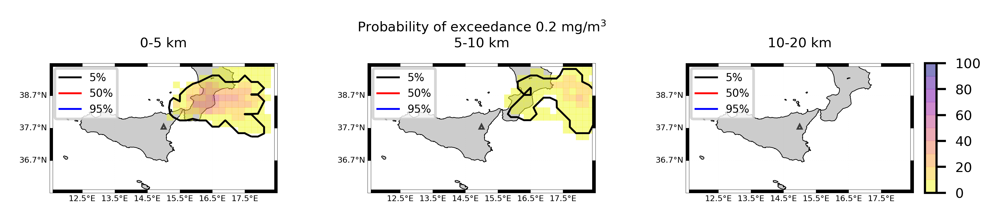

Forecast from VONA_20210304_0228Z
=================================

Contents
========

* [Forecast products](#forecast-products)
	* [Forecast at 2021-03-04 03:30 Z from RED VONA issued at 20210304_0228Z](#forecast-at-2021-03-04-0330-z-from-red-vona-issued-at-20210304_0228z)
	* [Forecast at 2021-03-04 04:30 Z from RED VONA issued at 20210304_0228Z](#forecast-at-2021-03-04-0430-z-from-red-vona-issued-at-20210304_0228z)
	* [Forecast at 2021-03-04 05:30 Z from RED VONA issued at 20210304_0228Z](#forecast-at-2021-03-04-0530-z-from-red-vona-issued-at-20210304_0228z)
	* [Forecast at 2021-03-04 08:30 Z from RED VONA issued at 20210304_0228Z](#forecast-at-2021-03-04-0830-z-from-red-vona-issued-at-20210304_0228z)
	* [Forecast at 2021-03-04 11:30 Z from RED VONA issued at 20210304_0228Z](#forecast-at-2021-03-04-1130-z-from-red-vona-issued-at-20210304_0228z)
	* [Forecast at 2021-03-04 14:30 Z from RED VONA issued at 20210304_0228Z](#forecast-at-2021-03-04-1430-z-from-red-vona-issued-at-20210304_0228z)
	* [Forecast at 2021-03-04 08:50 Z from RED VONA issued at 20210304_0751Z](#forecast-at-2021-03-04-0850-z-from-red-vona-issued-at-20210304_0751z)
	* [Forecast at 2021-03-04 09:00 Z from RED VONA issued at 20210304_0755Z](#forecast-at-2021-03-04-0900-z-from-red-vona-issued-at-20210304_0755z)
	* [Forecast at 2021-03-04 10:00 Z from RED VONA issued at 20210304_0755Z](#forecast-at-2021-03-04-1000-z-from-red-vona-issued-at-20210304_0755z)
	* [Forecast at 2021-03-04 11:00 Z from RED VONA issued at 20210304_0755Z](#forecast-at-2021-03-04-1100-z-from-red-vona-issued-at-20210304_0755z)
	* [Forecast at 2021-03-04 14:00 Z from RED VONA issued at 20210304_0755Z](#forecast-at-2021-03-04-1400-z-from-red-vona-issued-at-20210304_0755z)
	* [Forecast at 2021-03-04 17:00 Z from RED VONA issued at 20210304_0755Z](#forecast-at-2021-03-04-1700-z-from-red-vona-issued-at-20210304_0755z)
	* [Forecast at 2021-03-04 20:00 Z from RED VONA issued at 20210304_0755Z](#forecast-at-2021-03-04-2000-z-from-red-vona-issued-at-20210304_0755z)
	* [Forecast at 2021-03-04 09:20 Z from RED VONA issued at 20210304_0817Z](#forecast-at-2021-03-04-0920-z-from-red-vona-issued-at-20210304_0817z)
	* [Forecast at 2021-03-04 10:20 Z from RED VONA issued at 20210304_0817Z](#forecast-at-2021-03-04-1020-z-from-red-vona-issued-at-20210304_0817z)
	* [Forecast at 2021-03-04 11:20 Z from RED VONA issued at 20210304_0817Z](#forecast-at-2021-03-04-1120-z-from-red-vona-issued-at-20210304_0817z)
	* [Forecast at 2021-03-04 14:20 Z from RED VONA issued at 20210304_0817Z](#forecast-at-2021-03-04-1420-z-from-red-vona-issued-at-20210304_0817z)
	* [Forecast at 2021-03-04 17:20 Z from RED VONA issued at 20210304_0817Z](#forecast-at-2021-03-04-1720-z-from-red-vona-issued-at-20210304_0817z)
	* [Forecast at 2021-03-04 20:20 Z from RED VONA issued at 20210304_0817Z](#forecast-at-2021-03-04-2020-z-from-red-vona-issued-at-20210304_0817z)
	* [Forecast at 2021-03-04 13:20 Z from ORANGE VONA issued at 20210304_1016Z](#forecast-at-2021-03-04-1320-z-from-orange-vona-issued-at-20210304_1016z)
	* [Forecast at 2021-03-04 16:20 Z from ORANGE VONA issued at 20210304_1016Z](#forecast-at-2021-03-04-1620-z-from-orange-vona-issued-at-20210304_1016z)
	* [Forecast at 2021-03-04 19:20 Z from ORANGE VONA issued at 20210304_1016Z](#forecast-at-2021-03-04-1920-z-from-orange-vona-issued-at-20210304_1016z)

# Forecast products

## Forecast at 2021-03-04 03:30 Z from RED VONA issued at 20210304_0228Z
  

|Eruption start [Z]|Eruption end [Z]|Forecast time [Z]|Column height asl [m]|
| :--- | :--- | :--- | :--- |
|2021-03-04 02:30:00|Ongoing|2021-03-04 03:30:00|5000 ± 500 - from VONA|
  
  

|Percentile|MER [kg/s¹]|Mass air [kg]|Mass air nested dom. [kg]|Mass grd [kg]|Mass grd nested dom. [kg]|
| :--- | :--- | :--- | :--- | :--- | :--- |
|5th|6.09e+02|6.59e+05|6.59e+05|2.04e+06|2.05e+06|
|50th|2.51e+03|2.41e+06|2.41e+06|8.30e+06|8.30e+06|
|95th|9.79e+03|1.47e+07|1.47e+07|2.46e+07|2.46e+07|
  

### Ground Nested Domain 2021-03-04 03:30 Z
  
  
  
  
  
  
  
  
  
  
  
  
  
  
  
  
  
  
  
  
  
  
  
  
  
  
  
  

|Location|Ground load [kg/m²] 5th perc|Ground load [kg/m²] 50th perc|Ground load [kg/m²] 95th perc|
| :--- | :--- | :--- | :--- |
|Catania AP (1)|0.00e+00|0.00e+00|0.00e+00|
|Siracusa (2)|nan|nan|nan|
|Reggio Calabria (3)|nan|nan|nan|
|Palermo (4)|nan|nan|nan|
|Nicolosi (5)|0.00e+00|0.00e+00|0.00e+00|
|Zafferana (6)|0.00e+00|0.00e+00|0.00e+00|
|Linguaglossa (7)|0.00e+00|0.00e+00|0.00e+00|
|Randazzo (8)|0.00e+00|0.00e+00|0.00e+00|
|Bronte (9)|0.00e+00|0.00e+00|0.00e+00|
|Biancavilla (10)|0.00e+00|0.00e+00|0.00e+00|
|Piano Provenzana (11)|0.00e+00|2.13e-04|3.98e-02|
|Bivio Provenzana-Linguaglossa (12)|0.00e+00|0.00e+00|5.58e-02|
|Cunetta pre-Citelli (13)|0.00e+00|2.05e-05|1.39e-01|
|Chalet (14)|0.00e+00|0.00e+00|1.32e-03|
|Ragabo (15)|0.00e+00|0.00e+00|4.30e-03|
|Scilio (16)|0.00e+00|0.00e+00|7.64e-06|
|Gambino vini (17)|0.00e+00|0.00e+00|2.60e-05|
|StazioneFce Linguaglossa (18)|0.00e+00|0.00e+00|0.00e+00|
|Linguaglossa Via Olivio Sozzi (19)|0.00e+00|0.00e+00|0.00e+00|
|Cim.Linguaglossa (20)|0.00e+00|0.00e+00|0.00e+00|
|Gole Bar (21)|0.00e+00|0.00e+00|0.00e+00|
|Francavilla - Orange (22)|0.00e+00|0.00e+00|0.00e+00|
|Roccalumera1 (23)|0.00e+00|0.00e+00|0.00e+00|
|Roccalumera2 (24)|0.00e+00|0.00e+00|0.00e+00|
|Nizza (25)|0.00e+00|0.00e+00|0.00e+00|
|Scaletta Zanclea (26)|0.00e+00|0.00e+00|0.00e+00|
|Alì (27)|0.00e+00|0.00e+00|0.00e+00|
  

### Atmosphere 2021-03-04 03:30 Z
  

## Forecast at 2021-03-04 04:30 Z from RED VONA issued at 20210304_0228Z
  

|Eruption start [Z]|Eruption end [Z]|Forecast time [Z]|Column height asl [m]|
| :--- | :--- | :--- | :--- |
|2021-03-04 02:30:00|Ongoing|2021-03-04 04:30:00|5000 ± 500 - from VONA|
  
  

|Percentile|MER [kg/s¹]|Mass air [kg]|Mass air nested dom. [kg]|Mass grd [kg]|Mass grd nested dom. [kg]|
| :--- | :--- | :--- | :--- | :--- | :--- |
|5th|4.34e+02|5.16e+05|5.16e+05|6.17e+06|6.18e+06|
|50th|4.13e+03|3.88e+06|3.88e+06|2.24e+07|2.24e+07|
|95th|9.61e+03|9.67e+06|9.66e+06|5.66e+07|5.66e+07|
  

### Ground Nested Domain 2021-03-04 04:30 Z
  
  
  
  
  
  
  
  
  
  
  
  
  
  
  
  
  
  
  
  
  
  
  
  
  
  
  
  

|Location|Ground load [kg/m²] 5th perc|Ground load [kg/m²] 50th perc|Ground load [kg/m²] 95th perc|
| :--- | :--- | :--- | :--- |
|Catania AP (1)|0.00e+00|0.00e+00|0.00e+00|
|Siracusa (2)|nan|nan|nan|
|Reggio Calabria (3)|nan|nan|nan|
|Palermo (4)|nan|nan|nan|
|Nicolosi (5)|0.00e+00|0.00e+00|0.00e+00|
|Zafferana (6)|0.00e+00|0.00e+00|0.00e+00|
|Linguaglossa (7)|0.00e+00|0.00e+00|5.75e-04|
|Randazzo (8)|0.00e+00|0.00e+00|0.00e+00|
|Bronte (9)|0.00e+00|0.00e+00|0.00e+00|
|Biancavilla (10)|0.00e+00|0.00e+00|0.00e+00|
|Piano Provenzana (11)|7.62e-05|9.69e-03|1.05e-01|
|Bivio Provenzana-Linguaglossa (12)|1.62e-05|2.02e-03|1.11e-01|
|Cunetta pre-Citelli (13)|1.88e-05|8.69e-03|2.14e-01|
|Chalet (14)|0.00e+00|5.11e-04|3.36e-02|
|Ragabo (15)|0.00e+00|6.78e-04|3.29e-02|
|Scilio (16)|0.00e+00|0.00e+00|2.24e-03|
|Gambino vini (17)|0.00e+00|0.00e+00|5.68e-03|
|StazioneFce Linguaglossa (18)|0.00e+00|0.00e+00|1.28e-03|
|Linguaglossa Via Olivio Sozzi (19)|0.00e+00|0.00e+00|2.33e-03|
|Cim.Linguaglossa (20)|0.00e+00|0.00e+00|7.80e-04|
|Gole Bar (21)|0.00e+00|0.00e+00|3.01e-05|
|Francavilla - Orange (22)|0.00e+00|0.00e+00|8.94e-06|
|Roccalumera1 (23)|0.00e+00|0.00e+00|0.00e+00|
|Roccalumera2 (24)|0.00e+00|0.00e+00|0.00e+00|
|Nizza (25)|0.00e+00|0.00e+00|0.00e+00|
|Scaletta Zanclea (26)|0.00e+00|0.00e+00|0.00e+00|
|Alì (27)|0.00e+00|0.00e+00|0.00e+00|
  

### Atmosphere 2021-03-04 04:30 Z
  

## Forecast at 2021-03-04 05:30 Z from RED VONA issued at 20210304_0228Z
  

|Eruption start [Z]|Eruption end [Z]|Forecast time [Z]|Column height asl [m]|
| :--- | :--- | :--- | :--- |
|2021-03-04 02:30:00|Ongoing|2021-03-04 05:30:00|5000 ± 500 - from VONA|
  
  

|Percentile|MER [kg/s¹]|Mass air [kg]|Mass air nested dom. [kg]|Mass grd [kg]|Mass grd nested dom. [kg]|
| :--- | :--- | :--- | :--- | :--- | :--- |
|5th|5.00e+02|9.28e+05|9.27e+05|1.01e+07|1.01e+07|
|50th|3.87e+03|4.85e+06|4.85e+06|3.53e+07|3.53e+07|
|95th|8.85e+03|1.31e+07|1.30e+07|7.03e+07|7.03e+07|
  

### Ground Nested Domain 2021-03-04 05:30 Z
  
  
  
  
  
  
  
  
  
  
  
  
  
  
  
  
  
  
  
  
  
  
  
  
  
  
  
  

|Location|Ground load [kg/m²] 5th perc|Ground load [kg/m²] 50th perc|Ground load [kg/m²] 95th perc|
| :--- | :--- | :--- | :--- |
|Catania AP (1)|0.00e+00|0.00e+00|0.00e+00|
|Siracusa (2)|nan|nan|nan|
|Reggio Calabria (3)|nan|nan|nan|
|Palermo (4)|nan|nan|nan|
|Nicolosi (5)|0.00e+00|0.00e+00|0.00e+00|
|Zafferana (6)|0.00e+00|0.00e+00|0.00e+00|
|Linguaglossa (7)|0.00e+00|0.00e+00|1.08e-02|
|Randazzo (8)|0.00e+00|0.00e+00|9.40e-04|
|Bronte (9)|0.00e+00|0.00e+00|0.00e+00|
|Biancavilla (10)|0.00e+00|0.00e+00|0.00e+00|
|Piano Provenzana (11)|8.00e-04|3.09e-02|1.92e-01|
|Bivio Provenzana-Linguaglossa (12)|1.62e-05|2.05e-02|1.25e-01|
|Cunetta pre-Citelli (13)|2.05e-05|4.72e-02|2.33e-01|
|Chalet (14)|0.00e+00|4.16e-03|3.73e-02|
|Ragabo (15)|0.00e+00|1.31e-02|4.30e-02|
|Scilio (16)|0.00e+00|4.49e-05|8.01e-03|
|Gambino vini (17)|0.00e+00|5.17e-05|1.88e-02|
|StazioneFce Linguaglossa (18)|0.00e+00|3.14e-06|9.35e-03|
|Linguaglossa Via Olivio Sozzi (19)|0.00e+00|1.68e-06|9.55e-03|
|Cim.Linguaglossa (20)|0.00e+00|0.00e+00|7.71e-03|
|Gole Bar (21)|0.00e+00|0.00e+00|6.37e-05|
|Francavilla - Orange (22)|0.00e+00|0.00e+00|7.61e-05|
|Roccalumera1 (23)|0.00e+00|0.00e+00|0.00e+00|
|Roccalumera2 (24)|0.00e+00|0.00e+00|0.00e+00|
|Nizza (25)|0.00e+00|0.00e+00|0.00e+00|
|Scaletta Zanclea (26)|0.00e+00|0.00e+00|0.00e+00|
|Alì (27)|0.00e+00|0.00e+00|0.00e+00|
  

### Atmosphere 2021-03-04 05:30 Z
  

## Forecast at 2021-03-04 08:30 Z from RED VONA issued at 20210304_0228Z
  

|Eruption start [Z]|Eruption end [Z]|Forecast time [Z]|Column height asl [m]|
| :--- | :--- | :--- | :--- |
|2021-03-04 02:30:00|Ongoing|2021-03-04 08:30:00|5000 ± 500 - from VONA|
  
  

|Percentile|MER [kg/s¹]|Mass air [kg]|Mass air nested dom. [kg]|Mass grd [kg]|Mass grd nested dom. [kg]|
| :--- | :--- | :--- | :--- | :--- | :--- |
|5th|5.05e+02|1.17e+06|1.17e+06|2.21e+07|2.21e+07|
|50th|2.06e+03|2.18e+06|2.18e+06|5.43e+07|5.43e+07|
|95th|7.09e+03|6.28e+06|6.28e+06|1.09e+08|1.09e+08|
  

### Ground Nested Domain 2021-03-04 08:30 Z
  
  
  
  
  
  
  
  
  
  
  
  
  
  
  
  
  
  
  
  
  
  
  
  
  
  
  
  

|Location|Ground load [kg/m²] 5th perc|Ground load [kg/m²] 50th perc|Ground load [kg/m²] 95th perc|
| :--- | :--- | :--- | :--- |
|Catania AP (1)|0.00e+00|0.00e+00|0.00e+00|
|Siracusa (2)|nan|nan|nan|
|Reggio Calabria (3)|nan|nan|nan|
|Palermo (4)|nan|nan|nan|
|Nicolosi (5)|0.00e+00|0.00e+00|0.00e+00|
|Zafferana (6)|0.00e+00|0.00e+00|0.00e+00|
|Linguaglossa (7)|0.00e+00|4.35e-04|1.86e-02|
|Randazzo (8)|0.00e+00|8.33e-06|9.40e-04|
|Bronte (9)|0.00e+00|0.00e+00|0.00e+00|
|Biancavilla (10)|0.00e+00|0.00e+00|0.00e+00|
|Piano Provenzana (11)|9.57e-03|4.79e-02|2.67e-01|
|Bivio Provenzana-Linguaglossa (12)|4.31e-03|3.43e-02|1.42e-01|
|Cunetta pre-Citelli (13)|1.31e-02|7.39e-02|2.69e-01|
|Chalet (14)|1.62e-04|1.58e-02|5.58e-02|
|Ragabo (15)|5.94e-04|1.86e-02|6.01e-02|
|Scilio (16)|0.00e+00|9.76e-04|3.75e-02|
|Gambino vini (17)|0.00e+00|2.23e-03|5.61e-02|
|StazioneFce Linguaglossa (18)|0.00e+00|7.05e-04|1.88e-02|
|Linguaglossa Via Olivio Sozzi (19)|0.00e+00|9.01e-04|1.36e-02|
|Cim.Linguaglossa (20)|0.00e+00|3.82e-04|3.64e-02|
|Gole Bar (21)|0.00e+00|2.72e-05|6.38e-03|
|Francavilla - Orange (22)|0.00e+00|8.28e-04|4.39e-03|
|Roccalumera1 (23)|0.00e+00|0.00e+00|3.70e-05|
|Roccalumera2 (24)|0.00e+00|0.00e+00|2.09e-06|
|Nizza (25)|0.00e+00|0.00e+00|0.00e+00|
|Scaletta Zanclea (26)|0.00e+00|0.00e+00|0.00e+00|
|Alì (27)|0.00e+00|0.00e+00|0.00e+00|
  

### Atmosphere 2021-03-04 08:30 Z
  

## Forecast at 2021-03-04 11:30 Z from RED VONA issued at 20210304_0228Z
  

|Eruption start [Z]|Eruption end [Z]|Forecast time [Z]|Column height asl [m]|
| :--- | :--- | :--- | :--- |
|2021-03-04 02:30:00|Ongoing|2021-03-04 11:30:00|5000 ± 500 - from VONA|
  
  

|Percentile|MER [kg/s¹]|Mass air [kg]|Mass air nested dom. [kg]|Mass grd [kg]|Mass grd nested dom. [kg]|
| :--- | :--- | :--- | :--- | :--- | :--- |
|5th|1.98e+02|6.78e+05|6.78e+05|3.32e+07|3.32e+07|
|50th|2.96e+03|3.63e+06|3.61e+06|9.12e+07|9.13e+07|
|95th|1.63e+04|2.32e+07|2.30e+07|2.38e+08|2.38e+08|
  

### Ground Nested Domain 2021-03-04 11:30 Z
  
  
  
  
  
  
  
  
  
  
  
  
  
  
  
  
  
  
  
  
  
  
  
  
  
  
  
  

|Location|Ground load [kg/m²] 5th perc|Ground load [kg/m²] 50th perc|Ground load [kg/m²] 95th perc|
| :--- | :--- | :--- | :--- |
|Catania AP (1)|0.00e+00|0.00e+00|0.00e+00|
|Siracusa (2)|nan|nan|nan|
|Reggio Calabria (3)|nan|nan|nan|
|Palermo (4)|nan|nan|nan|
|Nicolosi (5)|0.00e+00|0.00e+00|0.00e+00|
|Zafferana (6)|0.00e+00|0.00e+00|0.00e+00|
|Linguaglossa (7)|1.42e-05|1.34e-03|4.31e-02|
|Randazzo (8)|0.00e+00|1.67e-05|2.12e-02|
|Bronte (9)|0.00e+00|0.00e+00|0.00e+00|
|Biancavilla (10)|0.00e+00|0.00e+00|0.00e+00|
|Piano Provenzana (11)|1.49e-02|7.47e-02|7.18e-01|
|Bivio Provenzana-Linguaglossa (12)|4.39e-03|6.16e-02|3.32e-01|
|Cunetta pre-Citelli (13)|1.32e-02|9.45e-02|1.10e+00|
|Chalet (14)|6.88e-04|2.10e-02|1.02e-01|
|Ragabo (15)|1.23e-03|2.92e-02|1.52e-01|
|Scilio (16)|1.40e-05|2.71e-03|9.60e-02|
|Gambino vini (17)|7.87e-06|3.55e-03|1.26e-01|
|StazioneFce Linguaglossa (18)|3.17e-05|2.24e-03|4.85e-02|
|Linguaglossa Via Olivio Sozzi (19)|3.76e-05|2.54e-03|3.64e-02|
|Cim.Linguaglossa (20)|8.00e-06|1.18e-03|7.03e-02|
|Gole Bar (21)|0.00e+00|5.26e-04|7.38e-03|
|Francavilla - Orange (22)|0.00e+00|1.20e-03|6.40e-03|
|Roccalumera1 (23)|0.00e+00|0.00e+00|3.95e-03|
|Roccalumera2 (24)|0.00e+00|0.00e+00|2.84e-03|
|Nizza (25)|0.00e+00|0.00e+00|3.07e-03|
|Scaletta Zanclea (26)|0.00e+00|0.00e+00|8.09e-05|
|Alì (27)|0.00e+00|0.00e+00|6.21e-04|
  

### Atmosphere 2021-03-04 11:30 Z
  

## Forecast at 2021-03-04 14:30 Z from RED VONA issued at 20210304_0228Z
  

|Eruption start [Z]|Eruption end [Z]|Forecast time [Z]|Column height asl [m]|
| :--- | :--- | :--- | :--- |
|2021-03-04 02:30:00|Ongoing|2021-03-04 14:30:00|5000 ± 500 - from VONA|
  
  

|Percentile|MER [kg/s¹]|Mass air [kg]|Mass air nested dom. [kg]|Mass grd [kg]|Mass grd nested dom. [kg]|
| :--- | :--- | :--- | :--- | :--- | :--- |
|5th|8.16e+02|2.54e+06|2.47e+06|5.08e+07|5.09e+07|
|50th|3.94e+03|1.02e+07|8.08e+06|1.67e+08|1.67e+08|
|95th|1.75e+04|2.20e+07|2.16e+07|2.99e+08|2.99e+08|
  

### Ground Nested Domain 2021-03-04 14:30 Z
  
  
  
  
  
  
  
  
  
  
  
  
  
  
  
  
  
  
  
  
  
  
  
  
  
  
  
  

|Location|Ground load [kg/m²] 5th perc|Ground load [kg/m²] 50th perc|Ground load [kg/m²] 95th perc|
| :--- | :--- | :--- | :--- |
|Catania AP (1)|0.00e+00|0.00e+00|0.00e+00|
|Siracusa (2)|nan|nan|nan|
|Reggio Calabria (3)|nan|nan|nan|
|Palermo (4)|nan|nan|nan|
|Nicolosi (5)|0.00e+00|0.00e+00|0.00e+00|
|Zafferana (6)|0.00e+00|0.00e+00|0.00e+00|
|Linguaglossa (7)|3.03e-04|8.48e-03|5.19e-02|
|Randazzo (8)|0.00e+00|3.00e-05|3.06e-02|
|Bronte (9)|0.00e+00|0.00e+00|0.00e+00|
|Biancavilla (10)|0.00e+00|0.00e+00|0.00e+00|
|Piano Provenzana (11)|3.24e-02|1.25e-01|2.05e+00|
|Bivio Provenzana-Linguaglossa (12)|5.72e-03|1.33e-01|4.50e-01|
|Cunetta pre-Citelli (13)|1.32e-02|2.62e-01|1.71e+00|
|Chalet (14)|2.09e-03|4.14e-02|1.40e-01|
|Ragabo (15)|3.67e-03|6.20e-02|2.88e-01|
|Scilio (16)|4.02e-04|9.81e-03|1.08e-01|
|Gambino vini (17)|3.68e-04|1.10e-02|1.39e-01|
|StazioneFce Linguaglossa (18)|3.03e-04|8.53e-03|5.63e-02|
|Linguaglossa Via Olivio Sozzi (19)|4.72e-04|8.32e-03|4.76e-02|
|Cim.Linguaglossa (20)|2.86e-04|8.75e-03|8.32e-02|
|Gole Bar (21)|1.29e-04|3.04e-03|2.04e-02|
|Francavilla - Orange (22)|1.12e-04|2.57e-03|9.12e-03|
|Roccalumera1 (23)|0.00e+00|2.71e-05|5.19e-03|
|Roccalumera2 (24)|0.00e+00|2.89e-06|4.76e-03|
|Nizza (25)|0.00e+00|7.08e-06|5.73e-03|
|Scaletta Zanclea (26)|0.00e+00|1.12e-05|1.89e-03|
|Alì (27)|0.00e+00|1.03e-05|1.91e-03|
  

### Atmosphere 2021-03-04 14:30 Z
  

## Forecast at 2021-03-04 08:50 Z from RED VONA issued at 20210304_0751Z
  

|Eruption start [Z]|Eruption end [Z]|Forecast time [Z]|Column height asl [m]|
| :--- | :--- | :--- | :--- |
|2021-03-04 02:30:00|Ongoing|2021-03-04 08:50:00|6000 ± 500 - from VONA|
  
  

|Percentile|MER [kg/s¹]|Mass air [kg]|Mass air nested dom. [kg]|Mass grd [kg]|Mass grd nested dom. [kg]|
| :--- | :--- | :--- | :--- | :--- | :--- |
|5th|2.02e+03|3.68e+06|3.68e+06|3.61e+07|3.61e+07|
|50th|7.54e+03|7.82e+06|7.82e+06|7.38e+07|7.38e+07|
|95th|1.53e+04|1.98e+07|1.98e+07|1.23e+08|1.23e+08|
  

### Ground Nested Domain 2021-03-04 08:50 Z
  
  
  
  
  
  
  
  
  
  
  
  
  
  
  
  
  
  
  
  
  
  
  
  
  
  
  
  

|Location|Ground load [kg/m²] 5th perc|Ground load [kg/m²] 50th perc|Ground load [kg/m²] 95th perc|
| :--- | :--- | :--- | :--- |
|Catania AP (1)|0.00e+00|0.00e+00|0.00e+00|
|Siracusa (2)|nan|nan|nan|
|Reggio Calabria (3)|nan|nan|nan|
|Palermo (4)|nan|nan|nan|
|Nicolosi (5)|0.00e+00|0.00e+00|0.00e+00|
|Zafferana (6)|0.00e+00|0.00e+00|0.00e+00|
|Linguaglossa (7)|0.00e+00|4.37e-04|1.76e-02|
|Randazzo (8)|0.00e+00|1.67e-05|9.67e-04|
|Bronte (9)|0.00e+00|0.00e+00|0.00e+00|
|Biancavilla (10)|0.00e+00|0.00e+00|0.00e+00|
|Piano Provenzana (11)|2.13e-02|7.32e-02|2.78e-01|
|Bivio Provenzana-Linguaglossa (12)|5.46e-03|5.04e-02|1.58e-01|
|Cunetta pre-Citelli (13)|2.09e-02|9.07e-02|3.69e-01|
|Chalet (14)|1.62e-04|1.57e-02|5.59e-02|
|Ragabo (15)|6.21e-04|1.98e-02|6.04e-02|
|Scilio (16)|0.00e+00|9.76e-04|3.70e-02|
|Gambino vini (17)|0.00e+00|2.52e-03|5.58e-02|
|StazioneFce Linguaglossa (18)|0.00e+00|7.02e-04|1.88e-02|
|Linguaglossa Via Olivio Sozzi (19)|0.00e+00|8.63e-04|1.36e-02|
|Cim.Linguaglossa (20)|0.00e+00|3.82e-04|3.51e-02|
|Gole Bar (21)|0.00e+00|1.13e-04|6.35e-03|
|Francavilla - Orange (22)|0.00e+00|8.28e-04|5.56e-03|
|Roccalumera1 (23)|0.00e+00|0.00e+00|3.70e-05|
|Roccalumera2 (24)|0.00e+00|0.00e+00|2.09e-06|
|Nizza (25)|0.00e+00|0.00e+00|0.00e+00|
|Scaletta Zanclea (26)|0.00e+00|0.00e+00|0.00e+00|
|Alì (27)|0.00e+00|0.00e+00|0.00e+00|
  

### Atmosphere 2021-03-04 08:50 Z
  

## Forecast at 2021-03-04 09:00 Z from RED VONA issued at 20210304_0755Z
  

|Eruption start [Z]|Eruption end [Z]|Forecast time [Z]|Column height asl [m]|
| :--- | :--- | :--- | :--- |
|2021-03-04 02:30:00|Ongoing|2021-03-04 09:00:00|6500 ± 500 - from VONA|
  
  

|Percentile|MER [kg/s¹]|Mass air [kg]|Mass air nested dom. [kg]|Mass grd [kg]|Mass grd nested dom. [kg]|
| :--- | :--- | :--- | :--- | :--- | :--- |
|5th|2.25e+03|4.09e+06|4.09e+06|3.99e+07|3.99e+07|
|50th|1.17e+04|1.20e+07|1.20e+07|9.09e+07|9.09e+07|
|95th|2.55e+04|3.99e+07|3.99e+07|1.64e+08|1.64e+08|
  

### Ground Nested Domain 2021-03-04 09:00 Z
  
  
  
  
  
  
  
  
  
  
  
  
  
  
  
  
  
  
  
  
  
  
  
  
  
  
  
  

|Location|Ground load [kg/m²] 5th perc|Ground load [kg/m²] 50th perc|Ground load [kg/m²] 95th perc|
| :--- | :--- | :--- | :--- |
|Catania AP (1)|0.00e+00|0.00e+00|0.00e+00|
|Siracusa (2)|nan|nan|nan|
|Reggio Calabria (3)|nan|nan|nan|
|Palermo (4)|nan|nan|nan|
|Nicolosi (5)|0.00e+00|0.00e+00|0.00e+00|
|Zafferana (6)|0.00e+00|0.00e+00|0.00e+00|
|Linguaglossa (7)|0.00e+00|4.34e-04|1.86e-02|
|Randazzo (8)|0.00e+00|1.67e-05|6.46e-03|
|Bronte (9)|0.00e+00|0.00e+00|0.00e+00|
|Biancavilla (10)|0.00e+00|0.00e+00|0.00e+00|
|Piano Provenzana (11)|1.91e-02|8.67e-02|6.12e-01|
|Bivio Provenzana-Linguaglossa (12)|7.88e-03|7.47e-02|3.50e-01|
|Cunetta pre-Citelli (13)|2.23e-02|1.11e-01|8.29e-01|
|Chalet (14)|2.81e-04|1.83e-02|9.68e-02|
|Ragabo (15)|1.54e-03|2.91e-02|1.42e-01|
|Scilio (16)|0.00e+00|9.99e-04|6.93e-02|
|Gambino vini (17)|0.00e+00|2.78e-03|8.51e-02|
|StazioneFce Linguaglossa (18)|0.00e+00|6.99e-04|2.20e-02|
|Linguaglossa Via Olivio Sozzi (19)|0.00e+00|9.10e-04|1.36e-02|
|Cim.Linguaglossa (20)|0.00e+00|5.48e-04|4.12e-02|
|Gole Bar (21)|0.00e+00|9.84e-05|6.21e-03|
|Francavilla - Orange (22)|0.00e+00|8.33e-04|4.38e-03|
|Roccalumera1 (23)|0.00e+00|0.00e+00|4.49e-05|
|Roccalumera2 (24)|0.00e+00|0.00e+00|2.09e-06|
|Nizza (25)|0.00e+00|0.00e+00|0.00e+00|
|Scaletta Zanclea (26)|0.00e+00|0.00e+00|0.00e+00|
|Alì (27)|0.00e+00|0.00e+00|0.00e+00|
  

### Atmosphere 2021-03-04 09:00 Z
  

## Forecast at 2021-03-04 10:00 Z from RED VONA issued at 20210304_0755Z
  

|Eruption start [Z]|Eruption end [Z]|Forecast time [Z]|Column height asl [m]|
| :--- | :--- | :--- | :--- |
|2021-03-04 02:30:00|Ongoing|2021-03-04 10:00:00|6500 ± 500 - from VONA|
  
  

|Percentile|MER [kg/s¹]|Mass air [kg]|Mass air nested dom. [kg]|Mass grd [kg]|Mass grd nested dom. [kg]|
| :--- | :--- | :--- | :--- | :--- | :--- |
|5th|4.00e+03|8.67e+06|8.67e+06|7.37e+07|7.38e+07|
|50th|1.16e+04|2.57e+07|2.57e+07|1.40e+08|1.40e+08|
|95th|2.82e+04|4.76e+07|4.76e+07|2.69e+08|2.69e+08|
  

### Ground Nested Domain 2021-03-04 10:00 Z
  
  
  
  
  
  
  
  
  
  
  
  
  
  
  
  
  
  
  
  
  
  
  
  
  
  
  
  

|Location|Ground load [kg/m²] 5th perc|Ground load [kg/m²] 50th perc|Ground load [kg/m²] 95th perc|
| :--- | :--- | :--- | :--- |
|Catania AP (1)|0.00e+00|0.00e+00|0.00e+00|
|Siracusa (2)|nan|nan|nan|
|Reggio Calabria (3)|nan|nan|nan|
|Palermo (4)|nan|nan|nan|
|Nicolosi (5)|0.00e+00|0.00e+00|0.00e+00|
|Zafferana (6)|0.00e+00|0.00e+00|0.00e+00|
|Linguaglossa (7)|3.61e-06|2.35e-03|3.92e-02|
|Randazzo (8)|0.00e+00|2.33e-05|1.29e-02|
|Bronte (9)|0.00e+00|0.00e+00|0.00e+00|
|Biancavilla (10)|0.00e+00|0.00e+00|0.00e+00|
|Piano Provenzana (11)|5.01e-02|2.29e-01|1.60e+00|
|Bivio Provenzana-Linguaglossa (12)|1.42e-02|1.61e-01|9.85e-01|
|Cunetta pre-Citelli (13)|2.72e-02|4.41e-01|1.29e+00|
|Chalet (14)|3.19e-03|3.77e-02|5.41e-01|
|Ragabo (15)|5.35e-03|7.33e-02|7.64e-01|
|Scilio (16)|6.76e-06|1.03e-02|9.54e-02|
|Gambino vini (17)|1.90e-06|1.74e-02|9.99e-02|
|StazioneFce Linguaglossa (18)|4.15e-06|3.18e-03|4.92e-02|
|Linguaglossa Via Olivio Sozzi (19)|1.68e-06|2.71e-03|7.64e-02|
|Cim.Linguaglossa (20)|9.73e-06|3.84e-03|7.90e-02|
|Gole Bar (21)|0.00e+00|6.15e-04|1.35e-02|
|Francavilla - Orange (22)|0.00e+00|1.29e-03|1.23e-02|
|Roccalumera1 (23)|0.00e+00|0.00e+00|7.84e-05|
|Roccalumera2 (24)|0.00e+00|0.00e+00|4.98e-06|
|Nizza (25)|0.00e+00|0.00e+00|7.08e-06|
|Scaletta Zanclea (26)|0.00e+00|0.00e+00|0.00e+00|
|Alì (27)|0.00e+00|0.00e+00|0.00e+00|
  

### Atmosphere 2021-03-04 10:00 Z
  

## Forecast at 2021-03-04 11:00 Z from RED VONA issued at 20210304_0755Z
  

|Eruption start [Z]|Eruption end [Z]|Forecast time [Z]|Column height asl [m]|
| :--- | :--- | :--- | :--- |
|2021-03-04 02:30:00|Ongoing|2021-03-04 11:00:00|6500 ± 500 - from VONA|
  
  

|Percentile|MER [kg/s¹]|Mass air [kg]|Mass air nested dom. [kg]|Mass grd [kg]|Mass grd nested dom. [kg]|
| :--- | :--- | :--- | :--- | :--- | :--- |
|5th|5.34e+03|9.64e+06|9.63e+06|8.95e+07|8.95e+07|
|50th|1.28e+04|2.39e+07|2.39e+07|1.78e+08|1.78e+08|
|95th|2.32e+04|4.16e+07|4.16e+07|3.37e+08|3.37e+08|
  

### Ground Nested Domain 2021-03-04 11:00 Z
  
  
  
  
  
  
  
  
  
  
  
  
  
  
  
  
  
  
  
  
  
  
  
  
  
  
  
  

|Location|Ground load [kg/m²] 5th perc|Ground load [kg/m²] 50th perc|Ground load [kg/m²] 95th perc|
| :--- | :--- | :--- | :--- |
|Catania AP (1)|0.00e+00|0.00e+00|0.00e+00|
|Siracusa (2)|nan|nan|nan|
|Reggio Calabria (3)|nan|nan|nan|
|Palermo (4)|nan|nan|nan|
|Nicolosi (5)|0.00e+00|0.00e+00|0.00e+00|
|Zafferana (6)|0.00e+00|0.00e+00|1.33e-05|
|Linguaglossa (7)|1.60e-04|1.08e-02|7.85e-02|
|Randazzo (8)|0.00e+00|2.50e-05|1.52e-02|
|Bronte (9)|0.00e+00|0.00e+00|0.00e+00|
|Biancavilla (10)|0.00e+00|0.00e+00|0.00e+00|
|Piano Provenzana (11)|6.38e-02|7.22e-01|2.10e+00|
|Bivio Provenzana-Linguaglossa (12)|3.53e-02|3.50e-01|1.37e+00|
|Cunetta pre-Citelli (13)|3.09e-02|5.70e-01|1.92e+00|
|Chalet (14)|5.49e-03|1.08e-01|9.03e-01|
|Ragabo (15)|1.51e-02|1.88e-01|1.09e+00|
|Scilio (16)|2.26e-05|1.70e-02|1.60e-01|
|Gambino vini (17)|1.38e-05|2.28e-02|1.96e-01|
|StazioneFce Linguaglossa (18)|1.29e-04|1.04e-02|1.07e-01|
|Linguaglossa Via Olivio Sozzi (19)|1.30e-04|1.16e-02|1.06e-01|
|Cim.Linguaglossa (20)|1.44e-05|8.93e-03|1.10e-01|
|Gole Bar (21)|0.00e+00|2.98e-03|3.04e-02|
|Francavilla - Orange (22)|7.25e-05|2.62e-03|3.78e-02|
|Roccalumera1 (23)|0.00e+00|0.00e+00|3.20e-04|
|Roccalumera2 (24)|0.00e+00|0.00e+00|2.67e-04|
|Nizza (25)|0.00e+00|0.00e+00|2.02e-04|
|Scaletta Zanclea (26)|0.00e+00|0.00e+00|4.33e-04|
|Alì (27)|0.00e+00|0.00e+00|3.45e-04|
  

### Atmosphere 2021-03-04 11:00 Z
  

## Forecast at 2021-03-04 14:00 Z from RED VONA issued at 20210304_0755Z
  

|Eruption start [Z]|Eruption end [Z]|Forecast time [Z]|Column height asl [m]|
| :--- | :--- | :--- | :--- |
|2021-03-04 02:30:00|Ongoing|2021-03-04 14:00:00|6500 ± 500 - from VONA|
  
  

|Percentile|MER [kg/s¹]|Mass air [kg]|Mass air nested dom. [kg]|Mass grd [kg]|Mass grd nested dom. [kg]|
| :--- | :--- | :--- | :--- | :--- | :--- |
|5th|6.21e+03|1.84e+07|1.78e+07|2.25e+08|2.25e+08|
|50th|1.86e+04|3.69e+07|3.52e+07|3.97e+08|3.96e+08|
|95th|4.94e+04|9.26e+07|9.03e+07|7.32e+08|7.31e+08|
  

### Ground Nested Domain 2021-03-04 14:00 Z
  
  
  
  
  
  
  
  
  
  
  
  
  
  
  
  
  
  
  
  
  
  
  
  
  
  
  
  

|Location|Ground load [kg/m²] 5th perc|Ground load [kg/m²] 50th perc|Ground load [kg/m²] 95th perc|
| :--- | :--- | :--- | :--- |
|Catania AP (1)|0.00e+00|0.00e+00|0.00e+00|
|Siracusa (2)|nan|nan|nan|
|Reggio Calabria (3)|nan|nan|nan|
|Palermo (4)|nan|nan|nan|
|Nicolosi (5)|0.00e+00|0.00e+00|0.00e+00|
|Zafferana (6)|0.00e+00|0.00e+00|1.87e-03|
|Linguaglossa (7)|1.16e-03|3.05e-02|1.02e+00|
|Randazzo (8)|0.00e+00|2.00e-04|3.33e-02|
|Bronte (9)|0.00e+00|0.00e+00|0.00e+00|
|Biancavilla (10)|0.00e+00|0.00e+00|0.00e+00|
|Piano Provenzana (11)|8.76e-02|1.61e+00|3.33e+00|
|Bivio Provenzana-Linguaglossa (12)|6.52e-02|6.89e-01|3.19e+00|
|Cunetta pre-Citelli (13)|5.48e-01|1.51e+00|3.79e+00|
|Chalet (14)|4.27e-02|2.13e-01|2.67e+00|
|Ragabo (15)|5.39e-02|3.86e-01|2.79e+00|
|Scilio (16)|4.07e-03|3.33e-02|1.80e+00|
|Gambino vini (17)|7.60e-03|6.09e-02|2.37e+00|
|StazioneFce Linguaglossa (18)|1.60e-03|2.94e-02|1.08e+00|
|Linguaglossa Via Olivio Sozzi (19)|2.93e-03|3.58e-02|8.74e-01|
|Cim.Linguaglossa (20)|1.00e-03|2.03e-02|1.39e+00|
|Gole Bar (21)|1.01e-03|7.60e-03|2.96e-01|
|Francavilla - Orange (22)|8.68e-04|1.52e-02|1.44e-01|
|Roccalumera1 (23)|0.00e+00|8.14e-05|1.58e-02|
|Roccalumera2 (24)|0.00e+00|1.73e-05|1.61e-02|
|Nizza (25)|0.00e+00|1.42e-05|9.74e-03|
|Scaletta Zanclea (26)|0.00e+00|0.00e+00|2.77e-03|
|Alì (27)|0.00e+00|0.00e+00|3.62e-03|
  

### Atmosphere 2021-03-04 14:00 Z
  

## Forecast at 2021-03-04 17:00 Z from RED VONA issued at 20210304_0755Z
  

|Eruption start [Z]|Eruption end [Z]|Forecast time [Z]|Column height asl [m]|
| :--- | :--- | :--- | :--- |
|2021-03-04 02:30:00|Ongoing|2021-03-04 17:00:00|6500 ± 500 - from VONA|
  
  

|Percentile|MER [kg/s¹]|Mass air [kg]|Mass air nested dom. [kg]|Mass grd [kg]|Mass grd nested dom. [kg]|
| :--- | :--- | :--- | :--- | :--- | :--- |
|5th|7.93e+03|1.50e+07|1.11e+07|5.05e+08|5.04e+08|
|50th|2.94e+04|5.55e+07|3.72e+07|6.25e+08|6.24e+08|
|95th|5.70e+04|8.22e+07|7.92e+07|1.11e+09|1.10e+09|
  

### Ground Nested Domain 2021-03-04 17:00 Z
  
  
  
  
  
  
  
  
  
  
  
  
  
  
  
  
  
  
  
  
  
  
  
  
  
  
  
  

|Location|Ground load [kg/m²] 5th perc|Ground load [kg/m²] 50th perc|Ground load [kg/m²] 95th perc|
| :--- | :--- | :--- | :--- |
|Catania AP (1)|0.00e+00|0.00e+00|0.00e+00|
|Siracusa (2)|nan|nan|nan|
|Reggio Calabria (3)|nan|nan|nan|
|Palermo (4)|nan|nan|nan|
|Nicolosi (5)|0.00e+00|0.00e+00|0.00e+00|
|Zafferana (6)|0.00e+00|0.00e+00|6.93e-03|
|Linguaglossa (7)|1.42e-02|9.06e-02|1.42e+00|
|Randazzo (8)|1.67e-05|3.45e-04|3.37e-02|
|Bronte (9)|0.00e+00|0.00e+00|0.00e+00|
|Biancavilla (10)|0.00e+00|0.00e+00|0.00e+00|
|Piano Provenzana (11)|3.84e-01|2.14e+00|5.86e+00|
|Bivio Provenzana-Linguaglossa (12)|4.59e-01|1.99e+00|5.48e+00|
|Cunetta pre-Citelli (13)|1.22e+00|3.59e+00|8.81e+00|
|Chalet (14)|1.62e-01|6.87e-01|5.29e+00|
|Ragabo (15)|2.16e-01|1.14e+00|5.26e+00|
|Scilio (16)|1.34e-02|1.74e-01|2.39e+00|
|Gambino vini (17)|1.22e-02|2.79e-01|2.70e+00|
|StazioneFce Linguaglossa (18)|1.56e-02|1.16e-01|1.52e+00|
|Linguaglossa Via Olivio Sozzi (19)|2.72e-02|1.03e-01|1.32e+00|
|Cim.Linguaglossa (20)|9.04e-03|1.30e-01|1.86e+00|
|Gole Bar (21)|5.19e-03|3.22e-02|4.76e-01|
|Francavilla - Orange (22)|6.78e-03|3.64e-02|2.67e-01|
|Roccalumera1 (23)|0.00e+00|1.42e-03|1.96e-02|
|Roccalumera2 (24)|0.00e+00|1.26e-03|1.63e-02|
|Nizza (25)|0.00e+00|6.51e-04|1.48e-02|
|Scaletta Zanclea (26)|0.00e+00|1.81e-04|1.62e-02|
|Alì (27)|0.00e+00|5.57e-04|1.54e-02|
  

### Atmosphere 2021-03-04 17:00 Z
  

## Forecast at 2021-03-04 20:00 Z from RED VONA issued at 20210304_0755Z
  

|Eruption start [Z]|Eruption end [Z]|Forecast time [Z]|Column height asl [m]|
| :--- | :--- | :--- | :--- |
|2021-03-04 02:30:00|Ongoing|2021-03-04 20:00:00|6500 ± 500 - from VONA|
  
  

|Percentile|MER [kg/s¹]|Mass air [kg]|Mass air nested dom. [kg]|Mass grd [kg]|Mass grd nested dom. [kg]|
| :--- | :--- | :--- | :--- | :--- | :--- |
|5th|4.78e+03|1.66e+07|6.30e+06|6.81e+08|6.81e+08|
|50th|2.66e+04|4.47e+07|3.53e+07|8.88e+08|8.86e+08|
|95th|3.85e+04|8.34e+07|6.64e+07|1.45e+09|1.43e+09|
  

### Ground Nested Domain 2021-03-04 20:00 Z
  
  
  
  
  
  
  
  
  
  
  
  
  
  
  
  
  
  
  
  
  
  
  
  
  
  
  
  

|Location|Ground load [kg/m²] 5th perc|Ground load [kg/m²] 50th perc|Ground load [kg/m²] 95th perc|
| :--- | :--- | :--- | :--- |
|Catania AP (1)|0.00e+00|0.00e+00|0.00e+00|
|Siracusa (2)|nan|nan|nan|
|Reggio Calabria (3)|nan|nan|nan|
|Palermo (4)|nan|nan|nan|
|Nicolosi (5)|0.00e+00|0.00e+00|0.00e+00|
|Zafferana (6)|0.00e+00|0.00e+00|3.80e-02|
|Linguaglossa (7)|3.27e-02|2.67e-01|1.55e+00|
|Randazzo (8)|3.33e-05|5.90e-04|3.37e-02|
|Bronte (9)|0.00e+00|0.00e+00|0.00e+00|
|Biancavilla (10)|0.00e+00|0.00e+00|0.00e+00|
|Piano Provenzana (11)|6.75e-01|4.34e+00|7.25e+00|
|Bivio Provenzana-Linguaglossa (12)|5.04e-01|4.53e+00|9.57e+00|
|Cunetta pre-Citelli (13)|3.19e+00|5.50e+00|9.42e+00|
|Chalet (14)|2.02e-01|1.63e+00|7.46e+00|
|Ragabo (15)|2.38e-01|2.06e+00|7.13e+00|
|Scilio (16)|6.83e-02|4.12e-01|2.50e+00|
|Gambino vini (17)|1.34e-01|5.61e-01|3.02e+00|
|StazioneFce Linguaglossa (18)|3.94e-02|2.74e-01|1.61e+00|
|Linguaglossa Via Olivio Sozzi (19)|3.66e-02|2.49e-01|1.42e+00|
|Cim.Linguaglossa (20)|3.90e-02|1.96e-01|2.04e+00|
|Gole Bar (21)|1.28e-02|6.60e-02|4.81e-01|
|Francavilla - Orange (22)|8.69e-03|5.91e-02|3.95e-01|
|Roccalumera1 (23)|9.82e-06|6.75e-03|4.06e-02|
|Roccalumera2 (24)|2.09e-06|4.25e-03|5.81e-02|
|Nizza (25)|0.00e+00|4.39e-03|4.71e-02|
|Scaletta Zanclea (26)|0.00e+00|1.88e-03|2.11e-02|
|Alì (27)|6.72e-06|4.82e-03|3.40e-02|
  

### Atmosphere 2021-03-04 20:00 Z
  

## Forecast at 2021-03-04 09:20 Z from RED VONA issued at 20210304_0817Z
  

|Eruption start [Z]|Eruption end [Z]|Forecast time [Z]|Column height asl [m]|
| :--- | :--- | :--- | :--- |
|2021-03-04 02:30:00|Ongoing|2021-03-04 09:20:00|11000 ± 500 - from VONA|
  
  

|Percentile|MER [kg/s¹]|Mass air [kg]|Mass air nested dom. [kg]|Mass grd [kg]|Mass grd nested dom. [kg]|
| :--- | :--- | :--- | :--- | :--- | :--- |
|5th|2.77e+05|5.73e+08|5.72e+08|4.69e+08|4.69e+08|
|50th|7.87e+05|1.55e+09|1.54e+09|1.59e+09|1.59e+09|
|95th|2.12e+06|4.13e+09|4.12e+09|3.00e+09|3.00e+09|
  

### Ground Nested Domain 2021-03-04 09:20 Z
  
  
  
  
  
  
  
  
  
  
  
  
  
  
  
  
  
  
  
  
  
  
  
  
  
  
  
  

|Location|Ground load [kg/m²] 5th perc|Ground load [kg/m²] 50th perc|Ground load [kg/m²] 95th perc|
| :--- | :--- | :--- | :--- |
|Catania AP (1)|0.00e+00|0.00e+00|0.00e+00|
|Siracusa (2)|nan|nan|nan|
|Reggio Calabria (3)|nan|nan|nan|
|Palermo (4)|nan|nan|nan|
|Nicolosi (5)|0.00e+00|5.67e-05|3.05e-03|
|Zafferana (6)|1.52e-03|5.00e-02|6.04e-01|
|Linguaglossa (7)|4.89e-02|8.29e-01|8.52e+00|
|Randazzo (8)|1.67e-05|3.50e-03|3.40e-01|
|Bronte (9)|0.00e+00|0.00e+00|4.45e-04|
|Biancavilla (10)|0.00e+00|0.00e+00|2.31e-05|
|Piano Provenzana (11)|2.72e-01|1.56e+00|5.42e+00|
|Bivio Provenzana-Linguaglossa (12)|2.16e-01|2.28e+00|4.27e+00|
|Cunetta pre-Citelli (13)|7.47e-01|2.13e+00|6.27e+00|
|Chalet (14)|1.73e-01|1.93e+00|4.74e+00|
|Ragabo (15)|1.78e-01|2.22e+00|4.73e+00|
|Scilio (16)|1.32e-01|1.27e+00|6.74e+00|
|Gambino vini (17)|2.24e-01|1.78e+00|5.64e+00|
|StazioneFce Linguaglossa (18)|5.92e-02|9.27e-01|8.00e+00|
|Linguaglossa Via Olivio Sozzi (19)|5.43e-02|1.15e+00|7.82e+00|
|Cim.Linguaglossa (20)|5.94e-02|1.00e+00|6.83e+00|
|Gole Bar (21)|3.14e-03|3.44e-01|7.61e+00|
|Francavilla - Orange (22)|2.50e-03|1.67e-01|4.21e+00|
|Roccalumera1 (23)|0.00e+00|0.00e+00|8.28e-03|
|Roccalumera2 (24)|0.00e+00|0.00e+00|2.66e-03|
|Nizza (25)|0.00e+00|0.00e+00|4.16e-04|
|Scaletta Zanclea (26)|0.00e+00|0.00e+00|0.00e+00|
|Alì (27)|0.00e+00|0.00e+00|1.48e-06|
  

### Atmosphere 2021-03-04 09:20 Z
  

## Forecast at 2021-03-04 10:20 Z from RED VONA issued at 20210304_0817Z
  

|Eruption start [Z]|Eruption end [Z]|Forecast time [Z]|Column height asl [m]|
| :--- | :--- | :--- | :--- |
|2021-03-04 02:30:00|Ongoing|2021-03-04 10:20:00|11000 ± 500 - from VONA|
  
  

|Percentile|MER [kg/s¹]|Mass air [kg]|Mass air nested dom. [kg]|Mass grd [kg]|Mass grd nested dom. [kg]|
| :--- | :--- | :--- | :--- | :--- | :--- |
|5th|4.67e+05|1.01e+09|1.00e+09|1.82e+09|1.82e+09|
|50th|9.06e+05|2.06e+09|1.79e+09|3.85e+09|3.85e+09|
|95th|1.96e+06|4.45e+09|4.14e+09|9.05e+09|9.04e+09|
  

### Ground Nested Domain 2021-03-04 10:20 Z
  
  
  
  
  
  
  
  
  
  
  
  
  
  
  
  
  
  
  
  
  
  
  
  
  
  
  
  

|Location|Ground load [kg/m²] 5th perc|Ground load [kg/m²] 50th perc|Ground load [kg/m²] 95th perc|
| :--- | :--- | :--- | :--- |
|Catania AP (1)|0.00e+00|0.00e+00|0.00e+00|
|Siracusa (2)|nan|nan|nan|
|Reggio Calabria (3)|nan|nan|nan|
|Palermo (4)|nan|nan|nan|
|Nicolosi (5)|1.00e-04|2.16e-03|4.15e-02|
|Zafferana (6)|8.86e-02|3.30e-01|2.63e+00|
|Linguaglossa (7)|1.36e+00|6.14e+00|1.77e+01|
|Randazzo (8)|2.70e-03|1.40e-01|4.91e-01|
|Bronte (9)|0.00e+00|0.00e+00|4.40e-03|
|Biancavilla (10)|0.00e+00|3.61e-06|3.82e-04|
|Piano Provenzana (11)|1.90e+00|6.19e+00|1.26e+01|
|Bivio Provenzana-Linguaglossa (12)|2.98e+00|6.21e+00|1.30e+01|
|Cunetta pre-Citelli (13)|2.85e+00|6.43e+00|1.71e+01|
|Chalet (14)|3.04e+00|6.41e+00|1.22e+01|
|Ragabo (15)|2.94e+00|6.02e+00|1.17e+01|
|Scilio (16)|2.15e+00|6.11e+00|1.63e+01|
|Gambino vini (17)|2.71e+00|6.68e+00|1.72e+01|
|StazioneFce Linguaglossa (18)|1.56e+00|6.45e+00|1.69e+01|
|Linguaglossa Via Olivio Sozzi (19)|1.48e+00|6.37e+00|1.66e+01|
|Cim.Linguaglossa (20)|1.51e+00|5.78e+00|1.74e+01|
|Gole Bar (21)|2.91e-01|3.95e+00|2.01e+01|
|Francavilla - Orange (22)|1.16e-01|3.16e+00|9.58e+00|
|Roccalumera1 (23)|0.00e+00|1.58e-02|2.41e-01|
|Roccalumera2 (24)|0.00e+00|6.51e-03|1.83e-01|
|Nizza (25)|0.00e+00|3.74e-03|1.24e-01|
|Scaletta Zanclea (26)|0.00e+00|1.05e-05|9.69e-03|
|Alì (27)|0.00e+00|8.09e-04|1.17e-01|
  

### Atmosphere 2021-03-04 10:20 Z
  

## Forecast at 2021-03-04 11:20 Z from RED VONA issued at 20210304_0817Z
  

|Eruption start [Z]|Eruption end [Z]|Forecast time [Z]|Column height asl [m]|
| :--- | :--- | :--- | :--- |
|2021-03-04 02:30:00|Ongoing|2021-03-04 11:20:00|11000 ± 500 - from VONA|
  
  

|Percentile|MER [kg/s¹]|Mass air [kg]|Mass air nested dom. [kg]|Mass grd [kg]|Mass grd nested dom. [kg]|
| :--- | :--- | :--- | :--- | :--- | :--- |
|5th|2.26e+05|6.88e+08|6.65e+08|3.86e+09|3.85e+09|
|50th|9.78e+05|2.46e+09|2.03e+09|6.98e+09|6.97e+09|
|95th|2.02e+06|5.83e+09|5.39e+09|1.35e+10|1.34e+10|
  

### Ground Nested Domain 2021-03-04 11:20 Z
  
  
  
  
  
  
  
  
  
  
  
  
  
  
  
  
  
  
  
  
  
  
  
  
  
  
  
  

|Location|Ground load [kg/m²] 5th perc|Ground load [kg/m²] 50th perc|Ground load [kg/m²] 95th perc|
| :--- | :--- | :--- | :--- |
|Catania AP (1)|0.00e+00|0.00e+00|2.21e-04|
|Siracusa (2)|nan|nan|nan|
|Reggio Calabria (3)|nan|nan|nan|
|Palermo (4)|nan|nan|nan|
|Nicolosi (5)|1.48e-04|5.66e-03|6.82e-02|
|Zafferana (6)|1.02e-01|8.95e-01|2.89e+00|
|Linguaglossa (7)|2.91e+00|1.14e+01|2.53e+01|
|Randazzo (8)|4.62e-03|2.43e-01|1.00e+00|
|Bronte (9)|0.00e+00|7.00e-05|6.64e-03|
|Biancavilla (10)|0.00e+00|2.39e-05|8.23e-04|
|Piano Provenzana (11)|2.25e+00|9.81e+00|2.11e+01|
|Bivio Provenzana-Linguaglossa (12)|3.82e+00|1.01e+01|2.41e+01|
|Cunetta pre-Citelli (13)|5.55e+00|1.23e+01|2.80e+01|
|Chalet (14)|3.65e+00|9.84e+00|2.27e+01|
|Ragabo (15)|3.57e+00|1.02e+01|2.04e+01|
|Scilio (16)|4.38e+00|1.15e+01|2.41e+01|
|Gambino vini (17)|4.24e+00|1.18e+01|2.61e+01|
|StazioneFce Linguaglossa (18)|2.95e+00|1.12e+01|2.46e+01|
|Linguaglossa Via Olivio Sozzi (19)|2.44e+00|1.08e+01|2.41e+01|
|Cim.Linguaglossa (20)|4.04e+00|1.11e+01|2.62e+01|
|Gole Bar (21)|9.31e-01|7.36e+00|2.33e+01|
|Francavilla - Orange (22)|4.88e-01|6.58e+00|2.02e+01|
|Roccalumera1 (23)|6.24e-04|2.12e-01|1.87e+00|
|Roccalumera2 (24)|1.27e-04|1.42e-01|1.35e+00|
|Nizza (25)|1.18e-04|1.29e-01|1.14e+00|
|Scaletta Zanclea (26)|0.00e+00|6.93e-03|7.72e-01|
|Alì (27)|4.45e-06|4.73e-02|8.36e-01|
  

### Atmosphere 2021-03-04 11:20 Z
  

## Forecast at 2021-03-04 14:20 Z from RED VONA issued at 20210304_0817Z
  

|Eruption start [Z]|Eruption end [Z]|Forecast time [Z]|Column height asl [m]|
| :--- | :--- | :--- | :--- |
|2021-03-04 02:30:00|Ongoing|2021-03-04 14:20:00|11000 ± 500 - from VONA|
  
  

|Percentile|MER [kg/s¹]|Mass air [kg]|Mass air nested dom. [kg]|Mass grd [kg]|Mass grd nested dom. [kg]|
| :--- | :--- | :--- | :--- | :--- | :--- |
|5th|2.04e+05|9.15e+08|7.80e+08|8.94e+09|8.92e+09|
|50th|1.20e+06|3.76e+09|2.26e+09|1.74e+10|1.70e+10|
|95th|3.33e+06|8.93e+09|7.53e+09|3.05e+10|2.95e+10|
  

### Ground Nested Domain 2021-03-04 14:20 Z
  
  
  
  
  
  
  
  
  
  
  
  
  
  
  
  
  
  
  
  
  
  
  
  
  
  
  
  

|Location|Ground load [kg/m²] 5th perc|Ground load [kg/m²] 50th perc|Ground load [kg/m²] 95th perc|
| :--- | :--- | :--- | :--- |
|Catania AP (1)|0.00e+00|0.00e+00|3.59e-03|
|Siracusa (2)|nan|nan|nan|
|Reggio Calabria (3)|nan|nan|nan|
|Palermo (4)|nan|nan|nan|
|Nicolosi (5)|1.01e-03|2.39e-02|1.86e-01|
|Zafferana (6)|2.36e-01|1.50e+00|5.04e+00|
|Linguaglossa (7)|3.99e+00|2.13e+01|4.25e+01|
|Randazzo (8)|3.50e-02|4.75e-01|2.19e+00|
|Bronte (9)|0.00e+00|1.38e-03|5.09e-02|
|Biancavilla (10)|0.00e+00|3.84e-04|8.23e-03|
|Piano Provenzana (11)|6.21e+00|1.60e+01|3.54e+01|
|Bivio Provenzana-Linguaglossa (12)|7.23e+00|1.59e+01|4.61e+01|
|Cunetta pre-Citelli (13)|1.26e+01|2.68e+01|4.54e+01|
|Chalet (14)|9.57e+00|1.60e+01|3.67e+01|
|Ragabo (15)|8.27e+00|1.57e+01|3.18e+01|
|Scilio (16)|5.34e+00|2.09e+01|3.77e+01|
|Gambino vini (17)|7.01e+00|2.14e+01|3.69e+01|
|StazioneFce Linguaglossa (18)|4.10e+00|2.13e+01|4.12e+01|
|Linguaglossa Via Olivio Sozzi (19)|4.85e+00|2.00e+01|3.84e+01|
|Cim.Linguaglossa (20)|4.76e+00|2.06e+01|3.91e+01|
|Gole Bar (21)|6.19e+00|1.65e+01|3.91e+01|
|Francavilla - Orange (22)|2.20e+00|1.55e+01|3.75e+01|
|Roccalumera1 (23)|1.62e-02|6.44e-01|1.41e+01|
|Roccalumera2 (24)|4.96e-03|5.43e-01|1.33e+01|
|Nizza (25)|3.43e-03|4.32e-01|1.21e+01|
|Scaletta Zanclea (26)|1.99e-03|2.78e-01|5.19e+00|
|Alì (27)|4.62e-03|3.95e-01|9.51e+00|
  

### Atmosphere 2021-03-04 14:20 Z
  

## Forecast at 2021-03-04 17:20 Z from RED VONA issued at 20210304_0817Z
  

|Eruption start [Z]|Eruption end [Z]|Forecast time [Z]|Column height asl [m]|
| :--- | :--- | :--- | :--- |
|2021-03-04 02:30:00|Ongoing|2021-03-04 17:20:00|11000 ± 500 - from VONA|
  
  

|Percentile|MER [kg/s¹]|Mass air [kg]|Mass air nested dom. [kg]|Mass grd [kg]|Mass grd nested dom. [kg]|
| :--- | :--- | :--- | :--- | :--- | :--- |
|5th|2.99e+05|1.17e+09|7.82e+08|1.49e+10|1.48e+10|
|50th|1.10e+06|3.96e+09|2.48e+09|3.44e+10|3.13e+10|
|95th|3.46e+06|9.19e+09|5.66e+09|4.91e+10|4.58e+10|
  

### Ground Nested Domain 2021-03-04 17:20 Z
  
  
  
  
  
  
  
  
  
  
  
  
  
  
  
  
  
  
  
  
  
  
  
  
  
  
  
  

|Location|Ground load [kg/m²] 5th perc|Ground load [kg/m²] 50th perc|Ground load [kg/m²] 95th perc|
| :--- | :--- | :--- | :--- |
|Catania AP (1)|0.00e+00|0.00e+00|3.59e-03|
|Siracusa (2)|nan|nan|nan|
|Reggio Calabria (3)|nan|nan|nan|
|Palermo (4)|nan|nan|nan|
|Nicolosi (5)|6.66e-03|4.22e-02|1.86e-01|
|Zafferana (6)|4.66e-01|2.13e+00|6.25e+00|
|Linguaglossa (7)|8.04e+00|2.64e+01|4.85e+01|
|Randazzo (8)|1.15e-01|1.16e+00|3.90e+00|
|Bronte (9)|0.00e+00|8.92e-03|9.29e-02|
|Biancavilla (10)|0.00e+00|1.19e-03|1.51e-02|
|Piano Provenzana (11)|8.07e+00|2.45e+01|5.33e+01|
|Bivio Provenzana-Linguaglossa (12)|1.29e+01|2.06e+01|6.03e+01|
|Cunetta pre-Citelli (13)|1.95e+01|3.76e+01|6.46e+01|
|Chalet (14)|1.04e+01|2.15e+01|5.24e+01|
|Ragabo (15)|1.00e+01|2.16e+01|4.54e+01|
|Scilio (16)|6.19e+00|2.80e+01|4.78e+01|
|Gambino vini (17)|7.66e+00|2.87e+01|4.51e+01|
|StazioneFce Linguaglossa (18)|8.34e+00|2.58e+01|4.80e+01|
|Linguaglossa Via Olivio Sozzi (19)|9.65e+00|2.60e+01|4.50e+01|
|Cim.Linguaglossa (20)|5.86e+00|2.98e+01|4.97e+01|
|Gole Bar (21)|8.33e+00|2.37e+01|5.09e+01|
|Francavilla - Orange (22)|5.06e+00|2.03e+01|4.70e+01|
|Roccalumera1 (23)|4.02e-01|2.48e+00|1.69e+01|
|Roccalumera2 (24)|2.95e-01|2.36e+00|1.61e+01|
|Nizza (25)|2.31e-01|1.85e+00|1.45e+01|
|Scaletta Zanclea (26)|2.31e-02|6.58e-01|6.44e+00|
|Alì (27)|1.43e-01|1.26e+00|1.14e+01|
  

### Atmosphere 2021-03-04 17:20 Z
  

## Forecast at 2021-03-04 20:20 Z from RED VONA issued at 20210304_0817Z
  

|Eruption start [Z]|Eruption end [Z]|Forecast time [Z]|Column height asl [m]|
| :--- | :--- | :--- | :--- |
|2021-03-04 02:30:00|Ongoing|2021-03-04 20:20:00|11000 ± 500 - from VONA|
  
  

|Percentile|MER [kg/s¹]|Mass air [kg]|Mass air nested dom. [kg]|Mass grd [kg]|Mass grd nested dom. [kg]|
| :--- | :--- | :--- | :--- | :--- | :--- |
|5th|3.89e+05|1.21e+09|8.44e+08|2.16e+10|2.10e+10|
|50th|8.48e+05|5.53e+09|2.09e+09|4.72e+10|4.53e+10|
|95th|3.57e+06|1.01e+10|5.76e+09|8.22e+10|7.50e+10|
  

### Ground Nested Domain 2021-03-04 20:20 Z
  
  
  
  
  
  
  
  
  
  
  
  
  
  
  
  
  
  
  
  
  
  
  
  
  
  
  
  

|Location|Ground load [kg/m²] 5th perc|Ground load [kg/m²] 50th perc|Ground load [kg/m²] 95th perc|
| :--- | :--- | :--- | :--- |
|Catania AP (1)|0.00e+00|0.00e+00|1.66e-02|
|Siracusa (2)|nan|nan|nan|
|Reggio Calabria (3)|nan|nan|nan|
|Palermo (4)|nan|nan|nan|
|Nicolosi (5)|6.72e-03|6.86e-02|2.86e-01|
|Zafferana (6)|5.20e-01|2.68e+00|7.94e+00|
|Linguaglossa (7)|1.15e+01|3.44e+01|6.00e+01|
|Randazzo (8)|4.21e-01|1.64e+00|4.41e+00|
|Bronte (9)|1.62e-04|1.65e-02|1.53e-01|
|Biancavilla (10)|0.00e+00|1.86e-03|2.56e-02|
|Piano Provenzana (11)|1.01e+01|3.26e+01|8.52e+01|
|Bivio Provenzana-Linguaglossa (12)|1.71e+01|2.73e+01|8.48e+01|
|Cunetta pre-Citelli (13)|2.07e+01|5.61e+01|1.05e+02|
|Chalet (14)|1.44e+01|2.72e+01|7.14e+01|
|Ragabo (15)|1.48e+01|2.91e+01|6.21e+01|
|Scilio (16)|9.77e+00|3.58e+01|5.70e+01|
|Gambino vini (17)|8.41e+00|3.52e+01|5.45e+01|
|StazioneFce Linguaglossa (18)|1.21e+01|3.38e+01|5.85e+01|
|Linguaglossa Via Olivio Sozzi (19)|1.38e+01|3.31e+01|5.88e+01|
|Cim.Linguaglossa (20)|8.94e+00|3.51e+01|5.77e+01|
|Gole Bar (21)|1.26e+01|3.11e+01|6.23e+01|
|Francavilla - Orange (22)|9.74e+00|2.68e+01|5.99e+01|
|Roccalumera1 (23)|6.92e-01|5.54e+00|2.07e+01|
|Roccalumera2 (24)|3.84e-01|4.01e+00|1.75e+01|
|Nizza (25)|3.65e-01|3.13e+00|1.67e+01|
|Scaletta Zanclea (26)|3.06e-02|1.28e+00|1.00e+01|
|Alì (27)|3.66e-01|2.23e+00|1.49e+01|
  

### Atmosphere 2021-03-04 20:20 Z
  

## Forecast at 2021-03-04 13:20 Z from ORANGE VONA issued at 20210304_1016Z
  

|Eruption start [Z]|Eruption end [Z]|Forecast time [Z]|Column height asl [m]|
| :--- | :--- | :--- | :--- |
|2021-03-04 02:30:00|2021-03-04 10:20:00|2021-03-04 13:20:00|11000.0 ± 500 - from VONA|
  
  

|Percentile|MER [kg/s¹]|Mass air [kg]|Mass air nested dom. [kg]|Mass grd [kg]|Mass grd nested dom. [kg]|
| :--- | :--- | :--- | :--- | :--- | :--- |
|5th|0.00e+00|2.59e+07|3.75e+05|2.47e+09|2.47e+09|
|50th|0.00e+00|2.56e+08|4.90e+06|5.57e+09|5.26e+09|
|95th|0.00e+00|7.06e+08|2.30e+08|1.20e+10|1.18e+10|
  

### Ground Nested Domain 2021-03-04 13:20 Z
  
  
  
  
  
  
  
  
  
  
  
  
  
  
  
  
  
  
  
  
  
  
  
  
  
  
  
  

|Location|Ground load [kg/m²] 5th perc|Ground load [kg/m²] 50th perc|Ground load [kg/m²] 95th perc|
| :--- | :--- | :--- | :--- |
|Catania AP (1)|0.00e+00|0.00e+00|0.00e+00|
|Siracusa (2)|nan|nan|nan|
|Reggio Calabria (3)|nan|nan|nan|
|Palermo (4)|nan|nan|nan|
|Nicolosi (5)|1.00e-04|3.41e-03|7.48e-02|
|Zafferana (6)|9.49e-02|3.73e-01|3.00e+00|
|Linguaglossa (7)|2.95e+00|8.87e+00|2.26e+01|
|Randazzo (8)|6.12e-03|2.56e-01|6.44e-01|
|Bronte (9)|0.00e+00|0.00e+00|6.64e-03|
|Biancavilla (10)|0.00e+00|1.71e-05|1.91e-03|
|Piano Provenzana (11)|2.44e+00|7.11e+00|1.65e+01|
|Bivio Provenzana-Linguaglossa (12)|3.33e+00|7.88e+00|1.76e+01|
|Cunetta pre-Citelli (13)|4.69e+00|8.32e+00|2.21e+01|
|Chalet (14)|3.68e+00|8.85e+00|1.68e+01|
|Ragabo (15)|3.55e+00|8.15e+00|1.58e+01|
|Scilio (16)|3.56e+00|9.58e+00|1.99e+01|
|Gambino vini (17)|3.59e+00|9.41e+00|2.04e+01|
|StazioneFce Linguaglossa (18)|3.02e+00|9.22e+00|2.19e+01|
|Linguaglossa Via Olivio Sozzi (19)|2.58e+00|8.82e+00|2.17e+01|
|Cim.Linguaglossa (20)|3.23e+00|8.84e+00|2.22e+01|
|Gole Bar (21)|1.06e+00|5.78e+00|2.24e+01|
|Francavilla - Orange (22)|4.26e-01|5.29e+00|1.53e+01|
|Roccalumera1 (23)|2.89e-03|3.13e-01|2.14e+00|
|Roccalumera2 (24)|2.39e-03|2.62e-01|2.04e+00|
|Nizza (25)|2.85e-03|2.51e-01|2.22e+00|
|Scaletta Zanclea (26)|2.31e-05|9.48e-02|8.55e-01|
|Alì (27)|2.04e-03|1.94e-01|2.25e+00|
  

### Atmosphere 2021-03-04 13:20 Z
  

## Forecast at 2021-03-04 16:20 Z from ORANGE VONA issued at 20210304_1016Z
  

|Eruption start [Z]|Eruption end [Z]|Forecast time [Z]|Column height asl [m]|
| :--- | :--- | :--- | :--- |
|2021-03-04 02:30:00|2021-03-04 10:20:00|2021-03-04 16:20:00|None|
  
  

|Percentile|MER [kg/s¹]|Mass air [kg]|Mass air nested dom. [kg]|Mass grd [kg]|Mass grd nested dom. [kg]|
| :--- | :--- | :--- | :--- | :--- | :--- |
|5th|0.00e+00|6.08e+06|4.04e+04|2.52e+09|2.48e+09|
|50th|0.00e+00|1.63e+08|5.02e+05|5.61e+09|5.26e+09|
|95th|0.00e+00|5.04e+08|6.46e+06|1.21e+10|1.18e+10|
  

### Ground Nested Domain 2021-03-04 16:20 Z
  
  
  
  
  
  
  
  
  
  
  
  
  
  
  
  
  
  
  
  
  
  
  
  
  
  
  
  

|Location|Ground load [kg/m²] 5th perc|Ground load [kg/m²] 50th perc|Ground load [kg/m²] 95th perc|
| :--- | :--- | :--- | :--- |
|Catania AP (1)|0.00e+00|0.00e+00|0.00e+00|
|Siracusa (2)|nan|nan|nan|
|Reggio Calabria (3)|nan|nan|nan|
|Palermo (4)|nan|nan|nan|
|Nicolosi (5)|1.00e-04|3.41e-03|7.48e-02|
|Zafferana (6)|9.49e-02|3.73e-01|3.00e+00|
|Linguaglossa (7)|2.96e+00|8.87e+00|2.26e+01|
|Randazzo (8)|6.16e-03|2.57e-01|6.44e-01|
|Bronte (9)|0.00e+00|0.00e+00|6.64e-03|
|Biancavilla (10)|0.00e+00|1.71e-05|1.91e-03|
|Piano Provenzana (11)|2.44e+00|7.11e+00|1.65e+01|
|Bivio Provenzana-Linguaglossa (12)|3.33e+00|7.88e+00|1.76e+01|
|Cunetta pre-Citelli (13)|4.69e+00|8.32e+00|2.21e+01|
|Chalet (14)|3.68e+00|8.85e+00|1.68e+01|
|Ragabo (15)|3.55e+00|8.15e+00|1.58e+01|
|Scilio (16)|3.56e+00|9.58e+00|1.99e+01|
|Gambino vini (17)|3.59e+00|9.41e+00|2.04e+01|
|StazioneFce Linguaglossa (18)|3.02e+00|9.22e+00|2.19e+01|
|Linguaglossa Via Olivio Sozzi (19)|2.58e+00|8.82e+00|2.17e+01|
|Cim.Linguaglossa (20)|3.23e+00|8.84e+00|2.22e+01|
|Gole Bar (21)|1.07e+00|5.78e+00|2.24e+01|
|Francavilla - Orange (22)|4.26e-01|5.29e+00|1.53e+01|
|Roccalumera1 (23)|2.99e-03|3.14e-01|2.48e+00|
|Roccalumera2 (24)|2.46e-03|2.67e-01|2.21e+00|
|Nizza (25)|2.93e-03|2.57e-01|2.30e+00|
|Scaletta Zanclea (26)|4.56e-04|9.50e-02|8.99e-01|
|Alì (27)|2.97e-03|2.01e-01|2.30e+00|
  

### Atmosphere 2021-03-04 16:20 Z
  

## Forecast at 2021-03-04 19:20 Z from ORANGE VONA issued at 20210304_1016Z
  

|Eruption start [Z]|Eruption end [Z]|Forecast time [Z]|Column height asl [m]|
| :--- | :--- | :--- | :--- |
|2021-03-04 02:30:00|2021-03-04 10:20:00|2021-03-04 19:20:00|None|
  
  

|Percentile|MER [kg/s¹]|Mass air [kg]|Mass air nested dom. [kg]|Mass grd [kg]|Mass grd nested dom. [kg]|
| :--- | :--- | :--- | :--- | :--- | :--- |
|5th|0.00e+00|1.43e+06|1.78e+04|2.59e+09|2.48e+09|
|50th|0.00e+00|3.71e+07|5.57e+04|5.63e+09|5.26e+09|
|95th|0.00e+00|3.54e+08|6.25e+05|1.21e+10|1.18e+10|
  

### Ground Nested Domain 2021-03-04 19:20 Z
  
  
  
  
  
  
  
  
  
  
  
  
  
  
  
  
  
  
  
  
  
  
  
  
  
  
  
  

|Location|Ground load [kg/m²] 5th perc|Ground load [kg/m²] 50th perc|Ground load [kg/m²] 95th perc|
| :--- | :--- | :--- | :--- |
|Catania AP (1)|0.00e+00|0.00e+00|0.00e+00|
|Siracusa (2)|nan|nan|nan|
|Reggio Calabria (3)|nan|nan|nan|
|Palermo (4)|nan|nan|nan|
|Nicolosi (5)|1.00e-04|3.41e-03|7.48e-02|
|Zafferana (6)|9.49e-02|3.73e-01|3.00e+00|
|Linguaglossa (7)|2.96e+00|8.87e+00|2.26e+01|
|Randazzo (8)|6.19e-03|2.57e-01|6.44e-01|
|Bronte (9)|0.00e+00|0.00e+00|6.64e-03|
|Biancavilla (10)|0.00e+00|1.71e-05|1.91e-03|
|Piano Provenzana (11)|2.44e+00|7.11e+00|1.65e+01|
|Bivio Provenzana-Linguaglossa (12)|3.33e+00|7.88e+00|1.76e+01|
|Cunetta pre-Citelli (13)|4.69e+00|8.32e+00|2.21e+01|
|Chalet (14)|3.68e+00|8.85e+00|1.68e+01|
|Ragabo (15)|3.55e+00|8.15e+00|1.58e+01|
|Scilio (16)|3.56e+00|9.58e+00|1.99e+01|
|Gambino vini (17)|3.59e+00|9.41e+00|2.04e+01|
|StazioneFce Linguaglossa (18)|3.02e+00|9.22e+00|2.19e+01|
|Linguaglossa Via Olivio Sozzi (19)|2.58e+00|8.82e+00|2.17e+01|
|Cim.Linguaglossa (20)|3.23e+00|8.84e+00|2.22e+01|
|Gole Bar (21)|1.07e+00|5.78e+00|2.24e+01|
|Francavilla - Orange (22)|4.26e-01|5.29e+00|1.53e+01|
|Roccalumera1 (23)|2.99e-03|3.14e-01|2.48e+00|
|Roccalumera2 (24)|2.46e-03|2.68e-01|2.21e+00|
|Nizza (25)|2.94e-03|2.57e-01|2.30e+00|
|Scaletta Zanclea (26)|1.56e-03|9.50e-02|8.99e-01|
|Alì (27)|2.97e-03|2.01e-01|2.30e+00|
  

### Atmosphere 2021-03-04 19:20 Z
  
  
Go to [Supplementary page](Supplementary_page.md)  
Go to [Main directory](https://github.com/federicapardini/Real_time_ash_forecast)