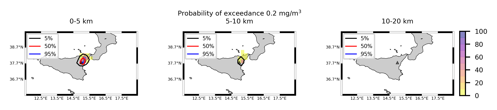

Forecast from VONA_20210304_0228Z
=================================

Contents
========

* [Forecast products](#forecast-products)
	* [Forecast at 2021-03-04 03:30 Z from RED VONA issued at 20210304_0228Z](#forecast-at-2021-03-04-0330-z-from-red-vona-issued-at-20210304_0228z)
	* [Forecast at 2021-03-04 04:30 Z from RED VONA issued at 20210304_0228Z](#forecast-at-2021-03-04-0430-z-from-red-vona-issued-at-20210304_0228z)
	* [Forecast at 2021-03-04 05:30 Z from RED VONA issued at 20210304_0228Z](#forecast-at-2021-03-04-0530-z-from-red-vona-issued-at-20210304_0228z)
	* [Forecast at 2021-03-04 08:30 Z from RED VONA issued at 20210304_0228Z](#forecast-at-2021-03-04-0830-z-from-red-vona-issued-at-20210304_0228z)
	* [Forecast at 2021-03-04 11:30 Z from RED VONA issued at 20210304_0228Z](#forecast-at-2021-03-04-1130-z-from-red-vona-issued-at-20210304_0228z)
	* [Forecast at 2021-03-04 14:30 Z from RED VONA issued at 20210304_0228Z](#forecast-at-2021-03-04-1430-z-from-red-vona-issued-at-20210304_0228z)
	* [Forecast at 2021-03-04 08:50 Z from RED VONA issued at 20210304_0751Z](#forecast-at-2021-03-04-0850-z-from-red-vona-issued-at-20210304_0751z)
	* [Forecast at 2021-03-04 09:00 Z from RED VONA issued at 20210304_0755Z](#forecast-at-2021-03-04-0900-z-from-red-vona-issued-at-20210304_0755z)
	* [Forecast at 2021-03-04 10:00 Z from RED VONA issued at 20210304_0755Z](#forecast-at-2021-03-04-1000-z-from-red-vona-issued-at-20210304_0755z)
	* [Forecast at 2021-03-04 11:00 Z from RED VONA issued at 20210304_0755Z](#forecast-at-2021-03-04-1100-z-from-red-vona-issued-at-20210304_0755z)

# Forecast products

## Forecast at 2021-03-04 03:30 Z from RED VONA issued at 20210304_0228Z
  

|Eruption start [Z]|Eruption end [Z]|Forecast time [Z]|Column height asl [m]|
| :--- | :--- | :--- | :--- |
|2021-03-04 02:30:00|Ongoing|2021-03-04 03:30:00|5000 ± 500 - from VONA|
  
  

|Percentile|MER [kg/s¹]|Mass air [kg]|Mass air nested dom. [kg]|Mass grd [kg]|Mass grd nested dom. [kg]|
| :--- | :--- | :--- | :--- | :--- | :--- |
|5th|2.96e+02|3.61e+05|3.61e+05|8.84e+05|8.89e+05|
|50th|2.98e+03|3.79e+06|3.79e+06|7.66e+06|7.66e+06|
|95th|1.24e+04|9.48e+06|9.47e+06|3.05e+07|3.05e+07|
  

### Ground Nested Domain 2021-03-04 03:30 Z
  
  
  
  
  
  
  
  
  
  
  
  
  
  
  
  
  
  
  
  
  
  
  
  
  

|Location|Ground load [kg/m²] 5th perc|Ground load [kg/m²] 50th perc|Ground load [kg/m²] 95th perc|
| :--- | :--- | :--- | :--- |
|Piano Provenzana (1)|0.00e+00|5.64e-04|1.18e-01|
|Bivio Provenzana-Linguaglossa (2)|0.00e+00|5.41e-05|5.01e-02|
|Cunetta pre-Citelli (3)|0.00e+00|2.87e-04|1.50e-01|
|Chalet (4)|0.00e+00|0.00e+00|6.15e-03|
|Ragabo (5)|0.00e+00|0.00e+00|1.21e-02|
|Scilio (6)|0.00e+00|0.00e+00|1.49e-04|
|Gambino vini (7)|0.00e+00|0.00e+00|4.00e-04|
|StazioneFce Linguaglossa (8)|0.00e+00|0.00e+00|3.14e-06|
|Linguaglossa Via Olivio Sozzi (9)|0.00e+00|0.00e+00|8.35e-06|
|Cim.Linguaglossa (10)|0.00e+00|0.00e+00|0.00e+00|
|Gole Bar (11)|0.00e+00|0.00e+00|0.00e+00|
|Francavilla - Orange (12)|0.00e+00|0.00e+00|0.00e+00|
|Roccalumera1 (13)|0.00e+00|0.00e+00|0.00e+00|
|Roccalumera2 (14)|0.00e+00|0.00e+00|0.00e+00|
|Nizza (15)|0.00e+00|0.00e+00|0.00e+00|
|Scaletta Zanclea (16)|0.00e+00|0.00e+00|0.00e+00|
|Alì (17)|0.00e+00|0.00e+00|0.00e+00|
|Catania AP (18)|0.00e+00|0.00e+00|0.00e+00|
|Nicolosi (19)|0.00e+00|0.00e+00|0.00e+00|
|Zafferana (20)|0.00e+00|0.00e+00|0.00e+00|
|Linguaglossa (21)|0.00e+00|0.00e+00|0.00e+00|
|Randazzo (22)|0.00e+00|0.00e+00|0.00e+00|
|Bronte (23)|0.00e+00|0.00e+00|0.00e+00|
|Biancavilla (24)|0.00e+00|0.00e+00|0.00e+00|
  

### Atmosphere 2021-03-04 03:30 Z
  

## Forecast at 2021-03-04 04:30 Z from RED VONA issued at 20210304_0228Z
  

|Eruption start [Z]|Eruption end [Z]|Forecast time [Z]|Column height asl [m]|
| :--- | :--- | :--- | :--- |
|2021-03-04 02:30:00|Ongoing|2021-03-04 04:30:00|5000 ± 500 - from VONA|
  
  

|Percentile|MER [kg/s¹]|Mass air [kg]|Mass air nested dom. [kg]|Mass grd [kg]|Mass grd nested dom. [kg]|
| :--- | :--- | :--- | :--- | :--- | :--- |
|5th|7.31e+02|2.25e+06|2.25e+06|1.08e+07|1.08e+07|
|50th|3.37e+03|3.90e+06|3.90e+06|2.12e+07|2.12e+07|
|95th|8.91e+03|1.15e+07|1.15e+07|4.06e+07|4.06e+07|
  

### Ground Nested Domain 2021-03-04 04:30 Z
  
  
  
  
  
  
  
  
  
  
  
  
  
  
  
  
  
  
  
  
  
  
  
  
  

|Location|Ground load [kg/m²] 5th perc|Ground load [kg/m²] 50th perc|Ground load [kg/m²] 95th perc|
| :--- | :--- | :--- | :--- |
|Piano Provenzana (1)|7.74e-04|1.49e-02|1.62e-01|
|Bivio Provenzana-Linguaglossa (2)|1.08e-05|1.03e-02|8.38e-02|
|Cunetta pre-Citelli (3)|0.00e+00|2.35e-02|1.92e-01|
|Chalet (4)|0.00e+00|1.52e-03|2.27e-02|
|Ragabo (5)|0.00e+00|4.80e-03|3.02e-02|
|Scilio (6)|0.00e+00|1.91e-06|1.05e-02|
|Gambino vini (7)|0.00e+00|5.97e-06|1.86e-02|
|StazioneFce Linguaglossa (8)|0.00e+00|0.00e+00|2.92e-03|
|Linguaglossa Via Olivio Sozzi (9)|0.00e+00|0.00e+00|2.32e-03|
|Cim.Linguaglossa (10)|0.00e+00|0.00e+00|3.69e-03|
|Gole Bar (11)|0.00e+00|0.00e+00|3.75e-04|
|Francavilla - Orange (12)|0.00e+00|0.00e+00|3.93e-05|
|Roccalumera1 (13)|0.00e+00|0.00e+00|0.00e+00|
|Roccalumera2 (14)|0.00e+00|0.00e+00|0.00e+00|
|Nizza (15)|0.00e+00|0.00e+00|0.00e+00|
|Scaletta Zanclea (16)|0.00e+00|0.00e+00|0.00e+00|
|Alì (17)|0.00e+00|0.00e+00|0.00e+00|
|Catania AP (18)|0.00e+00|0.00e+00|0.00e+00|
|Nicolosi (19)|0.00e+00|0.00e+00|0.00e+00|
|Zafferana (20)|0.00e+00|0.00e+00|0.00e+00|
|Linguaglossa (21)|0.00e+00|0.00e+00|2.11e-03|
|Randazzo (22)|0.00e+00|0.00e+00|1.07e-04|
|Bronte (23)|0.00e+00|0.00e+00|0.00e+00|
|Biancavilla (24)|0.00e+00|0.00e+00|0.00e+00|
  

### Atmosphere 2021-03-04 04:30 Z
  

## Forecast at 2021-03-04 05:30 Z from RED VONA issued at 20210304_0228Z
  

|Eruption start [Z]|Eruption end [Z]|Forecast time [Z]|Column height asl [m]|
| :--- | :--- | :--- | :--- |
|2021-03-04 02:30:00|Ongoing|2021-03-04 05:30:00|5000 ± 500 - from VONA|
  
  

|Percentile|MER [kg/s¹]|Mass air [kg]|Mass air nested dom. [kg]|Mass grd [kg]|Mass grd nested dom. [kg]|
| :--- | :--- | :--- | :--- | :--- | :--- |
|5th|6.84e+02|1.33e+06|1.33e+06|1.92e+07|1.93e+07|
|50th|3.06e+03|5.23e+06|5.23e+06|3.78e+07|3.78e+07|
|95th|1.05e+04|1.22e+07|1.22e+07|6.05e+07|6.05e+07|
  

### Ground Nested Domain 2021-03-04 05:30 Z
  
  
  
  
  
  
  
  
  
  
  
  
  
  
  
  
  
  
  
  
  
  
  
  
  

|Location|Ground load [kg/m²] 5th perc|Ground load [kg/m²] 50th perc|Ground load [kg/m²] 95th perc|
| :--- | :--- | :--- | :--- |
|Piano Provenzana (1)|1.84e-03|5.28e-02|2.02e-01|
|Bivio Provenzana-Linguaglossa (2)|8.36e-05|3.60e-02|1.27e-01|
|Cunetta pre-Citelli (3)|1.32e-04|6.34e-02|1.93e-01|
|Chalet (4)|0.00e+00|5.84e-03|3.08e-02|
|Ragabo (5)|1.26e-05|1.16e-02|4.60e-02|
|Scilio (6)|0.00e+00|1.37e-04|1.38e-02|
|Gambino vini (7)|0.00e+00|3.32e-04|3.17e-02|
|StazioneFce Linguaglossa (8)|0.00e+00|7.85e-06|7.47e-03|
|Linguaglossa Via Olivio Sozzi (9)|0.00e+00|2.09e-05|3.52e-03|
|Cim.Linguaglossa (10)|0.00e+00|0.00e+00|1.03e-02|
|Gole Bar (11)|0.00e+00|0.00e+00|7.60e-04|
|Francavilla - Orange (12)|0.00e+00|0.00e+00|1.87e-03|
|Roccalumera1 (13)|0.00e+00|0.00e+00|0.00e+00|
|Roccalumera2 (14)|0.00e+00|0.00e+00|0.00e+00|
|Nizza (15)|0.00e+00|0.00e+00|0.00e+00|
|Scaletta Zanclea (16)|0.00e+00|0.00e+00|0.00e+00|
|Alì (17)|0.00e+00|0.00e+00|0.00e+00|
|Catania AP (18)|0.00e+00|0.00e+00|0.00e+00|
|Nicolosi (19)|0.00e+00|0.00e+00|0.00e+00|
|Zafferana (20)|0.00e+00|0.00e+00|0.00e+00|
|Linguaglossa (21)|0.00e+00|0.00e+00|4.99e-03|
|Randazzo (22)|0.00e+00|0.00e+00|5.80e-04|
|Bronte (23)|0.00e+00|0.00e+00|0.00e+00|
|Biancavilla (24)|0.00e+00|0.00e+00|0.00e+00|
  

### Atmosphere 2021-03-04 05:30 Z
  

## Forecast at 2021-03-04 08:30 Z from RED VONA issued at 20210304_0228Z
  

|Eruption start [Z]|Eruption end [Z]|Forecast time [Z]|Column height asl [m]|
| :--- | :--- | :--- | :--- |
|2021-03-04 02:30:00|Ongoing|2021-03-04 08:30:00|5000 ± 500 - from VONA|
  
  

|Percentile|MER [kg/s¹]|Mass air [kg]|Mass air nested dom. [kg]|Mass grd [kg]|Mass grd nested dom. [kg]|
| :--- | :--- | :--- | :--- | :--- | :--- |
|5th|2.17e+02|1.88e+06|1.88e+06|3.63e+07|3.63e+07|
|50th|1.89e+03|4.29e+06|4.28e+06|6.38e+07|6.38e+07|
|95th|6.96e+03|1.38e+07|1.38e+07|9.81e+07|9.81e+07|
  

### Ground Nested Domain 2021-03-04 08:30 Z
  
  
  
  
  
  
  
  
  
  
  
  
  
  
  
  
  
  
  
  
  
  
  
  
  

|Location|Ground load [kg/m²] 5th perc|Ground load [kg/m²] 50th perc|Ground load [kg/m²] 95th perc|
| :--- | :--- | :--- | :--- |
|Piano Provenzana (1)|2.21e-02|9.18e-02|3.23e-01|
|Bivio Provenzana-Linguaglossa (2)|6.52e-03|7.82e-02|1.70e-01|
|Cunetta pre-Citelli (3)|8.30e-03|1.15e-01|3.07e-01|
|Chalet (4)|2.91e-04|1.58e-02|4.45e-02|
|Ragabo (5)|2.98e-03|2.38e-02|6.83e-02|
|Scilio (6)|0.00e+00|2.12e-03|1.91e-02|
|Gambino vini (7)|0.00e+00|1.92e-03|3.32e-02|
|StazioneFce Linguaglossa (8)|0.00e+00|1.50e-03|8.36e-03|
|Linguaglossa Via Olivio Sozzi (9)|0.00e+00|1.15e-03|8.51e-03|
|Cim.Linguaglossa (10)|0.00e+00|3.72e-03|1.22e-02|
|Gole Bar (11)|0.00e+00|4.97e-05|7.97e-03|
|Francavilla - Orange (12)|0.00e+00|3.78e-05|2.87e-03|
|Roccalumera1 (13)|0.00e+00|0.00e+00|0.00e+00|
|Roccalumera2 (14)|0.00e+00|0.00e+00|0.00e+00|
|Nizza (15)|0.00e+00|0.00e+00|0.00e+00|
|Scaletta Zanclea (16)|0.00e+00|0.00e+00|0.00e+00|
|Alì (17)|0.00e+00|0.00e+00|0.00e+00|
|Catania AP (18)|0.00e+00|0.00e+00|0.00e+00|
|Nicolosi (19)|0.00e+00|0.00e+00|0.00e+00|
|Zafferana (20)|0.00e+00|0.00e+00|0.00e+00|
|Linguaglossa (21)|0.00e+00|2.09e-03|6.93e-03|
|Randazzo (22)|0.00e+00|8.33e-06|2.55e-03|
|Bronte (23)|0.00e+00|0.00e+00|0.00e+00|
|Biancavilla (24)|0.00e+00|0.00e+00|0.00e+00|
  

### Atmosphere 2021-03-04 08:30 Z
  

## Forecast at 2021-03-04 11:30 Z from RED VONA issued at 20210304_0228Z
  

|Eruption start [Z]|Eruption end [Z]|Forecast time [Z]|Column height asl [m]|
| :--- | :--- | :--- | :--- |
|2021-03-04 02:30:00|Ongoing|2021-03-04 11:30:00|5000 ± 500 - from VONA|
  
  

|Percentile|MER [kg/s¹]|Mass air [kg]|Mass air nested dom. [kg]|Mass grd [kg]|Mass grd nested dom. [kg]|
| :--- | :--- | :--- | :--- | :--- | :--- |
|5th|1.76e+02|2.46e+06|2.46e+06|4.35e+07|4.35e+07|
|50th|2.73e+03|6.63e+06|6.62e+06|1.02e+08|1.02e+08|
|95th|1.30e+04|2.75e+07|2.75e+07|1.91e+08|1.91e+08|
  

### Ground Nested Domain 2021-03-04 11:30 Z
  
  
  
  
  
  
  
  
  
  
  
  
  
  
  
  
  
  
  
  
  
  
  
  
  

|Location|Ground load [kg/m²] 5th perc|Ground load [kg/m²] 50th perc|Ground load [kg/m²] 95th perc|
| :--- | :--- | :--- | :--- |
|Piano Provenzana (1)|4.61e-02|1.42e-01|4.04e-01|
|Bivio Provenzana-Linguaglossa (2)|2.35e-02|9.25e-02|2.48e-01|
|Cunetta pre-Citelli (3)|1.21e-02|1.17e-01|4.90e-01|
|Chalet (4)|3.34e-03|2.83e-02|7.92e-02|
|Ragabo (5)|7.64e-03|4.08e-02|9.88e-02|
|Scilio (6)|3.12e-04|6.10e-03|1.92e-02|
|Gambino vini (7)|1.25e-04|3.01e-03|3.53e-02|
|StazioneFce Linguaglossa (8)|1.43e-04|4.04e-03|1.03e-02|
|Linguaglossa Via Olivio Sozzi (9)|1.42e-04|3.44e-03|1.03e-02|
|Cim.Linguaglossa (10)|3.60e-05|4.63e-03|1.62e-02|
|Gole Bar (11)|0.00e+00|4.40e-04|7.97e-03|
|Francavilla - Orange (12)|0.00e+00|6.32e-04|1.18e-02|
|Roccalumera1 (13)|0.00e+00|0.00e+00|4.05e-04|
|Roccalumera2 (14)|0.00e+00|0.00e+00|9.53e-05|
|Nizza (15)|0.00e+00|0.00e+00|7.08e-06|
|Scaletta Zanclea (16)|0.00e+00|0.00e+00|0.00e+00|
|Alì (17)|0.00e+00|0.00e+00|1.34e-05|
|Catania AP (18)|0.00e+00|0.00e+00|0.00e+00|
|Nicolosi (19)|0.00e+00|0.00e+00|0.00e+00|
|Zafferana (20)|0.00e+00|0.00e+00|0.00e+00|
|Linguaglossa (21)|4.51e-05|3.31e-03|8.77e-03|
|Randazzo (22)|0.00e+00|3.67e-05|1.49e-02|
|Bronte (23)|0.00e+00|0.00e+00|0.00e+00|
|Biancavilla (24)|0.00e+00|0.00e+00|0.00e+00|
  

### Atmosphere 2021-03-04 11:30 Z
  

## Forecast at 2021-03-04 14:30 Z from RED VONA issued at 20210304_0228Z
  

|Eruption start [Z]|Eruption end [Z]|Forecast time [Z]|Column height asl [m]|
| :--- | :--- | :--- | :--- |
|2021-03-04 02:30:00|Ongoing|2021-03-04 14:30:00|5000 ± 500 - from VONA|
  
  

|Percentile|MER [kg/s¹]|Mass air [kg]|Mass air nested dom. [kg]|Mass grd [kg]|Mass grd nested dom. [kg]|
| :--- | :--- | :--- | :--- | :--- | :--- |
|5th|6.20e+02|3.90e+06|3.68e+06|6.61e+07|6.61e+07|
|50th|4.14e+03|1.34e+07|1.30e+07|1.86e+08|1.86e+08|
|95th|2.69e+04|6.79e+07|6.78e+07|3.04e+08|3.04e+08|
  

### Ground Nested Domain 2021-03-04 14:30 Z
  
  
  
  
  
  
  
  
  
  
  
  
  
  
  
  
  
  
  
  
  
  
  
  
  

|Location|Ground load [kg/m²] 5th perc|Ground load [kg/m²] 50th perc|Ground load [kg/m²] 95th perc|
| :--- | :--- | :--- | :--- |
|Piano Provenzana (1)|6.04e-02|3.25e-01|1.18e+00|
|Bivio Provenzana-Linguaglossa (2)|3.14e-02|1.85e-01|7.32e-01|
|Cunetta pre-Citelli (3)|4.87e-02|1.95e-01|1.42e+00|
|Chalet (4)|1.63e-02|6.72e-02|7.48e-01|
|Ragabo (5)|2.13e-02|8.61e-02|7.34e-01|
|Scilio (6)|2.40e-03|1.54e-02|1.67e-01|
|Gambino vini (7)|1.96e-03|1.86e-02|2.92e-01|
|StazioneFce Linguaglossa (8)|2.86e-03|8.73e-03|8.38e-02|
|Linguaglossa Via Olivio Sozzi (9)|3.55e-03|9.66e-03|9.69e-02|
|Cim.Linguaglossa (10)|1.76e-03|9.85e-03|1.55e-01|
|Gole Bar (11)|2.22e-04|3.06e-03|3.27e-02|
|Francavilla - Orange (12)|5.47e-04|2.91e-03|4.66e-02|
|Roccalumera1 (13)|0.00e+00|0.00e+00|8.78e-04|
|Roccalumera2 (14)|0.00e+00|0.00e+00|8.24e-04|
|Nizza (15)|0.00e+00|0.00e+00|1.07e-03|
|Scaletta Zanclea (16)|0.00e+00|0.00e+00|1.01e-04|
|Alì (17)|0.00e+00|0.00e+00|1.23e-03|
|Catania AP (18)|0.00e+00|0.00e+00|0.00e+00|
|Nicolosi (19)|0.00e+00|0.00e+00|0.00e+00|
|Zafferana (20)|0.00e+00|0.00e+00|6.67e-06|
|Linguaglossa (21)|3.01e-03|6.21e-03|8.78e-02|
|Randazzo (22)|1.00e-05|3.05e-04|3.83e-02|
|Bronte (23)|0.00e+00|0.00e+00|0.00e+00|
|Biancavilla (24)|0.00e+00|0.00e+00|0.00e+00|
  

### Atmosphere 2021-03-04 14:30 Z
  

## Forecast at 2021-03-04 08:50 Z from RED VONA issued at 20210304_0751Z
  

|Eruption start [Z]|Eruption end [Z]|Forecast time [Z]|Column height asl [m]|
| :--- | :--- | :--- | :--- |
|2021-03-04 02:30:00|Ongoing|2021-03-04 08:50:00|6000 ± 500 - from VONA|
  
  

|Percentile|MER [kg/s¹]|Mass air [kg]|Mass air nested dom. [kg]|Mass grd [kg]|Mass grd nested dom. [kg]|
| :--- | :--- | :--- | :--- | :--- | :--- |
|5th|1.65e+03|4.02e+06|4.02e+06|5.02e+07|5.02e+07|
|50th|6.17e+03|9.32e+06|9.31e+06|7.56e+07|7.56e+07|
|95th|1.98e+04|2.55e+07|2.55e+07|1.31e+08|1.31e+08|
  

### Ground Nested Domain 2021-03-04 08:50 Z
  
  
  
  
  
  
  
  
  
  
  
  
  
  
  
  
  
  
  
  
  
  
  
  
  

|Location|Ground load [kg/m²] 5th perc|Ground load [kg/m²] 50th perc|Ground load [kg/m²] 95th perc|
| :--- | :--- | :--- | :--- |
|Piano Provenzana (1)|1.84e-02|1.11e-01|3.13e-01|
|Bivio Provenzana-Linguaglossa (2)|9.36e-03|8.88e-02|1.85e-01|
|Cunetta pre-Citelli (3)|7.97e-03|1.26e-01|3.24e-01|
|Chalet (4)|7.02e-04|2.39e-02|5.37e-02|
|Ragabo (5)|3.34e-03|3.69e-02|8.10e-02|
|Scilio (6)|0.00e+00|4.73e-03|1.92e-02|
|Gambino vini (7)|0.00e+00|3.71e-03|4.71e-02|
|StazioneFce Linguaglossa (8)|0.00e+00|1.50e-03|8.87e-03|
|Linguaglossa Via Olivio Sozzi (9)|0.00e+00|1.15e-03|9.00e-03|
|Cim.Linguaglossa (10)|0.00e+00|2.18e-03|1.32e-02|
|Gole Bar (11)|0.00e+00|6.27e-05|7.97e-03|
|Francavilla - Orange (12)|0.00e+00|1.07e-04|3.66e-03|
|Roccalumera1 (13)|0.00e+00|0.00e+00|0.00e+00|
|Roccalumera2 (14)|0.00e+00|0.00e+00|0.00e+00|
|Nizza (15)|0.00e+00|0.00e+00|0.00e+00|
|Scaletta Zanclea (16)|0.00e+00|0.00e+00|0.00e+00|
|Alì (17)|0.00e+00|0.00e+00|0.00e+00|
|Catania AP (18)|0.00e+00|0.00e+00|0.00e+00|
|Nicolosi (19)|0.00e+00|0.00e+00|0.00e+00|
|Zafferana (20)|0.00e+00|0.00e+00|0.00e+00|
|Linguaglossa (21)|0.00e+00|8.93e-04|6.88e-03|
|Randazzo (22)|0.00e+00|2.33e-05|3.86e-03|
|Bronte (23)|0.00e+00|0.00e+00|0.00e+00|
|Biancavilla (24)|0.00e+00|0.00e+00|0.00e+00|
  

### Atmosphere 2021-03-04 08:50 Z
  

## Forecast at 2021-03-04 09:00 Z from RED VONA issued at 20210304_0755Z
  

|Eruption start [Z]|Eruption end [Z]|Forecast time [Z]|Column height asl [m]|
| :--- | :--- | :--- | :--- |
|2021-03-04 02:30:00|Ongoing|2021-03-04 09:00:00|6500 ± 500 - from VONA|
  
  

|Percentile|MER [kg/s¹]|Mass air [kg]|Mass air nested dom. [kg]|Mass grd [kg]|Mass grd nested dom. [kg]|
| :--- | :--- | :--- | :--- | :--- | :--- |
|5th|2.11e+03|5.70e+06|5.70e+06|6.42e+07|6.42e+07|
|50th|1.07e+04|1.70e+07|1.70e+07|8.51e+07|8.51e+07|
|95th|2.40e+04|4.08e+07|4.08e+07|1.51e+08|1.51e+08|
  

### Ground Nested Domain 2021-03-04 09:00 Z
  
  
  
  
  
  
  
  
  
  
  
  
  
  
  
  
  
  
  
  
  
  
  
  
  

|Location|Ground load [kg/m²] 5th perc|Ground load [kg/m²] 50th perc|Ground load [kg/m²] 95th perc|
| :--- | :--- | :--- | :--- |
|Piano Provenzana (1)|1.88e-02|1.33e-01|4.93e-01|
|Bivio Provenzana-Linguaglossa (2)|1.70e-02|9.52e-02|1.89e-01|
|Cunetta pre-Citelli (3)|1.61e-02|1.64e-01|3.76e-01|
|Chalet (4)|3.40e-03|3.16e-02|6.69e-02|
|Ragabo (5)|7.58e-03|3.69e-02|9.44e-02|
|Scilio (6)|7.58e-05|4.73e-03|2.44e-02|
|Gambino vini (7)|2.35e-04|3.44e-03|4.70e-02|
|StazioneFce Linguaglossa (8)|0.00e+00|1.68e-03|9.76e-03|
|Linguaglossa Via Olivio Sozzi (9)|0.00e+00|1.56e-03|9.08e-03|
|Cim.Linguaglossa (10)|0.00e+00|3.76e-03|1.32e-02|
|Gole Bar (11)|0.00e+00|7.46e-05|7.97e-03|
|Francavilla - Orange (12)|0.00e+00|1.70e-04|2.60e-03|
|Roccalumera1 (13)|0.00e+00|0.00e+00|0.00e+00|
|Roccalumera2 (14)|0.00e+00|0.00e+00|0.00e+00|
|Nizza (15)|0.00e+00|0.00e+00|0.00e+00|
|Scaletta Zanclea (16)|0.00e+00|0.00e+00|0.00e+00|
|Alì (17)|0.00e+00|0.00e+00|0.00e+00|
|Catania AP (18)|0.00e+00|0.00e+00|0.00e+00|
|Nicolosi (19)|0.00e+00|0.00e+00|0.00e+00|
|Zafferana (20)|0.00e+00|0.00e+00|0.00e+00|
|Linguaglossa (21)|0.00e+00|2.09e-03|7.66e-03|
|Randazzo (22)|0.00e+00|8.33e-06|2.55e-03|
|Bronte (23)|0.00e+00|0.00e+00|0.00e+00|
|Biancavilla (24)|0.00e+00|0.00e+00|0.00e+00|
  

### Atmosphere 2021-03-04 09:00 Z
  

## Forecast at 2021-03-04 10:00 Z from RED VONA issued at 20210304_0755Z
  

|Eruption start [Z]|Eruption end [Z]|Forecast time [Z]|Column height asl [m]|
| :--- | :--- | :--- | :--- |
|2021-03-04 02:30:00|Ongoing|2021-03-04 10:00:00|6500 ± 500 - from VONA|
  
  

|Percentile|MER [kg/s¹]|Mass air [kg]|Mass air nested dom. [kg]|Mass grd [kg]|Mass grd nested dom. [kg]|
| :--- | :--- | :--- | :--- | :--- | :--- |
|5th|4.12e+03|4.02e+06|4.02e+06|7.95e+07|7.94e+07|
|50th|1.50e+04|1.48e+07|1.48e+07|1.25e+08|1.25e+08|
|95th|2.89e+04|4.22e+07|4.22e+07|2.44e+08|2.44e+08|
  

### Ground Nested Domain 2021-03-04 10:00 Z
  
  
  
  
  
  
  
  
  
  
  
  
  
  
  
  
  
  
  
  
  
  
  
  
  

|Location|Ground load [kg/m²] 5th perc|Ground load [kg/m²] 50th perc|Ground load [kg/m²] 95th perc|
| :--- | :--- | :--- | :--- |
|Piano Provenzana (1)|3.95e-02|2.11e-01|4.93e-01|
|Bivio Provenzana-Linguaglossa (2)|1.71e-02|1.33e-01|2.40e-01|
|Cunetta pre-Citelli (3)|1.64e-02|2.55e-01|6.28e-01|
|Chalet (4)|5.53e-03|3.38e-02|6.76e-02|
|Ragabo (5)|1.20e-02|5.35e-02|9.46e-02|
|Scilio (6)|4.97e-04|4.79e-03|2.44e-02|
|Gambino vini (7)|4.97e-04|4.70e-03|4.71e-02|
|StazioneFce Linguaglossa (8)|5.92e-05|1.68e-03|1.07e-02|
|Linguaglossa Via Olivio Sozzi (9)|4.52e-05|1.56e-03|9.08e-03|
|Cim.Linguaglossa (10)|2.83e-05|3.76e-03|1.32e-02|
|Gole Bar (11)|0.00e+00|7.46e-05|7.97e-03|
|Francavilla - Orange (12)|0.00e+00|1.70e-04|2.60e-03|
|Roccalumera1 (13)|0.00e+00|0.00e+00|0.00e+00|
|Roccalumera2 (14)|0.00e+00|0.00e+00|0.00e+00|
|Nizza (15)|0.00e+00|0.00e+00|0.00e+00|
|Scaletta Zanclea (16)|0.00e+00|0.00e+00|0.00e+00|
|Alì (17)|0.00e+00|0.00e+00|0.00e+00|
|Catania AP (18)|0.00e+00|0.00e+00|0.00e+00|
|Nicolosi (19)|0.00e+00|0.00e+00|0.00e+00|
|Zafferana (20)|0.00e+00|0.00e+00|4.67e-05|
|Linguaglossa (21)|2.33e-05|2.09e-03|9.57e-03|
|Randazzo (22)|0.00e+00|8.33e-06|1.71e-02|
|Bronte (23)|0.00e+00|0.00e+00|0.00e+00|
|Biancavilla (24)|0.00e+00|0.00e+00|0.00e+00|
  

### Atmosphere 2021-03-04 10:00 Z
  

## Forecast at 2021-03-04 11:00 Z from RED VONA issued at 20210304_0755Z
  

|Eruption start [Z]|Eruption end [Z]|Forecast time [Z]|Column height asl [m]|
| :--- | :--- | :--- | :--- |
|2021-03-04 02:30:00|Ongoing|2021-03-04 11:00:00|6500 ± 500 - from VONA|
  
  

|Percentile|MER [kg/s¹]|Mass air [kg]|Mass air nested dom. [kg]|Mass grd [kg]|Mass grd nested dom. [kg]|
| :--- | :--- | :--- | :--- | :--- | :--- |
|5th|4.91e+03|3.32e+06|3.32e+06|1.00e+08|1.00e+08|
|50th|1.46e+04|2.04e+07|2.04e+07|1.68e+08|1.68e+08|
|95th|2.34e+04|3.23e+07|3.22e+07|2.65e+08|2.65e+08|
  

### Ground Nested Domain 2021-03-04 11:00 Z
  
  
  
  
  
  
  
  
  
  
  
  
  
  
  
  
  
  
  
  
  
  
  
  
  

|Location|Ground load [kg/m²] 5th perc|Ground load [kg/m²] 50th perc|Ground load [kg/m²] 95th perc|
| :--- | :--- | :--- | :--- |
|Piano Provenzana (1)|5.21e-02|3.30e-01|8.88e-01|
|Bivio Provenzana-Linguaglossa (2)|1.76e-02|1.80e-01|4.77e-01|
|Cunetta pre-Citelli (3)|1.67e-02|3.58e-01|1.13e+00|
|Chalet (4)|5.53e-03|3.49e-02|1.66e-01|
|Ragabo (5)|1.20e-02|6.40e-02|1.64e-01|
|Scilio (6)|4.97e-04|7.62e-03|3.38e-02|
|Gambino vini (7)|4.97e-04|1.17e-02|5.69e-02|
|StazioneFce Linguaglossa (8)|1.10e-04|2.94e-03|1.28e-02|
|Linguaglossa Via Olivio Sozzi (9)|7.63e-05|1.80e-03|1.07e-02|
|Cim.Linguaglossa (10)|2.83e-05|4.63e-03|1.89e-02|
|Gole Bar (11)|0.00e+00|7.46e-05|7.97e-03|
|Francavilla - Orange (12)|0.00e+00|1.70e-04|2.60e-03|
|Roccalumera1 (13)|0.00e+00|0.00e+00|0.00e+00|
|Roccalumera2 (14)|0.00e+00|0.00e+00|0.00e+00|
|Nizza (15)|0.00e+00|0.00e+00|0.00e+00|
|Scaletta Zanclea (16)|0.00e+00|0.00e+00|0.00e+00|
|Alì (17)|0.00e+00|0.00e+00|0.00e+00|
|Catania AP (18)|0.00e+00|0.00e+00|0.00e+00|
|Nicolosi (19)|0.00e+00|0.00e+00|0.00e+00|
|Zafferana (20)|0.00e+00|0.00e+00|4.67e-05|
|Linguaglossa (21)|2.33e-05|2.41e-03|1.19e-02|
|Randazzo (22)|0.00e+00|8.33e-06|1.71e-02|
|Bronte (23)|0.00e+00|0.00e+00|0.00e+00|
|Biancavilla (24)|0.00e+00|0.00e+00|0.00e+00|
  

### Atmosphere 2021-03-04 11:00 Z
  
  
Go to [Supplementary page](Supplementary_page.md)  
Go to [Main directory](https://github.com/federicapardini/Real_time_ash_forecast)