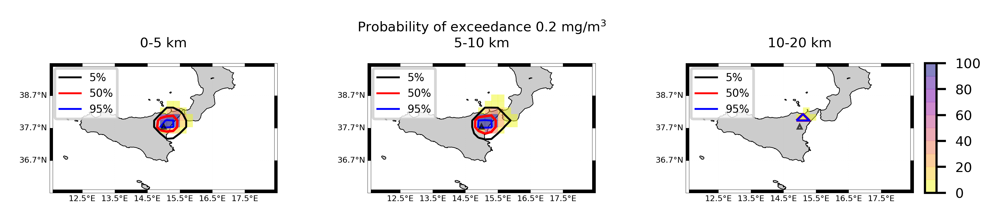
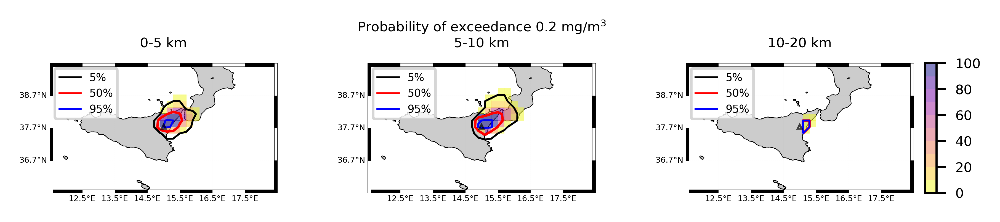
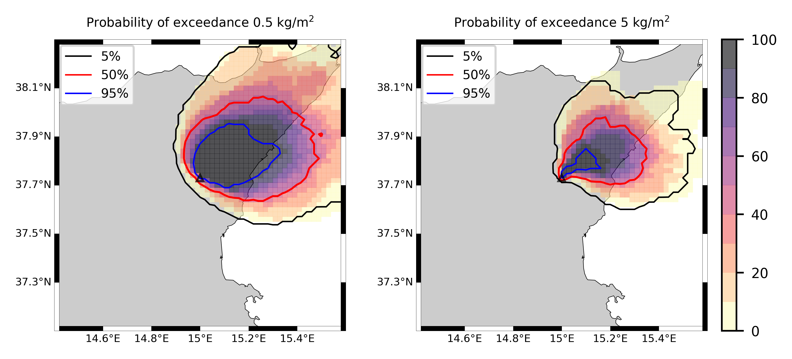
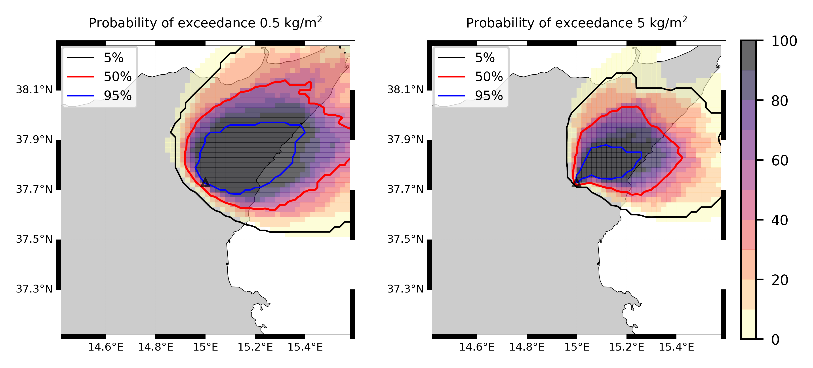

Forecast from VONA_20210304_0228Z
=================================

Contents
========

* [Forecast products](#forecast-products)
	* [Forecast at 2021-03-04 03:30 Z from RED VONA issued at 20210304_0228Z](#forecast-at-2021-03-04-0330-z-from-red-vona-issued-at-20210304_0228z)
	* [Forecast at 2021-03-04 04:30 Z from RED VONA issued at 20210304_0228Z](#forecast-at-2021-03-04-0430-z-from-red-vona-issued-at-20210304_0228z)
	* [Forecast at 2021-03-04 05:30 Z from RED VONA issued at 20210304_0228Z](#forecast-at-2021-03-04-0530-z-from-red-vona-issued-at-20210304_0228z)
	* [Forecast at 2021-03-04 08:30 Z from RED VONA issued at 20210304_0228Z](#forecast-at-2021-03-04-0830-z-from-red-vona-issued-at-20210304_0228z)
	* [Forecast at 2021-03-04 11:30 Z from RED VONA issued at 20210304_0228Z](#forecast-at-2021-03-04-1130-z-from-red-vona-issued-at-20210304_0228z)
	* [Forecast at 2021-03-04 14:30 Z from RED VONA issued at 20210304_0228Z](#forecast-at-2021-03-04-1430-z-from-red-vona-issued-at-20210304_0228z)
	* [Forecast at 2021-03-04 08:50 Z from RED VONA issued at 20210304_0751Z](#forecast-at-2021-03-04-0850-z-from-red-vona-issued-at-20210304_0751z)
	* [Forecast at 2021-03-04 09:00 Z from RED VONA issued at 20210304_0755Z](#forecast-at-2021-03-04-0900-z-from-red-vona-issued-at-20210304_0755z)
	* [Forecast at 2021-03-04 10:00 Z from RED VONA issued at 20210304_0755Z](#forecast-at-2021-03-04-1000-z-from-red-vona-issued-at-20210304_0755z)
	* [Forecast at 2021-03-04 11:00 Z from RED VONA issued at 20210304_0755Z](#forecast-at-2021-03-04-1100-z-from-red-vona-issued-at-20210304_0755z)
	* [Forecast at 2021-03-04 14:00 Z from RED VONA issued at 20210304_0755Z](#forecast-at-2021-03-04-1400-z-from-red-vona-issued-at-20210304_0755z)
	* [Forecast at 2021-03-04 09:20 Z from RED VONA issued at 20210304_0817Z](#forecast-at-2021-03-04-0920-z-from-red-vona-issued-at-20210304_0817z)
	* [Forecast at 2021-03-04 10:20 Z from RED VONA issued at 20210304_0817Z](#forecast-at-2021-03-04-1020-z-from-red-vona-issued-at-20210304_0817z)
	* [Forecast at 2021-03-04 11:20 Z from RED VONA issued at 20210304_0817Z](#forecast-at-2021-03-04-1120-z-from-red-vona-issued-at-20210304_0817z)
	* [Forecast at 2021-03-04 14:20 Z from RED VONA issued at 20210304_0817Z](#forecast-at-2021-03-04-1420-z-from-red-vona-issued-at-20210304_0817z)
	* [Forecast at 2021-03-04 17:20 Z from RED VONA issued at 20210304_0817Z](#forecast-at-2021-03-04-1720-z-from-red-vona-issued-at-20210304_0817z)
	* [Forecast at 2021-03-04 20:20 Z from RED VONA issued at 20210304_0817Z](#forecast-at-2021-03-04-2020-z-from-red-vona-issued-at-20210304_0817z)

# Forecast products

## Forecast at 2021-03-04 03:30 Z from RED VONA issued at 20210304_0228Z
  

|Eruption start [Z]|Eruption end [Z]|Forecast time [Z]|Column height asl [m]|
| :--- | :--- | :--- | :--- |
|2021-03-04 02:30:00|Ongoing|2021-03-04 03:30:00|5000 ± 500 - from VONA|
  
  

|Percentile|MER [kg/s¹]|Mass air [kg]|Mass air nested dom. [kg]|Mass grd [kg]|Mass grd nested dom. [kg]|
| :--- | :--- | :--- | :--- | :--- | :--- |
|5th|4.30e+02|8.35e+05|8.35e+05|1.23e+06|1.23e+06|
|50th|2.76e+03|3.55e+06|3.55e+06|6.61e+06|6.61e+06|
|95th|7.98e+03|1.15e+07|1.15e+07|1.98e+07|1.98e+07|
  

### Ground Nested Domain 2021-03-04 03:30 Z
  
  
  
  
  
  
  
  
  
  
  
  
  
  
  
  
  
  
  
  
  
  
  
  
  

|Location|Ground load [kg/m²] 5th perc|Ground load [kg/m²] 50th perc|Ground load [kg/m²] 95th perc|
| :--- | :--- | :--- | :--- |
|Piano Provenzana (1)|0.00e+00|2.88e-03|3.60e-02|
|Bivio Provenzana-Linguaglossa (2)|0.00e+00|1.55e-04|1.80e-02|
|Cunetta pre-Citelli (3)|0.00e+00|9.73e-04|5.65e-02|
|Chalet (4)|0.00e+00|0.00e+00|8.05e-04|
|Ragabo (5)|0.00e+00|3.16e-06|1.96e-03|
|Scilio (6)|0.00e+00|0.00e+00|1.15e-05|
|Gambino vini (7)|0.00e+00|0.00e+00|3.58e-05|
|StazioneFce Linguaglossa (8)|0.00e+00|0.00e+00|0.00e+00|
|Linguaglossa Via Olivio Sozzi (9)|0.00e+00|0.00e+00|0.00e+00|
|Cim.Linguaglossa (10)|0.00e+00|0.00e+00|0.00e+00|
|Gole Bar (11)|0.00e+00|0.00e+00|0.00e+00|
|Francavilla - Orange (12)|0.00e+00|0.00e+00|0.00e+00|
|Roccalumera1 (13)|0.00e+00|0.00e+00|0.00e+00|
|Roccalumera2 (14)|0.00e+00|0.00e+00|0.00e+00|
|Nizza (15)|0.00e+00|0.00e+00|0.00e+00|
|Scaletta Zanclea (16)|0.00e+00|0.00e+00|0.00e+00|
|Alì (17)|0.00e+00|0.00e+00|0.00e+00|
|Catania AP (18)|0.00e+00|0.00e+00|0.00e+00|
|Nicolosi (19)|0.00e+00|0.00e+00|0.00e+00|
|Zafferana (20)|0.00e+00|0.00e+00|0.00e+00|
|Linguaglossa (21)|0.00e+00|0.00e+00|0.00e+00|
|Randazzo (22)|0.00e+00|0.00e+00|0.00e+00|
|Bronte (23)|0.00e+00|0.00e+00|0.00e+00|
|Biancavilla (24)|0.00e+00|0.00e+00|0.00e+00|
  

### Atmosphere 2021-03-04 03:30 Z
  

## Forecast at 2021-03-04 04:30 Z from RED VONA issued at 20210304_0228Z
  

|Eruption start [Z]|Eruption end [Z]|Forecast time [Z]|Column height asl [m]|
| :--- | :--- | :--- | :--- |
|2021-03-04 02:30:00|Ongoing|2021-03-04 04:30:00|5000 ± 500 - from VONA|
  
  

|Percentile|MER [kg/s¹]|Mass air [kg]|Mass air nested dom. [kg]|Mass grd [kg]|Mass grd nested dom. [kg]|
| :--- | :--- | :--- | :--- | :--- | :--- |
|5th|2.85e+02|1.85e+06|1.85e+06|7.15e+06|7.15e+06|
|50th|2.84e+03|5.58e+06|5.57e+06|2.12e+07|2.12e+07|
|95th|1.31e+04|2.33e+07|2.33e+07|4.81e+07|4.81e+07|
  

### Ground Nested Domain 2021-03-04 04:30 Z
  
  
  
  
  
  
  
  
  
  
  
  
  
  
  
  
  
  
  
  
  
  
  
  
  

|Location|Ground load [kg/m²] 5th perc|Ground load [kg/m²] 50th perc|Ground load [kg/m²] 95th perc|
| :--- | :--- | :--- | :--- |
|Piano Provenzana (1)|9.10e-04|2.62e-02|7.30e-02|
|Bivio Provenzana-Linguaglossa (2)|5.41e-06|9.22e-03|1.64e-01|
|Cunetta pre-Citelli (3)|5.26e-04|1.56e-02|1.99e-01|
|Chalet (4)|0.00e+00|1.35e-03|2.15e-02|
|Ragabo (5)|0.00e+00|3.52e-03|3.00e-02|
|Scilio (6)|0.00e+00|7.25e-06|5.10e-03|
|Gambino vini (7)|0.00e+00|0.00e+00|3.52e-03|
|StazioneFce Linguaglossa (8)|0.00e+00|0.00e+00|4.94e-03|
|Linguaglossa Via Olivio Sozzi (9)|0.00e+00|0.00e+00|4.48e-03|
|Cim.Linguaglossa (10)|0.00e+00|0.00e+00|5.22e-03|
|Gole Bar (11)|0.00e+00|0.00e+00|2.98e-05|
|Francavilla - Orange (12)|0.00e+00|0.00e+00|2.98e-04|
|Roccalumera1 (13)|0.00e+00|0.00e+00|0.00e+00|
|Roccalumera2 (14)|0.00e+00|0.00e+00|0.00e+00|
|Nizza (15)|0.00e+00|0.00e+00|0.00e+00|
|Scaletta Zanclea (16)|0.00e+00|0.00e+00|0.00e+00|
|Alì (17)|0.00e+00|0.00e+00|0.00e+00|
|Catania AP (18)|0.00e+00|0.00e+00|0.00e+00|
|Nicolosi (19)|0.00e+00|0.00e+00|0.00e+00|
|Zafferana (20)|0.00e+00|0.00e+00|2.00e-05|
|Linguaglossa (21)|0.00e+00|0.00e+00|4.26e-03|
|Randazzo (22)|0.00e+00|0.00e+00|0.00e+00|
|Bronte (23)|0.00e+00|0.00e+00|0.00e+00|
|Biancavilla (24)|0.00e+00|0.00e+00|0.00e+00|
  

### Atmosphere 2021-03-04 04:30 Z
  

## Forecast at 2021-03-04 05:30 Z from RED VONA issued at 20210304_0228Z
  

|Eruption start [Z]|Eruption end [Z]|Forecast time [Z]|Column height asl [m]|
| :--- | :--- | :--- | :--- |
|2021-03-04 02:30:00|Ongoing|2021-03-04 05:30:00|5000 ± 500 - from VONA|
  
  

|Percentile|MER [kg/s¹]|Mass air [kg]|Mass air nested dom. [kg]|Mass grd [kg]|Mass grd nested dom. [kg]|
| :--- | :--- | :--- | :--- | :--- | :--- |
|5th|7.33e+02|2.32e+06|2.32e+06|1.33e+07|1.33e+07|
|50th|3.06e+03|7.61e+06|7.61e+06|3.18e+07|3.18e+07|
|95th|1.43e+04|2.30e+07|2.30e+07|6.86e+07|6.86e+07|
  

### Ground Nested Domain 2021-03-04 05:30 Z
  
  
  
  
  
  
  
  
  
  
  
  
  
  
  
  
  
  
  
  
  
  
  
  
  

|Location|Ground load [kg/m²] 5th perc|Ground load [kg/m²] 50th perc|Ground load [kg/m²] 95th perc|
| :--- | :--- | :--- | :--- |
|Piano Provenzana (1)|5.48e-03|5.46e-02|2.56e-01|
|Bivio Provenzana-Linguaglossa (2)|5.74e-03|3.18e-02|2.28e-01|
|Cunetta pre-Citelli (3)|6.82e-03|7.60e-02|2.97e-01|
|Chalet (4)|0.00e+00|6.12e-03|5.53e-02|
|Ragabo (5)|2.09e-04|1.15e-02|7.18e-02|
|Scilio (6)|0.00e+00|4.61e-04|1.12e-02|
|Gambino vini (7)|0.00e+00|1.03e-03|1.43e-02|
|StazioneFce Linguaglossa (8)|0.00e+00|7.85e-06|1.63e-02|
|Linguaglossa Via Olivio Sozzi (9)|0.00e+00|2.09e-05|1.80e-02|
|Cim.Linguaglossa (10)|0.00e+00|1.53e-05|9.91e-03|
|Gole Bar (11)|0.00e+00|0.00e+00|9.10e-04|
|Francavilla - Orange (12)|0.00e+00|0.00e+00|6.84e-04|
|Roccalumera1 (13)|0.00e+00|0.00e+00|0.00e+00|
|Roccalumera2 (14)|0.00e+00|0.00e+00|0.00e+00|
|Nizza (15)|0.00e+00|0.00e+00|0.00e+00|
|Scaletta Zanclea (16)|0.00e+00|0.00e+00|0.00e+00|
|Alì (17)|0.00e+00|0.00e+00|0.00e+00|
|Catania AP (18)|0.00e+00|0.00e+00|0.00e+00|
|Nicolosi (19)|0.00e+00|0.00e+00|0.00e+00|
|Zafferana (20)|0.00e+00|0.00e+00|4.00e-05|
|Linguaglossa (21)|0.00e+00|5.55e-06|1.66e-02|
|Randazzo (22)|0.00e+00|0.00e+00|1.19e-02|
|Bronte (23)|0.00e+00|0.00e+00|0.00e+00|
|Biancavilla (24)|0.00e+00|0.00e+00|0.00e+00|
  

### Atmosphere 2021-03-04 05:30 Z
  

## Forecast at 2021-03-04 08:30 Z from RED VONA issued at 20210304_0228Z
  

|Eruption start [Z]|Eruption end [Z]|Forecast time [Z]|Column height asl [m]|
| :--- | :--- | :--- | :--- |
|2021-03-04 02:30:00|Ongoing|2021-03-04 08:30:00|5000 ± 500 - from VONA|
  
  

|Percentile|MER [kg/s¹]|Mass air [kg]|Mass air nested dom. [kg]|Mass grd [kg]|Mass grd nested dom. [kg]|
| :--- | :--- | :--- | :--- | :--- | :--- |
|5th|2.40e+02|2.03e+06|2.03e+06|3.49e+07|3.48e+07|
|50th|1.85e+03|6.81e+06|6.81e+06|5.60e+07|5.60e+07|
|95th|6.39e+03|1.62e+07|1.62e+07|1.02e+08|1.02e+08|
  

### Ground Nested Domain 2021-03-04 08:30 Z
  
  
  
  
  
  
  
  
  
  
  
  
  
  
  
  
  
  
  
  
  
  
  
  
  

|Location|Ground load [kg/m²] 5th perc|Ground load [kg/m²] 50th perc|Ground load [kg/m²] 95th perc|
| :--- | :--- | :--- | :--- |
|Piano Provenzana (1)|3.02e-02|1.18e-01|3.26e-01|
|Bivio Provenzana-Linguaglossa (2)|2.00e-02|7.31e-02|2.45e-01|
|Cunetta pre-Citelli (3)|3.91e-02|1.37e-01|3.14e-01|
|Chalet (4)|7.08e-03|2.53e-02|9.33e-02|
|Ragabo (5)|1.00e-02|3.50e-02|1.10e-01|
|Scilio (6)|7.25e-06|4.16e-03|2.19e-02|
|Gambino vini (7)|5.97e-06|2.41e-03|3.36e-02|
|StazioneFce Linguaglossa (8)|7.85e-06|3.45e-03|1.66e-02|
|Linguaglossa Via Olivio Sozzi (9)|1.67e-05|2.06e-03|1.97e-02|
|Cim.Linguaglossa (10)|0.00e+00|2.70e-03|2.07e-02|
|Gole Bar (11)|0.00e+00|1.43e-04|6.35e-03|
|Francavilla - Orange (12)|0.00e+00|3.98e-04|3.28e-03|
|Roccalumera1 (13)|0.00e+00|0.00e+00|0.00e+00|
|Roccalumera2 (14)|0.00e+00|0.00e+00|0.00e+00|
|Nizza (15)|0.00e+00|0.00e+00|0.00e+00|
|Scaletta Zanclea (16)|0.00e+00|0.00e+00|0.00e+00|
|Alì (17)|0.00e+00|0.00e+00|0.00e+00|
|Catania AP (18)|0.00e+00|0.00e+00|0.00e+00|
|Nicolosi (19)|0.00e+00|0.00e+00|0.00e+00|
|Zafferana (20)|0.00e+00|0.00e+00|4.00e-05|
|Linguaglossa (21)|0.00e+00|2.60e-03|1.68e-02|
|Randazzo (22)|0.00e+00|1.33e-05|2.09e-02|
|Bronte (23)|0.00e+00|0.00e+00|0.00e+00|
|Biancavilla (24)|0.00e+00|0.00e+00|0.00e+00|
  

### Atmosphere 2021-03-04 08:30 Z
  

## Forecast at 2021-03-04 11:30 Z from RED VONA issued at 20210304_0228Z
  

|Eruption start [Z]|Eruption end [Z]|Forecast time [Z]|Column height asl [m]|
| :--- | :--- | :--- | :--- |
|2021-03-04 02:30:00|Ongoing|2021-03-04 11:30:00|5000 ± 500 - from VONA|
  
  

|Percentile|MER [kg/s¹]|Mass air [kg]|Mass air nested dom. [kg]|Mass grd [kg]|Mass grd nested dom. [kg]|
| :--- | :--- | :--- | :--- | :--- | :--- |
|5th|2.34e+02|5.34e+06|5.34e+06|3.71e+07|3.71e+07|
|50th|2.46e+03|1.18e+07|1.11e+07|8.85e+07|8.85e+07|
|95th|1.24e+04|3.25e+07|3.25e+07|1.67e+08|1.67e+08|
  

### Ground Nested Domain 2021-03-04 11:30 Z
  
  
  
  
  
  
  
  
  
  
  
  
  
  
  
  
  
  
  
  
  
  
  
  
  

|Location|Ground load [kg/m²] 5th perc|Ground load [kg/m²] 50th perc|Ground load [kg/m²] 95th perc|
| :--- | :--- | :--- | :--- |
|Piano Provenzana (1)|3.31e-02|1.52e-01|5.20e-01|
|Bivio Provenzana-Linguaglossa (2)|2.06e-02|9.98e-02|2.68e-01|
|Cunetta pre-Citelli (3)|5.14e-02|1.64e-01|3.86e-01|
|Chalet (4)|9.05e-03|3.63e-02|1.27e-01|
|Ragabo (5)|1.29e-02|4.94e-02|1.83e-01|
|Scilio (6)|5.13e-05|6.15e-03|2.61e-02|
|Gambino vini (7)|4.78e-05|6.00e-03|3.48e-02|
|StazioneFce Linguaglossa (8)|7.85e-06|5.08e-03|2.50e-02|
|Linguaglossa Via Olivio Sozzi (9)|2.09e-05|4.76e-03|3.01e-02|
|Cim.Linguaglossa (10)|0.00e+00|5.48e-03|2.49e-02|
|Gole Bar (11)|0.00e+00|1.28e-03|8.12e-03|
|Francavilla - Orange (12)|5.01e-06|1.40e-03|7.77e-03|
|Roccalumera1 (13)|0.00e+00|0.00e+00|2.05e-04|
|Roccalumera2 (14)|0.00e+00|0.00e+00|8.59e-05|
|Nizza (15)|0.00e+00|0.00e+00|1.22e-04|
|Scaletta Zanclea (16)|0.00e+00|0.00e+00|3.06e-05|
|Alì (17)|0.00e+00|0.00e+00|4.70e-05|
|Catania AP (18)|0.00e+00|0.00e+00|0.00e+00|
|Nicolosi (19)|0.00e+00|0.00e+00|0.00e+00|
|Zafferana (20)|0.00e+00|0.00e+00|4.00e-05|
|Linguaglossa (21)|0.00e+00|4.33e-03|2.12e-02|
|Randazzo (22)|0.00e+00|3.42e-04|3.91e-02|
|Bronte (23)|0.00e+00|0.00e+00|0.00e+00|
|Biancavilla (24)|0.00e+00|0.00e+00|0.00e+00|
  

### Atmosphere 2021-03-04 11:30 Z
  

## Forecast at 2021-03-04 14:30 Z from RED VONA issued at 20210304_0228Z
  

|Eruption start [Z]|Eruption end [Z]|Forecast time [Z]|Column height asl [m]|
| :--- | :--- | :--- | :--- |
|2021-03-04 02:30:00|Ongoing|2021-03-04 14:30:00|5000 ± 500 - from VONA|
  
  

|Percentile|MER [kg/s¹]|Mass air [kg]|Mass air nested dom. [kg]|Mass grd [kg]|Mass grd nested dom. [kg]|
| :--- | :--- | :--- | :--- | :--- | :--- |
|5th|7.51e+02|6.98e+06|6.61e+06|7.85e+07|7.86e+07|
|50th|4.00e+03|2.29e+07|2.14e+07|1.67e+08|1.67e+08|
|95th|1.90e+04|6.37e+07|6.21e+07|2.83e+08|2.83e+08|
  

### Ground Nested Domain 2021-03-04 14:30 Z
  
  
  
  
  
  
  
  
  
  
  
  
  
  
  
  
  
  
  
  
  
  
  
  
  

|Location|Ground load [kg/m²] 5th perc|Ground load [kg/m²] 50th perc|Ground load [kg/m²] 95th perc|
| :--- | :--- | :--- | :--- |
|Piano Provenzana (1)|6.20e-02|3.82e-01|2.43e+00|
|Bivio Provenzana-Linguaglossa (2)|7.70e-02|1.86e-01|9.78e-01|
|Cunetta pre-Citelli (3)|5.73e-02|2.12e-01|1.33e+00|
|Chalet (4)|2.00e-02|6.78e-02|2.62e-01|
|Ragabo (5)|4.04e-02|1.05e-01|5.85e-01|
|Scilio (6)|1.24e-03|1.29e-02|7.23e-02|
|Gambino vini (7)|6.27e-04|1.47e-02|1.11e-01|
|StazioneFce Linguaglossa (8)|3.82e-04|9.89e-03|6.12e-02|
|Linguaglossa Via Olivio Sozzi (9)|6.36e-04|1.22e-02|7.10e-02|
|Cim.Linguaglossa (10)|1.39e-04|7.60e-03|5.66e-02|
|Gole Bar (11)|7.89e-05|2.48e-03|1.44e-02|
|Francavilla - Orange (12)|2.34e-04|2.36e-03|2.03e-02|
|Roccalumera1 (13)|0.00e+00|0.00e+00|1.02e-03|
|Roccalumera2 (14)|0.00e+00|0.00e+00|8.63e-04|
|Nizza (15)|0.00e+00|0.00e+00|1.12e-03|
|Scaletta Zanclea (16)|0.00e+00|5.59e-06|3.80e-04|
|Alì (17)|0.00e+00|0.00e+00|7.14e-04|
|Catania AP (18)|0.00e+00|0.00e+00|0.00e+00|
|Nicolosi (19)|0.00e+00|0.00e+00|0.00e+00|
|Zafferana (20)|0.00e+00|0.00e+00|4.00e-05|
|Linguaglossa (21)|2.53e-04|8.30e-03|4.45e-02|
|Randazzo (22)|3.33e-06|1.62e-03|7.38e-02|
|Bronte (23)|0.00e+00|0.00e+00|0.00e+00|
|Biancavilla (24)|0.00e+00|0.00e+00|0.00e+00|
  

### Atmosphere 2021-03-04 14:30 Z
  

## Forecast at 2021-03-04 08:50 Z from RED VONA issued at 20210304_0751Z
  

|Eruption start [Z]|Eruption end [Z]|Forecast time [Z]|Column height asl [m]|
| :--- | :--- | :--- | :--- |
|2021-03-04 02:30:00|Ongoing|2021-03-04 08:50:00|6000 ± 500 - from VONA|
  
  

|Percentile|MER [kg/s¹]|Mass air [kg]|Mass air nested dom. [kg]|Mass grd [kg]|Mass grd nested dom. [kg]|
| :--- | :--- | :--- | :--- | :--- | :--- |
|5th|1.65e+03|7.63e+06|7.62e+06|4.89e+07|4.89e+07|
|50th|6.23e+03|1.50e+07|1.50e+07|6.74e+07|6.74e+07|
|95th|1.71e+04|3.76e+07|3.76e+07|1.35e+08|1.35e+08|
  

### Ground Nested Domain 2021-03-04 08:50 Z
  
  
  
  
  
  
  
  
  
  
  
  
  
  
  
  
  
  
  
  
  
  
  
  
  

|Location|Ground load [kg/m²] 5th perc|Ground load [kg/m²] 50th perc|Ground load [kg/m²] 95th perc|
| :--- | :--- | :--- | :--- |
|Piano Provenzana (1)|3.24e-02|1.18e-01|4.40e-01|
|Bivio Provenzana-Linguaglossa (2)|3.05e-02|7.41e-02|3.16e-01|
|Cunetta pre-Citelli (3)|3.91e-02|1.51e-01|4.88e-01|
|Chalet (4)|9.08e-03|2.74e-02|1.08e-01|
|Ragabo (5)|1.31e-02|3.39e-02|1.34e-01|
|Scilio (6)|7.25e-06|4.73e-03|3.15e-02|
|Gambino vini (7)|5.97e-06|4.30e-03|4.79e-02|
|StazioneFce Linguaglossa (8)|7.85e-06|3.88e-03|1.85e-02|
|Linguaglossa Via Olivio Sozzi (9)|2.09e-05|2.71e-03|1.97e-02|
|Cim.Linguaglossa (10)|0.00e+00|2.79e-03|2.92e-02|
|Gole Bar (11)|0.00e+00|6.97e-05|7.75e-03|
|Francavilla - Orange (12)|0.00e+00|4.16e-04|5.12e-03|
|Roccalumera1 (13)|0.00e+00|0.00e+00|0.00e+00|
|Roccalumera2 (14)|0.00e+00|0.00e+00|0.00e+00|
|Nizza (15)|0.00e+00|0.00e+00|0.00e+00|
|Scaletta Zanclea (16)|0.00e+00|0.00e+00|0.00e+00|
|Alì (17)|0.00e+00|0.00e+00|0.00e+00|
|Catania AP (18)|0.00e+00|0.00e+00|0.00e+00|
|Nicolosi (19)|0.00e+00|0.00e+00|0.00e+00|
|Zafferana (20)|0.00e+00|0.00e+00|4.00e-05|
|Linguaglossa (21)|0.00e+00|2.94e-03|1.88e-02|
|Randazzo (22)|0.00e+00|4.00e-05|2.09e-02|
|Bronte (23)|0.00e+00|0.00e+00|0.00e+00|
|Biancavilla (24)|0.00e+00|0.00e+00|0.00e+00|
  

### Atmosphere 2021-03-04 08:50 Z
  

## Forecast at 2021-03-04 09:00 Z from RED VONA issued at 20210304_0755Z
  

|Eruption start [Z]|Eruption end [Z]|Forecast time [Z]|Column height asl [m]|
| :--- | :--- | :--- | :--- |
|2021-03-04 02:30:00|Ongoing|2021-03-04 09:00:00|6500 ± 500 - from VONA|
  
  

|Percentile|MER [kg/s¹]|Mass air [kg]|Mass air nested dom. [kg]|Mass grd [kg]|Mass grd nested dom. [kg]|
| :--- | :--- | :--- | :--- | :--- | :--- |
|5th|3.16e+03|1.01e+07|1.01e+07|5.20e+07|5.20e+07|
|50th|8.95e+03|2.06e+07|2.06e+07|8.08e+07|8.08e+07|
|95th|2.96e+04|6.60e+07|6.60e+07|1.47e+08|1.47e+08|
  

### Ground Nested Domain 2021-03-04 09:00 Z
  
  
  
  
  
  
  
  
  
  
  
  
  
  
  
  
  
  
  
  
  
  
  
  
  

|Location|Ground load [kg/m²] 5th perc|Ground load [kg/m²] 50th perc|Ground load [kg/m²] 95th perc|
| :--- | :--- | :--- | :--- |
|Piano Provenzana (1)|3.56e-02|1.35e-01|4.70e-01|
|Bivio Provenzana-Linguaglossa (2)|2.04e-02|8.92e-02|2.80e-01|
|Cunetta pre-Citelli (3)|5.09e-02|1.53e-01|5.36e-01|
|Chalet (4)|7.09e-03|2.89e-02|1.04e-01|
|Ragabo (5)|1.01e-02|3.78e-02|1.24e-01|
|Scilio (6)|2.00e-05|4.56e-03|7.68e-02|
|Gambino vini (7)|4.18e-05|2.56e-03|8.65e-02|
|StazioneFce Linguaglossa (8)|7.85e-06|4.57e-03|4.16e-02|
|Linguaglossa Via Olivio Sozzi (9)|2.09e-05|3.49e-03|2.31e-02|
|Cim.Linguaglossa (10)|0.00e+00|4.28e-03|7.52e-02|
|Gole Bar (11)|0.00e+00|2.44e-04|7.73e-03|
|Francavilla - Orange (12)|0.00e+00|8.04e-04|3.82e-03|
|Roccalumera1 (13)|0.00e+00|0.00e+00|0.00e+00|
|Roccalumera2 (14)|0.00e+00|0.00e+00|0.00e+00|
|Nizza (15)|0.00e+00|0.00e+00|0.00e+00|
|Scaletta Zanclea (16)|0.00e+00|0.00e+00|0.00e+00|
|Alì (17)|0.00e+00|0.00e+00|0.00e+00|
|Catania AP (18)|0.00e+00|0.00e+00|0.00e+00|
|Nicolosi (19)|0.00e+00|0.00e+00|0.00e+00|
|Zafferana (20)|0.00e+00|0.00e+00|1.66e-03|
|Linguaglossa (21)|0.00e+00|3.30e-03|3.90e-02|
|Randazzo (22)|0.00e+00|1.33e-05|2.09e-02|
|Bronte (23)|0.00e+00|0.00e+00|0.00e+00|
|Biancavilla (24)|0.00e+00|0.00e+00|0.00e+00|
  

### Atmosphere 2021-03-04 09:00 Z
  

## Forecast at 2021-03-04 10:00 Z from RED VONA issued at 20210304_0755Z
  

|Eruption start [Z]|Eruption end [Z]|Forecast time [Z]|Column height asl [m]|
| :--- | :--- | :--- | :--- |
|2021-03-04 02:30:00|Ongoing|2021-03-04 10:00:00|6500 ± 500 - from VONA|
  
  

|Percentile|MER [kg/s¹]|Mass air [kg]|Mass air nested dom. [kg]|Mass grd [kg]|Mass grd nested dom. [kg]|
| :--- | :--- | :--- | :--- | :--- | :--- |
|5th|5.39e+03|1.96e+07|1.96e+07|7.08e+07|7.08e+07|
|50th|1.23e+04|3.62e+07|3.62e+07|1.56e+08|1.56e+08|
|95th|3.47e+04|7.32e+07|7.31e+07|2.43e+08|2.43e+08|
  

### Ground Nested Domain 2021-03-04 10:00 Z
  
  
  
  
  
  
  
  
  
  
  
  
  
  
  
  
  
  
  
  
  
  
  
  
  

|Location|Ground load [kg/m²] 5th perc|Ground load [kg/m²] 50th perc|Ground load [kg/m²] 95th perc|
| :--- | :--- | :--- | :--- |
|Piano Provenzana (1)|6.89e-02|2.49e-01|1.06e+00|
|Bivio Provenzana-Linguaglossa (2)|3.35e-02|1.68e-01|9.94e-01|
|Cunetta pre-Citelli (3)|5.18e-02|2.51e-01|1.39e+00|
|Chalet (4)|7.09e-03|5.83e-02|4.80e-01|
|Ragabo (5)|1.01e-02|8.41e-02|4.79e-01|
|Scilio (6)|4.74e-04|1.01e-02|2.18e-01|
|Gambino vini (7)|4.50e-04|1.77e-02|3.09e-01|
|StazioneFce Linguaglossa (8)|2.09e-04|1.08e-02|1.30e-01|
|Linguaglossa Via Olivio Sozzi (9)|3.22e-04|1.47e-02|1.17e-01|
|Cim.Linguaglossa (10)|6.41e-05|7.20e-03|1.46e-01|
|Gole Bar (11)|1.86e-05|2.66e-03|1.56e-02|
|Francavilla - Orange (12)|2.02e-04|1.39e-03|9.14e-03|
|Roccalumera1 (13)|0.00e+00|0.00e+00|2.47e-06|
|Roccalumera2 (14)|0.00e+00|0.00e+00|0.00e+00|
|Nizza (15)|0.00e+00|0.00e+00|0.00e+00|
|Scaletta Zanclea (16)|0.00e+00|0.00e+00|0.00e+00|
|Alì (17)|0.00e+00|0.00e+00|0.00e+00|
|Catania AP (18)|0.00e+00|0.00e+00|0.00e+00|
|Nicolosi (19)|0.00e+00|0.00e+00|0.00e+00|
|Zafferana (20)|0.00e+00|0.00e+00|2.00e-03|
|Linguaglossa (21)|1.45e-04|9.77e-03|1.14e-01|
|Randazzo (22)|0.00e+00|8.33e-05|4.36e-02|
|Bronte (23)|0.00e+00|0.00e+00|0.00e+00|
|Biancavilla (24)|0.00e+00|0.00e+00|0.00e+00|
  

### Atmosphere 2021-03-04 10:00 Z
  

## Forecast at 2021-03-04 11:00 Z from RED VONA issued at 20210304_0755Z
  

|Eruption start [Z]|Eruption end [Z]|Forecast time [Z]|Column height asl [m]|
| :--- | :--- | :--- | :--- |
|2021-03-04 02:30:00|Ongoing|2021-03-04 11:00:00|6500 ± 500 - from VONA|
  
  

|Percentile|MER [kg/s¹]|Mass air [kg]|Mass air nested dom. [kg]|Mass grd [kg]|Mass grd nested dom. [kg]|
| :--- | :--- | :--- | :--- | :--- | :--- |
|5th|4.64e+03|2.30e+07|2.21e+07|1.09e+08|1.09e+08|
|50th|1.46e+04|3.98e+07|3.98e+07|1.80e+08|1.80e+08|
|95th|2.31e+04|7.34e+07|7.29e+07|3.02e+08|3.02e+08|
  

### Ground Nested Domain 2021-03-04 11:00 Z
  
  
  
  
  
  
  
  
  
  
  
  
  
  
  
  
  
  
  
  
  
  
  
  
  

|Location|Ground load [kg/m²] 5th perc|Ground load [kg/m²] 50th perc|Ground load [kg/m²] 95th perc|
| :--- | :--- | :--- | :--- |
|Piano Provenzana (1)|1.93e-01|3.68e-01|1.21e+00|
|Bivio Provenzana-Linguaglossa (2)|3.36e-02|3.15e-01|1.34e+00|
|Cunetta pre-Citelli (3)|5.18e-02|4.69e-01|1.72e+00|
|Chalet (4)|7.24e-03|1.33e-01|5.99e-01|
|Ragabo (5)|1.40e-02|1.80e-01|6.99e-01|
|Scilio (6)|1.49e-03|2.34e-02|4.75e-01|
|Gambino vini (7)|8.18e-04|2.77e-02|5.08e-01|
|StazioneFce Linguaglossa (8)|7.46e-04|1.97e-02|3.03e-01|
|Linguaglossa Via Olivio Sozzi (9)|6.52e-04|1.75e-02|1.92e-01|
|Cim.Linguaglossa (10)|4.12e-04|1.91e-02|4.34e-01|
|Gole Bar (11)|1.86e-05|4.94e-03|1.18e-01|
|Francavilla - Orange (12)|3.15e-04|7.46e-03|3.64e-02|
|Roccalumera1 (13)|0.00e+00|0.00e+00|2.34e-03|
|Roccalumera2 (14)|0.00e+00|0.00e+00|1.27e-03|
|Nizza (15)|0.00e+00|0.00e+00|1.79e-03|
|Scaletta Zanclea (16)|0.00e+00|0.00e+00|2.06e-05|
|Alì (17)|0.00e+00|0.00e+00|9.09e-05|
|Catania AP (18)|0.00e+00|0.00e+00|0.00e+00|
|Nicolosi (19)|0.00e+00|0.00e+00|0.00e+00|
|Zafferana (20)|0.00e+00|0.00e+00|2.32e-03|
|Linguaglossa (21)|4.21e-04|1.87e-02|2.80e-01|
|Randazzo (22)|0.00e+00|8.50e-05|7.91e-02|
|Bronte (23)|0.00e+00|0.00e+00|0.00e+00|
|Biancavilla (24)|0.00e+00|0.00e+00|0.00e+00|
  

### Atmosphere 2021-03-04 11:00 Z
  

## Forecast at 2021-03-04 14:00 Z from RED VONA issued at 20210304_0755Z
  

|Eruption start [Z]|Eruption end [Z]|Forecast time [Z]|Column height asl [m]|
| :--- | :--- | :--- | :--- |
|2021-03-04 02:30:00|Ongoing|2021-03-04 14:00:00|6500 ± 500 - from VONA|
  
  

|Percentile|MER [kg/s¹]|Mass air [kg]|Mass air nested dom. [kg]|Mass grd [kg]|Mass grd nested dom. [kg]|
| :--- | :--- | :--- | :--- | :--- | :--- |
|5th|6.58e+03|3.48e+07|3.47e+07|2.21e+08|2.21e+08|
|50th|1.80e+04|7.28e+07|7.01e+07|3.75e+08|3.74e+08|
|95th|5.02e+04|1.74e+08|1.55e+08|6.09e+08|6.08e+08|
  

### Ground Nested Domain 2021-03-04 14:00 Z
  
  
  
  
  
  
  
  
  
  
  
  
  
  
  
  
  
  
  
  
  
  
  
  
  

|Location|Ground load [kg/m²] 5th perc|Ground load [kg/m²] 50th perc|Ground load [kg/m²] 95th perc|
| :--- | :--- | :--- | :--- |
|Piano Provenzana (1)|3.40e-01|9.81e-01|2.59e+00|
|Bivio Provenzana-Linguaglossa (2)|2.27e-01|8.01e-01|2.24e+00|
|Cunetta pre-Citelli (3)|1.97e-01|1.33e+00|3.41e+00|
|Chalet (4)|5.32e-02|3.95e-01|1.10e+00|
|Ragabo (5)|1.28e-01|5.62e-01|1.20e+00|
|Scilio (6)|6.79e-03|1.60e-01|6.60e-01|
|Gambino vini (7)|3.91e-03|1.81e-01|9.00e-01|
|StazioneFce Linguaglossa (8)|9.72e-03|1.24e-01|4.09e-01|
|Linguaglossa Via Olivio Sozzi (9)|1.23e-02|1.27e-01|3.20e-01|
|Cim.Linguaglossa (10)|5.14e-03|1.35e-01|5.46e-01|
|Gole Bar (11)|1.16e-03|3.54e-02|2.36e-01|
|Francavilla - Orange (12)|5.99e-03|2.28e-02|1.53e-01|
|Roccalumera1 (13)|0.00e+00|5.27e-05|1.45e-02|
|Roccalumera2 (14)|0.00e+00|4.00e-05|1.04e-02|
|Nizza (15)|0.00e+00|1.81e-05|7.43e-03|
|Scaletta Zanclea (16)|0.00e+00|1.51e-05|6.20e-03|
|Alì (17)|0.00e+00|1.04e-04|6.25e-03|
|Catania AP (18)|0.00e+00|0.00e+00|0.00e+00|
|Nicolosi (19)|0.00e+00|0.00e+00|0.00e+00|
|Zafferana (20)|0.00e+00|0.00e+00|1.70e-02|
|Linguaglossa (21)|8.32e-03|1.17e-01|4.10e-01|
|Randazzo (22)|8.50e-05|1.32e-03|1.16e-01|
|Bronte (23)|0.00e+00|0.00e+00|0.00e+00|
|Biancavilla (24)|0.00e+00|0.00e+00|0.00e+00|
  

### Atmosphere 2021-03-04 14:00 Z
  

## Forecast at 2021-03-04 09:20 Z from RED VONA issued at 20210304_0817Z
  

|Eruption start [Z]|Eruption end [Z]|Forecast time [Z]|Column height asl [m]|
| :--- | :--- | :--- | :--- |
|2021-03-04 02:30:00|Ongoing|2021-03-04 09:20:00|11000 ± 500 - from VONA|
  
  

|Percentile|MER [kg/s¹]|Mass air [kg]|Mass air nested dom. [kg]|Mass grd [kg]|Mass grd nested dom. [kg]|
| :--- | :--- | :--- | :--- | :--- | :--- |
|5th|3.13e+05|6.72e+08|6.71e+08|5.76e+08|5.76e+08|
|50th|7.01e+05|1.44e+09|1.44e+09|1.15e+09|1.15e+09|
|95th|2.29e+06|4.67e+09|4.29e+09|2.81e+09|2.80e+09|
  

### Ground Nested Domain 2021-03-04 09:20 Z
  
  
  
  
  
  
  
  
  
  
  
  
  
  
  
  
  
  
  
  
  
  
  
  
  

|Location|Ground load [kg/m²] 5th perc|Ground load [kg/m²] 50th perc|Ground load [kg/m²] 95th perc|
| :--- | :--- | :--- | :--- |
|Piano Provenzana (1)|9.81e-01|2.49e+00|6.51e+00|
|Bivio Provenzana-Linguaglossa (2)|1.26e+00|3.10e+00|8.47e+00|
|Cunetta pre-Citelli (3)|2.82e+00|4.13e+00|7.53e+00|
|Chalet (4)|4.15e-01|2.38e+00|7.32e+00|
|Ragabo (5)|6.44e-01|2.50e+00|7.80e+00|
|Scilio (6)|1.12e-01|1.52e+00|6.02e+00|
|Gambino vini (7)|1.69e-01|1.79e+00|7.54e+00|
|StazioneFce Linguaglossa (8)|6.67e-02|8.69e-01|4.65e+00|
|Linguaglossa Via Olivio Sozzi (9)|6.19e-02|6.41e-01|5.61e+00|
|Cim.Linguaglossa (10)|8.50e-02|1.10e+00|5.13e+00|
|Gole Bar (11)|1.10e-02|1.87e-01|2.22e+00|
|Francavilla - Orange (12)|9.73e-03|5.19e-02|2.64e+00|
|Roccalumera1 (13)|0.00e+00|0.00e+00|4.44e-05|
|Roccalumera2 (14)|0.00e+00|0.00e+00|2.09e-06|
|Nizza (15)|0.00e+00|0.00e+00|0.00e+00|
|Scaletta Zanclea (16)|0.00e+00|0.00e+00|0.00e+00|
|Alì (17)|0.00e+00|0.00e+00|0.00e+00|
|Catania AP (18)|0.00e+00|0.00e+00|0.00e+00|
|Nicolosi (19)|0.00e+00|2.08e-03|3.44e-02|
|Zafferana (20)|2.03e-02|3.61e-01|1.19e+00|
|Linguaglossa (21)|5.92e-02|8.65e-01|4.20e+00|
|Randazzo (22)|1.30e-03|3.19e-02|3.78e-01|
|Bronte (23)|0.00e+00|0.00e+00|2.62e-03|
|Biancavilla (24)|0.00e+00|2.97e-05|1.02e-03|
  

### Atmosphere 2021-03-04 09:20 Z
  

## Forecast at 2021-03-04 10:20 Z from RED VONA issued at 20210304_0817Z
  

|Eruption start [Z]|Eruption end [Z]|Forecast time [Z]|Column height asl [m]|
| :--- | :--- | :--- | :--- |
|2021-03-04 02:30:00|Ongoing|2021-03-04 10:20:00|11000 ± 500 - from VONA|
  
  

|Percentile|MER [kg/s¹]|Mass air [kg]|Mass air nested dom. [kg]|Mass grd [kg]|Mass grd nested dom. [kg]|
| :--- | :--- | :--- | :--- | :--- | :--- |
|5th|1.79e+05|1.10e+09|1.09e+09|1.83e+09|1.83e+09|
|50th|9.49e+05|2.99e+09|2.98e+09|3.82e+09|3.82e+09|
|95th|1.73e+06|5.34e+09|4.67e+09|7.85e+09|7.70e+09|
  

### Ground Nested Domain 2021-03-04 10:20 Z
  
  
  
  
  
  
  
  
  
  
  
  
  
  
  
  
  
  
  
  
  
  
  
  
  

|Location|Ground load [kg/m²] 5th perc|Ground load [kg/m²] 50th perc|Ground load [kg/m²] 95th perc|
| :--- | :--- | :--- | :--- |
|Piano Provenzana (1)|3.26e+00|8.01e+00|1.26e+01|
|Bivio Provenzana-Linguaglossa (2)|4.90e+00|8.72e+00|1.59e+01|
|Cunetta pre-Citelli (3)|6.13e+00|1.13e+01|1.46e+01|
|Chalet (4)|3.30e+00|7.17e+00|1.85e+01|
|Ragabo (5)|3.48e+00|7.89e+00|1.84e+01|
|Scilio (6)|2.21e+00|5.84e+00|1.41e+01|
|Gambino vini (7)|2.63e+00|7.76e+00|1.28e+01|
|StazioneFce Linguaglossa (8)|1.99e+00|3.90e+00|1.47e+01|
|Linguaglossa Via Olivio Sozzi (9)|1.63e+00|3.48e+00|1.55e+01|
|Cim.Linguaglossa (10)|2.17e+00|5.56e+00|1.34e+01|
|Gole Bar (11)|3.70e-01|1.32e+00|8.48e+00|
|Francavilla - Orange (12)|1.80e-01|1.19e+00|7.74e+00|
|Roccalumera1 (13)|0.00e+00|2.35e-03|5.97e-01|
|Roccalumera2 (14)|0.00e+00|9.84e-04|4.00e-01|
|Nizza (15)|0.00e+00|7.78e-05|2.84e-01|
|Scaletta Zanclea (16)|0.00e+00|0.00e+00|2.32e-01|
|Alì (17)|0.00e+00|0.00e+00|1.46e-01|
|Catania AP (18)|0.00e+00|0.00e+00|0.00e+00|
|Nicolosi (19)|2.33e-05|1.63e-02|1.07e-01|
|Zafferana (20)|1.20e-01|1.11e+00|4.35e+00|
|Linguaglossa (21)|1.86e+00|3.74e+00|1.41e+01|
|Randazzo (22)|1.73e-02|1.21e-01|2.41e+00|
|Bronte (23)|0.00e+00|4.33e-05|7.00e-03|
|Biancavilla (24)|0.00e+00|2.24e-04|2.61e-03|
  

### Atmosphere 2021-03-04 10:20 Z
  

## Forecast at 2021-03-04 11:20 Z from RED VONA issued at 20210304_0817Z
  

|Eruption start [Z]|Eruption end [Z]|Forecast time [Z]|Column height asl [m]|
| :--- | :--- | :--- | :--- |
|2021-03-04 02:30:00|Ongoing|2021-03-04 11:20:00|11000 ± 500 - from VONA|
  
  

|Percentile|MER [kg/s¹]|Mass air [kg]|Mass air nested dom. [kg]|Mass grd [kg]|Mass grd nested dom. [kg]|
| :--- | :--- | :--- | :--- | :--- | :--- |
|5th|2.79e+05|2.02e+09|2.01e+09|4.33e+09|4.32e+09|
|50th|7.24e+05|3.59e+09|2.92e+09|6.81e+09|6.79e+09|
|95th|3.00e+06|7.58e+09|6.70e+09|1.05e+10|1.04e+10|
  

### Ground Nested Domain 2021-03-04 11:20 Z
  
  
  
  
  
  
  
  
  
  
  
  
  
  
  
  
  
  
  
  
  
  
  
  
  

|Location|Ground load [kg/m²] 5th perc|Ground load [kg/m²] 50th perc|Ground load [kg/m²] 95th perc|
| :--- | :--- | :--- | :--- |
|Piano Provenzana (1)|7.84e+00|1.27e+01|1.99e+01|
|Bivio Provenzana-Linguaglossa (2)|8.03e+00|1.36e+01|2.14e+01|
|Cunetta pre-Citelli (3)|9.00e+00|1.74e+01|2.47e+01|
|Chalet (4)|6.82e+00|1.31e+01|2.21e+01|
|Ragabo (5)|7.27e+00|1.26e+01|2.23e+01|
|Scilio (6)|5.13e+00|9.93e+00|1.97e+01|
|Gambino vini (7)|5.11e+00|1.20e+01|1.93e+01|
|StazioneFce Linguaglossa (8)|4.57e+00|8.86e+00|1.95e+01|
|Linguaglossa Via Olivio Sozzi (9)|4.02e+00|8.55e+00|2.00e+01|
|Cim.Linguaglossa (10)|4.29e+00|9.13e+00|1.86e+01|
|Gole Bar (11)|1.52e+00|4.16e+00|1.17e+01|
|Francavilla - Orange (12)|4.44e-01|3.87e+00|9.70e+00|
|Roccalumera1 (13)|7.47e-03|2.02e-01|1.19e+00|
|Roccalumera2 (14)|2.19e-03|1.57e-01|9.52e-01|
|Nizza (15)|1.88e-03|1.18e-01|8.67e-01|
|Scaletta Zanclea (16)|5.59e-06|7.84e-03|9.37e-01|
|Alì (17)|8.31e-04|5.97e-02|8.64e-01|
|Catania AP (18)|0.00e+00|0.00e+00|0.00e+00|
|Nicolosi (19)|1.72e-03|4.70e-02|1.62e-01|
|Zafferana (20)|6.74e-01|1.83e+00|5.43e+00|
|Linguaglossa (21)|4.42e+00|8.65e+00|1.88e+01|
|Randazzo (22)|2.71e-02|2.69e-01|2.79e+00|
|Bronte (23)|0.00e+00|1.71e-03|9.14e-03|
|Biancavilla (24)|0.00e+00|3.39e-04|2.62e-03|
  

### Atmosphere 2021-03-04 11:20 Z
  

## Forecast at 2021-03-04 14:20 Z from RED VONA issued at 20210304_0817Z
  

|Eruption start [Z]|Eruption end [Z]|Forecast time [Z]|Column height asl [m]|
| :--- | :--- | :--- | :--- |
|2021-03-04 02:30:00|Ongoing|2021-03-04 14:20:00|11000 ± 500 - from VONA|
  
  

|Percentile|MER [kg/s¹]|Mass air [kg]|Mass air nested dom. [kg]|Mass grd [kg]|Mass grd nested dom. [kg]|
| :--- | :--- | :--- | :--- | :--- | :--- |
|5th|2.75e+05|1.83e+09|1.18e+09|1.20e+10|1.15e+10|
|50th|1.08e+06|6.62e+09|3.74e+09|1.75e+10|1.61e+10|
|95th|2.46e+06|1.33e+10|7.69e+09|2.61e+10|2.42e+10|
  

### Ground Nested Domain 2021-03-04 14:20 Z
  
  
  
  
  
  
  
  
  
  
  
  
  
  
  
  
  
  
  
  
  
  
  
  
  

|Location|Ground load [kg/m²] 5th perc|Ground load [kg/m²] 50th perc|Ground load [kg/m²] 95th perc|
| :--- | :--- | :--- | :--- |
|Piano Provenzana (1)|1.39e+01|2.57e+01|4.64e+01|
|Bivio Provenzana-Linguaglossa (2)|2.07e+01|2.83e+01|4.19e+01|
|Cunetta pre-Citelli (3)|2.17e+01|3.32e+01|5.67e+01|
|Chalet (4)|1.58e+01|2.49e+01|3.70e+01|
|Ragabo (5)|1.62e+01|2.53e+01|3.72e+01|
|Scilio (6)|1.30e+01|2.12e+01|3.73e+01|
|Gambino vini (7)|1.90e+01|2.36e+01|3.73e+01|
|StazioneFce Linguaglossa (8)|9.31e+00|1.86e+01|3.58e+01|
|Linguaglossa Via Olivio Sozzi (9)|8.45e+00|1.79e+01|3.58e+01|
|Cim.Linguaglossa (10)|1.24e+01|1.94e+01|3.52e+01|
|Gole Bar (11)|3.99e+00|9.63e+00|2.35e+01|
|Francavilla - Orange (12)|2.16e+00|9.60e+00|3.35e+01|
|Roccalumera1 (13)|3.09e-01|1.09e+00|6.64e+00|
|Roccalumera2 (14)|2.35e-01|1.06e+00|5.98e+00|
|Nizza (15)|1.50e-01|9.03e-01|5.82e+00|
|Scaletta Zanclea (16)|1.41e-02|1.08e+00|2.58e+00|
|Alì (17)|7.10e-02|7.80e-01|4.71e+00|
|Catania AP (18)|0.00e+00|0.00e+00|1.81e-02|
|Nicolosi (19)|1.51e-02|1.16e-01|4.15e-01|
|Zafferana (20)|1.26e+00|4.24e+00|8.77e+00|
|Linguaglossa (21)|8.90e+00|1.80e+01|3.46e+01|
|Randazzo (22)|8.36e-02|8.70e-01|7.36e+00|
|Bronte (23)|0.00e+00|9.14e-03|2.48e-01|
|Biancavilla (24)|1.55e-04|1.69e-03|2.79e-02|
  

### Atmosphere 2021-03-04 14:20 Z
  

## Forecast at 2021-03-04 17:20 Z from RED VONA issued at 20210304_0817Z
  

|Eruption start [Z]|Eruption end [Z]|Forecast time [Z]|Column height asl [m]|
| :--- | :--- | :--- | :--- |
|2021-03-04 02:30:00|Ongoing|2021-03-04 17:20:00|11000 ± 500 - from VONA|
  
  

|Percentile|MER [kg/s¹]|Mass air [kg]|Mass air nested dom. [kg]|Mass grd [kg]|Mass grd nested dom. [kg]|
| :--- | :--- | :--- | :--- | :--- | :--- |
|5th|1.62e+05|1.96e+09|1.38e+09|1.98e+10|1.91e+10|
|50th|1.34e+06|8.33e+09|3.53e+09|3.24e+10|2.91e+10|
|95th|3.40e+06|1.81e+10|8.16e+09|4.29e+10|3.96e+10|
  

### Ground Nested Domain 2021-03-04 17:20 Z
  
  
  
  
  
  
  
  
  
  
  
  
  
  
  
  
  
  
  
  
  
  
  
  
  

|Location|Ground load [kg/m²] 5th perc|Ground load [kg/m²] 50th perc|Ground load [kg/m²] 95th perc|
| :--- | :--- | :--- | :--- |
|Piano Provenzana (1)|2.22e+01|4.38e+01|7.32e+01|
|Bivio Provenzana-Linguaglossa (2)|3.03e+01|4.49e+01|6.29e+01|
|Cunetta pre-Citelli (3)|2.74e+01|5.45e+01|8.19e+01|
|Chalet (4)|2.52e+01|4.02e+01|5.45e+01|
|Ragabo (5)|2.57e+01|4.09e+01|5.77e+01|
|Scilio (6)|2.04e+01|3.57e+01|4.78e+01|
|Gambino vini (7)|2.59e+01|3.83e+01|4.92e+01|
|StazioneFce Linguaglossa (8)|1.95e+01|3.34e+01|4.58e+01|
|Linguaglossa Via Olivio Sozzi (9)|2.03e+01|3.37e+01|4.49e+01|
|Cim.Linguaglossa (10)|1.92e+01|3.36e+01|4.70e+01|
|Gole Bar (11)|1.03e+01|1.88e+01|3.70e+01|
|Francavilla - Orange (12)|8.11e+00|1.75e+01|3.77e+01|
|Roccalumera1 (13)|6.89e-01|1.86e+00|1.10e+01|
|Roccalumera2 (14)|4.94e-01|1.68e+00|1.03e+01|
|Nizza (15)|3.69e-01|1.60e+00|1.09e+01|
|Scaletta Zanclea (16)|1.42e-01|1.82e+00|1.05e+01|
|Alì (17)|2.43e-01|1.47e+00|1.22e+01|
|Catania AP (18)|0.00e+00|0.00e+00|3.87e-02|
|Nicolosi (19)|5.48e-02|1.99e-01|5.05e-01|
|Zafferana (20)|2.25e+00|7.04e+00|1.27e+01|
|Linguaglossa (21)|1.87e+01|3.26e+01|4.59e+01|
|Randazzo (22)|6.11e-01|2.14e+00|8.32e+00|
|Bronte (23)|0.00e+00|2.63e-02|3.34e-01|
|Biancavilla (24)|7.49e-04|7.26e-03|4.95e-02|
  

### Atmosphere 2021-03-04 17:20 Z
  

## Forecast at 2021-03-04 20:20 Z from RED VONA issued at 20210304_0817Z
  

|Eruption start [Z]|Eruption end [Z]|Forecast time [Z]|Column height asl [m]|
| :--- | :--- | :--- | :--- |
|2021-03-04 02:30:00|Ongoing|2021-03-04 20:20:00|11000 ± 500 - from VONA|
  
  

|Percentile|MER [kg/s¹]|Mass air [kg]|Mass air nested dom. [kg]|Mass grd [kg]|Mass grd nested dom. [kg]|
| :--- | :--- | :--- | :--- | :--- | :--- |
|5th|2.78e+05|3.99e+09|1.65e+09|2.56e+10|2.43e+10|
|50th|1.12e+06|7.32e+09|3.14e+09|4.41e+10|3.79e+10|
|95th|2.43e+06|1.34e+10|6.27e+09|6.15e+10|5.58e+10|
  

### Ground Nested Domain 2021-03-04 20:20 Z
  
  
  
  
  
  
  
  
  
  
  
  
  
  
  
  
  
  
  
  
  
  
  
  
  

|Location|Ground load [kg/m²] 5th perc|Ground load [kg/m²] 50th perc|Ground load [kg/m²] 95th perc|
| :--- | :--- | :--- | :--- |
|Piano Provenzana (1)|3.08e+01|5.83e+01|8.97e+01|
|Bivio Provenzana-Linguaglossa (2)|4.02e+01|6.02e+01|9.06e+01|
|Cunetta pre-Citelli (3)|4.15e+01|8.09e+01|1.05e+02|
|Chalet (4)|3.19e+01|5.47e+01|8.43e+01|
|Ragabo (5)|3.39e+01|5.46e+01|8.57e+01|
|Scilio (6)|2.94e+01|4.99e+01|7.17e+01|
|Gambino vini (7)|3.25e+01|5.21e+01|7.19e+01|
|StazioneFce Linguaglossa (8)|2.62e+01|4.98e+01|7.24e+01|
|Linguaglossa Via Olivio Sozzi (9)|2.54e+01|4.76e+01|7.14e+01|
|Cim.Linguaglossa (10)|2.59e+01|4.83e+01|7.06e+01|
|Gole Bar (11)|1.56e+01|3.30e+01|5.80e+01|
|Francavilla - Orange (12)|1.05e+01|2.63e+01|5.91e+01|
|Roccalumera1 (13)|1.46e+00|4.99e+00|1.38e+01|
|Roccalumera2 (14)|1.27e+00|4.15e+00|1.30e+01|
|Nizza (15)|1.13e+00|3.96e+00|1.39e+01|
|Scaletta Zanclea (16)|4.79e-01|2.61e+00|1.16e+01|
|Alì (17)|1.03e+00|3.11e+00|1.47e+01|
|Catania AP (18)|0.00e+00|0.00e+00|3.92e-02|
|Nicolosi (19)|9.56e-02|2.60e-01|5.95e-01|
|Zafferana (20)|4.34e+00|8.37e+00|1.41e+01|
|Linguaglossa (21)|2.53e+01|4.92e+01|7.43e+01|
|Randazzo (22)|7.71e-01|3.58e+00|9.18e+00|
|Bronte (23)|0.00e+00|5.24e-02|5.11e-01|
|Biancavilla (24)|1.14e-03|9.30e-03|6.38e-02|
  

### Atmosphere 2021-03-04 20:20 Z
  
  
Go to [Supplementary page](Supplementary_page.md)  
Go to [Main directory](https://github.com/federicapardini/Real_time_ash_forecast)