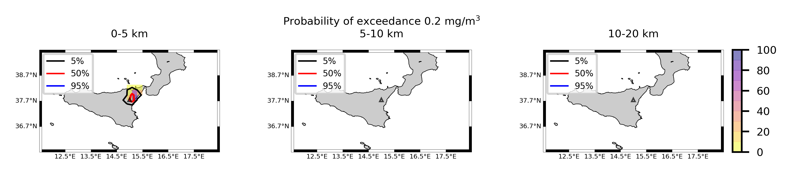
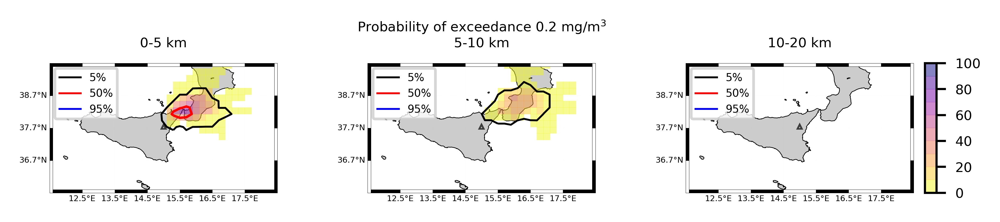

Forecast from VONA_20210304_0228Z
=================================

Contents
========

* [Forecast products](#forecast-products)
	* [Forecast at 2021-03-04 03:30 Z from RED VONA issued at 20210304_0228Z](#forecast-at-2021-03-04-0330-z-from-red-vona-issued-at-20210304_0228z)
	* [Forecast at 2021-03-04 04:30 Z from RED VONA issued at 20210304_0228Z](#forecast-at-2021-03-04-0430-z-from-red-vona-issued-at-20210304_0228z)
	* [Forecast at 2021-03-04 05:30 Z from RED VONA issued at 20210304_0228Z](#forecast-at-2021-03-04-0530-z-from-red-vona-issued-at-20210304_0228z)
	* [Forecast at 2021-03-04 08:30 Z from RED VONA issued at 20210304_0228Z](#forecast-at-2021-03-04-0830-z-from-red-vona-issued-at-20210304_0228z)
	* [Forecast at 2021-03-04 11:30 Z from RED VONA issued at 20210304_0228Z](#forecast-at-2021-03-04-1130-z-from-red-vona-issued-at-20210304_0228z)
	* [Forecast at 2021-03-04 14:30 Z from RED VONA issued at 20210304_0228Z](#forecast-at-2021-03-04-1430-z-from-red-vona-issued-at-20210304_0228z)
	* [Forecast at 2021-03-04 08:50 Z from RED VONA issued at 20210304_0755Z](#forecast-at-2021-03-04-0850-z-from-red-vona-issued-at-20210304_0755z)
	* [Forecast at 2021-03-04 08:50 Z from RED VONA issued at 20210304_0751Z](#forecast-at-2021-03-04-0850-z-from-red-vona-issued-at-20210304_0751z)
	* [Forecast at 2021-03-04 09:00 Z from RED VONA issued at 20210304_0755Z](#forecast-at-2021-03-04-0900-z-from-red-vona-issued-at-20210304_0755z)
	* [Forecast at 2021-03-04 10:00 Z from RED VONA issued at 20210304_0755Z](#forecast-at-2021-03-04-1000-z-from-red-vona-issued-at-20210304_0755z)
	* [Forecast at 2021-03-04 11:00 Z from RED VONA issued at 20210304_0755Z](#forecast-at-2021-03-04-1100-z-from-red-vona-issued-at-20210304_0755z)
	* [Forecast at 2021-03-04 14:00 Z from RED VONA issued at 20210304_0755Z](#forecast-at-2021-03-04-1400-z-from-red-vona-issued-at-20210304_0755z)
	* [Forecast at 2021-03-04 17:00 Z from RED VONA issued at 20210304_0755Z](#forecast-at-2021-03-04-1700-z-from-red-vona-issued-at-20210304_0755z)
	* [Forecast at 2021-03-04 20:00 Z from RED VONA issued at 20210304_0755Z](#forecast-at-2021-03-04-2000-z-from-red-vona-issued-at-20210304_0755z)
	* [Forecast at 2021-03-04 09:20 Z from RED VONA issued at 20210304_0817Z](#forecast-at-2021-03-04-0920-z-from-red-vona-issued-at-20210304_0817z)
	* [Forecast at 2021-03-04 10:20 Z from RED VONA issued at 20210304_0817Z](#forecast-at-2021-03-04-1020-z-from-red-vona-issued-at-20210304_0817z)
	* [Forecast at 2021-03-04 11:20 Z from RED VONA issued at 20210304_0817Z](#forecast-at-2021-03-04-1120-z-from-red-vona-issued-at-20210304_0817z)
	* [Forecast at 2021-03-04 14:20 Z from RED VONA issued at 20210304_0817Z](#forecast-at-2021-03-04-1420-z-from-red-vona-issued-at-20210304_0817z)
	* [Forecast at 2021-03-04 17:20 Z from RED VONA issued at 20210304_0817Z](#forecast-at-2021-03-04-1720-z-from-red-vona-issued-at-20210304_0817z)
	* [Forecast at 2021-03-04 13:20 Z from ORANGE VONA issued at 20210304_1016Z](#forecast-at-2021-03-04-1320-z-from-orange-vona-issued-at-20210304_1016z)
	* [Forecast at 2021-03-04 14:20 Z from ORANGE VONA issued at 20210304_1016Z](#forecast-at-2021-03-04-1420-z-from-orange-vona-issued-at-20210304_1016z)
	* [Forecast at 2021-03-04 15:20 Z from ORANGE VONA issued at 20210304_1016Z](#forecast-at-2021-03-04-1520-z-from-orange-vona-issued-at-20210304_1016z)

# Forecast products

## Forecast at 2021-03-04 03:30 Z from RED VONA issued at 20210304_0228Z
  

|Eruption start [Z]|Eruption end [Z]|Forecast time [Z]|Column height asl [m]|
| :--- | :--- | :--- | :--- |
|2021-03-04 02:30:00|Ongoing|2021-03-04 03:30:00|5000 ± 500 - from VONA|
  
  

|Percentile|MER [kg/s¹]|Mass air [kg]|Mass air nested dom. [kg]|Mass grd [kg]|Mass grd nested dom. [kg]|
| :--- | :--- | :--- | :--- | :--- | :--- |
|5th|3.17e+02|1.96e+05|1.96e+05|9.85e+05|9.86e+05|
|50th|2.96e+03|1.42e+06|1.42e+06|8.49e+06|8.50e+06|
|95th|9.86e+03|7.18e+06|7.17e+06|2.32e+07|2.32e+07|
  

### Ground Nested Domain 2021-03-04 03:30 Z
  
  
  
  
  
  
  
  
  
  
  
  
  
  
  
  
  
  

|Location|Ground load [kg/m²] 5th perc|Ground load [kg/m²] 50th perc|Ground load [kg/m²] 95th perc|
| :--- | :--- | :--- | :--- |
|Piano Provenzana (1)|0.00e+00|4.44e-04|6.02e-02|
|Bivio Provenzana-Linguaglossa (2)|0.00e+00|0.00e+00|3.36e-02|
|Cunetta pre-Citelli (3)|0.00e+00|9.24e-06|8.81e-02|
|Chalet (4)|0.00e+00|0.00e+00|6.55e-03|
|Ragabo (5)|0.00e+00|0.00e+00|1.03e-02|
|Scilio (6)|0.00e+00|0.00e+00|1.05e-05|
|Gambino vini (7)|0.00e+00|0.00e+00|3.28e-05|
|StazioneFce Linguaglossa (8)|0.00e+00|0.00e+00|0.00e+00|
|Linguaglossa Via Olivio Sozzi (9)|0.00e+00|0.00e+00|0.00e+00|
|Cim.Linguaglossa (10)|0.00e+00|0.00e+00|0.00e+00|
|Gole Bar (11)|0.00e+00|0.00e+00|0.00e+00|
|Francavilla - Orange (12)|0.00e+00|0.00e+00|0.00e+00|
|Roccalumera1 (13)|0.00e+00|0.00e+00|0.00e+00|
|Roccalumera2 (14)|0.00e+00|0.00e+00|0.00e+00|
|Nizza (15)|0.00e+00|0.00e+00|0.00e+00|
|Scaletta Zanclea (16)|0.00e+00|0.00e+00|0.00e+00|
|Alì (17)|0.00e+00|0.00e+00|0.00e+00|
  

### Atmosphere 2021-03-04 03:30 Z
  

## Forecast at 2021-03-04 04:30 Z from RED VONA issued at 20210304_0228Z
  

|Eruption start [Z]|Eruption end [Z]|Forecast time [Z]|Column height asl [m]|
| :--- | :--- | :--- | :--- |
|2021-03-04 02:30:00|Ongoing|2021-03-04 04:30:00|5000 ± 500 - from VONA|
  
  

|Percentile|MER [kg/s¹]|Mass air [kg]|Mass air nested dom. [kg]|Mass grd [kg]|Mass grd nested dom. [kg]|
| :--- | :--- | :--- | :--- | :--- | :--- |
|5th|8.48e+02|5.09e+05|5.09e+05|8.33e+06|8.33e+06|
|50th|3.28e+03|3.17e+06|3.17e+06|1.85e+07|1.85e+07|
|95th|1.08e+04|8.46e+06|8.46e+06|4.79e+07|4.79e+07|
  

### Ground Nested Domain 2021-03-04 04:30 Z
  
  
  
  
  
  
  
  
  
  
  
  
  
  
  
  
  
  

|Location|Ground load [kg/m²] 5th perc|Ground load [kg/m²] 50th perc|Ground load [kg/m²] 95th perc|
| :--- | :--- | :--- | :--- |
|Piano Provenzana (1)|6.66e-04|3.73e-02|1.25e-01|
|Bivio Provenzana-Linguaglossa (2)|2.23e-05|9.87e-03|9.22e-02|
|Cunetta pre-Citelli (3)|1.04e-05|1.75e-02|2.08e-01|
|Chalet (4)|0.00e+00|2.85e-04|3.85e-02|
|Ragabo (5)|0.00e+00|1.37e-03|4.35e-02|
|Scilio (6)|0.00e+00|6.67e-07|4.82e-03|
|Gambino vini (7)|0.00e+00|0.00e+00|9.02e-03|
|StazioneFce Linguaglossa (8)|0.00e+00|0.00e+00|2.13e-03|
|Linguaglossa Via Olivio Sozzi (9)|0.00e+00|0.00e+00|2.62e-03|
|Cim.Linguaglossa (10)|0.00e+00|0.00e+00|1.75e-03|
|Gole Bar (11)|0.00e+00|0.00e+00|9.76e-04|
|Francavilla - Orange (12)|0.00e+00|0.00e+00|1.62e-05|
|Roccalumera1 (13)|0.00e+00|0.00e+00|0.00e+00|
|Roccalumera2 (14)|0.00e+00|0.00e+00|0.00e+00|
|Nizza (15)|0.00e+00|0.00e+00|0.00e+00|
|Scaletta Zanclea (16)|0.00e+00|0.00e+00|0.00e+00|
|Alì (17)|0.00e+00|0.00e+00|0.00e+00|
  

### Atmosphere 2021-03-04 04:30 Z
  

## Forecast at 2021-03-04 05:30 Z from RED VONA issued at 20210304_0228Z
  

|Eruption start [Z]|Eruption end [Z]|Forecast time [Z]|Column height asl [m]|
| :--- | :--- | :--- | :--- |
|2021-03-04 02:30:00|Ongoing|2021-03-04 05:30:00|5000 ± 500 - from VONA|
  
  

|Percentile|MER [kg/s¹]|Mass air [kg]|Mass air nested dom. [kg]|Mass grd [kg]|Mass grd nested dom. [kg]|
| :--- | :--- | :--- | :--- | :--- | :--- |
|5th|3.36e+02|1.38e+06|1.38e+06|1.71e+07|1.71e+07|
|50th|4.48e+03|3.90e+06|3.90e+06|3.87e+07|3.87e+07|
|95th|1.02e+04|9.67e+06|9.67e+06|6.70e+07|6.70e+07|
  

### Ground Nested Domain 2021-03-04 05:30 Z
  
  
  
  
  
  
  
  
  
  
  
  
  
  
  
  
  
  

|Location|Ground load [kg/m²] 5th perc|Ground load [kg/m²] 50th perc|Ground load [kg/m²] 95th perc|
| :--- | :--- | :--- | :--- |
|Piano Provenzana (1)|1.79e-03|6.24e-02|1.76e-01|
|Bivio Provenzana-Linguaglossa (2)|2.64e-05|3.77e-02|1.68e-01|
|Cunetta pre-Citelli (3)|1.02e-04|8.50e-02|2.85e-01|
|Chalet (4)|0.00e+00|1.36e-03|7.57e-02|
|Ragabo (5)|2.13e-05|8.42e-03|8.63e-02|
|Scilio (6)|0.00e+00|2.28e-04|7.83e-03|
|Gambino vini (7)|0.00e+00|2.38e-04|1.74e-02|
|StazioneFce Linguaglossa (8)|0.00e+00|1.77e-05|5.49e-03|
|Linguaglossa Via Olivio Sozzi (9)|0.00e+00|2.84e-05|6.00e-03|
|Cim.Linguaglossa (10)|0.00e+00|1.07e-06|5.37e-03|
|Gole Bar (11)|0.00e+00|0.00e+00|3.74e-03|
|Francavilla - Orange (12)|0.00e+00|0.00e+00|1.16e-04|
|Roccalumera1 (13)|0.00e+00|0.00e+00|0.00e+00|
|Roccalumera2 (14)|0.00e+00|0.00e+00|0.00e+00|
|Nizza (15)|0.00e+00|0.00e+00|0.00e+00|
|Scaletta Zanclea (16)|0.00e+00|0.00e+00|0.00e+00|
|Alì (17)|0.00e+00|0.00e+00|0.00e+00|
  

### Atmosphere 2021-03-04 05:30 Z
  

## Forecast at 2021-03-04 08:30 Z from RED VONA issued at 20210304_0228Z
  

|Eruption start [Z]|Eruption end [Z]|Forecast time [Z]|Column height asl [m]|
| :--- | :--- | :--- | :--- |
|2021-03-04 02:30:00|Ongoing|2021-03-04 08:30:00|5000 ± 500 - from VONA|
  
  

|Percentile|MER [kg/s¹]|Mass air [kg]|Mass air nested dom. [kg]|Mass grd [kg]|Mass grd nested dom. [kg]|
| :--- | :--- | :--- | :--- | :--- | :--- |
|5th|3.04e+02|4.54e+05|4.54e+05|3.00e+07|3.00e+07|
|50th|1.84e+03|3.39e+06|3.39e+06|6.06e+07|6.06e+07|
|95th|7.87e+03|1.08e+07|1.08e+07|1.04e+08|1.04e+08|
  

### Ground Nested Domain 2021-03-04 08:30 Z
  
  
  
  
  
  
  
  
  
  
  
  
  
  
  
  
  
  

|Location|Ground load [kg/m²] 5th perc|Ground load [kg/m²] 50th perc|Ground load [kg/m²] 95th perc|
| :--- | :--- | :--- | :--- |
|Piano Provenzana (1)|1.22e-02|1.59e-01|2.89e-01|
|Bivio Provenzana-Linguaglossa (2)|9.95e-03|9.81e-02|2.42e-01|
|Cunetta pre-Citelli (3)|7.37e-03|1.31e-01|3.78e-01|
|Chalet (4)|2.61e-04|2.14e-02|1.01e-01|
|Ragabo (5)|2.86e-03|3.62e-02|1.15e-01|
|Scilio (6)|0.00e+00|1.36e-03|1.25e-02|
|Gambino vini (7)|0.00e+00|2.14e-03|1.78e-02|
|StazioneFce Linguaglossa (8)|0.00e+00|1.21e-03|8.46e-03|
|Linguaglossa Via Olivio Sozzi (9)|0.00e+00|2.07e-03|9.42e-03|
|Cim.Linguaglossa (10)|0.00e+00|4.14e-04|7.50e-03|
|Gole Bar (11)|0.00e+00|9.95e-06|3.77e-03|
|Francavilla - Orange (12)|0.00e+00|1.29e-05|7.01e-04|
|Roccalumera1 (13)|0.00e+00|0.00e+00|3.68e-06|
|Roccalumera2 (14)|0.00e+00|0.00e+00|1.05e-06|
|Nizza (15)|0.00e+00|0.00e+00|0.00e+00|
|Scaletta Zanclea (16)|0.00e+00|0.00e+00|0.00e+00|
|Alì (17)|0.00e+00|0.00e+00|0.00e+00|
  

### Atmosphere 2021-03-04 08:30 Z
  

## Forecast at 2021-03-04 11:30 Z from RED VONA issued at 20210304_0228Z
  

|Eruption start [Z]|Eruption end [Z]|Forecast time [Z]|Column height asl [m]|
| :--- | :--- | :--- | :--- |
|2021-03-04 02:30:00|Ongoing|2021-03-04 11:30:00|5000 ± 500 - from VONA|
  
  

|Percentile|MER [kg/s¹]|Mass air [kg]|Mass air nested dom. [kg]|Mass grd [kg]|Mass grd nested dom. [kg]|
| :--- | :--- | :--- | :--- | :--- | :--- |
|5th|3.57e+02|9.03e+05|9.03e+05|5.43e+07|5.44e+07|
|50th|1.63e+03|5.78e+06|5.76e+06|8.67e+07|8.68e+07|
|95th|1.10e+04|1.91e+07|1.90e+07|1.81e+08|1.81e+08|
  

### Ground Nested Domain 2021-03-04 11:30 Z
  
  
  
  
  
  
  
  
  
  
  
  
  
  
  
  
  
  

|Location|Ground load [kg/m²] 5th perc|Ground load [kg/m²] 50th perc|Ground load [kg/m²] 95th perc|
| :--- | :--- | :--- | :--- |
|Piano Provenzana (1)|1.72e-02|2.25e-01|4.01e-01|
|Bivio Provenzana-Linguaglossa (2)|2.21e-02|1.12e-01|3.21e-01|
|Cunetta pre-Citelli (3)|1.14e-02|1.42e-01|3.79e-01|
|Chalet (4)|2.76e-03|3.12e-02|1.57e-01|
|Ragabo (5)|8.58e-03|4.63e-02|1.92e-01|
|Scilio (6)|2.21e-05|3.21e-03|1.51e-02|
|Gambino vini (7)|1.79e-05|3.17e-03|2.10e-02|
|StazioneFce Linguaglossa (8)|3.00e-05|2.83e-03|1.67e-02|
|Linguaglossa Via Olivio Sozzi (9)|6.36e-05|3.36e-03|1.55e-02|
|Cim.Linguaglossa (10)|6.01e-07|2.01e-03|9.84e-03|
|Gole Bar (11)|0.00e+00|4.17e-04|6.66e-03|
|Francavilla - Orange (12)|5.76e-06|3.49e-04|3.39e-03|
|Roccalumera1 (13)|0.00e+00|0.00e+00|1.68e-05|
|Roccalumera2 (14)|0.00e+00|0.00e+00|9.06e-06|
|Nizza (15)|0.00e+00|0.00e+00|7.08e-06|
|Scaletta Zanclea (16)|0.00e+00|0.00e+00|2.37e-06|
|Alì (17)|0.00e+00|0.00e+00|0.00e+00|
  

### Atmosphere 2021-03-04 11:30 Z
  

## Forecast at 2021-03-04 14:30 Z from RED VONA issued at 20210304_0228Z
  

|Eruption start [Z]|Eruption end [Z]|Forecast time [Z]|Column height asl [m]|
| :--- | :--- | :--- | :--- |
|2021-03-04 02:30:00|Ongoing|2021-03-04 14:30:00|5000 ± 500 - from VONA|
  
  

|Percentile|MER [kg/s¹]|Mass air [kg]|Mass air nested dom. [kg]|Mass grd [kg]|Mass grd nested dom. [kg]|
| :--- | :--- | :--- | :--- | :--- | :--- |
|5th|3.87e+02|3.47e+06|3.46e+06|9.73e+07|9.73e+07|
|50th|4.59e+03|1.09e+07|1.08e+07|1.71e+08|1.71e+08|
|95th|2.77e+04|4.74e+07|4.64e+07|3.00e+08|3.00e+08|
  

### Ground Nested Domain 2021-03-04 14:30 Z
  
  
  
  
  
  
  
  
  
  
  
  
  
  
  
  
  
  

|Location|Ground load [kg/m²] 5th perc|Ground load [kg/m²] 50th perc|Ground load [kg/m²] 95th perc|
| :--- | :--- | :--- | :--- |
|Piano Provenzana (1)|1.13e-01|3.13e-01|8.40e-01|
|Bivio Provenzana-Linguaglossa (2)|3.27e-02|1.79e-01|7.50e-01|
|Cunetta pre-Citelli (3)|1.95e-02|2.03e-01|1.11e+00|
|Chalet (4)|8.50e-03|6.22e-02|3.79e-01|
|Ragabo (5)|1.53e-02|9.27e-02|3.77e-01|
|Scilio (6)|1.25e-03|7.51e-03|7.35e-02|
|Gambino vini (7)|8.58e-04|9.12e-03|8.76e-02|
|StazioneFce Linguaglossa (8)|2.12e-03|1.13e-02|5.67e-02|
|Linguaglossa Via Olivio Sozzi (9)|2.75e-03|1.32e-02|6.10e-02|
|Cim.Linguaglossa (10)|8.30e-04|3.03e-03|5.45e-02|
|Gole Bar (11)|7.00e-06|2.09e-03|2.00e-02|
|Francavilla - Orange (12)|9.05e-05|1.43e-03|2.16e-02|
|Roccalumera1 (13)|0.00e+00|0.00e+00|1.56e-04|
|Roccalumera2 (14)|0.00e+00|0.00e+00|8.46e-05|
|Nizza (15)|0.00e+00|0.00e+00|8.28e-05|
|Scaletta Zanclea (16)|0.00e+00|0.00e+00|1.26e-04|
|Alì (17)|0.00e+00|0.00e+00|5.13e-05|
  

### Atmosphere 2021-03-04 14:30 Z
  

## Forecast at 2021-03-04 08:50 Z from RED VONA issued at 20210304_0755Z
  

|Eruption start [Z]|Eruption end [Z]|Forecast time [Z]|Column height asl [m]|
| :--- | :--- | :--- | :--- |
|2021-03-04 02:30:00|Ongoing|2021-03-04 09:00:00|6000 ± 500 - from VONA|
  
  

|Percentile|MER [kg/s¹]|Mass air [kg]|Mass air nested dom. [kg]|Mass grd [kg]|Mass grd nested dom. [kg]|
| :--- | :--- | :--- | :--- | :--- | :--- |
|5th|1.97e+03|3.47e+06|1.94e+06|9.73e+07|4.83e+07|
|50th|6.62e+03|1.09e+07|6.88e+06|1.71e+08|7.83e+07|
|95th|1.42e+04|4.74e+07|1.46e+07|3.00e+08|1.16e+08|
  

### Ground Nested Domain 2021-03-04 08:50 Z
  
  
  
  
  
  
  
  
  
  
  
  
  
  
  
  
  
  

|Location|Ground load [kg/m²] 5th perc|Ground load [kg/m²] 50th perc|Ground load [kg/m²] 95th perc|
| :--- | :--- | :--- | :--- |
|Piano Provenzana (1)|2.67e-02|1.73e-01|2.80e-01|
|Bivio Provenzana-Linguaglossa (2)|9.95e-03|1.01e-01|2.42e-01|
|Cunetta pre-Citelli (3)|7.37e-03|1.47e-01|3.78e-01|
|Chalet (4)|2.61e-04|2.25e-02|1.04e-01|
|Ragabo (5)|2.86e-03|4.24e-02|1.18e-01|
|Scilio (6)|0.00e+00|2.21e-03|1.46e-02|
|Gambino vini (7)|0.00e+00|3.00e-03|1.78e-02|
|StazioneFce Linguaglossa (8)|0.00e+00|1.22e-03|1.00e-02|
|Linguaglossa Via Olivio Sozzi (9)|0.00e+00|2.49e-03|1.14e-02|
|Cim.Linguaglossa (10)|0.00e+00|4.00e-04|8.59e-03|
|Gole Bar (11)|0.00e+00|8.03e-06|3.76e-03|
|Francavilla - Orange (12)|0.00e+00|3.65e-05|9.64e-04|
|Roccalumera1 (13)|0.00e+00|0.00e+00|2.46e-06|
|Roccalumera2 (14)|0.00e+00|0.00e+00|5.23e-07|
|Nizza (15)|0.00e+00|0.00e+00|0.00e+00|
|Scaletta Zanclea (16)|0.00e+00|0.00e+00|0.00e+00|
|Alì (17)|0.00e+00|0.00e+00|0.00e+00|
  

### Atmosphere 2021-03-04 08:50 Z

## Forecast at 2021-03-04 08:50 Z from RED VONA issued at 20210304_0751Z
  

|Eruption start [Z]|Eruption end [Z]|Forecast time [Z]|Column height asl [m]|
| :--- | :--- | :--- | :--- |
|2021-03-04 02:30:00|Ongoing|2021-03-04 08:50:00|6000 ± 500 - from VONA|
  
  

|Percentile|MER [kg/s¹]|Mass air [kg]|Mass air nested dom. [kg]|Mass grd [kg]|Mass grd nested dom. [kg]|
| :--- | :--- | :--- | :--- | :--- | :--- |
|5th|1.87e+03|2.55e+06|2.55e+06|4.36e+07|4.36e+07|
|50th|5.09e+03|7.24e+06|7.24e+06|7.92e+07|7.92e+07|
|95th|1.74e+04|1.76e+07|1.76e+07|1.37e+08|1.37e+08|
  

### Ground Nested Domain 2021-03-04 08:50 Z
  
  
  
  
  
  
  
  
  
  
  
  
  
  
  
  
  
  

|Location|Ground load [kg/m²] 5th perc|Ground load [kg/m²] 50th perc|Ground load [kg/m²] 95th perc|
| :--- | :--- | :--- | :--- |
|Piano Provenzana (1)|2.50e-02|1.72e-01|3.43e-01|
|Bivio Provenzana-Linguaglossa (2)|9.95e-03|1.09e-01|2.75e-01|
|Cunetta pre-Citelli (3)|7.39e-03|1.45e-01|4.20e-01|
|Chalet (4)|9.76e-04|2.14e-02|1.11e-01|
|Ragabo (5)|4.04e-03|3.88e-02|1.28e-01|
|Scilio (6)|1.00e-06|1.41e-03|1.28e-02|
|Gambino vini (7)|0.00e+00|2.63e-03|1.79e-02|
|StazioneFce Linguaglossa (8)|0.00e+00|1.22e-03|1.00e-02|
|Linguaglossa Via Olivio Sozzi (9)|0.00e+00|1.64e-03|1.15e-02|
|Cim.Linguaglossa (10)|0.00e+00|4.54e-04|8.59e-03|
|Gole Bar (11)|0.00e+00|7.50e-06|3.76e-03|
|Francavilla - Orange (12)|0.00e+00|2.77e-05|7.01e-04|
|Roccalumera1 (13)|0.00e+00|0.00e+00|6.17e-07|
|Roccalumera2 (14)|0.00e+00|0.00e+00|0.00e+00|
|Nizza (15)|0.00e+00|0.00e+00|0.00e+00|
|Scaletta Zanclea (16)|0.00e+00|0.00e+00|0.00e+00|
|Alì (17)|0.00e+00|0.00e+00|0.00e+00|
  

### Atmosphere 2021-03-04 08:50 Z
  

## Forecast at 2021-03-04 09:00 Z from RED VONA issued at 20210304_0755Z
  

|Eruption start [Z]|Eruption end [Z]|Forecast time [Z]|Column height asl [m]|
| :--- | :--- | :--- | :--- |
|2021-03-04 02:30:00|Ongoing|2021-03-04 09:00:00|6500 ± 500 - from VONA|
  
  

|Percentile|MER [kg/s¹]|Mass air [kg]|Mass air nested dom. [kg]|Mass grd [kg]|Mass grd nested dom. [kg]|
| :--- | :--- | :--- | :--- | :--- | :--- |
|5th|2.90e+03|5.31e+06|5.31e+06|5.45e+07|5.45e+07|
|50th|9.04e+03|1.11e+07|1.11e+07|9.64e+07|9.64e+07|
|95th|2.03e+04|2.11e+07|2.11e+07|1.36e+08|1.36e+08|
  

### Ground Nested Domain 2021-03-04 09:00 Z
  
  
  
  
  
  
  
  
  
  
  
  
  
  
  
  
  
  

|Location|Ground load [kg/m²] 5th perc|Ground load [kg/m²] 50th perc|Ground load [kg/m²] 95th perc|
| :--- | :--- | :--- | :--- |
|Piano Provenzana (1)|3.17e-02|1.89e-01|3.53e-01|
|Bivio Provenzana-Linguaglossa (2)|1.00e-02|1.02e-01|3.11e-01|
|Cunetta pre-Citelli (3)|8.31e-03|1.44e-01|5.32e-01|
|Chalet (4)|2.69e-04|2.25e-02|1.34e-01|
|Ragabo (5)|3.17e-03|4.27e-02|1.51e-01|
|Scilio (6)|0.00e+00|2.48e-03|1.60e-02|
|Gambino vini (7)|0.00e+00|2.99e-03|2.73e-02|
|StazioneFce Linguaglossa (8)|0.00e+00|1.21e-03|1.05e-02|
|Linguaglossa Via Olivio Sozzi (9)|0.00e+00|2.01e-03|1.24e-02|
|Cim.Linguaglossa (10)|0.00e+00|8.82e-04|8.59e-03|
|Gole Bar (11)|0.00e+00|1.21e-05|3.76e-03|
|Francavilla - Orange (12)|0.00e+00|6.41e-05|9.58e-04|
|Roccalumera1 (13)|0.00e+00|0.00e+00|3.82e-06|
|Roccalumera2 (14)|0.00e+00|0.00e+00|5.23e-07|
|Nizza (15)|0.00e+00|0.00e+00|0.00e+00|
|Scaletta Zanclea (16)|0.00e+00|0.00e+00|0.00e+00|
|Alì (17)|0.00e+00|0.00e+00|0.00e+00|
  

### Atmosphere 2021-03-04 09:00 Z
  

## Forecast at 2021-03-04 10:00 Z from RED VONA issued at 20210304_0755Z
  

|Eruption start [Z]|Eruption end [Z]|Forecast time [Z]|Column height asl [m]|
| :--- | :--- | :--- | :--- |
|2021-03-04 02:30:00|Ongoing|2021-03-04 10:00:00|6500 ± 500 - from VONA|
  
  

|Percentile|MER [kg/s¹]|Mass air [kg]|Mass air nested dom. [kg]|Mass grd [kg]|Mass grd nested dom. [kg]|
| :--- | :--- | :--- | :--- | :--- | :--- |
|5th|3.76e+03|2.20e+06|2.20e+06|8.79e+07|8.79e+07|
|50th|1.52e+04|1.26e+07|1.26e+07|1.34e+08|1.34e+08|
|95th|3.50e+04|3.89e+07|3.88e+07|2.15e+08|2.15e+08|
  

### Ground Nested Domain 2021-03-04 10:00 Z
  
  
  
  
  
  
  
  
  
  
  
  
  
  
  
  
  
  

|Location|Ground load [kg/m²] 5th perc|Ground load [kg/m²] 50th perc|Ground load [kg/m²] 95th perc|
| :--- | :--- | :--- | :--- |
|Piano Provenzana (1)|9.49e-02|2.04e-01|7.70e-01|
|Bivio Provenzana-Linguaglossa (2)|3.28e-02|1.19e-01|5.77e-01|
|Cunetta pre-Citelli (3)|5.11e-02|2.73e-01|7.09e-01|
|Chalet (4)|7.74e-04|2.97e-02|3.03e-01|
|Ragabo (5)|6.21e-03|5.09e-02|3.51e-01|
|Scilio (6)|0.00e+00|2.92e-03|3.02e-02|
|Gambino vini (7)|0.00e+00|3.38e-03|3.80e-02|
|StazioneFce Linguaglossa (8)|0.00e+00|1.22e-03|3.10e-02|
|Linguaglossa Via Olivio Sozzi (9)|0.00e+00|2.01e-03|3.89e-02|
|Cim.Linguaglossa (10)|0.00e+00|8.82e-04|1.74e-02|
|Gole Bar (11)|0.00e+00|1.21e-05|5.40e-03|
|Francavilla - Orange (12)|0.00e+00|7.80e-05|8.17e-03|
|Roccalumera1 (13)|0.00e+00|0.00e+00|3.82e-06|
|Roccalumera2 (14)|0.00e+00|0.00e+00|5.23e-07|
|Nizza (15)|0.00e+00|0.00e+00|0.00e+00|
|Scaletta Zanclea (16)|0.00e+00|0.00e+00|0.00e+00|
|Alì (17)|0.00e+00|0.00e+00|0.00e+00|
  

### Atmosphere 2021-03-04 10:00 Z
  

## Forecast at 2021-03-04 11:00 Z from RED VONA issued at 20210304_0755Z
  

|Eruption start [Z]|Eruption end [Z]|Forecast time [Z]|Column height asl [m]|
| :--- | :--- | :--- | :--- |
|2021-03-04 02:30:00|Ongoing|2021-03-04 11:00:00|6500 ± 500 - from VONA|
  
  

|Percentile|MER [kg/s¹]|Mass air [kg]|Mass air nested dom. [kg]|Mass grd [kg]|Mass grd nested dom. [kg]|
| :--- | :--- | :--- | :--- | :--- | :--- |
|5th|5.17e+03|2.32e+06|2.32e+06|1.11e+08|1.11e+08|
|50th|1.64e+04|1.57e+07|1.57e+07|1.76e+08|1.76e+08|
|95th|2.40e+04|2.65e+07|2.65e+07|2.50e+08|2.50e+08|
  

### Ground Nested Domain 2021-03-04 11:00 Z
  
  
  
  
  
  
  
  
  
  
  
  
  
  
  
  
  
  

|Location|Ground load [kg/m²] 5th perc|Ground load [kg/m²] 50th perc|Ground load [kg/m²] 95th perc|
| :--- | :--- | :--- | :--- |
|Piano Provenzana (1)|1.12e-01|2.40e-01|1.07e+00|
|Bivio Provenzana-Linguaglossa (2)|3.41e-02|1.88e-01|6.55e-01|
|Cunetta pre-Citelli (3)|5.63e-02|4.50e-01|1.21e+00|
|Chalet (4)|2.41e-03|4.36e-02|3.95e-01|
|Ragabo (5)|6.41e-03|6.36e-02|4.23e-01|
|Scilio (6)|1.00e-06|5.04e-03|6.30e-02|
|Gambino vini (7)|0.00e+00|5.11e-03|8.06e-02|
|StazioneFce Linguaglossa (8)|0.00e+00|2.28e-03|3.67e-02|
|Linguaglossa Via Olivio Sozzi (9)|0.00e+00|2.84e-03|3.89e-02|
|Cim.Linguaglossa (10)|0.00e+00|2.07e-03|3.25e-02|
|Gole Bar (11)|0.00e+00|1.21e-05|5.40e-03|
|Francavilla - Orange (12)|0.00e+00|7.80e-05|8.17e-03|
|Roccalumera1 (13)|0.00e+00|0.00e+00|3.82e-06|
|Roccalumera2 (14)|0.00e+00|0.00e+00|5.23e-07|
|Nizza (15)|0.00e+00|0.00e+00|0.00e+00|
|Scaletta Zanclea (16)|0.00e+00|0.00e+00|0.00e+00|
|Alì (17)|0.00e+00|0.00e+00|0.00e+00|
  

### Atmosphere 2021-03-04 11:00 Z
  

## Forecast at 2021-03-04 14:00 Z from RED VONA issued at 20210304_0755Z
  

|Eruption start [Z]|Eruption end [Z]|Forecast time [Z]|Column height asl [m]|
| :--- | :--- | :--- | :--- |
|2021-03-04 02:30:00|Ongoing|2021-03-04 14:00:00|6500 ± 500 - from VONA|
  
  

|Percentile|MER [kg/s¹]|Mass air [kg]|Mass air nested dom. [kg]|Mass grd [kg]|Mass grd nested dom. [kg]|
| :--- | :--- | :--- | :--- | :--- | :--- |
|5th|5.27e+03|1.05e+07|1.05e+07|2.10e+08|2.10e+08|
|50th|2.15e+04|2.57e+07|2.56e+07|3.59e+08|3.59e+08|
|95th|4.36e+04|7.28e+07|6.98e+07|5.81e+08|5.81e+08|
  

### Ground Nested Domain 2021-03-04 14:00 Z
  
  
  
  
  
  
  
  
  
  
  
  
  
  
  
  
  
  

|Location|Ground load [kg/m²] 5th perc|Ground load [kg/m²] 50th perc|Ground load [kg/m²] 95th perc|
| :--- | :--- | :--- | :--- |
|Piano Provenzana (1)|1.70e-01|8.67e-01|1.95e+00|
|Bivio Provenzana-Linguaglossa (2)|1.57e-01|9.87e-01|1.94e+00|
|Cunetta pre-Citelli (3)|3.12e-01|1.39e+00|3.30e+00|
|Chalet (4)|5.33e-02|3.99e-01|8.70e-01|
|Ragabo (5)|6.73e-02|4.41e-01|1.09e+00|
|Scilio (6)|5.17e-03|6.29e-02|4.23e-01|
|Gambino vini (7)|8.56e-03|6.70e-02|5.35e-01|
|StazioneFce Linguaglossa (8)|1.44e-03|4.51e-02|2.86e-01|
|Linguaglossa Via Olivio Sozzi (9)|3.01e-03|5.42e-02|2.82e-01|
|Cim.Linguaglossa (10)|6.48e-04|3.36e-02|3.08e-01|
|Gole Bar (11)|1.23e-05|4.13e-03|9.37e-02|
|Francavilla - Orange (12)|2.25e-05|1.14e-02|6.89e-02|
|Roccalumera1 (13)|0.00e+00|0.00e+00|1.46e-03|
|Roccalumera2 (14)|0.00e+00|0.00e+00|4.98e-03|
|Nizza (15)|0.00e+00|0.00e+00|8.41e-03|
|Scaletta Zanclea (16)|0.00e+00|0.00e+00|1.52e-05|
|Alì (17)|0.00e+00|0.00e+00|6.02e-03|
  

### Atmosphere 2021-03-04 14:00 Z
  

## Forecast at 2021-03-04 17:00 Z from RED VONA issued at 20210304_0755Z
  

|Eruption start [Z]|Eruption end [Z]|Forecast time [Z]|Column height asl [m]|
| :--- | :--- | :--- | :--- |
|2021-03-04 02:30:00|Ongoing|2021-03-04 17:00:00|6500 ± 500 - from VONA|
  
  

|Percentile|MER [kg/s¹]|Mass air [kg]|Mass air nested dom. [kg]|Mass grd [kg]|Mass grd nested dom. [kg]|
| :--- | :--- | :--- | :--- | :--- | :--- |
|5th|6.36e+03|3.60e+06|3.59e+06|4.32e+08|4.32e+08|
|50th|2.96e+04|3.89e+07|3.89e+07|6.43e+08|6.43e+08|
|95th|5.07e+04|8.33e+07|8.01e+07|8.68e+08|8.67e+08|
  

### Ground Nested Domain 2021-03-04 17:00 Z
  
  
  
  
  
  
  
  
  
  
  
  
  
  
  
  
  
  

|Location|Ground load [kg/m²] 5th perc|Ground load [kg/m²] 50th perc|Ground load [kg/m²] 95th perc|
| :--- | :--- | :--- | :--- |
|Piano Provenzana (1)|1.88e-01|2.11e+00|5.02e+00|
|Bivio Provenzana-Linguaglossa (2)|4.08e-01|2.04e+00|3.26e+00|
|Cunetta pre-Citelli (3)|1.27e+00|3.66e+00|5.76e+00|
|Chalet (4)|1.05e-01|9.00e-01|1.34e+00|
|Ragabo (5)|1.71e-01|9.58e-01|1.55e+00|
|Scilio (6)|3.89e-02|1.13e-01|6.47e-01|
|Gambino vini (7)|5.21e-02|1.62e-01|7.44e-01|
|StazioneFce Linguaglossa (8)|2.23e-02|1.01e-01|4.20e-01|
|Linguaglossa Via Olivio Sozzi (9)|1.23e-02|1.50e-01|3.36e-01|
|Cim.Linguaglossa (10)|2.72e-02|6.43e-02|5.41e-01|
|Gole Bar (11)|2.68e-03|2.41e-02|1.36e-01|
|Francavilla - Orange (12)|1.79e-04|4.31e-02|1.18e-01|
|Roccalumera1 (13)|0.00e+00|4.53e-04|1.75e-02|
|Roccalumera2 (14)|0.00e+00|2.98e-04|1.45e-02|
|Nizza (15)|0.00e+00|1.87e-04|1.62e-02|
|Scaletta Zanclea (16)|0.00e+00|7.90e-07|4.50e-03|
|Alì (17)|0.00e+00|1.47e-05|1.84e-02|
  

### Atmosphere 2021-03-04 17:00 Z
  

## Forecast at 2021-03-04 20:00 Z from RED VONA issued at 20210304_0755Z
  

|Eruption start [Z]|Eruption end [Z]|Forecast time [Z]|Column height asl [m]|
| :--- | :--- | :--- | :--- |
|2021-03-04 02:30:00|Ongoing|2021-03-04 20:00:00|6500 ± 500 - from VONA|
  
  

|Percentile|MER [kg/s¹]|Mass air [kg]|Mass air nested dom. [kg]|Mass grd [kg]|Mass grd nested dom. [kg]|
| :--- | :--- | :--- | :--- | :--- | :--- |
|5th|5.09e+03|7.13e+06|7.13e+06|6.23e+08|6.22e+08|
|50th|2.40e+04|2.44e+07|2.22e+07|8.15e+08|8.14e+08|
|95th|4.40e+04|8.79e+07|7.66e+07|1.11e+09|1.11e+09|
  

### Ground Nested Domain 2021-03-04 20:00 Z
  
  
  
  
  
  
  
  
  
  
  
  
  
  
  
  
  
  

|Location|Ground load [kg/m²] 5th perc|Ground load [kg/m²] 50th perc|Ground load [kg/m²] 95th perc|
| :--- | :--- | :--- | :--- |
|Piano Provenzana (1)|8.35e-01|3.63e+00|5.84e+00|
|Bivio Provenzana-Linguaglossa (2)|9.62e-01|2.97e+00|5.25e+00|
|Cunetta pre-Citelli (3)|2.54e+00|5.87e+00|8.97e+00|
|Chalet (4)|3.41e-01|1.02e+00|1.88e+00|
|Ragabo (5)|4.12e-01|1.34e+00|2.36e+00|
|Scilio (6)|7.11e-02|2.75e-01|1.02e+00|
|Gambino vini (7)|8.65e-02|2.81e-01|1.10e+00|
|StazioneFce Linguaglossa (8)|3.92e-02|2.61e-01|7.46e-01|
|Linguaglossa Via Olivio Sozzi (9)|2.62e-02|2.63e-01|5.83e-01|
|Cim.Linguaglossa (10)|4.20e-02|1.93e-01|8.88e-01|
|Gole Bar (11)|5.51e-03|9.40e-02|2.89e-01|
|Francavilla - Orange (12)|8.82e-03|7.75e-02|1.72e-01|
|Roccalumera1 (13)|0.00e+00|2.08e-03|2.34e-02|
|Roccalumera2 (14)|0.00e+00|1.63e-03|2.28e-02|
|Nizza (15)|0.00e+00|1.08e-03|2.83e-02|
|Scaletta Zanclea (16)|0.00e+00|3.60e-04|1.35e-02|
|Alì (17)|0.00e+00|1.33e-03|3.85e-02|
  

### Atmosphere 2021-03-04 20:00 Z
  

## Forecast at 2021-03-04 09:20 Z from RED VONA issued at 20210304_0817Z
  

|Eruption start [Z]|Eruption end [Z]|Forecast time [Z]|Column height asl [m]|
| :--- | :--- | :--- | :--- |
|2021-03-04 02:30:00|Ongoing|2021-03-04 09:20:00|11000 ± 500 - from VONA|
  
  

|Percentile|MER [kg/s¹]|Mass air [kg]|Mass air nested dom. [kg]|Mass grd [kg]|Mass grd nested dom. [kg]|
| :--- | :--- | :--- | :--- | :--- | :--- |
|5th|2.03e+05|3.86e+08|3.86e+08|6.16e+08|6.16e+08|
|50th|8.58e+05|1.22e+09|1.21e+09|1.57e+09|1.57e+09|
|95th|1.98e+06|2.55e+09|2.55e+09|4.51e+09|4.50e+09|
  

### Ground Nested Domain 2021-03-04 09:20 Z
  
  
  
  
  
  
  
  
  
  
  
  
  
  
  
  
  
  

|Location|Ground load [kg/m²] 5th perc|Ground load [kg/m²] 50th perc|Ground load [kg/m²] 95th perc|
| :--- | :--- | :--- | :--- |
|Piano Provenzana (1)|1.42e+00|4.80e+00|9.85e+00|
|Bivio Provenzana-Linguaglossa (2)|2.17e+00|4.98e+00|1.24e+01|
|Cunetta pre-Citelli (3)|3.35e+00|6.70e+00|1.06e+01|
|Chalet (4)|1.89e+00|4.37e+00|1.36e+01|
|Ragabo (5)|1.91e+00|4.24e+00|1.31e+01|
|Scilio (6)|4.45e-01|2.61e+00|8.94e+00|
|Gambino vini (7)|6.99e-01|3.75e+00|1.13e+01|
|StazioneFce Linguaglossa (8)|2.49e-01|1.67e+00|8.06e+00|
|Linguaglossa Via Olivio Sozzi (9)|2.40e-01|1.57e+00|7.84e+00|
|Cim.Linguaglossa (10)|2.76e-01|2.06e+00|7.82e+00|
|Gole Bar (11)|2.10e-02|3.14e-01|2.42e+00|
|Francavilla - Orange (12)|8.17e-03|1.67e-01|2.14e+00|
|Roccalumera1 (13)|0.00e+00|0.00e+00|3.11e-04|
|Roccalumera2 (14)|0.00e+00|0.00e+00|7.46e-05|
|Nizza (15)|0.00e+00|0.00e+00|1.24e-05|
|Scaletta Zanclea (16)|0.00e+00|0.00e+00|0.00e+00|
|Alì (17)|0.00e+00|0.00e+00|0.00e+00|
  

### Atmosphere 2021-03-04 09:20 Z
  

## Forecast at 2021-03-04 10:20 Z from RED VONA issued at 20210304_0817Z
  

|Eruption start [Z]|Eruption end [Z]|Forecast time [Z]|Column height asl [m]|
| :--- | :--- | :--- | :--- |
|2021-03-04 02:30:00|Ongoing|2021-03-04 10:20:00|11000 ± 500 - from VONA|
  
  

|Percentile|MER [kg/s¹]|Mass air [kg]|Mass air nested dom. [kg]|Mass grd [kg]|Mass grd nested dom. [kg]|
| :--- | :--- | :--- | :--- | :--- | :--- |
|5th|2.13e+05|6.93e+08|6.87e+08|2.30e+09|2.29e+09|
|50th|1.28e+06|2.36e+09|2.33e+09|4.76e+09|4.75e+09|
|95th|1.74e+06|3.59e+09|3.50e+09|7.11e+09|7.09e+09|
  

### Ground Nested Domain 2021-03-04 10:20 Z
  
  
  
  
  
  
  
  
  
  
  
  
  
  
  
  
  
  

|Location|Ground load [kg/m²] 5th perc|Ground load [kg/m²] 50th perc|Ground load [kg/m²] 95th perc|
| :--- | :--- | :--- | :--- |
|Piano Provenzana (1)|3.90e+00|1.18e+01|1.92e+01|
|Bivio Provenzana-Linguaglossa (2)|4.78e+00|1.41e+01|2.17e+01|
|Cunetta pre-Citelli (3)|7.12e+00|1.60e+01|1.95e+01|
|Chalet (4)|3.72e+00|1.27e+01|2.23e+01|
|Ragabo (5)|3.73e+00|1.28e+01|2.16e+01|
|Scilio (6)|2.20e+00|9.89e+00|1.63e+01|
|Gambino vini (7)|3.89e+00|1.20e+01|1.82e+01|
|StazioneFce Linguaglossa (8)|1.28e+00|7.50e+00|1.38e+01|
|Linguaglossa Via Olivio Sozzi (9)|1.17e+00|6.97e+00|1.42e+01|
|Cim.Linguaglossa (10)|1.54e+00|8.24e+00|1.36e+01|
|Gole Bar (11)|8.15e-01|2.93e+00|5.83e+00|
|Francavilla - Orange (12)|1.73e-01|1.92e+00|6.27e+00|
|Roccalumera1 (13)|5.56e-06|2.26e-02|2.71e-01|
|Roccalumera2 (14)|0.00e+00|7.92e-03|1.71e-01|
|Nizza (15)|0.00e+00|3.66e-03|9.98e-02|
|Scaletta Zanclea (16)|0.00e+00|0.00e+00|3.62e-03|
|Alì (17)|0.00e+00|1.23e-03|4.48e-02|
  

### Atmosphere 2021-03-04 10:20 Z
  

## Forecast at 2021-03-04 11:20 Z from RED VONA issued at 20210304_0817Z
  

|Eruption start [Z]|Eruption end [Z]|Forecast time [Z]|Column height asl [m]|
| :--- | :--- | :--- | :--- |
|2021-03-04 02:30:00|Ongoing|2021-03-04 11:20:00|11000 ± 500 - from VONA|
  
  

|Percentile|MER [kg/s¹]|Mass air [kg]|Mass air nested dom. [kg]|Mass grd [kg]|Mass grd nested dom. [kg]|
| :--- | :--- | :--- | :--- | :--- | :--- |
|5th|2.55e+05|1.01e+09|1.00e+09|4.54e+09|4.52e+09|
|50th|9.71e+05|2.17e+09|1.98e+09|8.41e+09|8.39e+09|
|95th|1.97e+06|4.81e+09|4.15e+09|1.10e+10|1.10e+10|
  

### Ground Nested Domain 2021-03-04 11:20 Z
  
  
  
  
  
  
  
  
  
  
  
  
  
  
  
  
  
  

|Location|Ground load [kg/m²] 5th perc|Ground load [kg/m²] 50th perc|Ground load [kg/m²] 95th perc|
| :--- | :--- | :--- | :--- |
|Piano Provenzana (1)|9.87e+00|1.80e+01|2.68e+01|
|Bivio Provenzana-Linguaglossa (2)|1.37e+01|2.23e+01|2.88e+01|
|Cunetta pre-Citelli (3)|1.59e+01|2.35e+01|2.76e+01|
|Chalet (4)|1.15e+01|2.02e+01|3.03e+01|
|Ragabo (5)|1.12e+01|1.95e+01|3.02e+01|
|Scilio (6)|7.11e+00|1.68e+01|2.27e+01|
|Gambino vini (7)|9.27e+00|2.06e+01|2.56e+01|
|StazioneFce Linguaglossa (8)|5.00e+00|1.32e+01|2.19e+01|
|Linguaglossa Via Olivio Sozzi (9)|4.69e+00|1.19e+01|2.27e+01|
|Cim.Linguaglossa (10)|5.56e+00|1.48e+01|1.98e+01|
|Gole Bar (11)|1.71e+00|4.89e+00|1.13e+01|
|Francavilla - Orange (12)|8.69e-01|3.05e+00|1.11e+01|
|Roccalumera1 (13)|3.93e-03|1.75e-01|1.52e+00|
|Roccalumera2 (14)|1.34e-03|1.19e-01|1.13e+00|
|Nizza (15)|3.58e-04|8.42e-02|9.76e-01|
|Scaletta Zanclea (16)|0.00e+00|1.83e-02|2.63e-01|
|Alì (17)|2.48e-03|7.52e-02|8.05e-01|
  

### Atmosphere 2021-03-04 11:20 Z
  

## Forecast at 2021-03-04 14:20 Z from RED VONA issued at 20210304_0817Z
  

|Eruption start [Z]|Eruption end [Z]|Forecast time [Z]|Column height asl [m]|
| :--- | :--- | :--- | :--- |
|2021-03-04 02:30:00|Ongoing|2021-03-04 14:20:00|11000 ± 500 - from VONA|
  
  

|Percentile|MER [kg/s¹]|Mass air [kg]|Mass air nested dom. [kg]|Mass grd [kg]|Mass grd nested dom. [kg]|
| :--- | :--- | :--- | :--- | :--- | :--- |
|5th|3.69e+05|1.59e+09|1.27e+09|9.33e+09|9.27e+09|
|50th|1.29e+06|3.36e+09|2.80e+09|1.90e+10|1.86e+10|
|95th|2.18e+06|7.63e+09|4.65e+09|2.96e+10|2.87e+10|
  

### Ground Nested Domain 2021-03-04 14:20 Z
  
  
  
  
  
  
  
  
  
  
  
  
  
  
  
  
  
  

|Location|Ground load [kg/m²] 5th perc|Ground load [kg/m²] 50th perc|Ground load [kg/m²] 95th perc|
| :--- | :--- | :--- | :--- |
|Piano Provenzana (1)|1.61e+01|3.63e+01|5.68e+01|
|Bivio Provenzana-Linguaglossa (2)|2.65e+01|4.00e+01|5.84e+01|
|Cunetta pre-Citelli (3)|3.24e+01|4.49e+01|6.27e+01|
|Chalet (4)|2.02e+01|4.00e+01|5.88e+01|
|Ragabo (5)|2.03e+01|3.85e+01|5.87e+01|
|Scilio (6)|1.61e+01|3.53e+01|5.63e+01|
|Gambino vini (7)|2.01e+01|3.90e+01|6.06e+01|
|StazioneFce Linguaglossa (8)|1.18e+01|3.16e+01|5.17e+01|
|Linguaglossa Via Olivio Sozzi (9)|1.05e+01|2.92e+01|5.11e+01|
|Cim.Linguaglossa (10)|1.41e+01|3.16e+01|5.46e+01|
|Gole Bar (11)|5.06e+00|1.43e+01|3.07e+01|
|Francavilla - Orange (12)|2.00e+00|1.23e+01|3.52e+01|
|Roccalumera1 (13)|4.21e-01|1.57e+00|5.18e+00|
|Roccalumera2 (14)|4.11e-01|1.42e+00|5.55e+00|
|Nizza (15)|2.88e-01|1.16e+00|5.69e+00|
|Scaletta Zanclea (16)|4.37e-02|6.00e-01|1.91e+00|
|Alì (17)|1.61e-01|9.83e-01|5.18e+00|
  

### Atmosphere 2021-03-04 14:20 Z
  

## Forecast at 2021-03-04 17:20 Z from RED VONA issued at 20210304_0817Z
  

|Eruption start [Z]|Eruption end [Z]|Forecast time [Z]|Column height asl [m]|
| :--- | :--- | :--- | :--- |
|2021-03-04 02:30:00|Ongoing|2021-03-04 17:20:00|11000 ± 500 - from VONA|
  
  

|Percentile|MER [kg/s¹]|Mass air [kg]|Mass air nested dom. [kg]|Mass grd [kg]|Mass grd nested dom. [kg]|
| :--- | :--- | :--- | :--- | :--- | :--- |
|5th|1.30e+05|1.37e+09|1.10e+09|1.33e+10|1.32e+10|
|50th|9.79e+05|3.14e+09|1.90e+09|3.27e+10|3.13e+10|
|95th|4.40e+06|1.19e+10|6.64e+09|5.63e+10|5.34e+10|
  

### Ground Nested Domain 2021-03-04 17:20 Z
  
  
  
  
  
  
  
  
  
  
  
  
  
  
  
  
  
  

|Location|Ground load [kg/m²] 5th perc|Ground load [kg/m²] 50th perc|Ground load [kg/m²] 95th perc|
| :--- | :--- | :--- | :--- |
|Piano Provenzana (1)|2.68e+01|5.53e+01|8.74e+01|
|Bivio Provenzana-Linguaglossa (2)|3.42e+01|6.17e+01|8.83e+01|
|Cunetta pre-Citelli (3)|3.78e+01|6.41e+01|1.03e+02|
|Chalet (4)|2.87e+01|6.12e+01|7.74e+01|
|Ragabo (5)|2.91e+01|5.92e+01|7.84e+01|
|Scilio (6)|2.19e+01|6.08e+01|7.67e+01|
|Gambino vini (7)|2.45e+01|6.74e+01|7.81e+01|
|StazioneFce Linguaglossa (8)|1.81e+01|5.54e+01|7.29e+01|
|Linguaglossa Via Olivio Sozzi (9)|1.77e+01|5.18e+01|7.14e+01|
|Cim.Linguaglossa (10)|1.92e+01|5.91e+01|7.41e+01|
|Gole Bar (11)|8.18e+00|3.02e+01|5.63e+01|
|Francavilla - Orange (12)|5.71e+00|1.96e+01|6.92e+01|
|Roccalumera1 (13)|6.94e-01|2.44e+00|1.03e+01|
|Roccalumera2 (14)|4.76e-01|2.27e+00|9.81e+00|
|Nizza (15)|3.17e-01|2.01e+00|9.58e+00|
|Scaletta Zanclea (16)|1.04e-01|1.27e+00|4.40e+00|
|Alì (17)|2.00e-01|1.82e+00|8.54e+00|
  

### Atmosphere 2021-03-04 17:20 Z
  

## Forecast at 2021-03-04 13:20 Z from ORANGE VONA issued at 20210304_1016Z
  

|Eruption start [Z]|Eruption end [Z]|Forecast time [Z]|Column height asl [m]|
| :--- | :--- | :--- | :--- |
|2021-03-04 02:30:00|2021-03-04 10:20:00|2021-03-04 13:20:00|11000.0 ± 500 - from VONA|
  
  

|Percentile|MER [kg/s¹]|Mass air [kg]|Mass air nested dom. [kg]|Mass grd [kg]|Mass grd nested dom. [kg]|
| :--- | :--- | :--- | :--- | :--- | :--- |
|5th|3.31e+05|5.41e+07|1.99e+07|2.89e+09|2.85e+09|
|50th|8.22e+05|4.72e+08|1.97e+08|6.92e+09|6.79e+09|
|95th|2.13e+06|1.04e+09|5.58e+08|9.95e+09|9.50e+09|
  

### Ground Nested Domain 2021-03-04 13:20 Z
  
  
  
  
  
  
  
  
  
  
  
  
  
  
  
  
  
  

|Location|Ground load [kg/m²] 5th perc|Ground load [kg/m²] 50th perc|Ground load [kg/m²] 95th perc|
| :--- | :--- | :--- | :--- |
|Piano Provenzana (1)|5.17e+00|1.39e+01|2.40e+01|
|Bivio Provenzana-Linguaglossa (2)|6.48e+00|1.70e+01|2.54e+01|
|Cunetta pre-Citelli (3)|7.85e+00|1.86e+01|2.16e+01|
|Chalet (4)|5.51e+00|1.56e+01|2.60e+01|
|Ragabo (5)|5.31e+00|1.59e+01|2.54e+01|
|Scilio (6)|3.62e+00|1.27e+01|1.97e+01|
|Gambino vini (7)|4.71e+00|1.52e+01|2.15e+01|
|StazioneFce Linguaglossa (8)|2.60e+00|1.03e+01|1.87e+01|
|Linguaglossa Via Olivio Sozzi (9)|2.43e+00|9.63e+00|1.92e+01|
|Cim.Linguaglossa (10)|2.91e+00|1.09e+01|1.77e+01|
|Gole Bar (11)|1.23e+00|5.08e+00|9.25e+00|
|Francavilla - Orange (12)|5.38e-01|2.81e+00|9.72e+00|
|Roccalumera1 (13)|1.15e-01|5.22e-01|2.20e+00|
|Roccalumera2 (14)|7.11e-02|4.57e-01|2.04e+00|
|Nizza (15)|4.23e-02|3.90e-01|1.94e+00|
|Scaletta Zanclea (16)|6.21e-03|1.79e-01|8.81e-01|
|Alì (17)|6.77e-02|3.25e-01|1.43e+00|
  

### Atmosphere 2021-03-04 13:20 Z
  

## Forecast at 2021-03-04 14:20 Z from ORANGE VONA issued at 20210304_1016Z
  

|Eruption start [Z]|Eruption end [Z]|Forecast time [Z]|Column height asl [m]|
| :--- | :--- | :--- | :--- |
|2021-03-04 02:30:00|2021-03-04 10:20:00|2021-03-04 14:20:00|None|
  
  

|Percentile|MER [kg/s¹]|Mass air [kg]|Mass air nested dom. [kg]|Mass grd [kg]|Mass grd nested dom. [kg]|
| :--- | :--- | :--- | :--- | :--- | :--- |
|5th|3.31e+05|5.41e+07|1.99e+07|2.89e+09|2.85e+09|
|50th|8.22e+05|4.72e+08|1.97e+08|6.92e+09|6.79e+09|
|95th|2.13e+06|1.04e+09|5.58e+08|9.95e+09|9.50e+09|
  

### Ground Nested Domain 2021-03-04 14:20 Z
  
  
  
  
  
  
  
  
  
  
  
  
  
  
  
  
  

|Location|Ground load [kg/m²] 5th perc|Ground load [kg/m²] 50th perc|Ground load [kg/m²] 95th perc|
| :--- | :--- | :--- | :--- |
|Piano Provenzana (1)|5.17e+00|1.39e+01|2.40e+01|
|Bivio Provenzana-Linguaglossa (2)|6.48e+00|1.70e+01|2.54e+01|
|Cunetta pre-Citelli (3)|7.85e+00|1.86e+01|2.16e+01|
|Chalet (4)|5.51e+00|1.56e+01|2.60e+01|
|Ragabo (5)|5.31e+00|1.59e+01|2.54e+01|
|Scilio (6)|3.62e+00|1.27e+01|1.97e+01|
|Gambino vini (7)|4.71e+00|1.52e+01|2.15e+01|
|StazioneFce Linguaglossa (8)|2.60e+00|1.03e+01|1.87e+01|
|Linguaglossa Via Olivio Sozzi (9)|2.43e+00|9.63e+00|1.92e+01|
|Cim.Linguaglossa (10)|2.91e+00|1.09e+01|1.77e+01|
|Gole Bar (11)|1.23e+00|5.08e+00|9.25e+00|
|Francavilla - Orange (12)|5.38e-01|2.81e+00|9.72e+00|
|Roccalumera1 (13)|1.15e-01|5.22e-01|2.20e+00|
|Roccalumera2 (14)|7.11e-02|4.57e-01|2.04e+00|
|Nizza (15)|4.23e-02|3.90e-01|1.94e+00|
|Scaletta Zanclea (16)|6.21e-03|1.79e-01|8.81e-01|
|Alì (17)|6.77e-02|3.25e-01|1.43e+00|
  

### Atmosphere 2021-03-04 14:20 Z

## Forecast at 2021-03-04 15:20 Z from ORANGE VONA issued at 20210304_1016Z
  

|Eruption start [Z]|Eruption end [Z]|Forecast time [Z]|Column height asl [m]|
| :--- | :--- | :--- | :--- |
|2021-03-04 02:30:00|2021-03-04 10:20:00|2021-03-04 15:20:00|None|
  
  

|Percentile|MER [kg/s¹]|Mass air [kg]|Mass air nested dom. [kg]|Mass grd [kg]|Mass grd nested dom. [kg]|
| :--- | :--- | :--- | :--- | :--- | :--- |
|5th|3.31e+05|5.41e+07|1.99e+07|2.89e+09|2.85e+09|
|50th|8.22e+05|4.72e+08|1.97e+08|6.92e+09|6.79e+09|
|95th|2.13e+06|1.04e+09|5.58e+08|9.95e+09|9.50e+09|
  

### Ground Nested Domain 2021-03-04 15:20 Z
  
  
  
  
  
  
  
  
  
  
  
  
  
  
  
  
  

|Location|Ground load [kg/m²] 5th perc|Ground load [kg/m²] 50th perc|Ground load [kg/m²] 95th perc|
| :--- | :--- | :--- | :--- |
|Piano Provenzana (1)|5.17e+00|1.39e+01|2.40e+01|
|Bivio Provenzana-Linguaglossa (2)|6.48e+00|1.70e+01|2.54e+01|
|Cunetta pre-Citelli (3)|7.85e+00|1.86e+01|2.16e+01|
|Chalet (4)|5.51e+00|1.56e+01|2.60e+01|
|Ragabo (5)|5.31e+00|1.59e+01|2.54e+01|
|Scilio (6)|3.62e+00|1.27e+01|1.97e+01|
|Gambino vini (7)|4.71e+00|1.52e+01|2.15e+01|
|StazioneFce Linguaglossa (8)|2.60e+00|1.03e+01|1.87e+01|
|Linguaglossa Via Olivio Sozzi (9)|2.43e+00|9.63e+00|1.92e+01|
|Cim.Linguaglossa (10)|2.91e+00|1.09e+01|1.77e+01|
|Gole Bar (11)|1.23e+00|5.08e+00|9.25e+00|
|Francavilla - Orange (12)|5.38e-01|2.81e+00|9.72e+00|
|Roccalumera1 (13)|1.15e-01|5.22e-01|2.20e+00|
|Roccalumera2 (14)|7.11e-02|4.57e-01|2.04e+00|
|Nizza (15)|4.23e-02|3.90e-01|1.94e+00|
|Scaletta Zanclea (16)|6.21e-03|1.79e-01|8.81e-01|
|Alì (17)|6.77e-02|3.25e-01|1.43e+00|
  

### Atmosphere 2021-03-04 15:20 Z
  
Go to [Supplementary page](Supplementary_page.md)  
Go to [Main directory](https://github.com/federicapardini/Real_time_ash_forecast)