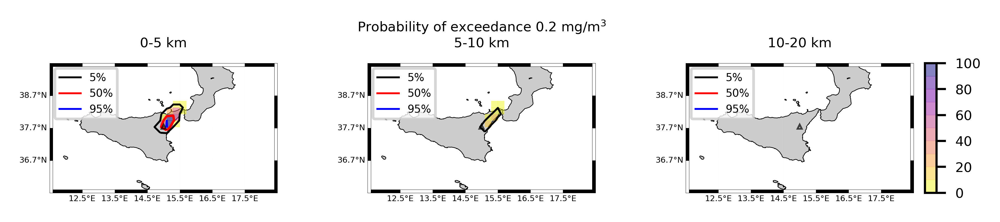

Forecast from VONA_20210304_0228Z
=================================

Contents
========

* [Forecast products](#forecast-products)
	* [Forecast at 2021-03-04 03:30 Z from RED VONA issued at 20210304_0228Z](#forecast-at-2021-03-04-0330-z-from-red-vona-issued-at-20210304_0228z)
	* [Forecast at 2021-03-04 04:30 Z from RED VONA issued at 20210304_0228Z](#forecast-at-2021-03-04-0430-z-from-red-vona-issued-at-20210304_0228z)
	* [Forecast at 2021-03-04 05:30 Z from RED VONA issued at 20210304_0228Z](#forecast-at-2021-03-04-0530-z-from-red-vona-issued-at-20210304_0228z)
	* [Forecast at 2021-03-04 08:30 Z from RED VONA issued at 20210304_0228Z](#forecast-at-2021-03-04-0830-z-from-red-vona-issued-at-20210304_0228z)
	* [Forecast at 2021-03-04 11:30 Z from RED VONA issued at 20210304_0228Z](#forecast-at-2021-03-04-1130-z-from-red-vona-issued-at-20210304_0228z)
	* [Forecast at 2021-03-04 14:30 Z from RED VONA issued at 20210304_0228Z](#forecast-at-2021-03-04-1430-z-from-red-vona-issued-at-20210304_0228z)
	* [Forecast at 2021-03-04 08:50 Z from RED VONA issued at 20210304_0751Z](#forecast-at-2021-03-04-0850-z-from-red-vona-issued-at-20210304_0751z)
	* [Forecast at 2021-03-04 09:00 Z from RED VONA issued at 20210304_0755Z](#forecast-at-2021-03-04-0900-z-from-red-vona-issued-at-20210304_0755z)
	* [Forecast at 2021-03-04 10:00 Z from RED VONA issued at 20210304_0755Z](#forecast-at-2021-03-04-1000-z-from-red-vona-issued-at-20210304_0755z)
	* [Forecast at 2021-03-04 11:00 Z from RED VONA issued at 20210304_0755Z](#forecast-at-2021-03-04-1100-z-from-red-vona-issued-at-20210304_0755z)
	* [Forecast at 2021-03-04 09:20 Z from RED VONA issued at 20210304_0817Z](#forecast-at-2021-03-04-0920-z-from-red-vona-issued-at-20210304_0817z)

# Forecast products

## Forecast at 2021-03-04 03:30 Z from RED VONA issued at 20210304_0228Z
  

|Eruption start [Z]|Eruption end [Z]|Forecast time [Z]|Column height asl [m]|
| :--- | :--- | :--- | :--- |
|2021-03-04 02:30:00|Ongoing|2021-03-04 03:30:00|5000 ± 500 - from VONA|
  
  

|Percentile|MER [kg/s¹]|Mass air [kg]|Mass air nested dom. [kg]|Mass grd [kg]|Mass grd nested dom. [kg]|
| :--- | :--- | :--- | :--- | :--- | :--- |
|5th|4.55e+02|2.11e+05|2.11e+05|1.65e+06|1.66e+06|
|50th|3.38e+03|2.29e+06|2.29e+06|8.48e+06|8.48e+06|
|95th|8.09e+03|6.79e+06|6.79e+06|1.90e+07|1.90e+07|
  

### Ground Nested Domain 2021-03-04 03:30 Z
  
  
  
  
  
  
  
  
  
  
  
  
  
  
  
  
  
  

|Location|Ground load [kg/m²] 5th perc|Ground load [kg/m²] 50th perc|Ground load [kg/m²] 95th perc|
| :--- | :--- | :--- | :--- |
|Piano Provenzana (1)|0.00e+00|1.70e-03|3.56e-02|
|Bivio Provenzana-Linguaglossa (2)|0.00e+00|1.11e-04|1.02e-02|
|Cunetta pre-Citelli (3)|0.00e+00|1.92e-03|4.37e-02|
|Chalet (4)|0.00e+00|0.00e+00|2.28e-04|
|Ragabo (5)|0.00e+00|2.02e-06|2.08e-03|
|Scilio (6)|0.00e+00|0.00e+00|4.77e-07|
|Gambino vini (7)|0.00e+00|0.00e+00|1.49e-06|
|StazioneFce Linguaglossa (8)|0.00e+00|0.00e+00|0.00e+00|
|Linguaglossa Via Olivio Sozzi (9)|0.00e+00|0.00e+00|0.00e+00|
|Cim.Linguaglossa (10)|0.00e+00|0.00e+00|0.00e+00|
|Gole Bar (11)|0.00e+00|0.00e+00|0.00e+00|
|Francavilla - Orange (12)|0.00e+00|0.00e+00|0.00e+00|
|Roccalumera1 (13)|0.00e+00|0.00e+00|0.00e+00|
|Roccalumera2 (14)|0.00e+00|0.00e+00|0.00e+00|
|Nizza (15)|0.00e+00|0.00e+00|0.00e+00|
|Scaletta Zanclea (16)|0.00e+00|0.00e+00|0.00e+00|
|Alì (17)|0.00e+00|0.00e+00|0.00e+00|
  

### Atmosphere 2021-03-04 03:30 Z
  

## Forecast at 2021-03-04 04:30 Z from RED VONA issued at 20210304_0228Z
  

|Eruption start [Z]|Eruption end [Z]|Forecast time [Z]|Column height asl [m]|
| :--- | :--- | :--- | :--- |
|2021-03-04 02:30:00|Ongoing|2021-03-04 04:30:00|5000 ± 500 - from VONA|
  
  

|Percentile|MER [kg/s¹]|Mass air [kg]|Mass air nested dom. [kg]|Mass grd [kg]|Mass grd nested dom. [kg]|
| :--- | :--- | :--- | :--- | :--- | :--- |
|5th|8.28e+02|7.24e+05|7.23e+05|8.51e+06|8.52e+06|
|50th|3.58e+03|3.25e+06|3.25e+06|2.34e+07|2.34e+07|
|95th|8.35e+03|6.75e+06|6.75e+06|4.56e+07|4.56e+07|
  

### Ground Nested Domain 2021-03-04 04:30 Z
  
  
  
  
  
  
  
  
  
  
  
  
  
  
  
  
  
  

|Location|Ground load [kg/m²] 5th perc|Ground load [kg/m²] 50th perc|Ground load [kg/m²] 95th perc|
| :--- | :--- | :--- | :--- |
|Piano Provenzana (1)|5.29e-03|2.22e-02|8.96e-02|
|Bivio Provenzana-Linguaglossa (2)|1.24e-05|1.47e-02|3.96e-02|
|Cunetta pre-Citelli (3)|0.00e+00|2.33e-02|1.06e-01|
|Chalet (4)|0.00e+00|4.05e-04|1.19e-02|
|Ragabo (5)|1.18e-05|1.78e-03|1.47e-02|
|Scilio (6)|0.00e+00|1.62e-06|9.72e-04|
|Gambino vini (7)|0.00e+00|2.99e-06|9.71e-04|
|StazioneFce Linguaglossa (8)|0.00e+00|0.00e+00|1.41e-03|
|Linguaglossa Via Olivio Sozzi (9)|0.00e+00|0.00e+00|1.63e-03|
|Cim.Linguaglossa (10)|0.00e+00|0.00e+00|1.23e-03|
|Gole Bar (11)|0.00e+00|0.00e+00|1.40e-06|
|Francavilla - Orange (12)|0.00e+00|0.00e+00|3.24e-05|
|Roccalumera1 (13)|0.00e+00|0.00e+00|0.00e+00|
|Roccalumera2 (14)|0.00e+00|0.00e+00|0.00e+00|
|Nizza (15)|0.00e+00|0.00e+00|0.00e+00|
|Scaletta Zanclea (16)|0.00e+00|0.00e+00|0.00e+00|
|Alì (17)|0.00e+00|0.00e+00|0.00e+00|
  

### Atmosphere 2021-03-04 04:30 Z
  

## Forecast at 2021-03-04 05:30 Z from RED VONA issued at 20210304_0228Z
  

|Eruption start [Z]|Eruption end [Z]|Forecast time [Z]|Column height asl [m]|
| :--- | :--- | :--- | :--- |
|2021-03-04 02:30:00|Ongoing|2021-03-04 05:30:00|5000 ± 500 - from VONA|
  
  

|Percentile|MER [kg/s¹]|Mass air [kg]|Mass air nested dom. [kg]|Mass grd [kg]|Mass grd nested dom. [kg]|
| :--- | :--- | :--- | :--- | :--- | :--- |
|5th|8.15e+02|1.09e+06|1.09e+06|1.58e+07|1.59e+07|
|50th|3.94e+03|3.79e+06|3.79e+06|3.64e+07|3.64e+07|
|95th|1.09e+04|8.88e+06|8.87e+06|5.84e+07|5.84e+07|
  

### Ground Nested Domain 2021-03-04 05:30 Z
  
  
  
  
  
  
  
  
  
  
  
  
  
  
  
  
  
  

|Location|Ground load [kg/m²] 5th perc|Ground load [kg/m²] 50th perc|Ground load [kg/m²] 95th perc|
| :--- | :--- | :--- | :--- |
|Piano Provenzana (1)|1.17e-02|5.18e-02|1.10e-01|
|Bivio Provenzana-Linguaglossa (2)|7.82e-04|2.97e-02|8.12e-02|
|Cunetta pre-Citelli (3)|5.67e-04|4.35e-02|1.74e-01|
|Chalet (4)|0.00e+00|6.46e-03|2.59e-02|
|Ragabo (5)|2.44e-04|1.15e-02|3.20e-02|
|Scilio (6)|0.00e+00|1.11e-04|3.99e-03|
|Gambino vini (7)|0.00e+00|6.78e-05|8.87e-03|
|StazioneFce Linguaglossa (8)|0.00e+00|8.94e-05|1.79e-03|
|Linguaglossa Via Olivio Sozzi (9)|0.00e+00|1.44e-04|1.90e-03|
|Cim.Linguaglossa (10)|0.00e+00|5.60e-06|2.88e-03|
|Gole Bar (11)|0.00e+00|0.00e+00|1.40e-06|
|Francavilla - Orange (12)|0.00e+00|0.00e+00|5.65e-05|
|Roccalumera1 (13)|0.00e+00|0.00e+00|0.00e+00|
|Roccalumera2 (14)|0.00e+00|0.00e+00|0.00e+00|
|Nizza (15)|0.00e+00|0.00e+00|0.00e+00|
|Scaletta Zanclea (16)|0.00e+00|0.00e+00|0.00e+00|
|Alì (17)|0.00e+00|0.00e+00|0.00e+00|
  

### Atmosphere 2021-03-04 05:30 Z
  

## Forecast at 2021-03-04 08:30 Z from RED VONA issued at 20210304_0228Z
  

|Eruption start [Z]|Eruption end [Z]|Forecast time [Z]|Column height asl [m]|
| :--- | :--- | :--- | :--- |
|2021-03-04 02:30:00|Ongoing|2021-03-04 08:30:00|5000 ± 500 - from VONA|
  
  

|Percentile|MER [kg/s¹]|Mass air [kg]|Mass air nested dom. [kg]|Mass grd [kg]|Mass grd nested dom. [kg]|
| :--- | :--- | :--- | :--- | :--- | :--- |
|5th|5.30e+02|8.79e+05|8.79e+05|2.92e+07|2.92e+07|
|50th|1.83e+03|3.55e+06|3.56e+06|6.00e+07|6.00e+07|
|95th|8.34e+03|1.22e+07|1.22e+07|1.06e+08|1.06e+08|
  

### Ground Nested Domain 2021-03-04 08:30 Z
  
  
  
  
  
  
  
  
  
  
  
  
  
  
  
  
  
  

|Location|Ground load [kg/m²] 5th perc|Ground load [kg/m²] 50th perc|Ground load [kg/m²] 95th perc|
| :--- | :--- | :--- | :--- |
|Piano Provenzana (1)|1.90e-02|9.54e-02|2.23e-01|
|Bivio Provenzana-Linguaglossa (2)|7.87e-03|4.90e-02|1.43e-01|
|Cunetta pre-Citelli (3)|6.98e-03|8.87e-02|2.25e-01|
|Chalet (4)|3.42e-04|1.53e-02|4.89e-02|
|Ragabo (5)|2.18e-03|1.92e-02|6.16e-02|
|Scilio (6)|1.00e-06|1.85e-03|2.27e-02|
|Gambino vini (7)|0.00e+00|1.98e-03|3.17e-02|
|StazioneFce Linguaglossa (8)|1.65e-05|7.18e-04|1.25e-02|
|Linguaglossa Via Olivio Sozzi (9)|4.39e-05|9.76e-04|1.20e-02|
|Cim.Linguaglossa (10)|0.00e+00|8.78e-04|1.85e-02|
|Gole Bar (11)|0.00e+00|2.79e-06|2.71e-03|
|Francavilla - Orange (12)|0.00e+00|6.43e-06|1.15e-03|
|Roccalumera1 (13)|0.00e+00|0.00e+00|0.00e+00|
|Roccalumera2 (14)|0.00e+00|0.00e+00|0.00e+00|
|Nizza (15)|0.00e+00|0.00e+00|0.00e+00|
|Scaletta Zanclea (16)|0.00e+00|0.00e+00|0.00e+00|
|Alì (17)|0.00e+00|0.00e+00|0.00e+00|
  

### Atmosphere 2021-03-04 08:30 Z
  

## Forecast at 2021-03-04 11:30 Z from RED VONA issued at 20210304_0228Z
  

|Eruption start [Z]|Eruption end [Z]|Forecast time [Z]|Column height asl [m]|
| :--- | :--- | :--- | :--- |
|2021-03-04 02:30:00|Ongoing|2021-03-04 11:30:00|5000 ± 500 - from VONA|
  
  

|Percentile|MER [kg/s¹]|Mass air [kg]|Mass air nested dom. [kg]|Mass grd [kg]|Mass grd nested dom. [kg]|
| :--- | :--- | :--- | :--- | :--- | :--- |
|5th|2.23e+02|1.65e+06|1.65e+06|5.28e+07|5.29e+07|
|50th|2.54e+03|6.34e+06|6.29e+06|8.82e+07|8.83e+07|
|95th|9.11e+03|1.74e+07|1.74e+07|1.67e+08|1.67e+08|
  

### Ground Nested Domain 2021-03-04 11:30 Z
  
  
  
  
  
  
  
  
  
  
  
  
  
  
  
  
  
  

|Location|Ground load [kg/m²] 5th perc|Ground load [kg/m²] 50th perc|Ground load [kg/m²] 95th perc|
| :--- | :--- | :--- | :--- |
|Piano Provenzana (1)|4.59e-02|1.27e-01|2.77e-01|
|Bivio Provenzana-Linguaglossa (2)|1.05e-02|6.79e-02|2.89e-01|
|Cunetta pre-Citelli (3)|7.58e-03|9.70e-02|5.32e-01|
|Chalet (4)|2.14e-03|1.98e-02|1.22e-01|
|Ragabo (5)|4.77e-03|2.26e-02|1.52e-01|
|Scilio (6)|3.87e-05|2.18e-03|4.92e-02|
|Gambino vini (7)|1.79e-05|2.04e-03|1.04e-01|
|StazioneFce Linguaglossa (8)|4.99e-05|9.57e-04|2.58e-02|
|Linguaglossa Via Olivio Sozzi (9)|1.27e-04|1.51e-03|2.09e-02|
|Cim.Linguaglossa (10)|0.00e+00|1.80e-03|3.17e-02|
|Gole Bar (11)|0.00e+00|1.26e-04|6.25e-03|
|Francavilla - Orange (12)|0.00e+00|2.32e-04|5.28e-03|
|Roccalumera1 (13)|0.00e+00|0.00e+00|4.66e-05|
|Roccalumera2 (14)|0.00e+00|0.00e+00|1.12e-05|
|Nizza (15)|0.00e+00|0.00e+00|6.10e-06|
|Scaletta Zanclea (16)|0.00e+00|0.00e+00|0.00e+00|
|Alì (17)|0.00e+00|0.00e+00|6.05e-06|
  

### Atmosphere 2021-03-04 11:30 Z
  

## Forecast at 2021-03-04 14:30 Z from RED VONA issued at 20210304_0228Z
  

|Eruption start [Z]|Eruption end [Z]|Forecast time [Z]|Column height asl [m]|
| :--- | :--- | :--- | :--- |
|2021-03-04 02:30:00|Ongoing|2021-03-04 14:30:00|5000 ± 500 - from VONA|
  
  

|Percentile|MER [kg/s¹]|Mass air [kg]|Mass air nested dom. [kg]|Mass grd [kg]|Mass grd nested dom. [kg]|
| :--- | :--- | :--- | :--- | :--- | :--- |
|5th|4.09e+02|5.77e+06|5.66e+06|1.19e+08|1.19e+08|
|50th|5.30e+03|1.33e+07|1.31e+07|1.81e+08|1.81e+08|
|95th|2.00e+04|3.12e+07|3.10e+07|2.19e+08|2.19e+08|
  

### Ground Nested Domain 2021-03-04 14:30 Z
  
  
  
  
  
  
  
  
  
  
  
  
  
  
  
  
  
  

|Location|Ground load [kg/m²] 5th perc|Ground load [kg/m²] 50th perc|Ground load [kg/m²] 95th perc|
| :--- | :--- | :--- | :--- |
|Piano Provenzana (1)|1.02e-01|1.87e-01|8.76e-01|
|Bivio Provenzana-Linguaglossa (2)|2.04e-02|1.36e-01|7.08e-01|
|Cunetta pre-Citelli (3)|1.39e-02|2.01e-01|1.02e+00|
|Chalet (4)|1.20e-02|3.68e-02|3.05e-01|
|Ragabo (5)|1.80e-02|7.24e-02|3.01e-01|
|Scilio (6)|8.07e-04|4.22e-03|7.36e-02|
|Gambino vini (7)|5.58e-04|5.80e-03|1.22e-01|
|StazioneFce Linguaglossa (8)|1.30e-04|5.11e-03|4.19e-02|
|Linguaglossa Via Olivio Sozzi (9)|3.45e-04|7.30e-03|4.52e-02|
|Cim.Linguaglossa (10)|2.69e-04|3.28e-03|5.33e-02|
|Gole Bar (11)|0.00e+00|1.28e-03|2.33e-02|
|Francavilla - Orange (12)|2.89e-05|1.28e-03|1.14e-02|
|Roccalumera1 (13)|0.00e+00|0.00e+00|9.79e-05|
|Roccalumera2 (14)|0.00e+00|0.00e+00|4.36e-05|
|Nizza (15)|0.00e+00|0.00e+00|5.52e-05|
|Scaletta Zanclea (16)|0.00e+00|0.00e+00|9.83e-05|
|Alì (17)|0.00e+00|0.00e+00|7.83e-05|
  

### Atmosphere 2021-03-04 14:30 Z
  

## Forecast at 2021-03-04 08:50 Z from RED VONA issued at 20210304_0751Z
  

|Eruption start [Z]|Eruption end [Z]|Forecast time [Z]|Column height asl [m]|
| :--- | :--- | :--- | :--- |
|2021-03-04 02:30:00|Ongoing|2021-03-04 08:50:00|6000 ± 500 - from VONA|
  
  

|Percentile|MER [kg/s¹]|Mass air [kg]|Mass air nested dom. [kg]|Mass grd [kg]|Mass grd nested dom. [kg]|
| :--- | :--- | :--- | :--- | :--- | :--- |
|5th|2.31e+03|2.42e+06|2.42e+06|3.68e+07|3.68e+07|
|50th|6.45e+03|8.02e+06|8.02e+06|7.55e+07|7.55e+07|
|95th|1.45e+04|1.66e+07|1.66e+07|1.27e+08|1.27e+08|
  

### Ground Nested Domain 2021-03-04 08:50 Z
  
  
  
  
  
  
  
  
  
  
  
  
  
  
  
  
  
  

|Location|Ground load [kg/m²] 5th perc|Ground load [kg/m²] 50th perc|Ground load [kg/m²] 95th perc|
| :--- | :--- | :--- | :--- |
|Piano Provenzana (1)|2.14e-02|1.01e-01|2.41e-01|
|Bivio Provenzana-Linguaglossa (2)|9.04e-03|6.12e-02|1.51e-01|
|Cunetta pre-Citelli (3)|7.00e-03|1.13e-01|2.39e-01|
|Chalet (4)|3.42e-04|1.69e-02|5.18e-02|
|Ragabo (5)|2.51e-03|2.08e-02|6.83e-02|
|Scilio (6)|1.00e-06|3.26e-03|2.49e-02|
|Gambino vini (7)|0.00e+00|3.21e-03|3.14e-02|
|StazioneFce Linguaglossa (8)|1.65e-05|1.17e-03|1.52e-02|
|Linguaglossa Via Olivio Sozzi (9)|4.39e-05|1.44e-03|1.22e-02|
|Cim.Linguaglossa (10)|0.00e+00|1.43e-03|2.16e-02|
|Gole Bar (11)|0.00e+00|2.79e-06|3.10e-03|
|Francavilla - Orange (12)|0.00e+00|1.96e-06|8.77e-04|
|Roccalumera1 (13)|0.00e+00|0.00e+00|0.00e+00|
|Roccalumera2 (14)|0.00e+00|0.00e+00|0.00e+00|
|Nizza (15)|0.00e+00|0.00e+00|0.00e+00|
|Scaletta Zanclea (16)|0.00e+00|0.00e+00|0.00e+00|
|Alì (17)|0.00e+00|0.00e+00|0.00e+00|
  

### Atmosphere 2021-03-04 08:50 Z
  

## Forecast at 2021-03-04 09:00 Z from RED VONA issued at 20210304_0755Z
  

|Eruption start [Z]|Eruption end [Z]|Forecast time [Z]|Column height asl [m]|
| :--- | :--- | :--- | :--- |
|2021-03-04 02:30:00|Ongoing|2021-03-04 09:00:00|6500 ± 500 - from VONA|
  
  

|Percentile|MER [kg/s¹]|Mass air [kg]|Mass air nested dom. [kg]|Mass grd [kg]|Mass grd nested dom. [kg]|
| :--- | :--- | :--- | :--- | :--- | :--- |
|5th|4.43e+03|5.64e+06|5.64e+06|5.57e+07|5.57e+07|
|50th|1.16e+04|1.08e+07|1.08e+07|1.04e+08|1.04e+08|
|95th|2.19e+04|2.72e+07|2.72e+07|1.31e+08|1.31e+08|
  

### Ground Nested Domain 2021-03-04 09:00 Z
  
  
  
  
  
  
  
  
  
  
  
  
  
  
  
  
  
  

|Location|Ground load [kg/m²] 5th perc|Ground load [kg/m²] 50th perc|Ground load [kg/m²] 95th perc|
| :--- | :--- | :--- | :--- |
|Piano Provenzana (1)|3.20e-02|9.57e-02|2.91e-01|
|Bivio Provenzana-Linguaglossa (2)|1.20e-02|6.91e-02|2.15e-01|
|Cunetta pre-Citelli (3)|1.77e-02|1.10e-01|3.14e-01|
|Chalet (4)|1.03e-03|2.11e-02|5.35e-02|
|Ragabo (5)|2.68e-03|2.44e-02|7.64e-02|
|Scilio (6)|1.00e-06|2.60e-03|2.34e-02|
|Gambino vini (7)|0.00e+00|2.45e-03|2.94e-02|
|StazioneFce Linguaglossa (8)|1.77e-05|9.07e-04|1.35e-02|
|Linguaglossa Via Olivio Sozzi (9)|4.70e-05|1.44e-03|1.21e-02|
|Cim.Linguaglossa (10)|0.00e+00|9.97e-04|1.91e-02|
|Gole Bar (11)|0.00e+00|7.50e-06|3.10e-03|
|Francavilla - Orange (12)|0.00e+00|4.47e-06|8.89e-04|
|Roccalumera1 (13)|0.00e+00|0.00e+00|0.00e+00|
|Roccalumera2 (14)|0.00e+00|0.00e+00|0.00e+00|
|Nizza (15)|0.00e+00|0.00e+00|0.00e+00|
|Scaletta Zanclea (16)|0.00e+00|0.00e+00|0.00e+00|
|Alì (17)|0.00e+00|0.00e+00|0.00e+00|
  

### Atmosphere 2021-03-04 09:00 Z
  

## Forecast at 2021-03-04 10:00 Z from RED VONA issued at 20210304_0755Z
  

|Eruption start [Z]|Eruption end [Z]|Forecast time [Z]|Column height asl [m]|
| :--- | :--- | :--- | :--- |
|2021-03-04 02:30:00|Ongoing|2021-03-04 10:00:00|6500 ± 500 - from VONA|
  
  

|Percentile|MER [kg/s¹]|Mass air [kg]|Mass air nested dom. [kg]|Mass grd [kg]|Mass grd nested dom. [kg]|
| :--- | :--- | :--- | :--- | :--- | :--- |
|5th|9.53e+03|4.49e+06|4.49e+06|9.45e+07|9.45e+07|
|50th|1.45e+04|1.15e+07|1.15e+07|1.34e+08|1.34e+08|
|95th|2.45e+04|2.92e+07|2.92e+07|1.78e+08|1.78e+08|
  

### Ground Nested Domain 2021-03-04 10:00 Z
  
  
  
  
  
  
  
  
  
  
  
  
  
  
  
  
  
  

|Location|Ground load [kg/m²] 5th perc|Ground load [kg/m²] 50th perc|Ground load [kg/m²] 95th perc|
| :--- | :--- | :--- | :--- |
|Piano Provenzana (1)|3.71e-02|1.26e-01|4.05e-01|
|Bivio Provenzana-Linguaglossa (2)|1.62e-02|7.11e-02|2.79e-01|
|Cunetta pre-Citelli (3)|1.97e-02|1.54e-01|5.78e-01|
|Chalet (4)|1.09e-03|2.11e-02|9.29e-02|
|Ragabo (5)|3.93e-03|2.45e-02|1.17e-01|
|Scilio (6)|1.00e-06|3.04e-03|2.34e-02|
|Gambino vini (7)|0.00e+00|3.19e-03|4.29e-02|
|StazioneFce Linguaglossa (8)|1.77e-05|9.84e-04|1.37e-02|
|Linguaglossa Via Olivio Sozzi (9)|4.70e-05|1.44e-03|1.31e-02|
|Cim.Linguaglossa (10)|0.00e+00|9.97e-04|1.91e-02|
|Gole Bar (11)|0.00e+00|7.50e-06|3.10e-03|
|Francavilla - Orange (12)|0.00e+00|4.47e-06|8.89e-04|
|Roccalumera1 (13)|0.00e+00|0.00e+00|0.00e+00|
|Roccalumera2 (14)|0.00e+00|0.00e+00|0.00e+00|
|Nizza (15)|0.00e+00|0.00e+00|0.00e+00|
|Scaletta Zanclea (16)|0.00e+00|0.00e+00|0.00e+00|
|Alì (17)|0.00e+00|0.00e+00|0.00e+00|
  

### Atmosphere 2021-03-04 10:00 Z
  

## Forecast at 2021-03-04 11:00 Z from RED VONA issued at 20210304_0755Z
  

|Eruption start [Z]|Eruption end [Z]|Forecast time [Z]|Column height asl [m]|
| :--- | :--- | :--- | :--- |
|2021-03-04 02:30:00|Ongoing|2021-03-04 11:00:00|6500 ± 500 - from VONA|
  
  

|Percentile|MER [kg/s¹]|Mass air [kg]|Mass air nested dom. [kg]|Mass grd [kg]|Mass grd nested dom. [kg]|
| :--- | :--- | :--- | :--- | :--- | :--- |
|5th|6.98e+03|3.71e+06|3.71e+06|1.29e+08|1.29e+08|
|50th|1.54e+04|1.38e+07|1.38e+07|1.79e+08|1.79e+08|
|95th|2.93e+04|3.48e+07|3.48e+07|2.31e+08|2.31e+08|
  

### Ground Nested Domain 2021-03-04 11:00 Z
  
  
  
  
  
  
  
  
  
  
  
  
  
  
  
  
  
  

|Location|Ground load [kg/m²] 5th perc|Ground load [kg/m²] 50th perc|Ground load [kg/m²] 95th perc|
| :--- | :--- | :--- | :--- |
|Piano Provenzana (1)|6.27e-02|1.99e-01|6.02e-01|
|Bivio Provenzana-Linguaglossa (2)|3.25e-02|1.38e-01|3.61e-01|
|Cunetta pre-Citelli (3)|5.65e-02|2.40e-01|7.87e-01|
|Chalet (4)|2.73e-03|4.08e-02|1.31e-01|
|Ragabo (5)|9.05e-03|4.95e-02|1.76e-01|
|Scilio (6)|1.96e-05|3.41e-03|2.63e-02|
|Gambino vini (7)|5.07e-05|4.98e-03|4.76e-02|
|StazioneFce Linguaglossa (8)|1.77e-05|9.84e-04|1.48e-02|
|Linguaglossa Via Olivio Sozzi (9)|4.70e-05|1.44e-03|1.34e-02|
|Cim.Linguaglossa (10)|0.00e+00|1.08e-03|2.10e-02|
|Gole Bar (11)|0.00e+00|7.50e-06|3.10e-03|
|Francavilla - Orange (12)|0.00e+00|4.47e-06|8.89e-04|
|Roccalumera1 (13)|0.00e+00|0.00e+00|0.00e+00|
|Roccalumera2 (14)|0.00e+00|0.00e+00|0.00e+00|
|Nizza (15)|0.00e+00|0.00e+00|0.00e+00|
|Scaletta Zanclea (16)|0.00e+00|0.00e+00|0.00e+00|
|Alì (17)|0.00e+00|0.00e+00|0.00e+00|
  

### Atmosphere 2021-03-04 11:00 Z
  

## Forecast at 2021-03-04 09:20 Z from RED VONA issued at 20210304_0817Z
  

|Eruption start [Z]|Eruption end [Z]|Forecast time [Z]|Column height asl [m]|
| :--- | :--- | :--- | :--- |
|2021-03-04 02:30:00|Ongoing|2021-03-04 09:20:00|11000 ± 500 - from VONA|
  
  

|Percentile|MER [kg/s¹]|Mass air [kg]|Mass air nested dom. [kg]|Mass grd [kg]|Mass grd nested dom. [kg]|
| :--- | :--- | :--- | :--- | :--- | :--- |
|5th|3.98e+05|5.90e+08|5.88e+08|8.83e+08|8.82e+08|
|50th|8.31e+05|1.26e+09|1.26e+09|1.52e+09|1.52e+09|
|95th|1.95e+06|2.76e+09|2.75e+09|3.35e+09|3.35e+09|
  

### Ground Nested Domain 2021-03-04 09:20 Z
  
  
  
  
  
  
  
  
  
  
  
  
  
  
  
  
  
  

|Location|Ground load [kg/m²] 5th perc|Ground load [kg/m²] 50th perc|Ground load [kg/m²] 95th perc|
| :--- | :--- | :--- | :--- |
|Piano Provenzana (1)|1.71e+00|4.44e+00|8.39e+00|
|Bivio Provenzana-Linguaglossa (2)|2.08e+00|4.54e+00|9.62e+00|
|Cunetta pre-Citelli (3)|2.07e+00|5.87e+00|9.19e+00|
|Chalet (4)|1.73e+00|3.59e+00|1.01e+01|
|Ragabo (5)|1.73e+00|4.08e+00|9.74e+00|
|Scilio (6)|6.55e-01|2.10e+00|7.40e+00|
|Gambino vini (7)|7.99e-01|2.95e+00|9.06e+00|
|StazioneFce Linguaglossa (8)|3.83e-01|1.43e+00|5.43e+00|
|Linguaglossa Via Olivio Sozzi (9)|3.98e-01|1.42e+00|4.89e+00|
|Cim.Linguaglossa (10)|4.16e-01|1.58e+00|6.43e+00|
|Gole Bar (11)|3.35e-02|3.06e-01|1.87e+00|
|Francavilla - Orange (12)|1.20e-02|1.37e-01|1.34e+00|
|Roccalumera1 (13)|0.00e+00|0.00e+00|3.68e-04|
|Roccalumera2 (14)|0.00e+00|0.00e+00|1.65e-04|
|Nizza (15)|0.00e+00|0.00e+00|5.61e-05|
|Scaletta Zanclea (16)|0.00e+00|0.00e+00|0.00e+00|
|Alì (17)|0.00e+00|0.00e+00|3.36e-06|
  

### Atmosphere 2021-03-04 09:20 Z
  
  
Go to [Supplementary page](Supplementary_page.md)  
Go to [Main directory](https://github.com/federicapardini/Real_time_ash_forecast)