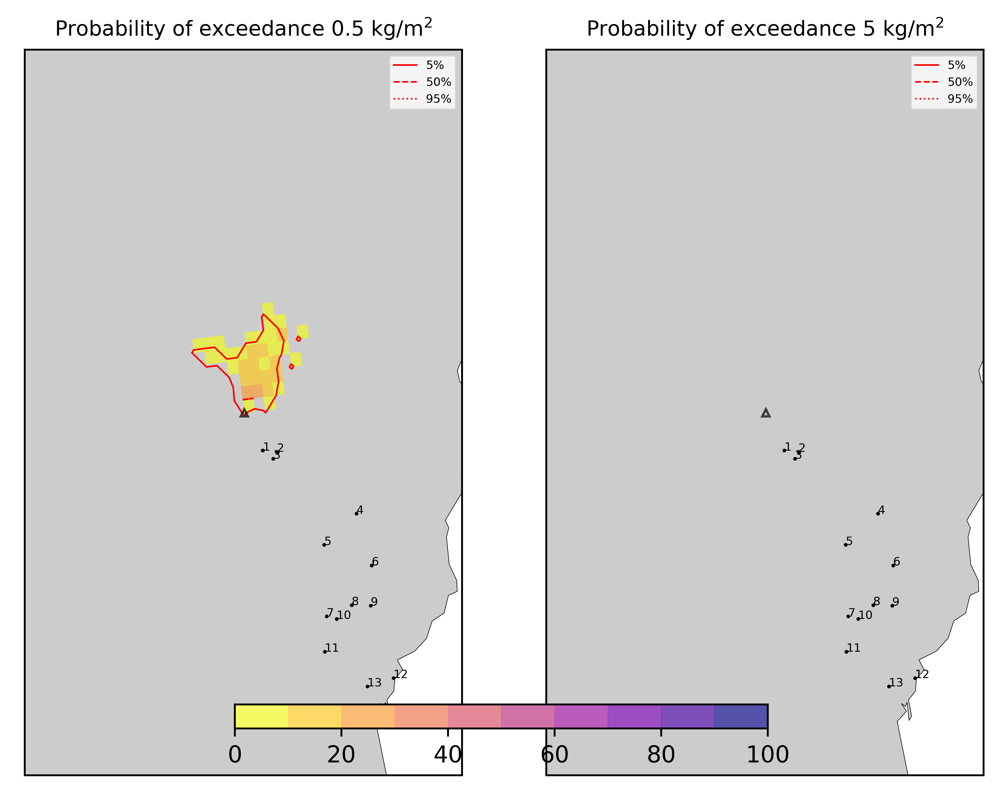

Forecast from VONA bulletin - 20210304_0228Z
============================================

Contents
========

* [Forecast products](#forecast-products)
	* [Forecast at 2021-03-04 05:30 Z - Ongoing Eruption](#forecast-at-2021-03-04-0530-z---ongoing-eruption)
	* [Forecast at 2021-03-04 08:30 Z - Ongoing Eruption](#forecast-at-2021-03-04-0830-z---ongoing-eruption)

# Forecast products

## Forecast at 2021-03-04 05:30 Z - Ongoing Eruption
  

|Eruption start [Z]|Eruption end [Z]|Forecast time [Z]|Column height asl [m]|
| :--- | :--- | :--- | :--- |
|2021-03-04 02:30:00|Ongoing|2021-03-04 05:30:00|5000 ± 500 - from VONA|
  
  

|Percentile|MER [kg/s¹]|Mass air [kg]|Mass air nested dom. [kg]|Mass grd [kg]|Mass grd nested dom. [kg]|
| :--- | :--- | :--- | :--- | :--- | :--- |
|5th|1.95e+02|3.27e+06|3.27e+06|1.91e+05|1.99e+05|
|50th|3.15e+03|3.54e+07|3.25e+07|5.21e+06|5.23e+06|
|95th|7.32e+03|5.63e+07|5.41e+07|2.04e+07|5.41e+07|
  

### Ground Nested Domain 2021-03-04 05:30 Z
  
  
  
  
  
  
  
  
  
  
  
  
  
  

|Location|Ground load [kg/m²] 5th perc|Ground load [kg/m²] 50th perc|Ground load [kg/m²] 95th perc|
| :--- | :--- | :--- | :--- |
|Schiena Asino (1)|0.00e+00|0.00e+00|1.48e-03|
|Rif.Vescovo (2)|0.00e+00|0.00e+00|8.41e-04|
|Serra Pituzza (3)|0.00e+00|0.00e+00|5.10e-04|
|Monterosso (4)|0.00e+00|0.00e+00|0.00e+00|
|Cim.Pedara (5)|0.00e+00|0.00e+00|0.00e+00|
|Cim.Viagrande (6)|0.00e+00|0.00e+00|0.00e+00|
|Cim.Mascalucia (7)|0.00e+00|0.00e+00|0.00e+00|
|Cim.Tremestieri (8)|0.00e+00|0.00e+00|0.00e+00|
|Cim.S.Giov.La Punta (9)|0.00e+00|0.00e+00|0.00e+00|
|Cim.Gravina (10)|0.00e+00|0.00e+00|0.00e+00|
|ENI S.Giov.Galermo (11)|0.00e+00|0.00e+00|0.00e+00|
|Bio Piazza Europa (12)|0.00e+00|0.00e+00|0.00e+00|
|INGV-OE (13)|0.00e+00|0.00e+00|0.00e+00|
  

### Atmosphere 2021-03-04 05:30 Z
  

## Forecast at 2021-03-04 08:30 Z - Ongoing Eruption
  

|Eruption start [Z]|Eruption end [Z]|Forecast time [Z]|Column height asl [m]|
| :--- | :--- | :--- | :--- |
|2021-03-04 02:30:00|Ongoing|2021-03-04 08:30:00|5000 ± 500 - from VONA|
  
  

|Percentile|MER [kg/s¹]|Mass air [kg]|Mass air nested dom. [kg]|Mass grd [kg]|Mass grd nested dom. [kg]|
| :--- | :--- | :--- | :--- | :--- | :--- |
|5th|2.30e+02|1.79e+06|1.79e+06|1.77e+06|1.78e+06|
|50th|1.76e+03|1.47e+07|1.47e+07|7.99e+06|7.99e+06|
|95th|9.29e+03|6.65e+07|5.51e+07|2.45e+07|5.51e+07|
  

### Ground Nested Domain 2021-03-04 08:30 Z
  
  
  
  
  
  
  
  
  
  
  
  
  
  

|Location|Ground load [kg/m²] 5th perc|Ground load [kg/m²] 50th perc|Ground load [kg/m²] 95th perc|
| :--- | :--- | :--- | :--- |
|Schiena Asino (1)|0.00e+00|1.28e-06|1.02e-03|
|Rif.Vescovo (2)|0.00e+00|0.00e+00|5.53e-04|
|Serra Pituzza (3)|0.00e+00|0.00e+00|3.30e-04|
|Monterosso (4)|0.00e+00|0.00e+00|0.00e+00|
|Cim.Pedara (5)|0.00e+00|0.00e+00|0.00e+00|
|Cim.Viagrande (6)|0.00e+00|0.00e+00|0.00e+00|
|Cim.Mascalucia (7)|0.00e+00|0.00e+00|0.00e+00|
|Cim.Tremestieri (8)|0.00e+00|0.00e+00|0.00e+00|
|Cim.S.Giov.La Punta (9)|0.00e+00|0.00e+00|0.00e+00|
|Cim.Gravina (10)|0.00e+00|0.00e+00|0.00e+00|
|ENI S.Giov.Galermo (11)|0.00e+00|0.00e+00|0.00e+00|
|Bio Piazza Europa (12)|0.00e+00|0.00e+00|0.00e+00|
|INGV-OE (13)|0.00e+00|0.00e+00|0.00e+00|
  

### Atmosphere 2021-03-04 08:30 Z
  
  
Go to [Supplementary page](Supplementary_page.md)  
Go to [Main directory](https://github.com/federicapardini/Real_time_ash_forecast)