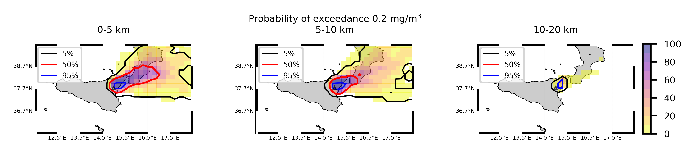

Forecast from VONA_20210304_0228Z
=================================

Contents
========

* [Forecast products](#forecast-products)
	* [Forecast at 2021-03-04 03:30 Z from RED VONA issued at 20210304_0228Z](#forecast-at-2021-03-04-0330-z-from-red-vona-issued-at-20210304_0228z)
	* [Forecast at 2021-03-04 04:30 Z from RED VONA issued at 20210304_0228Z](#forecast-at-2021-03-04-0430-z-from-red-vona-issued-at-20210304_0228z)
	* [Forecast at 2021-03-04 05:30 Z from RED VONA issued at 20210304_0228Z](#forecast-at-2021-03-04-0530-z-from-red-vona-issued-at-20210304_0228z)
	* [Forecast at 2021-03-04 08:30 Z from RED VONA issued at 20210304_0228Z](#forecast-at-2021-03-04-0830-z-from-red-vona-issued-at-20210304_0228z)
	* [Forecast at 2021-03-04 11:30 Z from RED VONA issued at 20210304_0228Z](#forecast-at-2021-03-04-1130-z-from-red-vona-issued-at-20210304_0228z)
	* [Forecast at 2021-03-04 14:30 Z from RED VONA issued at 20210304_0228Z](#forecast-at-2021-03-04-1430-z-from-red-vona-issued-at-20210304_0228z)
	* [Forecast at 2021-03-04 08:50 Z from RED VONA issued at 20210304_0751Z](#forecast-at-2021-03-04-0850-z-from-red-vona-issued-at-20210304_0751z)
	* [Forecast at 2021-03-04 09:00 Z from RED VONA issued at 20210304_0755Z](#forecast-at-2021-03-04-0900-z-from-red-vona-issued-at-20210304_0755z)
	* [Forecast at 2021-03-04 10:00 Z from RED VONA issued at 20210304_0755Z](#forecast-at-2021-03-04-1000-z-from-red-vona-issued-at-20210304_0755z)
	* [Forecast at 2021-03-04 11:00 Z from RED VONA issued at 20210304_0755Z](#forecast-at-2021-03-04-1100-z-from-red-vona-issued-at-20210304_0755z)
	* [Forecast at 2021-03-04 14:00 Z from RED VONA issued at 20210304_0755Z](#forecast-at-2021-03-04-1400-z-from-red-vona-issued-at-20210304_0755z)
	* [Forecast at 2021-03-04 09:20 Z from RED VONA issued at 20210304_0817Z](#forecast-at-2021-03-04-0920-z-from-red-vona-issued-at-20210304_0817z)
	* [Forecast at 2021-03-04 10:20 Z from RED VONA issued at 20210304_0817Z](#forecast-at-2021-03-04-1020-z-from-red-vona-issued-at-20210304_0817z)
	* [Forecast at 2021-03-04 11:20 Z from RED VONA issued at 20210304_0817Z](#forecast-at-2021-03-04-1120-z-from-red-vona-issued-at-20210304_0817z)
	* [Forecast at 2021-03-04 14:20 Z from RED VONA issued at 20210304_0817Z](#forecast-at-2021-03-04-1420-z-from-red-vona-issued-at-20210304_0817z)
	* [Forecast at 2021-03-04 17:20 Z from RED VONA issued at 20210304_0817Z](#forecast-at-2021-03-04-1720-z-from-red-vona-issued-at-20210304_0817z)

# Forecast products

## Forecast at 2021-03-04 03:30 Z from RED VONA issued at 20210304_0228Z
  

|Eruption start [Z]|Eruption end [Z]|Forecast time [Z]|Column height asl [m]|
| :--- | :--- | :--- | :--- |
|2021-03-04 02:30:00|Ongoing|2021-03-04 03:30:00|5000 ± 500 - from VONA|
  
  

|Percentile|MER [kg/s¹]|Mass air [kg]|Mass air nested dom. [kg]|Mass grd [kg]|Mass grd nested dom. [kg]|
| :--- | :--- | :--- | :--- | :--- | :--- |
|5th|1.87e+02|3.30e+05|3.30e+05|5.44e+05|5.48e+05|
|50th|3.25e+03|3.74e+06|3.74e+06|8.55e+06|8.55e+06|
|95th|7.13e+03|1.14e+07|1.14e+07|1.63e+07|1.63e+07|
  

### Ground Nested Domain 2021-03-04 03:30 Z
  
  
  
  
  
  
  
  
  
  
  
  
  
  
  
  
  
  
  
  
  
  
  
  
  

|Location|Ground load [kg/m²] 5th perc|Ground load [kg/m²] 50th perc|Ground load [kg/m²] 95th perc|
| :--- | :--- | :--- | :--- |
|Piano Provenzana (1)|0.00e+00|9.62e-04|6.63e-02|
|Bivio Provenzana-Linguaglossa (2)|0.00e+00|6.36e-04|2.13e-02|
|Cunetta pre-Citelli (3)|0.00e+00|1.69e-03|5.82e-02|
|Chalet (4)|0.00e+00|0.00e+00|2.61e-03|
|Ragabo (5)|0.00e+00|1.26e-05|6.72e-03|
|Scilio (6)|0.00e+00|0.00e+00|1.15e-05|
|Gambino vini (7)|0.00e+00|0.00e+00|3.58e-05|
|StazioneFce Linguaglossa (8)|0.00e+00|0.00e+00|0.00e+00|
|Linguaglossa Via Olivio Sozzi (9)|0.00e+00|0.00e+00|0.00e+00|
|Cim.Linguaglossa (10)|0.00e+00|0.00e+00|0.00e+00|
|Gole Bar (11)|0.00e+00|0.00e+00|0.00e+00|
|Francavilla - Orange (12)|0.00e+00|0.00e+00|0.00e+00|
|Roccalumera1 (13)|0.00e+00|0.00e+00|0.00e+00|
|Roccalumera2 (14)|0.00e+00|0.00e+00|0.00e+00|
|Nizza (15)|0.00e+00|0.00e+00|0.00e+00|
|Scaletta Zanclea (16)|0.00e+00|0.00e+00|0.00e+00|
|Alì (17)|0.00e+00|0.00e+00|0.00e+00|
|Catania AP (18)|0.00e+00|0.00e+00|0.00e+00|
|Nicolosi (19)|0.00e+00|0.00e+00|0.00e+00|
|Zafferana (20)|0.00e+00|0.00e+00|0.00e+00|
|Linguaglossa (21)|0.00e+00|0.00e+00|0.00e+00|
|Randazzo (22)|0.00e+00|0.00e+00|0.00e+00|
|Bronte (23)|0.00e+00|0.00e+00|0.00e+00|
|Biancavilla (24)|0.00e+00|0.00e+00|0.00e+00|
  

### Atmosphere 2021-03-04 03:30 Z
  

## Forecast at 2021-03-04 04:30 Z from RED VONA issued at 20210304_0228Z
  

|Eruption start [Z]|Eruption end [Z]|Forecast time [Z]|Column height asl [m]|
| :--- | :--- | :--- | :--- |
|2021-03-04 02:30:00|Ongoing|2021-03-04 04:30:00|5000 ± 500 - from VONA|
  
  

|Percentile|MER [kg/s¹]|Mass air [kg]|Mass air nested dom. [kg]|Mass grd [kg]|Mass grd nested dom. [kg]|
| :--- | :--- | :--- | :--- | :--- | :--- |
|5th|7.70e+02|2.29e+06|2.28e+06|1.11e+07|1.11e+07|
|50th|4.02e+03|5.58e+06|5.57e+06|1.91e+07|1.91e+07|
|95th|1.04e+04|1.60e+07|1.59e+07|3.62e+07|3.61e+07|
  

### Ground Nested Domain 2021-03-04 04:30 Z
  
  
  
  
  
  
  
  
  
  
  
  
  
  
  
  
  
  
  
  
  
  
  
  
  

|Location|Ground load [kg/m²] 5th perc|Ground load [kg/m²] 50th perc|Ground load [kg/m²] 95th perc|
| :--- | :--- | :--- | :--- |
|Piano Provenzana (1)|1.03e-04|2.80e-02|1.38e-01|
|Bivio Provenzana-Linguaglossa (2)|5.41e-06|1.55e-02|9.89e-02|
|Cunetta pre-Citelli (3)|3.76e-06|3.83e-02|2.14e-01|
|Chalet (4)|0.00e+00|3.22e-03|3.09e-02|
|Ragabo (5)|0.00e+00|5.59e-03|4.04e-02|
|Scilio (6)|0.00e+00|3.82e-06|3.29e-03|
|Gambino vini (7)|0.00e+00|1.19e-05|5.45e-03|
|StazioneFce Linguaglossa (8)|0.00e+00|1.57e-06|2.32e-03|
|Linguaglossa Via Olivio Sozzi (9)|0.00e+00|4.18e-06|3.03e-03|
|Cim.Linguaglossa (10)|0.00e+00|0.00e+00|3.53e-03|
|Gole Bar (11)|0.00e+00|0.00e+00|1.19e-03|
|Francavilla - Orange (12)|0.00e+00|0.00e+00|3.50e-04|
|Roccalumera1 (13)|0.00e+00|0.00e+00|0.00e+00|
|Roccalumera2 (14)|0.00e+00|0.00e+00|0.00e+00|
|Nizza (15)|0.00e+00|0.00e+00|0.00e+00|
|Scaletta Zanclea (16)|0.00e+00|0.00e+00|0.00e+00|
|Alì (17)|0.00e+00|0.00e+00|0.00e+00|
|Catania AP (18)|0.00e+00|0.00e+00|0.00e+00|
|Nicolosi (19)|0.00e+00|0.00e+00|0.00e+00|
|Zafferana (20)|0.00e+00|0.00e+00|0.00e+00|
|Linguaglossa (21)|0.00e+00|0.00e+00|2.37e-03|
|Randazzo (22)|0.00e+00|0.00e+00|1.40e-04|
|Bronte (23)|0.00e+00|0.00e+00|0.00e+00|
|Biancavilla (24)|0.00e+00|0.00e+00|0.00e+00|
  

### Atmosphere 2021-03-04 04:30 Z
  

## Forecast at 2021-03-04 05:30 Z from RED VONA issued at 20210304_0228Z
  

|Eruption start [Z]|Eruption end [Z]|Forecast time [Z]|Column height asl [m]|
| :--- | :--- | :--- | :--- |
|2021-03-04 02:30:00|Ongoing|2021-03-04 05:30:00|5000 ± 500 - from VONA|
  
  

|Percentile|MER [kg/s¹]|Mass air [kg]|Mass air nested dom. [kg]|Mass grd [kg]|Mass grd nested dom. [kg]|
| :--- | :--- | :--- | :--- | :--- | :--- |
|5th|5.96e+02|7.99e+05|7.99e+05|1.92e+07|1.92e+07|
|50th|3.40e+03|8.35e+06|8.35e+06|3.38e+07|3.38e+07|
|95th|8.19e+03|1.89e+07|1.89e+07|5.72e+07|5.72e+07|
  

### Ground Nested Domain 2021-03-04 05:30 Z
  
  
  
  
  
  
  
  
  
  
  
  
  
  
  
  
  
  
  
  
  
  
  
  
  

|Location|Ground load [kg/m²] 5th perc|Ground load [kg/m²] 50th perc|Ground load [kg/m²] 95th perc|
| :--- | :--- | :--- | :--- |
|Piano Provenzana (1)|8.85e-03|7.23e-02|1.98e-01|
|Bivio Provenzana-Linguaglossa (2)|4.20e-04|4.31e-02|1.09e-01|
|Cunetta pre-Citelli (3)|2.31e-03|4.70e-02|3.44e-01|
|Chalet (4)|0.00e+00|8.51e-03|7.75e-02|
|Ragabo (5)|1.42e-04|1.41e-02|6.33e-02|
|Scilio (6)|0.00e+00|3.05e-04|8.89e-03|
|Gambino vini (7)|0.00e+00|2.55e-04|2.08e-02|
|StazioneFce Linguaglossa (8)|0.00e+00|8.30e-06|4.94e-03|
|Linguaglossa Via Olivio Sozzi (9)|0.00e+00|4.18e-06|6.43e-03|
|Cim.Linguaglossa (10)|0.00e+00|0.00e+00|5.44e-03|
|Gole Bar (11)|0.00e+00|0.00e+00|1.77e-03|
|Francavilla - Orange (12)|0.00e+00|0.00e+00|5.43e-03|
|Roccalumera1 (13)|0.00e+00|0.00e+00|0.00e+00|
|Roccalumera2 (14)|0.00e+00|0.00e+00|0.00e+00|
|Nizza (15)|0.00e+00|0.00e+00|0.00e+00|
|Scaletta Zanclea (16)|0.00e+00|0.00e+00|0.00e+00|
|Alì (17)|0.00e+00|0.00e+00|0.00e+00|
|Catania AP (18)|0.00e+00|0.00e+00|0.00e+00|
|Nicolosi (19)|0.00e+00|0.00e+00|0.00e+00|
|Zafferana (20)|0.00e+00|0.00e+00|0.00e+00|
|Linguaglossa (21)|0.00e+00|0.00e+00|3.69e-03|
|Randazzo (22)|0.00e+00|0.00e+00|2.41e-03|
|Bronte (23)|0.00e+00|0.00e+00|0.00e+00|
|Biancavilla (24)|0.00e+00|0.00e+00|0.00e+00|
  

### Atmosphere 2021-03-04 05:30 Z
  

## Forecast at 2021-03-04 08:30 Z from RED VONA issued at 20210304_0228Z
  

|Eruption start [Z]|Eruption end [Z]|Forecast time [Z]|Column height asl [m]|
| :--- | :--- | :--- | :--- |
|2021-03-04 02:30:00|Ongoing|2021-03-04 08:30:00|5000 ± 500 - from VONA|
  
  

|Percentile|MER [kg/s¹]|Mass air [kg]|Mass air nested dom. [kg]|Mass grd [kg]|Mass grd nested dom. [kg]|
| :--- | :--- | :--- | :--- | :--- | :--- |
|5th|7.32e+01|3.64e+06|3.64e+06|3.03e+07|3.03e+07|
|50th|2.03e+03|6.36e+06|6.36e+06|5.27e+07|5.27e+07|
|95th|7.46e+03|2.50e+07|2.50e+07|9.98e+07|9.97e+07|
  

### Ground Nested Domain 2021-03-04 08:30 Z
  
  
  
  
  
  
  
  
  
  
  
  
  
  
  
  
  
  
  
  
  
  
  
  
  

|Location|Ground load [kg/m²] 5th perc|Ground load [kg/m²] 50th perc|Ground load [kg/m²] 95th perc|
| :--- | :--- | :--- | :--- |
|Piano Provenzana (1)|3.37e-02|1.11e-01|2.40e-01|
|Bivio Provenzana-Linguaglossa (2)|1.75e-02|6.60e-02|2.15e-01|
|Cunetta pre-Citelli (3)|1.35e-02|1.13e-01|4.41e-01|
|Chalet (4)|1.58e-04|1.91e-02|1.26e-01|
|Ragabo (5)|2.35e-03|2.86e-02|1.14e-01|
|Scilio (6)|0.00e+00|1.87e-03|1.62e-02|
|Gambino vini (7)|0.00e+00|1.17e-03|3.06e-02|
|StazioneFce Linguaglossa (8)|0.00e+00|7.22e-04|7.35e-03|
|Linguaglossa Via Olivio Sozzi (9)|0.00e+00|1.82e-03|1.11e-02|
|Cim.Linguaglossa (10)|0.00e+00|2.25e-04|1.13e-02|
|Gole Bar (11)|0.00e+00|7.32e-05|3.04e-03|
|Francavilla - Orange (12)|0.00e+00|9.31e-05|1.46e-02|
|Roccalumera1 (13)|0.00e+00|0.00e+00|7.41e-06|
|Roccalumera2 (14)|0.00e+00|0.00e+00|0.00e+00|
|Nizza (15)|0.00e+00|0.00e+00|0.00e+00|
|Scaletta Zanclea (16)|0.00e+00|0.00e+00|0.00e+00|
|Alì (17)|0.00e+00|0.00e+00|0.00e+00|
|Catania AP (18)|0.00e+00|0.00e+00|0.00e+00|
|Nicolosi (19)|0.00e+00|0.00e+00|0.00e+00|
|Zafferana (20)|0.00e+00|0.00e+00|0.00e+00|
|Linguaglossa (21)|0.00e+00|4.28e-04|9.70e-03|
|Randazzo (22)|0.00e+00|3.67e-05|1.13e-02|
|Bronte (23)|0.00e+00|0.00e+00|0.00e+00|
|Biancavilla (24)|0.00e+00|0.00e+00|0.00e+00|
  

### Atmosphere 2021-03-04 08:30 Z
  

## Forecast at 2021-03-04 11:30 Z from RED VONA issued at 20210304_0228Z
  

|Eruption start [Z]|Eruption end [Z]|Forecast time [Z]|Column height asl [m]|
| :--- | :--- | :--- | :--- |
|2021-03-04 02:30:00|Ongoing|2021-03-04 11:30:00|5000 ± 500 - from VONA|
  
  

|Percentile|MER [kg/s¹]|Mass air [kg]|Mass air nested dom. [kg]|Mass grd [kg]|Mass grd nested dom. [kg]|
| :--- | :--- | :--- | :--- | :--- | :--- |
|5th|2.09e+02|4.27e+06|4.22e+06|3.61e+07|3.61e+07|
|50th|3.24e+03|1.13e+07|1.13e+07|9.33e+07|9.33e+07|
|95th|8.52e+03|3.67e+07|3.66e+07|1.44e+08|1.44e+08|
  

### Ground Nested Domain 2021-03-04 11:30 Z
  
  
  
  
  
  
  
  
  
  
  
  
  
  
  
  
  
  
  
  
  
  
  
  
  

|Location|Ground load [kg/m²] 5th perc|Ground load [kg/m²] 50th perc|Ground load [kg/m²] 95th perc|
| :--- | :--- | :--- | :--- |
|Piano Provenzana (1)|5.64e-02|1.59e-01|5.48e-01|
|Bivio Provenzana-Linguaglossa (2)|1.76e-02|1.16e-01|4.08e-01|
|Cunetta pre-Citelli (3)|1.35e-02|1.57e-01|6.42e-01|
|Chalet (4)|3.20e-04|3.58e-02|1.87e-01|
|Ragabo (5)|2.51e-03|4.93e-02|2.06e-01|
|Scilio (6)|0.00e+00|3.99e-03|6.84e-02|
|Gambino vini (7)|0.00e+00|4.18e-03|8.33e-02|
|StazioneFce Linguaglossa (8)|0.00e+00|2.98e-03|4.03e-02|
|Linguaglossa Via Olivio Sozzi (9)|0.00e+00|2.78e-03|3.42e-02|
|Cim.Linguaglossa (10)|0.00e+00|2.53e-03|5.09e-02|
|Gole Bar (11)|0.00e+00|5.62e-04|2.48e-02|
|Francavilla - Orange (12)|0.00e+00|6.82e-04|1.88e-02|
|Roccalumera1 (13)|0.00e+00|0.00e+00|9.96e-04|
|Roccalumera2 (14)|0.00e+00|0.00e+00|7.07e-04|
|Nizza (15)|0.00e+00|0.00e+00|8.27e-04|
|Scaletta Zanclea (16)|0.00e+00|0.00e+00|2.28e-04|
|Alì (17)|0.00e+00|0.00e+00|8.27e-04|
|Catania AP (18)|0.00e+00|0.00e+00|0.00e+00|
|Nicolosi (19)|0.00e+00|0.00e+00|0.00e+00|
|Zafferana (20)|0.00e+00|0.00e+00|0.00e+00|
|Linguaglossa (21)|0.00e+00|2.67e-03|4.24e-02|
|Randazzo (22)|0.00e+00|5.72e-04|1.13e-02|
|Bronte (23)|0.00e+00|0.00e+00|0.00e+00|
|Biancavilla (24)|0.00e+00|0.00e+00|0.00e+00|
  

### Atmosphere 2021-03-04 11:30 Z
  

## Forecast at 2021-03-04 14:30 Z from RED VONA issued at 20210304_0228Z
  

|Eruption start [Z]|Eruption end [Z]|Forecast time [Z]|Column height asl [m]|
| :--- | :--- | :--- | :--- |
|2021-03-04 02:30:00|Ongoing|2021-03-04 14:30:00|5000 ± 500 - from VONA|
  
  

|Percentile|MER [kg/s¹]|Mass air [kg]|Mass air nested dom. [kg]|Mass grd [kg]|Mass grd nested dom. [kg]|
| :--- | :--- | :--- | :--- | :--- | :--- |
|5th|6.82e+02|6.72e+06|6.72e+06|5.76e+07|5.76e+07|
|50th|5.20e+03|2.22e+07|2.05e+07|1.54e+08|1.54e+08|
|95th|2.16e+04|6.33e+07|6.03e+07|2.48e+08|2.48e+08|
  

### Ground Nested Domain 2021-03-04 14:30 Z
  
  
  
  
  
  
  
  
  
  
  
  
  
  
  
  
  
  
  
  
  
  
  
  
  

|Location|Ground load [kg/m²] 5th perc|Ground load [kg/m²] 50th perc|Ground load [kg/m²] 95th perc|
| :--- | :--- | :--- | :--- |
|Piano Provenzana (1)|8.59e-02|2.76e-01|1.95e+00|
|Bivio Provenzana-Linguaglossa (2)|5.36e-02|1.81e-01|1.11e+00|
|Cunetta pre-Citelli (3)|1.04e-01|3.19e-01|1.14e+00|
|Chalet (4)|9.27e-03|6.47e-02|4.04e-01|
|Ragabo (5)|1.54e-02|9.12e-02|5.25e-01|
|Scilio (6)|1.36e-03|1.18e-02|8.36e-02|
|Gambino vini (7)|7.99e-04|9.98e-03|9.94e-02|
|StazioneFce Linguaglossa (8)|9.79e-04|1.22e-02|8.49e-02|
|Linguaglossa Via Olivio Sozzi (9)|1.55e-03|1.54e-02|7.60e-02|
|Cim.Linguaglossa (10)|6.41e-04|9.48e-03|6.25e-02|
|Gole Bar (11)|2.99e-05|4.07e-03|3.06e-02|
|Francavilla - Orange (12)|5.79e-05|4.64e-03|2.46e-02|
|Roccalumera1 (13)|0.00e+00|0.00e+00|1.68e-03|
|Roccalumera2 (14)|0.00e+00|0.00e+00|1.81e-03|
|Nizza (15)|0.00e+00|0.00e+00|2.03e-03|
|Scaletta Zanclea (16)|0.00e+00|0.00e+00|6.09e-04|
|Alì (17)|0.00e+00|0.00e+00|2.07e-03|
|Catania AP (18)|0.00e+00|0.00e+00|0.00e+00|
|Nicolosi (19)|0.00e+00|0.00e+00|0.00e+00|
|Zafferana (20)|0.00e+00|0.00e+00|0.00e+00|
|Linguaglossa (21)|4.93e-04|1.08e-02|8.25e-02|
|Randazzo (22)|3.33e-06|1.02e-03|1.13e-02|
|Bronte (23)|0.00e+00|0.00e+00|0.00e+00|
|Biancavilla (24)|0.00e+00|0.00e+00|0.00e+00|
  

### Atmosphere 2021-03-04 14:30 Z
  

## Forecast at 2021-03-04 08:50 Z from RED VONA issued at 20210304_0751Z
  

|Eruption start [Z]|Eruption end [Z]|Forecast time [Z]|Column height asl [m]|
| :--- | :--- | :--- | :--- |
|2021-03-04 02:30:00|Ongoing|2021-03-04 08:50:00|6000 ± 500 - from VONA|
  
  

|Percentile|MER [kg/s¹]|Mass air [kg]|Mass air nested dom. [kg]|Mass grd [kg]|Mass grd nested dom. [kg]|
| :--- | :--- | :--- | :--- | :--- | :--- |
|5th|2.45e+03|6.56e+06|6.55e+06|4.38e+07|4.39e+07|
|50th|6.89e+03|1.37e+07|1.37e+07|6.53e+07|6.53e+07|
|95th|1.17e+04|3.98e+07|3.98e+07|1.24e+08|1.24e+08|
  

### Ground Nested Domain 2021-03-04 08:50 Z
  
  
  
  
  
  
  
  
  
  
  
  
  
  
  
  
  
  
  
  
  
  
  
  
  

|Location|Ground load [kg/m²] 5th perc|Ground load [kg/m²] 50th perc|Ground load [kg/m²] 95th perc|
| :--- | :--- | :--- | :--- |
|Piano Provenzana (1)|5.48e-02|1.40e-01|2.80e-01|
|Bivio Provenzana-Linguaglossa (2)|1.83e-02|8.19e-02|2.21e-01|
|Cunetta pre-Citelli (3)|2.78e-02|1.43e-01|4.47e-01|
|Chalet (4)|2.27e-04|1.94e-02|1.22e-01|
|Ragabo (5)|2.68e-03|3.39e-02|1.29e-01|
|Scilio (6)|0.00e+00|2.63e-03|1.75e-02|
|Gambino vini (7)|0.00e+00|2.86e-03|4.17e-02|
|StazioneFce Linguaglossa (8)|0.00e+00|1.23e-03|7.54e-03|
|Linguaglossa Via Olivio Sozzi (9)|0.00e+00|2.03e-03|1.12e-02|
|Cim.Linguaglossa (10)|0.00e+00|2.64e-04|1.21e-02|
|Gole Bar (11)|0.00e+00|1.32e-04|6.25e-03|
|Francavilla - Orange (12)|0.00e+00|3.79e-05|1.71e-02|
|Roccalumera1 (13)|0.00e+00|0.00e+00|7.41e-06|
|Roccalumera2 (14)|0.00e+00|0.00e+00|0.00e+00|
|Nizza (15)|0.00e+00|0.00e+00|0.00e+00|
|Scaletta Zanclea (16)|0.00e+00|0.00e+00|0.00e+00|
|Alì (17)|0.00e+00|0.00e+00|0.00e+00|
|Catania AP (18)|0.00e+00|0.00e+00|0.00e+00|
|Nicolosi (19)|0.00e+00|0.00e+00|0.00e+00|
|Zafferana (20)|0.00e+00|0.00e+00|0.00e+00|
|Linguaglossa (21)|0.00e+00|5.42e-04|5.61e-03|
|Randazzo (22)|0.00e+00|3.33e-05|1.13e-02|
|Bronte (23)|0.00e+00|0.00e+00|0.00e+00|
|Biancavilla (24)|0.00e+00|0.00e+00|0.00e+00|
  

### Atmosphere 2021-03-04 08:50 Z
  

## Forecast at 2021-03-04 09:00 Z from RED VONA issued at 20210304_0755Z
  

|Eruption start [Z]|Eruption end [Z]|Forecast time [Z]|Column height asl [m]|
| :--- | :--- | :--- | :--- |
|2021-03-04 02:30:00|Ongoing|2021-03-04 09:00:00|6500 ± 500 - from VONA|
  
  

|Percentile|MER [kg/s¹]|Mass air [kg]|Mass air nested dom. [kg]|Mass grd [kg]|Mass grd nested dom. [kg]|
| :--- | :--- | :--- | :--- | :--- | :--- |
|5th|4.46e+03|1.37e+07|1.37e+07|5.10e+07|5.10e+07|
|50th|8.06e+03|2.09e+07|2.09e+07|8.65e+07|8.65e+07|
|95th|2.54e+04|5.31e+07|5.31e+07|1.29e+08|1.29e+08|
  

### Ground Nested Domain 2021-03-04 09:00 Z
  
  
  
  
  
  
  
  
  
  
  
  
  
  
  
  
  
  
  
  
  
  
  
  
  

|Location|Ground load [kg/m²] 5th perc|Ground load [kg/m²] 50th perc|Ground load [kg/m²] 95th perc|
| :--- | :--- | :--- | :--- |
|Piano Provenzana (1)|7.21e-02|1.23e-01|4.16e-01|
|Bivio Provenzana-Linguaglossa (2)|1.76e-02|8.29e-02|4.11e-01|
|Cunetta pre-Citelli (3)|1.35e-02|1.42e-01|6.67e-01|
|Chalet (4)|2.38e-04|2.25e-02|2.20e-01|
|Ragabo (5)|3.51e-03|3.39e-02|2.48e-01|
|Scilio (6)|0.00e+00|3.85e-03|9.02e-02|
|Gambino vini (7)|0.00e+00|6.63e-03|1.06e-01|
|StazioneFce Linguaglossa (8)|0.00e+00|1.31e-03|3.22e-02|
|Linguaglossa Via Olivio Sozzi (9)|0.00e+00|2.35e-03|1.55e-02|
|Cim.Linguaglossa (10)|0.00e+00|1.47e-03|5.81e-02|
|Gole Bar (11)|0.00e+00|2.11e-04|3.04e-03|
|Francavilla - Orange (12)|0.00e+00|1.06e-04|1.73e-02|
|Roccalumera1 (13)|0.00e+00|0.00e+00|7.41e-06|
|Roccalumera2 (14)|0.00e+00|0.00e+00|0.00e+00|
|Nizza (15)|0.00e+00|0.00e+00|0.00e+00|
|Scaletta Zanclea (16)|0.00e+00|0.00e+00|0.00e+00|
|Alì (17)|0.00e+00|0.00e+00|0.00e+00|
|Catania AP (18)|0.00e+00|0.00e+00|0.00e+00|
|Nicolosi (19)|0.00e+00|0.00e+00|0.00e+00|
|Zafferana (20)|0.00e+00|0.00e+00|0.00e+00|
|Linguaglossa (21)|0.00e+00|6.48e-04|2.61e-02|
|Randazzo (22)|0.00e+00|3.33e-05|1.13e-02|
|Bronte (23)|0.00e+00|0.00e+00|0.00e+00|
|Biancavilla (24)|0.00e+00|0.00e+00|0.00e+00|
  

### Atmosphere 2021-03-04 09:00 Z
  

## Forecast at 2021-03-04 10:00 Z from RED VONA issued at 20210304_0755Z
  

|Eruption start [Z]|Eruption end [Z]|Forecast time [Z]|Column height asl [m]|
| :--- | :--- | :--- | :--- |
|2021-03-04 02:30:00|Ongoing|2021-03-04 10:00:00|6500 ± 500 - from VONA|
  
  

|Percentile|MER [kg/s¹]|Mass air [kg]|Mass air nested dom. [kg]|Mass grd [kg]|Mass grd nested dom. [kg]|
| :--- | :--- | :--- | :--- | :--- | :--- |
|5th|4.14e+03|1.75e+07|1.75e+07|8.44e+07|8.44e+07|
|50th|1.71e+04|4.11e+07|4.11e+07|1.29e+08|1.29e+08|
|95th|3.07e+04|6.41e+07|6.40e+07|2.06e+08|2.06e+08|
  

### Ground Nested Domain 2021-03-04 10:00 Z
  
  
  
  
  
  
  
  
  
  
  
  
  
  
  
  
  
  
  
  
  
  
  
  
  

|Location|Ground load [kg/m²] 5th perc|Ground load [kg/m²] 50th perc|Ground load [kg/m²] 95th perc|
| :--- | :--- | :--- | :--- |
|Piano Provenzana (1)|1.26e-01|2.54e-01|7.24e-01|
|Bivio Provenzana-Linguaglossa (2)|4.53e-02|1.50e-01|7.14e-01|
|Cunetta pre-Citelli (3)|5.85e-02|3.73e-01|1.01e+00|
|Chalet (4)|7.23e-03|4.76e-02|3.34e-01|
|Ragabo (5)|1.77e-02|6.95e-02|4.49e-01|
|Scilio (6)|3.07e-05|1.38e-02|1.92e-01|
|Gambino vini (7)|4.18e-05|2.61e-02|2.75e-01|
|StazioneFce Linguaglossa (8)|7.85e-06|6.89e-03|1.28e-01|
|Linguaglossa Via Olivio Sozzi (9)|2.09e-05|6.09e-03|1.24e-01|
|Cim.Linguaglossa (10)|0.00e+00|8.19e-03|1.28e-01|
|Gole Bar (11)|0.00e+00|1.33e-03|3.24e-02|
|Francavilla - Orange (12)|0.00e+00|6.27e-04|1.93e-02|
|Roccalumera1 (13)|0.00e+00|0.00e+00|7.41e-06|
|Roccalumera2 (14)|0.00e+00|0.00e+00|2.09e-06|
|Nizza (15)|0.00e+00|0.00e+00|0.00e+00|
|Scaletta Zanclea (16)|0.00e+00|0.00e+00|0.00e+00|
|Alì (17)|0.00e+00|0.00e+00|0.00e+00|
|Catania AP (18)|0.00e+00|0.00e+00|0.00e+00|
|Nicolosi (19)|0.00e+00|0.00e+00|0.00e+00|
|Zafferana (20)|0.00e+00|0.00e+00|1.00e-04|
|Linguaglossa (21)|0.00e+00|6.18e-03|1.09e-01|
|Randazzo (22)|0.00e+00|3.33e-05|1.13e-02|
|Bronte (23)|0.00e+00|0.00e+00|0.00e+00|
|Biancavilla (24)|0.00e+00|0.00e+00|0.00e+00|
  

### Atmosphere 2021-03-04 10:00 Z
  

## Forecast at 2021-03-04 11:00 Z from RED VONA issued at 20210304_0755Z
  

|Eruption start [Z]|Eruption end [Z]|Forecast time [Z]|Column height asl [m]|
| :--- | :--- | :--- | :--- |
|2021-03-04 02:30:00|Ongoing|2021-03-04 11:00:00|6500 ± 500 - from VONA|
  
  

|Percentile|MER [kg/s¹]|Mass air [kg]|Mass air nested dom. [kg]|Mass grd [kg]|Mass grd nested dom. [kg]|
| :--- | :--- | :--- | :--- | :--- | :--- |
|5th|3.23e+03|1.82e+07|1.82e+07|1.17e+08|1.17e+08|
|50th|1.46e+04|4.69e+07|4.68e+07|1.85e+08|1.85e+08|
|95th|2.78e+04|7.62e+07|7.61e+07|2.63e+08|2.63e+08|
  

### Ground Nested Domain 2021-03-04 11:00 Z
  
  
  
  
  
  
  
  
  
  
  
  
  
  
  
  
  
  
  
  
  
  
  
  
  

|Location|Ground load [kg/m²] 5th perc|Ground load [kg/m²] 50th perc|Ground load [kg/m²] 95th perc|
| :--- | :--- | :--- | :--- |
|Piano Provenzana (1)|1.97e-01|5.06e-01|8.88e-01|
|Bivio Provenzana-Linguaglossa (2)|9.32e-02|3.27e-01|8.55e-01|
|Cunetta pre-Citelli (3)|1.31e-01|5.07e-01|1.21e+00|
|Chalet (4)|2.09e-02|1.33e-01|3.96e-01|
|Ragabo (5)|3.25e-02|2.16e-01|5.48e-01|
|Scilio (6)|4.53e-04|4.37e-02|2.23e-01|
|Gambino vini (7)|4.08e-04|6.86e-02|3.00e-01|
|StazioneFce Linguaglossa (8)|4.48e-04|4.43e-02|1.54e-01|
|Linguaglossa Via Olivio Sozzi (9)|8.15e-04|3.64e-02|1.50e-01|
|Cim.Linguaglossa (10)|9.97e-05|3.74e-02|1.47e-01|
|Gole Bar (11)|1.86e-06|5.76e-03|3.27e-02|
|Francavilla - Orange (12)|4.22e-05|2.57e-03|3.99e-02|
|Roccalumera1 (13)|0.00e+00|0.00e+00|2.93e-03|
|Roccalumera2 (14)|0.00e+00|0.00e+00|2.17e-03|
|Nizza (15)|0.00e+00|0.00e+00|3.03e-03|
|Scaletta Zanclea (16)|0.00e+00|0.00e+00|5.59e-06|
|Alì (17)|0.00e+00|0.00e+00|5.08e-03|
|Catania AP (18)|0.00e+00|0.00e+00|0.00e+00|
|Nicolosi (19)|0.00e+00|0.00e+00|0.00e+00|
|Zafferana (20)|0.00e+00|0.00e+00|1.05e-03|
|Linguaglossa (21)|1.76e-04|3.63e-02|1.24e-01|
|Randazzo (22)|0.00e+00|1.90e-04|2.24e-02|
|Bronte (23)|0.00e+00|0.00e+00|0.00e+00|
|Biancavilla (24)|0.00e+00|0.00e+00|0.00e+00|
  

### Atmosphere 2021-03-04 11:00 Z
  

## Forecast at 2021-03-04 14:00 Z from RED VONA issued at 20210304_0755Z
  

|Eruption start [Z]|Eruption end [Z]|Forecast time [Z]|Column height asl [m]|
| :--- | :--- | :--- | :--- |
|2021-03-04 02:30:00|Ongoing|2021-03-04 14:00:00|6500 ± 500 - from VONA|
  
  

|Percentile|MER [kg/s¹]|Mass air [kg]|Mass air nested dom. [kg]|Mass grd [kg]|Mass grd nested dom. [kg]|
| :--- | :--- | :--- | :--- | :--- | :--- |
|5th|5.12e+03|3.65e+07|3.61e+07|2.37e+08|2.37e+08|
|50th|2.14e+04|9.50e+07|8.97e+07|3.75e+08|3.75e+08|
|95th|4.79e+04|1.67e+08|1.51e+08|5.84e+08|5.83e+08|
  

### Ground Nested Domain 2021-03-04 14:00 Z
  
  
  
  
  
  
  
  
  
  
  
  
  
  
  
  
  
  
  
  
  
  
  
  
  

|Location|Ground load [kg/m²] 5th perc|Ground load [kg/m²] 50th perc|Ground load [kg/m²] 95th perc|
| :--- | :--- | :--- | :--- |
|Piano Provenzana (1)|4.79e-01|1.00e+00|3.46e+00|
|Bivio Provenzana-Linguaglossa (2)|1.73e-01|8.53e-01|2.94e+00|
|Cunetta pre-Citelli (3)|2.00e-01|1.57e+00|4.72e+00|
|Chalet (4)|1.06e-01|4.60e-01|1.43e+00|
|Ragabo (5)|1.13e-01|5.34e-01|1.87e+00|
|Scilio (6)|3.67e-03|1.34e-01|4.15e-01|
|Gambino vini (7)|3.47e-03|1.64e-01|5.03e-01|
|StazioneFce Linguaglossa (8)|7.00e-03|1.09e-01|2.52e-01|
|Linguaglossa Via Olivio Sozzi (9)|1.38e-02|1.02e-01|2.47e-01|
|Cim.Linguaglossa (10)|3.46e-03|9.73e-02|4.07e-01|
|Gole Bar (11)|2.67e-03|2.32e-02|1.65e-01|
|Francavilla - Orange (12)|4.44e-03|2.01e-02|6.62e-02|
|Roccalumera1 (13)|0.00e+00|1.94e-03|1.23e-02|
|Roccalumera2 (14)|0.00e+00|1.00e-03|1.62e-02|
|Nizza (15)|0.00e+00|1.42e-04|1.54e-02|
|Scaletta Zanclea (16)|0.00e+00|2.06e-05|1.15e-03|
|Alì (17)|0.00e+00|3.58e-05|7.54e-03|
|Catania AP (18)|0.00e+00|0.00e+00|0.00e+00|
|Nicolosi (19)|0.00e+00|0.00e+00|0.00e+00|
|Zafferana (20)|0.00e+00|0.00e+00|3.87e-03|
|Linguaglossa (21)|6.61e-03|8.86e-02|2.33e-01|
|Randazzo (22)|4.50e-05|1.21e-03|1.61e-01|
|Bronte (23)|0.00e+00|0.00e+00|0.00e+00|
|Biancavilla (24)|0.00e+00|0.00e+00|0.00e+00|
  

### Atmosphere 2021-03-04 14:00 Z
  

## Forecast at 2021-03-04 09:20 Z from RED VONA issued at 20210304_0817Z
  

|Eruption start [Z]|Eruption end [Z]|Forecast time [Z]|Column height asl [m]|
| :--- | :--- | :--- | :--- |
|2021-03-04 02:30:00|Ongoing|2021-03-04 09:20:00|11000 ± 500 - from VONA|
  
  

|Percentile|MER [kg/s¹]|Mass air [kg]|Mass air nested dom. [kg]|Mass grd [kg]|Mass grd nested dom. [kg]|
| :--- | :--- | :--- | :--- | :--- | :--- |
|5th|2.58e+05|5.15e+08|5.14e+08|6.01e+08|6.00e+08|
|50th|8.29e+05|1.84e+09|1.84e+09|1.17e+09|1.16e+09|
|95th|2.21e+06|5.32e+09|5.31e+09|3.04e+09|3.03e+09|
  

### Ground Nested Domain 2021-03-04 09:20 Z
  
  
  
  
  
  
  
  
  
  
  
  
  
  
  
  
  
  
  
  
  
  
  
  
  

|Location|Ground load [kg/m²] 5th perc|Ground load [kg/m²] 50th perc|Ground load [kg/m²] 95th perc|
| :--- | :--- | :--- | :--- |
|Piano Provenzana (1)|5.80e-01|3.11e+00|6.93e+00|
|Bivio Provenzana-Linguaglossa (2)|8.32e-01|3.63e+00|9.32e+00|
|Cunetta pre-Citelli (3)|9.69e-01|4.04e+00|8.58e+00|
|Chalet (4)|5.73e-01|2.57e+00|1.08e+01|
|Ragabo (5)|5.97e-01|3.13e+00|1.07e+01|
|Scilio (6)|1.41e-01|1.68e+00|5.58e+00|
|Gambino vini (7)|2.48e-01|1.91e+00|7.03e+00|
|StazioneFce Linguaglossa (8)|6.74e-02|1.24e+00|3.89e+00|
|Linguaglossa Via Olivio Sozzi (9)|6.39e-02|1.26e+00|3.41e+00|
|Cim.Linguaglossa (10)|7.73e-02|1.26e+00|4.72e+00|
|Gole Bar (11)|1.06e-02|1.87e-01|3.13e+00|
|Francavilla - Orange (12)|4.46e-03|1.92e-01|2.73e+00|
|Roccalumera1 (13)|0.00e+00|0.00e+00|1.81e-03|
|Roccalumera2 (14)|0.00e+00|0.00e+00|1.10e-03|
|Nizza (15)|0.00e+00|0.00e+00|1.30e-03|
|Scaletta Zanclea (16)|0.00e+00|0.00e+00|0.00e+00|
|Alì (17)|0.00e+00|0.00e+00|1.33e-03|
|Catania AP (18)|0.00e+00|0.00e+00|0.00e+00|
|Nicolosi (19)|0.00e+00|3.01e-03|4.66e-02|
|Zafferana (20)|1.42e-02|4.13e-01|2.51e+00|
|Linguaglossa (21)|5.77e-02|1.06e+00|3.69e+00|
|Randazzo (22)|4.52e-04|2.65e-02|1.93e-01|
|Bronte (23)|0.00e+00|0.00e+00|3.04e-03|
|Biancavilla (24)|0.00e+00|1.81e-06|7.87e-04|
  

### Atmosphere 2021-03-04 09:20 Z
  

## Forecast at 2021-03-04 10:20 Z from RED VONA issued at 20210304_0817Z
  

|Eruption start [Z]|Eruption end [Z]|Forecast time [Z]|Column height asl [m]|
| :--- | :--- | :--- | :--- |
|2021-03-04 02:30:00|Ongoing|2021-03-04 10:20:00|11000 ± 500 - from VONA|
  
  

|Percentile|MER [kg/s¹]|Mass air [kg]|Mass air nested dom. [kg]|Mass grd [kg]|Mass grd nested dom. [kg]|
| :--- | :--- | :--- | :--- | :--- | :--- |
|5th|2.14e+05|8.10e+08|8.09e+08|1.86e+09|1.86e+09|
|50th|1.01e+06|3.06e+09|3.04e+09|4.04e+09|4.03e+09|
|95th|2.31e+06|5.54e+09|5.47e+09|7.14e+09|7.11e+09|
  

### Ground Nested Domain 2021-03-04 10:20 Z
  
  
  
  
  
  
  
  
  
  
  
  
  
  
  
  
  
  
  
  
  
  
  
  
  

|Location|Ground load [kg/m²] 5th perc|Ground load [kg/m²] 50th perc|Ground load [kg/m²] 95th perc|
| :--- | :--- | :--- | :--- |
|Piano Provenzana (1)|2.69e+00|8.20e+00|1.39e+01|
|Bivio Provenzana-Linguaglossa (2)|4.99e+00|9.41e+00|1.50e+01|
|Cunetta pre-Citelli (3)|6.28e+00|9.64e+00|1.45e+01|
|Chalet (4)|3.69e+00|9.02e+00|1.49e+01|
|Ragabo (5)|3.93e+00|8.90e+00|1.48e+01|
|Scilio (6)|2.94e+00|6.85e+00|1.80e+01|
|Gambino vini (7)|2.97e+00|6.74e+00|1.80e+01|
|StazioneFce Linguaglossa (8)|1.89e+00|5.20e+00|1.62e+01|
|Linguaglossa Via Olivio Sozzi (9)|1.44e+00|4.87e+00|1.49e+01|
|Cim.Linguaglossa (10)|2.34e+00|5.40e+00|1.84e+01|
|Gole Bar (11)|3.55e-01|2.75e+00|8.73e+00|
|Francavilla - Orange (12)|8.30e-02|2.18e+00|7.89e+00|
|Roccalumera1 (13)|0.00e+00|2.64e-03|3.41e-01|
|Roccalumera2 (14)|0.00e+00|4.85e-04|3.21e-01|
|Nizza (15)|0.00e+00|7.03e-05|4.61e-01|
|Scaletta Zanclea (16)|0.00e+00|0.00e+00|1.97e-01|
|Alì (17)|0.00e+00|0.00e+00|4.47e-01|
|Catania AP (18)|0.00e+00|0.00e+00|0.00e+00|
|Nicolosi (19)|8.25e-04|1.47e-02|1.58e-01|
|Zafferana (20)|2.10e-01|9.61e-01|8.79e+00|
|Linguaglossa (21)|1.93e+00|4.91e+00|1.62e+01|
|Randazzo (22)|6.10e-03|1.25e-01|1.91e+00|
|Bronte (23)|0.00e+00|0.00e+00|7.41e-03|
|Biancavilla (24)|0.00e+00|1.57e-04|1.64e-03|
  

### Atmosphere 2021-03-04 10:20 Z
  

## Forecast at 2021-03-04 11:20 Z from RED VONA issued at 20210304_0817Z
  

|Eruption start [Z]|Eruption end [Z]|Forecast time [Z]|Column height asl [m]|
| :--- | :--- | :--- | :--- |
|2021-03-04 02:30:00|Ongoing|2021-03-04 11:20:00|11000 ± 500 - from VONA|
  
  

|Percentile|MER [kg/s¹]|Mass air [kg]|Mass air nested dom. [kg]|Mass grd [kg]|Mass grd nested dom. [kg]|
| :--- | :--- | :--- | :--- | :--- | :--- |
|5th|2.88e+05|1.33e+09|1.32e+09|2.93e+09|2.93e+09|
|50th|9.51e+05|3.41e+09|2.97e+09|6.72e+09|6.70e+09|
|95th|2.81e+06|9.96e+09|9.40e+09|1.13e+10|1.12e+10|
  

### Ground Nested Domain 2021-03-04 11:20 Z
  
  
  
  
  
  
  
  
  
  
  
  
  
  
  
  
  
  
  
  
  
  
  
  
  

|Location|Ground load [kg/m²] 5th perc|Ground load [kg/m²] 50th perc|Ground load [kg/m²] 95th perc|
| :--- | :--- | :--- | :--- |
|Piano Provenzana (1)|5.19e+00|1.38e+01|1.94e+01|
|Bivio Provenzana-Linguaglossa (2)|8.42e+00|1.51e+01|2.18e+01|
|Cunetta pre-Citelli (3)|9.86e+00|1.57e+01|2.19e+01|
|Chalet (4)|5.05e+00|1.34e+01|2.30e+01|
|Ragabo (5)|5.93e+00|1.32e+01|2.22e+01|
|Scilio (6)|4.46e+00|1.04e+01|2.50e+01|
|Gambino vini (7)|5.95e+00|1.12e+01|2.31e+01|
|StazioneFce Linguaglossa (8)|2.62e+00|8.58e+00|2.35e+01|
|Linguaglossa Via Olivio Sozzi (9)|1.98e+00|7.82e+00|2.20e+01|
|Cim.Linguaglossa (10)|4.38e+00|9.30e+00|2.50e+01|
|Gole Bar (11)|5.31e-01|4.62e+00|1.11e+01|
|Francavilla - Orange (12)|2.64e-01|3.77e+00|1.11e+01|
|Roccalumera1 (13)|5.44e-04|2.61e-01|1.98e+00|
|Roccalumera2 (14)|5.19e-04|1.58e-01|1.87e+00|
|Nizza (15)|1.89e-04|1.34e-01|1.74e+00|
|Scaletta Zanclea (16)|0.00e+00|2.94e-03|1.20e+00|
|Alì (17)|1.78e-05|7.27e-02|1.70e+00|
|Catania AP (18)|0.00e+00|0.00e+00|0.00e+00|
|Nicolosi (19)|4.80e-03|1.80e-02|2.31e-01|
|Zafferana (20)|5.77e-01|1.26e+00|1.17e+01|
|Linguaglossa (21)|2.71e+00|8.44e+00|2.35e+01|
|Randazzo (22)|1.02e-02|2.43e-01|2.45e+00|
|Bronte (23)|0.00e+00|0.00e+00|1.32e-02|
|Biancavilla (24)|0.00e+00|2.99e-04|2.19e-03|
  

### Atmosphere 2021-03-04 11:20 Z
  

## Forecast at 2021-03-04 14:20 Z from RED VONA issued at 20210304_0817Z
  

|Eruption start [Z]|Eruption end [Z]|Forecast time [Z]|Column height asl [m]|
| :--- | :--- | :--- | :--- |
|2021-03-04 02:30:00|Ongoing|2021-03-04 14:20:00|11000 ± 500 - from VONA|
  
  

|Percentile|MER [kg/s¹]|Mass air [kg]|Mass air nested dom. [kg]|Mass grd [kg]|Mass grd nested dom. [kg]|
| :--- | :--- | :--- | :--- | :--- | :--- |
|5th|2.71e+05|1.83e+09|1.41e+09|8.93e+09|8.87e+09|
|50th|1.14e+06|6.40e+09|3.50e+09|1.71e+10|1.56e+10|
|95th|2.54e+06|1.54e+10|8.07e+09|3.25e+10|2.89e+10|
  

### Ground Nested Domain 2021-03-04 14:20 Z
  
  
  
  
  
  
  
  
  
  
  
  
  
  
  
  
  
  
  
  
  
  
  
  
  

|Location|Ground load [kg/m²] 5th perc|Ground load [kg/m²] 50th perc|Ground load [kg/m²] 95th perc|
| :--- | :--- | :--- | :--- |
|Piano Provenzana (1)|9.98e+00|2.65e+01|3.98e+01|
|Bivio Provenzana-Linguaglossa (2)|1.64e+01|3.01e+01|4.36e+01|
|Cunetta pre-Citelli (3)|2.27e+01|3.33e+01|4.80e+01|
|Chalet (4)|1.08e+01|2.86e+01|3.95e+01|
|Ragabo (5)|1.20e+01|2.90e+01|4.07e+01|
|Scilio (6)|1.12e+01|2.48e+01|3.76e+01|
|Gambino vini (7)|1.22e+01|2.51e+01|3.47e+01|
|StazioneFce Linguaglossa (8)|1.04e+01|2.27e+01|3.58e+01|
|Linguaglossa Via Olivio Sozzi (9)|8.37e+00|2.23e+01|3.60e+01|
|Cim.Linguaglossa (10)|9.93e+00|2.27e+01|3.62e+01|
|Gole Bar (11)|3.24e+00|1.41e+01|2.48e+01|
|Francavilla - Orange (12)|1.44e+00|9.34e+00|2.97e+01|
|Roccalumera1 (13)|7.01e-02|1.52e+00|8.10e+00|
|Roccalumera2 (14)|8.60e-02|1.37e+00|6.01e+00|
|Nizza (15)|6.86e-02|1.15e+00|5.29e+00|
|Scaletta Zanclea (16)|1.90e-02|4.61e-01|3.77e+00|
|Alì (17)|2.95e-02|1.28e+00|4.28e+00|
|Catania AP (18)|0.00e+00|0.00e+00|2.48e-03|
|Nicolosi (19)|7.11e-03|6.51e-02|5.68e-01|
|Zafferana (20)|1.33e+00|3.13e+00|1.27e+01|
|Linguaglossa (21)|9.83e+00|2.22e+01|3.58e+01|
|Randazzo (22)|1.18e-01|7.76e-01|7.30e+00|
|Bronte (23)|0.00e+00|1.36e-02|1.21e-01|
|Biancavilla (24)|0.00e+00|1.10e-03|1.60e-02|
  

### Atmosphere 2021-03-04 14:20 Z
  

## Forecast at 2021-03-04 17:20 Z from RED VONA issued at 20210304_0817Z
  

|Eruption start [Z]|Eruption end [Z]|Forecast time [Z]|Column height asl [m]|
| :--- | :--- | :--- | :--- |
|2021-03-04 02:30:00|Ongoing|2021-03-04 17:20:00|11000 ± 500 - from VONA|
  
  

|Percentile|MER [kg/s¹]|Mass air [kg]|Mass air nested dom. [kg]|Mass grd [kg]|Mass grd nested dom. [kg]|
| :--- | :--- | :--- | :--- | :--- | :--- |
|5th|4.84e+05|2.68e+09|1.88e+09|1.79e+10|1.77e+10|
|50th|1.25e+06|7.35e+09|3.64e+09|2.96e+10|2.71e+10|
|95th|2.84e+06|1.33e+10|6.49e+09|4.87e+10|4.20e+10|
  

### Ground Nested Domain 2021-03-04 17:20 Z
  
  
  
  
  
  
  
  
  
  
  
  
  
  
  
  
  
  
  
  
  
  
  
  
  

|Location|Ground load [kg/m²] 5th perc|Ground load [kg/m²] 50th perc|Ground load [kg/m²] 95th perc|
| :--- | :--- | :--- | :--- |
|Piano Provenzana (1)|2.36e+01|3.96e+01|8.09e+01|
|Bivio Provenzana-Linguaglossa (2)|2.64e+01|4.25e+01|7.47e+01|
|Cunetta pre-Citelli (3)|2.87e+01|5.38e+01|8.65e+01|
|Chalet (4)|2.54e+01|4.22e+01|5.89e+01|
|Ragabo (5)|2.50e+01|4.09e+01|6.23e+01|
|Scilio (6)|2.04e+01|3.77e+01|4.95e+01|
|Gambino vini (7)|2.21e+01|3.69e+01|5.30e+01|
|StazioneFce Linguaglossa (8)|1.81e+01|3.22e+01|5.08e+01|
|Linguaglossa Via Olivio Sozzi (9)|1.76e+01|3.21e+01|5.06e+01|
|Cim.Linguaglossa (10)|1.81e+01|3.59e+01|4.74e+01|
|Gole Bar (11)|9.60e+00|2.14e+01|3.37e+01|
|Francavilla - Orange (12)|9.53e+00|1.80e+01|5.25e+01|
|Roccalumera1 (13)|5.25e-01|2.80e+00|2.16e+01|
|Roccalumera2 (14)|4.43e-01|2.37e+00|2.15e+01|
|Nizza (15)|3.94e-01|2.22e+00|2.29e+01|
|Scaletta Zanclea (16)|2.55e-01|1.63e+00|1.68e+01|
|Alì (17)|2.53e-01|1.91e+00|2.64e+01|
|Catania AP (18)|0.00e+00|0.00e+00|3.77e-02|
|Nicolosi (19)|2.28e-02|1.67e-01|7.84e-01|
|Zafferana (20)|1.86e+00|5.01e+00|2.22e+01|
|Linguaglossa (21)|1.75e+01|3.24e+01|5.07e+01|
|Randazzo (22)|7.76e-01|2.52e+00|1.31e+01|
|Bronte (23)|0.00e+00|4.25e-02|3.47e-01|
|Biancavilla (24)|3.37e-04|6.96e-03|9.02e-02|
  

### Atmosphere 2021-03-04 17:20 Z
  
  
Go to [Supplementary page](Supplementary_page.md)  
Go to [Main directory](https://github.com/federicapardini/Real_time_ash_forecast)