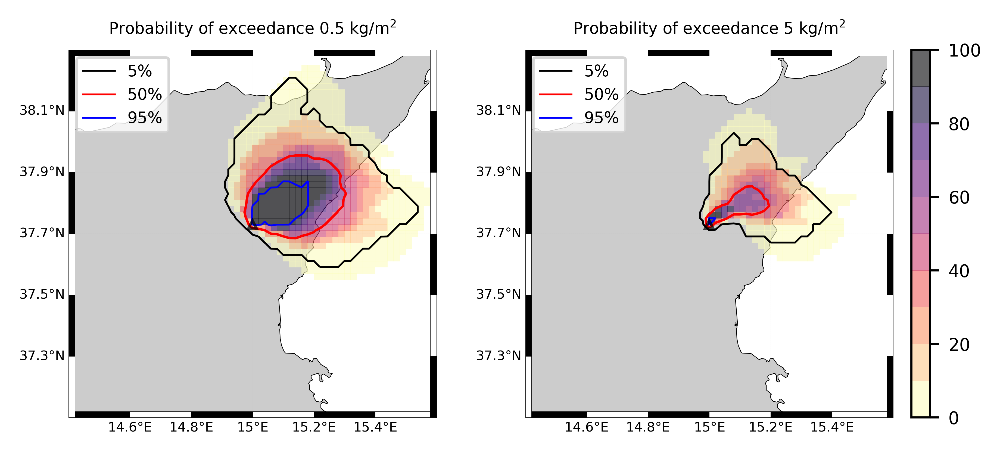
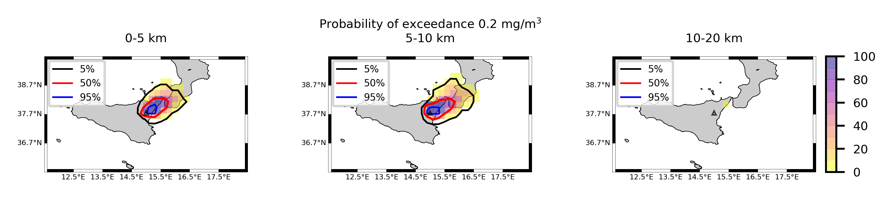
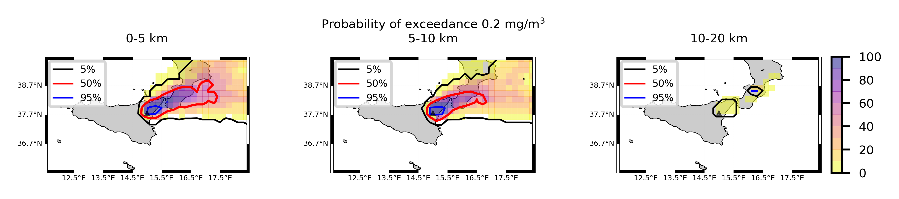

Forecast from VONA_20210304_0228Z
=================================

Contents
========

* [Forecast products](#forecast-products)
	* [Forecast at 2021-03-04 03:30 Z from RED VONA issued at 20210304_0228Z](#forecast-at-2021-03-04-0330-z-from-red-vona-issued-at-20210304_0228z)
	* [Forecast at 2021-03-04 04:30 Z from RED VONA issued at 20210304_0228Z](#forecast-at-2021-03-04-0430-z-from-red-vona-issued-at-20210304_0228z)
	* [Forecast at 2021-03-04 05:30 Z from RED VONA issued at 20210304_0228Z](#forecast-at-2021-03-04-0530-z-from-red-vona-issued-at-20210304_0228z)
	* [Forecast at 2021-03-04 08:30 Z from RED VONA issued at 20210304_0228Z](#forecast-at-2021-03-04-0830-z-from-red-vona-issued-at-20210304_0228z)
	* [Forecast at 2021-03-04 11:30 Z from RED VONA issued at 20210304_0228Z](#forecast-at-2021-03-04-1130-z-from-red-vona-issued-at-20210304_0228z)
	* [Forecast at 2021-03-04 14:30 Z from RED VONA issued at 20210304_0228Z](#forecast-at-2021-03-04-1430-z-from-red-vona-issued-at-20210304_0228z)
	* [Forecast at 2021-03-04 14:30 Z from RED VONA issued at 20210304_0228Z](#forecast-at-2021-03-04-1430-z-from-red-vona-issued-at-20210304_0228z)
	* [Forecast at 2021-03-04 08:50 Z from RED VONA issued at 20210304_0751Z](#forecast-at-2021-03-04-0850-z-from-red-vona-issued-at-20210304_0751z)
	* [Forecast at 2021-03-04 09:00 Z from RED VONA issued at 20210304_0755Z](#forecast-at-2021-03-04-0900-z-from-red-vona-issued-at-20210304_0755z)
	* [Forecast at 2021-03-04 10:00 Z from RED VONA issued at 20210304_0755Z](#forecast-at-2021-03-04-1000-z-from-red-vona-issued-at-20210304_0755z)
	* [Forecast at 2021-03-04 11:00 Z from RED VONA issued at 20210304_0755Z](#forecast-at-2021-03-04-1100-z-from-red-vona-issued-at-20210304_0755z)
	* [Forecast at 2021-03-04 14:00 Z from RED VONA issued at 20210304_0755Z](#forecast-at-2021-03-04-1400-z-from-red-vona-issued-at-20210304_0755z)
	* [Forecast at 2021-03-04 09:20 Z from RED VONA issued at 20210304_0817Z](#forecast-at-2021-03-04-0920-z-from-red-vona-issued-at-20210304_0817z)
	* [Forecast at 2021-03-04 10:20 Z from RED VONA issued at 20210304_0817Z](#forecast-at-2021-03-04-1020-z-from-red-vona-issued-at-20210304_0817z)
	* [Forecast at 2021-03-04 11:20 Z from RED VONA issued at 20210304_0817Z](#forecast-at-2021-03-04-1120-z-from-red-vona-issued-at-20210304_0817z)
	* [Forecast at 2021-03-04 14:20 Z from RED VONA issued at 20210304_0817Z](#forecast-at-2021-03-04-1420-z-from-red-vona-issued-at-20210304_0817z)
	* [Forecast at 2021-03-04 17:20 Z from RED VONA issued at 20210304_0817Z](#forecast-at-2021-03-04-1720-z-from-red-vona-issued-at-20210304_0817z)
	* [Forecast at 2021-03-04 20:20 Z from RED VONA issued at 20210304_0817Z](#forecast-at-2021-03-04-2020-z-from-red-vona-issued-at-20210304_0817z)
	* [Forecast at 2021-03-04 13:20 Z from ORANGE VONA issued at 20210304_1016Z](#forecast-at-2021-03-04-1320-z-from-orange-vona-issued-at-20210304_1016z)

# Forecast products

## Forecast at 2021-03-04 03:30 Z from RED VONA issued at 20210304_0228Z
  

|Eruption start [Z]|Eruption end [Z]|Forecast time [Z]|Column height asl [m]|
| :--- | :--- | :--- | :--- |
|2021-03-04 02:30:00|Ongoing|2021-03-04 03:30:00|5000 ± 500 - from VONA|
  
  

|Percentile|MER [kg/s¹]|Mass air [kg]|Mass air nested dom. [kg]|Mass grd [kg]|Mass grd nested dom. [kg]|
| :--- | :--- | :--- | :--- | :--- | :--- |
|5th|3.36e+02|2.00e+05|2.00e+05|1.07e+06|1.07e+06|
|50th|2.95e+03|1.97e+06|1.97e+06|7.84e+06|7.84e+06|
|95th|8.60e+03|6.80e+06|6.80e+06|2.20e+07|2.20e+07|
  

### Ground Nested Domain 2021-03-04 03:30 Z
  
  
  
  
  
  
  
  
  
  
  
  
  
  
  
  
  
  

|Location|Ground load [kg/m²] 5th perc|Ground load [kg/m²] 50th perc|Ground load [kg/m²] 95th perc|
| :--- | :--- | :--- | :--- |
|Piano Provenzana (1)|0.00e+00|1.30e-03|7.41e-02|
|Bivio Provenzana-Linguaglossa (2)|0.00e+00|1.81e-04|5.00e-02|
|Cunetta pre-Citelli (3)|0.00e+00|1.23e-03|7.36e-02|
|Chalet (4)|0.00e+00|0.00e+00|6.94e-03|
|Ragabo (5)|0.00e+00|0.00e+00|1.26e-02|
|Scilio (6)|0.00e+00|0.00e+00|4.90e-04|
|Gambino vini (7)|0.00e+00|0.00e+00|1.49e-03|
|StazioneFce Linguaglossa (8)|0.00e+00|0.00e+00|1.32e-04|
|Linguaglossa Via Olivio Sozzi (9)|0.00e+00|0.00e+00|5.34e-05|
|Cim.Linguaglossa (10)|0.00e+00|0.00e+00|2.34e-04|
|Gole Bar (11)|0.00e+00|0.00e+00|0.00e+00|
|Francavilla - Orange (12)|0.00e+00|0.00e+00|0.00e+00|
|Roccalumera1 (13)|0.00e+00|0.00e+00|0.00e+00|
|Roccalumera2 (14)|0.00e+00|0.00e+00|0.00e+00|
|Nizza (15)|0.00e+00|0.00e+00|0.00e+00|
|Scaletta Zanclea (16)|0.00e+00|0.00e+00|0.00e+00|
|Alì (17)|0.00e+00|0.00e+00|0.00e+00|
  

### Atmosphere 2021-03-04 03:30 Z
  

## Forecast at 2021-03-04 04:30 Z from RED VONA issued at 20210304_0228Z
  

|Eruption start [Z]|Eruption end [Z]|Forecast time [Z]|Column height asl [m]|
| :--- | :--- | :--- | :--- |
|2021-03-04 02:30:00|Ongoing|2021-03-04 04:30:00|5000 ± 500 - from VONA|
  
  

|Percentile|MER [kg/s¹]|Mass air [kg]|Mass air nested dom. [kg]|Mass grd [kg]|Mass grd nested dom. [kg]|
| :--- | :--- | :--- | :--- | :--- | :--- |
|5th|3.22e+02|3.25e+05|3.25e+05|3.40e+06|3.40e+06|
|50th|3.98e+03|3.06e+06|3.06e+06|2.16e+07|2.16e+07|
|95th|1.05e+04|1.02e+07|1.02e+07|4.79e+07|4.79e+07|
  

### Ground Nested Domain 2021-03-04 04:30 Z
  
  
  
  
  
  
  
  
  
  
  
  
  
  
  
  
  
  

|Location|Ground load [kg/m²] 5th perc|Ground load [kg/m²] 50th perc|Ground load [kg/m²] 95th perc|
| :--- | :--- | :--- | :--- |
|Piano Provenzana (1)|0.00e+00|4.14e-02|1.55e-01|
|Bivio Provenzana-Linguaglossa (2)|0.00e+00|1.55e-02|1.11e-01|
|Cunetta pre-Citelli (3)|0.00e+00|2.91e-02|1.58e-01|
|Chalet (4)|0.00e+00|6.11e-04|2.65e-02|
|Ragabo (5)|0.00e+00|3.23e-03|3.57e-02|
|Scilio (6)|0.00e+00|4.20e-06|1.05e-02|
|Gambino vini (7)|0.00e+00|8.96e-06|8.83e-03|
|StazioneFce Linguaglossa (8)|0.00e+00|0.00e+00|8.42e-03|
|Linguaglossa Via Olivio Sozzi (9)|0.00e+00|0.00e+00|7.24e-03|
|Cim.Linguaglossa (10)|0.00e+00|0.00e+00|8.45e-03|
|Gole Bar (11)|0.00e+00|0.00e+00|1.55e-03|
|Francavilla - Orange (12)|0.00e+00|0.00e+00|3.83e-04|
|Roccalumera1 (13)|0.00e+00|0.00e+00|0.00e+00|
|Roccalumera2 (14)|0.00e+00|0.00e+00|0.00e+00|
|Nizza (15)|0.00e+00|0.00e+00|0.00e+00|
|Scaletta Zanclea (16)|0.00e+00|0.00e+00|0.00e+00|
|Alì (17)|0.00e+00|0.00e+00|0.00e+00|
  

### Atmosphere 2021-03-04 04:30 Z
  

## Forecast at 2021-03-04 05:30 Z from RED VONA issued at 20210304_0228Z
  

|Eruption start [Z]|Eruption end [Z]|Forecast time [Z]|Column height asl [m]|
| :--- | :--- | :--- | :--- |
|2021-03-04 02:30:00|Ongoing|2021-03-04 05:30:00|5000 ± 500 - from VONA|
  
  

|Percentile|MER [kg/s¹]|Mass air [kg]|Mass air nested dom. [kg]|Mass grd [kg]|Mass grd nested dom. [kg]|
| :--- | :--- | :--- | :--- | :--- | :--- |
|5th|4.29e+02|1.06e+06|1.06e+06|1.53e+07|1.53e+07|
|50th|3.09e+03|4.18e+06|4.17e+06|3.30e+07|3.30e+07|
|95th|9.84e+03|9.58e+06|9.58e+06|5.85e+07|5.85e+07|
  

### Ground Nested Domain 2021-03-04 05:30 Z
  
  
  
  
  
  
  
  
  
  
  
  
  
  
  
  
  
  

|Location|Ground load [kg/m²] 5th perc|Ground load [kg/m²] 50th perc|Ground load [kg/m²] 95th perc|
| :--- | :--- | :--- | :--- |
|Piano Provenzana (1)|6.11e-03|9.54e-02|2.29e-01|
|Bivio Provenzana-Linguaglossa (2)|9.75e-04|5.35e-02|1.30e-01|
|Cunetta pre-Citelli (3)|1.84e-03|7.35e-02|1.83e-01|
|Chalet (4)|6.53e-06|6.32e-03|4.21e-02|
|Ragabo (5)|1.42e-04|1.60e-02|4.89e-02|
|Scilio (6)|0.00e+00|1.40e-04|1.61e-02|
|Gambino vini (7)|0.00e+00|1.04e-04|1.40e-02|
|StazioneFce Linguaglossa (8)|0.00e+00|5.36e-05|1.50e-02|
|Linguaglossa Via Olivio Sozzi (9)|0.00e+00|6.77e-05|1.68e-02|
|Cim.Linguaglossa (10)|0.00e+00|3.04e-05|1.21e-02|
|Gole Bar (11)|0.00e+00|0.00e+00|1.55e-03|
|Francavilla - Orange (12)|0.00e+00|0.00e+00|1.97e-03|
|Roccalumera1 (13)|0.00e+00|0.00e+00|0.00e+00|
|Roccalumera2 (14)|0.00e+00|0.00e+00|0.00e+00|
|Nizza (15)|0.00e+00|0.00e+00|0.00e+00|
|Scaletta Zanclea (16)|0.00e+00|0.00e+00|0.00e+00|
|Alì (17)|0.00e+00|0.00e+00|0.00e+00|
  

### Atmosphere 2021-03-04 05:30 Z
  

## Forecast at 2021-03-04 08:30 Z from RED VONA issued at 20210304_0228Z
  

|Eruption start [Z]|Eruption end [Z]|Forecast time [Z]|Column height asl [m]|
| :--- | :--- | :--- | :--- |
|2021-03-04 02:30:00|Ongoing|2021-03-04 08:30:00|5000 ± 500 - from VONA|
  
  

|Percentile|MER [kg/s¹]|Mass air [kg]|Mass air nested dom. [kg]|Mass grd [kg]|Mass grd nested dom. [kg]|
| :--- | :--- | :--- | :--- | :--- | :--- |
|5th|4.15e+02|5.13e+05|5.13e+05|3.15e+07|3.15e+07|
|50th|1.62e+03|3.63e+06|3.62e+06|5.54e+07|5.54e+07|
|95th|5.77e+03|9.45e+06|9.44e+06|1.01e+08|1.01e+08|
  

### Ground Nested Domain 2021-03-04 08:30 Z
  
  
  
  
  
  
  
  
  
  
  
  
  
  
  
  
  
  

|Location|Ground load [kg/m²] 5th perc|Ground load [kg/m²] 50th perc|Ground load [kg/m²] 95th perc|
| :--- | :--- | :--- | :--- |
|Piano Provenzana (1)|3.66e-02|1.28e-01|3.96e-01|
|Bivio Provenzana-Linguaglossa (2)|7.10e-03|8.12e-02|3.29e-01|
|Cunetta pre-Citelli (3)|9.76e-03|1.04e-01|4.09e-01|
|Chalet (4)|1.50e-04|1.65e-02|7.57e-02|
|Ragabo (5)|1.33e-03|2.54e-02|9.81e-02|
|Scilio (6)|0.00e+00|1.54e-03|2.88e-02|
|Gambino vini (7)|0.00e+00|1.71e-03|2.70e-02|
|StazioneFce Linguaglossa (8)|0.00e+00|8.25e-04|2.75e-02|
|Linguaglossa Via Olivio Sozzi (9)|0.00e+00|1.22e-03|3.01e-02|
|Cim.Linguaglossa (10)|0.00e+00|4.00e-04|2.70e-02|
|Gole Bar (11)|0.00e+00|4.07e-04|5.40e-03|
|Francavilla - Orange (12)|0.00e+00|7.45e-05|2.01e-03|
|Roccalumera1 (13)|0.00e+00|0.00e+00|6.34e-06|
|Roccalumera2 (14)|0.00e+00|0.00e+00|3.75e-06|
|Nizza (15)|0.00e+00|0.00e+00|1.77e-06|
|Scaletta Zanclea (16)|0.00e+00|0.00e+00|2.50e-06|
|Alì (17)|0.00e+00|0.00e+00|3.71e-07|
  

### Atmosphere 2021-03-04 08:30 Z
  

## Forecast at 2021-03-04 11:30 Z from RED VONA issued at 20210304_0228Z
  

|Eruption start [Z]|Eruption end [Z]|Forecast time [Z]|Column height asl [m]|
| :--- | :--- | :--- | :--- |
|2021-03-04 02:30:00|Ongoing|2021-03-04 11:30:00|5000 ± 500 - from VONA|
  
  

|Percentile|MER [kg/s¹]|Mass air [kg]|Mass air nested dom. [kg]|Mass grd [kg]|Mass grd nested dom. [kg]|
| :--- | :--- | :--- | :--- | :--- | :--- |
|5th|1.42e+02|1.87e+06|1.87e+06|4.46e+07|4.46e+07|
|50th|3.13e+03|4.91e+06|4.90e+06|8.11e+07|8.12e+07|
|95th|1.13e+04|2.30e+07|2.26e+07|1.79e+08|1.79e+08|
  

### Ground Nested Domain 2021-03-04 11:30 Z
  
  
  
  
  
  
  
  
  
  
  
  
  
  
  
  
  
  

|Location|Ground load [kg/m²] 5th perc|Ground load [kg/m²] 50th perc|Ground load [kg/m²] 95th perc|
| :--- | :--- | :--- | :--- |
|Piano Provenzana (1)|3.67e-02|1.42e-01|6.22e-01|
|Bivio Provenzana-Linguaglossa (2)|7.30e-03|1.16e-01|4.89e-01|
|Cunetta pre-Citelli (3)|9.77e-03|1.45e-01|5.64e-01|
|Chalet (4)|2.53e-04|3.28e-02|2.43e-01|
|Ragabo (5)|1.55e-03|5.14e-02|2.68e-01|
|Scilio (6)|1.00e-06|1.93e-03|4.67e-02|
|Gambino vini (7)|0.00e+00|3.30e-03|3.82e-02|
|StazioneFce Linguaglossa (8)|5.89e-06|2.21e-03|4.65e-02|
|Linguaglossa Via Olivio Sozzi (9)|1.57e-05|3.01e-03|6.36e-02|
|Cim.Linguaglossa (10)|0.00e+00|8.36e-04|2.91e-02|
|Gole Bar (11)|0.00e+00|5.36e-04|1.14e-02|
|Francavilla - Orange (12)|0.00e+00|6.93e-04|2.07e-02|
|Roccalumera1 (13)|0.00e+00|0.00e+00|2.56e-05|
|Roccalumera2 (14)|0.00e+00|0.00e+00|2.84e-05|
|Nizza (15)|0.00e+00|0.00e+00|3.89e-05|
|Scaletta Zanclea (16)|0.00e+00|0.00e+00|2.43e-05|
|Alì (17)|0.00e+00|0.00e+00|2.65e-05|
  

### Atmosphere 2021-03-04 11:30 Z
  

## Forecast at 2021-03-04 14:30 Z from RED VONA issued at 20210304_0228Z
  

|Eruption start [Z]|Eruption end [Z]|Forecast time [Z]|Column height asl [m]|
| :--- | :--- | :--- | :--- |
|2021-03-04 02:30:00|Ongoing|2021-03-04 14:30:00|5000 ± 500 - from VONA|
  
  

|Percentile|MER [kg/s¹]|Mass air [kg]|Mass air nested dom. [kg]|Mass grd [kg]|Mass grd nested dom. [kg]|
| :--- | :--- | :--- | :--- | :--- | :--- |
|5th|3.70e+02|4.09e+06|4.08e+06|8.16e+07|8.16e+07|
|50th|5.95e+03|1.29e+07|1.29e+07|1.76e+08|1.76e+08|
|95th|2.39e+04|3.83e+07|3.80e+07|2.72e+08|2.72e+08|
  

### Ground Nested Domain 2021-03-04 14:30 Z
  
  
  
  
  
  
  
  
  
  
  
  
  
  
  
  
  
  

|Location|Ground load [kg/m²] 5th perc|Ground load [kg/m²] 50th perc|Ground load [kg/m²] 95th perc|
| :--- | :--- | :--- | :--- |
|Piano Provenzana (1)|9.09e-02|4.18e-01|1.03e+00|
|Bivio Provenzana-Linguaglossa (2)|3.46e-02|2.51e-01|9.85e-01|
|Cunetta pre-Citelli (3)|4.30e-02|2.90e-01|1.25e+00|
|Chalet (4)|3.72e-03|7.30e-02|6.45e-01|
|Ragabo (5)|1.01e-02|1.23e-01|6.90e-01|
|Scilio (6)|6.11e-04|2.08e-02|1.29e-01|
|Gambino vini (7)|3.86e-04|2.03e-02|1.35e-01|
|StazioneFce Linguaglossa (8)|2.06e-04|1.84e-02|8.18e-02|
|Linguaglossa Via Olivio Sozzi (9)|2.73e-04|2.31e-02|1.03e-01|
|Cim.Linguaglossa (10)|2.00e-04|1.34e-02|8.17e-02|
|Gole Bar (11)|0.00e+00|3.52e-03|2.09e-02|
|Francavilla - Orange (12)|0.00e+00|2.96e-03|5.62e-02|
|Roccalumera1 (13)|0.00e+00|0.00e+00|6.38e-05|
|Roccalumera2 (14)|0.00e+00|0.00e+00|3.71e-05|
|Nizza (15)|0.00e+00|0.00e+00|4.95e-05|
|Scaletta Zanclea (16)|0.00e+00|0.00e+00|6.96e-05|
|Alì (17)|0.00e+00|0.00e+00|4.29e-05|
  

### Atmosphere 2021-03-04 14:30 Z
  

## Forecast at 2021-03-04 14:30 Z from RED VONA issued at 20210304_0228Z
  

|Eruption start [Z]|Eruption end [Z]|Forecast time [Z]|Column height asl [m]|
| :--- | :--- | :--- | :--- |
|2021-03-04 02:30:00|Ongoing|2021-03-04 14:30:00|5000 ± 500 - from VONA|
  
  

|Percentile|MER [kg/s¹]|Mass air [kg]|Mass air nested dom. [kg]|Mass grd [kg]|Mass grd nested dom. [kg]|
| :--- | :--- | :--- | :--- | :--- | :--- |
|5th|3.70e+02|4.09e+06|4.08e+06|8.16e+07|8.16e+07|
|50th|5.95e+03|1.29e+07|1.29e+07|1.76e+08|1.76e+08|
|95th|2.39e+04|3.83e+07|3.80e+07|2.72e+08|2.72e+08|
  

### Ground Nested Domain 2021-03-04 14:30 Z
  
  
  
  
  
  
  
  
  
  
  
  
  
  
  
  
  
  

|Location|Ground load [kg/m²] 5th perc|Ground load [kg/m²] 50th perc|Ground load [kg/m²] 95th perc|
| :--- | :--- | :--- | :--- |
|Piano Provenzana (1)|9.09e-02|4.18e-01|1.03e+00|
|Bivio Provenzana-Linguaglossa (2)|3.46e-02|2.51e-01|9.85e-01|
|Cunetta pre-Citelli (3)|4.30e-02|2.90e-01|1.25e+00|
|Chalet (4)|3.72e-03|7.30e-02|6.45e-01|
|Ragabo (5)|1.01e-02|1.23e-01|6.90e-01|
|Scilio (6)|6.11e-04|2.08e-02|1.29e-01|
|Gambino vini (7)|3.86e-04|2.03e-02|1.35e-01|
|StazioneFce Linguaglossa (8)|2.06e-04|1.84e-02|8.18e-02|
|Linguaglossa Via Olivio Sozzi (9)|2.73e-04|2.31e-02|1.03e-01|
|Cim.Linguaglossa (10)|2.00e-04|1.34e-02|8.17e-02|
|Gole Bar (11)|0.00e+00|3.52e-03|2.09e-02|
|Francavilla - Orange (12)|0.00e+00|2.96e-03|5.62e-02|
|Roccalumera1 (13)|0.00e+00|0.00e+00|6.38e-05|
|Roccalumera2 (14)|0.00e+00|0.00e+00|3.71e-05|
|Nizza (15)|0.00e+00|0.00e+00|4.95e-05|
|Scaletta Zanclea (16)|0.00e+00|0.00e+00|6.96e-05|
|Alì (17)|0.00e+00|0.00e+00|4.29e-05|
  

### Atmosphere 2021-03-04 14:30 Z
  

## Forecast at 2021-03-04 08:50 Z from RED VONA issued at 20210304_0751Z
  

|Eruption start [Z]|Eruption end [Z]|Forecast time [Z]|Column height asl [m]|
| :--- | :--- | :--- | :--- |
|2021-03-04 02:30:00|Ongoing|2021-03-04 08:50:00|6000 ± 500 - from VONA|
  
  

|Percentile|MER [kg/s¹]|Mass air [kg]|Mass air nested dom. [kg]|Mass grd [kg]|Mass grd nested dom. [kg]|
| :--- | :--- | :--- | :--- | :--- | :--- |
|5th|2.11e+03|2.53e+06|2.53e+06|3.66e+07|3.67e+07|
|50th|6.39e+03|6.31e+06|6.31e+06|7.17e+07|7.17e+07|
|95th|1.50e+04|1.72e+07|1.72e+07|1.27e+08|1.27e+08|
  

### Ground Nested Domain 2021-03-04 08:50 Z
  
  
  
  
  
  
  
  
  
  
  
  
  
  
  
  
  
  

|Location|Ground load [kg/m²] 5th perc|Ground load [kg/m²] 50th perc|Ground load [kg/m²] 95th perc|
| :--- | :--- | :--- | :--- |
|Piano Provenzana (1)|5.22e-02|1.60e-01|4.48e-01|
|Bivio Provenzana-Linguaglossa (2)|1.37e-02|8.07e-02|3.65e-01|
|Cunetta pre-Citelli (3)|1.42e-02|1.04e-01|4.21e-01|
|Chalet (4)|4.56e-04|1.76e-02|8.25e-02|
|Ragabo (5)|3.96e-03|2.54e-02|1.33e-01|
|Scilio (6)|0.00e+00|1.73e-03|2.82e-02|
|Gambino vini (7)|0.00e+00|2.83e-03|2.59e-02|
|StazioneFce Linguaglossa (8)|0.00e+00|1.02e-03|2.80e-02|
|Linguaglossa Via Olivio Sozzi (9)|0.00e+00|1.51e-03|2.97e-02|
|Cim.Linguaglossa (10)|0.00e+00|4.20e-04|2.71e-02|
|Gole Bar (11)|0.00e+00|4.17e-04|4.94e-03|
|Francavilla - Orange (12)|0.00e+00|9.53e-05|2.01e-03|
|Roccalumera1 (13)|0.00e+00|0.00e+00|6.62e-07|
|Roccalumera2 (14)|0.00e+00|0.00e+00|3.42e-06|
|Nizza (15)|0.00e+00|0.00e+00|1.77e-06|
|Scaletta Zanclea (16)|0.00e+00|0.00e+00|1.10e-06|
|Alì (17)|0.00e+00|0.00e+00|1.68e-06|
  

### Atmosphere 2021-03-04 08:50 Z
  

## Forecast at 2021-03-04 09:00 Z from RED VONA issued at 20210304_0755Z
  

|Eruption start [Z]|Eruption end [Z]|Forecast time [Z]|Column height asl [m]|
| :--- | :--- | :--- | :--- |
|2021-03-04 02:30:00|Ongoing|2021-03-04 09:00:00|6500 ± 500 - from VONA|
  
  

|Percentile|MER [kg/s¹]|Mass air [kg]|Mass air nested dom. [kg]|Mass grd [kg]|Mass grd nested dom. [kg]|
| :--- | :--- | :--- | :--- | :--- | :--- |
|5th|3.23e+03|4.67e+06|4.67e+06|5.03e+07|5.03e+07|
|50th|1.01e+04|1.18e+07|1.18e+07|8.17e+07|8.17e+07|
|95th|3.34e+04|4.25e+07|4.25e+07|1.53e+08|1.53e+08|
  

### Ground Nested Domain 2021-03-04 09:00 Z
  
  
  
  
  
  
  
  
  
  
  
  
  
  
  
  
  
  

|Location|Ground load [kg/m²] 5th perc|Ground load [kg/m²] 50th perc|Ground load [kg/m²] 95th perc|
| :--- | :--- | :--- | :--- |
|Piano Provenzana (1)|5.06e-02|1.62e-01|4.56e-01|
|Bivio Provenzana-Linguaglossa (2)|1.89e-02|1.13e-01|3.21e-01|
|Cunetta pre-Citelli (3)|2.64e-02|1.80e-01|4.80e-01|
|Chalet (4)|1.42e-03|2.42e-02|7.70e-02|
|Ragabo (5)|8.01e-03|3.78e-02|9.18e-02|
|Scilio (6)|3.87e-06|1.80e-03|2.83e-02|
|Gambino vini (7)|8.96e-06|2.86e-03|3.26e-02|
|StazioneFce Linguaglossa (8)|0.00e+00|1.39e-03|2.79e-02|
|Linguaglossa Via Olivio Sozzi (9)|0.00e+00|1.70e-03|3.00e-02|
|Cim.Linguaglossa (10)|0.00e+00|5.01e-04|2.70e-02|
|Gole Bar (11)|0.00e+00|4.08e-04|4.76e-03|
|Francavilla - Orange (12)|0.00e+00|1.14e-04|2.07e-03|
|Roccalumera1 (13)|0.00e+00|0.00e+00|3.27e-06|
|Roccalumera2 (14)|0.00e+00|0.00e+00|2.70e-06|
|Nizza (15)|0.00e+00|0.00e+00|3.80e-06|
|Scaletta Zanclea (16)|0.00e+00|0.00e+00|1.10e-06|
|Alì (17)|0.00e+00|0.00e+00|3.03e-06|
  

### Atmosphere 2021-03-04 09:00 Z
  

## Forecast at 2021-03-04 10:00 Z from RED VONA issued at 20210304_0755Z
  

|Eruption start [Z]|Eruption end [Z]|Forecast time [Z]|Column height asl [m]|
| :--- | :--- | :--- | :--- |
|2021-03-04 02:30:00|Ongoing|2021-03-04 10:00:00|6500 ± 500 - from VONA|
  
  

|Percentile|MER [kg/s¹]|Mass air [kg]|Mass air nested dom. [kg]|Mass grd [kg]|Mass grd nested dom. [kg]|
| :--- | :--- | :--- | :--- | :--- | :--- |
|5th|5.02e+03|3.99e+06|3.99e+06|7.97e+07|7.97e+07|
|50th|1.39e+04|1.00e+07|9.99e+06|1.23e+08|1.23e+08|
|95th|3.01e+04|2.84e+07|2.83e+07|2.03e+08|2.03e+08|
  

### Ground Nested Domain 2021-03-04 10:00 Z
  
  
  
  
  
  
  
  
  
  
  
  
  
  
  
  
  
  

|Location|Ground load [kg/m²] 5th perc|Ground load [kg/m²] 50th perc|Ground load [kg/m²] 95th perc|
| :--- | :--- | :--- | :--- |
|Piano Provenzana (1)|9.57e-02|1.94e-01|5.83e-01|
|Bivio Provenzana-Linguaglossa (2)|2.39e-02|1.36e-01|3.74e-01|
|Cunetta pre-Citelli (3)|3.70e-02|2.05e-01|6.88e-01|
|Chalet (4)|3.26e-03|2.77e-02|1.46e-01|
|Ragabo (5)|1.12e-02|4.21e-02|1.69e-01|
|Scilio (6)|3.87e-06|1.80e-03|2.97e-02|
|Gambino vini (7)|8.96e-06|2.86e-03|3.49e-02|
|StazioneFce Linguaglossa (8)|0.00e+00|2.58e-03|2.82e-02|
|Linguaglossa Via Olivio Sozzi (9)|0.00e+00|2.17e-03|3.03e-02|
|Cim.Linguaglossa (10)|0.00e+00|5.01e-04|2.73e-02|
|Gole Bar (11)|0.00e+00|4.08e-04|4.76e-03|
|Francavilla - Orange (12)|0.00e+00|1.14e-04|2.07e-03|
|Roccalumera1 (13)|0.00e+00|0.00e+00|3.27e-06|
|Roccalumera2 (14)|0.00e+00|0.00e+00|2.70e-06|
|Nizza (15)|0.00e+00|0.00e+00|3.80e-06|
|Scaletta Zanclea (16)|0.00e+00|0.00e+00|1.10e-06|
|Alì (17)|0.00e+00|0.00e+00|3.03e-06|
  

### Atmosphere 2021-03-04 10:00 Z
  

## Forecast at 2021-03-04 11:00 Z from RED VONA issued at 20210304_0755Z
  

|Eruption start [Z]|Eruption end [Z]|Forecast time [Z]|Column height asl [m]|
| :--- | :--- | :--- | :--- |
|2021-03-04 02:30:00|Ongoing|2021-03-04 11:00:00|6500 ± 500 - from VONA|
  
  

|Percentile|MER [kg/s¹]|Mass air [kg]|Mass air nested dom. [kg]|Mass grd [kg]|Mass grd nested dom. [kg]|
| :--- | :--- | :--- | :--- | :--- | :--- |
|5th|3.89e+03|3.16e+06|3.16e+06|1.13e+08|1.13e+08|
|50th|1.35e+04|1.06e+07|1.06e+07|1.60e+08|1.60e+08|
|95th|3.86e+04|4.84e+07|4.83e+07|2.65e+08|2.65e+08|
  

### Ground Nested Domain 2021-03-04 11:00 Z
  
  
  
  
  
  
  
  
  
  
  
  
  
  
  
  
  
  

|Location|Ground load [kg/m²] 5th perc|Ground load [kg/m²] 50th perc|Ground load [kg/m²] 95th perc|
| :--- | :--- | :--- | :--- |
|Piano Provenzana (1)|1.01e-01|2.50e-01|1.40e+00|
|Bivio Provenzana-Linguaglossa (2)|2.43e-02|2.17e-01|8.51e-01|
|Cunetta pre-Citelli (3)|3.74e-02|2.87e-01|1.09e+00|
|Chalet (4)|3.33e-03|5.56e-02|2.78e-01|
|Ragabo (5)|1.24e-02|7.05e-02|4.65e-01|
|Scilio (6)|3.29e-05|2.44e-03|8.15e-02|
|Gambino vini (7)|3.87e-05|3.55e-03|1.21e-01|
|StazioneFce Linguaglossa (8)|0.00e+00|4.18e-03|5.31e-02|
|Linguaglossa Via Olivio Sozzi (9)|0.00e+00|2.35e-03|5.20e-02|
|Cim.Linguaglossa (10)|0.00e+00|9.98e-04|5.66e-02|
|Gole Bar (11)|0.00e+00|4.08e-04|4.99e-03|
|Francavilla - Orange (12)|0.00e+00|1.14e-04|2.07e-03|
|Roccalumera1 (13)|0.00e+00|0.00e+00|3.27e-06|
|Roccalumera2 (14)|0.00e+00|0.00e+00|2.70e-06|
|Nizza (15)|0.00e+00|0.00e+00|3.80e-06|
|Scaletta Zanclea (16)|0.00e+00|0.00e+00|1.10e-06|
|Alì (17)|0.00e+00|0.00e+00|3.03e-06|
  

### Atmosphere 2021-03-04 11:00 Z
  

## Forecast at 2021-03-04 14:00 Z from RED VONA issued at 20210304_0755Z
  

|Eruption start [Z]|Eruption end [Z]|Forecast time [Z]|Column height asl [m]|
| :--- | :--- | :--- | :--- |
|2021-03-04 02:30:00|Ongoing|2021-03-04 14:00:00|6500 ± 500 - from VONA|
  
  

|Percentile|MER [kg/s¹]|Mass air [kg]|Mass air nested dom. [kg]|Mass grd [kg]|Mass grd nested dom. [kg]|
| :--- | :--- | :--- | :--- | :--- | :--- |
|5th|4.17e+03|3.17e+06|3.17e+06|2.36e+08|2.36e+08|
|50th|2.12e+04|2.73e+07|2.73e+07|3.40e+08|3.40e+08|
|95th|5.42e+04|8.29e+07|8.12e+07|6.49e+08|6.49e+08|
  

### Ground Nested Domain 2021-03-04 14:00 Z
  
  
  
  
  
  
  
  
  
  
  
  
  
  
  
  
  
  

|Location|Ground load [kg/m²] 5th perc|Ground load [kg/m²] 50th perc|Ground load [kg/m²] 95th perc|
| :--- | :--- | :--- | :--- |
|Piano Provenzana (1)|2.22e-01|1.24e+00|2.22e+00|
|Bivio Provenzana-Linguaglossa (2)|1.26e-01|9.78e-01|2.11e+00|
|Cunetta pre-Citelli (3)|1.63e-01|1.52e+00|5.04e+00|
|Chalet (4)|3.79e-02|3.15e-01|7.49e-01|
|Ragabo (5)|6.15e-02|4.42e-01|9.17e-01|
|Scilio (6)|6.57e-04|5.41e-02|4.57e-01|
|Gambino vini (7)|7.98e-04|5.35e-02|6.77e-01|
|StazioneFce Linguaglossa (8)|5.39e-04|4.45e-02|2.51e-01|
|Linguaglossa Via Olivio Sozzi (9)|8.51e-04|3.56e-02|1.91e-01|
|Cim.Linguaglossa (10)|9.95e-05|5.22e-02|3.63e-01|
|Gole Bar (11)|9.92e-06|7.14e-03|8.13e-02|
|Francavilla - Orange (12)|2.35e-04|2.70e-03|2.47e-02|
|Roccalumera1 (13)|0.00e+00|0.00e+00|1.15e-02|
|Roccalumera2 (14)|0.00e+00|0.00e+00|1.15e-02|
|Nizza (15)|0.00e+00|0.00e+00|7.80e-03|
|Scaletta Zanclea (16)|0.00e+00|0.00e+00|3.10e-03|
|Alì (17)|0.00e+00|0.00e+00|3.50e-03|
  

### Atmosphere 2021-03-04 14:00 Z
  

## Forecast at 2021-03-04 09:20 Z from RED VONA issued at 20210304_0817Z
  

|Eruption start [Z]|Eruption end [Z]|Forecast time [Z]|Column height asl [m]|
| :--- | :--- | :--- | :--- |
|2021-03-04 02:30:00|Ongoing|2021-03-04 09:20:00|11000 ± 500 - from VONA|
  
  

|Percentile|MER [kg/s¹]|Mass air [kg]|Mass air nested dom. [kg]|Mass grd [kg]|Mass grd nested dom. [kg]|
| :--- | :--- | :--- | :--- | :--- | :--- |
|5th|4.90e+05|6.84e+08|6.82e+08|1.04e+09|1.04e+09|
|50th|7.43e+05|1.02e+09|1.02e+09|1.54e+09|1.54e+09|
|95th|1.64e+06|1.97e+09|1.96e+09|2.93e+09|2.92e+09|
  

### Ground Nested Domain 2021-03-04 09:20 Z
  
  
  
  
  
  
  
  
  
  
  
  
  
  
  
  
  
  

|Location|Ground load [kg/m²] 5th perc|Ground load [kg/m²] 50th perc|Ground load [kg/m²] 95th perc|
| :--- | :--- | :--- | :--- |
|Piano Provenzana (1)|1.58e+00|4.78e+00|7.74e+00|
|Bivio Provenzana-Linguaglossa (2)|2.20e+00|6.14e+00|9.63e+00|
|Cunetta pre-Citelli (3)|3.66e+00|6.29e+00|1.12e+01|
|Chalet (4)|1.49e+00|5.65e+00|8.80e+00|
|Ragabo (5)|1.83e+00|5.41e+00|9.13e+00|
|Scilio (6)|4.14e-01|2.28e+00|6.54e+00|
|Gambino vini (7)|4.83e-01|3.14e+00|9.00e+00|
|StazioneFce Linguaglossa (8)|3.23e-01|1.50e+00|5.61e+00|
|Linguaglossa Via Olivio Sozzi (9)|3.07e-01|1.39e+00|5.27e+00|
|Cim.Linguaglossa (10)|2.52e-01|1.73e+00|5.39e+00|
|Gole Bar (11)|4.61e-02|2.69e-01|1.56e+00|
|Francavilla - Orange (12)|2.58e-02|1.82e-01|1.01e+00|
|Roccalumera1 (13)|0.00e+00|0.00e+00|7.16e-05|
|Roccalumera2 (14)|0.00e+00|0.00e+00|2.69e-05|
|Nizza (15)|0.00e+00|0.00e+00|3.80e-06|
|Scaletta Zanclea (16)|0.00e+00|0.00e+00|1.10e-06|
|Alì (17)|0.00e+00|0.00e+00|1.68e-06|
  

### Atmosphere 2021-03-04 09:20 Z
  

## Forecast at 2021-03-04 10:20 Z from RED VONA issued at 20210304_0817Z
  

|Eruption start [Z]|Eruption end [Z]|Forecast time [Z]|Column height asl [m]|
| :--- | :--- | :--- | :--- |
|2021-03-04 02:30:00|Ongoing|2021-03-04 10:20:00|11000 ± 500 - from VONA|
  
  

|Percentile|MER [kg/s¹]|Mass air [kg]|Mass air nested dom. [kg]|Mass grd [kg]|Mass grd nested dom. [kg]|
| :--- | :--- | :--- | :--- | :--- | :--- |
|5th|3.00e+05|5.68e+08|5.67e+08|2.65e+09|2.65e+09|
|50th|9.52e+05|1.65e+09|1.65e+09|3.92e+09|3.92e+09|
|95th|1.93e+06|4.28e+09|3.65e+09|7.08e+09|7.06e+09|
  

### Ground Nested Domain 2021-03-04 10:20 Z
  
  
  
  
  
  
  
  
  
  
  
  
  
  
  
  
  
  

|Location|Ground load [kg/m²] 5th perc|Ground load [kg/m²] 50th perc|Ground load [kg/m²] 95th perc|
| :--- | :--- | :--- | :--- |
|Piano Provenzana (1)|6.27e+00|1.16e+01|1.70e+01|
|Bivio Provenzana-Linguaglossa (2)|6.97e+00|1.42e+01|1.98e+01|
|Cunetta pre-Citelli (3)|9.54e+00|1.45e+01|1.96e+01|
|Chalet (4)|4.53e+00|1.33e+01|1.90e+01|
|Ragabo (5)|5.20e+00|1.29e+01|1.93e+01|
|Scilio (6)|2.57e+00|8.53e+00|1.69e+01|
|Gambino vini (7)|3.83e+00|1.09e+01|1.83e+01|
|StazioneFce Linguaglossa (8)|1.62e+00|5.87e+00|1.55e+01|
|Linguaglossa Via Olivio Sozzi (9)|1.75e+00|5.40e+00|1.53e+01|
|Cim.Linguaglossa (10)|2.15e+00|6.65e+00|1.56e+01|
|Gole Bar (11)|4.76e-01|1.79e+00|6.88e+00|
|Francavilla - Orange (12)|2.48e-01|1.14e+00|5.98e+00|
|Roccalumera1 (13)|1.44e-04|9.61e-03|3.96e-01|
|Roccalumera2 (14)|2.61e-05|5.69e-03|3.76e-01|
|Nizza (15)|0.00e+00|2.04e-03|2.94e-01|
|Scaletta Zanclea (16)|0.00e+00|0.00e+00|1.55e-02|
|Alì (17)|0.00e+00|1.32e-04|1.01e-01|
  

### Atmosphere 2021-03-04 10:20 Z
  

## Forecast at 2021-03-04 11:20 Z from RED VONA issued at 20210304_0817Z
  

|Eruption start [Z]|Eruption end [Z]|Forecast time [Z]|Column height asl [m]|
| :--- | :--- | :--- | :--- |
|2021-03-04 02:30:00|Ongoing|2021-03-04 11:20:00|11000 ± 500 - from VONA|
  
  

|Percentile|MER [kg/s¹]|Mass air [kg]|Mass air nested dom. [kg]|Mass grd [kg]|Mass grd nested dom. [kg]|
| :--- | :--- | :--- | :--- | :--- | :--- |
|5th|2.89e+05|1.12e+09|1.11e+09|4.34e+09|4.34e+09|
|50th|8.28e+05|2.59e+09|2.24e+09|7.78e+09|7.73e+09|
|95th|1.89e+06|4.19e+09|3.88e+09|1.14e+10|1.13e+10|
  

### Ground Nested Domain 2021-03-04 11:20 Z
  
  
  
  
  
  
  
  
  
  
  
  
  
  
  
  
  
  

|Location|Ground load [kg/m²] 5th perc|Ground load [kg/m²] 50th perc|Ground load [kg/m²] 95th perc|
| :--- | :--- | :--- | :--- |
|Piano Provenzana (1)|1.09e+01|1.80e+01|2.60e+01|
|Bivio Provenzana-Linguaglossa (2)|1.22e+01|2.20e+01|3.03e+01|
|Cunetta pre-Citelli (3)|1.62e+01|2.25e+01|3.17e+01|
|Chalet (4)|9.38e+00|2.18e+01|2.92e+01|
|Ragabo (5)|9.84e+00|2.15e+01|2.95e+01|
|Scilio (6)|6.18e+00|1.53e+01|2.75e+01|
|Gambino vini (7)|7.92e+00|1.91e+01|2.94e+01|
|StazioneFce Linguaglossa (8)|4.13e+00|1.16e+01|2.34e+01|
|Linguaglossa Via Olivio Sozzi (9)|3.82e+00|1.05e+01|2.21e+01|
|Cim.Linguaglossa (10)|5.04e+00|1.29e+01|2.57e+01|
|Gole Bar (11)|1.41e+00|3.98e+00|1.14e+01|
|Francavilla - Orange (12)|6.28e-01|2.34e+00|1.04e+01|
|Roccalumera1 (13)|1.94e-02|1.38e-01|7.45e-01|
|Roccalumera2 (14)|1.40e-02|1.21e-01|7.24e-01|
|Nizza (15)|1.64e-02|1.14e-01|6.06e-01|
|Scaletta Zanclea (16)|4.19e-06|7.52e-03|1.47e-01|
|Alì (17)|4.76e-03|4.94e-02|3.67e-01|
  

### Atmosphere 2021-03-04 11:20 Z
  

## Forecast at 2021-03-04 14:20 Z from RED VONA issued at 20210304_0817Z
  

|Eruption start [Z]|Eruption end [Z]|Forecast time [Z]|Column height asl [m]|
| :--- | :--- | :--- | :--- |
|2021-03-04 02:30:00|Ongoing|2021-03-04 14:20:00|11000 ± 500 - from VONA|
  
  

|Percentile|MER [kg/s¹]|Mass air [kg]|Mass air nested dom. [kg]|Mass grd [kg]|Mass grd nested dom. [kg]|
| :--- | :--- | :--- | :--- | :--- | :--- |
|5th|3.05e+05|1.00e+09|1.20e+09|7.90e+09|7.84e+09|
|50th|1.09e+06|3.19e+09|2.18e+09|1.97e+10|1.86e+10|
|95th|2.54e+06|1.00e+10|5.60e+09|3.02e+10|2.89e+10|
  

### Ground Nested Domain 2021-03-04 14:20 Z
  
  
  
  
  
  
  
  
  
  
  
  
  
  
  
  
  
  

|Location|Ground load [kg/m²] 5th perc|Ground load [kg/m²] 50th perc|Ground load [kg/m²] 95th perc|
| :--- | :--- | :--- | :--- |
|Piano Provenzana (1)|1.73e+01|3.48e+01|5.69e+01|
|Bivio Provenzana-Linguaglossa (2)|2.31e+01|4.05e+01|6.60e+01|
|Cunetta pre-Citelli (3)|2.45e+01|4.61e+01|7.09e+01|
|Chalet (4)|1.75e+01|3.76e+01|6.25e+01|
|Ragabo (5)|1.81e+01|3.70e+01|6.12e+01|
|Scilio (6)|1.47e+01|2.98e+01|6.10e+01|
|Gambino vini (7)|1.75e+01|3.44e+01|6.57e+01|
|StazioneFce Linguaglossa (8)|1.02e+01|2.51e+01|5.27e+01|
|Linguaglossa Via Olivio Sozzi (9)|8.97e+00|2.41e+01|4.95e+01|
|Cim.Linguaglossa (10)|1.28e+01|2.57e+01|5.86e+01|
|Gole Bar (11)|4.11e+00|1.37e+01|3.23e+01|
|Francavilla - Orange (12)|1.61e+00|9.56e+00|2.62e+01|
|Roccalumera1 (13)|4.19e-01|1.27e+00|4.90e+00|
|Roccalumera2 (14)|3.69e-01|1.16e+00|5.61e+00|
|Nizza (15)|3.31e-01|1.21e+00|5.11e+00|
|Scaletta Zanclea (16)|4.69e-02|5.79e-01|2.62e+00|
|Alì (17)|1.44e-01|9.87e-01|4.05e+00|
  

### Atmosphere 2021-03-04 14:20 Z
  

## Forecast at 2021-03-04 17:20 Z from RED VONA issued at 20210304_0817Z
  

|Eruption start [Z]|Eruption end [Z]|Forecast time [Z]|Column height asl [m]|
| :--- | :--- | :--- | :--- |
|2021-03-04 02:30:00|Ongoing|2021-03-04 17:20:00|11000 ± 500 - from VONA|
  
  

|Percentile|MER [kg/s¹]|Mass air [kg]|Mass air nested dom. [kg]|Mass grd [kg]|Mass grd nested dom. [kg]|
| :--- | :--- | :--- | :--- | :--- | :--- |
|5th|1.60e+05|1.36e+09|6.57e+08|1.84e+10|1.79e+10|
|50th|1.15e+06|4.61e+09|2.65e+09|3.03e+10|2.98e+10|
|95th|3.45e+06|1.15e+10|5.90e+09|5.06e+10|4.79e+10|
  

### Ground Nested Domain 2021-03-04 17:20 Z
  
  
  
  
  
  
  
  
  
  
  
  
  
  
  
  
  
  

|Location|Ground load [kg/m²] 5th perc|Ground load [kg/m²] 50th perc|Ground load [kg/m²] 95th perc|
| :--- | :--- | :--- | :--- |
|Piano Provenzana (1)|3.30e+01|5.28e+01|7.87e+01|
|Bivio Provenzana-Linguaglossa (2)|3.97e+01|5.92e+01|9.02e+01|
|Cunetta pre-Citelli (3)|4.73e+01|7.08e+01|1.16e+02|
|Chalet (4)|3.49e+01|4.99e+01|8.09e+01|
|Ragabo (5)|3.47e+01|5.10e+01|8.02e+01|
|Scilio (6)|3.04e+01|5.04e+01|7.92e+01|
|Gambino vini (7)|3.37e+01|5.47e+01|8.29e+01|
|StazioneFce Linguaglossa (8)|2.47e+01|4.34e+01|6.94e+01|
|Linguaglossa Via Olivio Sozzi (9)|2.24e+01|4.25e+01|6.52e+01|
|Cim.Linguaglossa (10)|2.91e+01|4.79e+01|7.70e+01|
|Gole Bar (11)|1.06e+01|2.71e+01|4.25e+01|
|Francavilla - Orange (12)|5.66e+00|2.01e+01|3.19e+01|
|Roccalumera1 (13)|9.05e-01|2.67e+00|8.71e+00|
|Roccalumera2 (14)|9.19e-01|2.56e+00|9.54e+00|
|Nizza (15)|8.53e-01|2.21e+00|9.36e+00|
|Scaletta Zanclea (16)|4.14e-01|1.07e+00|6.89e+00|
|Alì (17)|5.75e-01|1.91e+00|7.80e+00|
  

### Atmosphere 2021-03-04 17:20 Z
  

## Forecast at 2021-03-04 20:20 Z from RED VONA issued at 20210304_0817Z
  

|Eruption start [Z]|Eruption end [Z]|Forecast time [Z]|Column height asl [m]|
| :--- | :--- | :--- | :--- |
|2021-03-04 02:30:00|Ongoing|2021-03-04 20:20:00|11000 ± 500 - from VONA|
  
  

|Percentile|MER [kg/s¹]|Mass air [kg]|Mass air nested dom. [kg]|Mass grd [kg]|Mass grd nested dom. [kg]|
| :--- | :--- | :--- | :--- | :--- | :--- |
|5th|5.80e+05|2.26e+09|1.41e+09|2.91e+10|2.65e+10|
|50th|1.05e+06|4.19e+09|2.82e+09|4.08e+10|3.88e+10|
|95th|2.03e+06|7.85e+09|4.15e+09|6.74e+10|5.82e+10|
  

### Ground Nested Domain 2021-03-04 20:20 Z
  
  
  
  
  
  
  
  
  
  
  
  
  
  
  
  
  
  

|Location|Ground load [kg/m²] 5th perc|Ground load [kg/m²] 50th perc|Ground load [kg/m²] 95th perc|
| :--- | :--- | :--- | :--- |
|Piano Provenzana (1)|5.43e+01|6.89e+01|1.05e+02|
|Bivio Provenzana-Linguaglossa (2)|5.67e+01|8.18e+01|1.19e+02|
|Cunetta pre-Citelli (3)|6.58e+01|8.84e+01|1.43e+02|
|Chalet (4)|5.09e+01|6.83e+01|1.06e+02|
|Ragabo (5)|5.30e+01|6.85e+01|1.03e+02|
|Scilio (6)|4.66e+01|6.52e+01|1.12e+02|
|Gambino vini (7)|5.25e+01|6.82e+01|1.11e+02|
|StazioneFce Linguaglossa (8)|3.75e+01|6.13e+01|1.03e+02|
|Linguaglossa Via Olivio Sozzi (9)|3.48e+01|5.90e+01|9.70e+01|
|Cim.Linguaglossa (10)|4.29e+01|6.29e+01|1.11e+02|
|Gole Bar (11)|2.04e+01|4.00e+01|6.51e+01|
|Francavilla - Orange (12)|1.20e+01|2.75e+01|5.84e+01|
|Roccalumera1 (13)|1.73e+00|3.81e+00|1.01e+01|
|Roccalumera2 (14)|1.57e+00|3.59e+00|1.09e+01|
|Nizza (15)|1.48e+00|3.41e+00|1.04e+01|
|Scaletta Zanclea (16)|9.37e-01|1.68e+00|8.25e+00|
|Alì (17)|1.46e+00|2.74e+00|8.83e+00|
  

### Atmosphere 2021-03-04 20:20 Z
  

## Forecast at 2021-03-04 13:20 Z from ORANGE VONA issued at 20210304_1016Z
  

|Eruption start [Z]|Eruption end [Z]|Forecast time [Z]|Column height asl [m]|
| :--- | :--- | :--- | :--- |
|2021-03-04 02:30:00|2021-03-04 10:20:00|2021-03-04 13:20:00|11000.0 ± 500 - from VONA|
  
  

|Percentile|MER [kg/s¹]|Mass air [kg]|Mass air nested dom. [kg]|Mass grd [kg]|Mass grd nested dom. [kg]|
| :--- | :--- | :--- | :--- | :--- | :--- |
|5th|5.80e+05|2.26e+09|1.41e+09|2.91e+10|2.65e+10|
|50th|1.05e+06|4.19e+09|2.82e+09|4.08e+10|3.88e+10|
|95th|2.03e+06|7.85e+09|4.15e+09|6.74e+10|5.82e+10|
  

### Ground Nested Domain 2021-03-04 13:20 Z
  
  
  
  
  
  
  
  
  
  
  
  
  
  
  
  
  

|Location|Ground load [kg/m²] 5th perc|Ground load [kg/m²] 50th perc|Ground load [kg/m²] 95th perc|
| :--- | :--- | :--- | :--- |
|Piano Provenzana (1)|5.43e+01|6.89e+01|1.05e+02|
|Bivio Provenzana-Linguaglossa (2)|5.67e+01|8.18e+01|1.19e+02|
|Cunetta pre-Citelli (3)|6.58e+01|8.84e+01|1.43e+02|
|Chalet (4)|5.09e+01|6.83e+01|1.06e+02|
|Ragabo (5)|5.30e+01|6.85e+01|1.03e+02|
|Scilio (6)|4.66e+01|6.52e+01|1.12e+02|
|Gambino vini (7)|5.25e+01|6.82e+01|1.11e+02|
|StazioneFce Linguaglossa (8)|3.75e+01|6.13e+01|1.03e+02|
|Linguaglossa Via Olivio Sozzi (9)|3.48e+01|5.90e+01|9.70e+01|
|Cim.Linguaglossa (10)|4.29e+01|6.29e+01|1.11e+02|
|Gole Bar (11)|2.04e+01|4.00e+01|6.51e+01|
|Francavilla - Orange (12)|1.20e+01|2.75e+01|5.84e+01|
|Roccalumera1 (13)|1.73e+00|3.81e+00|1.01e+01|
|Roccalumera2 (14)|1.57e+00|3.59e+00|1.09e+01|
|Nizza (15)|1.48e+00|3.41e+00|1.04e+01|
|Scaletta Zanclea (16)|9.37e-01|1.68e+00|8.25e+00|
|Alì (17)|1.46e+00|2.74e+00|8.83e+00|
  

### Atmosphere 2021-03-04 13:20 Z
  
Go to [Supplementary page](Supplementary_page.md)  
Go to [Main directory](https://github.com/federicapardini/Real_time_ash_forecast)