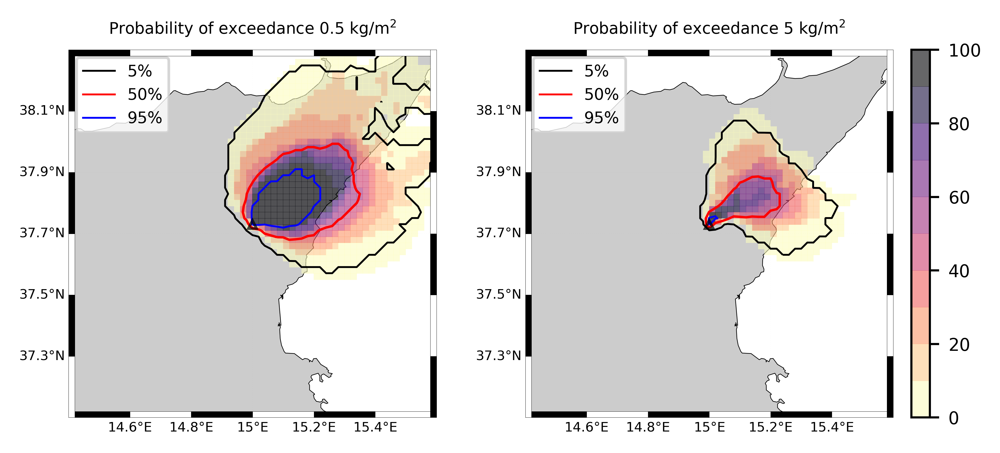

Forecast from VONA_20210304_0228Z
=================================

Contents
========

* [Forecast products](#forecast-products)
	* [Forecast at 2021-03-04 03:30 Z from RED VONA issued at 20210304_0228Z](#forecast-at-2021-03-04-0330-z-from-red-vona-issued-at-20210304_0228z)
	* [Forecast at 2021-03-04 04:30 Z from RED VONA issued at 20210304_0228Z](#forecast-at-2021-03-04-0430-z-from-red-vona-issued-at-20210304_0228z)
	* [Forecast at 2021-03-04 05:30 Z from RED VONA issued at 20210304_0228Z](#forecast-at-2021-03-04-0530-z-from-red-vona-issued-at-20210304_0228z)
	* [Forecast at 2021-03-04 08:30 Z from RED VONA issued at 20210304_0228Z](#forecast-at-2021-03-04-0830-z-from-red-vona-issued-at-20210304_0228z)
	* [Forecast at 2021-03-04 11:30 Z from RED VONA issued at 20210304_0228Z](#forecast-at-2021-03-04-1130-z-from-red-vona-issued-at-20210304_0228z)
	* [Forecast at 2021-03-04 14:30 Z from RED VONA issued at 20210304_0228Z](#forecast-at-2021-03-04-1430-z-from-red-vona-issued-at-20210304_0228z)
	* [Forecast at 2021-03-04 08:50 Z from RED VONA issued at 20210304_0751Z](#forecast-at-2021-03-04-0850-z-from-red-vona-issued-at-20210304_0751z)
	* [Forecast at 2021-03-04 09:00 Z from RED VONA issued at 20210304_0755Z](#forecast-at-2021-03-04-0900-z-from-red-vona-issued-at-20210304_0755z)
	* [Forecast at 2021-03-04 10:00 Z from RED VONA issued at 20210304_0755Z](#forecast-at-2021-03-04-1000-z-from-red-vona-issued-at-20210304_0755z)
	* [Forecast at 2021-03-04 11:00 Z from RED VONA issued at 20210304_0755Z](#forecast-at-2021-03-04-1100-z-from-red-vona-issued-at-20210304_0755z)
	* [Forecast at 2021-03-04 14:00 Z from RED VONA issued at 20210304_0755Z](#forecast-at-2021-03-04-1400-z-from-red-vona-issued-at-20210304_0755z)
	* [Forecast at 2021-03-04 09:20 Z from RED VONA issued at 20210304_0817Z](#forecast-at-2021-03-04-0920-z-from-red-vona-issued-at-20210304_0817z)
	* [Forecast at 2021-03-04 10:20 Z from RED VONA issued at 20210304_0817Z](#forecast-at-2021-03-04-1020-z-from-red-vona-issued-at-20210304_0817z)
	* [Forecast at 2021-03-04 11:20 Z from RED VONA issued at 20210304_0817Z](#forecast-at-2021-03-04-1120-z-from-red-vona-issued-at-20210304_0817z)
	* [Forecast at 2021-03-04 14:20 Z from RED VONA issued at 20210304_0817Z](#forecast-at-2021-03-04-1420-z-from-red-vona-issued-at-20210304_0817z)
	* [Forecast at 2021-03-04 17:20 Z from RED VONA issued at 20210304_0817Z](#forecast-at-2021-03-04-1720-z-from-red-vona-issued-at-20210304_0817z)
	* [Forecast at 2021-03-04 20:20 Z from RED VONA issued at 20210304_0817Z](#forecast-at-2021-03-04-2020-z-from-red-vona-issued-at-20210304_0817z)
	* [Forecast at 2021-03-04 13:20 Z from ORANGE VONA issued at 20210304_1016Z](#forecast-at-2021-03-04-1320-z-from-orange-vona-issued-at-20210304_1016z)
	* [Forecast at 2021-03-04 16:20 Z from ORANGE VONA issued at 20210304_1016Z](#forecast-at-2021-03-04-1620-z-from-orange-vona-issued-at-20210304_1016z)
	* [Forecast at 2021-03-04 19:20 Z from ORANGE VONA issued at 20210304_1016Z](#forecast-at-2021-03-04-1920-z-from-orange-vona-issued-at-20210304_1016z)
	* [Forecast at 2021-03-04 22:20 Z from ORANGE VONA issued at 20210304_1016Z](#forecast-at-2021-03-04-2220-z-from-orange-vona-issued-at-20210304_1016z)

# Forecast products

## Forecast at 2021-03-04 03:30 Z from RED VONA issued at 20210304_0228Z
  

|Eruption start [Z]|Eruption end [Z]|Forecast time [Z]|Column height asl [m]|
| :--- | :--- | :--- | :--- |
|2021-03-04 02:30:00|Ongoing|2021-03-04 03:30:00|5000 ± 500 - from VONA|
  
  

|Percentile|MER [kg/s¹]|Mass air [kg]|Mass air nested dom. [kg]|Mass grd [kg]|Mass grd nested dom. [kg]|
| :--- | :--- | :--- | :--- | :--- | :--- |
|5th|2.52e+02|3.57e+05|3.57e+05|7.04e+05|7.05e+05|
|50th|2.87e+03|5.03e+06|5.03e+06|7.03e+06|7.02e+06|
|95th|7.15e+03|1.11e+07|1.11e+07|1.92e+07|1.92e+07|
  

### Ground Nested Domain 2021-03-04 03:30 Z
  
  
  
  
  
  
  
  
  
  
  
  
  
  
  
  
  
  
  
  
  
  
  
  
  
  
  
  

|Location|Ground load [kg/m²] 5th perc|Ground load [kg/m²] 50th perc|Ground load [kg/m²] 95th perc|
| :--- | :--- | :--- | :--- |
|Catania AP (1)|0.00e+00|0.00e+00|0.00e+00|
|Siracusa (2)|nan|nan|nan|
|Reggio Calabria (3)|nan|nan|nan|
|Palermo (4)|nan|nan|nan|
|Nicolosi (5)|0.00e+00|0.00e+00|0.00e+00|
|Zafferana (6)|0.00e+00|0.00e+00|0.00e+00|
|Linguaglossa (7)|0.00e+00|0.00e+00|0.00e+00|
|Randazzo (8)|0.00e+00|0.00e+00|0.00e+00|
|Bronte (9)|0.00e+00|0.00e+00|0.00e+00|
|Biancavilla (10)|0.00e+00|0.00e+00|0.00e+00|
|Piano Provenzana (11)|0.00e+00|1.64e-03|3.29e-02|
|Bivio Provenzana-Linguaglossa (12)|0.00e+00|6.50e-05|1.43e-02|
|Cunetta pre-Citelli (13)|0.00e+00|7.98e-04|7.83e-02|
|Chalet (14)|0.00e+00|0.00e+00|2.68e-03|
|Ragabo (15)|0.00e+00|0.00e+00|3.61e-03|
|Scilio (16)|0.00e+00|0.00e+00|7.20e-05|
|Gambino vini (17)|0.00e+00|0.00e+00|2.21e-04|
|StazioneFce Linguaglossa (18)|0.00e+00|0.00e+00|0.00e+00|
|Linguaglossa Via Olivio Sozzi (19)|0.00e+00|0.00e+00|0.00e+00|
|Cim.Linguaglossa (20)|0.00e+00|0.00e+00|0.00e+00|
|Gole Bar (21)|0.00e+00|0.00e+00|0.00e+00|
|Francavilla - Orange (22)|0.00e+00|0.00e+00|0.00e+00|
|Roccalumera1 (23)|0.00e+00|0.00e+00|0.00e+00|
|Roccalumera2 (24)|0.00e+00|0.00e+00|0.00e+00|
|Nizza (25)|0.00e+00|0.00e+00|0.00e+00|
|Scaletta Zanclea (26)|0.00e+00|0.00e+00|0.00e+00|
|Alì (27)|0.00e+00|0.00e+00|0.00e+00|
  

### Atmosphere 2021-03-04 03:30 Z
  

## Forecast at 2021-03-04 04:30 Z from RED VONA issued at 20210304_0228Z
  

|Eruption start [Z]|Eruption end [Z]|Forecast time [Z]|Column height asl [m]|
| :--- | :--- | :--- | :--- |
|2021-03-04 02:30:00|Ongoing|2021-03-04 04:30:00|5000 ± 500 - from VONA|
  
  

|Percentile|MER [kg/s¹]|Mass air [kg]|Mass air nested dom. [kg]|Mass grd [kg]|Mass grd nested dom. [kg]|
| :--- | :--- | :--- | :--- | :--- | :--- |
|5th|3.99e+02|2.18e+06|2.17e+06|6.24e+06|6.25e+06|
|50th|4.91e+03|6.14e+06|6.14e+06|2.03e+07|2.03e+07|
|95th|1.07e+04|2.44e+07|2.44e+07|4.37e+07|4.37e+07|
  

### Ground Nested Domain 2021-03-04 04:30 Z
  
  
  
  
  
  
  
  
  
  
  
  
  
  
  
  
  
  
  
  
  
  
  
  
  
  
  
  

|Location|Ground load [kg/m²] 5th perc|Ground load [kg/m²] 50th perc|Ground load [kg/m²] 95th perc|
| :--- | :--- | :--- | :--- |
|Catania AP (1)|0.00e+00|0.00e+00|0.00e+00|
|Siracusa (2)|nan|nan|nan|
|Reggio Calabria (3)|nan|nan|nan|
|Palermo (4)|nan|nan|nan|
|Nicolosi (5)|0.00e+00|0.00e+00|0.00e+00|
|Zafferana (6)|0.00e+00|0.00e+00|0.00e+00|
|Linguaglossa (7)|0.00e+00|0.00e+00|2.46e-03|
|Randazzo (8)|0.00e+00|0.00e+00|5.31e-03|
|Bronte (9)|0.00e+00|0.00e+00|0.00e+00|
|Biancavilla (10)|0.00e+00|0.00e+00|0.00e+00|
|Piano Provenzana (11)|1.42e-04|3.64e-02|1.29e-01|
|Bivio Provenzana-Linguaglossa (12)|0.00e+00|9.95e-03|6.71e-02|
|Cunetta pre-Citelli (13)|0.00e+00|1.51e-02|1.88e-01|
|Chalet (14)|0.00e+00|9.30e-04|2.96e-02|
|Ragabo (15)|0.00e+00|2.62e-03|3.28e-02|
|Scilio (16)|0.00e+00|0.00e+00|8.97e-03|
|Gambino vini (17)|0.00e+00|0.00e+00|1.47e-02|
|StazioneFce Linguaglossa (18)|0.00e+00|0.00e+00|2.75e-03|
|Linguaglossa Via Olivio Sozzi (19)|0.00e+00|0.00e+00|2.40e-03|
|Cim.Linguaglossa (20)|0.00e+00|0.00e+00|5.65e-03|
|Gole Bar (21)|0.00e+00|0.00e+00|2.76e-04|
|Francavilla - Orange (22)|0.00e+00|0.00e+00|1.57e-05|
|Roccalumera1 (23)|0.00e+00|0.00e+00|0.00e+00|
|Roccalumera2 (24)|0.00e+00|0.00e+00|0.00e+00|
|Nizza (25)|0.00e+00|0.00e+00|0.00e+00|
|Scaletta Zanclea (26)|0.00e+00|0.00e+00|0.00e+00|
|Alì (27)|0.00e+00|0.00e+00|0.00e+00|
  

### Atmosphere 2021-03-04 04:30 Z
  

## Forecast at 2021-03-04 05:30 Z from RED VONA issued at 20210304_0228Z
  

|Eruption start [Z]|Eruption end [Z]|Forecast time [Z]|Column height asl [m]|
| :--- | :--- | :--- | :--- |
|2021-03-04 02:30:00|Ongoing|2021-03-04 05:30:00|5000 ± 500 - from VONA|
  
  

|Percentile|MER [kg/s¹]|Mass air [kg]|Mass air nested dom. [kg]|Mass grd [kg]|Mass grd nested dom. [kg]|
| :--- | :--- | :--- | :--- | :--- | :--- |
|5th|3.38e+02|1.08e+06|1.08e+06|1.46e+07|1.46e+07|
|50th|3.39e+03|8.93e+06|8.92e+06|3.99e+07|4.00e+07|
|95th|9.45e+03|1.75e+07|1.75e+07|6.67e+07|6.67e+07|
  

### Ground Nested Domain 2021-03-04 05:30 Z
  
  
  
  
  
  
  
  
  
  
  
  
  
  
  
  
  
  
  
  
  
  
  
  
  
  
  
  

|Location|Ground load [kg/m²] 5th perc|Ground load [kg/m²] 50th perc|Ground load [kg/m²] 95th perc|
| :--- | :--- | :--- | :--- |
|Catania AP (1)|0.00e+00|0.00e+00|0.00e+00|
|Siracusa (2)|nan|nan|nan|
|Reggio Calabria (3)|nan|nan|nan|
|Palermo (4)|nan|nan|nan|
|Nicolosi (5)|0.00e+00|0.00e+00|0.00e+00|
|Zafferana (6)|0.00e+00|0.00e+00|0.00e+00|
|Linguaglossa (7)|0.00e+00|0.00e+00|7.62e-03|
|Randazzo (8)|0.00e+00|0.00e+00|1.14e-02|
|Bronte (9)|0.00e+00|0.00e+00|0.00e+00|
|Biancavilla (10)|0.00e+00|0.00e+00|0.00e+00|
|Piano Provenzana (11)|1.92e-02|5.52e-02|2.42e-01|
|Bivio Provenzana-Linguaglossa (12)|4.96e-03|2.25e-02|1.66e-01|
|Cunetta pre-Citelli (13)|9.98e-03|3.83e-02|2.62e-01|
|Chalet (14)|8.71e-06|2.32e-03|5.27e-02|
|Ragabo (15)|6.82e-04|3.92e-03|7.26e-02|
|Scilio (16)|0.00e+00|3.53e-05|1.54e-02|
|Gambino vini (17)|0.00e+00|3.55e-05|3.18e-02|
|StazioneFce Linguaglossa (18)|0.00e+00|4.71e-06|7.72e-03|
|Linguaglossa Via Olivio Sozzi (19)|0.00e+00|1.25e-05|1.00e-02|
|Cim.Linguaglossa (20)|0.00e+00|0.00e+00|9.12e-03|
|Gole Bar (21)|0.00e+00|0.00e+00|5.68e-04|
|Francavilla - Orange (22)|0.00e+00|0.00e+00|1.00e-03|
|Roccalumera1 (23)|0.00e+00|0.00e+00|0.00e+00|
|Roccalumera2 (24)|0.00e+00|0.00e+00|0.00e+00|
|Nizza (25)|0.00e+00|0.00e+00|0.00e+00|
|Scaletta Zanclea (26)|0.00e+00|0.00e+00|0.00e+00|
|Alì (27)|0.00e+00|0.00e+00|0.00e+00|
  

### Atmosphere 2021-03-04 05:30 Z
  

## Forecast at 2021-03-04 08:30 Z from RED VONA issued at 20210304_0228Z
  

|Eruption start [Z]|Eruption end [Z]|Forecast time [Z]|Column height asl [m]|
| :--- | :--- | :--- | :--- |
|2021-03-04 02:30:00|Ongoing|2021-03-04 08:30:00|5000 ± 500 - from VONA|
  
  

|Percentile|MER [kg/s¹]|Mass air [kg]|Mass air nested dom. [kg]|Mass grd [kg]|Mass grd nested dom. [kg]|
| :--- | :--- | :--- | :--- | :--- | :--- |
|5th|2.68e+02|2.01e+06|2.00e+06|3.12e+07|3.12e+07|
|50th|2.29e+03|7.23e+06|7.23e+06|5.53e+07|5.53e+07|
|95th|5.68e+03|2.38e+07|2.37e+07|1.01e+08|1.01e+08|
  

### Ground Nested Domain 2021-03-04 08:30 Z
  
  
  
  
  
  
  
  
  
  
  
  
  
  
  
  
  
  
  
  
  
  
  
  
  
  
  
  

|Location|Ground load [kg/m²] 5th perc|Ground load [kg/m²] 50th perc|Ground load [kg/m²] 95th perc|
| :--- | :--- | :--- | :--- |
|Catania AP (1)|0.00e+00|0.00e+00|0.00e+00|
|Siracusa (2)|nan|nan|nan|
|Reggio Calabria (3)|nan|nan|nan|
|Palermo (4)|nan|nan|nan|
|Nicolosi (5)|0.00e+00|0.00e+00|0.00e+00|
|Zafferana (6)|0.00e+00|0.00e+00|0.00e+00|
|Linguaglossa (7)|0.00e+00|1.85e-03|1.64e-02|
|Randazzo (8)|0.00e+00|5.00e-06|2.13e-02|
|Bronte (9)|0.00e+00|0.00e+00|0.00e+00|
|Biancavilla (10)|0.00e+00|0.00e+00|0.00e+00|
|Piano Provenzana (11)|4.75e-02|1.11e-01|2.87e-01|
|Bivio Provenzana-Linguaglossa (12)|1.66e-02|7.13e-02|1.76e-01|
|Cunetta pre-Citelli (13)|1.61e-02|1.30e-01|3.16e-01|
|Chalet (14)|5.31e-04|2.76e-02|7.99e-02|
|Ragabo (15)|4.57e-03|3.41e-02|8.31e-02|
|Scilio (16)|1.33e-06|4.28e-03|3.32e-02|
|Gambino vini (17)|0.00e+00|3.87e-03|5.07e-02|
|StazioneFce Linguaglossa (18)|0.00e+00|1.94e-03|2.00e-02|
|Linguaglossa Via Olivio Sozzi (19)|0.00e+00|1.49e-03|1.87e-02|
|Cim.Linguaglossa (20)|0.00e+00|2.92e-03|2.03e-02|
|Gole Bar (21)|0.00e+00|2.67e-05|6.27e-03|
|Francavilla - Orange (22)|0.00e+00|1.73e-04|3.30e-03|
|Roccalumera1 (23)|0.00e+00|0.00e+00|0.00e+00|
|Roccalumera2 (24)|0.00e+00|0.00e+00|0.00e+00|
|Nizza (25)|0.00e+00|0.00e+00|0.00e+00|
|Scaletta Zanclea (26)|0.00e+00|0.00e+00|0.00e+00|
|Alì (27)|0.00e+00|0.00e+00|0.00e+00|
  

### Atmosphere 2021-03-04 08:30 Z
  

## Forecast at 2021-03-04 11:30 Z from RED VONA issued at 20210304_0228Z
  

|Eruption start [Z]|Eruption end [Z]|Forecast time [Z]|Column height asl [m]|
| :--- | :--- | :--- | :--- |
|2021-03-04 02:30:00|Ongoing|2021-03-04 11:30:00|5000 ± 500 - from VONA|
  
  

|Percentile|MER [kg/s¹]|Mass air [kg]|Mass air nested dom. [kg]|Mass grd [kg]|Mass grd nested dom. [kg]|
| :--- | :--- | :--- | :--- | :--- | :--- |
|5th|7.04e+01|5.23e+06|5.23e+06|4.66e+07|4.66e+07|
|50th|2.92e+03|9.96e+06|9.96e+06|8.48e+07|8.48e+07|
|95th|1.03e+04|3.28e+07|3.28e+07|1.65e+08|1.65e+08|
  

### Ground Nested Domain 2021-03-04 11:30 Z
  
  
  
  
  
  
  
  
  
  
  
  
  
  
  
  
  
  
  
  
  
  
  
  
  
  
  
  

|Location|Ground load [kg/m²] 5th perc|Ground load [kg/m²] 50th perc|Ground load [kg/m²] 95th perc|
| :--- | :--- | :--- | :--- |
|Catania AP (1)|0.00e+00|0.00e+00|0.00e+00|
|Siracusa (2)|nan|nan|nan|
|Reggio Calabria (3)|nan|nan|nan|
|Palermo (4)|nan|nan|nan|
|Nicolosi (5)|0.00e+00|0.00e+00|0.00e+00|
|Zafferana (6)|0.00e+00|0.00e+00|0.00e+00|
|Linguaglossa (7)|3.08e-05|3.45e-03|4.40e-02|
|Randazzo (8)|0.00e+00|1.02e-04|2.87e-02|
|Bronte (9)|0.00e+00|0.00e+00|0.00e+00|
|Biancavilla (10)|0.00e+00|0.00e+00|0.00e+00|
|Piano Provenzana (11)|5.13e-02|1.43e-01|5.66e-01|
|Bivio Provenzana-Linguaglossa (12)|2.47e-02|1.03e-01|3.44e-01|
|Cunetta pre-Citelli (13)|2.29e-02|1.59e-01|6.72e-01|
|Chalet (14)|2.18e-03|3.89e-02|1.23e-01|
|Ragabo (15)|9.53e-03|5.04e-02|1.71e-01|
|Scilio (16)|8.25e-05|7.53e-03|5.15e-02|
|Gambino vini (17)|2.77e-05|1.10e-02|6.07e-02|
|StazioneFce Linguaglossa (18)|1.54e-04|5.66e-03|4.87e-02|
|Linguaglossa Via Olivio Sozzi (19)|3.82e-04|8.62e-03|3.18e-02|
|Cim.Linguaglossa (20)|1.49e-05|4.17e-03|3.41e-02|
|Gole Bar (21)|1.86e-06|5.81e-04|9.95e-03|
|Francavilla - Orange (22)|3.25e-05|1.57e-03|5.45e-03|
|Roccalumera1 (23)|0.00e+00|0.00e+00|3.84e-04|
|Roccalumera2 (24)|0.00e+00|0.00e+00|2.18e-04|
|Nizza (25)|0.00e+00|0.00e+00|1.94e-04|
|Scaletta Zanclea (26)|0.00e+00|0.00e+00|9.47e-06|
|Alì (27)|0.00e+00|0.00e+00|1.46e-04|
  

### Atmosphere 2021-03-04 11:30 Z
  

## Forecast at 2021-03-04 14:30 Z from RED VONA issued at 20210304_0228Z
  

|Eruption start [Z]|Eruption end [Z]|Forecast time [Z]|Column height asl [m]|
| :--- | :--- | :--- | :--- |
|2021-03-04 02:30:00|Ongoing|2021-03-04 14:30:00|5000 ± 500 - from VONA|
  
  

|Percentile|MER [kg/s¹]|Mass air [kg]|Mass air nested dom. [kg]|Mass grd [kg]|Mass grd nested dom. [kg]|
| :--- | :--- | :--- | :--- | :--- | :--- |
|5th|7.51e+02|7.06e+06|6.44e+06|5.92e+07|5.92e+07|
|50th|5.47e+03|2.58e+07|2.40e+07|1.74e+08|1.74e+08|
|95th|1.52e+04|6.05e+07|5.60e+07|2.28e+08|2.28e+08|
  

### Ground Nested Domain 2021-03-04 14:30 Z
  
  
  
  
  
  
  
  
  
  
  
  
  
  
  
  
  
  
  
  
  
  
  
  
  
  
  
  

|Location|Ground load [kg/m²] 5th perc|Ground load [kg/m²] 50th perc|Ground load [kg/m²] 95th perc|
| :--- | :--- | :--- | :--- |
|Catania AP (1)|0.00e+00|0.00e+00|0.00e+00|
|Siracusa (2)|nan|nan|nan|
|Reggio Calabria (3)|nan|nan|nan|
|Palermo (4)|nan|nan|nan|
|Nicolosi (5)|0.00e+00|0.00e+00|0.00e+00|
|Zafferana (6)|0.00e+00|0.00e+00|0.00e+00|
|Linguaglossa (7)|1.85e-03|1.72e-02|8.79e-02|
|Randazzo (8)|0.00e+00|7.20e-04|6.67e-02|
|Bronte (9)|0.00e+00|0.00e+00|0.00e+00|
|Biancavilla (10)|0.00e+00|0.00e+00|0.00e+00|
|Piano Provenzana (11)|1.36e-01|2.96e-01|1.27e+00|
|Bivio Provenzana-Linguaglossa (12)|5.98e-02|2.04e-01|1.22e+00|
|Cunetta pre-Citelli (13)|1.12e-01|2.38e-01|1.87e+00|
|Chalet (14)|2.79e-02|7.21e-02|3.44e-01|
|Ragabo (15)|3.03e-02|1.05e-01|4.55e-01|
|Scilio (16)|4.39e-03|1.43e-02|1.60e-01|
|Gambino vini (17)|3.65e-03|1.73e-02|2.47e-01|
|StazioneFce Linguaglossa (18)|2.50e-03|1.78e-02|8.85e-02|
|Linguaglossa Via Olivio Sozzi (19)|2.25e-03|1.91e-02|6.94e-02|
|Cim.Linguaglossa (20)|2.92e-03|9.59e-03|1.01e-01|
|Gole Bar (21)|4.56e-04|5.99e-03|2.54e-02|
|Francavilla - Orange (22)|7.10e-04|6.33e-03|1.58e-02|
|Roccalumera1 (23)|0.00e+00|0.00e+00|2.47e-03|
|Roccalumera2 (24)|0.00e+00|0.00e+00|5.95e-04|
|Nizza (25)|0.00e+00|0.00e+00|6.33e-04|
|Scaletta Zanclea (26)|0.00e+00|0.00e+00|2.39e-04|
|Alì (27)|0.00e+00|0.00e+00|6.82e-04|
  

### Atmosphere 2021-03-04 14:30 Z
  

## Forecast at 2021-03-04 08:50 Z from RED VONA issued at 20210304_0751Z
  

|Eruption start [Z]|Eruption end [Z]|Forecast time [Z]|Column height asl [m]|
| :--- | :--- | :--- | :--- |
|2021-03-04 02:30:00|Ongoing|2021-03-04 08:50:00|6000 ± 500 - from VONA|
  
  

|Percentile|MER [kg/s¹]|Mass air [kg]|Mass air nested dom. [kg]|Mass grd [kg]|Mass grd nested dom. [kg]|
| :--- | :--- | :--- | :--- | :--- | :--- |
|5th|8.09e+02|6.89e+06|6.88e+06|4.39e+07|4.39e+07|
|50th|7.54e+03|1.64e+07|1.64e+07|7.27e+07|7.27e+07|
|95th|1.56e+04|2.78e+07|2.78e+07|1.25e+08|1.25e+08|
  

### Ground Nested Domain 2021-03-04 08:50 Z
  
  
  
  
  
  
  
  
  
  
  
  
  
  
  
  
  
  
  
  
  
  
  
  
  
  
  
  

|Location|Ground load [kg/m²] 5th perc|Ground load [kg/m²] 50th perc|Ground load [kg/m²] 95th perc|
| :--- | :--- | :--- | :--- |
|Catania AP (1)|0.00e+00|0.00e+00|0.00e+00|
|Siracusa (2)|nan|nan|nan|
|Reggio Calabria (3)|nan|nan|nan|
|Palermo (4)|nan|nan|nan|
|Nicolosi (5)|0.00e+00|0.00e+00|0.00e+00|
|Zafferana (6)|0.00e+00|0.00e+00|0.00e+00|
|Linguaglossa (7)|0.00e+00|1.96e-03|1.62e-02|
|Randazzo (8)|0.00e+00|7.33e-05|2.14e-02|
|Bronte (9)|0.00e+00|0.00e+00|0.00e+00|
|Biancavilla (10)|0.00e+00|0.00e+00|0.00e+00|
|Piano Provenzana (11)|5.35e-02|1.20e-01|2.86e-01|
|Bivio Provenzana-Linguaglossa (12)|2.25e-02|7.97e-02|1.78e-01|
|Cunetta pre-Citelli (13)|1.88e-02|1.66e-01|3.16e-01|
|Chalet (14)|5.31e-04|3.01e-02|8.01e-02|
|Ragabo (15)|4.57e-03|3.81e-02|8.45e-02|
|Scilio (16)|1.33e-06|4.68e-03|3.40e-02|
|Gambino vini (17)|0.00e+00|5.28e-03|5.94e-02|
|StazioneFce Linguaglossa (18)|1.57e-06|2.10e-03|1.96e-02|
|Linguaglossa Via Olivio Sozzi (19)|4.18e-06|1.42e-03|1.87e-02|
|Cim.Linguaglossa (20)|0.00e+00|2.76e-03|2.67e-02|
|Gole Bar (21)|0.00e+00|2.67e-05|6.98e-03|
|Francavilla - Orange (22)|0.00e+00|3.28e-04|4.16e-03|
|Roccalumera1 (23)|0.00e+00|0.00e+00|0.00e+00|
|Roccalumera2 (24)|0.00e+00|0.00e+00|0.00e+00|
|Nizza (25)|0.00e+00|0.00e+00|0.00e+00|
|Scaletta Zanclea (26)|0.00e+00|0.00e+00|0.00e+00|
|Alì (27)|0.00e+00|0.00e+00|0.00e+00|
  

### Atmosphere 2021-03-04 08:50 Z
  

## Forecast at 2021-03-04 09:00 Z from RED VONA issued at 20210304_0755Z
  

|Eruption start [Z]|Eruption end [Z]|Forecast time [Z]|Column height asl [m]|
| :--- | :--- | :--- | :--- |
|2021-03-04 02:30:00|Ongoing|2021-03-04 09:00:00|6500 ± 500 - from VONA|
  
  

|Percentile|MER [kg/s¹]|Mass air [kg]|Mass air nested dom. [kg]|Mass grd [kg]|Mass grd nested dom. [kg]|
| :--- | :--- | :--- | :--- | :--- | :--- |
|5th|3.40e+03|9.94e+06|9.94e+06|5.31e+07|5.32e+07|
|50th|9.89e+03|2.26e+07|2.26e+07|7.73e+07|7.72e+07|
|95th|3.00e+04|7.43e+07|7.43e+07|1.44e+08|1.44e+08|
  

### Ground Nested Domain 2021-03-04 09:00 Z
  
  
  
  
  
  
  
  
  
  
  
  
  
  
  
  
  
  
  
  
  
  
  
  
  
  
  
  

|Location|Ground load [kg/m²] 5th perc|Ground load [kg/m²] 50th perc|Ground load [kg/m²] 95th perc|
| :--- | :--- | :--- | :--- |
|Catania AP (1)|0.00e+00|0.00e+00|0.00e+00|
|Siracusa (2)|nan|nan|nan|
|Reggio Calabria (3)|nan|nan|nan|
|Palermo (4)|nan|nan|nan|
|Nicolosi (5)|0.00e+00|0.00e+00|0.00e+00|
|Zafferana (6)|0.00e+00|0.00e+00|0.00e+00|
|Linguaglossa (7)|0.00e+00|2.20e-03|1.86e-02|
|Randazzo (8)|0.00e+00|5.00e-06|2.71e-02|
|Bronte (9)|0.00e+00|0.00e+00|0.00e+00|
|Biancavilla (10)|0.00e+00|0.00e+00|0.00e+00|
|Piano Provenzana (11)|5.58e-02|1.60e-01|4.45e-01|
|Bivio Provenzana-Linguaglossa (12)|2.26e-02|9.90e-02|2.84e-01|
|Cunetta pre-Citelli (13)|1.96e-02|1.81e-01|4.69e-01|
|Chalet (14)|2.87e-03|3.32e-02|8.50e-02|
|Ragabo (15)|8.81e-03|4.19e-02|1.29e-01|
|Scilio (16)|9.91e-06|4.47e-03|3.61e-02|
|Gambino vini (17)|1.90e-06|5.65e-03|6.31e-02|
|StazioneFce Linguaglossa (18)|1.41e-05|1.93e-03|2.28e-02|
|Linguaglossa Via Olivio Sozzi (19)|3.76e-05|2.14e-03|2.01e-02|
|Cim.Linguaglossa (20)|0.00e+00|2.77e-03|3.12e-02|
|Gole Bar (21)|0.00e+00|3.41e-05|7.28e-03|
|Francavilla - Orange (22)|0.00e+00|1.54e-04|4.92e-03|
|Roccalumera1 (23)|0.00e+00|0.00e+00|2.47e-06|
|Roccalumera2 (24)|0.00e+00|0.00e+00|0.00e+00|
|Nizza (25)|0.00e+00|0.00e+00|0.00e+00|
|Scaletta Zanclea (26)|0.00e+00|0.00e+00|0.00e+00|
|Alì (27)|0.00e+00|0.00e+00|0.00e+00|
  

### Atmosphere 2021-03-04 09:00 Z
  

## Forecast at 2021-03-04 10:00 Z from RED VONA issued at 20210304_0755Z
  

|Eruption start [Z]|Eruption end [Z]|Forecast time [Z]|Column height asl [m]|
| :--- | :--- | :--- | :--- |
|2021-03-04 02:30:00|Ongoing|2021-03-04 10:00:00|6500 ± 500 - from VONA|
  
  

|Percentile|MER [kg/s¹]|Mass air [kg]|Mass air nested dom. [kg]|Mass grd [kg]|Mass grd nested dom. [kg]|
| :--- | :--- | :--- | :--- | :--- | :--- |
|5th|4.28e+03|1.88e+07|1.88e+07|8.53e+07|8.53e+07|
|50th|1.55e+04|3.18e+07|3.18e+07|1.34e+08|1.34e+08|
|95th|2.35e+04|8.23e+07|8.22e+07|2.41e+08|2.41e+08|
  

### Ground Nested Domain 2021-03-04 10:00 Z
  
  
  
  
  
  
  
  
  
  
  
  
  
  
  
  
  
  
  
  
  
  
  
  
  
  
  
  

|Location|Ground load [kg/m²] 5th perc|Ground load [kg/m²] 50th perc|Ground load [kg/m²] 95th perc|
| :--- | :--- | :--- | :--- |
|Catania AP (1)|0.00e+00|0.00e+00|0.00e+00|
|Siracusa (2)|nan|nan|nan|
|Reggio Calabria (3)|nan|nan|nan|
|Palermo (4)|nan|nan|nan|
|Nicolosi (5)|0.00e+00|0.00e+00|0.00e+00|
|Zafferana (6)|0.00e+00|0.00e+00|0.00e+00|
|Linguaglossa (7)|2.18e-05|5.62e-03|8.10e-02|
|Randazzo (8)|0.00e+00|5.00e-06|5.75e-02|
|Bronte (9)|0.00e+00|0.00e+00|0.00e+00|
|Biancavilla (10)|0.00e+00|0.00e+00|0.00e+00|
|Piano Provenzana (11)|1.35e-01|3.19e-01|1.15e+00|
|Bivio Provenzana-Linguaglossa (12)|5.68e-02|1.96e-01|5.14e-01|
|Cunetta pre-Citelli (13)|8.12e-02|3.00e-01|6.28e-01|
|Chalet (14)|5.09e-03|7.69e-02|2.62e-01|
|Ragabo (15)|1.83e-02|8.79e-02|4.20e-01|
|Scilio (16)|3.53e-05|9.76e-03|1.09e-01|
|Gambino vini (17)|4.78e-05|1.21e-02|1.38e-01|
|StazioneFce Linguaglossa (18)|1.71e-04|7.43e-03|1.01e-01|
|Linguaglossa Via Olivio Sozzi (19)|4.23e-04|9.38e-03|5.74e-02|
|Cim.Linguaglossa (20)|7.73e-06|5.69e-03|6.34e-02|
|Gole Bar (21)|0.00e+00|3.52e-04|1.02e-02|
|Francavilla - Orange (22)|0.00e+00|9.41e-04|1.96e-02|
|Roccalumera1 (23)|0.00e+00|0.00e+00|2.47e-06|
|Roccalumera2 (24)|0.00e+00|0.00e+00|0.00e+00|
|Nizza (25)|0.00e+00|0.00e+00|0.00e+00|
|Scaletta Zanclea (26)|0.00e+00|0.00e+00|0.00e+00|
|Alì (27)|0.00e+00|0.00e+00|0.00e+00|
  

### Atmosphere 2021-03-04 10:00 Z
  

## Forecast at 2021-03-04 11:00 Z from RED VONA issued at 20210304_0755Z
  

|Eruption start [Z]|Eruption end [Z]|Forecast time [Z]|Column height asl [m]|
| :--- | :--- | :--- | :--- |
|2021-03-04 02:30:00|Ongoing|2021-03-04 11:00:00|6500 ± 500 - from VONA|
  
  

|Percentile|MER [kg/s¹]|Mass air [kg]|Mass air nested dom. [kg]|Mass grd [kg]|Mass grd nested dom. [kg]|
| :--- | :--- | :--- | :--- | :--- | :--- |
|5th|4.89e+03|2.36e+07|2.36e+07|1.06e+08|1.06e+08|
|50th|1.30e+04|4.64e+07|4.63e+07|1.83e+08|1.83e+08|
|95th|3.19e+04|8.48e+07|8.46e+07|2.82e+08|2.82e+08|
  

### Ground Nested Domain 2021-03-04 11:00 Z
  
  
  
  
  
  
  
  
  
  
  
  
  
  
  
  
  
  
  
  
  
  
  
  
  
  
  
  

|Location|Ground load [kg/m²] 5th perc|Ground load [kg/m²] 50th perc|Ground load [kg/m²] 95th perc|
| :--- | :--- | :--- | :--- |
|Catania AP (1)|0.00e+00|0.00e+00|0.00e+00|
|Siracusa (2)|nan|nan|nan|
|Reggio Calabria (3)|nan|nan|nan|
|Palermo (4)|nan|nan|nan|
|Nicolosi (5)|0.00e+00|0.00e+00|0.00e+00|
|Zafferana (6)|0.00e+00|0.00e+00|3.33e-05|
|Linguaglossa (7)|3.26e-04|1.92e-02|1.10e-01|
|Randazzo (8)|0.00e+00|2.00e-05|5.75e-02|
|Bronte (9)|0.00e+00|0.00e+00|0.00e+00|
|Biancavilla (10)|0.00e+00|0.00e+00|0.00e+00|
|Piano Provenzana (11)|2.40e-01|4.69e-01|1.24e+00|
|Bivio Provenzana-Linguaglossa (12)|8.22e-02|3.67e-01|6.89e-01|
|Cunetta pre-Citelli (13)|9.48e-02|4.69e-01|9.39e-01|
|Chalet (14)|1.23e-02|1.32e-01|4.02e-01|
|Ragabo (15)|3.20e-02|1.97e-01|6.00e-01|
|Scilio (16)|2.00e-03|3.69e-02|1.28e-01|
|Gambino vini (17)|2.54e-03|3.88e-02|1.61e-01|
|StazioneFce Linguaglossa (18)|6.00e-04|2.48e-02|1.34e-01|
|Linguaglossa Via Olivio Sozzi (19)|7.25e-04|2.51e-02|1.19e-01|
|Cim.Linguaglossa (20)|4.85e-04|1.81e-02|1.10e-01|
|Gole Bar (21)|0.00e+00|4.34e-03|2.42e-02|
|Francavilla - Orange (22)|3.85e-04|6.13e-03|6.46e-02|
|Roccalumera1 (23)|0.00e+00|0.00e+00|2.32e-04|
|Roccalumera2 (24)|0.00e+00|0.00e+00|1.57e-04|
|Nizza (25)|0.00e+00|0.00e+00|8.10e-05|
|Scaletta Zanclea (26)|0.00e+00|0.00e+00|5.59e-06|
|Alì (27)|0.00e+00|0.00e+00|1.48e-06|
  

### Atmosphere 2021-03-04 11:00 Z
  

## Forecast at 2021-03-04 14:00 Z from RED VONA issued at 20210304_0755Z
  

|Eruption start [Z]|Eruption end [Z]|Forecast time [Z]|Column height asl [m]|
| :--- | :--- | :--- | :--- |
|2021-03-04 02:30:00|Ongoing|2021-03-04 14:00:00|6500 ± 500 - from VONA|
  
  

|Percentile|MER [kg/s¹]|Mass air [kg]|Mass air nested dom. [kg]|Mass grd [kg]|Mass grd nested dom. [kg]|
| :--- | :--- | :--- | :--- | :--- | :--- |
|5th|4.68e+03|3.34e+07|3.28e+07|2.45e+08|2.45e+08|
|50th|1.96e+04|7.17e+07|6.62e+07|3.58e+08|3.58e+08|
|95th|5.29e+04|2.26e+08|1.84e+08|6.28e+08|6.28e+08|
  

### Ground Nested Domain 2021-03-04 14:00 Z
  
  
  
  
  
  
  
  
  
  
  
  
  
  
  
  
  
  
  
  
  
  
  
  
  
  
  
  

|Location|Ground load [kg/m²] 5th perc|Ground load [kg/m²] 50th perc|Ground load [kg/m²] 95th perc|
| :--- | :--- | :--- | :--- |
|Catania AP (1)|0.00e+00|0.00e+00|0.00e+00|
|Siracusa (2)|nan|nan|nan|
|Reggio Calabria (3)|nan|nan|nan|
|Palermo (4)|nan|nan|nan|
|Nicolosi (5)|0.00e+00|0.00e+00|0.00e+00|
|Zafferana (6)|0.00e+00|0.00e+00|1.50e-02|
|Linguaglossa (7)|1.18e-02|1.19e-01|3.87e-01|
|Randazzo (8)|4.17e-05|1.77e-03|1.09e-01|
|Bronte (9)|0.00e+00|0.00e+00|0.00e+00|
|Biancavilla (10)|0.00e+00|0.00e+00|0.00e+00|
|Piano Provenzana (11)|5.14e-01|9.93e-01|4.45e+00|
|Bivio Provenzana-Linguaglossa (12)|2.52e-01|8.33e-01|3.39e+00|
|Cunetta pre-Citelli (13)|3.20e-01|1.52e+00|4.34e+00|
|Chalet (14)|1.11e-01|3.89e-01|1.99e+00|
|Ragabo (15)|1.59e-01|4.93e-01|2.53e+00|
|Scilio (16)|1.25e-02|1.71e-01|6.23e-01|
|Gambino vini (17)|8.27e-03|2.52e-01|8.15e-01|
|StazioneFce Linguaglossa (18)|1.58e-02|1.26e-01|3.84e-01|
|Linguaglossa Via Olivio Sozzi (19)|2.10e-02|1.07e-01|4.19e-01|
|Cim.Linguaglossa (20)|7.41e-03|1.03e-01|6.13e-01|
|Gole Bar (21)|2.03e-03|3.35e-02|1.41e-01|
|Francavilla - Orange (22)|6.23e-03|2.96e-02|1.72e-01|
|Roccalumera1 (23)|0.00e+00|2.52e-05|2.88e-02|
|Roccalumera2 (24)|0.00e+00|2.09e-06|2.25e-02|
|Nizza (25)|0.00e+00|0.00e+00|2.47e-02|
|Scaletta Zanclea (26)|0.00e+00|1.68e-05|1.21e-02|
|Alì (27)|0.00e+00|0.00e+00|9.24e-03|
  

### Atmosphere 2021-03-04 14:00 Z
  

## Forecast at 2021-03-04 09:20 Z from RED VONA issued at 20210304_0817Z
  

|Eruption start [Z]|Eruption end [Z]|Forecast time [Z]|Column height asl [m]|
| :--- | :--- | :--- | :--- |
|2021-03-04 02:30:00|Ongoing|2021-03-04 09:20:00|11000 ± 500 - from VONA|
  
  

|Percentile|MER [kg/s¹]|Mass air [kg]|Mass air nested dom. [kg]|Mass grd [kg]|Mass grd nested dom. [kg]|
| :--- | :--- | :--- | :--- | :--- | :--- |
|5th|2.77e+05|4.46e+08|4.45e+08|5.52e+08|5.51e+08|
|50th|7.14e+05|1.36e+09|1.36e+09|1.21e+09|1.21e+09|
|95th|2.37e+06|5.13e+09|4.97e+09|2.69e+09|2.68e+09|
  

### Ground Nested Domain 2021-03-04 09:20 Z
  
  
  
  
  
  
  
  
  
  
  
  
  
  
  
  
  
  
  
  
  
  
  
  
  
  
  
  

|Location|Ground load [kg/m²] 5th perc|Ground load [kg/m²] 50th perc|Ground load [kg/m²] 95th perc|
| :--- | :--- | :--- | :--- |
|Catania AP (1)|0.00e+00|0.00e+00|0.00e+00|
|Siracusa (2)|nan|nan|nan|
|Reggio Calabria (3)|nan|nan|nan|
|Palermo (4)|nan|nan|nan|
|Nicolosi (5)|0.00e+00|2.67e-03|3.69e-02|
|Zafferana (6)|3.29e-02|2.11e-01|2.71e+00|
|Linguaglossa (7)|6.62e-02|1.18e+00|4.88e+00|
|Randazzo (8)|9.98e-04|1.24e-02|4.79e-01|
|Bronte (9)|0.00e+00|0.00e+00|2.83e-03|
|Biancavilla (10)|0.00e+00|1.12e-05|5.09e-04|
|Piano Provenzana (11)|8.37e-01|2.80e+00|8.29e+00|
|Bivio Provenzana-Linguaglossa (12)|1.18e+00|3.53e+00|8.19e+00|
|Cunetta pre-Citelli (13)|2.08e+00|3.62e+00|7.56e+00|
|Chalet (14)|3.55e-01|2.78e+00|1.07e+01|
|Ragabo (15)|5.24e-01|2.85e+00|9.97e+00|
|Scilio (16)|1.36e-01|1.61e+00|7.21e+00|
|Gambino vini (17)|2.17e-01|1.66e+00|8.76e+00|
|StazioneFce Linguaglossa (18)|7.55e-02|1.13e+00|4.97e+00|
|Linguaglossa Via Olivio Sozzi (19)|7.20e-02|1.11e+00|4.31e+00|
|Cim.Linguaglossa (20)|8.54e-02|1.66e+00|6.60e+00|
|Gole Bar (21)|1.16e-02|2.69e-01|1.83e+00|
|Francavilla - Orange (22)|8.16e-03|1.73e-01|2.33e+00|
|Roccalumera1 (23)|0.00e+00|0.00e+00|4.35e-03|
|Roccalumera2 (24)|0.00e+00|0.00e+00|1.29e-03|
|Nizza (25)|0.00e+00|0.00e+00|3.18e-04|
|Scaletta Zanclea (26)|0.00e+00|0.00e+00|0.00e+00|
|Alì (27)|0.00e+00|0.00e+00|1.85e-05|
  

### Atmosphere 2021-03-04 09:20 Z
  

## Forecast at 2021-03-04 10:20 Z from RED VONA issued at 20210304_0817Z
  

|Eruption start [Z]|Eruption end [Z]|Forecast time [Z]|Column height asl [m]|
| :--- | :--- | :--- | :--- |
|2021-03-04 02:30:00|Ongoing|2021-03-04 10:20:00|11000 ± 500 - from VONA|
  
  

|Percentile|MER [kg/s¹]|Mass air [kg]|Mass air nested dom. [kg]|Mass grd [kg]|Mass grd nested dom. [kg]|
| :--- | :--- | :--- | :--- | :--- | :--- |
|5th|1.98e+05|1.16e+09|1.11e+09|2.28e+09|2.28e+09|
|50th|8.47e+05|3.08e+09|3.02e+09|4.14e+09|4.13e+09|
|95th|2.55e+06|8.33e+09|6.97e+09|6.86e+09|6.78e+09|
  

### Ground Nested Domain 2021-03-04 10:20 Z
  
  
  
  
  
  
  
  
  
  
  
  
  
  
  
  
  
  
  
  
  
  
  
  
  
  
  
  

|Location|Ground load [kg/m²] 5th perc|Ground load [kg/m²] 50th perc|Ground load [kg/m²] 95th perc|
| :--- | :--- | :--- | :--- |
|Catania AP (1)|0.00e+00|0.00e+00|0.00e+00|
|Siracusa (2)|nan|nan|nan|
|Reggio Calabria (3)|nan|nan|nan|
|Palermo (4)|nan|nan|nan|
|Nicolosi (5)|2.22e-03|1.58e-02|1.48e-01|
|Zafferana (6)|3.43e-01|1.08e+00|6.18e+00|
|Linguaglossa (7)|1.70e+00|5.38e+00|1.27e+01|
|Randazzo (8)|8.38e-03|1.79e-01|9.79e-01|
|Bronte (9)|0.00e+00|0.00e+00|5.85e-03|
|Biancavilla (10)|0.00e+00|2.09e-04|9.91e-04|
|Piano Provenzana (11)|2.42e+00|9.04e+00|1.54e+01|
|Bivio Provenzana-Linguaglossa (12)|4.47e+00|9.74e+00|1.40e+01|
|Cunetta pre-Citelli (13)|5.93e+00|1.09e+01|1.36e+01|
|Chalet (14)|2.70e+00|9.54e+00|1.59e+01|
|Ragabo (15)|3.10e+00|9.36e+00|1.50e+01|
|Scilio (16)|2.03e+00|7.59e+00|1.43e+01|
|Gambino vini (17)|2.29e+00|9.14e+00|1.56e+01|
|StazioneFce Linguaglossa (18)|1.73e+00|5.75e+00|1.31e+01|
|Linguaglossa Via Olivio Sozzi (19)|1.52e+00|5.40e+00|1.27e+01|
|Cim.Linguaglossa (20)|1.94e+00|6.66e+00|1.34e+01|
|Gole Bar (21)|4.52e-01|2.23e+00|6.58e+00|
|Francavilla - Orange (22)|1.78e-01|2.23e+00|5.80e+00|
|Roccalumera1 (23)|1.23e-05|4.21e-03|3.59e-01|
|Roccalumera2 (24)|2.09e-06|1.96e-03|2.82e-01|
|Nizza (25)|0.00e+00|9.64e-04|2.80e-01|
|Scaletta Zanclea (26)|0.00e+00|0.00e+00|1.28e-02|
|Alì (27)|0.00e+00|1.44e-04|1.66e-01|
  

### Atmosphere 2021-03-04 10:20 Z
  

## Forecast at 2021-03-04 11:20 Z from RED VONA issued at 20210304_0817Z
  

|Eruption start [Z]|Eruption end [Z]|Forecast time [Z]|Column height asl [m]|
| :--- | :--- | :--- | :--- |
|2021-03-04 02:30:00|Ongoing|2021-03-04 11:20:00|11000 ± 500 - from VONA|
  
  

|Percentile|MER [kg/s¹]|Mass air [kg]|Mass air nested dom. [kg]|Mass grd [kg]|Mass grd nested dom. [kg]|
| :--- | :--- | :--- | :--- | :--- | :--- |
|5th|1.85e+05|1.53e+09|1.53e+09|3.21e+09|3.20e+09|
|50th|9.19e+05|3.61e+09|3.02e+09|7.09e+09|7.07e+09|
|95th|3.00e+06|9.80e+09|7.24e+09|1.09e+10|1.08e+10|
  

### Ground Nested Domain 2021-03-04 11:20 Z
  
  
  
  
  
  
  
  
  
  
  
  
  
  
  
  
  
  
  
  
  
  
  
  
  
  
  
  

|Location|Ground load [kg/m²] 5th perc|Ground load [kg/m²] 50th perc|Ground load [kg/m²] 95th perc|
| :--- | :--- | :--- | :--- |
|Catania AP (1)|0.00e+00|0.00e+00|0.00e+00|
|Siracusa (2)|nan|nan|nan|
|Reggio Calabria (3)|nan|nan|nan|
|Palermo (4)|nan|nan|nan|
|Nicolosi (5)|2.58e-03|2.17e-02|2.13e-01|
|Zafferana (6)|4.59e-01|2.45e+00|7.79e+00|
|Linguaglossa (7)|2.90e+00|8.69e+00|2.17e+01|
|Randazzo (8)|3.73e-02|2.31e-01|2.00e+00|
|Bronte (9)|0.00e+00|2.62e-04|1.22e-02|
|Biancavilla (10)|0.00e+00|2.89e-04|1.49e-03|
|Piano Provenzana (11)|6.18e+00|1.44e+01|2.20e+01|
|Bivio Provenzana-Linguaglossa (12)|8.33e+00|1.57e+01|2.28e+01|
|Cunetta pre-Citelli (13)|8.04e+00|1.65e+01|2.51e+01|
|Chalet (14)|5.07e+00|1.44e+01|2.16e+01|
|Ragabo (15)|5.65e+00|1.40e+01|2.11e+01|
|Scilio (16)|4.02e+00|1.06e+01|2.32e+01|
|Gambino vini (17)|5.08e+00|1.22e+01|2.16e+01|
|StazioneFce Linguaglossa (18)|3.01e+00|9.38e+00|2.13e+01|
|Linguaglossa Via Olivio Sozzi (19)|2.72e+00|9.04e+00|1.98e+01|
|Cim.Linguaglossa (20)|3.53e+00|9.62e+00|2.44e+01|
|Gole Bar (21)|1.26e+00|4.52e+00|1.42e+01|
|Francavilla - Orange (22)|5.56e-01|4.88e+00|9.07e+00|
|Roccalumera1 (23)|4.42e-04|4.48e-01|2.35e+00|
|Roccalumera2 (24)|1.88e-05|5.02e-01|2.16e+00|
|Nizza (25)|0.00e+00|4.38e-01|1.82e+00|
|Scaletta Zanclea (26)|0.00e+00|1.94e-02|1.15e+00|
|Alì (27)|0.00e+00|2.80e-01|1.34e+00|
  

### Atmosphere 2021-03-04 11:20 Z
  

## Forecast at 2021-03-04 14:20 Z from RED VONA issued at 20210304_0817Z
  

|Eruption start [Z]|Eruption end [Z]|Forecast time [Z]|Column height asl [m]|
| :--- | :--- | :--- | :--- |
|2021-03-04 02:30:00|Ongoing|2021-03-04 14:20:00|11000 ± 500 - from VONA|
  
  

|Percentile|MER [kg/s¹]|Mass air [kg]|Mass air nested dom. [kg]|Mass grd [kg]|Mass grd nested dom. [kg]|
| :--- | :--- | :--- | :--- | :--- | :--- |
|5th|3.14e+05|1.65e+09|1.34e+09|9.46e+09|9.43e+09|
|50th|9.28e+05|4.71e+09|3.32e+09|1.75e+10|1.70e+10|
|95th|3.58e+06|1.78e+10|8.58e+09|3.31e+10|2.96e+10|
  

### Ground Nested Domain 2021-03-04 14:20 Z
  
  
  
  
  
  
  
  
  
  
  
  
  
  
  
  
  
  
  
  
  
  
  
  
  
  
  
  

|Location|Ground load [kg/m²] 5th perc|Ground load [kg/m²] 50th perc|Ground load [kg/m²] 95th perc|
| :--- | :--- | :--- | :--- |
|Catania AP (1)|0.00e+00|0.00e+00|1.27e-02|
|Siracusa (2)|nan|nan|nan|
|Reggio Calabria (3)|nan|nan|nan|
|Palermo (4)|nan|nan|nan|
|Nicolosi (5)|1.86e-02|1.24e-01|4.17e-01|
|Zafferana (6)|1.14e+00|4.71e+00|1.15e+01|
|Linguaglossa (7)|1.21e+01|2.28e+01|3.93e+01|
|Randazzo (8)|2.77e-01|8.78e-01|4.41e+00|
|Bronte (9)|0.00e+00|1.10e-02|8.90e-02|
|Biancavilla (10)|1.95e-04|1.73e-03|2.93e-02|
|Piano Provenzana (11)|1.80e+01|2.54e+01|4.15e+01|
|Bivio Provenzana-Linguaglossa (12)|1.60e+01|3.14e+01|4.26e+01|
|Cunetta pre-Citelli (13)|1.91e+01|3.07e+01|5.92e+01|
|Chalet (14)|1.62e+01|2.94e+01|4.08e+01|
|Ragabo (15)|1.60e+01|2.89e+01|4.05e+01|
|Scilio (16)|1.32e+01|2.72e+01|4.17e+01|
|Gambino vini (17)|1.38e+01|3.11e+01|4.30e+01|
|StazioneFce Linguaglossa (18)|1.22e+01|2.34e+01|3.87e+01|
|Linguaglossa Via Olivio Sozzi (19)|1.22e+01|2.18e+01|3.72e+01|
|Cim.Linguaglossa (20)|1.22e+01|2.54e+01|4.39e+01|
|Gole Bar (21)|6.72e+00|1.14e+01|2.74e+01|
|Francavilla - Orange (22)|6.14e+00|9.39e+00|2.69e+01|
|Roccalumera1 (23)|3.70e-02|2.17e+00|1.12e+01|
|Roccalumera2 (24)|1.13e-02|1.67e+00|1.22e+01|
|Nizza (25)|7.27e-03|1.73e+00|1.04e+01|
|Scaletta Zanclea (26)|3.55e-03|6.93e-01|5.19e+00|
|Alì (27)|5.75e-03|1.32e+00|7.69e+00|
  

### Atmosphere 2021-03-04 14:20 Z
  

## Forecast at 2021-03-04 17:20 Z from RED VONA issued at 20210304_0817Z
  

|Eruption start [Z]|Eruption end [Z]|Forecast time [Z]|Column height asl [m]|
| :--- | :--- | :--- | :--- |
|2021-03-04 02:30:00|Ongoing|2021-03-04 17:20:00|11000 ± 500 - from VONA|
  
  

|Percentile|MER [kg/s¹]|Mass air [kg]|Mass air nested dom. [kg]|Mass grd [kg]|Mass grd nested dom. [kg]|
| :--- | :--- | :--- | :--- | :--- | :--- |
|5th|2.51e+05|1.78e+09|7.46e+08|1.97e+10|1.94e+10|
|50th|1.24e+06|6.59e+09|3.91e+09|2.63e+10|2.56e+10|
|95th|2.25e+06|1.35e+10|7.12e+09|5.25e+10|4.56e+10|
  

### Ground Nested Domain 2021-03-04 17:20 Z
  
  
  
  
  
  
  
  
  
  
  
  
  
  
  
  
  
  
  
  
  
  
  
  
  
  
  
  

|Location|Ground load [kg/m²] 5th perc|Ground load [kg/m²] 50th perc|Ground load [kg/m²] 95th perc|
| :--- | :--- | :--- | :--- |
|Catania AP (1)|0.00e+00|0.00e+00|1.98e-02|
|Siracusa (2)|nan|nan|nan|
|Reggio Calabria (3)|nan|nan|nan|
|Palermo (4)|nan|nan|nan|
|Nicolosi (5)|6.88e-02|2.12e-01|4.58e-01|
|Zafferana (6)|3.03e+00|5.71e+00|1.32e+01|
|Linguaglossa (7)|2.36e+01|3.25e+01|5.39e+01|
|Randazzo (8)|5.14e-01|2.13e+00|6.55e+00|
|Bronte (9)|5.41e-03|4.79e-02|2.63e-01|
|Biancavilla (10)|1.55e-03|6.07e-03|3.56e-02|
|Piano Provenzana (11)|2.48e+01|4.24e+01|5.67e+01|
|Bivio Provenzana-Linguaglossa (12)|2.72e+01|4.45e+01|6.25e+01|
|Cunetta pre-Citelli (13)|3.57e+01|5.71e+01|7.27e+01|
|Chalet (14)|2.49e+01|4.25e+01|5.19e+01|
|Ragabo (15)|2.69e+01|4.22e+01|5.12e+01|
|Scilio (16)|2.62e+01|3.66e+01|5.85e+01|
|Gambino vini (17)|2.90e+01|3.95e+01|6.29e+01|
|StazioneFce Linguaglossa (18)|2.50e+01|3.36e+01|5.38e+01|
|Linguaglossa Via Olivio Sozzi (19)|2.31e+01|3.22e+01|5.43e+01|
|Cim.Linguaglossa (20)|2.38e+01|3.35e+01|5.75e+01|
|Gole Bar (21)|1.21e+01|1.91e+01|3.92e+01|
|Francavilla - Orange (22)|8.19e+00|2.00e+01|3.65e+01|
|Roccalumera1 (23)|8.04e-01|4.20e+00|1.26e+01|
|Roccalumera2 (24)|7.36e-01|3.40e+00|1.33e+01|
|Nizza (25)|8.74e-01|3.37e+00|1.30e+01|
|Scaletta Zanclea (26)|4.05e-01|1.55e+00|8.40e+00|
|Alì (27)|8.23e-01|2.92e+00|1.10e+01|
  

### Atmosphere 2021-03-04 17:20 Z
  

## Forecast at 2021-03-04 20:20 Z from RED VONA issued at 20210304_0817Z
  

|Eruption start [Z]|Eruption end [Z]|Forecast time [Z]|Column height asl [m]|
| :--- | :--- | :--- | :--- |
|2021-03-04 02:30:00|Ongoing|2021-03-04 20:20:00|11000 ± 500 - from VONA|
  
  

|Percentile|MER [kg/s¹]|Mass air [kg]|Mass air nested dom. [kg]|Mass grd [kg]|Mass grd nested dom. [kg]|
| :--- | :--- | :--- | :--- | :--- | :--- |
|5th|2.02e+05|2.47e+09|1.42e+09|2.64e+10|2.45e+10|
|50th|1.31e+06|8.14e+09|3.58e+09|3.73e+10|3.51e+10|
|95th|4.65e+06|3.30e+10|8.14e+09|7.17e+10|6.21e+10|
  

### Ground Nested Domain 2021-03-04 20:20 Z
  
  
  
  
  
  
  
  
  
  
  
  
  
  
  
  
  
  
  
  
  
  
  
  
  
  
  
  

|Location|Ground load [kg/m²] 5th perc|Ground load [kg/m²] 50th perc|Ground load [kg/m²] 95th perc|
| :--- | :--- | :--- | :--- |
|Catania AP (1)|0.00e+00|0.00e+00|2.06e-02|
|Siracusa (2)|nan|nan|nan|
|Reggio Calabria (3)|nan|nan|nan|
|Palermo (4)|nan|nan|nan|
|Nicolosi (5)|1.42e-01|2.54e-01|5.00e-01|
|Zafferana (6)|3.59e+00|8.44e+00|1.51e+01|
|Linguaglossa (7)|3.11e+01|4.36e+01|8.12e+01|
|Randazzo (8)|7.68e-01|3.13e+00|1.12e+01|
|Bronte (9)|1.53e-02|6.43e-02|3.21e-01|
|Biancavilla (10)|2.38e-03|9.53e-03|3.83e-02|
|Piano Provenzana (11)|4.02e+01|5.61e+01|8.23e+01|
|Bivio Provenzana-Linguaglossa (12)|4.45e+01|5.95e+01|8.84e+01|
|Cunetta pre-Citelli (13)|4.62e+01|7.48e+01|1.09e+02|
|Chalet (14)|4.07e+01|5.54e+01|6.79e+01|
|Ragabo (15)|4.11e+01|5.59e+01|6.69e+01|
|Scilio (16)|3.63e+01|4.73e+01|8.78e+01|
|Gambino vini (17)|3.65e+01|5.29e+01|8.74e+01|
|StazioneFce Linguaglossa (18)|3.23e+01|4.52e+01|8.06e+01|
|Linguaglossa Via Olivio Sozzi (19)|2.86e+01|4.56e+01|7.70e+01|
|Cim.Linguaglossa (20)|3.32e+01|4.67e+01|8.90e+01|
|Gole Bar (21)|1.83e+01|3.01e+01|6.37e+01|
|Francavilla - Orange (22)|1.27e+01|2.88e+01|4.80e+01|
|Roccalumera1 (23)|1.98e+00|6.14e+00|1.36e+01|
|Roccalumera2 (24)|1.60e+00|4.85e+00|1.42e+01|
|Nizza (25)|1.56e+00|4.82e+00|1.38e+01|
|Scaletta Zanclea (26)|1.06e+00|2.77e+00|8.97e+00|
|Alì (27)|1.30e+00|4.23e+00|1.24e+01|
  

### Atmosphere 2021-03-04 20:20 Z
  

## Forecast at 2021-03-04 13:20 Z from ORANGE VONA issued at 20210304_1016Z
  

|Eruption start [Z]|Eruption end [Z]|Forecast time [Z]|Column height asl [m]|
| :--- | :--- | :--- | :--- |
|2021-03-04 02:30:00|2021-03-04 10:20:00|2021-03-04 13:20:00|[5000 m, 15000 m]|
  
  

|Percentile|MER [kg/s¹]|Mass air [kg]|Mass air nested dom. [kg]|Mass grd [kg]|Mass grd nested dom. [kg]|
| :--- | :--- | :--- | :--- | :--- | :--- |
|5th|0.00e+00|1.60e+08|6.35e+07|2.93e+09|2.92e+09|
|50th|0.00e+00|6.28e+08|2.90e+08|5.89e+09|5.82e+09|
|95th|0.00e+00|2.87e+09|5.81e+08|1.12e+10|1.09e+10|
  

### Ground Nested Domain 2021-03-04 13:20 Z
  
  
  
  
  
  
  
  
  
  
  
  
  
  
  
  
  
  
  
  
  
  
  
  
  
  
  
  

|Location|Ground load [kg/m²] 5th perc|Ground load [kg/m²] 50th perc|Ground load [kg/m²] 95th perc|
| :--- | :--- | :--- | :--- |
|Catania AP (1)|0.00e+00|0.00e+00|0.00e+00|
|Siracusa (2)|nan|nan|nan|
|Reggio Calabria (3)|nan|nan|nan|
|Palermo (4)|nan|nan|nan|
|Nicolosi (5)|2.65e-03|1.64e-02|1.97e-01|
|Zafferana (6)|3.53e-01|1.31e+00|6.90e+00|
|Linguaglossa (7)|2.18e+00|7.49e+00|1.63e+01|
|Randazzo (8)|9.54e-03|1.82e-01|1.18e+00|
|Bronte (9)|0.00e+00|0.00e+00|1.09e-02|
|Biancavilla (10)|0.00e+00|2.16e-04|1.29e-03|
|Piano Provenzana (11)|4.25e+00|1.05e+01|1.68e+01|
|Bivio Provenzana-Linguaglossa (12)|6.28e+00|1.27e+01|1.60e+01|
|Cunetta pre-Citelli (13)|6.58e+00|1.28e+01|1.76e+01|
|Chalet (14)|4.02e+00|1.16e+01|1.75e+01|
|Ragabo (15)|4.32e+00|1.22e+01|1.64e+01|
|Scilio (16)|2.88e+00|9.68e+00|1.76e+01|
|Gambino vini (17)|2.57e+00|1.05e+01|1.72e+01|
|StazioneFce Linguaglossa (18)|2.26e+00|7.87e+00|1.67e+01|
|Linguaglossa Via Olivio Sozzi (19)|2.10e+00|7.78e+00|1.65e+01|
|Cim.Linguaglossa (20)|2.71e+00|8.46e+00|1.67e+01|
|Gole Bar (21)|1.27e+00|3.97e+00|1.02e+01|
|Francavilla - Orange (22)|4.15e-01|3.58e+00|7.77e+00|
|Roccalumera1 (23)|1.98e-02|6.03e-01|1.79e+00|
|Roccalumera2 (24)|9.56e-03|5.04e-01|1.85e+00|
|Nizza (25)|8.14e-03|4.92e-01|1.59e+00|
|Scaletta Zanclea (26)|1.80e-03|4.96e-01|1.81e+00|
|Alì (27)|3.27e-03|3.66e-01|1.41e+00|
  

### Atmosphere 2021-03-04 13:20 Z
  

## Forecast at 2021-03-04 16:20 Z from ORANGE VONA issued at 20210304_1016Z
  

|Eruption start [Z]|Eruption end [Z]|Forecast time [Z]|Column height asl [m]|
| :--- | :--- | :--- | :--- |
|2021-03-04 02:30:00|2021-03-04 10:20:00|2021-03-04 16:20:00|None|
  
  

|Percentile|MER [kg/s¹]|Mass air [kg]|Mass air nested dom. [kg]|Mass grd [kg]|Mass grd nested dom. [kg]|
| :--- | :--- | :--- | :--- | :--- | :--- |
|5th|0.00e+00|8.25e+07|2.28e+07|2.95e+09|2.95e+09|
|50th|0.00e+00|3.00e+08|8.36e+07|5.95e+09|5.84e+09|
|95th|0.00e+00|2.09e+09|3.31e+08|1.15e+10|1.10e+10|
  

### Ground Nested Domain 2021-03-04 16:20 Z
  
  
  
  
  
  
  
  
  
  
  
  
  
  
  
  
  
  
  
  
  
  
  
  
  
  
  
  

|Location|Ground load [kg/m²] 5th perc|Ground load [kg/m²] 50th perc|Ground load [kg/m²] 95th perc|
| :--- | :--- | :--- | :--- |
|Catania AP (1)|0.00e+00|0.00e+00|0.00e+00|
|Siracusa (2)|nan|nan|nan|
|Reggio Calabria (3)|nan|nan|nan|
|Palermo (4)|nan|nan|nan|
|Nicolosi (5)|2.65e-03|1.64e-02|1.97e-01|
|Zafferana (6)|3.53e-01|1.31e+00|6.90e+00|
|Linguaglossa (7)|2.25e+00|7.62e+00|1.64e+01|
|Randazzo (8)|3.74e-02|1.83e-01|1.23e+00|
|Bronte (9)|0.00e+00|0.00e+00|1.09e-02|
|Biancavilla (10)|0.00e+00|2.16e-04|1.29e-03|
|Piano Provenzana (11)|4.27e+00|1.05e+01|1.68e+01|
|Bivio Provenzana-Linguaglossa (12)|6.28e+00|1.28e+01|1.60e+01|
|Cunetta pre-Citelli (13)|6.58e+00|1.28e+01|1.76e+01|
|Chalet (14)|4.06e+00|1.16e+01|1.75e+01|
|Ragabo (15)|4.34e+00|1.22e+01|1.64e+01|
|Scilio (16)|2.88e+00|9.75e+00|1.77e+01|
|Gambino vini (17)|2.58e+00|1.05e+01|1.73e+01|
|StazioneFce Linguaglossa (18)|2.33e+00|8.00e+00|1.69e+01|
|Linguaglossa Via Olivio Sozzi (19)|2.10e+00|7.91e+00|1.67e+01|
|Cim.Linguaglossa (20)|2.71e+00|8.55e+00|1.68e+01|
|Gole Bar (21)|1.29e+00|3.98e+00|1.02e+01|
|Francavilla - Orange (22)|5.77e-01|3.62e+00|7.78e+00|
|Roccalumera1 (23)|2.29e-02|6.03e-01|1.80e+00|
|Roccalumera2 (24)|1.34e-02|5.08e-01|1.88e+00|
|Nizza (25)|1.16e-02|5.02e-01|1.60e+00|
|Scaletta Zanclea (26)|2.09e-03|5.74e-01|1.83e+00|
|Alì (27)|3.84e-03|3.72e-01|1.46e+00|
  

### Atmosphere 2021-03-04 16:20 Z
  

## Forecast at 2021-03-04 19:20 Z from ORANGE VONA issued at 20210304_1016Z
  

|Eruption start [Z]|Eruption end [Z]|Forecast time [Z]|Column height asl [m]|
| :--- | :--- | :--- | :--- |
|2021-03-04 02:30:00|2021-03-04 10:20:00|2021-03-04 19:20:00|None|
  
  

|Percentile|MER [kg/s¹]|Mass air [kg]|Mass air nested dom. [kg]|Mass grd [kg]|Mass grd nested dom. [kg]|
| :--- | :--- | :--- | :--- | :--- | :--- |
|5th|0.00e+00|7.25e+07|1.88e+07|2.96e+09|2.95e+09|
|50th|0.00e+00|2.33e+08|5.29e+07|5.97e+09|5.86e+09|
|95th|0.00e+00|6.87e+08|1.47e+08|1.17e+10|1.11e+10|
  

### Ground Nested Domain 2021-03-04 19:20 Z
  
  
  
  
  
  
  
  
  
  
  
  
  
  
  
  
  
  
  
  
  
  
  
  
  
  
  
  

|Location|Ground load [kg/m²] 5th perc|Ground load [kg/m²] 50th perc|Ground load [kg/m²] 95th perc|
| :--- | :--- | :--- | :--- |
|Catania AP (1)|0.00e+00|0.00e+00|0.00e+00|
|Siracusa (2)|nan|nan|nan|
|Reggio Calabria (3)|nan|nan|nan|
|Palermo (4)|nan|nan|nan|
|Nicolosi (5)|2.65e-03|1.64e-02|1.97e-01|
|Zafferana (6)|3.53e-01|1.31e+00|6.90e+00|
|Linguaglossa (7)|2.28e+00|7.71e+00|1.65e+01|
|Randazzo (8)|4.01e-02|1.84e-01|1.24e+00|
|Bronte (9)|0.00e+00|3.50e-05|1.09e-02|
|Biancavilla (10)|0.00e+00|2.16e-04|1.29e-03|
|Piano Provenzana (11)|4.29e+00|1.05e+01|1.68e+01|
|Bivio Provenzana-Linguaglossa (12)|6.29e+00|1.28e+01|1.60e+01|
|Cunetta pre-Citelli (13)|6.58e+00|1.28e+01|1.76e+01|
|Chalet (14)|4.08e+00|1.16e+01|1.75e+01|
|Ragabo (15)|4.36e+00|1.22e+01|1.64e+01|
|Scilio (16)|2.90e+00|9.85e+00|1.79e+01|
|Gambino vini (17)|2.60e+00|1.05e+01|1.74e+01|
|StazioneFce Linguaglossa (18)|2.37e+00|8.09e+00|1.69e+01|
|Linguaglossa Via Olivio Sozzi (19)|2.10e+00|8.00e+00|1.67e+01|
|Cim.Linguaglossa (20)|2.73e+00|8.62e+00|1.69e+01|
|Gole Bar (21)|1.31e+00|3.98e+00|1.02e+01|
|Francavilla - Orange (22)|5.94e-01|3.63e+00|7.78e+00|
|Roccalumera1 (23)|2.31e-02|6.03e-01|1.99e+00|
|Roccalumera2 (24)|1.34e-02|5.41e-01|1.96e+00|
|Nizza (25)|1.16e-02|5.51e-01|1.66e+00|
|Scaletta Zanclea (26)|9.92e-03|5.75e-01|1.83e+00|
|Alì (27)|5.94e-03|3.83e-01|1.55e+00|
  

### Atmosphere 2021-03-04 19:20 Z
  

## Forecast at 2021-03-04 22:20 Z from ORANGE VONA issued at 20210304_1016Z
  

|Eruption start [Z]|Eruption end [Z]|Forecast time [Z]|Column height asl [m]|
| :--- | :--- | :--- | :--- |
|2021-03-04 02:30:00|2021-03-04 10:20:00|2021-03-04 22:20:00|None|
  
  

|Percentile|MER [kg/s¹]|Mass air [kg]|Mass air nested dom. [kg]|Mass grd [kg]|Mass grd nested dom. [kg]|
| :--- | :--- | :--- | :--- | :--- | :--- |
|5th|0.00e+00|2.64e+07|9.95e+06|2.97e+09|2.96e+09|
|50th|0.00e+00|1.33e+08|3.48e+07|5.98e+09|5.86e+09|
|95th|0.00e+00|4.60e+08|1.03e+08|1.17e+10|1.11e+10|
  

### Ground Nested Domain 2021-03-04 22:20 Z
  
  
  
  
  
  
  
  
  
  
  
  
  
  
  
  
  
  
  
  
  
  
  
  
  
  
  
  

|Location|Ground load [kg/m²] 5th perc|Ground load [kg/m²] 50th perc|Ground load [kg/m²] 95th perc|
| :--- | :--- | :--- | :--- |
|Catania AP (1)|0.00e+00|0.00e+00|9.97e-06|
|Siracusa (2)|nan|nan|nan|
|Reggio Calabria (3)|nan|nan|nan|
|Palermo (4)|nan|nan|nan|
|Nicolosi (5)|2.65e-03|1.64e-02|1.97e-01|
|Zafferana (6)|3.53e-01|1.31e+00|6.90e+00|
|Linguaglossa (7)|2.37e+00|7.82e+00|1.65e+01|
|Randazzo (8)|4.01e-02|1.84e-01|1.24e+00|
|Bronte (9)|0.00e+00|3.50e-05|1.09e-02|
|Biancavilla (10)|0.00e+00|2.16e-04|1.29e-03|
|Piano Provenzana (11)|4.29e+00|1.05e+01|1.68e+01|
|Bivio Provenzana-Linguaglossa (12)|6.31e+00|1.28e+01|1.60e+01|
|Cunetta pre-Citelli (13)|6.58e+00|1.28e+01|1.76e+01|
|Chalet (14)|4.14e+00|1.16e+01|1.76e+01|
|Ragabo (15)|4.40e+00|1.22e+01|1.64e+01|
|Scilio (16)|2.91e+00|9.88e+00|1.79e+01|
|Gambino vini (17)|2.62e+00|1.05e+01|1.75e+01|
|StazioneFce Linguaglossa (18)|2.46e+00|8.20e+00|1.70e+01|
|Linguaglossa Via Olivio Sozzi (19)|2.10e+00|8.06e+00|1.68e+01|
|Cim.Linguaglossa (20)|2.74e+00|8.67e+00|1.70e+01|
|Gole Bar (21)|1.32e+00|4.01e+00|1.03e+01|
|Francavilla - Orange (22)|5.98e-01|3.63e+00|7.78e+00|
|Roccalumera1 (23)|2.31e-02|6.04e-01|2.00e+00|
|Roccalumera2 (24)|1.34e-02|5.44e-01|1.96e+00|
|Nizza (25)|1.16e-02|5.53e-01|1.66e+00|
|Scaletta Zanclea (26)|1.37e-02|5.75e-01|1.83e+00|
|Alì (27)|7.15e-03|3.83e-01|1.57e+00|
  

### Atmosphere 2021-03-04 22:20 Z
  
  
Go to [Supplementary page](Supplementary_page.md)  
Go to [Main directory](https://github.com/federicapardini/Real_time_ash_forecast)