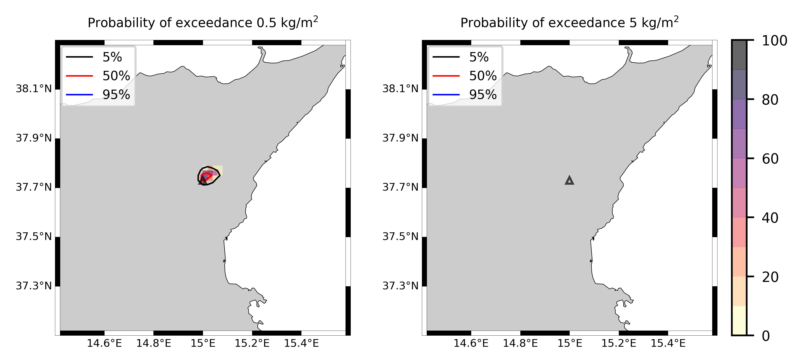

Forecast from VONA_20210304_0228Z
=================================

Contents
========

* [Forecast products](#forecast-products)
	* [Forecast at 2021-03-04 03:30 Z from RED VONA issued at 20210304_0228Z](#forecast-at-2021-03-04-0330-z-from-red-vona-issued-at-20210304_0228z)
	* [Forecast at 2021-03-04 04:30 Z from RED VONA issued at 20210304_0228Z](#forecast-at-2021-03-04-0430-z-from-red-vona-issued-at-20210304_0228z)
	* [Forecast at 2021-03-04 05:30 Z from RED VONA issued at 20210304_0228Z](#forecast-at-2021-03-04-0530-z-from-red-vona-issued-at-20210304_0228z)
	* [Forecast at 2021-03-04 08:30 Z from RED VONA issued at 20210304_0228Z](#forecast-at-2021-03-04-0830-z-from-red-vona-issued-at-20210304_0228z)
	* [Forecast at 2021-03-04 11:30 Z from RED VONA issued at 20210304_0228Z](#forecast-at-2021-03-04-1130-z-from-red-vona-issued-at-20210304_0228z)
	* [Forecast at 2021-03-04 14:30 Z from RED VONA issued at 20210304_0228Z](#forecast-at-2021-03-04-1430-z-from-red-vona-issued-at-20210304_0228z)
	* [Forecast at 2021-03-04 14:30 Z from RED VONA issued at 20210304_0228Z](#forecast-at-2021-03-04-1430-z-from-red-vona-issued-at-20210304_0228z)
	* [Forecast at 2021-03-04 08:50 Z from RED VONA issued at 20210304_0751Z](#forecast-at-2021-03-04-0850-z-from-red-vona-issued-at-20210304_0751z)

# Forecast products

## Forecast at 2021-03-04 03:30 Z from RED VONA issued at 20210304_0228Z
  

|Eruption start [Z]|Eruption end [Z]|Forecast time [Z]|Column height asl [m]|
| :--- | :--- | :--- | :--- |
|2021-03-04 02:30:00|Ongoing|2021-03-04 03:30:00|5000 ± 500 - from VONA|
  
  

|Percentile|MER [kg/s¹]|Mass air [kg]|Mass air nested dom. [kg]|Mass grd [kg]|Mass grd nested dom. [kg]|
| :--- | :--- | :--- | :--- | :--- | :--- |
|5th|3.36e+02|2.00e+05|2.00e+05|1.07e+06|1.07e+06|
|50th|2.95e+03|1.97e+06|1.97e+06|7.84e+06|7.84e+06|
|95th|8.60e+03|6.80e+06|6.80e+06|2.20e+07|2.20e+07|
  

### Ground Nested Domain 2021-03-04 03:30 Z
  
  
  
  
  
  
  
  
  
  
  
  
  
  
  
  
  
  

|Location|Ground load [kg/m²] 5th perc|Ground load [kg/m²] 50th perc|Ground load [kg/m²] 95th perc|
| :--- | :--- | :--- | :--- |
|Piano Provenzana (1)|0.00e+00|1.30e-03|7.41e-02|
|Bivio Provenzana-Linguaglossa (2)|0.00e+00|1.81e-04|5.00e-02|
|Cunetta pre-Citelli (3)|0.00e+00|1.23e-03|7.36e-02|
|Chalet (4)|0.00e+00|0.00e+00|6.94e-03|
|Ragabo (5)|0.00e+00|0.00e+00|1.26e-02|
|Scilio (6)|0.00e+00|0.00e+00|4.90e-04|
|Gambino vini (7)|0.00e+00|0.00e+00|1.49e-03|
|StazioneFce Linguaglossa (8)|0.00e+00|0.00e+00|1.32e-04|
|Linguaglossa Via Olivio Sozzi (9)|0.00e+00|0.00e+00|5.34e-05|
|Cim.Linguaglossa (10)|0.00e+00|0.00e+00|2.34e-04|
|Gole Bar (11)|0.00e+00|0.00e+00|0.00e+00|
|Francavilla - Orange (12)|0.00e+00|0.00e+00|0.00e+00|
|Roccalumera1 (13)|0.00e+00|0.00e+00|0.00e+00|
|Roccalumera2 (14)|0.00e+00|0.00e+00|0.00e+00|
|Nizza (15)|0.00e+00|0.00e+00|0.00e+00|
|Scaletta Zanclea (16)|0.00e+00|0.00e+00|0.00e+00|
|Alì (17)|0.00e+00|0.00e+00|0.00e+00|
  

### Atmosphere 2021-03-04 03:30 Z
  

## Forecast at 2021-03-04 04:30 Z from RED VONA issued at 20210304_0228Z
  

|Eruption start [Z]|Eruption end [Z]|Forecast time [Z]|Column height asl [m]|
| :--- | :--- | :--- | :--- |
|2021-03-04 02:30:00|Ongoing|2021-03-04 04:30:00|5000 ± 500 - from VONA|
  
  

|Percentile|MER [kg/s¹]|Mass air [kg]|Mass air nested dom. [kg]|Mass grd [kg]|Mass grd nested dom. [kg]|
| :--- | :--- | :--- | :--- | :--- | :--- |
|5th|3.22e+02|3.25e+05|3.25e+05|3.40e+06|3.40e+06|
|50th|3.98e+03|3.06e+06|3.06e+06|2.16e+07|2.16e+07|
|95th|1.05e+04|1.02e+07|1.02e+07|4.79e+07|4.79e+07|
  

### Ground Nested Domain 2021-03-04 04:30 Z
  
  
  
  
  
  
  
  
  
  
  
  
  
  
  
  
  
  

|Location|Ground load [kg/m²] 5th perc|Ground load [kg/m²] 50th perc|Ground load [kg/m²] 95th perc|
| :--- | :--- | :--- | :--- |
|Piano Provenzana (1)|0.00e+00|4.14e-02|1.55e-01|
|Bivio Provenzana-Linguaglossa (2)|0.00e+00|1.55e-02|1.11e-01|
|Cunetta pre-Citelli (3)|0.00e+00|2.91e-02|1.58e-01|
|Chalet (4)|0.00e+00|6.11e-04|2.65e-02|
|Ragabo (5)|0.00e+00|3.23e-03|3.57e-02|
|Scilio (6)|0.00e+00|4.20e-06|1.05e-02|
|Gambino vini (7)|0.00e+00|8.96e-06|8.83e-03|
|StazioneFce Linguaglossa (8)|0.00e+00|0.00e+00|8.42e-03|
|Linguaglossa Via Olivio Sozzi (9)|0.00e+00|0.00e+00|7.24e-03|
|Cim.Linguaglossa (10)|0.00e+00|0.00e+00|8.45e-03|
|Gole Bar (11)|0.00e+00|0.00e+00|1.55e-03|
|Francavilla - Orange (12)|0.00e+00|0.00e+00|3.83e-04|
|Roccalumera1 (13)|0.00e+00|0.00e+00|0.00e+00|
|Roccalumera2 (14)|0.00e+00|0.00e+00|0.00e+00|
|Nizza (15)|0.00e+00|0.00e+00|0.00e+00|
|Scaletta Zanclea (16)|0.00e+00|0.00e+00|0.00e+00|
|Alì (17)|0.00e+00|0.00e+00|0.00e+00|
  

### Atmosphere 2021-03-04 04:30 Z
  

## Forecast at 2021-03-04 05:30 Z from RED VONA issued at 20210304_0228Z
  

|Eruption start [Z]|Eruption end [Z]|Forecast time [Z]|Column height asl [m]|
| :--- | :--- | :--- | :--- |
|2021-03-04 02:30:00|Ongoing|2021-03-04 05:30:00|5000 ± 500 - from VONA|
  
  

|Percentile|MER [kg/s¹]|Mass air [kg]|Mass air nested dom. [kg]|Mass grd [kg]|Mass grd nested dom. [kg]|
| :--- | :--- | :--- | :--- | :--- | :--- |
|5th|4.29e+02|1.06e+06|1.06e+06|1.53e+07|1.53e+07|
|50th|3.09e+03|4.18e+06|4.17e+06|3.30e+07|3.30e+07|
|95th|9.84e+03|9.58e+06|9.58e+06|5.85e+07|5.85e+07|
  

### Ground Nested Domain 2021-03-04 05:30 Z
  
  
  
  
  
  
  
  
  
  
  
  
  
  
  
  
  
  

|Location|Ground load [kg/m²] 5th perc|Ground load [kg/m²] 50th perc|Ground load [kg/m²] 95th perc|
| :--- | :--- | :--- | :--- |
|Piano Provenzana (1)|6.11e-03|9.54e-02|2.29e-01|
|Bivio Provenzana-Linguaglossa (2)|9.75e-04|5.35e-02|1.30e-01|
|Cunetta pre-Citelli (3)|1.84e-03|7.35e-02|1.83e-01|
|Chalet (4)|6.53e-06|6.32e-03|4.21e-02|
|Ragabo (5)|1.42e-04|1.60e-02|4.89e-02|
|Scilio (6)|0.00e+00|1.40e-04|1.61e-02|
|Gambino vini (7)|0.00e+00|1.04e-04|1.40e-02|
|StazioneFce Linguaglossa (8)|0.00e+00|5.36e-05|1.50e-02|
|Linguaglossa Via Olivio Sozzi (9)|0.00e+00|6.77e-05|1.68e-02|
|Cim.Linguaglossa (10)|0.00e+00|3.04e-05|1.21e-02|
|Gole Bar (11)|0.00e+00|0.00e+00|1.55e-03|
|Francavilla - Orange (12)|0.00e+00|0.00e+00|1.97e-03|
|Roccalumera1 (13)|0.00e+00|0.00e+00|0.00e+00|
|Roccalumera2 (14)|0.00e+00|0.00e+00|0.00e+00|
|Nizza (15)|0.00e+00|0.00e+00|0.00e+00|
|Scaletta Zanclea (16)|0.00e+00|0.00e+00|0.00e+00|
|Alì (17)|0.00e+00|0.00e+00|0.00e+00|
  

### Atmosphere 2021-03-04 05:30 Z
  

## Forecast at 2021-03-04 08:30 Z from RED VONA issued at 20210304_0228Z
  

|Eruption start [Z]|Eruption end [Z]|Forecast time [Z]|Column height asl [m]|
| :--- | :--- | :--- | :--- |
|2021-03-04 02:30:00|Ongoing|2021-03-04 08:30:00|5000 ± 500 - from VONA|
  
  

|Percentile|MER [kg/s¹]|Mass air [kg]|Mass air nested dom. [kg]|Mass grd [kg]|Mass grd nested dom. [kg]|
| :--- | :--- | :--- | :--- | :--- | :--- |
|5th|4.15e+02|5.13e+05|5.13e+05|3.15e+07|3.15e+07|
|50th|1.62e+03|3.63e+06|3.62e+06|5.54e+07|5.54e+07|
|95th|5.77e+03|9.45e+06|9.44e+06|1.01e+08|1.01e+08|
  

### Ground Nested Domain 2021-03-04 08:30 Z
  
  
  
  
  
  
  
  
  
  
  
  
  
  
  
  
  
  

|Location|Ground load [kg/m²] 5th perc|Ground load [kg/m²] 50th perc|Ground load [kg/m²] 95th perc|
| :--- | :--- | :--- | :--- |
|Piano Provenzana (1)|3.66e-02|1.28e-01|3.96e-01|
|Bivio Provenzana-Linguaglossa (2)|7.10e-03|8.12e-02|3.29e-01|
|Cunetta pre-Citelli (3)|9.76e-03|1.04e-01|4.09e-01|
|Chalet (4)|1.50e-04|1.65e-02|7.57e-02|
|Ragabo (5)|1.33e-03|2.54e-02|9.81e-02|
|Scilio (6)|0.00e+00|1.54e-03|2.88e-02|
|Gambino vini (7)|0.00e+00|1.71e-03|2.70e-02|
|StazioneFce Linguaglossa (8)|0.00e+00|8.25e-04|2.75e-02|
|Linguaglossa Via Olivio Sozzi (9)|0.00e+00|1.22e-03|3.01e-02|
|Cim.Linguaglossa (10)|0.00e+00|4.00e-04|2.70e-02|
|Gole Bar (11)|0.00e+00|4.07e-04|5.40e-03|
|Francavilla - Orange (12)|0.00e+00|7.45e-05|2.01e-03|
|Roccalumera1 (13)|0.00e+00|0.00e+00|6.34e-06|
|Roccalumera2 (14)|0.00e+00|0.00e+00|3.75e-06|
|Nizza (15)|0.00e+00|0.00e+00|1.77e-06|
|Scaletta Zanclea (16)|0.00e+00|0.00e+00|2.50e-06|
|Alì (17)|0.00e+00|0.00e+00|3.71e-07|
  

### Atmosphere 2021-03-04 08:30 Z
  

## Forecast at 2021-03-04 11:30 Z from RED VONA issued at 20210304_0228Z
  

|Eruption start [Z]|Eruption end [Z]|Forecast time [Z]|Column height asl [m]|
| :--- | :--- | :--- | :--- |
|2021-03-04 02:30:00|Ongoing|2021-03-04 11:30:00|5000 ± 500 - from VONA|
  
  

|Percentile|MER [kg/s¹]|Mass air [kg]|Mass air nested dom. [kg]|Mass grd [kg]|Mass grd nested dom. [kg]|
| :--- | :--- | :--- | :--- | :--- | :--- |
|5th|1.42e+02|1.87e+06|1.87e+06|4.46e+07|4.46e+07|
|50th|3.13e+03|4.91e+06|4.90e+06|8.11e+07|8.12e+07|
|95th|1.13e+04|2.30e+07|2.26e+07|1.79e+08|1.79e+08|
  

### Ground Nested Domain 2021-03-04 11:30 Z
  
  
  
  
  
  
  
  
  
  
  
  
  
  
  
  
  
  

|Location|Ground load [kg/m²] 5th perc|Ground load [kg/m²] 50th perc|Ground load [kg/m²] 95th perc|
| :--- | :--- | :--- | :--- |
|Piano Provenzana (1)|3.67e-02|1.42e-01|6.22e-01|
|Bivio Provenzana-Linguaglossa (2)|7.30e-03|1.16e-01|4.89e-01|
|Cunetta pre-Citelli (3)|9.77e-03|1.45e-01|5.64e-01|
|Chalet (4)|2.53e-04|3.28e-02|2.43e-01|
|Ragabo (5)|1.55e-03|5.14e-02|2.68e-01|
|Scilio (6)|1.00e-06|1.93e-03|4.67e-02|
|Gambino vini (7)|0.00e+00|3.30e-03|3.82e-02|
|StazioneFce Linguaglossa (8)|5.89e-06|2.21e-03|4.65e-02|
|Linguaglossa Via Olivio Sozzi (9)|1.57e-05|3.01e-03|6.36e-02|
|Cim.Linguaglossa (10)|0.00e+00|8.36e-04|2.91e-02|
|Gole Bar (11)|0.00e+00|5.36e-04|1.14e-02|
|Francavilla - Orange (12)|0.00e+00|6.93e-04|2.07e-02|
|Roccalumera1 (13)|0.00e+00|0.00e+00|2.56e-05|
|Roccalumera2 (14)|0.00e+00|0.00e+00|2.84e-05|
|Nizza (15)|0.00e+00|0.00e+00|3.89e-05|
|Scaletta Zanclea (16)|0.00e+00|0.00e+00|2.43e-05|
|Alì (17)|0.00e+00|0.00e+00|2.65e-05|
  

### Atmosphere 2021-03-04 11:30 Z
  

## Forecast at 2021-03-04 14:30 Z from RED VONA issued at 20210304_0228Z
  

|Eruption start [Z]|Eruption end [Z]|Forecast time [Z]|Column height asl [m]|
| :--- | :--- | :--- | :--- |
|2021-03-04 02:30:00|Ongoing|2021-03-04 14:30:00|5000 ± 500 - from VONA|
  
  

|Percentile|MER [kg/s¹]|Mass air [kg]|Mass air nested dom. [kg]|Mass grd [kg]|Mass grd nested dom. [kg]|
| :--- | :--- | :--- | :--- | :--- | :--- |
|5th|3.70e+02|4.09e+06|4.08e+06|8.16e+07|8.16e+07|
|50th|5.95e+03|1.29e+07|1.29e+07|1.76e+08|1.76e+08|
|95th|2.39e+04|3.83e+07|3.80e+07|2.72e+08|2.72e+08|
  

### Ground Nested Domain 2021-03-04 14:30 Z
  
  
  
  
  
  
  
  
  
  
  
  
  
  
  
  
  
  

|Location|Ground load [kg/m²] 5th perc|Ground load [kg/m²] 50th perc|Ground load [kg/m²] 95th perc|
| :--- | :--- | :--- | :--- |
|Piano Provenzana (1)|9.09e-02|4.18e-01|1.03e+00|
|Bivio Provenzana-Linguaglossa (2)|3.46e-02|2.51e-01|9.85e-01|
|Cunetta pre-Citelli (3)|4.30e-02|2.90e-01|1.25e+00|
|Chalet (4)|3.72e-03|7.30e-02|6.45e-01|
|Ragabo (5)|1.01e-02|1.23e-01|6.90e-01|
|Scilio (6)|6.11e-04|2.08e-02|1.29e-01|
|Gambino vini (7)|3.86e-04|2.03e-02|1.35e-01|
|StazioneFce Linguaglossa (8)|2.06e-04|1.84e-02|8.18e-02|
|Linguaglossa Via Olivio Sozzi (9)|2.73e-04|2.31e-02|1.03e-01|
|Cim.Linguaglossa (10)|2.00e-04|1.34e-02|8.17e-02|
|Gole Bar (11)|0.00e+00|3.52e-03|2.09e-02|
|Francavilla - Orange (12)|0.00e+00|2.96e-03|5.62e-02|
|Roccalumera1 (13)|0.00e+00|0.00e+00|6.38e-05|
|Roccalumera2 (14)|0.00e+00|0.00e+00|3.71e-05|
|Nizza (15)|0.00e+00|0.00e+00|4.95e-05|
|Scaletta Zanclea (16)|0.00e+00|0.00e+00|6.96e-05|
|Alì (17)|0.00e+00|0.00e+00|4.29e-05|
  

### Atmosphere 2021-03-04 14:30 Z
  

## Forecast at 2021-03-04 14:30 Z from RED VONA issued at 20210304_0228Z
  

|Eruption start [Z]|Eruption end [Z]|Forecast time [Z]|Column height asl [m]|
| :--- | :--- | :--- | :--- |
|2021-03-04 02:30:00|Ongoing|2021-03-04 14:30:00|5000 ± 500 - from VONA|
  
  

|Percentile|MER [kg/s¹]|Mass air [kg]|Mass air nested dom. [kg]|Mass grd [kg]|Mass grd nested dom. [kg]|
| :--- | :--- | :--- | :--- | :--- | :--- |
|5th|3.70e+02|4.09e+06|4.08e+06|8.16e+07|8.16e+07|
|50th|5.95e+03|1.29e+07|1.29e+07|1.76e+08|1.76e+08|
|95th|2.39e+04|3.83e+07|3.80e+07|2.72e+08|2.72e+08|
  

### Ground Nested Domain 2021-03-04 14:30 Z
  
  
  
  
  
  
  
  
  
  
  
  
  
  
  
  
  
  

|Location|Ground load [kg/m²] 5th perc|Ground load [kg/m²] 50th perc|Ground load [kg/m²] 95th perc|
| :--- | :--- | :--- | :--- |
|Piano Provenzana (1)|9.09e-02|4.18e-01|1.03e+00|
|Bivio Provenzana-Linguaglossa (2)|3.46e-02|2.51e-01|9.85e-01|
|Cunetta pre-Citelli (3)|4.30e-02|2.90e-01|1.25e+00|
|Chalet (4)|3.72e-03|7.30e-02|6.45e-01|
|Ragabo (5)|1.01e-02|1.23e-01|6.90e-01|
|Scilio (6)|6.11e-04|2.08e-02|1.29e-01|
|Gambino vini (7)|3.86e-04|2.03e-02|1.35e-01|
|StazioneFce Linguaglossa (8)|2.06e-04|1.84e-02|8.18e-02|
|Linguaglossa Via Olivio Sozzi (9)|2.73e-04|2.31e-02|1.03e-01|
|Cim.Linguaglossa (10)|2.00e-04|1.34e-02|8.17e-02|
|Gole Bar (11)|0.00e+00|3.52e-03|2.09e-02|
|Francavilla - Orange (12)|0.00e+00|2.96e-03|5.62e-02|
|Roccalumera1 (13)|0.00e+00|0.00e+00|6.38e-05|
|Roccalumera2 (14)|0.00e+00|0.00e+00|3.71e-05|
|Nizza (15)|0.00e+00|0.00e+00|4.95e-05|
|Scaletta Zanclea (16)|0.00e+00|0.00e+00|6.96e-05|
|Alì (17)|0.00e+00|0.00e+00|4.29e-05|
  

### Atmosphere 2021-03-04 14:30 Z
  

## Forecast at 2021-03-04 08:50 Z from RED VONA issued at 20210304_0751Z
  

|Eruption start [Z]|Eruption end [Z]|Forecast time [Z]|Column height asl [m]|
| :--- | :--- | :--- | :--- |
|2021-03-04 02:30:00|Ongoing|2021-03-04 08:50:00|6000 ± 500 - from VONA|
  
  

|Percentile|MER [kg/s¹]|Mass air [kg]|Mass air nested dom. [kg]|Mass grd [kg]|Mass grd nested dom. [kg]|
| :--- | :--- | :--- | :--- | :--- | :--- |
|5th|2.11e+03|2.53e+06|2.53e+06|3.66e+07|3.67e+07|
|50th|6.39e+03|6.31e+06|6.31e+06|7.17e+07|7.17e+07|
|95th|1.50e+04|1.72e+07|1.72e+07|1.27e+08|1.27e+08|
  

### Ground Nested Domain 2021-03-04 08:50 Z
  
  
  
  
  
  
  
  
  
  
  
  
  
  
  
  
  
  

|Location|Ground load [kg/m²] 5th perc|Ground load [kg/m²] 50th perc|Ground load [kg/m²] 95th perc|
| :--- | :--- | :--- | :--- |
|Piano Provenzana (1)|5.22e-02|1.60e-01|4.48e-01|
|Bivio Provenzana-Linguaglossa (2)|1.37e-02|8.07e-02|3.65e-01|
|Cunetta pre-Citelli (3)|1.42e-02|1.04e-01|4.21e-01|
|Chalet (4)|4.56e-04|1.76e-02|8.25e-02|
|Ragabo (5)|3.96e-03|2.54e-02|1.33e-01|
|Scilio (6)|0.00e+00|1.73e-03|2.82e-02|
|Gambino vini (7)|0.00e+00|2.83e-03|2.59e-02|
|StazioneFce Linguaglossa (8)|0.00e+00|1.02e-03|2.80e-02|
|Linguaglossa Via Olivio Sozzi (9)|0.00e+00|1.51e-03|2.97e-02|
|Cim.Linguaglossa (10)|0.00e+00|4.20e-04|2.71e-02|
|Gole Bar (11)|0.00e+00|4.17e-04|4.94e-03|
|Francavilla - Orange (12)|0.00e+00|9.53e-05|2.01e-03|
|Roccalumera1 (13)|0.00e+00|0.00e+00|6.62e-07|
|Roccalumera2 (14)|0.00e+00|0.00e+00|3.42e-06|
|Nizza (15)|0.00e+00|0.00e+00|1.77e-06|
|Scaletta Zanclea (16)|0.00e+00|0.00e+00|1.10e-06|
|Alì (17)|0.00e+00|0.00e+00|1.68e-06|
  

### Atmosphere 2021-03-04 08:50 Z
  
  
Go to [Supplementary page](Supplementary_page.md)  
Go to [Main directory](https://github.com/federicapardini/Real_time_ash_forecast)