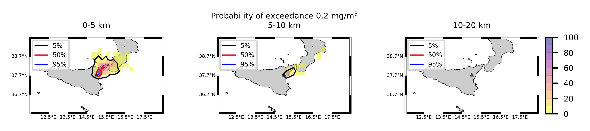
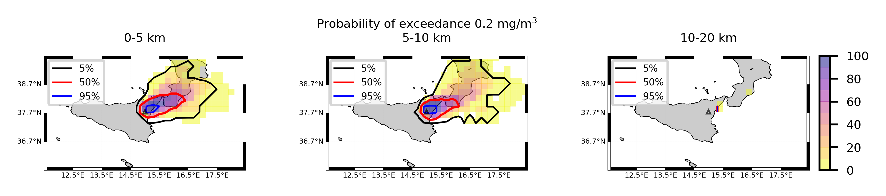
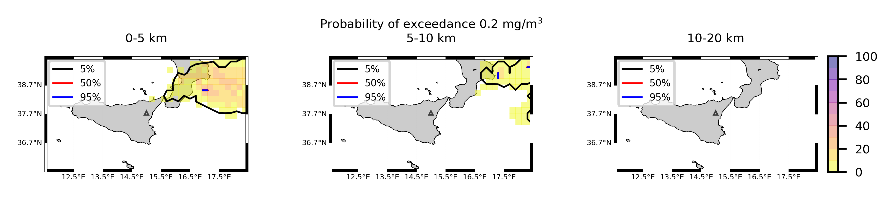
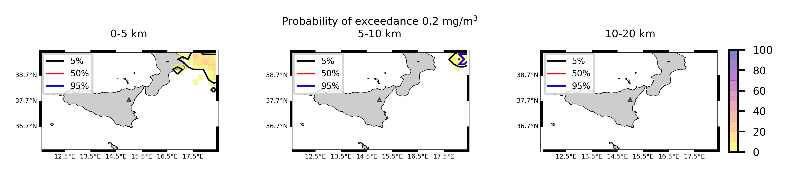

Forecast from VONA_20210304_0228Z
=================================

Contents
========

* [Forecast products](#forecast-products)
	* [Forecast at 2021-03-04 03:30 Z from RED VONA issued at 20210304_0228Z](#forecast-at-2021-03-04-0330-z-from-red-vona-issued-at-20210304_0228z)
	* [Forecast at 2021-03-04 04:30 Z from RED VONA issued at 20210304_0228Z](#forecast-at-2021-03-04-0430-z-from-red-vona-issued-at-20210304_0228z)
	* [Forecast at 2021-03-04 05:30 Z from RED VONA issued at 20210304_0228Z](#forecast-at-2021-03-04-0530-z-from-red-vona-issued-at-20210304_0228z)
	* [Forecast at 2021-03-04 08:30 Z from RED VONA issued at 20210304_0228Z](#forecast-at-2021-03-04-0830-z-from-red-vona-issued-at-20210304_0228z)
	* [Forecast at 2021-03-04 11:30 Z from RED VONA issued at 20210304_0228Z](#forecast-at-2021-03-04-1130-z-from-red-vona-issued-at-20210304_0228z)
	* [Forecast at 2021-03-04 14:30 Z from RED VONA issued at 20210304_0228Z](#forecast-at-2021-03-04-1430-z-from-red-vona-issued-at-20210304_0228z)
	* [Forecast at 2021-03-04 08:50 Z from RED VONA issued at 20210304_0751Z](#forecast-at-2021-03-04-0850-z-from-red-vona-issued-at-20210304_0751z)
	* [Forecast at 2021-03-04 09:00 Z from RED VONA issued at 20210304_0755Z](#forecast-at-2021-03-04-0900-z-from-red-vona-issued-at-20210304_0755z)
	* [Forecast at 2021-03-04 10:00 Z from RED VONA issued at 20210304_0755Z](#forecast-at-2021-03-04-1000-z-from-red-vona-issued-at-20210304_0755z)
	* [Forecast at 2021-03-04 11:00 Z from RED VONA issued at 20210304_0755Z](#forecast-at-2021-03-04-1100-z-from-red-vona-issued-at-20210304_0755z)
	* [Forecast at 2021-03-04 14:00 Z from RED VONA issued at 20210304_0755Z](#forecast-at-2021-03-04-1400-z-from-red-vona-issued-at-20210304_0755z)
	* [Forecast at 2021-03-04 09:20 Z from RED VONA issued at 20210304_0817Z](#forecast-at-2021-03-04-0920-z-from-red-vona-issued-at-20210304_0817z)
	* [Forecast at 2021-03-04 10:20 Z from RED VONA issued at 20210304_0817Z](#forecast-at-2021-03-04-1020-z-from-red-vona-issued-at-20210304_0817z)
	* [Forecast at 2021-03-04 11:20 Z from RED VONA issued at 20210304_0817Z](#forecast-at-2021-03-04-1120-z-from-red-vona-issued-at-20210304_0817z)
	* [Forecast at 2021-03-04 14:20 Z from RED VONA issued at 20210304_0817Z](#forecast-at-2021-03-04-1420-z-from-red-vona-issued-at-20210304_0817z)
	* [Forecast at 2021-03-04 17:20 Z from RED VONA issued at 20210304_0817Z](#forecast-at-2021-03-04-1720-z-from-red-vona-issued-at-20210304_0817z)
	* [Forecast at 2021-03-04 20:20 Z from RED VONA issued at 20210304_0817Z](#forecast-at-2021-03-04-2020-z-from-red-vona-issued-at-20210304_0817z)
	* [Forecast at 2021-03-04 13:20 Z from ORANGE VONA issued at 20210304_1016Z](#forecast-at-2021-03-04-1320-z-from-orange-vona-issued-at-20210304_1016z)
	* [Forecast at 2021-03-04 16:20 Z from ORANGE VONA issued at 20210304_1016Z](#forecast-at-2021-03-04-1620-z-from-orange-vona-issued-at-20210304_1016z)
	* [Forecast at 2021-03-04 19:20 Z from ORANGE VONA issued at 20210304_1016Z](#forecast-at-2021-03-04-1920-z-from-orange-vona-issued-at-20210304_1016z)
	* [Forecast at 2021-03-04 22:20 Z from ORANGE VONA issued at 20210304_1016Z](#forecast-at-2021-03-04-2220-z-from-orange-vona-issued-at-20210304_1016z)

# Forecast products

## Forecast at 2021-03-04 03:30 Z from RED VONA issued at 20210304_0228Z
  

|Eruption start [Z]|Eruption end [Z]|Forecast time [Z]|Column height asl [m]|
| :--- | :--- | :--- | :--- |
|2021-03-04 02:30:00|Ongoing|2021-03-04 03:30:00|5000 ± 500 - from VONA|
  
  

|Percentile|MER [kg/s¹]|Mass air [kg]|Mass air nested dom. [kg]|Mass grd [kg]|Mass grd nested dom. [kg]|
| :--- | :--- | :--- | :--- | :--- | :--- |
|5th|2.48e+02|3.31e+05|3.31e+05|8.41e+05|8.34e+05|
|50th|3.33e+03|3.56e+06|3.56e+06|8.85e+06|8.85e+06|
|95th|6.60e+03|7.08e+06|7.08e+06|1.45e+07|1.45e+07|
  

### Ground Nested Domain 2021-03-04 03:30 Z
  
  
  
  
  
  
  
  
  
  
  
  
  
  
  
  
  
  
  
  
  
  
  
  
  
  
  
  

|Location|Ground load [kg/m²] 5th perc|Ground load [kg/m²] 50th perc|Ground load [kg/m²] 95th perc|
| :--- | :--- | :--- | :--- |
|Catania AP (1)|0.00e+00|0.00e+00|0.00e+00|
|Nicolosi (2)|0.00e+00|0.00e+00|0.00e+00|
|Zafferana (3)|0.00e+00|0.00e+00|0.00e+00|
|Linguaglossa (4)|0.00e+00|0.00e+00|0.00e+00|
|Randazzo (5)|0.00e+00|0.00e+00|0.00e+00|
|Bronte (6)|0.00e+00|0.00e+00|0.00e+00|
|Biancavilla (7)|0.00e+00|0.00e+00|0.00e+00|
  

### Atmosphere 2021-03-04 03:30 Z
  

## Forecast at 2021-03-04 04:30 Z from RED VONA issued at 20210304_0228Z
  

|Eruption start [Z]|Eruption end [Z]|Forecast time [Z]|Column height asl [m]|
| :--- | :--- | :--- | :--- |
|2021-03-04 02:30:00|Ongoing|2021-03-04 04:30:00|5000 ± 500 - from VONA|
  
  

|Percentile|MER [kg/s¹]|Mass air [kg]|Mass air nested dom. [kg]|Mass grd [kg]|Mass grd nested dom. [kg]|
| :--- | :--- | :--- | :--- | :--- | :--- |
|5th|1.91e+02|8.31e+05|8.31e+05|7.98e+06|7.97e+06|
|50th|3.90e+03|3.84e+06|3.84e+06|2.43e+07|2.43e+07|
|95th|7.06e+03|1.15e+07|1.15e+07|5.02e+07|5.02e+07|
  

### Ground Nested Domain 2021-03-04 04:30 Z
  
  
  
  
  
  
  
  
  
  
  
  
  
  
  
  
  
  
  
  
  
  
  
  
  
  
  
  

|Location|Ground load [kg/m²] 5th perc|Ground load [kg/m²] 50th perc|Ground load [kg/m²] 95th perc|
| :--- | :--- | :--- | :--- |
|Catania AP (1)|0.00e+00|0.00e+00|0.00e+00|
|Nicolosi (2)|0.00e+00|0.00e+00|0.00e+00|
|Zafferana (3)|0.00e+00|0.00e+00|1.33e-05|
|Linguaglossa (4)|0.00e+00|0.00e+00|1.56e-03|
|Randazzo (5)|0.00e+00|0.00e+00|3.33e-06|
|Bronte (6)|0.00e+00|0.00e+00|0.00e+00|
|Biancavilla (7)|0.00e+00|0.00e+00|0.00e+00|
  

### Atmosphere 2021-03-04 04:30 Z
  

## Forecast at 2021-03-04 05:30 Z from RED VONA issued at 20210304_0228Z
  

|Eruption start [Z]|Eruption end [Z]|Forecast time [Z]|Column height asl [m]|
| :--- | :--- | :--- | :--- |
|2021-03-04 02:30:00|Ongoing|2021-03-04 05:30:00|5000 ± 500 - from VONA|
  
  

|Percentile|MER [kg/s¹]|Mass air [kg]|Mass air nested dom. [kg]|Mass grd [kg]|Mass grd nested dom. [kg]|
| :--- | :--- | :--- | :--- | :--- | :--- |
|5th|5.32e+02|5.97e+05|5.96e+05|1.82e+07|1.83e+07|
|50th|4.26e+03|4.68e+06|4.68e+06|3.64e+07|3.64e+07|
|95th|9.85e+03|1.40e+07|1.40e+07|6.31e+07|6.30e+07|
  

### Ground Nested Domain 2021-03-04 05:30 Z
  
  
  
  
  
  
  
  
  
  
  
  
  
  
  
  
  
  
  
  
  
  
  
  
  
  
  
  

|Location|Ground load [kg/m²] 5th perc|Ground load [kg/m²] 50th perc|Ground load [kg/m²] 95th perc|
| :--- | :--- | :--- | :--- |
|Catania AP (1)|0.00e+00|0.00e+00|0.00e+00|
|Nicolosi (2)|0.00e+00|0.00e+00|0.00e+00|
|Zafferana (3)|0.00e+00|0.00e+00|3.67e-04|
|Linguaglossa (4)|0.00e+00|5.90e-05|6.54e-03|
|Randazzo (5)|0.00e+00|0.00e+00|3.60e-04|
|Bronte (6)|0.00e+00|0.00e+00|0.00e+00|
|Biancavilla (7)|0.00e+00|0.00e+00|0.00e+00|
  

### Atmosphere 2021-03-04 05:30 Z
  

## Forecast at 2021-03-04 08:30 Z from RED VONA issued at 20210304_0228Z
  

|Eruption start [Z]|Eruption end [Z]|Forecast time [Z]|Column height asl [m]|
| :--- | :--- | :--- | :--- |
|2021-03-04 02:30:00|Ongoing|2021-03-04 08:30:00|5000 ± 500 - from VONA|
  
  

|Percentile|MER [kg/s¹]|Mass air [kg]|Mass air nested dom. [kg]|Mass grd [kg]|Mass grd nested dom. [kg]|
| :--- | :--- | :--- | :--- | :--- | :--- |
|5th|2.16e+02|1.26e+06|1.26e+06|2.36e+07|2.36e+07|
|50th|1.76e+03|2.89e+06|2.89e+06|6.36e+07|6.36e+07|
|95th|7.25e+03|9.21e+06|9.21e+06|1.02e+08|1.02e+08|
  

### Ground Nested Domain 2021-03-04 08:30 Z
  
  
  
  
  
  
  
  
  
  
  
  
  
  
  
  
  
  
  
  
  
  
  
  
  
  
  
  

|Location|Ground load [kg/m²] 5th perc|Ground load [kg/m²] 50th perc|Ground load [kg/m²] 95th perc|
| :--- | :--- | :--- | :--- |
|Catania AP (1)|0.00e+00|0.00e+00|0.00e+00|
|Nicolosi (2)|0.00e+00|0.00e+00|0.00e+00|
|Zafferana (3)|0.00e+00|0.00e+00|4.80e-04|
|Linguaglossa (4)|0.00e+00|9.53e-04|2.45e-02|
|Randazzo (5)|0.00e+00|0.00e+00|2.34e-03|
|Bronte (6)|0.00e+00|0.00e+00|0.00e+00|
|Biancavilla (7)|0.00e+00|0.00e+00|0.00e+00|
  

### Atmosphere 2021-03-04 08:30 Z
  

## Forecast at 2021-03-04 11:30 Z from RED VONA issued at 20210304_0228Z
  

|Eruption start [Z]|Eruption end [Z]|Forecast time [Z]|Column height asl [m]|
| :--- | :--- | :--- | :--- |
|2021-03-04 02:30:00|Ongoing|2021-03-04 11:30:00|5000 ± 500 - from VONA|
  
  

|Percentile|MER [kg/s¹]|Mass air [kg]|Mass air nested dom. [kg]|Mass grd [kg]|Mass grd nested dom. [kg]|
| :--- | :--- | :--- | :--- | :--- | :--- |
|5th|3.38e+02|1.05e+06|8.39e+05|4.02e+07|4.02e+07|
|50th|2.16e+03|4.56e+06|4.55e+06|9.55e+07|9.56e+07|
|95th|1.44e+04|1.60e+07|1.60e+07|1.83e+08|1.83e+08|
  

### Ground Nested Domain 2021-03-04 11:30 Z
  
  
  
  
  
  
  
  
  
  
  
  
  
  
  
  
  
  
  
  
  
  
  
  
  
  
  
  

|Location|Ground load [kg/m²] 5th perc|Ground load [kg/m²] 50th perc|Ground load [kg/m²] 95th perc|
| :--- | :--- | :--- | :--- |
|Catania AP (1)|0.00e+00|0.00e+00|0.00e+00|
|Nicolosi (2)|0.00e+00|0.00e+00|0.00e+00|
|Zafferana (3)|0.00e+00|0.00e+00|4.80e-04|
|Linguaglossa (4)|0.00e+00|1.20e-03|2.45e-02|
|Randazzo (5)|0.00e+00|5.00e-06|2.48e-03|
|Bronte (6)|0.00e+00|0.00e+00|0.00e+00|
|Biancavilla (7)|0.00e+00|0.00e+00|0.00e+00|
  

### Atmosphere 2021-03-04 11:30 Z
  

## Forecast at 2021-03-04 14:30 Z from RED VONA issued at 20210304_0228Z
  

|Eruption start [Z]|Eruption end [Z]|Forecast time [Z]|Column height asl [m]|
| :--- | :--- | :--- | :--- |
|2021-03-04 02:30:00|Ongoing|2021-03-04 14:30:00|5000 ± 500 - from VONA|
  
  

|Percentile|MER [kg/s¹]|Mass air [kg]|Mass air nested dom. [kg]|Mass grd [kg]|Mass grd nested dom. [kg]|
| :--- | :--- | :--- | :--- | :--- | :--- |
|5th|6.43e+02|3.38e+06|2.48e+06|8.70e+07|8.68e+07|
|50th|4.57e+03|8.29e+06|8.08e+06|1.59e+08|1.59e+08|
|95th|1.92e+04|2.55e+07|2.54e+07|3.22e+08|3.22e+08|
  

### Ground Nested Domain 2021-03-04 14:30 Z
  
  
  
  
  
  
  
  
  
  
  
  
  
  
  
  
  
  
  
  
  
  
  
  
  
  
  
  

|Location|Ground load [kg/m²] 5th perc|Ground load [kg/m²] 50th perc|Ground load [kg/m²] 95th perc|
| :--- | :--- | :--- | :--- |
|Catania AP (1)|0.00e+00|0.00e+00|0.00e+00|
|Nicolosi (2)|0.00e+00|0.00e+00|0.00e+00|
|Zafferana (3)|0.00e+00|0.00e+00|4.80e-04|
|Linguaglossa (4)|2.06e-04|6.41e-03|4.68e-02|
|Randazzo (5)|0.00e+00|4.50e-05|1.24e-02|
|Bronte (6)|0.00e+00|0.00e+00|0.00e+00|
|Biancavilla (7)|0.00e+00|0.00e+00|0.00e+00|
  

### Atmosphere 2021-03-04 14:30 Z
  

## Forecast at 2021-03-04 08:50 Z from RED VONA issued at 20210304_0751Z
  

|Eruption start [Z]|Eruption end [Z]|Forecast time [Z]|Column height asl [m]|
| :--- | :--- | :--- | :--- |
|2021-03-04 02:30:00|Ongoing|2021-03-04 08:50:00|6000 ± 500 - from VONA|
  
  

|Percentile|MER [kg/s¹]|Mass air [kg]|Mass air nested dom. [kg]|Mass grd [kg]|Mass grd nested dom. [kg]|
| :--- | :--- | :--- | :--- | :--- | :--- |
|5th|1.26e+03|3.71e+06|3.71e+06|5.15e+07|5.16e+07|
|50th|7.21e+03|9.50e+06|9.50e+06|7.72e+07|7.72e+07|
|95th|1.31e+04|1.80e+07|1.80e+07|1.16e+08|1.15e+08|
  

### Ground Nested Domain 2021-03-04 08:50 Z
  
  
  
  
  
  
  
  
  
  
  
  
  
  
  
  
  
  
  
  
  
  
  
  
  
  
  
  

|Location|Ground load [kg/m²] 5th perc|Ground load [kg/m²] 50th perc|Ground load [kg/m²] 95th perc|
| :--- | :--- | :--- | :--- |
|Catania AP (1)|0.00e+00|0.00e+00|0.00e+00|
|Nicolosi (5)|0.00e+00|0.00e+00|0.00e+00|
|Zafferana (6)|0.00e+00|0.00e+00|4.80e-04|
|Linguaglossa (7)|0.00e+00|2.44e-03|2.45e-02|
|Randazzo (8)|0.00e+00|1.67e-06|2.02e-03|
|Bronte (9)|0.00e+00|0.00e+00|0.00e+00|
|Biancavilla (10)|0.00e+00|0.00e+00|0.00e+00|
  

### Atmosphere 2021-03-04 08:50 Z
  

## Forecast at 2021-03-04 09:00 Z from RED VONA issued at 20210304_0755Z
  

|Eruption start [Z]|Eruption end [Z]|Forecast time [Z]|Column height asl [m]|
| :--- | :--- | :--- | :--- |
|2021-03-04 02:30:00|Ongoing|2021-03-04 09:00:00|6500 ± 500 - from VONA|
  
  

|Percentile|MER [kg/s¹]|Mass air [kg]|Mass air nested dom. [kg]|Mass grd [kg]|Mass grd nested dom. [kg]|
| :--- | :--- | :--- | :--- | :--- | :--- |
|5th|3.64e+03|4.96e+06|4.96e+06|4.91e+07|4.91e+07|
|50th|1.12e+04|1.63e+07|1.63e+07|8.79e+07|8.79e+07|
|95th|2.01e+04|2.68e+07|2.68e+07|1.38e+08|1.38e+08|
  

### Ground Nested Domain 2021-03-04 09:00 Z
  
  
  
  
  
  
  
  
  
  
  
  
  
  
  
  
  
  
  
  
  
  
  
  
  
  
  
  

|Location|Ground load [kg/m²] 5th perc|Ground load [kg/m²] 50th perc|Ground load [kg/m²] 95th perc|
| :--- | :--- | :--- | :--- |
|Catania AP (1)|0.00e+00|0.00e+00|0.00e+00|
|Nicolosi (2)|0.00e+00|0.00e+00|0.00e+00|
|Zafferana (3)|0.00e+00|0.00e+00|4.80e-04|
|Linguaglossa (4)|0.00e+00|1.19e-03|2.45e-02|
|Randazzo (5)|0.00e+00|0.00e+00|2.13e-03|
|Bronte (6)|0.00e+00|0.00e+00|0.00e+00|
|Biancavilla (7)|0.00e+00|0.00e+00|0.00e+00|
  

### Atmosphere 2021-03-04 09:00 Z
  

## Forecast at 2021-03-04 10:00 Z from RED VONA issued at 20210304_0755Z
  

|Eruption start [Z]|Eruption end [Z]|Forecast time [Z]|Column height asl [m]|
| :--- | :--- | :--- | :--- |
|2021-03-04 02:30:00|Ongoing|2021-03-04 10:00:00|6500 ± 500 - from VONA|
  
  

|Percentile|MER [kg/s¹]|Mass air [kg]|Mass air nested dom. [kg]|Mass grd [kg]|Mass grd nested dom. [kg]|
| :--- | :--- | :--- | :--- | :--- | :--- |
|5th|4.65e+03|6.17e+06|6.17e+06|1.05e+08|1.05e+08|
|50th|1.49e+04|1.59e+07|1.59e+07|1.39e+08|1.39e+08|
|95th|2.72e+04|4.76e+07|4.76e+07|2.47e+08|2.47e+08|
  

### Ground Nested Domain 2021-03-04 10:00 Z
  
  
  
  
  
  
  
  
  
  
  
  
  
  
  
  
  
  
  
  
  
  
  
  
  
  
  
  

|Location|Ground load [kg/m²] 5th perc|Ground load [kg/m²] 50th perc|Ground load [kg/m²] 95th perc|
| :--- | :--- | :--- | :--- |
|Catania AP (1)|0.00e+00|0.00e+00|0.00e+00|
|Nicolosi (2)|0.00e+00|0.00e+00|0.00e+00|
|Zafferana (3)|0.00e+00|0.00e+00|4.80e-04|
|Linguaglossa (4)|0.00e+00|2.79e-03|4.46e-02|
|Randazzo (5)|0.00e+00|5.00e-06|2.48e-03|
|Bronte (6)|0.00e+00|0.00e+00|0.00e+00|
|Biancavilla (7)|0.00e+00|0.00e+00|0.00e+00|
  

### Atmosphere 2021-03-04 10:00 Z
  

## Forecast at 2021-03-04 11:00 Z from RED VONA issued at 20210304_0755Z
  

|Eruption start [Z]|Eruption end [Z]|Forecast time [Z]|Column height asl [m]|
| :--- | :--- | :--- | :--- |
|2021-03-04 02:30:00|Ongoing|2021-03-04 11:00:00|6500 ± 500 - from VONA|
  
  

|Percentile|MER [kg/s¹]|Mass air [kg]|Mass air nested dom. [kg]|Mass grd [kg]|Mass grd nested dom. [kg]|
| :--- | :--- | :--- | :--- | :--- | :--- |
|5th|5.05e+03|8.87e+06|8.87e+06|1.38e+08|1.38e+08|
|50th|1.28e+04|2.32e+07|2.32e+07|1.94e+08|1.94e+08|
|95th|3.09e+04|5.60e+07|5.56e+07|3.10e+08|3.09e+08|
  

### Ground Nested Domain 2021-03-04 11:00 Z
  
  
  
  
  
  
  
  
  
  
  
  
  
  
  
  
  
  
  
  
  
  
  
  
  
  
  
  

|Location|Ground load [kg/m²] 5th perc|Ground load [kg/m²] 50th perc|Ground load [kg/m²] 95th perc|
| :--- | :--- | :--- | :--- |
|Catania AP (1)|0.00e+00|0.00e+00|0.00e+00|
|Nicolosi (2)|0.00e+00|0.00e+00|0.00e+00|
|Zafferana (3)|0.00e+00|0.00e+00|4.80e-04|
|Linguaglossa (4)|8.27e-04|1.10e-02|7.83e-02|
|Randazzo (5)|0.00e+00|6.67e-06|2.92e-02|
|Bronte (6)|0.00e+00|0.00e+00|0.00e+00|
|Biancavilla (7)|0.00e+00|0.00e+00|0.00e+00|
  

### Atmosphere 2021-03-04 11:00 Z
  

## Forecast at 2021-03-04 14:00 Z from RED VONA issued at 20210304_0755Z
  

|Eruption start [Z]|Eruption end [Z]|Forecast time [Z]|Column height asl [m]|
| :--- | :--- | :--- | :--- |
|2021-03-04 02:30:00|Ongoing|2021-03-04 14:00:00|6500 ± 500 - from VONA|
  
  

|Percentile|MER [kg/s¹]|Mass air [kg]|Mass air nested dom. [kg]|Mass grd [kg]|Mass grd nested dom. [kg]|
| :--- | :--- | :--- | :--- | :--- | :--- |
|5th|4.45e+03|1.20e+07|1.19e+07|2.09e+08|2.09e+08|
|50th|2.14e+04|3.81e+07|3.70e+07|4.07e+08|4.07e+08|
|95th|5.92e+04|1.48e+08|1.22e+08|6.56e+08|6.55e+08|
  

### Ground Nested Domain 2021-03-04 14:00 Z
  
  
  
  
  
  
  
  
  
  
  
  
  
  
  
  
  
  
  
  
  
  
  
  
  
  
  
  

|Location|Ground load [kg/m²] 5th perc|Ground load [kg/m²] 50th perc|Ground load [kg/m²] 95th perc|
| :--- | :--- | :--- | :--- |
|Catania AP (1)|0.00e+00|0.00e+00|0.00e+00|
|Nicolosi (2)|0.00e+00|0.00e+00|0.00e+00|
|Zafferana (3)|0.00e+00|0.00e+00|1.61e-03|
|Linguaglossa (4)|1.45e-03|2.89e-02|1.52e+00|
|Randazzo (5)|0.00e+00|1.13e-04|1.41e-01|
|Bronte (6)|0.00e+00|0.00e+00|0.00e+00|
|Biancavilla (7)|0.00e+00|0.00e+00|0.00e+00|
  

### Atmosphere 2021-03-04 14:00 Z
  

## Forecast at 2021-03-04 09:20 Z from RED VONA issued at 20210304_0817Z
  

|Eruption start [Z]|Eruption end [Z]|Forecast time [Z]|Column height asl [m]|
| :--- | :--- | :--- | :--- |
|2021-03-04 02:30:00|Ongoing|2021-03-04 09:20:00|11000 ± 500 - from VONA|
  
  

|Percentile|MER [kg/s¹]|Mass air [kg]|Mass air nested dom. [kg]|Mass grd [kg]|Mass grd nested dom. [kg]|
| :--- | :--- | :--- | :--- | :--- | :--- |
|5th|1.97e+05|3.82e+08|3.82e+08|4.68e+08|4.68e+08|
|50th|8.04e+05|1.55e+09|1.54e+09|1.27e+09|1.27e+09|
|95th|2.86e+06|5.29e+09|5.20e+09|5.38e+09|5.37e+09|
  

### Ground Nested Domain 2021-03-04 09:20 Z
  
  
  
  
  
  
  
  
  
  
  
  
  
  
  
  
  
  
  
  
  
  
  
  
  
  
  
  

|Location|Ground load [kg/m²] 5th perc|Ground load [kg/m²] 50th perc|Ground load [kg/m²] 95th perc|
| :--- | :--- | :--- | :--- |
|Catania AP (1)|0.00e+00|0.00e+00|0.00e+00|
|Nicolosi (5)|0.00e+00|2.27e-04|6.64e-03|
|Zafferana (6)|2.45e-03|4.20e-02|1.09e+00|
|Linguaglossa (7)|1.66e-02|1.12e+00|5.38e+00|
|Randazzo (8)|2.17e-05|2.39e-03|2.79e-01|
|Bronte (9)|0.00e+00|0.00e+00|1.64e-03|
|Biancavilla (10)|0.00e+00|0.00e+00|2.49e-05|
  

### Atmosphere 2021-03-04 09:20 Z
  

## Forecast at 2021-03-04 10:20 Z from RED VONA issued at 20210304_0817Z
  

|Eruption start [Z]|Eruption end [Z]|Forecast time [Z]|Column height asl [m]|
| :--- | :--- | :--- | :--- |
|2021-03-04 02:30:00|Ongoing|2021-03-04 10:20:00|11000 ± 500 - from VONA|
  
  

|Percentile|MER [kg/s¹]|Mass air [kg]|Mass air nested dom. [kg]|Mass grd [kg]|Mass grd nested dom. [kg]|
| :--- | :--- | :--- | :--- | :--- | :--- |
|5th|3.26e+05|5.39e+08|5.38e+08|1.96e+09|1.95e+09|
|50th|1.12e+06|2.14e+09|2.04e+09|4.86e+09|4.85e+09|
|95th|1.71e+06|4.10e+09|3.86e+09|1.10e+10|1.10e+10|
  

### Ground Nested Domain 2021-03-04 10:20 Z
  
  
  
  
  
  
  
  
  
  
  
  
  
  
  
  
  
  
  
  
  
  
  
  
  
  
  
  

|Location|Ground load [kg/m²] 5th perc|Ground load [kg/m²] 50th perc|Ground load [kg/m²] 95th perc|
| :--- | :--- | :--- | :--- |
|Catania AP (1)|0.00e+00|0.00e+00|0.00e+00|
|Nicolosi (2)|3.17e-05|1.81e-03|4.11e-02|
|Zafferana (3)|4.88e-02|3.46e-01|1.94e+00|
|Linguaglossa (4)|9.52e-01|5.88e+00|1.23e+01|
|Randazzo (5)|5.32e-03|2.60e-02|1.32e+00|
|Bronte (6)|0.00e+00|0.00e+00|1.66e-02|
|Biancavilla (7)|0.00e+00|5.42e-06|7.34e-04|
  

### Atmosphere 2021-03-04 10:20 Z
  

## Forecast at 2021-03-04 11:20 Z from RED VONA issued at 20210304_0817Z
  

|Eruption start [Z]|Eruption end [Z]|Forecast time [Z]|Column height asl [m]|
| :--- | :--- | :--- | :--- |
|2021-03-04 02:30:00|Ongoing|2021-03-04 11:20:00|11000 ± 500 - from VONA|
  
  

|Percentile|MER [kg/s¹]|Mass air [kg]|Mass air nested dom. [kg]|Mass grd [kg]|Mass grd nested dom. [kg]|
| :--- | :--- | :--- | :--- | :--- | :--- |
|5th|2.06e+05|9.18e+08|9.06e+08|4.49e+09|4.49e+09|
|50th|9.36e+05|2.18e+09|2.15e+09|7.43e+09|7.42e+09|
|95th|2.42e+06|5.29e+09|4.87e+09|1.55e+10|1.54e+10|
  

### Ground Nested Domain 2021-03-04 11:20 Z
  
  
  
  
  
  
  
  
  
  
  
  
  
  
  
  
  
  
  
  
  
  
  
  
  
  
  
  

|Location|Ground load [kg/m²] 5th perc|Ground load [kg/m²] 50th perc|Ground load [kg/m²] 95th perc|
| :--- | :--- | :--- | :--- |
|Catania AP (1)|0.00e+00|0.00e+00|2.03e-04|
|Nicolosi (2)|3.50e-05|5.68e-03|7.48e-02|
|Zafferana (3)|6.79e-02|9.21e-01|2.48e+00|
|Linguaglossa (4)|2.37e+00|1.17e+01|1.94e+01|
|Randazzo (5)|2.07e-02|1.35e-01|1.61e+00|
|Bronte (6)|0.00e+00|0.00e+00|1.69e-02|
|Biancavilla (7)|0.00e+00|7.22e-06|9.08e-04|
  

### Atmosphere 2021-03-04 11:20 Z
  

## Forecast at 2021-03-04 14:20 Z from RED VONA issued at 20210304_0817Z
  

|Eruption start [Z]|Eruption end [Z]|Forecast time [Z]|Column height asl [m]|
| :--- | :--- | :--- | :--- |
|2021-03-04 02:30:00|Ongoing|2021-03-04 14:20:00|11000 ± 500 - from VONA|
  
  

|Percentile|MER [kg/s¹]|Mass air [kg]|Mass air nested dom. [kg]|Mass grd [kg]|Mass grd nested dom. [kg]|
| :--- | :--- | :--- | :--- | :--- | :--- |
|5th|2.42e+05|8.74e+08|6.18e+08|1.13e+10|1.10e+10|
|50th|1.03e+06|3.19e+09|2.42e+09|1.92e+10|1.90e+10|
|95th|2.61e+06|8.35e+09|6.08e+09|3.27e+10|3.20e+10|
  

### Ground Nested Domain 2021-03-04 14:20 Z
  
  
  
  
  
  
  
  
  
  
  
  
  
  
  
  
  
  
  
  
  
  
  
  
  
  
  
  

|Location|Ground load [kg/m²] 5th perc|Ground load [kg/m²] 50th perc|Ground load [kg/m²] 95th perc|
| :--- | :--- | :--- | :--- |
|Catania AP (1)|0.00e+00|0.00e+00|6.17e-03|
|Nicolosi (5)|2.18e-03|1.85e-02|2.17e-01|
|Zafferana (6)|4.05e-01|1.14e+00|5.03e+00|
|Linguaglossa (7)|4.02e+00|2.27e+01|4.44e+01|
|Randazzo (8)|6.99e-02|5.74e-01|2.55e+00|
|Bronte (9)|0.00e+00|3.19e-03|5.55e-02|
|Biancavilla (10)|1.81e-06|5.45e-04|1.56e-02|
  

### Atmosphere 2021-03-04 14:20 Z
  

## Forecast at 2021-03-04 17:20 Z from RED VONA issued at 20210304_0817Z
  

|Eruption start [Z]|Eruption end [Z]|Forecast time [Z]|Column height asl [m]|
| :--- | :--- | :--- | :--- |
|2021-03-04 02:30:00|Ongoing|2021-03-04 17:20:00|11000 ± 500 - from VONA|
  
  

|Percentile|MER [kg/s¹]|Mass air [kg]|Mass air nested dom. [kg]|Mass grd [kg]|Mass grd nested dom. [kg]|
| :--- | :--- | :--- | :--- | :--- | :--- |
|5th|3.20e+05|1.82e+09|6.88e+08|2.09e+10|2.05e+10|
|50th|9.02e+05|3.35e+09|2.33e+09|3.59e+10|3.40e+10|
|95th|3.22e+06|1.03e+10|6.73e+09|4.40e+10|4.23e+10|
  

### Ground Nested Domain 2021-03-04 17:20 Z
  
  
  
  
  
  
  
  
  
  
  
  
  
  
  
  
  
  
  
  
  
  
  
  
  
  
  
  

|Location|Ground load [kg/m²] 5th perc|Ground load [kg/m²] 50th perc|Ground load [kg/m²] 95th perc|
| :--- | :--- | :--- | :--- |
|Catania AP (1)|0.00e+00|0.00e+00|7.90e-03|
|Nicolosi (2)|2.76e-03|4.30e-02|2.66e-01|
|Zafferana (3)|5.49e-01|2.11e+00|6.36e+00|
|Linguaglossa (4)|7.31e+00|3.63e+01|5.29e+01|
|Randazzo (5)|1.10e-01|1.24e+00|3.91e+00|
|Bronte (6)|0.00e+00|2.07e-02|1.13e-01|
|Biancavilla (7)|9.67e-05|1.32e-03|1.94e-02|
  

### Atmosphere 2021-03-04 17:20 Z
  

## Forecast at 2021-03-04 20:20 Z from RED VONA issued at 20210304_0817Z
  

|Eruption start [Z]|Eruption end [Z]|Forecast time [Z]|Column height asl [m]|
| :--- | :--- | :--- | :--- |
|2021-03-04 02:30:00|Ongoing|2021-03-04 20:20:00|11000 ± 500 - from VONA|
  
  

|Percentile|MER [kg/s¹]|Mass air [kg]|Mass air nested dom. [kg]|Mass grd [kg]|Mass grd nested dom. [kg]|
| :--- | :--- | :--- | :--- | :--- | :--- |
|5th|2.38e+05|1.19e+09|4.43e+08|2.78e+10|2.70e+10|
|50th|1.12e+06|4.75e+09|2.25e+09|5.05e+10|4.63e+10|
|95th|3.77e+06|1.15e+10|7.40e+09|6.97e+10|6.54e+10|
  

### Ground Nested Domain 2021-03-04 20:20 Z
  
  
  
  
  
  
  
  
  
  
  
  
  
  
  
  
  
  
  
  
  
  
  
  
  
  
  
  

|Location|Ground load [kg/m²] 5th perc|Ground load [kg/m²] 50th perc|Ground load [kg/m²] 95th perc|
| :--- | :--- | :--- | :--- |
|Catania AP (1)|0.00e+00|0.00e+00|8.61e-03|
|Nicolosi (2)|3.56e-03|5.15e-02|2.70e-01|
|Zafferana (3)|7.64e-01|3.04e+00|6.71e+00|
|Linguaglossa (4)|1.43e+01|4.63e+01|6.26e+01|
|Randazzo (5)|7.31e-01|1.47e+00|4.54e+00|
|Bronte (6)|2.20e-04|2.26e-02|2.77e-01|
|Biancavilla (7)|1.36e-04|2.70e-03|2.45e-02|
  

### Atmosphere 2021-03-04 20:20 Z
  

## Forecast at 2021-03-04 13:20 Z from ORANGE VONA issued at 20210304_1016Z
  

|Eruption start [Z]|Eruption end [Z]|Forecast time [Z]|Column height asl [m]|
| :--- | :--- | :--- | :--- |
|2021-03-04 02:30:00|2021-03-04 10:20:00|2021-03-04 13:20:00|11000.0 ± 500 - from VONA|
  
  

|Percentile|MER [kg/s¹]|Mass air [kg]|Mass air nested dom. [kg]|Mass grd [kg]|Mass grd nested dom. [kg]|
| :--- | :--- | :--- | :--- | :--- | :--- |
|5th|0.00e+00|5.75e+06|3.57e+05|2.50e+09|2.50e+09|
|50th|0.00e+00|2.65e+08|4.63e+06|6.27e+09|6.21e+09|
|95th|0.00e+00|6.41e+08|2.29e+08|1.26e+10|1.24e+10|
  

### Ground Nested Domain 2021-03-04 13:20 Z
  
  
  
  
  
  
  
  
  
  
  
  
  
  
  
  
  
  
  
  
  
  
  
  
  
  
  
  

|Location|Ground load [kg/m²] 5th perc|Ground load [kg/m²] 50th perc|Ground load [kg/m²] 95th perc|
| :--- | :--- | :--- | :--- |
|Catania AP (1)|0.00e+00|0.00e+00|0.00e+00|
|Nicolosi (2)|7.18e-04|3.30e-03|6.54e-02|
|Zafferana (3)|1.03e-01|4.79e-01|2.18e+00|
|Linguaglossa (4)|1.70e+00|9.33e+00|1.73e+01|
|Randazzo (5)|2.13e-02|3.93e-02|1.86e+00|
|Bronte (6)|0.00e+00|0.00e+00|1.75e-02|
|Biancavilla (7)|0.00e+00|7.22e-06|8.27e-04|
  

### Atmosphere 2021-03-04 13:20 Z
  

## Forecast at 2021-03-04 16:20 Z from ORANGE VONA issued at 20210304_1016Z
  

|Eruption start [Z]|Eruption end [Z]|Forecast time [Z]|Column height asl [m]|
| :--- | :--- | :--- | :--- |
|2021-03-04 02:30:00|2021-03-04 10:20:00|2021-03-04 16:20:00|None|
  
  

|Percentile|MER [kg/s¹]|Mass air [kg]|Mass air nested dom. [kg]|Mass grd [kg]|Mass grd nested dom. [kg]|
| :--- | :--- | :--- | :--- | :--- | :--- |
|5th|0.00e+00|3.08e+06|4.43e+04|2.51e+09|2.50e+09|
|50th|0.00e+00|1.77e+08|4.51e+05|6.44e+09|6.21e+09|
|95th|0.00e+00|4.31e+08|1.32e+07|1.27e+10|1.24e+10|
  

### Ground Nested Domain 2021-03-04 16:20 Z
  
  
  
  
  
  
  
  
  
  
  
  
  
  
  
  
  
  
  
  
  
  
  
  
  
  
  
  

|Location|Ground load [kg/m²] 5th perc|Ground load [kg/m²] 50th perc|Ground load [kg/m²] 95th perc|
| :--- | :--- | :--- | :--- |
|Catania AP (1)|0.00e+00|0.00e+00|0.00e+00|
|Nicolosi (2)|7.18e-04|3.30e-03|6.54e-02|
|Zafferana (3)|1.03e-01|4.79e-01|2.18e+00|
|Linguaglossa (4)|1.70e+00|9.33e+00|1.73e+01|
|Randazzo (5)|2.14e-02|3.94e-02|1.86e+00|
|Bronte (6)|0.00e+00|0.00e+00|1.75e-02|
|Biancavilla (7)|0.00e+00|7.22e-06|8.27e-04|
  

### Atmosphere 2021-03-04 16:20 Z
  

## Forecast at 2021-03-04 19:20 Z from ORANGE VONA issued at 20210304_1016Z
  

|Eruption start [Z]|Eruption end [Z]|Forecast time [Z]|Column height asl [m]|
| :--- | :--- | :--- | :--- |
|2021-03-04 02:30:00|2021-03-04 10:20:00|2021-03-04 19:20:00|None|
  
  

|Percentile|MER [kg/s¹]|Mass air [kg]|Mass air nested dom. [kg]|Mass grd [kg]|Mass grd nested dom. [kg]|
| :--- | :--- | :--- | :--- | :--- | :--- |
|5th|0.00e+00|1.38e+06|2.39e+04|2.51e+09|2.50e+09|
|50th|0.00e+00|3.93e+07|6.68e+04|6.55e+09|6.21e+09|
|95th|0.00e+00|2.20e+08|1.52e+06|1.28e+10|1.24e+10|
  

### Ground Nested Domain 2021-03-04 19:20 Z
  
  
  
  
  
  
  
  
  
  
  
  
  
  
  
  
  
  
  
  
  
  
  
  
  
  
  
  

|Location|Ground load [kg/m²] 5th perc|Ground load [kg/m²] 50th perc|Ground load [kg/m²] 95th perc|
| :--- | :--- | :--- | :--- |
|Catania AP (1)|0.00e+00|0.00e+00|0.00e+00|
|Nicolosi (2)|7.18e-04|3.30e-03|6.54e-02|
|Zafferana (3)|1.03e-01|4.79e-01|2.18e+00|
|Linguaglossa (4)|1.70e+00|9.33e+00|1.73e+01|
|Randazzo (5)|2.14e-02|3.94e-02|1.86e+00|
|Bronte (6)|0.00e+00|0.00e+00|1.75e-02|
|Biancavilla (7)|0.00e+00|7.22e-06|8.27e-04|
  

### Atmosphere 2021-03-04 19:20 Z
  

## Forecast at 2021-03-04 22:20 Z from ORANGE VONA issued at 20210304_1016Z
  

|Eruption start [Z]|Eruption end [Z]|Forecast time [Z]|Column height asl [m]|
| :--- | :--- | :--- | :--- |
|2021-03-04 02:30:00|2021-03-04 10:20:00|2021-03-04 22:20:00|None|
  
  

|Percentile|MER [kg/s¹]|Mass air [kg]|Mass air nested dom. [kg]|Mass grd [kg]|Mass grd nested dom. [kg]|
| :--- | :--- | :--- | :--- | :--- | :--- |
|5th|0.00e+00|7.67e+05|1.78e+03|2.51e+09|2.50e+09|
|50th|0.00e+00|4.87e+06|2.44e+04|6.58e+09|6.21e+09|
|95th|0.00e+00|1.02e+08|1.26e+05|1.28e+10|1.24e+10|
  

### Ground Nested Domain 2021-03-04 22:20 Z
  
  
  
  
  
  
  
  
  
  
  
  
  
  
  
  
  
  
  
  
  
  
  
  
  
  
  
  

|Location|Ground load [kg/m²] 5th perc|Ground load [kg/m²] 50th perc|Ground load [kg/m²] 95th perc|
| :--- | :--- | :--- | :--- |
|Catania AP (1)|0.00e+00|0.00e+00|0.00e+00|
|Nicolosi (2)|7.18e-04|3.30e-03|6.54e-02|
|Zafferana (3)|1.03e-01|4.79e-01|2.18e+00|
|Linguaglossa (4)|1.70e+00|9.33e+00|1.73e+01|
|Randazzo (5)|2.14e-02|3.94e-02|1.86e+00|
|Bronte (6)|0.00e+00|0.00e+00|1.75e-02|
|Biancavilla (7)|0.00e+00|7.22e-06|8.27e-04|
  

### Atmosphere 2021-03-04 22:20 Z
  
  
Go to [Supplementary page](Supplementary_page.md)  
Go to [Main directory](https://github.com/federicapardini/Real_time_ash_forecast)
