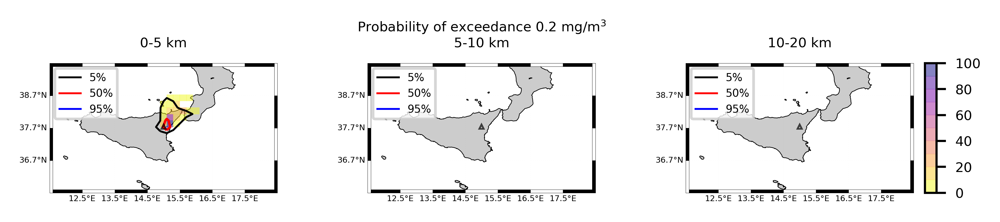

Forecast from VONA_20210304_0228Z
=================================

Contents
========

* [Forecast products](#forecast-products)
	* [Forecast at 2021-03-04 03:30 Z from RED VONA issued at 20210304_0228Z](#forecast-at-2021-03-04-0330-z-from-red-vona-issued-at-20210304_0228z)
	* [Forecast at 2021-03-04 04:30 Z from RED VONA issued at 20210304_0228Z](#forecast-at-2021-03-04-0430-z-from-red-vona-issued-at-20210304_0228z)
	* [Forecast at 2021-03-04 05:30 Z from RED VONA issued at 20210304_0228Z](#forecast-at-2021-03-04-0530-z-from-red-vona-issued-at-20210304_0228z)
	* [Forecast at 2021-03-04 08:30 Z from RED VONA issued at 20210304_0228Z](#forecast-at-2021-03-04-0830-z-from-red-vona-issued-at-20210304_0228z)
	* [Forecast at 2021-03-04 11:30 Z from RED VONA issued at 20210304_0228Z](#forecast-at-2021-03-04-1130-z-from-red-vona-issued-at-20210304_0228z)
	* [Forecast at 2021-03-04 14:30 Z from RED VONA issued at 20210304_0228Z](#forecast-at-2021-03-04-1430-z-from-red-vona-issued-at-20210304_0228z)
	* [Forecast at 2021-03-04 08:50 Z from RED VONA issued at 20210304_0751Z](#forecast-at-2021-03-04-0850-z-from-red-vona-issued-at-20210304_0751z)
	* [Forecast at 2021-03-04 09:00 Z from RED VONA issued at 20210304_0755Z](#forecast-at-2021-03-04-0900-z-from-red-vona-issued-at-20210304_0755z)
	* [Forecast at 2021-03-04 10:00 Z from RED VONA issued at 20210304_0755Z](#forecast-at-2021-03-04-1000-z-from-red-vona-issued-at-20210304_0755z)

# Forecast products

## Forecast at 2021-03-04 03:30 Z from RED VONA issued at 20210304_0228Z
  

|Eruption start [Z]|Eruption end [Z]|Forecast time [Z]|Column height asl [m]|
| :--- | :--- | :--- | :--- |
|2021-03-04 02:30:00|Ongoing|2021-03-04 03:30:00|5000 ± 500 - from VONA|
  
  

|Percentile|MER [kg/s¹]|Mass air [kg]|Mass air nested dom. [kg]|Mass grd [kg]|Mass grd nested dom. [kg]|
| :--- | :--- | :--- | :--- | :--- | :--- |
|5th|3.19e+02|6.17e+05|6.17e+05|9.11e+05|9.14e+05|
|50th|2.51e+03|2.07e+06|2.07e+06|6.86e+06|6.87e+06|
|95th|8.24e+03|9.37e+06|9.36e+06|1.96e+07|1.96e+07|
  

### Ground Nested Domain 2021-03-04 03:30 Z
  
  
  
  
  
  
  
  
  
  
  
  
  
  
  
  
  
  

|Location|Ground load [kg/m²] 5th perc|Ground load [kg/m²] 50th perc|Ground load [kg/m²] 95th perc|
| :--- | :--- | :--- | :--- |
|Piano Provenzana (1)|0.00e+00|2.05e-04|3.15e-02|
|Bivio Provenzana-Linguaglossa (2)|0.00e+00|1.40e-04|1.67e-02|
|Cunetta pre-Citelli (3)|0.00e+00|4.50e-04|4.42e-02|
|Chalet (4)|0.00e+00|0.00e+00|3.63e-04|
|Ragabo (5)|0.00e+00|0.00e+00|1.81e-03|
|Scilio (6)|0.00e+00|0.00e+00|1.91e-06|
|Gambino vini (7)|0.00e+00|0.00e+00|5.97e-06|
|StazioneFce Linguaglossa (8)|0.00e+00|0.00e+00|0.00e+00|
|Linguaglossa Via Olivio Sozzi (9)|0.00e+00|0.00e+00|0.00e+00|
|Cim.Linguaglossa (10)|0.00e+00|0.00e+00|0.00e+00|
|Gole Bar (11)|0.00e+00|0.00e+00|0.00e+00|
|Francavilla - Orange (12)|0.00e+00|0.00e+00|0.00e+00|
|Roccalumera1 (13)|0.00e+00|0.00e+00|0.00e+00|
|Roccalumera2 (14)|0.00e+00|0.00e+00|0.00e+00|
|Nizza (15)|0.00e+00|0.00e+00|0.00e+00|
|Scaletta Zanclea (16)|0.00e+00|0.00e+00|0.00e+00|
|Alì (17)|0.00e+00|0.00e+00|0.00e+00|
  

### Atmosphere 2021-03-04 03:30 Z
  

## Forecast at 2021-03-04 04:30 Z from RED VONA issued at 20210304_0228Z
  

|Eruption start [Z]|Eruption end [Z]|Forecast time [Z]|Column height asl [m]|
| :--- | :--- | :--- | :--- |
|2021-03-04 02:30:00|Ongoing|2021-03-04 04:30:00|5000 ± 500 - from VONA|
  
  

|Percentile|MER [kg/s¹]|Mass air [kg]|Mass air nested dom. [kg]|Mass grd [kg]|Mass grd nested dom. [kg]|
| :--- | :--- | :--- | :--- | :--- | :--- |
|5th|5.39e+02|1.38e+06|1.38e+06|5.31e+06|5.32e+06|
|50th|3.78e+03|3.63e+06|3.63e+06|1.92e+07|1.91e+07|
|95th|1.25e+04|2.00e+07|1.99e+07|4.92e+07|4.92e+07|
  

### Ground Nested Domain 2021-03-04 04:30 Z
  
  
  
  
  
  
  
  
  
  
  
  
  
  
  
  
  
  

|Location|Ground load [kg/m²] 5th perc|Ground load [kg/m²] 50th perc|Ground load [kg/m²] 95th perc|
| :--- | :--- | :--- | :--- |
|Piano Provenzana (1)|0.00e+00|1.24e-02|1.23e-01|
|Bivio Provenzana-Linguaglossa (2)|0.00e+00|5.43e-03|6.98e-02|
|Cunetta pre-Citelli (3)|0.00e+00|1.12e-02|1.56e-01|
|Chalet (4)|0.00e+00|6.98e-04|1.78e-02|
|Ragabo (5)|0.00e+00|1.47e-03|2.23e-02|
|Scilio (6)|0.00e+00|0.00e+00|2.74e-03|
|Gambino vini (7)|0.00e+00|0.00e+00|4.27e-03|
|StazioneFce Linguaglossa (8)|0.00e+00|0.00e+00|1.84e-03|
|Linguaglossa Via Olivio Sozzi (9)|0.00e+00|0.00e+00|1.07e-03|
|Cim.Linguaglossa (10)|0.00e+00|0.00e+00|1.09e-03|
|Gole Bar (11)|0.00e+00|0.00e+00|1.30e-05|
|Francavilla - Orange (12)|0.00e+00|0.00e+00|0.00e+00|
|Roccalumera1 (13)|0.00e+00|0.00e+00|0.00e+00|
|Roccalumera2 (14)|0.00e+00|0.00e+00|0.00e+00|
|Nizza (15)|0.00e+00|0.00e+00|0.00e+00|
|Scaletta Zanclea (16)|0.00e+00|0.00e+00|0.00e+00|
|Alì (17)|0.00e+00|0.00e+00|0.00e+00|
  

### Atmosphere 2021-03-04 04:30 Z
  

## Forecast at 2021-03-04 05:30 Z from RED VONA issued at 20210304_0228Z
  

|Eruption start [Z]|Eruption end [Z]|Forecast time [Z]|Column height asl [m]|
| :--- | :--- | :--- | :--- |
|2021-03-04 02:30:00|Ongoing|2021-03-04 05:30:00|5000 ± 500 - from VONA|
  
  

|Percentile|MER [kg/s¹]|Mass air [kg]|Mass air nested dom. [kg]|Mass grd [kg]|Mass grd nested dom. [kg]|
| :--- | :--- | :--- | :--- | :--- | :--- |
|5th|5.18e+02|8.51e+05|8.51e+05|1.17e+07|1.17e+07|
|50th|3.01e+03|5.90e+06|5.90e+06|3.54e+07|3.54e+07|
|95th|9.94e+03|1.52e+07|1.52e+07|6.93e+07|6.92e+07|
  

### Ground Nested Domain 2021-03-04 05:30 Z
  
  
  
  
  
  
  
  
  
  
  
  
  
  
  
  
  
  

|Location|Ground load [kg/m²] 5th perc|Ground load [kg/m²] 50th perc|Ground load [kg/m²] 95th perc|
| :--- | :--- | :--- | :--- |
|Piano Provenzana (1)|8.39e-03|6.02e-02|1.79e-01|
|Bivio Provenzana-Linguaglossa (2)|1.95e-03|1.67e-02|1.30e-01|
|Cunetta pre-Citelli (3)|3.15e-03|3.41e-02|2.14e-01|
|Chalet (4)|4.37e-04|2.49e-03|3.82e-02|
|Ragabo (5)|8.78e-04|3.87e-03|4.29e-02|
|Scilio (6)|0.00e+00|1.32e-05|6.17e-03|
|Gambino vini (7)|0.00e+00|1.79e-05|1.49e-02|
|StazioneFce Linguaglossa (8)|0.00e+00|2.91e-05|3.49e-03|
|Linguaglossa Via Olivio Sozzi (9)|0.00e+00|1.18e-05|3.26e-03|
|Cim.Linguaglossa (10)|0.00e+00|2.67e-07|3.76e-03|
|Gole Bar (11)|0.00e+00|0.00e+00|1.00e-04|
|Francavilla - Orange (12)|0.00e+00|0.00e+00|9.73e-04|
|Roccalumera1 (13)|0.00e+00|0.00e+00|0.00e+00|
|Roccalumera2 (14)|0.00e+00|0.00e+00|0.00e+00|
|Nizza (15)|0.00e+00|0.00e+00|0.00e+00|
|Scaletta Zanclea (16)|0.00e+00|0.00e+00|0.00e+00|
|Alì (17)|0.00e+00|0.00e+00|0.00e+00|
  

### Atmosphere 2021-03-04 05:30 Z
  

## Forecast at 2021-03-04 08:30 Z from RED VONA issued at 20210304_0228Z
  

|Eruption start [Z]|Eruption end [Z]|Forecast time [Z]|Column height asl [m]|
| :--- | :--- | :--- | :--- |
|2021-03-04 02:30:00|Ongoing|2021-03-04 08:30:00|5000 ± 500 - from VONA|
  
  

|Percentile|MER [kg/s¹]|Mass air [kg]|Mass air nested dom. [kg]|Mass grd [kg]|Mass grd nested dom. [kg]|
| :--- | :--- | :--- | :--- | :--- | :--- |
|5th|2.40e+02|1.12e+06|1.12e+06|2.46e+07|2.46e+07|
|50th|1.83e+03|5.24e+06|5.24e+06|6.16e+07|6.16e+07|
|95th|8.35e+03|1.47e+07|1.46e+07|9.52e+07|9.52e+07|
  

### Ground Nested Domain 2021-03-04 08:30 Z
  
  
  
  
  
  
  
  
  
  
  
  
  
  
  
  
  
  

|Location|Ground load [kg/m²] 5th perc|Ground load [kg/m²] 50th perc|Ground load [kg/m²] 95th perc|
| :--- | :--- | :--- | :--- |
|Piano Provenzana (1)|1.51e-02|1.09e-01|2.36e-01|
|Bivio Provenzana-Linguaglossa (2)|2.27e-03|4.87e-02|1.95e-01|
|Cunetta pre-Citelli (3)|3.39e-03|6.89e-02|4.28e-01|
|Chalet (4)|7.27e-04|1.99e-02|7.84e-02|
|Ragabo (5)|1.86e-03|2.76e-02|7.85e-02|
|Scilio (6)|0.00e+00|5.54e-03|1.80e-02|
|Gambino vini (7)|0.00e+00|8.90e-03|3.78e-02|
|StazioneFce Linguaglossa (8)|0.00e+00|2.07e-03|1.41e-02|
|Linguaglossa Via Olivio Sozzi (9)|0.00e+00|1.26e-03|1.38e-02|
|Cim.Linguaglossa (10)|0.00e+00|2.60e-03|9.59e-03|
|Gole Bar (11)|0.00e+00|4.36e-05|4.79e-03|
|Francavilla - Orange (12)|0.00e+00|1.94e-04|2.67e-03|
|Roccalumera1 (13)|0.00e+00|0.00e+00|0.00e+00|
|Roccalumera2 (14)|0.00e+00|0.00e+00|0.00e+00|
|Nizza (15)|0.00e+00|0.00e+00|0.00e+00|
|Scaletta Zanclea (16)|0.00e+00|0.00e+00|0.00e+00|
|Alì (17)|0.00e+00|0.00e+00|0.00e+00|
  

### Atmosphere 2021-03-04 08:30 Z
  

## Forecast at 2021-03-04 11:30 Z from RED VONA issued at 20210304_0228Z
  

|Eruption start [Z]|Eruption end [Z]|Forecast time [Z]|Column height asl [m]|
| :--- | :--- | :--- | :--- |
|2021-03-04 02:30:00|Ongoing|2021-03-04 11:30:00|5000 ± 500 - from VONA|
  
  

|Percentile|MER [kg/s¹]|Mass air [kg]|Mass air nested dom. [kg]|Mass grd [kg]|Mass grd nested dom. [kg]|
| :--- | :--- | :--- | :--- | :--- | :--- |
|5th|4.43e+02|3.53e+06|3.53e+06|5.07e+07|5.08e+07|
|50th|2.11e+03|6.56e+06|6.56e+06|9.12e+07|9.11e+07|
|95th|8.77e+03|1.71e+07|1.70e+07|1.48e+08|1.48e+08|
  

### Ground Nested Domain 2021-03-04 11:30 Z
  
  
  
  
  
  
  
  
  
  
  
  
  
  
  
  
  
  

|Location|Ground load [kg/m²] 5th perc|Ground load [kg/m²] 50th perc|Ground load [kg/m²] 95th perc|
| :--- | :--- | :--- | :--- |
|Piano Provenzana (1)|1.55e-02|1.43e-01|2.97e-01|
|Bivio Provenzana-Linguaglossa (2)|2.28e-03|9.92e-02|2.16e-01|
|Cunetta pre-Citelli (3)|4.54e-03|1.47e-01|4.70e-01|
|Chalet (4)|1.67e-03|4.33e-02|1.31e-01|
|Ragabo (5)|3.20e-03|6.39e-02|1.21e-01|
|Scilio (6)|1.91e-06|6.13e-03|2.46e-02|
|Gambino vini (7)|1.90e-06|1.02e-02|5.32e-02|
|StazioneFce Linguaglossa (8)|1.57e-06|3.30e-03|2.12e-02|
|Linguaglossa Via Olivio Sozzi (9)|4.18e-06|3.18e-03|1.62e-02|
|Cim.Linguaglossa (10)|0.00e+00|4.53e-03|1.53e-02|
|Gole Bar (11)|0.00e+00|2.52e-04|1.28e-02|
|Francavilla - Orange (12)|0.00e+00|6.86e-04|5.14e-03|
|Roccalumera1 (13)|0.00e+00|0.00e+00|7.77e-06|
|Roccalumera2 (14)|0.00e+00|0.00e+00|2.89e-06|
|Nizza (15)|0.00e+00|0.00e+00|8.13e-06|
|Scaletta Zanclea (16)|0.00e+00|0.00e+00|5.59e-06|
|Alì (17)|0.00e+00|0.00e+00|1.52e-05|
  

### Atmosphere 2021-03-04 11:30 Z
  

## Forecast at 2021-03-04 14:30 Z from RED VONA issued at 20210304_0228Z
  

|Eruption start [Z]|Eruption end [Z]|Forecast time [Z]|Column height asl [m]|
| :--- | :--- | :--- | :--- |
|2021-03-04 02:30:00|Ongoing|2021-03-04 14:30:00|5000 ± 500 - from VONA|
  
  

|Percentile|MER [kg/s¹]|Mass air [kg]|Mass air nested dom. [kg]|Mass grd [kg]|Mass grd nested dom. [kg]|
| :--- | :--- | :--- | :--- | :--- | :--- |
|5th|7.36e+02|3.82e+06|3.78e+06|8.35e+07|8.36e+07|
|50th|5.68e+03|1.21e+07|1.18e+07|1.59e+08|1.59e+08|
|95th|1.44e+04|4.96e+07|4.79e+07|2.56e+08|2.56e+08|
  

### Ground Nested Domain 2021-03-04 14:30 Z
  
  
  
  
  
  
  
  
  
  
  
  
  
  
  
  
  
  

|Location|Ground load [kg/m²] 5th perc|Ground load [kg/m²] 50th perc|Ground load [kg/m²] 95th perc|
| :--- | :--- | :--- | :--- |
|Piano Provenzana (1)|1.56e-02|2.46e-01|1.06e+00|
|Bivio Provenzana-Linguaglossa (2)|2.31e-03|1.53e-01|6.53e-01|
|Cunetta pre-Citelli (3)|4.54e-03|2.35e-01|9.20e-01|
|Chalet (4)|2.25e-03|6.59e-02|2.87e-01|
|Ragabo (5)|3.23e-03|8.49e-02|3.84e-01|
|Scilio (6)|9.42e-06|1.04e-02|4.91e-02|
|Gambino vini (7)|1.90e-06|1.50e-02|7.42e-02|
|StazioneFce Linguaglossa (8)|2.64e-05|9.67e-03|3.96e-02|
|Linguaglossa Via Olivio Sozzi (9)|3.92e-05|1.27e-02|4.64e-02|
|Cim.Linguaglossa (10)|7.73e-06|8.49e-03|3.80e-02|
|Gole Bar (11)|6.17e-06|1.13e-03|1.58e-02|
|Francavilla - Orange (12)|1.00e-05|3.08e-03|1.63e-02|
|Roccalumera1 (13)|0.00e+00|2.65e-06|7.07e-04|
|Roccalumera2 (14)|0.00e+00|0.00e+00|6.77e-04|
|Nizza (15)|0.00e+00|0.00e+00|5.11e-04|
|Scaletta Zanclea (16)|0.00e+00|0.00e+00|1.43e-04|
|Alì (17)|0.00e+00|0.00e+00|1.58e-04|
  

### Atmosphere 2021-03-04 14:30 Z
  

## Forecast at 2021-03-04 08:50 Z from RED VONA issued at 20210304_0751Z
  

|Eruption start [Z]|Eruption end [Z]|Forecast time [Z]|Column height asl [m]|
| :--- | :--- | :--- | :--- |
|2021-03-04 02:30:00|Ongoing|2021-03-04 08:50:00|6000 ± 500 - from VONA|
  
  

|Percentile|MER [kg/s¹]|Mass air [kg]|Mass air nested dom. [kg]|Mass grd [kg]|Mass grd nested dom. [kg]|
| :--- | :--- | :--- | :--- | :--- | :--- |
|5th|1.81e+03|4.42e+06|4.41e+06|3.83e+07|3.83e+07|
|50th|5.49e+03|1.09e+07|1.09e+07|7.64e+07|7.64e+07|
|95th|1.48e+04|2.32e+07|2.32e+07|1.20e+08|1.20e+08|
  

### Ground Nested Domain 2021-03-04 08:50 Z
  
  
  
  
  
  
  
  
  
  
  
  
  
  
  
  
  
  

|Location|Ground load [kg/m²] 5th perc|Ground load [kg/m²] 50th perc|Ground load [kg/m²] 95th perc|
| :--- | :--- | :--- | :--- |
|Piano Provenzana (1)|1.54e-02|1.19e-01|2.61e-01|
|Bivio Provenzana-Linguaglossa (2)|2.92e-03|5.13e-02|1.98e-01|
|Cunetta pre-Citelli (3)|3.39e-03|1.01e-01|3.98e-01|
|Chalet (4)|7.27e-04|2.53e-02|1.08e-01|
|Ragabo (5)|1.86e-03|3.13e-02|1.43e-01|
|Scilio (6)|0.00e+00|4.74e-03|2.72e-02|
|Gambino vini (7)|0.00e+00|8.90e-03|4.53e-02|
|StazioneFce Linguaglossa (8)|0.00e+00|1.95e-03|1.55e-02|
|Linguaglossa Via Olivio Sozzi (9)|0.00e+00|1.27e-03|1.39e-02|
|Cim.Linguaglossa (10)|0.00e+00|1.23e-03|1.32e-02|
|Gole Bar (11)|0.00e+00|3.99e-05|8.97e-03|
|Francavilla - Orange (12)|0.00e+00|2.64e-04|4.41e-03|
|Roccalumera1 (13)|0.00e+00|0.00e+00|0.00e+00|
|Roccalumera2 (14)|0.00e+00|0.00e+00|0.00e+00|
|Nizza (15)|0.00e+00|0.00e+00|0.00e+00|
|Scaletta Zanclea (16)|0.00e+00|0.00e+00|0.00e+00|
|Alì (17)|0.00e+00|0.00e+00|0.00e+00|
  

### Atmosphere 2021-03-04 08:50 Z
  

## Forecast at 2021-03-04 09:00 Z from RED VONA issued at 20210304_0755Z
  

|Eruption start [Z]|Eruption end [Z]|Forecast time [Z]|Column height asl [m]|
| :--- | :--- | :--- | :--- |
|2021-03-04 02:30:00|Ongoing|2021-03-04 09:00:00|6500 ± 500 - from VONA|
  
  

|Percentile|MER [kg/s¹]|Mass air [kg]|Mass air nested dom. [kg]|Mass grd [kg]|Mass grd nested dom. [kg]|
| :--- | :--- | :--- | :--- | :--- | :--- |
|5th|4.78e+03|7.99e+06|7.99e+06|4.47e+07|4.48e+07|
|50th|8.42e+03|1.31e+07|1.31e+07|9.07e+07|9.07e+07|
|95th|2.84e+04|4.69e+07|4.69e+07|1.47e+08|1.47e+08|
  

### Ground Nested Domain 2021-03-04 09:00 Z
  
  
  
  
  
  
  
  
  
  
  
  
  
  
  
  
  
  

|Location|Ground load [kg/m²] 5th perc|Ground load [kg/m²] 50th perc|Ground load [kg/m²] 95th perc|
| :--- | :--- | :--- | :--- |
|Piano Provenzana (1)|2.43e-02|1.36e-01|2.59e-01|
|Bivio Provenzana-Linguaglossa (2)|1.01e-02|1.17e-01|2.24e-01|
|Cunetta pre-Citelli (3)|1.31e-02|1.27e-01|5.52e-01|
|Chalet (4)|3.27e-03|2.60e-02|8.84e-02|
|Ragabo (5)|5.93e-03|4.14e-02|1.20e-01|
|Scilio (6)|0.00e+00|6.13e-03|2.80e-02|
|Gambino vini (7)|0.00e+00|1.01e-02|5.28e-02|
|StazioneFce Linguaglossa (8)|0.00e+00|1.95e-03|1.48e-02|
|Linguaglossa Via Olivio Sozzi (9)|0.00e+00|1.74e-03|1.71e-02|
|Cim.Linguaglossa (10)|0.00e+00|1.23e-03|1.53e-02|
|Gole Bar (11)|0.00e+00|1.49e-05|6.08e-03|
|Francavilla - Orange (12)|0.00e+00|2.61e-04|4.37e-03|
|Roccalumera1 (13)|0.00e+00|0.00e+00|2.47e-06|
|Roccalumera2 (14)|0.00e+00|0.00e+00|0.00e+00|
|Nizza (15)|0.00e+00|0.00e+00|0.00e+00|
|Scaletta Zanclea (16)|0.00e+00|0.00e+00|0.00e+00|
|Alì (17)|0.00e+00|0.00e+00|0.00e+00|
  

### Atmosphere 2021-03-04 09:00 Z
  

## Forecast at 2021-03-04 10:00 Z from RED VONA issued at 20210304_0755Z
  

|Eruption start [Z]|Eruption end [Z]|Forecast time [Z]|Column height asl [m]|
| :--- | :--- | :--- | :--- |
|2021-03-04 02:30:00|Ongoing|2021-03-04 10:00:00|6500 ± 500 - from VONA|
  
  

|Percentile|MER [kg/s¹]|Mass air [kg]|Mass air nested dom. [kg]|Mass grd [kg]|Mass grd nested dom. [kg]|
| :--- | :--- | :--- | :--- | :--- | :--- |
|5th|3.71e+03|7.00e+06|7.00e+06|9.17e+07|9.17e+07|
|50th|1.58e+04|1.37e+07|1.37e+07|1.48e+08|1.48e+08|
|95th|3.33e+04|4.59e+07|4.59e+07|2.01e+08|2.01e+08|
  

### Ground Nested Domain 2021-03-04 10:00 Z
  
  
  
  
  
  
  
  
  
  
  
  
  
  
  
  
  
  

|Location|Ground load [kg/m²] 5th perc|Ground load [kg/m²] 50th perc|Ground load [kg/m²] 95th perc|
| :--- | :--- | :--- | :--- |
|Piano Provenzana (1)|4.84e-02|1.84e-01|5.76e-01|
|Bivio Provenzana-Linguaglossa (2)|2.19e-02|1.20e-01|3.43e-01|
|Cunetta pre-Citelli (3)|5.65e-02|2.47e-01|7.51e-01|
|Chalet (4)|4.91e-03|2.70e-02|1.13e-01|
|Ragabo (5)|7.10e-03|4.69e-02|1.64e-01|
|Scilio (6)|1.91e-06|7.03e-03|2.80e-02|
|Gambino vini (7)|5.97e-06|1.23e-02|7.53e-02|
|StazioneFce Linguaglossa (8)|4.71e-06|2.53e-03|1.48e-02|
|Linguaglossa Via Olivio Sozzi (9)|1.25e-05|2.76e-03|1.71e-02|
|Cim.Linguaglossa (10)|0.00e+00|3.76e-03|2.20e-02|
|Gole Bar (11)|0.00e+00|4.01e-05|6.08e-03|
|Francavilla - Orange (12)|0.00e+00|2.64e-04|4.65e-03|
|Roccalumera1 (13)|0.00e+00|0.00e+00|2.47e-06|
|Roccalumera2 (14)|0.00e+00|0.00e+00|0.00e+00|
|Nizza (15)|0.00e+00|0.00e+00|0.00e+00|
|Scaletta Zanclea (16)|0.00e+00|0.00e+00|0.00e+00|
|Alì (17)|0.00e+00|0.00e+00|0.00e+00|
  

### Atmosphere 2021-03-04 10:00 Z
  
  
Go to [Supplementary page](Supplementary_page.md)  
Go to [Main directory](https://github.com/federicapardini/Real_time_ash_forecast)