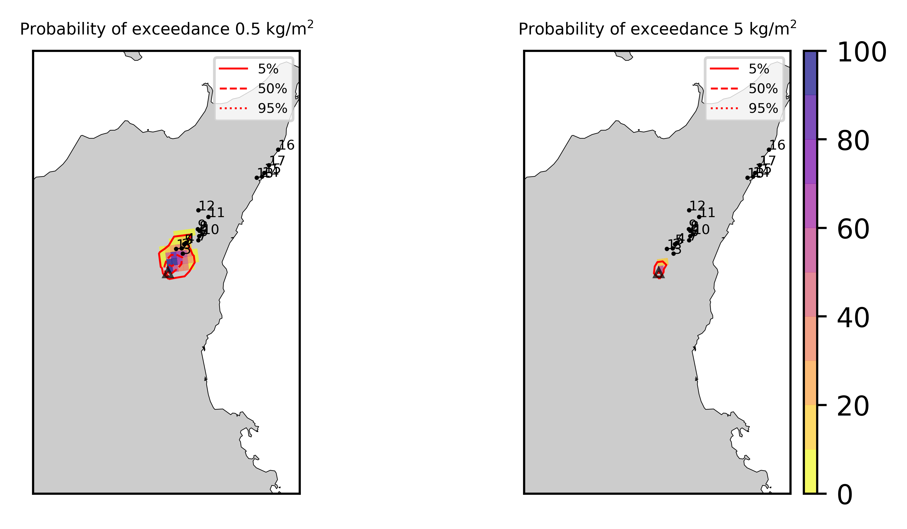

Forecast from VONA_20210304_0817Z
=================================

Contents
========

* [Forecast products](#forecast-products)
	* [Forecast at 2021-03-04 09:20 Z from RED VONA issued at 20210304_0817Z](#forecast-at-2021-03-04-0920-z-from-red-vona-issued-at-20210304_0817z)
	* [Forecast at 2021-03-04 10:20 Z from RED VONA issued at 20210304_0817Z](#forecast-at-2021-03-04-1020-z-from-red-vona-issued-at-20210304_0817z)

# Forecast products

## Forecast at 2021-03-04 09:20 Z from RED VONA issued at 20210304_0817Z
  

|Eruption start [Z]|Eruption end [Z]|Forecast time [Z]|Column height asl [m]|
| :--- | :--- | :--- | :--- |
|2021-03-04 08:20:00|Ongoing|2021-03-04 09:20:00|8000 ± 500 - from VONA|
  
  

|Percentile|MER [kg/s¹]|Mass air [kg]|Mass air nested dom. [kg]|Mass grd [kg]|Mass grd nested dom. [kg]|
| :--- | :--- | :--- | :--- | :--- | :--- |
|5th|1.51e+04|1.58e+07|1.57e+07|3.94e+07|3.94e+07|
|50th|3.90e+04|3.85e+07|3.85e+07|8.77e+07|8.77e+07|
|95th|8.96e+04|9.68e+07|9.66e+07|1.47e+08|1.46e+08|
  

### Ground Nested Domain 2021-03-04 09:20 Z
  
  
  
  
  
  
  
  
  
  
  
  
  
  
  
  
  
  

|Location|Ground load [kg/m²] 5th perc|Ground load [kg/m²] 50th perc|Ground load [kg/m²] 95th perc|
| :--- | :--- | :--- | :--- |
|Piano Provenzana (1)|2.36e-02|1.54e-01|1.35e+00|
|Bivio Provenzana-Linguaglossa (2)|5.86e-03|2.20e-01|1.34e+00|
|Cunetta pre-Citelli (3)|1.31e-02|3.42e-01|1.56e+00|
|Chalet (4)|5.23e-04|3.56e-02|6.41e-01|
|Ragabo (5)|1.39e-03|6.47e-02|7.97e-01|
|Scilio (6)|2.86e-06|5.43e-04|4.89e-02|
|Gambino vini (7)|8.96e-06|1.49e-03|8.87e-02|
|StazioneFce Linguaglossa (8)|0.00e+00|2.75e-05|2.09e-02|
|Linguaglossa Via Olivio Sozzi (9)|0.00e+00|2.47e-05|2.34e-02|
|Cim.Linguaglossa (10)|0.00e+00|3.81e-05|2.60e-02|
|Gole Bar (11)|0.00e+00|0.00e+00|2.29e-04|
|Francavilla - Orange (12)|0.00e+00|0.00e+00|1.57e-03|
|Roccalumera1 (13)|0.00e+00|0.00e+00|0.00e+00|
|Roccalumera2 (14)|0.00e+00|0.00e+00|0.00e+00|
|Nizza (15)|0.00e+00|0.00e+00|0.00e+00|
|Scaletta Zanclea (16)|0.00e+00|0.00e+00|0.00e+00|
|Alì (17)|0.00e+00|0.00e+00|0.00e+00|
  

### Atmosphere 2021-03-04 09:20 Z
  

## Forecast at 2021-03-04 10:20 Z from RED VONA issued at 20210304_0817Z
  

|Eruption start [Z]|Eruption end [Z]|Forecast time [Z]|Column height asl [m]|
| :--- | :--- | :--- | :--- |
|2021-03-04 08:20:00|Ongoing|2021-03-04 10:20:00|8000 ± 500 - from VONA|
  
  

|Percentile|MER [kg/s¹]|Mass air [kg]|Mass air nested dom. [kg]|Mass grd [kg]|Mass grd nested dom. [kg]|
| :--- | :--- | :--- | :--- | :--- | :--- |
|5th|1.59e+04|3.30e+07|3.30e+07|1.16e+08|1.16e+08|
|50th|4.78e+04|6.17e+07|6.16e+07|2.35e+08|2.35e+08|
|95th|9.98e+04|1.14e+08|1.14e+08|4.20e+08|4.19e+08|
  

### Ground Nested Domain 2021-03-04 10:20 Z
  
  
  
  
  
  
  
  
  
  
  
  
  
  
  
  
  
  

|Location|Ground load [kg/m²] 5th perc|Ground load [kg/m²] 50th perc|Ground load [kg/m²] 95th perc|
| :--- | :--- | :--- | :--- |
|Piano Provenzana (1)|3.40e-01|1.10e+00|3.23e+00|
|Bivio Provenzana-Linguaglossa (2)|3.18e-01|8.96e-01|3.57e+00|
|Cunetta pre-Citelli (3)|3.57e-01|1.43e+00|4.01e+00|
|Chalet (4)|1.25e-01|3.94e-01|2.16e+00|
|Ragabo (5)|1.80e-01|5.03e-01|2.51e+00|
|Scilio (6)|1.67e-03|6.68e-02|2.85e-01|
|Gambino vini (7)|3.91e-03|1.03e-01|4.46e-01|
|StazioneFce Linguaglossa (8)|2.04e-04|2.79e-02|1.80e-01|
|Linguaglossa Via Olivio Sozzi (9)|3.16e-04|2.78e-02|2.02e-01|
|Cim.Linguaglossa (10)|1.37e-04|3.13e-02|1.99e-01|
|Gole Bar (11)|0.00e+00|9.06e-04|8.13e-02|
|Francavilla - Orange (12)|0.00e+00|4.88e-04|5.50e-02|
|Roccalumera1 (13)|0.00e+00|0.00e+00|1.36e-05|
|Roccalumera2 (14)|0.00e+00|0.00e+00|1.05e-06|
|Nizza (15)|0.00e+00|0.00e+00|0.00e+00|
|Scaletta Zanclea (16)|0.00e+00|0.00e+00|0.00e+00|
|Alì (17)|0.00e+00|0.00e+00|0.00e+00|
  

### Atmosphere 2021-03-04 10:20 Z
  
  
Go to [Supplementary page](Supplementary_page.md)  
Go to [Main directory](https://github.com/federicapardini/Real_time_ash_forecast)