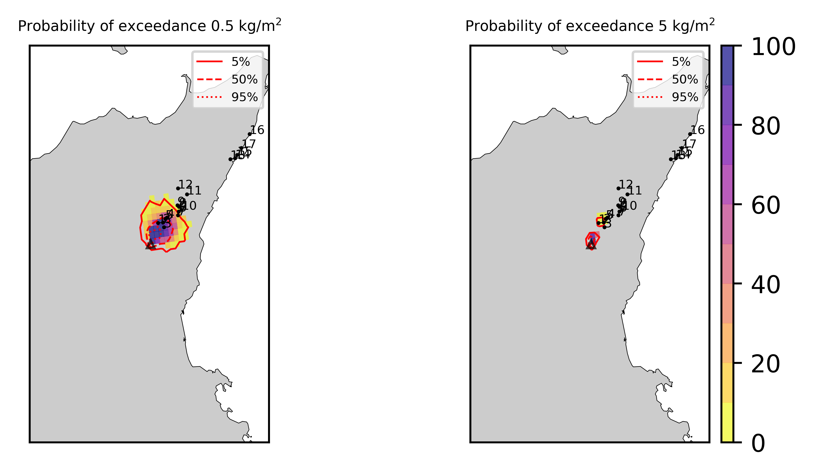

Forecast from VONA_20210304_0817Z
=================================

Contents
========

* [Forecast products](#forecast-products)
	* [Forecast at 2021-03-04 09:20 Z from RED VONA issued at 20210304_0817Z](#forecast-at-2021-03-04-0920-z-from-red-vona-issued-at-20210304_0817z)
	* [Forecast at 2021-03-04 10:20 Z from RED VONA issued at 20210304_0817Z](#forecast-at-2021-03-04-1020-z-from-red-vona-issued-at-20210304_0817z)

# Forecast products

## Forecast at 2021-03-04 09:20 Z from RED VONA issued at 20210304_0817Z
  

|Eruption start [Z]|Eruption end [Z]|Forecast time [Z]|Column height asl [m]|
| :--- | :--- | :--- | :--- |
|2021-03-04 08:20:00|Ongoing|2021-03-04 09:20:00|[5000 m, 15000 m]|
  
  

|Percentile|MER [kg/s¹]|Mass air [kg]|Mass air nested dom. [kg]|Mass grd [kg]|Mass grd nested dom. [kg]|
| :--- | :--- | :--- | :--- | :--- | :--- |
|5th|4.60e+04|7.09e+07|7.09e+07|1.29e+08|1.29e+08|
|50th|6.42e+04|7.09e+07|7.09e+07|1.29e+08|1.29e+08|
|95th|8.23e+04|7.09e+07|7.09e+07|1.29e+08|1.29e+08|
  

### Ground Nested Domain 2021-03-04 09:20 Z
  
  
  
  
  
  
  
  
  
  
  
  
  
  
  
  
  
  

|Location|Ground load [kg/m²] 5th perc|Ground load [kg/m²] 50th perc|Ground load [kg/m²] 95th perc|
| :--- | :--- | :--- | :--- |
|Piano Provenzana (1)|2.31e+00|2.31e+00|2.31e+00|
|Bivio Provenzana-Linguaglossa (2)|1.14e+00|1.14e+00|1.14e+00|
|Cunetta pre-Citelli (3)|8.75e-01|8.75e-01|8.75e-01|
|Chalet (4)|3.08e-01|3.08e-01|3.08e-01|
|Ragabo (5)|5.97e-01|5.97e-01|5.97e-01|
|Scilio (6)|4.55e-03|4.55e-03|4.55e-03|
|Gambino vini (7)|9.36e-03|9.36e-03|9.36e-03|
|StazioneFce Linguaglossa (8)|1.03e-03|1.03e-03|1.03e-03|
|Linguaglossa Via Olivio Sozzi (9)|1.29e-03|1.29e-03|1.29e-03|
|Cim.Linguaglossa (10)|8.76e-04|8.76e-04|8.76e-04|
|Gole Bar (11)|0.00e+00|0.00e+00|0.00e+00|
|Francavilla - Orange (12)|3.93e-06|3.93e-06|3.93e-06|
|Roccalumera1 (13)|0.00e+00|0.00e+00|0.00e+00|
|Roccalumera2 (14)|0.00e+00|0.00e+00|0.00e+00|
|Nizza (15)|0.00e+00|0.00e+00|0.00e+00|
|Scaletta Zanclea (16)|0.00e+00|0.00e+00|0.00e+00|
|Alì (17)|0.00e+00|0.00e+00|0.00e+00|
  

### Atmosphere 2021-03-04 09:20 Z
  

## Forecast at 2021-03-04 10:20 Z from RED VONA issued at 20210304_0817Z
  

|Eruption start [Z]|Eruption end [Z]|Forecast time [Z]|Column height asl [m]|
| :--- | :--- | :--- | :--- |
|2021-03-04 08:20:00|Ongoing|2021-03-04 10:20:00|[5000 m, 15000 m]|
  
  

|Percentile|MER [kg/s¹]|Mass air [kg]|Mass air nested dom. [kg]|Mass grd [kg]|Mass grd nested dom. [kg]|
| :--- | :--- | :--- | :--- | :--- | :--- |
|5th|1.01e+06|1.84e+09|1.84e+09|1.89e+09|1.88e+09|
|50th|1.01e+06|1.84e+09|1.84e+09|1.89e+09|1.88e+09|
|95th|1.01e+06|1.84e+09|1.84e+09|1.89e+09|1.88e+09|
  

### Ground Nested Domain 2021-03-04 10:20 Z
  
  
  
  
  
  
  
  
  
  
  
  
  
  
  
  
  
  

|Location|Ground load [kg/m²] 5th perc|Ground load [kg/m²] 50th perc|Ground load [kg/m²] 95th perc|
| :--- | :--- | :--- | :--- |
|Piano Provenzana (1)|9.31e+00|9.31e+00|9.31e+00|
|Bivio Provenzana-Linguaglossa (2)|6.67e+00|6.67e+00|6.67e+00|
|Cunetta pre-Citelli (3)|5.31e+00|5.31e+00|5.31e+00|
|Chalet (4)|5.78e+00|5.78e+00|5.78e+00|
|Ragabo (5)|6.38e+00|6.38e+00|6.38e+00|
|Scilio (6)|2.98e+00|2.98e+00|2.98e+00|
|Gambino vini (7)|3.32e+00|3.32e+00|3.32e+00|
|StazioneFce Linguaglossa (8)|2.61e+00|2.61e+00|2.61e+00|
|Linguaglossa Via Olivio Sozzi (9)|2.71e+00|2.71e+00|2.71e+00|
|Cim.Linguaglossa (10)|2.43e+00|2.43e+00|2.43e+00|
|Gole Bar (11)|1.01e+00|1.01e+00|1.01e+00|
|Francavilla - Orange (12)|1.84e+00|1.84e+00|1.84e+00|
|Roccalumera1 (13)|0.00e+00|0.00e+00|0.00e+00|
|Roccalumera2 (14)|0.00e+00|0.00e+00|0.00e+00|
|Nizza (15)|0.00e+00|0.00e+00|0.00e+00|
|Scaletta Zanclea (16)|0.00e+00|0.00e+00|0.00e+00|
|Alì (17)|0.00e+00|0.00e+00|0.00e+00|
  

### Atmosphere 2021-03-04 10:20 Z
  
  
Go to [Supplementary page](Supplementary_page.md)  
Go to [Main directory](https://github.com/federicapardini/Real_time_ash_forecast)