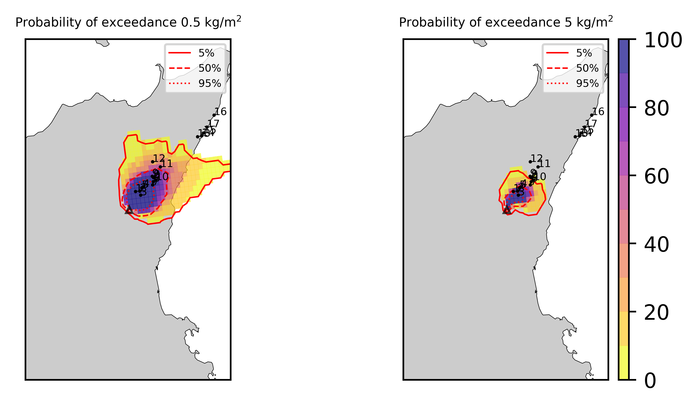
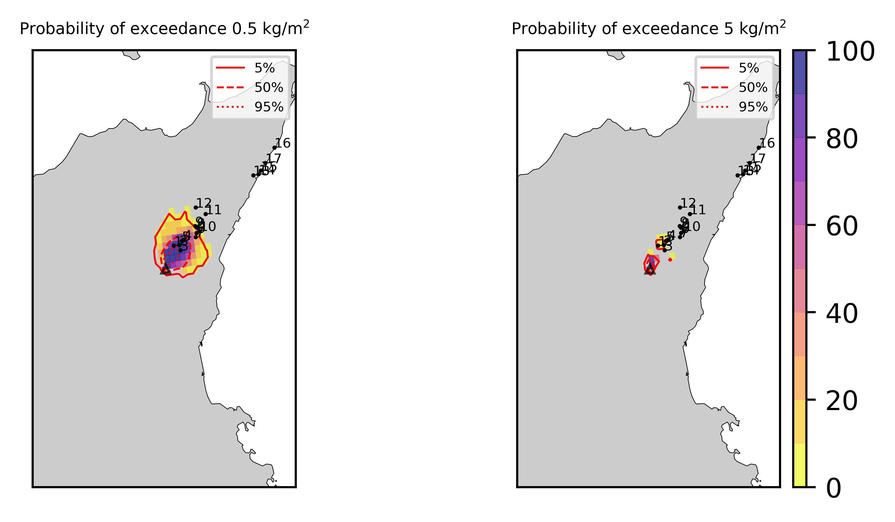

Forecast from VONA_20210304_0817Z
=================================

Contents
========

* [Forecast products](#forecast-products)
	* [Forecast at 2021-03-04 09:20 Z from RED VONA issued at 20210304_0817Z](#forecast-at-2021-03-04-0920-z-from-red-vona-issued-at-20210304_0817z)
	* [Forecast at 2021-03-04 10:20 Z from RED VONA issued at 20210304_0817Z](#forecast-at-2021-03-04-1020-z-from-red-vona-issued-at-20210304_0817z)
	* [Forecast at 2021-03-04 11:20 Z from RED VONA issued at 20210304_0817Z](#forecast-at-2021-03-04-1120-z-from-red-vona-issued-at-20210304_0817z)
	* [Forecast at 2021-03-04 14:20 Z from RED VONA issued at 20210304_0817Z](#forecast-at-2021-03-04-1420-z-from-red-vona-issued-at-20210304_0817z)
	* [Forecast at 2021-03-04 17:20 Z from RED VONA issued at 20210304_0817Z](#forecast-at-2021-03-04-1720-z-from-red-vona-issued-at-20210304_0817z)
	* [Forecast at 2021-03-04 20:20 Z from RED VONA issued at 20210304_0817Z](#forecast-at-2021-03-04-2020-z-from-red-vona-issued-at-20210304_0817z)
	* [Forecast at 2021-03-04 13:20 Z from ORANGE VONA issued at 20210304_1016Z](#forecast-at-2021-03-04-1320-z-from-orange-vona-issued-at-20210304_1016z)

# Forecast products

## Forecast at 2021-03-04 09:20 Z from RED VONA issued at 20210304_0817Z
  

|Eruption start [Z]|Eruption end [Z]|Forecast time [Z]|Column height asl [m]|
| :--- | :--- | :--- | :--- |
|2021-03-04 08:20:00|Ongoing|2021-03-04 09:20:00|8000 ± 500 - from VONA|
  
  

|Percentile|MER [kg/s¹]|Mass air [kg]|Mass air nested dom. [kg]|Mass grd [kg]|Mass grd nested dom. [kg]|
| :--- | :--- | :--- | :--- | :--- | :--- |
|5th|1.51e+04|1.58e+07|1.57e+07|3.94e+07|3.94e+07|
|50th|3.90e+04|3.85e+07|3.85e+07|8.77e+07|8.77e+07|
|95th|8.96e+04|9.68e+07|9.66e+07|1.47e+08|1.46e+08|
  

### Ground Nested Domain 2021-03-04 09:20 Z
  
  
  
  
  
  
  
  
  
  
  
  
  
  
  
  
  
  

|Location|Ground load [kg/m²] 5th perc|Ground load [kg/m²] 50th perc|Ground load [kg/m²] 95th perc|
| :--- | :--- | :--- | :--- |
|Piano Provenzana (1)|2.36e-02|1.54e-01|1.35e+00|
|Bivio Provenzana-Linguaglossa (2)|5.86e-03|2.20e-01|1.34e+00|
|Cunetta pre-Citelli (3)|1.31e-02|3.42e-01|1.56e+00|
|Chalet (4)|5.23e-04|3.56e-02|6.41e-01|
|Ragabo (5)|1.39e-03|6.47e-02|7.97e-01|
|Scilio (6)|2.86e-06|5.43e-04|4.89e-02|
|Gambino vini (7)|8.96e-06|1.49e-03|8.87e-02|
|StazioneFce Linguaglossa (8)|0.00e+00|2.75e-05|2.09e-02|
|Linguaglossa Via Olivio Sozzi (9)|0.00e+00|2.47e-05|2.34e-02|
|Cim.Linguaglossa (10)|0.00e+00|3.81e-05|2.60e-02|
|Gole Bar (11)|0.00e+00|0.00e+00|2.29e-04|
|Francavilla - Orange (12)|0.00e+00|0.00e+00|1.57e-03|
|Roccalumera1 (13)|0.00e+00|0.00e+00|0.00e+00|
|Roccalumera2 (14)|0.00e+00|0.00e+00|0.00e+00|
|Nizza (15)|0.00e+00|0.00e+00|0.00e+00|
|Scaletta Zanclea (16)|0.00e+00|0.00e+00|0.00e+00|
|Alì (17)|0.00e+00|0.00e+00|0.00e+00|
  

### Atmosphere 2021-03-04 09:20 Z
  

## Forecast at 2021-03-04 10:20 Z from RED VONA issued at 20210304_0817Z
  

|Eruption start [Z]|Eruption end [Z]|Forecast time [Z]|Column height asl [m]|
| :--- | :--- | :--- | :--- |
|2021-03-04 08:20:00|Ongoing|2021-03-04 10:20:00|8000 ± 500 - from VONA|
  
  

|Percentile|MER [kg/s¹]|Mass air [kg]|Mass air nested dom. [kg]|Mass grd [kg]|Mass grd nested dom. [kg]|
| :--- | :--- | :--- | :--- | :--- | :--- |
|5th|1.59e+04|3.30e+07|3.30e+07|1.16e+08|1.16e+08|
|50th|4.78e+04|6.17e+07|6.16e+07|2.35e+08|2.35e+08|
|95th|9.98e+04|1.14e+08|1.14e+08|4.20e+08|4.19e+08|
  

### Ground Nested Domain 2021-03-04 10:20 Z
  
  
  
  
  
  
  
  
  
  
  
  
  
  
  
  
  
  

|Location|Ground load [kg/m²] 5th perc|Ground load [kg/m²] 50th perc|Ground load [kg/m²] 95th perc|
| :--- | :--- | :--- | :--- |
|Piano Provenzana (1)|3.40e-01|1.10e+00|3.23e+00|
|Bivio Provenzana-Linguaglossa (2)|3.18e-01|8.96e-01|3.57e+00|
|Cunetta pre-Citelli (3)|3.57e-01|1.43e+00|4.01e+00|
|Chalet (4)|1.25e-01|3.94e-01|2.16e+00|
|Ragabo (5)|1.80e-01|5.03e-01|2.51e+00|
|Scilio (6)|1.67e-03|6.68e-02|2.85e-01|
|Gambino vini (7)|3.91e-03|1.03e-01|4.46e-01|
|StazioneFce Linguaglossa (8)|2.04e-04|2.79e-02|1.80e-01|
|Linguaglossa Via Olivio Sozzi (9)|3.16e-04|2.78e-02|2.02e-01|
|Cim.Linguaglossa (10)|1.37e-04|3.13e-02|1.99e-01|
|Gole Bar (11)|0.00e+00|9.06e-04|8.13e-02|
|Francavilla - Orange (12)|0.00e+00|4.88e-04|5.50e-02|
|Roccalumera1 (13)|0.00e+00|0.00e+00|1.36e-05|
|Roccalumera2 (14)|0.00e+00|0.00e+00|1.05e-06|
|Nizza (15)|0.00e+00|0.00e+00|0.00e+00|
|Scaletta Zanclea (16)|0.00e+00|0.00e+00|0.00e+00|
|Alì (17)|0.00e+00|0.00e+00|0.00e+00|
  

### Atmosphere 2021-03-04 10:20 Z
  

## Forecast at 2021-03-04 11:20 Z from RED VONA issued at 20210304_0817Z
  

|Eruption start [Z]|Eruption end [Z]|Forecast time [Z]|Column height asl [m]|
| :--- | :--- | :--- | :--- |
|2021-03-04 08:20:00|Ongoing|2021-03-04 11:20:00|8000 ± 500 - from VONA|
  
  

|Percentile|MER [kg/s¹]|Mass air [kg]|Mass air nested dom. [kg]|Mass grd [kg]|Mass grd nested dom. [kg]|
| :--- | :--- | :--- | :--- | :--- | :--- |
|5th|1.15e+04|3.04e+07|3.03e+07|2.67e+08|2.67e+08|
|50th|4.84e+04|7.75e+07|7.75e+07|3.93e+08|3.93e+08|
|95th|1.21e+05|1.79e+08|1.77e+08|6.47e+08|6.47e+08|
  

### Ground Nested Domain 2021-03-04 11:20 Z
  
  
  
  
  
  
  
  
  
  
  
  
  
  
  
  
  
  

|Location|Ground load [kg/m²] 5th perc|Ground load [kg/m²] 50th perc|Ground load [kg/m²] 95th perc|
| :--- | :--- | :--- | :--- |
|Piano Provenzana (1)|1.23e+00|2.12e+00|5.88e+00|
|Bivio Provenzana-Linguaglossa (2)|1.03e+00|1.91e+00|6.46e+00|
|Cunetta pre-Citelli (3)|8.99e-01|3.02e+00|6.06e+00|
|Chalet (4)|4.10e-01|9.06e-01|4.08e+00|
|Ragabo (5)|5.95e-01|1.04e+00|4.83e+00|
|Scilio (6)|8.61e-03|3.38e-01|6.54e-01|
|Gambino vini (7)|1.36e-02|3.47e-01|9.33e-01|
|StazioneFce Linguaglossa (8)|5.14e-03|2.27e-01|4.66e-01|
|Linguaglossa Via Olivio Sozzi (9)|1.05e-02|2.00e-01|4.80e-01|
|Cim.Linguaglossa (10)|1.19e-03|1.97e-01|5.66e-01|
|Gole Bar (11)|3.68e-05|4.97e-02|2.13e-01|
|Francavilla - Orange (12)|1.89e-03|2.40e-02|1.30e-01|
|Roccalumera1 (13)|0.00e+00|0.00e+00|1.15e-02|
|Roccalumera2 (14)|0.00e+00|0.00e+00|1.77e-02|
|Nizza (15)|0.00e+00|0.00e+00|2.16e-02|
|Scaletta Zanclea (16)|0.00e+00|0.00e+00|3.58e-06|
|Alì (17)|0.00e+00|0.00e+00|4.53e-03|
  

### Atmosphere 2021-03-04 11:20 Z
  

## Forecast at 2021-03-04 14:20 Z from RED VONA issued at 20210304_0817Z
  

|Eruption start [Z]|Eruption end [Z]|Forecast time [Z]|Column height asl [m]|
| :--- | :--- | :--- | :--- |
|2021-03-04 08:20:00|Ongoing|2021-03-04 14:20:00|8000 ± 500 - from VONA|
  
  

|Percentile|MER [kg/s¹]|Mass air [kg]|Mass air nested dom. [kg]|Mass grd [kg]|Mass grd nested dom. [kg]|
| :--- | :--- | :--- | :--- | :--- | :--- |
|5th|1.40e+04|4.26e+07|4.16e+07|6.64e+08|6.63e+08|
|50th|6.65e+04|1.63e+08|1.58e+08|1.13e+09|1.13e+09|
|95th|1.42e+05|4.00e+08|3.60e+08|1.72e+09|1.72e+09|
  

### Ground Nested Domain 2021-03-04 14:20 Z
  
  
  
  
  
  
  
  
  
  
  
  
  
  
  
  
  
  

|Location|Ground load [kg/m²] 5th perc|Ground load [kg/m²] 50th perc|Ground load [kg/m²] 95th perc|
| :--- | :--- | :--- | :--- |
|Piano Provenzana (1)|2.43e+00|5.82e+00|1.05e+01|
|Bivio Provenzana-Linguaglossa (2)|2.70e+00|5.84e+00|1.07e+01|
|Cunetta pre-Citelli (3)|3.44e+00|8.60e+00|1.21e+01|
|Chalet (4)|1.27e+00|3.11e+00|7.44e+00|
|Ragabo (5)|1.45e+00|3.54e+00|8.45e+00|
|Scilio (6)|3.45e-01|9.76e-01|3.07e+00|
|Gambino vini (7)|3.95e-01|1.53e+00|3.64e+00|
|StazioneFce Linguaglossa (8)|2.99e-01|6.24e-01|2.19e+00|
|Linguaglossa Via Olivio Sozzi (9)|2.58e-01|5.74e-01|1.95e+00|
|Cim.Linguaglossa (10)|2.60e-01|7.06e-01|2.22e+00|
|Gole Bar (11)|1.00e-01|2.95e-01|7.87e-01|
|Francavilla - Orange (12)|2.86e-02|1.72e-01|7.29e-01|
|Roccalumera1 (13)|0.00e+00|7.00e-03|6.86e-02|
|Roccalumera2 (14)|0.00e+00|3.21e-03|7.24e-02|
|Nizza (15)|0.00e+00|2.53e-03|7.05e-02|
|Scaletta Zanclea (16)|0.00e+00|2.03e-03|5.07e-02|
|Alì (17)|0.00e+00|2.59e-03|5.38e-02|
  

### Atmosphere 2021-03-04 14:20 Z
  

## Forecast at 2021-03-04 17:20 Z from RED VONA issued at 20210304_0817Z
  

|Eruption start [Z]|Eruption end [Z]|Forecast time [Z]|Column height asl [m]|
| :--- | :--- | :--- | :--- |
|2021-03-04 08:20:00|Ongoing|2021-03-04 17:20:00|8000 ± 500 - from VONA|
  
  

|Percentile|MER [kg/s¹]|Mass air [kg]|Mass air nested dom. [kg]|Mass grd [kg]|Mass grd nested dom. [kg]|
| :--- | :--- | :--- | :--- | :--- | :--- |
|5th|1.25e+04|5.48e+07|5.31e+07|1.15e+09|1.15e+09|
|50th|6.55e+04|1.64e+08|1.35e+08|1.82e+09|1.81e+09|
|95th|2.11e+05|3.37e+08|2.50e+08|3.17e+09|3.14e+09|
  

### Ground Nested Domain 2021-03-04 17:20 Z
  
  
  
  
  
  
  
  
  
  
  
  
  
  
  
  
  
  

|Location|Ground load [kg/m²] 5th perc|Ground load [kg/m²] 50th perc|Ground load [kg/m²] 95th perc|
| :--- | :--- | :--- | :--- |
|Piano Provenzana (1)|4.45e+00|7.69e+00|1.51e+01|
|Bivio Provenzana-Linguaglossa (2)|4.83e+00|8.90e+00|1.65e+01|
|Cunetta pre-Citelli (3)|7.03e+00|1.19e+01|1.91e+01|
|Chalet (4)|2.38e+00|5.09e+00|1.42e+01|
|Ragabo (5)|2.74e+00|5.67e+00|1.53e+01|
|Scilio (6)|5.67e-01|1.87e+00|5.71e+00|
|Gambino vini (7)|8.06e-01|2.84e+00|7.33e+00|
|StazioneFce Linguaglossa (8)|4.43e-01|1.38e+00|3.97e+00|
|Linguaglossa Via Olivio Sozzi (9)|4.64e-01|1.28e+00|3.58e+00|
|Cim.Linguaglossa (10)|4.28e-01|1.46e+00|4.33e+00|
|Gole Bar (11)|2.43e-01|4.31e-01|1.29e+00|
|Francavilla - Orange (12)|9.83e-02|2.87e-01|1.03e+00|
|Roccalumera1 (13)|2.05e-03|3.56e-02|2.83e-01|
|Roccalumera2 (14)|2.36e-03|2.84e-02|2.90e-01|
|Nizza (15)|1.91e-03|2.41e-02|2.71e-01|
|Scaletta Zanclea (16)|5.57e-05|1.42e-02|1.20e-01|
|Alì (17)|1.49e-03|1.96e-02|1.99e-01|
  

### Atmosphere 2021-03-04 17:20 Z
  

## Forecast at 2021-03-04 20:20 Z from RED VONA issued at 20210304_0817Z
  

|Eruption start [Z]|Eruption end [Z]|Forecast time [Z]|Column height asl [m]|
| :--- | :--- | :--- | :--- |
|2021-03-04 08:20:00|Ongoing|2021-03-04 20:20:00|8000 ± 500 - from VONA|
  
  

|Percentile|MER [kg/s¹]|Mass air [kg]|Mass air nested dom. [kg]|Mass grd [kg]|Mass grd nested dom. [kg]|
| :--- | :--- | :--- | :--- | :--- | :--- |
|5th|1.32e+04|1.11e+08|7.22e+07|1.64e+09|1.64e+09|
|50th|6.06e+04|1.66e+08|1.33e+08|2.64e+09|2.61e+09|
|95th|1.01e+05|3.61e+08|2.49e+08|3.53e+09|3.47e+09|
  

### Ground Nested Domain 2021-03-04 20:20 Z
  
  
  
  
  
  
  
  
  
  
  
  
  
  
  
  
  
  

|Location|Ground load [kg/m²] 5th perc|Ground load [kg/m²] 50th perc|Ground load [kg/m²] 95th perc|
| :--- | :--- | :--- | :--- |
|Piano Provenzana (1)|5.69e+00|9.67e+00|1.76e+01|
|Bivio Provenzana-Linguaglossa (2)|7.15e+00|1.14e+01|1.91e+01|
|Cunetta pre-Citelli (3)|1.03e+01|1.57e+01|2.25e+01|
|Chalet (4)|3.20e+00|6.60e+00|1.58e+01|
|Ragabo (5)|3.90e+00|7.48e+00|1.65e+01|
|Scilio (6)|1.16e+00|3.55e+00|6.11e+00|
|Gambino vini (7)|1.38e+00|4.73e+00|7.84e+00|
|StazioneFce Linguaglossa (8)|1.12e+00|2.21e+00|4.37e+00|
|Linguaglossa Via Olivio Sozzi (9)|1.00e+00|2.38e+00|4.24e+00|
|Cim.Linguaglossa (10)|9.47e-01|2.51e+00|4.70e+00|
|Gole Bar (11)|4.44e-01|1.05e+00|1.72e+00|
|Francavilla - Orange (12)|1.44e-01|5.50e-01|1.14e+00|
|Roccalumera1 (13)|1.12e-02|1.04e-01|3.08e-01|
|Roccalumera2 (14)|1.41e-02|1.02e-01|3.38e-01|
|Nizza (15)|8.93e-03|9.30e-02|2.94e-01|
|Scaletta Zanclea (16)|2.64e-04|4.69e-02|1.58e-01|
|Alì (17)|3.88e-03|7.63e-02|2.20e-01|
  

### Atmosphere 2021-03-04 20:20 Z
  

## Forecast at 2021-03-04 13:20 Z from ORANGE VONA issued at 20210304_1016Z
  

|Eruption start [Z]|Eruption end [Z]|Forecast time [Z]|Column height asl [m]|
| :--- | :--- | :--- | :--- |
|2021-03-04 08:20:00|2021-03-04 10:20:00|2021-03-04 13:20:00|8000.0 ± 500 - from VONA|
  
  

|Percentile|MER [kg/s¹]|Mass air [kg]|Mass air nested dom. [kg]|Mass grd [kg]|Mass grd nested dom. [kg]|
| :--- | :--- | :--- | :--- | :--- | :--- |
|5th|1.30e+04|1.77e+06|1.23e+06|1.54e+08|1.54e+08|
|50th|5.13e+04|1.36e+07|1.10e+07|2.77e+08|2.77e+08|
|95th|1.12e+05|3.10e+07|2.55e+07|4.98e+08|4.98e+08|
  

### Ground Nested Domain 2021-03-04 13:20 Z
  
  
  
  
  
  
  
  
  
  
  
  
  
  
  
  
  
  

|Location|Ground load [kg/m²] 5th perc|Ground load [kg/m²] 50th perc|Ground load [kg/m²] 95th perc|
| :--- | :--- | :--- | :--- |
|Piano Provenzana (1)|5.21e-01|1.38e+00|3.70e+00|
|Bivio Provenzana-Linguaglossa (2)|5.32e-01|1.12e+00|4.21e+00|
|Cunetta pre-Citelli (3)|4.85e-01|1.68e+00|4.60e+00|
|Chalet (4)|2.42e-01|6.77e-01|2.59e+00|
|Ragabo (5)|3.59e-01|7.25e-01|3.01e+00|
|Scilio (6)|9.24e-03|1.95e-01|4.86e-01|
|Gambino vini (7)|1.16e-02|2.56e-01|5.83e-01|
|StazioneFce Linguaglossa (8)|1.35e-02|1.34e-01|4.25e-01|
|Linguaglossa Via Olivio Sozzi (9)|1.60e-02|1.41e-01|4.13e-01|
|Cim.Linguaglossa (10)|4.46e-03|1.35e-01|4.26e-01|
|Gole Bar (11)|1.61e-03|5.34e-02|2.35e-01|
|Francavilla - Orange (12)|5.62e-03|3.94e-02|1.74e-01|
|Roccalumera1 (13)|0.00e+00|8.85e-05|9.72e-03|
|Roccalumera2 (14)|0.00e+00|3.34e-05|7.88e-03|
|Nizza (15)|0.00e+00|7.08e-06|7.36e-03|
|Scaletta Zanclea (16)|0.00e+00|1.25e-05|6.88e-03|
|Alì (17)|0.00e+00|1.25e-05|4.35e-03|
  

### Atmosphere 2021-03-04 13:20 Z
  
  
Go to [Supplementary page](Supplementary_page.md)  
Go to [Main directory](https://github.com/federicapardini/Real_time_ash_forecast)