Forecast from VONA_20210304_0817Z
=================================

Contents
========

* [Forecast products](#forecast-products)
	* [Forecast at 2021-03-04 09:20 Z from RED VONA issued at 20210304_0817Z](#forecast-at-2021-03-04-0920-z-from-red-vona-issued-at-20210304_0817z)
	* [Forecast at 2021-03-04 10:20 Z from RED VONA issued at 20210304_0817Z](#forecast-at-2021-03-04-1020-z-from-red-vona-issued-at-20210304_0817z)
	* [Forecast at 2021-03-04 11:20 Z from RED VONA issued at 20210304_0817Z](#forecast-at-2021-03-04-1120-z-from-red-vona-issued-at-20210304_0817z)
	* [Forecast at 2021-03-04 14:20 Z from RED VONA issued at 20210304_0817Z](#forecast-at-2021-03-04-1420-z-from-red-vona-issued-at-20210304_0817z)
	* [Forecast at 2021-03-04 17:20 Z from RED VONA issued at 20210304_0817Z](#forecast-at-2021-03-04-1720-z-from-red-vona-issued-at-20210304_0817z)
	* [Forecast at 2021-03-04 20:20 Z from RED VONA issued at 20210304_0817Z](#forecast-at-2021-03-04-2020-z-from-red-vona-issued-at-20210304_0817z)

# Forecast products

## Forecast at 2021-03-04 09:20 Z from RED VONA issued at 20210304_0817Z
  

|Eruption start [Z]|Eruption end [Z]|Forecast time [Z]|Column height asl [m]|
| :--- | :--- | :--- | :--- |
|2021-03-04 08:20:00|Ongoing|2021-03-04 09:20:00|[5000 m, 15000 m]|
  
  

|Percentile|MER [kg/s¹]|Mass air [kg]|Mass air nested dom. [kg]|Mass grd [kg]|Mass grd nested dom. [kg]|
| :--- | :--- | :--- | :--- | :--- | :--- |
|5th|6.95e+03|5.63e+06|5.63e+06|1.97e+07|1.98e+07|
|50th|3.30e+05|2.97e+08|2.96e+08|6.29e+08|6.28e+08|
|95th|7.66e+06|1.14e+10|1.14e+10|1.24e+10|1.24e+10|
  

### Ground Nested Domain 2021-03-04 09:20 Z
  
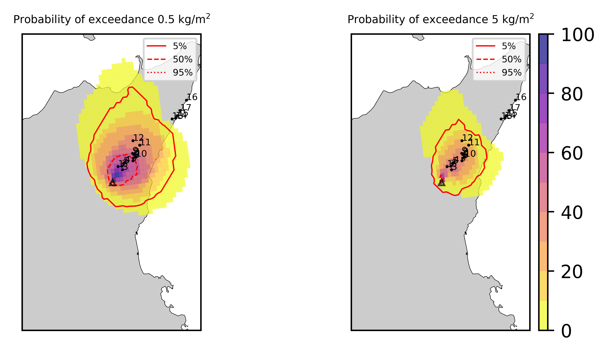  
  
  
  
  
  
  
  
  
  
  
  
  
  
  
  
  

|Location|Ground load [kg/m²] 5th perc|Ground load [kg/m²] 50th perc|Ground load [kg/m²] 95th perc|
| :--- | :--- | :--- | :--- |
|Piano Provenzana (1)|1.78e-03|2.39e+00|1.42e+01|
|Bivio Provenzana-Linguaglossa (2)|5.29e-04|2.70e+00|1.58e+01|
|Cunetta pre-Citelli (3)|3.02e-03|3.22e+00|1.37e+01|
|Chalet (4)|0.00e+00|1.72e+00|1.73e+01|
|Ragabo (5)|1.38e-05|1.80e+00|1.71e+01|
|Scilio (6)|0.00e+00|4.60e-01|1.75e+01|
|Gambino vini (7)|0.00e+00|7.07e-01|1.86e+01|
|StazioneFce Linguaglossa (8)|0.00e+00|2.66e-01|1.68e+01|
|Linguaglossa Via Olivio Sozzi (9)|0.00e+00|2.67e-01|1.70e+01|
|Cim.Linguaglossa (10)|0.00e+00|2.79e-01|1.62e+01|
|Gole Bar (11)|0.00e+00|3.19e-02|1.18e+01|
|Francavilla - Orange (12)|0.00e+00|2.82e-02|1.15e+01|
|Roccalumera1 (13)|0.00e+00|0.00e+00|8.88e-02|
|Roccalumera2 (14)|0.00e+00|0.00e+00|4.95e-02|
|Nizza (15)|0.00e+00|0.00e+00|2.79e-02|
|Scaletta Zanclea (16)|0.00e+00|0.00e+00|1.14e-04|
|Alì (17)|0.00e+00|0.00e+00|9.23e-03|
  

### Atmosphere 2021-03-04 09:20 Z
  
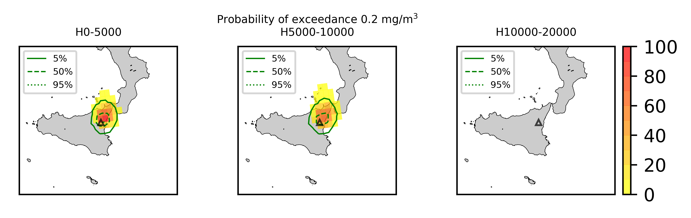
## Forecast at 2021-03-04 10:20 Z from RED VONA issued at 20210304_0817Z
  

|Eruption start [Z]|Eruption end [Z]|Forecast time [Z]|Column height asl [m]|
| :--- | :--- | :--- | :--- |
|2021-03-04 08:20:00|Ongoing|2021-03-04 10:20:00|[5000 m, 15000 m]|
  
  

|Percentile|MER [kg/s¹]|Mass air [kg]|Mass air nested dom. [kg]|Mass grd [kg]|Mass grd nested dom. [kg]|
| :--- | :--- | :--- | :--- | :--- | :--- |
|5th|3.99e+03|7.00e+06|7.00e+06|6.77e+07|6.77e+07|
|50th|3.75e+05|1.98e+09|1.92e+09|6.97e+09|6.96e+09|
|95th|9.00e+06|1.90e+10|1.75e+10|2.28e+10|2.27e+10|
  

### Ground Nested Domain 2021-03-04 10:20 Z
  
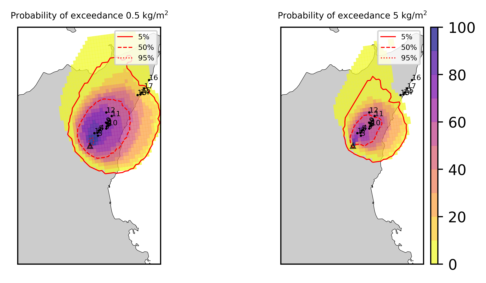  
  
  
  
  
  
  
  
  
  
  
  
  
  
  
  
  

|Location|Ground load [kg/m²] 5th perc|Ground load [kg/m²] 50th perc|Ground load [kg/m²] 95th perc|
| :--- | :--- | :--- | :--- |
|Piano Provenzana (1)|8.00e-02|1.26e+01|2.58e+01|
|Bivio Provenzana-Linguaglossa (2)|3.82e-02|1.51e+01|2.85e+01|
|Cunetta pre-Citelli (3)|6.47e-02|1.49e+01|3.40e+01|
|Chalet (4)|5.93e-03|1.67e+01|2.98e+01|
|Ragabo (5)|1.16e-02|1.64e+01|2.94e+01|
|Scilio (6)|4.46e-05|1.60e+01|3.37e+01|
|Gambino vini (7)|1.30e-04|1.61e+01|3.62e+01|
|StazioneFce Linguaglossa (8)|0.00e+00|1.31e+01|3.12e+01|
|Linguaglossa Via Olivio Sozzi (9)|0.00e+00|1.26e+01|3.00e+01|
|Cim.Linguaglossa (10)|0.00e+00|1.41e+01|3.41e+01|
|Gole Bar (11)|0.00e+00|5.28e+00|2.13e+01|
|Francavilla - Orange (12)|0.00e+00|3.94e+00|1.71e+01|
|Roccalumera1 (13)|0.00e+00|1.72e-02|1.61e+00|
|Roccalumera2 (14)|0.00e+00|5.94e-03|1.16e+00|
|Nizza (15)|0.00e+00|3.06e-03|9.58e-01|
|Scaletta Zanclea (16)|0.00e+00|0.00e+00|8.47e-02|
|Alì (17)|0.00e+00|5.60e-04|6.42e-01|
  

### Atmosphere 2021-03-04 10:20 Z
  

## Forecast at 2021-03-04 11:20 Z from RED VONA issued at 20210304_0817Z
  

|Eruption start [Z]|Eruption end [Z]|Forecast time [Z]|Column height asl [m]|
| :--- | :--- | :--- | :--- |
|2021-03-04 08:20:00|Ongoing|2021-03-04 11:20:00|[5000 m, 15000 m]|
  
  

|Percentile|MER [kg/s¹]|Mass air [kg]|Mass air nested dom. [kg]|Mass grd [kg]|Mass grd nested dom. [kg]|
| :--- | :--- | :--- | :--- | :--- | :--- |
|5th|5.83e+03|4.22e+07|4.22e+07|2.33e+08|2.33e+08|
|50th|3.62e+05|3.07e+09|2.67e+09|1.02e+10|1.02e+10|
|95th|7.34e+06|1.77e+10|1.33e+10|3.54e+10|3.52e+10|
  

### Ground Nested Domain 2021-03-04 11:20 Z
  
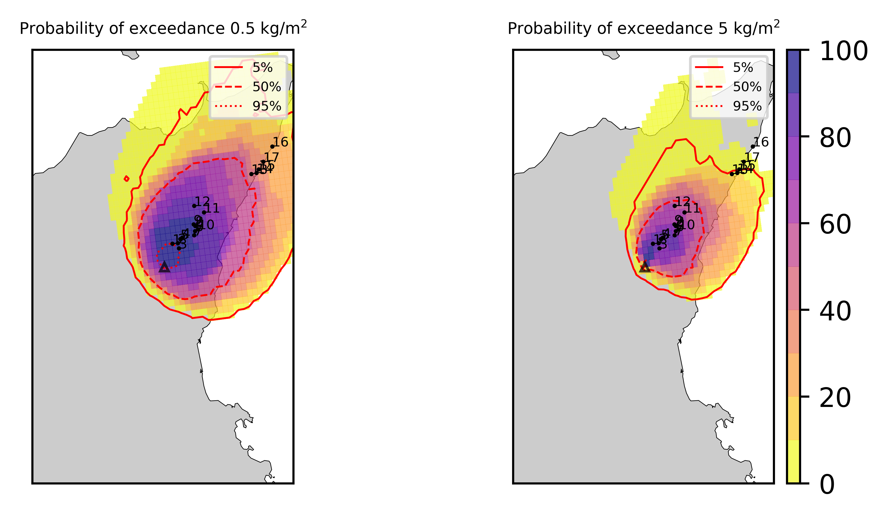  
  
  
  
  
  
  
  
  
  
  
  
  
  
  
  
  

|Location|Ground load [kg/m²] 5th perc|Ground load [kg/m²] 50th perc|Ground load [kg/m²] 95th perc|
| :--- | :--- | :--- | :--- |
|Piano Provenzana (1)|8.71e-01|1.79e+01|4.07e+01|
|Bivio Provenzana-Linguaglossa (2)|1.01e+00|2.04e+01|4.57e+01|
|Cunetta pre-Citelli (3)|7.68e-01|1.98e+01|5.08e+01|
|Chalet (4)|4.59e-01|2.10e+01|5.02e+01|
|Ragabo (5)|5.53e-01|1.98e+01|4.71e+01|
|Scilio (6)|7.68e-02|1.94e+01|6.26e+01|
|Gambino vini (7)|1.16e-01|1.93e+01|6.47e+01|
|StazioneFce Linguaglossa (8)|3.67e-02|1.71e+01|5.39e+01|
|Linguaglossa Via Olivio Sozzi (9)|3.06e-02|1.65e+01|4.89e+01|
|Cim.Linguaglossa (10)|4.25e-02|1.75e+01|6.41e+01|
|Gole Bar (11)|1.70e-03|9.38e+00|3.75e+01|
|Francavilla - Orange (12)|8.00e-04|6.60e+00|2.69e+01|
|Roccalumera1 (13)|0.00e+00|2.47e-01|5.14e+00|
|Roccalumera2 (14)|0.00e+00|1.41e-01|5.12e+00|
|Nizza (15)|0.00e+00|8.63e-02|4.44e+00|
|Scaletta Zanclea (16)|0.00e+00|1.09e-02|2.69e+00|
|Alì (17)|0.00e+00|3.75e-02|3.17e+00|
  

### Atmosphere 2021-03-04 11:20 Z
  
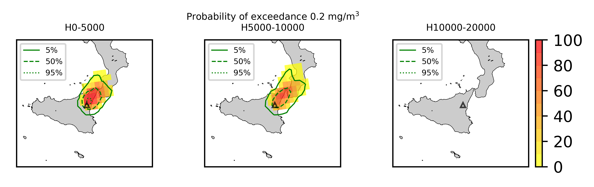
## Forecast at 2021-03-04 14:20 Z from RED VONA issued at 20210304_0817Z
  

|Eruption start [Z]|Eruption end [Z]|Forecast time [Z]|Column height asl [m]|
| :--- | :--- | :--- | :--- |
|2021-03-04 08:20:00|Ongoing|2021-03-04 14:20:00|[5000 m, 15000 m]|
  
  

|Percentile|MER [kg/s¹]|Mass air [kg]|Mass air nested dom. [kg]|Mass grd [kg]|Mass grd nested dom. [kg]|
| :--- | :--- | :--- | :--- | :--- | :--- |
|5th|9.60e+03|1.66e+08|1.16e+08|3.23e+09|3.20e+09|
|50th|2.96e+05|2.63e+09|1.82e+09|2.60e+10|2.56e+10|
|95th|1.25e+07|3.66e+10|2.34e+10|1.28e+11|1.25e+11|
  

### Ground Nested Domain 2021-03-04 14:20 Z
  
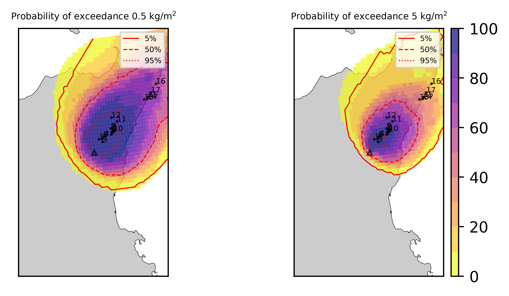  
  
  
  
  
  
  
  
  
  
  
  
  
  
  
  
  

|Location|Ground load [kg/m²] 5th perc|Ground load [kg/m²] 50th perc|Ground load [kg/m²] 95th perc|
| :--- | :--- | :--- | :--- |
|Piano Provenzana (1)|8.67e+00|3.67e+01|9.68e+01|
|Bivio Provenzana-Linguaglossa (2)|9.00e+00|4.06e+01|8.92e+01|
|Cunetta pre-Citelli (3)|1.01e+01|3.89e+01|1.05e+02|
|Chalet (4)|6.50e+00|3.67e+01|9.66e+01|
|Ragabo (5)|7.41e+00|3.72e+01|9.19e+01|
|Scilio (6)|3.82e+00|3.63e+01|1.26e+02|
|Gambino vini (7)|4.84e+00|3.91e+01|1.20e+02|
|StazioneFce Linguaglossa (8)|2.70e+00|3.28e+01|1.27e+02|
|Linguaglossa Via Olivio Sozzi (9)|2.36e+00|3.15e+01|1.25e+02|
|Cim.Linguaglossa (10)|3.26e+00|3.54e+01|1.31e+02|
|Gole Bar (11)|1.21e+00|2.02e+01|1.21e+02|
|Francavilla - Orange (12)|9.97e-01|1.58e+01|1.17e+02|
|Roccalumera1 (13)|3.35e-02|2.19e+00|1.84e+01|
|Roccalumera2 (14)|1.87e-02|1.76e+00|1.78e+01|
|Nizza (15)|1.91e-02|1.93e+00|1.52e+01|
|Scaletta Zanclea (16)|1.05e-02|1.50e+00|8.44e+00|
|Alì (17)|2.66e-02|2.31e+00|1.16e+01|
  

### Atmosphere 2021-03-04 14:20 Z
  
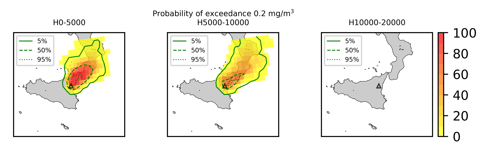
## Forecast at 2021-03-04 17:20 Z from RED VONA issued at 20210304_0817Z
  

|Eruption start [Z]|Eruption end [Z]|Forecast time [Z]|Column height asl [m]|
| :--- | :--- | :--- | :--- |
|2021-03-04 08:20:00|Ongoing|2021-03-04 17:20:00|[5000 m, 15000 m]|
  
  

|Percentile|MER [kg/s¹]|Mass air [kg]|Mass air nested dom. [kg]|Mass grd [kg]|Mass grd nested dom. [kg]|
| :--- | :--- | :--- | :--- | :--- | :--- |
|5th|2.71e+03|2.50e+08|1.17e+08|9.97e+09|9.92e+09|
|50th|5.73e+05|6.57e+09|1.79e+09|5.33e+10|5.15e+10|
|95th|1.38e+07|4.85e+10|2.63e+10|1.49e+11|1.41e+11|
  

### Ground Nested Domain 2021-03-04 17:20 Z
  
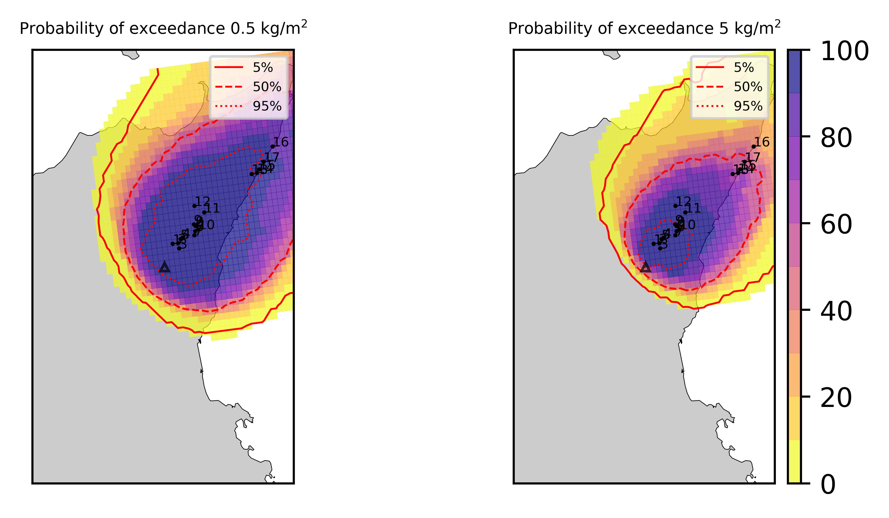  
  
  
  
  
  
  
  
  
  
  
  
  
  
  
  
  

|Location|Ground load [kg/m²] 5th perc|Ground load [kg/m²] 50th perc|Ground load [kg/m²] 95th perc|
| :--- | :--- | :--- | :--- |
|Piano Provenzana (1)|1.82e+01|5.77e+01|1.47e+02|
|Bivio Provenzana-Linguaglossa (2)|1.89e+01|6.17e+01|1.29e+02|
|Cunetta pre-Citelli (3)|2.41e+01|6.19e+01|1.52e+02|
|Chalet (4)|1.75e+01|6.51e+01|1.13e+02|
|Ragabo (5)|1.80e+01|6.29e+01|1.10e+02|
|Scilio (6)|1.55e+01|7.41e+01|1.49e+02|
|Gambino vini (7)|1.66e+01|6.97e+01|1.40e+02|
|StazioneFce Linguaglossa (8)|1.34e+01|7.15e+01|1.61e+02|
|Linguaglossa Via Olivio Sozzi (9)|1.33e+01|6.85e+01|1.58e+02|
|Cim.Linguaglossa (10)|1.37e+01|7.32e+01|1.56e+02|
|Gole Bar (11)|4.08e+00|4.87e+01|1.64e+02|
|Francavilla - Orange (12)|4.10e+00|3.69e+01|1.36e+02|
|Roccalumera1 (13)|5.49e-01|7.24e+00|3.03e+01|
|Roccalumera2 (14)|5.26e-01|6.89e+00|2.57e+01|
|Nizza (15)|4.17e-01|6.55e+00|2.25e+01|
|Scaletta Zanclea (16)|2.19e-01|3.37e+00|1.11e+01|
|Alì (17)|4.49e-01|5.77e+00|1.84e+01|
  

### Atmosphere 2021-03-04 17:20 Z
  
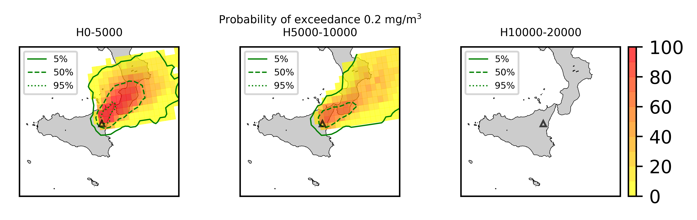
## Forecast at 2021-03-04 20:20 Z from RED VONA issued at 20210304_0817Z
  

|Eruption start [Z]|Eruption end [Z]|Forecast time [Z]|Column height asl [m]|
| :--- | :--- | :--- | :--- |
|2021-03-04 08:20:00|Ongoing|2021-03-04 20:20:00|[5000 m, 15000 m]|
  
  

|Percentile|MER [kg/s¹]|Mass air [kg]|Mass air nested dom. [kg]|Mass grd [kg]|Mass grd nested dom. [kg]|
| :--- | :--- | :--- | :--- | :--- | :--- |
|5th|4.07e+03|3.09e+08|1.55e+08|1.95e+10|1.86e+10|
|50th|3.92e+05|6.26e+09|1.72e+09|8.37e+10|7.62e+10|
|95th|1.49e+07|4.45e+10|2.18e+10|2.20e+11|2.00e+11|
  

### Ground Nested Domain 2021-03-04 20:20 Z
  
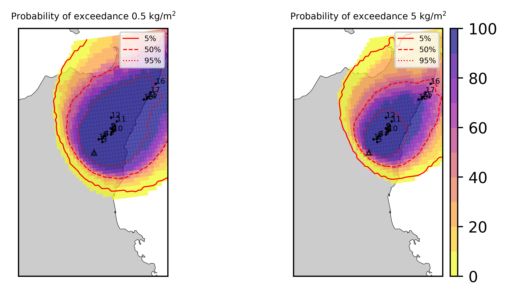  
  
  
  
  
  
  
  
  
  
  
  
  
  
  
  
  

|Location|Ground load [kg/m²] 5th perc|Ground load [kg/m²] 50th perc|Ground load [kg/m²] 95th perc|
| :--- | :--- | :--- | :--- |
|Piano Provenzana (1)|3.26e+01|8.14e+01|2.01e+02|
|Bivio Provenzana-Linguaglossa (2)|3.60e+01|8.72e+01|1.87e+02|
|Cunetta pre-Citelli (3)|4.14e+01|8.76e+01|2.47e+02|
|Chalet (4)|3.61e+01|7.93e+01|1.64e+02|
|Ragabo (5)|3.60e+01|7.97e+01|1.63e+02|
|Scilio (6)|3.06e+01|8.62e+01|1.97e+02|
|Gambino vini (7)|2.94e+01|9.67e+01|1.84e+02|
|StazioneFce Linguaglossa (8)|2.74e+01|8.80e+01|2.11e+02|
|Linguaglossa Via Olivio Sozzi (9)|2.68e+01|8.61e+01|2.11e+02|
|Cim.Linguaglossa (10)|2.79e+01|9.26e+01|2.02e+02|
|Gole Bar (11)|1.57e+01|7.63e+01|2.22e+02|
|Francavilla - Orange (12)|1.14e+01|5.48e+01|2.09e+02|
|Roccalumera1 (13)|2.26e+00|1.10e+01|3.74e+01|
|Roccalumera2 (14)|1.94e+00|9.20e+00|3.13e+01|
|Nizza (15)|1.70e+00|8.71e+00|2.67e+01|
|Scaletta Zanclea (16)|9.90e-01|6.28e+00|1.62e+01|
|Alì (17)|1.29e+00|8.95e+00|1.98e+01|
  

### Atmosphere 2021-03-04 20:20 Z
  
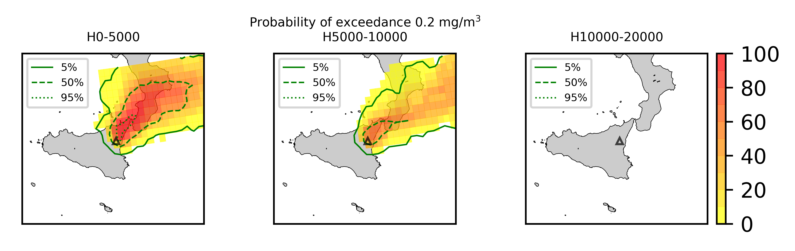  
Go to [Supplementary page](Supplementary_page.md)  
Go to [Main directory](https://github.com/federicapardini/Real_time_ash_forecast)