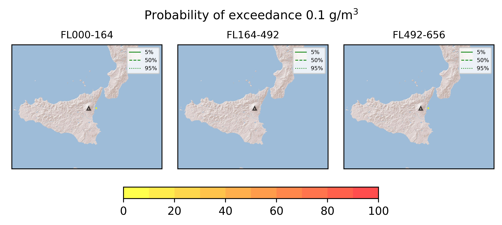

Forecast from VONA bulletin - 20210307_0630Z
============================================

Contents
========

* [Forecast products](#forecast-products)
	* [Forecast at 2021-03-07 09:30 Z](#forecast-at-2021-03-07-0930-z)
	* [Forecast at 2021-03-07 12:30 Z](#forecast-at-2021-03-07-1230-z)
	* [Forecast at 2021-03-07 15:30 Z](#forecast-at-2021-03-07-1530-z)
	* [Forecast at 2021-03-07 18:30 Z](#forecast-at-2021-03-07-1830-z)

# Forecast products

## Forecast at 2021-03-07 09:30 Z
  

|Eruption start [Z]|Eruption end [Z]|Forecast time [Z]|Column height asl [m]|
| :--- | :--- | :--- | :--- |
|2021-03-07 06:30:00|Ongoing|2021-03-07 09:30:00|5000 ± 500 - from VONA|
  
  

|Percentile|MER [kg/s¹]|Mass in the air [kg]|Mass on the ground [kg]|
| :--- | :--- | :--- | :--- |
|5th|4.57e+02|3.32e+05|4.47e+06|
|50th|1.05e+04|2.99e+06|1.04e+08|
|95th|6.33e+04|6.89e+07|5.56e+08|
  

### Ground 2021-03-07 09:30 Z
  
  
  
  
  
  
  
  
  
  
  

|Location|Ground load [kg/m²] 5th perc|Ground load [kg/m²] 50th perc|Ground load [kg/m²] 95th perc|
| :--- | :--- | :--- | :--- |
|Catania AP (1)|0.00e+00|1.15e-09|5.13e-04|
|Siracusa (2)|0.00e+00|0.00e+00|0.00e+00|
|Reggio Calabria AP (3)|0.00e+00|0.00e+00|2.61e-07|
|Palermo AP (4)|0.00e+00|0.00e+00|0.00e+00|
|Nicolosi (5)|5.10e-07|4.43e-04|3.50e-02|
|Zafferana (6)|1.23e-03|6.07e-02|8.37e-01|
|Linguaglossa (7)|9.50e-11|2.05e-04|5.98e-02|
|Randazzo (8)|0.00e+00|0.00e+00|6.47e-08|
|Bronte (9)|0.00e+00|0.00e+00|2.00e-10|
|Biancavilla (10)|0.00e+00|0.00e+00|1.18e-06|
  

### Atmosphere 2021-03-07 09:30 Z
  

## Forecast at 2021-03-07 12:30 Z
  

|Eruption start [Z]|Eruption end [Z]|Forecast time [Z]|Column height asl [m]|
| :--- | :--- | :--- | :--- |
|2021-03-07 06:30:00|Ongoing|2021-03-07 12:30:00|5000 ± 500 - from VONA|
  
  

|Percentile|MER [kg/s¹]|Mass in the air [kg]|Mass on the ground [kg]|
| :--- | :--- | :--- | :--- |
|5th|4.47e+01|1.51e+05|9.03e+06|
|50th|9.85e+03|8.29e+06|2.58e+08|
|95th|6.07e+04|5.00e+07|8.96e+08|
  

### Ground 2021-03-07 12:30 Z
  
  
  
  
  
  
  
  
  
  
  

|Location|Ground load [kg/m²] 5th perc|Ground load [kg/m²] 50th perc|Ground load [kg/m²] 95th perc|
| :--- | :--- | :--- | :--- |
|Catania AP (1)|6.85e-10|1.01e-06|1.06e-03|
|Siracusa (2)|0.00e+00|0.00e+00|5.49e-08|
|Reggio Calabria AP (3)|0.00e+00|3.25e-09|3.99e-05|
|Palermo AP (4)|0.00e+00|0.00e+00|0.00e+00|
|Nicolosi (5)|4.33e-05|2.22e-03|8.27e-02|
|Zafferana (6)|1.19e-02|2.81e-01|1.25e+00|
|Linguaglossa (7)|4.29e-05|4.78e-03|1.55e-01|
|Randazzo (8)|0.00e+00|7.63e-08|9.41e-06|
|Bronte (9)|0.00e+00|9.00e-10|3.47e-07|
|Biancavilla (10)|0.00e+00|2.15e-08|6.04e-06|
  

### Atmosphere 2021-03-07 12:30 Z
  

## Forecast at 2021-03-07 15:30 Z
  

|Eruption start [Z]|Eruption end [Z]|Forecast time [Z]|Column height asl [m]|
| :--- | :--- | :--- | :--- |
|2021-03-07 06:30:00|Ongoing|2021-03-07 15:30:00|5000 ± 500 - from VONA|
  
  

|Percentile|MER [kg/s¹]|Mass in the air [kg]|Mass on the ground [kg]|
| :--- | :--- | :--- | :--- |
|5th|6.85e+02|1.18e+05|1.81e+08|
|50th|1.22e+04|7.59e+06|5.11e+08|
|95th|5.64e+04|5.88e+07|1.08e+09|
  

### Ground 2021-03-07 15:30 Z
  
  
  
  
  
  
  
  
  
  
  

|Location|Ground load [kg/m²] 5th perc|Ground load [kg/m²] 50th perc|Ground load [kg/m²] 95th perc|
| :--- | :--- | :--- | :--- |
|Catania AP (1)|3.68e-09|4.94e-06|1.13e-03|
|Siracusa (2)|0.00e+00|0.00e+00|4.17e-07|
|Reggio Calabria AP (3)|0.00e+00|1.18e-07|8.71e-05|
|Palermo AP (4)|0.00e+00|0.00e+00|0.00e+00|
|Nicolosi (5)|2.87e-04|4.45e-03|1.04e-01|
|Zafferana (6)|8.71e-02|5.00e-01|1.84e+00|
|Linguaglossa (7)|4.99e-04|1.00e-02|2.64e-01|
|Randazzo (8)|4.92e-09|4.92e-07|1.88e-05|
|Bronte (9)|0.00e+00|9.70e-09|1.64e-06|
|Biancavilla (10)|1.95e-10|1.74e-07|1.21e-05|
  

### Atmosphere 2021-03-07 15:30 Z
  

## Forecast at 2021-03-07 18:30 Z
  

|Eruption start [Z]|Eruption end [Z]|Forecast time [Z]|Column height asl [m]|
| :--- | :--- | :--- | :--- |
|2021-03-07 06:30:00|Ongoing|2021-03-07 18:30:00|5000 ± 500 - from VONA|
  
  

|Percentile|MER [kg/s¹]|Mass in the air [kg]|Mass on the ground [kg]|
| :--- | :--- | :--- | :--- |
|5th|8.91e+01|1.59e+04|2.55e+08|
|50th|6.85e+03|3.29e+06|5.98e+08|
|95th|4.02e+04|9.66e+07|1.20e+09|
  

### Ground 2021-03-07 18:30 Z
  
  
  
  
  
  
  
  
  
  
  

|Location|Ground load [kg/m²] 5th perc|Ground load [kg/m²] 50th perc|Ground load [kg/m²] 95th perc|
| :--- | :--- | :--- | :--- |
|Catania AP (1)|1.75e-08|9.66e-06|1.13e-03|
|Siracusa (2)|0.00e+00|1.05e-09|8.46e-07|
|Reggio Calabria AP (3)|2.00e-10|4.25e-07|1.24e-04|
|Palermo AP (4)|0.00e+00|0.00e+00|0.00e+00|
|Nicolosi (5)|1.01e-03|6.22e-03|1.06e-01|
|Zafferana (6)|1.69e-01|6.57e-01|2.02e+00|
|Linguaglossa (7)|1.43e-03|3.17e-02|4.22e-01|
|Randazzo (8)|1.05e-08|9.89e-07|1.95e-05|
|Bronte (9)|9.50e-11|1.63e-08|2.02e-06|
|Biancavilla (10)|1.95e-10|4.25e-07|1.34e-05|
  

### Atmosphere 2021-03-07 18:30 Z
  
  
Go to [Supplementary page](Supplementary_page.md)  
Go to [Main directory](https://github.com/federicapardini/Real_time_ash_forecast)