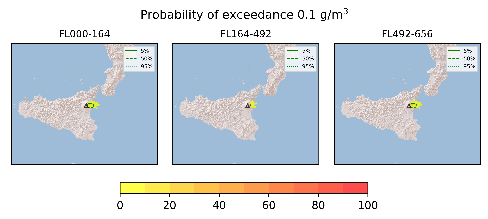
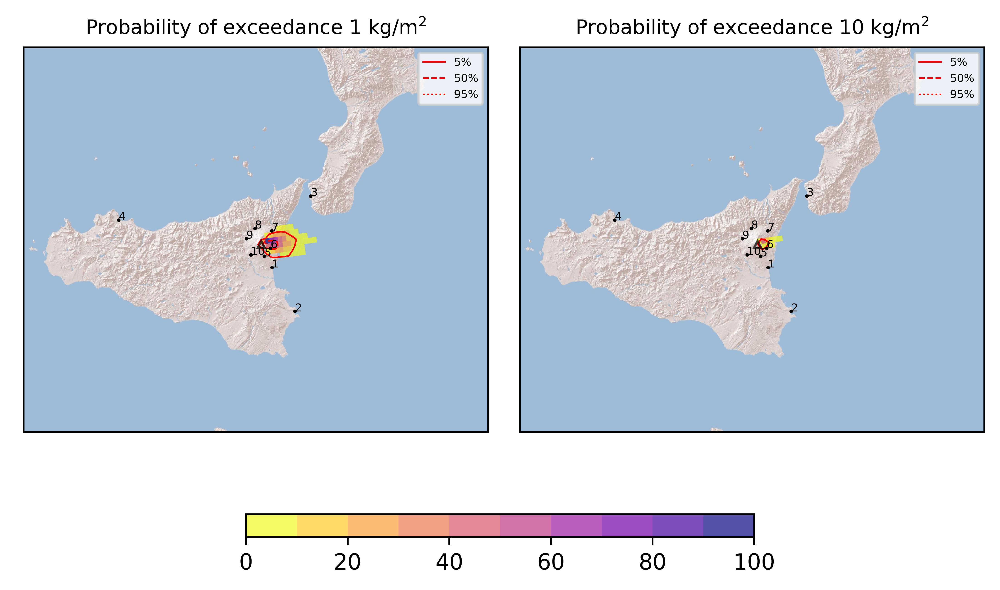
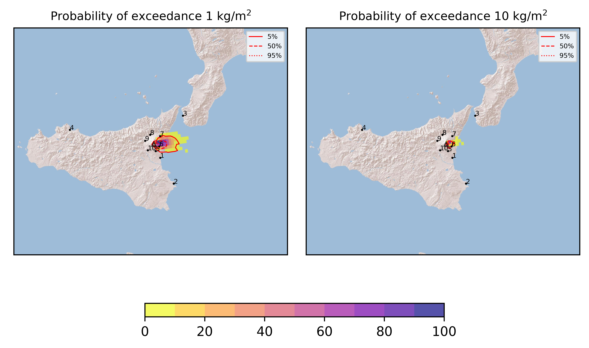
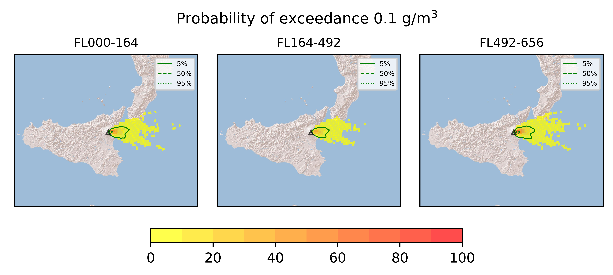
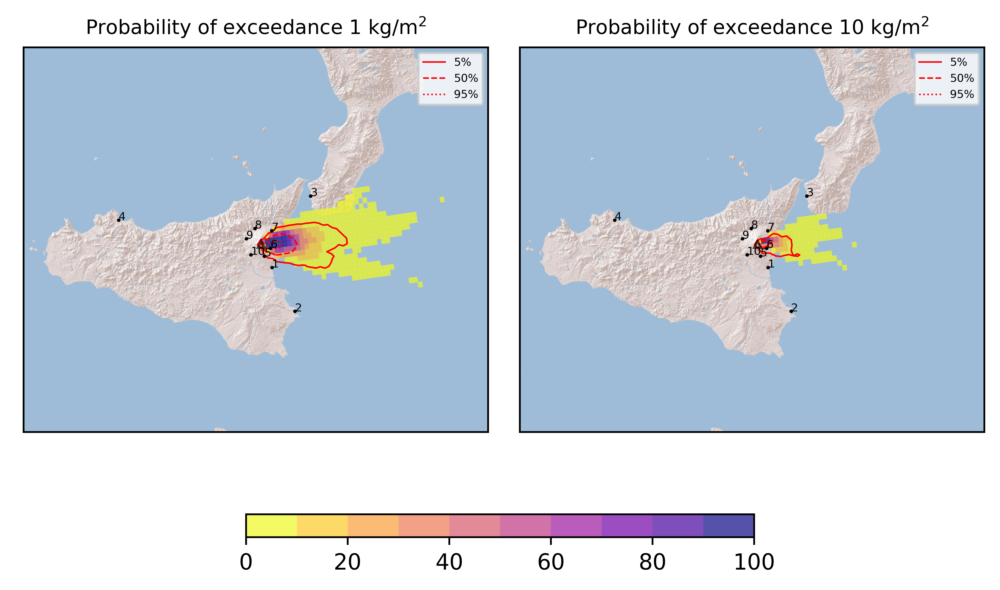

Forecast from VONA bulletin - 20210312_0749Z
============================================

Contents
========

* [Forecast products](#forecast-products)
	* [Forecast at 2021-03-12 10:50 Z](#forecast-at-2021-03-12-1050-z)
	* [Forecast at 2021-03-12 13:50 Z](#forecast-at-2021-03-12-1350-z)
	* [Forecast at 2021-03-12 16:50 Z](#forecast-at-2021-03-12-1650-z)
	* [Forecast at 2021-03-12 11:40 Z](#forecast-at-2021-03-12-1140-z)
	* [Forecast at 2021-03-12 14:40 Z](#forecast-at-2021-03-12-1440-z)
	* [Forecast at 2021-03-12 17:40 Z](#forecast-at-2021-03-12-1740-z)

# Forecast products

## Forecast at 2021-03-12 10:50 Z
  

|Eruption start [Z]|Eruption end [Z]|Forecast time [Z]|Column height asl [m]|
| :--- | :--- | :--- | :--- |
|2021-03-12 07:50:00|Ongoing|2021-03-12 10:50:00|6000 ± 500 - from VONA|
  
  

|Percentile|MER [kg/s¹]|Mass in the air [kg]|Mass on the ground [kg]|
| :--- | :--- | :--- | :--- |
|5th|4.73e+02|1.00e+05|4.84e+06|
|50th|3.61e+04|2.55e+07|3.43e+08|
|95th|1.76e+05|2.84e+08|1.50e+09|
  

### Ground 2021-03-12 10:50 Z
  
  
  
  
  
  
  
  
  
  
  

|Location|Ground load [kg/m²] 5th perc|Ground load [kg/m²] 50th perc|Ground load [kg/m²] 95th perc|
| :--- | :--- | :--- | :--- |
|Catania AP (1)|0.00e+00|0.00e+00|1.98e-04|
|Siracusa (2)|0.00e+00|0.00e+00|0.00e+00|
|Reggio Calabria AP (3)|0.00e+00|0.00e+00|0.00e+00|
|Palermo AP (4)|0.00e+00|0.00e+00|0.00e+00|
|Nicolosi (5)|5.95e-06|2.82e-03|1.21e-01|
|Zafferana (6)|5.59e-03|4.18e-01|3.78e+00|
|Linguaglossa (7)|4.87e-09|2.97e-04|8.60e-02|
|Randazzo (8)|0.00e+00|0.00e+00|2.90e-10|
|Bronte (9)|0.00e+00|0.00e+00|0.00e+00|
|Biancavilla (10)|0.00e+00|0.00e+00|2.90e-05|
  

### Atmosphere 2021-03-12 10:50 Z
  

## Forecast at 2021-03-12 13:50 Z
  

|Eruption start [Z]|Eruption end [Z]|Forecast time [Z]|Column height asl [m]|
| :--- | :--- | :--- | :--- |
|2021-03-12 07:50:00|Ongoing|2021-03-12 13:50:00|6000 ± 500 - from VONA|
  
  

|Percentile|MER [kg/s¹]|Mass in the air [kg]|Mass on the ground [kg]|
| :--- | :--- | :--- | :--- |
|5th|2.91e+03|6.96e+06|1.53e+08|
|50th|4.36e+04|5.05e+07|8.75e+08|
|95th|1.71e+05|1.97e+08|2.59e+09|
  

### Ground 2021-03-12 13:50 Z
  
  
  
  
  
  
  
  
  
  
  

|Location|Ground load [kg/m²] 5th perc|Ground load [kg/m²] 50th perc|Ground load [kg/m²] 95th perc|
| :--- | :--- | :--- | :--- |
|Catania AP (1)|0.00e+00|2.17e-08|4.28e-04|
|Siracusa (2)|0.00e+00|0.00e+00|0.00e+00|
|Reggio Calabria AP (3)|0.00e+00|0.00e+00|0.00e+00|
|Palermo AP (4)|0.00e+00|0.00e+00|0.00e+00|
|Nicolosi (5)|9.95e-05|9.01e-03|2.62e-01|
|Zafferana (6)|1.84e-01|1.30e+00|6.65e+00|
|Linguaglossa (7)|8.38e-05|2.44e-03|2.14e-01|
|Randazzo (8)|0.00e+00|0.00e+00|4.25e-08|
|Bronte (9)|0.00e+00|0.00e+00|0.00e+00|
|Biancavilla (10)|0.00e+00|5.17e-08|4.10e-05|
  

### Atmosphere 2021-03-12 13:50 Z
  

## Forecast at 2021-03-12 16:50 Z
  

|Eruption start [Z]|Eruption end [Z]|Forecast time [Z]|Column height asl [m]|
| :--- | :--- | :--- | :--- |
|2021-03-12 07:50:00|Ongoing|2021-03-12 16:50:00|6000 ± 500 - from VONA|
  
  

|Percentile|MER [kg/s¹]|Mass in the air [kg]|Mass on the ground [kg]|
| :--- | :--- | :--- | :--- |
|5th|6.28e+01|8.28e+05|3.07e+08|
|50th|4.44e+04|3.63e+07|1.63e+09|
|95th|1.96e+05|2.83e+08|3.19e+09|
  

### Ground 2021-03-12 16:50 Z
  
  
  
  
  
  
  
  
  
  
  

|Location|Ground load [kg/m²] 5th perc|Ground load [kg/m²] 50th perc|Ground load [kg/m²] 95th perc|
| :--- | :--- | :--- | :--- |
|Catania AP (1)|0.00e+00|7.88e-06|6.99e-04|
|Siracusa (2)|0.00e+00|0.00e+00|0.00e+00|
|Reggio Calabria AP (3)|0.00e+00|0.00e+00|3.05e-10|
|Palermo AP (4)|0.00e+00|0.00e+00|0.00e+00|
|Nicolosi (5)|1.06e-03|2.16e-02|2.62e-01|
|Zafferana (6)|4.49e-01|2.57e+00|7.74e+00|
|Linguaglossa (7)|1.79e-04|1.07e-02|4.78e-01|
|Randazzo (8)|0.00e+00|0.00e+00|4.08e-08|
|Bronte (9)|0.00e+00|0.00e+00|0.00e+00|
|Biancavilla (10)|0.00e+00|1.54e-07|4.10e-05|
  

### Atmosphere 2021-03-12 16:50 Z
  

## Forecast at 2021-03-12 11:40 Z
  

|Eruption start [Z]|Eruption end [Z]|Forecast time [Z]|Column height asl [m]|
| :--- | :--- | :--- | :--- |
|2021-03-12 07:50:00|Ongoing|2021-03-12 11:40:00|9000 ± 500 - from VONA|
  
  

|Percentile|MER [kg/s¹]|Mass in the air [kg]|Mass on the ground [kg]|
| :--- | :--- | :--- | :--- |
|5th|4.86e+04|3.14e+07|1.40e+09|
|50th|2.04e+05|2.46e+08|3.31e+09|
|95th|7.15e+05|3.54e+09|6.11e+09|
  

### Ground 2021-03-12 11:40 Z
  
  
  
  
  
  
  
  
  
  
  

|Location|Ground load [kg/m²] 5th perc|Ground load [kg/m²] 50th perc|Ground load [kg/m²] 95th perc|
| :--- | :--- | :--- | :--- |
|Catania AP (1)|1.95e-10|5.31e-05|1.58e-03|
|Siracusa (2)|0.00e+00|0.00e+00|0.00e+00|
|Reggio Calabria AP (3)|0.00e+00|0.00e+00|3.05e-10|
|Palermo AP (4)|0.00e+00|0.00e+00|0.00e+00|
|Nicolosi (5)|3.54e-03|4.38e-02|3.87e-01|
|Zafferana (6)|1.62e+00|5.19e+00|1.38e+01|
|Linguaglossa (7)|6.90e-04|1.85e-02|6.01e-01|
|Randazzo (8)|0.00e+00|0.00e+00|9.09e-08|
|Bronte (9)|0.00e+00|0.00e+00|0.00e+00|
|Biancavilla (10)|0.00e+00|7.69e-07|6.15e-05|
  

### Atmosphere 2021-03-12 11:40 Z
  

## Forecast at 2021-03-12 14:40 Z
  

|Eruption start [Z]|Eruption end [Z]|Forecast time [Z]|Column height asl [m]|
| :--- | :--- | :--- | :--- |
|2021-03-12 07:50:00|Ongoing|2021-03-12 14:40:00|9000 ± 500 - from VONA|
  
  

|Percentile|MER [kg/s¹]|Mass in the air [kg]|Mass on the ground [kg]|
| :--- | :--- | :--- | :--- |
|5th|4.98e+04|3.87e+07|3.99e+09|
|50th|2.51e+05|2.37e+08|6.08e+09|
|95th|2.06e+06|1.09e+10|1.54e+10|
  

### Ground 2021-03-12 14:40 Z
  
  
  
  
  
  
  
  
  
  
  

|Location|Ground load [kg/m²] 5th perc|Ground load [kg/m²] 50th perc|Ground load [kg/m²] 95th perc|
| :--- | :--- | :--- | :--- |
|Catania AP (1)|2.95e-10|1.13e-04|3.14e-03|
|Siracusa (2)|0.00e+00|0.00e+00|0.00e+00|
|Reggio Calabria AP (3)|0.00e+00|0.00e+00|3.05e-10|
|Palermo AP (4)|0.00e+00|0.00e+00|0.00e+00|
|Nicolosi (5)|1.20e-02|5.21e-02|4.68e-01|
|Zafferana (6)|2.86e+00|8.29e+00|2.12e+01|
|Linguaglossa (7)|1.44e-03|4.42e-02|7.57e-01|
|Randazzo (8)|0.00e+00|1.00e-10|9.09e-08|
|Bronte (9)|0.00e+00|0.00e+00|0.00e+00|
|Biancavilla (10)|0.00e+00|2.12e-06|6.18e-05|
  

### Atmosphere 2021-03-12 14:40 Z
  

## Forecast at 2021-03-12 17:40 Z
  

|Eruption start [Z]|Eruption end [Z]|Forecast time [Z]|Column height asl [m]|
| :--- | :--- | :--- | :--- |
|2021-03-12 07:50:00|Ongoing|2021-03-12 17:40:00|9000 ± 500 - from VONA|
  
  

|Percentile|MER [kg/s¹]|Mass in the air [kg]|Mass on the ground [kg]|
| :--- | :--- | :--- | :--- |
|5th|3.08e+04|8.64e+06|4.37e+09|
|50th|3.09e+05|5.25e+08|9.70e+09|
|95th|1.96e+06|6.08e+09|2.87e+10|
  

### Ground 2021-03-12 17:40 Z
  
  
  
  
  
  
  
  
  
  
  

|Location|Ground load [kg/m²] 5th perc|Ground load [kg/m²] 50th perc|Ground load [kg/m²] 95th perc|
| :--- | :--- | :--- | :--- |
|Catania AP (1)|1.95e-09|1.14e-04|4.66e-03|
|Siracusa (2)|0.00e+00|0.00e+00|0.00e+00|
|Reggio Calabria AP (3)|0.00e+00|0.00e+00|1.55e-08|
|Palermo AP (4)|0.00e+00|0.00e+00|0.00e+00|
|Nicolosi (5)|1.22e-02|6.01e-02|4.76e-01|
|Zafferana (6)|3.76e+00|9.46e+00|2.88e+01|
|Linguaglossa (7)|1.44e-03|9.88e-02|8.24e-01|
|Randazzo (8)|0.00e+00|1.00e-10|9.09e-08|
|Bronte (9)|0.00e+00|0.00e+00|0.00e+00|
|Biancavilla (10)|0.00e+00|2.19e-06|6.18e-05|
  

### Atmosphere 2021-03-12 17:40 Z
  
  
Go to [Supplementary page](Supplementary_page.md)  
Go to [Main directory](https://github.com/federicapardini/Real_time_ash_forecast)