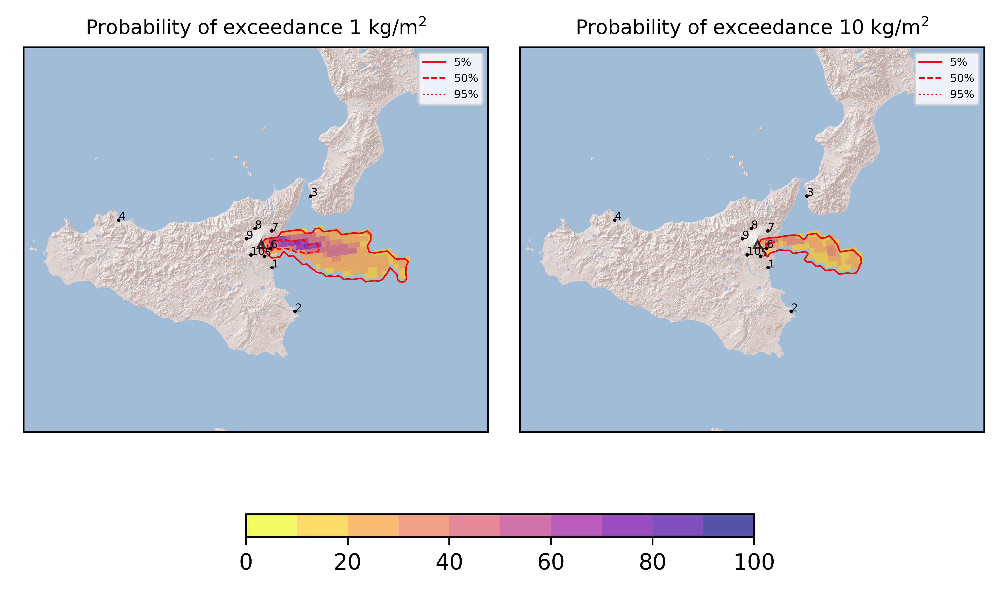
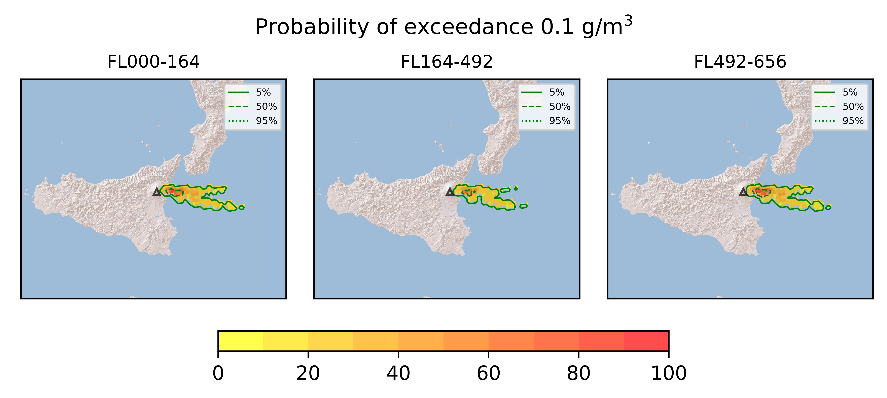
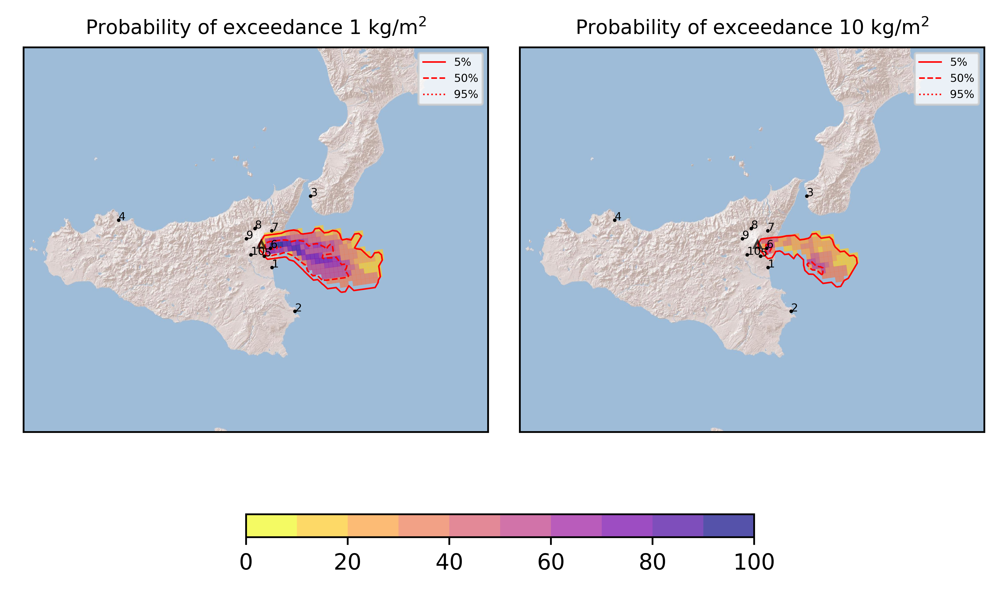
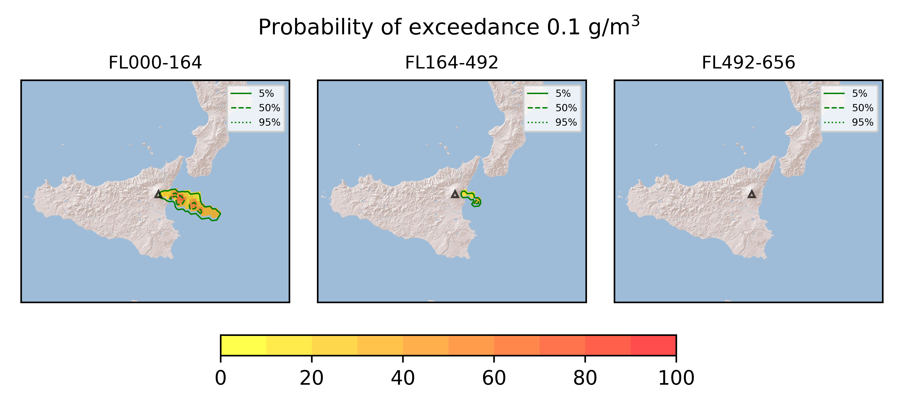

Forecast from VONA bulletin - 20210314_2236Z
============================================

Contents
========

* [Forecast products](#forecast-products)
	* [Forecast at 2021-03-15 01:40 Z](#forecast-at-2021-03-15-0140-z)
	* [Forecast at 2021-03-15 03:00 Z](#forecast-at-2021-03-15-0300-z)

# Forecast products

## Forecast at 2021-03-15 01:40 Z
  

|Eruption start [Z]|Eruption end [Z]|Forecast time [Z]|Column height asl [m]|
| :--- | :--- | :--- | :--- |
|2021-03-14 22:40:00|Ongoing|2021-03-15 01:40:00|[6000 m, 12000 m]|
  
  

|Percentile|MER [kg/s¹]|Mass in the air [kg]|Mass on the ground [kg]|
| :--- | :--- | :--- | :--- |
|5th|6.85e+04|5.29e+08|5.42e+08|
|50th|1.40e+06|3.83e+09|1.28e+10|
|95th|5.95e+06|8.70e+09|4.27e+10|
  

### Ground 2021-03-15 01:40 Z
  
  
  
  
  
  
  
  
  
  
  

|Location|Ground load [kg/m²] 5th perc|Ground load [kg/m²] 50th perc|Ground load [kg/m²] 95th perc|
| :--- | :--- | :--- | :--- |
|Catania AP (1)|0.00e+00|0.00e+00|1.71e-05|
|Siracusa (2)|0.00e+00|0.00e+00|0.00e+00|
|Reggio Calabria AP (3)|0.00e+00|0.00e+00|0.00e+00|
|Palermo AP (4)|0.00e+00|0.00e+00|0.00e+00|
|Nicolosi (5)|0.00e+00|6.00e-06|4.05e-02|
|Zafferana (6)|5.83e-01|6.28e+00|5.10e+01|
|Linguaglossa (7)|0.00e+00|0.00e+00|3.79e-03|
|Randazzo (8)|0.00e+00|0.00e+00|0.00e+00|
|Bronte (9)|0.00e+00|0.00e+00|0.00e+00|
|Biancavilla (10)|0.00e+00|0.00e+00|0.00e+00|
  

### Atmosphere 2021-03-15 01:40 Z
  

## Forecast at 2021-03-15 03:00 Z
  

|Eruption start [Z]|Eruption end [Z]|Forecast time [Z]|Column height asl [m]|
| :--- | :--- | :--- | :--- |
|2021-03-14 22:40:00|Ongoing|2021-03-15 03:00:00|8000.0 ± 500 - from VONA|
  
  

|Percentile|MER [kg/s¹]|Mass in the air [kg]|Mass on the ground [kg]|
| :--- | :--- | :--- | :--- |
|5th|6.99e+05|5.68e+08|7.99e+09|
|50th|1.66e+06|2.22e+09|1.97e+10|
|95th|4.41e+06|6.19e+09|4.88e+10|
  

### Ground 2021-03-15 03:00 Z
  
  
  
  
  
  
  
  
  
  
  

|Location|Ground load [kg/m²] 5th perc|Ground load [kg/m²] 50th perc|Ground load [kg/m²] 95th perc|
| :--- | :--- | :--- | :--- |
|Catania AP (1)|0.00e+00|1.70e-05|1.02e-04|
|Siracusa (2)|0.00e+00|0.00e+00|0.00e+00|
|Reggio Calabria AP (3)|0.00e+00|0.00e+00|0.00e+00|
|Palermo AP (4)|0.00e+00|0.00e+00|0.00e+00|
|Nicolosi (5)|3.04e-03|2.21e-01|5.46e-01|
|Zafferana (6)|4.17e+00|2.45e+01|6.22e+01|
|Linguaglossa (7)|0.00e+00|2.98e-05|4.51e-02|
|Randazzo (8)|0.00e+00|0.00e+00|0.00e+00|
|Bronte (9)|0.00e+00|0.00e+00|0.00e+00|
|Biancavilla (10)|0.00e+00|0.00e+00|0.00e+00|
  

### Atmosphere 2021-03-15 03:00 Z
  
  
Go to [Supplementary page](Supplementary_page.md)  
Go to [Main directory](https://github.com/federicapardini/Real_time_ash_forecast)