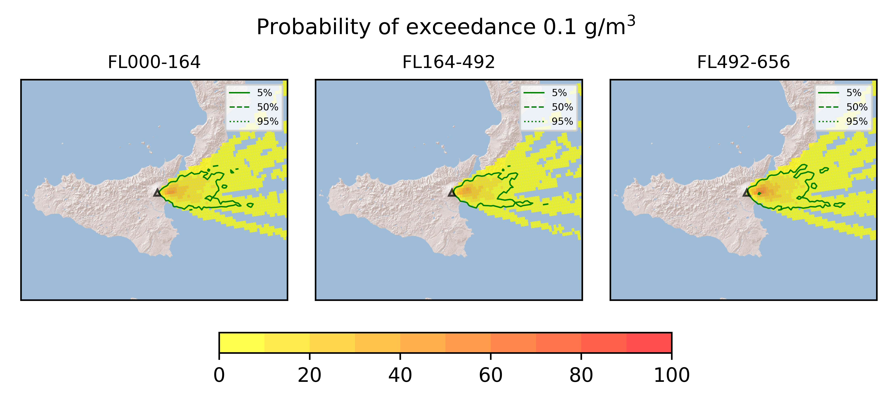
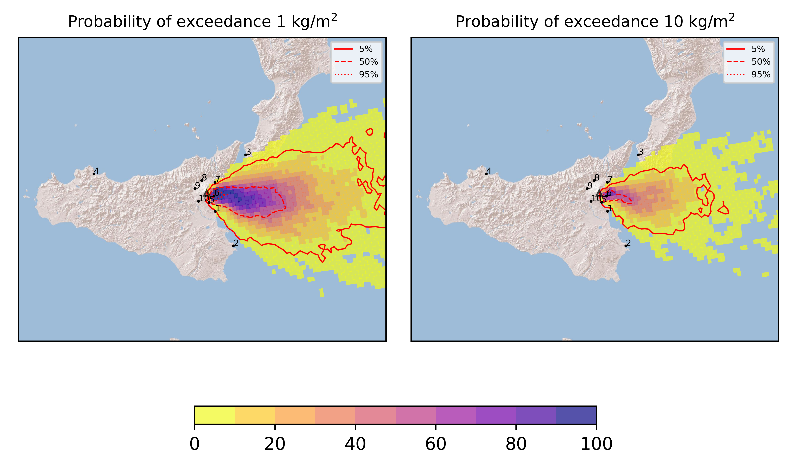
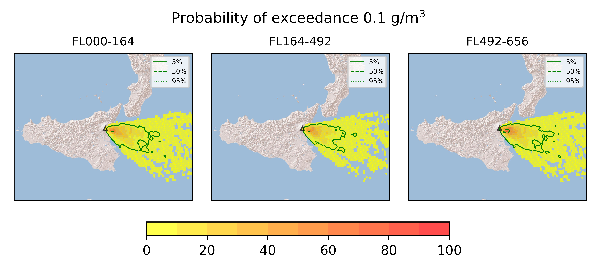

Forecast from VONA bulletin - 20210314_2236Z
============================================

Contents
========

* [Forecast products](#forecast-products)
	* [Forecast at 2021-03-15 01:40 Z](#forecast-at-2021-03-15-0140-z)
	* [Forecast at 2021-03-15 04:40 Z](#forecast-at-2021-03-15-0440-z)
	* [Forecast at 2021-03-15 07:40 Z](#forecast-at-2021-03-15-0740-z)

# Forecast products

## Forecast at 2021-03-15 01:40 Z
  

|Eruption start [Z]|Eruption end [Z]|Forecast time [Z]|Column height asl [m]|
| :--- | :--- | :--- | :--- |
|2021-03-14 22:40:00|Ongoing|2021-03-15 01:40:00|[6000 m, 12000 m]|
  
  

|Percentile|MER [kg/s¹]|Mass in the air [kg]|Mass on the ground [kg]|
| :--- | :--- | :--- | :--- |
|5th|6.21e+04|1.16e+08|5.64e+08|
|50th|1.18e+06|1.76e+09|8.73e+09|
|95th|1.32e+07|3.67e+10|1.04e+11|
  

### Ground 2021-03-15 01:40 Z
  
  
  
  
  
  
  
  
  
  
  

|Location|Ground load [kg/m²] 5th perc|Ground load [kg/m²] 50th perc|Ground load [kg/m²] 95th perc|
| :--- | :--- | :--- | :--- |
|Catania AP (1)|0.00e+00|0.00e+00|8.69e-05|
|Siracusa (2)|0.00e+00|0.00e+00|0.00e+00|
|Reggio Calabria AP (3)|0.00e+00|0.00e+00|2.23e-04|
|Palermo AP (4)|0.00e+00|0.00e+00|0.00e+00|
|Nicolosi (5)|0.00e+00|2.44e-05|2.73e-01|
|Zafferana (6)|4.23e-02|2.88e+00|9.73e+01|
|Linguaglossa (7)|0.00e+00|5.28e-06|1.81e-02|
|Randazzo (8)|0.00e+00|0.00e+00|3.00e-11|
|Bronte (9)|0.00e+00|0.00e+00|0.00e+00|
|Biancavilla (10)|0.00e+00|0.00e+00|1.48e-09|
  

### Atmosphere 2021-03-15 01:40 Z
  

## Forecast at 2021-03-15 04:40 Z
  

|Eruption start [Z]|Eruption end [Z]|Forecast time [Z]|Column height asl [m]|
| :--- | :--- | :--- | :--- |
|2021-03-14 22:40:00|Ongoing|2021-03-15 04:40:00|[6000 m, 12000 m]|
  
  

|Percentile|MER [kg/s¹]|Mass in the air [kg]|Mass on the ground [kg]|
| :--- | :--- | :--- | :--- |
|5th|1.57e+05|1.20e+08|3.41e+09|
|50th|1.96e+06|4.66e+09|3.71e+10|
|95th|1.46e+07|2.82e+10|1.98e+11|
  

### Ground 2021-03-15 04:40 Z
  
  
  
  
  
  
  
  
  
  
  

|Location|Ground load [kg/m²] 5th perc|Ground load [kg/m²] 50th perc|Ground load [kg/m²] 95th perc|
| :--- | :--- | :--- | :--- |
|Catania AP (1)|0.00e+00|2.13e-04|9.86e-02|
|Siracusa (2)|0.00e+00|0.00e+00|1.13e-06|
|Reggio Calabria AP (3)|0.00e+00|0.00e+00|2.23e-04|
|Palermo AP (4)|0.00e+00|0.00e+00|0.00e+00|
|Nicolosi (5)|9.40e-06|1.49e-01|2.07e+01|
|Zafferana (6)|1.46e+00|1.94e+01|1.63e+02|
|Linguaglossa (7)|2.32e-08|3.16e-05|6.45e-02|
|Randazzo (8)|0.00e+00|0.00e+00|8.96e-07|
|Bronte (9)|0.00e+00|0.00e+00|6.50e-07|
|Biancavilla (10)|0.00e+00|7.00e-10|2.19e-05|
  

### Atmosphere 2021-03-15 04:40 Z
  

## Forecast at 2021-03-15 07:40 Z
  

|Eruption start [Z]|Eruption end [Z]|Forecast time [Z]|Column height asl [m]|
| :--- | :--- | :--- | :--- |
|2021-03-14 22:40:00|Ongoing|2021-03-15 07:40:00|[6000 m, 12000 m]|
  
  

|Percentile|MER [kg/s¹]|Mass in the air [kg]|Mass on the ground [kg]|
| :--- | :--- | :--- | :--- |
|5th|1.53e+05|2.94e+08|8.93e+09|
|50th|2.08e+06|4.29e+09|9.80e+10|
|95th|1.48e+07|2.61e+10|2.30e+11|
  

### Ground 2021-03-15 07:40 Z
  
  
  
  
  
  
  
  
  
  
  

|Location|Ground load [kg/m²] 5th perc|Ground load [kg/m²] 50th perc|Ground load [kg/m²] 95th perc|
| :--- | :--- | :--- | :--- |
|Catania AP (1)|2.30e-05|1.08e-02|9.72e-01|
|Siracusa (2)|0.00e+00|5.00e-11|3.19e-03|
|Reggio Calabria AP (3)|0.00e+00|0.00e+00|2.23e-04|
|Palermo AP (4)|0.00e+00|0.00e+00|0.00e+00|
|Nicolosi (5)|4.94e-02|2.83e+00|5.04e+01|
|Zafferana (6)|4.17e+00|5.10e+01|1.96e+02|
|Linguaglossa (7)|2.29e-07|7.01e-05|7.04e-02|
|Randazzo (8)|0.00e+00|2.65e-09|1.06e-06|
|Bronte (9)|0.00e+00|1.40e-09|9.89e-07|
|Biancavilla (10)|9.50e-11|1.93e-07|3.81e-05|
  

### Atmosphere 2021-03-15 07:40 Z
  
  
Go to [Supplementary page](Supplementary_page.md)  
Go to [Main directory](https://github.com/federicapardini/Real_time_ash_forecast)