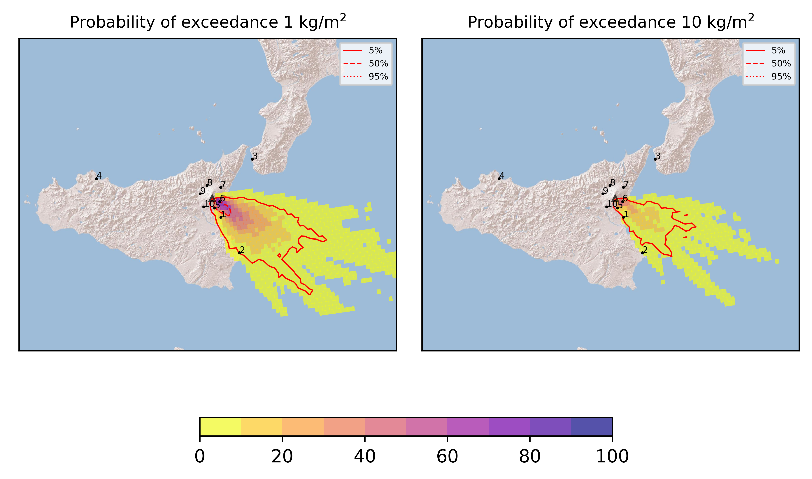
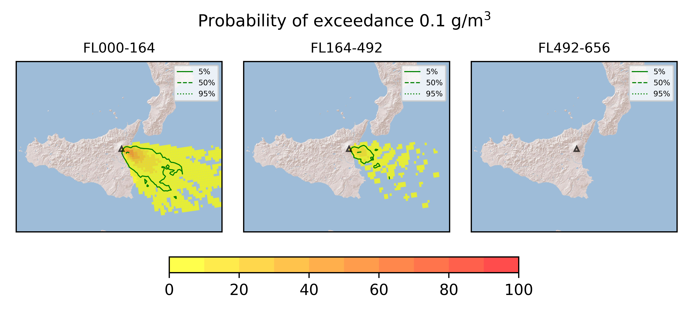
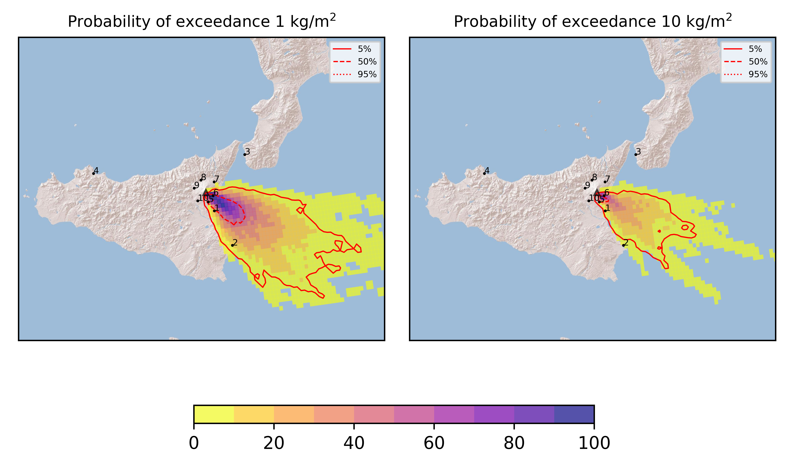
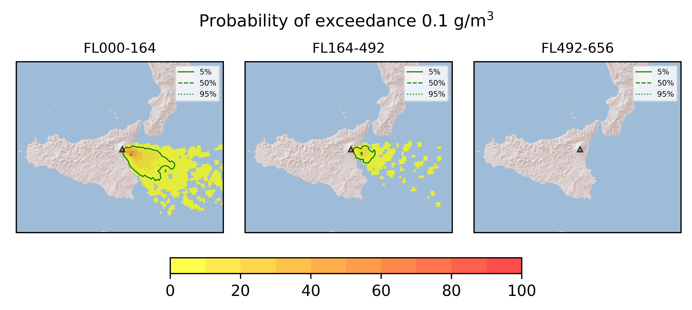
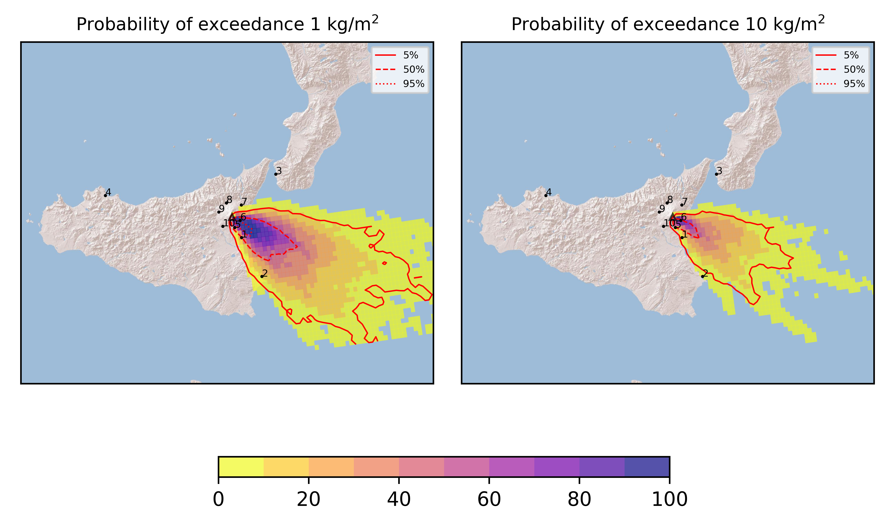
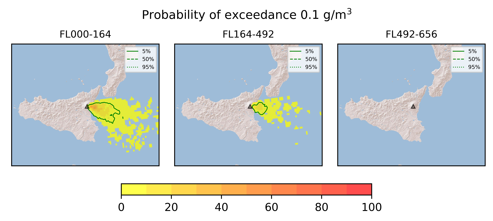
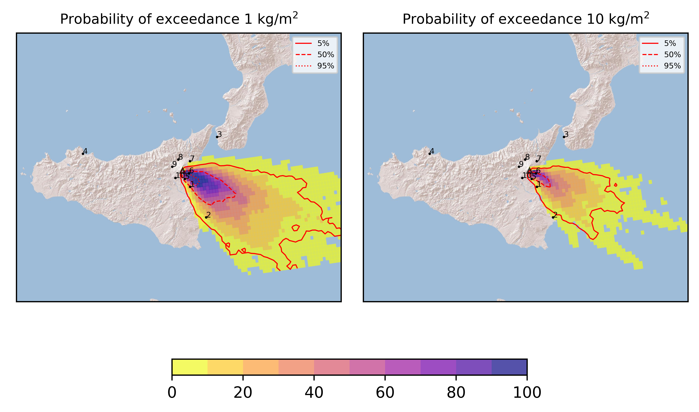
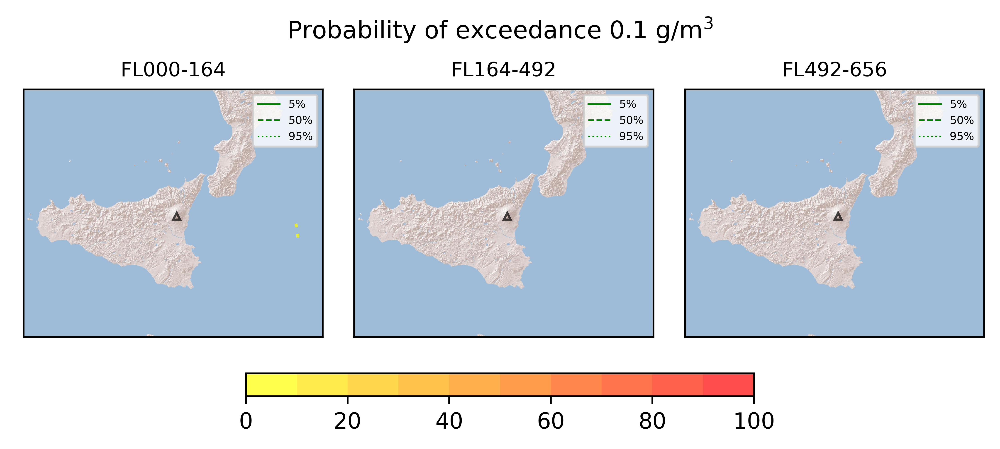

Forecast from VONA bulletin - 20210317_0226Z
============================================

Contents
========

* [Forecast products](#forecast-products)
	* [Forecast at 2021-03-17 05:30 Z](#forecast-at-2021-03-17-0530-z)
	* [Forecast at 2021-03-17 08:30 Z](#forecast-at-2021-03-17-0830-z)
	* [Forecast at 2021-03-17 11:30 Z](#forecast-at-2021-03-17-1130-z)
	* [Forecast at 2021-03-17 14:30 Z](#forecast-at-2021-03-17-1430-z)
	* [Forecast at 2021-03-17 14:30 Z](#forecast-at-2021-03-17-1430-z)
	* [Forecast at 2021-03-17 14:30 Z](#forecast-at-2021-03-17-1430-z)
	* [Forecast at 2021-03-17 14:30 Z](#forecast-at-2021-03-17-1430-z)
	* [Forecast at 2021-03-17 14:30 Z](#forecast-at-2021-03-17-1430-z)

# Forecast products

## Forecast at 2021-03-17 05:30 Z
  

|Eruption start [Z]|Eruption end [Z]|Forecast time [Z]|Column height asl [m]|
| :--- | :--- | :--- | :--- |
|2021-03-17 02:30:00|Ongoing|2021-03-17 05:30:00|[6000 m, 12000 m]|
  
  

|Percentile|MER [kg/s¹]|Mass in the air [kg]|Mass on the ground [kg]|
| :--- | :--- | :--- | :--- |
|5th|2.11e+05|2.77e+08|2.06e+09|
|50th|1.42e+06|1.87e+09|1.32e+10|
|95th|1.44e+07|3.08e+10|1.12e+11|
  

### Ground 2021-03-17 05:30 Z
  
  
  
  
  
  
  
  
  
  
  

|Location|Ground load [kg/m²] 5th perc|Ground load [kg/m²] 50th perc|Ground load [kg/m²] 95th perc|
| :--- | :--- | :--- | :--- |
|Catania AP (1)|5.66e-06|1.27e-01|1.84e+01|
|Siracusa (2)|0.00e+00|0.00e+00|8.38e-01|
|Reggio Calabria AP (3)|0.00e+00|0.00e+00|0.00e+00|
|Palermo AP (4)|0.00e+00|0.00e+00|0.00e+00|
|Nicolosi (5)|3.71e-04|1.74e+00|6.30e+01|
|Zafferana (6)|0.00e+00|1.03e+00|1.04e+02|
|Linguaglossa (7)|0.00e+00|0.00e+00|0.00e+00|
|Randazzo (8)|0.00e+00|0.00e+00|0.00e+00|
|Bronte (9)|0.00e+00|0.00e+00|0.00e+00|
|Biancavilla (10)|0.00e+00|0.00e+00|0.00e+00|
  

### Atmosphere 2021-03-17 05:30 Z
  

## Forecast at 2021-03-17 08:30 Z
  

|Eruption start [Z]|Eruption end [Z]|Forecast time [Z]|Column height asl [m]|
| :--- | :--- | :--- | :--- |
|2021-03-17 02:30:00|Ongoing|2021-03-17 08:30:00|[6000 m, 12000 m]|
  
  

|Percentile|MER [kg/s¹]|Mass in the air [kg]|Mass on the ground [kg]|
| :--- | :--- | :--- | :--- |
|5th|1.42e+05|1.18e+08|8.00e+09|
|50th|1.11e+06|2.18e+09|3.63e+10|
|95th|1.17e+07|1.57e+10|1.74e+11|
  

### Ground 2021-03-17 08:30 Z
  
  
  
  
  
  
  
  
  
  
  

|Location|Ground load [kg/m²] 5th perc|Ground load [kg/m²] 50th perc|Ground load [kg/m²] 95th perc|
| :--- | :--- | :--- | :--- |
|Catania AP (1)|3.85e-03|4.33e-01|2.53e+01|
|Siracusa (2)|0.00e+00|2.21e-03|3.46e+00|
|Reggio Calabria AP (3)|0.00e+00|0.00e+00|0.00e+00|
|Palermo AP (4)|0.00e+00|0.00e+00|0.00e+00|
|Nicolosi (5)|4.55e-02|1.12e+01|1.58e+02|
|Zafferana (6)|6.28e-03|5.17e+00|2.06e+02|
|Linguaglossa (7)|0.00e+00|0.00e+00|0.00e+00|
|Randazzo (8)|0.00e+00|0.00e+00|0.00e+00|
|Bronte (9)|0.00e+00|0.00e+00|0.00e+00|
|Biancavilla (10)|0.00e+00|0.00e+00|0.00e+00|
  

### Atmosphere 2021-03-17 08:30 Z
  

## Forecast at 2021-03-17 11:30 Z
  

|Eruption start [Z]|Eruption end [Z]|Forecast time [Z]|Column height asl [m]|
| :--- | :--- | :--- | :--- |
|2021-03-17 02:30:00|2021-03-17 10:10:00|2021-03-17 11:30:00|[6000 m, 12000 m]|
  
  

|Percentile|MER [kg/s¹]|Mass in the air [kg]|Mass on the ground [kg]|
| :--- | :--- | :--- | :--- |
|5th|1.10e+05|1.14e+08|1.32e+10|
|50th|9.24e+05|1.99e+09|7.39e+10|
|95th|1.17e+07|1.64e+10|1.98e+11|
  

### Ground 2021-03-17 11:30 Z
  
  
  
  
  
  
  
  
  
  
  

|Location|Ground load [kg/m²] 5th perc|Ground load [kg/m²] 50th perc|Ground load [kg/m²] 95th perc|
| :--- | :--- | :--- | :--- |
|Catania AP (1)|2.46e-02|1.35e+00|2.53e+01|
|Siracusa (2)|0.00e+00|1.24e-02|3.48e+00|
|Reggio Calabria AP (3)|0.00e+00|0.00e+00|0.00e+00|
|Palermo AP (4)|0.00e+00|0.00e+00|0.00e+00|
|Nicolosi (5)|5.84e-01|1.50e+01|1.60e+02|
|Zafferana (6)|9.36e-01|1.80e+01|2.14e+02|
|Linguaglossa (7)|0.00e+00|0.00e+00|1.04e-04|
|Randazzo (8)|0.00e+00|0.00e+00|0.00e+00|
|Bronte (9)|0.00e+00|0.00e+00|0.00e+00|
|Biancavilla (10)|0.00e+00|0.00e+00|5.66e-06|
  

### Atmosphere 2021-03-17 11:30 Z
  

## Forecast at 2021-03-17 14:30 Z
  

|Eruption start [Z]|Eruption end [Z]|Forecast time [Z]|Column height asl [m]|
| :--- | :--- | :--- | :--- |
|2021-03-17 02:30:00|2021-03-17 10:10:00|2021-03-17 14:30:00|[6000 m, 12000 m]|
  
  

|Percentile|MER [kg/s¹]|Mass in the air [kg]|Mass on the ground [kg]|
| :--- | :--- | :--- | :--- |
|5th|1.10e+05|1.14e+08|1.32e+10|
|50th|9.24e+05|1.99e+09|7.39e+10|
|95th|1.17e+07|1.64e+10|1.98e+11|
  

### Ground 2021-03-17 14:30 Z
  
  
  
  
  
  
  
  
  
  

|Location|Ground load [kg/m²] 5th perc|Ground load [kg/m²] 50th perc|Ground load [kg/m²] 95th perc|
| :--- | :--- | :--- | :--- |
|Catania AP (1)|2.46e-02|1.35e+00|2.53e+01|
|Siracusa (2)|0.00e+00|1.24e-02|3.48e+00|
|Reggio Calabria AP (3)|0.00e+00|0.00e+00|0.00e+00|
|Palermo AP (4)|0.00e+00|0.00e+00|0.00e+00|
|Nicolosi (5)|5.84e-01|1.50e+01|1.60e+02|
|Zafferana (6)|9.36e-01|1.80e+01|2.14e+02|
|Linguaglossa (7)|0.00e+00|0.00e+00|1.04e-04|
|Randazzo (8)|0.00e+00|0.00e+00|0.00e+00|
|Bronte (9)|0.00e+00|0.00e+00|0.00e+00|
|Biancavilla (10)|0.00e+00|0.00e+00|5.66e-06|
  

### Atmosphere 2021-03-17 14:30 Z

## Forecast at 2021-03-17 14:30 Z
  

|Eruption start [Z]|Eruption end [Z]|Forecast time [Z]|Column height asl [m]|
| :--- | :--- | :--- | :--- |
|2021-03-17 02:30:00|2021-03-17 10:10:00|2021-03-17 14:30:00|[6000 m, 12000 m]|
  
  

|Percentile|MER [kg/s¹]|Mass in the air [kg]|Mass on the ground [kg]|
| :--- | :--- | :--- | :--- |
|5th|0.00e+00|2.22e+01|1.34e+10|
|50th|0.00e+00|4.34e+05|7.70e+10|
|95th|0.00e+00|9.09e+07|2.13e+11|
  

### Ground 2021-03-17 14:30 Z
  
  
  
  
  
  
  
  
  
  
  

|Location|Ground load [kg/m²] 5th perc|Ground load [kg/m²] 50th perc|Ground load [kg/m²] 95th perc|
| :--- | :--- | :--- | :--- |
|Catania AP (1)|2.46e-02|1.35e+00|2.53e+01|
|Siracusa (2)|0.00e+00|1.50e-02|3.48e+00|
|Reggio Calabria AP (3)|0.00e+00|0.00e+00|0.00e+00|
|Palermo AP (4)|0.00e+00|0.00e+00|0.00e+00|
|Nicolosi (5)|8.03e-01|1.50e+01|1.60e+02|
|Zafferana (6)|9.89e-01|1.85e+01|2.15e+02|
|Linguaglossa (7)|0.00e+00|0.00e+00|1.19e-04|
|Randazzo (8)|0.00e+00|0.00e+00|0.00e+00|
|Bronte (9)|0.00e+00|0.00e+00|0.00e+00|
|Biancavilla (10)|0.00e+00|0.00e+00|1.02e-05|
  

### Atmosphere 2021-03-17 14:30 Z
  

## Forecast at 2021-03-17 14:30 Z
  

|Eruption start [Z]|Eruption end [Z]|Forecast time [Z]|Column height asl [m]|
| :--- | :--- | :--- | :--- |
|2021-03-17 02:30:00|2021-03-17 10:10:00|2021-03-17 14:30:00|None|
  
  

|Percentile|MER [kg/s¹]|Mass in the air [kg]|Mass on the ground [kg]|
| :--- | :--- | :--- | :--- |
|5th|0.00e+00|2.22e+01|1.34e+10|
|50th|0.00e+00|4.34e+05|7.70e+10|
|95th|0.00e+00|9.09e+07|2.13e+11|
  

### Ground 2021-03-17 14:30 Z
  
  
  
  
  
  
  
  
  
  
  

|Location|Ground load [kg/m²] 5th perc|Ground load [kg/m²] 50th perc|Ground load [kg/m²] 95th perc|
| :--- | :--- | :--- | :--- |
|Catania AP (1)|2.46e-02|1.35e+00|2.53e+01|
|Siracusa (2)|0.00e+00|1.50e-02|3.48e+00|
|Reggio Calabria AP (3)|0.00e+00|0.00e+00|0.00e+00|
|Palermo AP (4)|0.00e+00|0.00e+00|0.00e+00|
|Nicolosi (5)|8.03e-01|1.50e+01|1.60e+02|
|Zafferana (6)|9.89e-01|1.85e+01|2.15e+02|
|Linguaglossa (7)|0.00e+00|0.00e+00|1.19e-04|
|Randazzo (8)|0.00e+00|0.00e+00|0.00e+00|
|Bronte (9)|0.00e+00|0.00e+00|0.00e+00|
|Biancavilla (10)|0.00e+00|0.00e+00|1.02e-05|
  

### Atmosphere 2021-03-17 14:30 Z
  

## Forecast at 2021-03-17 14:30 Z
  

|Eruption start [Z]|Eruption end [Z]|Forecast time [Z]|Column height asl [m]|
| :--- | :--- | :--- | :--- |
|2021-03-17 02:30:00|2021-03-17 10:10:00|2021-03-17 14:30:00|None|
  
  

|Percentile|MER [kg/s¹]|Mass in the air [kg]|Mass on the ground [kg]|
| :--- | :--- | :--- | :--- |
|5th|0.00e+00|2.22e+01|1.34e+10|
|50th|0.00e+00|4.34e+05|7.70e+10|
|95th|0.00e+00|9.09e+07|2.13e+11|
  

### Ground 2021-03-17 14:30 Z
  
  
  
  
  
  
  
  
  
  
  

|Location|Ground load [kg/m²] 5th perc|Ground load [kg/m²] 50th perc|Ground load [kg/m²] 95th perc|
| :--- | :--- | :--- | :--- |
|Catania AP (1)|2.46e-02|1.35e+00|2.53e+01|
|Siracusa (2)|0.00e+00|1.50e-02|3.48e+00|
|Reggio Calabria AP (3)|0.00e+00|0.00e+00|0.00e+00|
|Palermo AP (4)|0.00e+00|0.00e+00|0.00e+00|
|Nicolosi (5)|8.03e-01|1.50e+01|1.60e+02|
|Zafferana (6)|9.89e-01|1.85e+01|2.15e+02|
|Linguaglossa (7)|0.00e+00|0.00e+00|1.19e-04|
|Randazzo (8)|0.00e+00|0.00e+00|0.00e+00|
|Bronte (9)|0.00e+00|0.00e+00|0.00e+00|
|Biancavilla (10)|0.00e+00|0.00e+00|1.02e-05|
  

### Atmosphere 2021-03-17 14:30 Z
  

## Forecast at 2021-03-17 14:30 Z
  

|Eruption start [Z]|Eruption end [Z]|Forecast time [Z]|Column height asl [m]|
| :--- | :--- | :--- | :--- |
|2021-03-17 02:30:00|2021-03-17 10:10:00|2021-03-17 14:30:00|None|
  
  

|Percentile|MER [kg/s¹]|Mass in the air [kg]|Mass on the ground [kg]|
| :--- | :--- | :--- | :--- |
|5th|0.00e+00|2.22e+01|1.34e+10|
|50th|0.00e+00|4.34e+05|7.70e+10|
|95th|0.00e+00|9.09e+07|2.13e+11|
  

### Ground 2021-03-17 14:30 Z
  
  
  
  
  
  
  
  
  
  
  

|Location|Ground load [kg/m²] 5th perc|Ground load [kg/m²] 50th perc|Ground load [kg/m²] 95th perc|
| :--- | :--- | :--- | :--- |
|Catania AP (1)|2.46e-02|1.35e+00|2.53e+01|
|Siracusa (2)|0.00e+00|1.50e-02|3.48e+00|
|Reggio Calabria AP (3)|0.00e+00|0.00e+00|0.00e+00|
|Palermo AP (4)|0.00e+00|0.00e+00|0.00e+00|
|Nicolosi (5)|8.03e-01|1.50e+01|1.60e+02|
|Zafferana (6)|9.89e-01|1.85e+01|2.15e+02|
|Linguaglossa (7)|0.00e+00|0.00e+00|1.19e-04|
|Randazzo (8)|0.00e+00|0.00e+00|0.00e+00|
|Bronte (9)|0.00e+00|0.00e+00|0.00e+00|
|Biancavilla (10)|0.00e+00|0.00e+00|1.02e-05|
  

### Atmosphere 2021-03-17 14:30 Z
  
  
Go to [Supplementary page](Supplementary_page.md)  
Go to [Main directory](https://github.com/federicapardini/Real_time_ash_forecast)