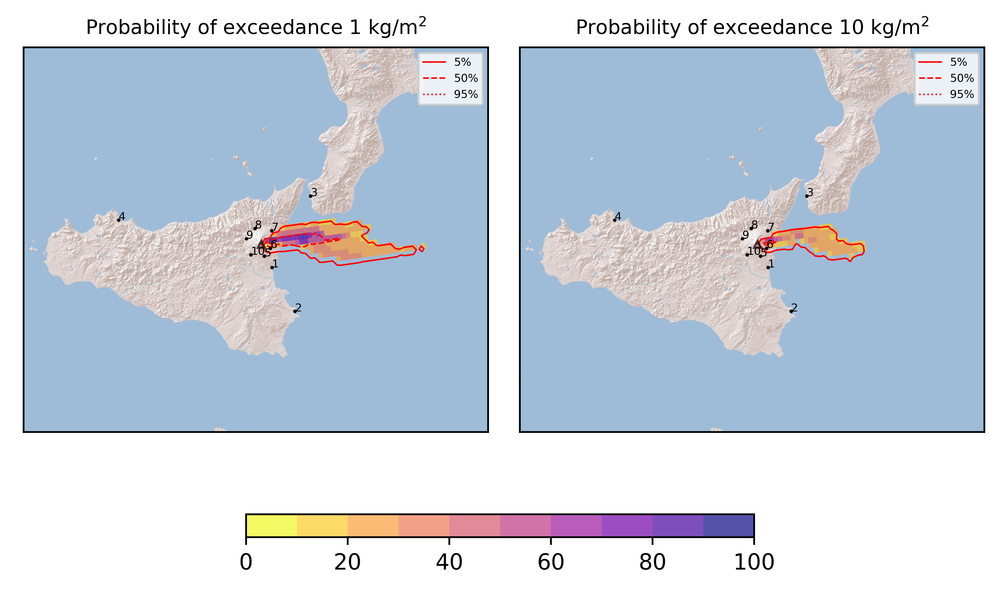
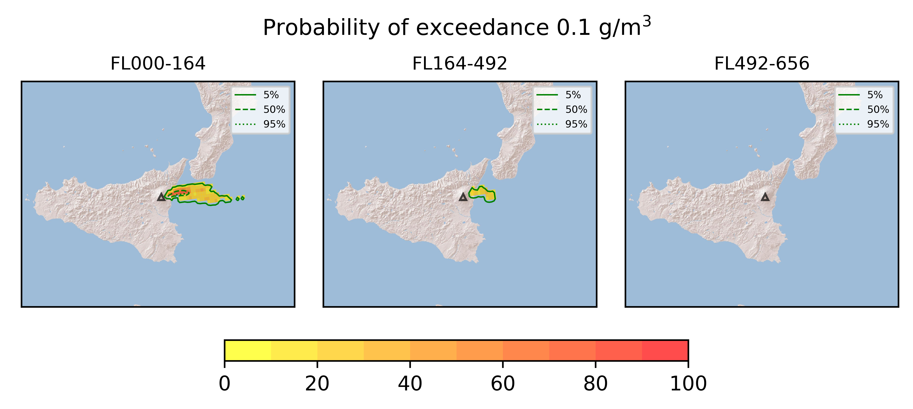

Forecast from VONA bulletin - 20210318_1800Z
============================================

Contents
========

* [Forecast products](#forecast-products)
	* [Forecast at 2021-03-18 21:00 Z](#forecast-at-2021-03-18-2100-z)

# Forecast products

## Forecast at 2021-03-18 21:00 Z
  

|Eruption start [Z]|Eruption end [Z]|Forecast time [Z]|Column height asl [m]|
| :--- | :--- | :--- | :--- |
|2021-03-18 18:00:00|Ongoing|2021-03-18 21:00:00|[6000 m, 12000 m]|
  
  

|Percentile|MER [kg/s¹]|Mass in the air [kg]|Mass on the ground [kg]|
| :--- | :--- | :--- | :--- |
|5th|1.20e+05|4.70e+08|1.06e+09|
|50th|1.89e+06|2.68e+09|1.70e+10|
|95th|6.15e+06|6.92e+09|5.19e+10|
  

### Ground 2021-03-18 21:00 Z
  
  
  
  
  
  
  
  
  
  
  

|Location|Ground load [kg/m²] 5th perc|Ground load [kg/m²] 50th perc|Ground load [kg/m²] 95th perc|
| :--- | :--- | :--- | :--- |
|Catania AP (1)|0.00e+00|0.00e+00|0.00e+00|
|Siracusa (2)|0.00e+00|0.00e+00|0.00e+00|
|Reggio Calabria AP (3)|0.00e+00|0.00e+00|0.00e+00|
|Palermo AP (4)|0.00e+00|0.00e+00|0.00e+00|
|Nicolosi (5)|0.00e+00|0.00e+00|3.07e-06|
|Zafferana (6)|1.63e-01|2.97e+00|4.84e+01|
|Linguaglossa (7)|0.00e+00|7.44e-06|3.47e-02|
|Randazzo (8)|0.00e+00|0.00e+00|0.00e+00|
|Bronte (9)|0.00e+00|0.00e+00|0.00e+00|
|Biancavilla (10)|0.00e+00|0.00e+00|0.00e+00|
  

### Atmosphere 2021-03-18 21:00 Z
  
  
Go to [Supplementary page](Supplementary_page.md)  
Go to [Main directory](https://github.com/federicapardini/Real_time_ash_forecast)