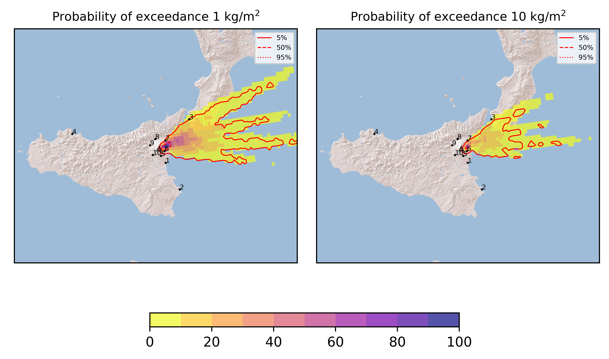
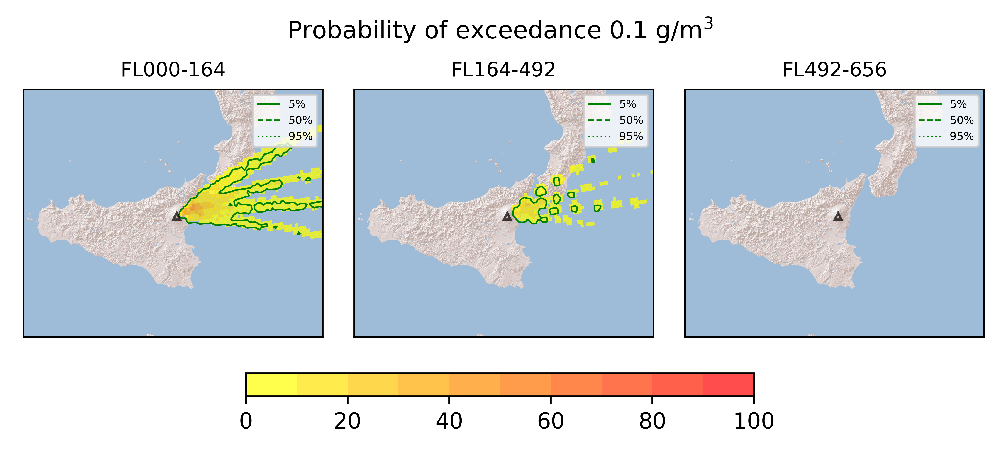
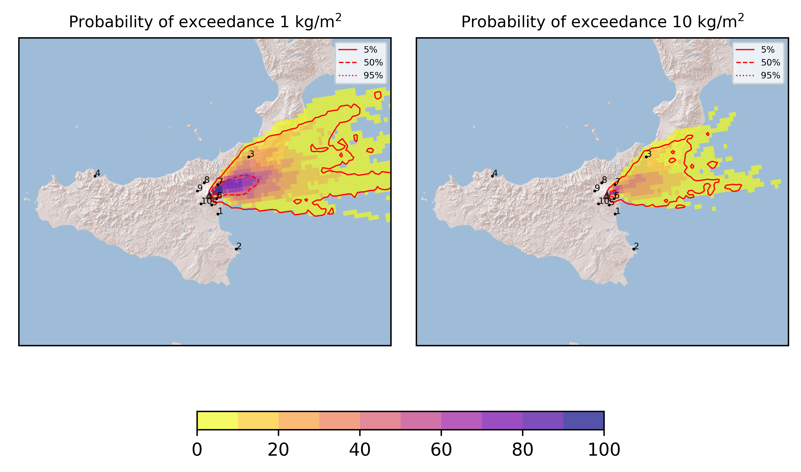
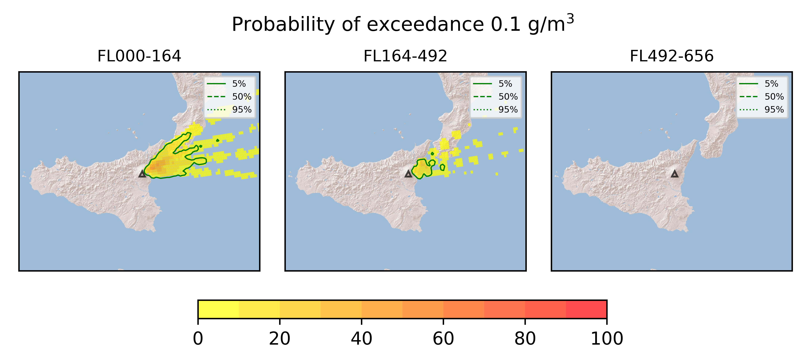
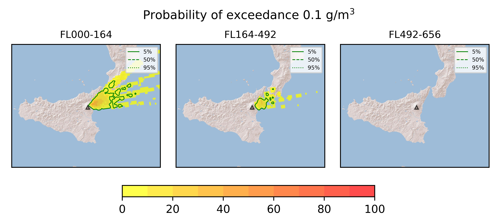

Forecast from VONA bulletin - 20210319_0816Z
============================================

Contents
========

* [Forecast products](#forecast-products)
	* [Forecast at 2021-03-19 11:20 Z](#forecast-at-2021-03-19-1120-z)
	* [Forecast at 2021-03-19 14:20 Z](#forecast-at-2021-03-19-1420-z)
	* [Forecast at 2021-03-19 17:20 Z](#forecast-at-2021-03-19-1720-z)

# Forecast products

## Forecast at 2021-03-19 11:20 Z
  

|Eruption start [Z]|Eruption end [Z]|Forecast time [Z]|Column height asl [m]|
| :--- | :--- | :--- | :--- |
|2021-03-19 08:20:00|Ongoing|2021-03-19 11:20:00|[6000 m, 12000 m]|
  
  

|Percentile|MER [kg/s¹]|Mass in the air [kg]|Mass on the ground [kg]|
| :--- | :--- | :--- | :--- |
|5th|1.26e+05|9.22e+07|1.26e+09|
|50th|8.56e+05|9.88e+08|8.26e+09|
|95th|1.61e+07|3.37e+10|1.25e+11|
  

### Ground 2021-03-19 11:20 Z
  
  
  
  
  
  
  
  
  
  
  

|Location|Ground load [kg/m²] 5th perc|Ground load [kg/m²] 50th perc|Ground load [kg/m²] 95th perc|
| :--- | :--- | :--- | :--- |
|Catania AP (1)|0.00e+00|0.00e+00|0.00e+00|
|Siracusa (2)|0.00e+00|0.00e+00|0.00e+00|
|Reggio Calabria AP (3)|0.00e+00|0.00e+00|1.74e+00|
|Palermo AP (4)|0.00e+00|0.00e+00|0.00e+00|
|Nicolosi (5)|0.00e+00|0.00e+00|0.00e+00|
|Zafferana (6)|1.43e-01|2.46e+00|5.45e+01|
|Linguaglossa (7)|0.00e+00|1.81e-02|7.54e+00|
|Randazzo (8)|0.00e+00|0.00e+00|0.00e+00|
|Bronte (9)|0.00e+00|0.00e+00|0.00e+00|
|Biancavilla (10)|0.00e+00|0.00e+00|0.00e+00|
  

### Atmosphere 2021-03-19 11:20 Z
  

## Forecast at 2021-03-19 14:20 Z
  

|Eruption start [Z]|Eruption end [Z]|Forecast time [Z]|Column height asl [m]|
| :--- | :--- | :--- | :--- |
|2021-03-19 08:20:00|Ongoing|2021-03-19 14:20:00|[6000 m, 12000 m]|
  
  

|Percentile|MER [kg/s¹]|Mass in the air [kg]|Mass on the ground [kg]|
| :--- | :--- | :--- | :--- |
|5th|1.64e+05|1.99e+08|4.55e+09|
|50th|6.87e+05|1.61e+09|3.00e+10|
|95th|1.18e+07|1.72e+10|2.06e+11|
  

### Ground 2021-03-19 14:20 Z
  
  
  
  
  
  
  
  
  
  
  

|Location|Ground load [kg/m²] 5th perc|Ground load [kg/m²] 50th perc|Ground load [kg/m²] 95th perc|
| :--- | :--- | :--- | :--- |
|Catania AP (1)|0.00e+00|0.00e+00|0.00e+00|
|Siracusa (2)|0.00e+00|0.00e+00|0.00e+00|
|Reggio Calabria AP (3)|0.00e+00|1.01e-04|4.11e+01|
|Palermo AP (4)|0.00e+00|0.00e+00|0.00e+00|
|Nicolosi (5)|0.00e+00|0.00e+00|1.33e-06|
|Zafferana (6)|5.48e-01|4.74e+00|5.80e+01|
|Linguaglossa (7)|5.35e-02|1.15e+00|2.45e+01|
|Randazzo (8)|0.00e+00|0.00e+00|4.36e-04|
|Bronte (9)|0.00e+00|0.00e+00|0.00e+00|
|Biancavilla (10)|0.00e+00|0.00e+00|0.00e+00|
  

### Atmosphere 2021-03-19 14:20 Z
  

## Forecast at 2021-03-19 17:20 Z
  

|Eruption start [Z]|Eruption end [Z]|Forecast time [Z]|Column height asl [m]|
| :--- | :--- | :--- | :--- |
|2021-03-19 08:20:00|Ongoing|2021-03-19 17:20:00|[6000 m, 12000 m]|
  
  

|Percentile|MER [kg/s¹]|Mass in the air [kg]|Mass on the ground [kg]|
| :--- | :--- | :--- | :--- |
|5th|1.45e+05|1.80e+08|8.61e+09|
|50th|5.52e+05|1.16e+09|7.60e+10|
|95th|1.04e+07|1.44e+10|2.30e+11|
  

### Ground 2021-03-19 17:20 Z
  
  
  
  
  
  
  
  
  
  
  

|Location|Ground load [kg/m²] 5th perc|Ground load [kg/m²] 50th perc|Ground load [kg/m²] 95th perc|
| :--- | :--- | :--- | :--- |
|Catania AP (1)|0.00e+00|0.00e+00|0.00e+00|
|Siracusa (2)|0.00e+00|0.00e+00|0.00e+00|
|Reggio Calabria AP (3)|2.42e-05|2.82e-01|8.68e+01|
|Palermo AP (4)|0.00e+00|0.00e+00|0.00e+00|
|Nicolosi (5)|0.00e+00|0.00e+00|2.67e-06|
|Zafferana (6)|6.12e-01|7.37e+00|5.81e+01|
|Linguaglossa (7)|5.25e-01|6.36e+00|5.01e+01|
|Randazzo (8)|0.00e+00|5.33e-06|7.20e-03|
|Bronte (9)|0.00e+00|0.00e+00|0.00e+00|
|Biancavilla (10)|0.00e+00|0.00e+00|0.00e+00|
  

### Atmosphere 2021-03-19 17:20 Z
  
  
Go to [Supplementary page](Supplementary_page.md)  
Go to [Main directory](https://github.com/federicapardini/Real_time_ash_forecast)