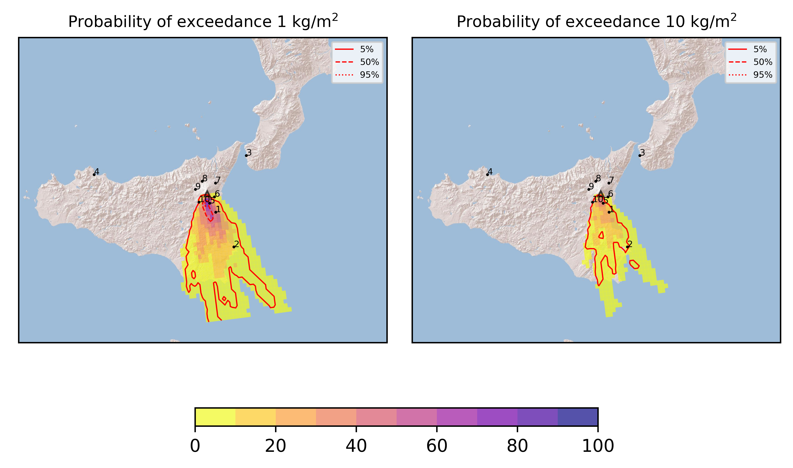
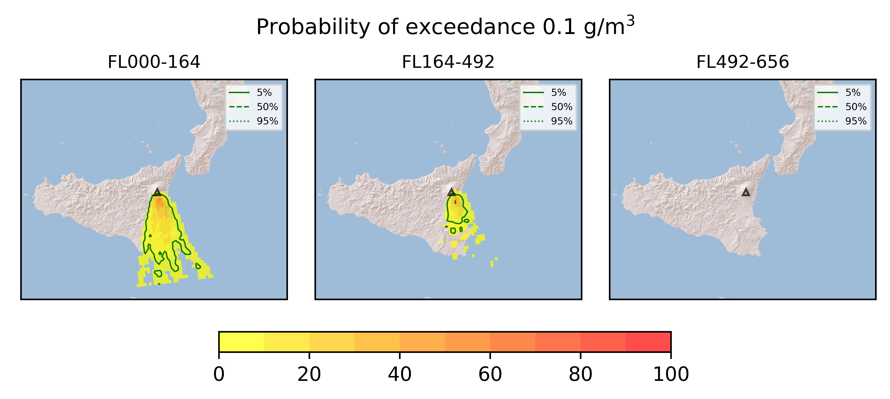

Forecast from VONA bulletin - 20210323_2046Z
============================================

Contents
========

* [Forecast products](#forecast-products)
	* [Forecast at 2021-03-23 23:50 Z](#forecast-at-2021-03-23-2350-z)

# Forecast products

## Forecast at 2021-03-23 23:50 Z
  

|Eruption start [Z]|Eruption end [Z]|Forecast time [Z]|Column height asl [m]|
| :--- | :--- | :--- | :--- |
|2021-03-23 20:50:00|Ongoing|2021-03-23 23:50:00|[6000 m, 12000 m]|
  
  

|Percentile|MER [kg/s¹]|Mass in the air [kg]|Mass on the ground [kg]|
| :--- | :--- | :--- | :--- |
|5th|5.62e+04|3.31e+07|8.68e+08|
|50th|7.65e+05|5.61e+08|8.76e+09|
|95th|1.09e+07|2.29e+10|8.98e+10|
  

### Ground 2021-03-23 23:50 Z
  
  
  
  
  
  
  
  
  
  
  

|Location|Ground load [kg/m²] 5th perc|Ground load [kg/m²] 50th perc|Ground load [kg/m²] 95th perc|
| :--- | :--- | :--- | :--- |
|Catania AP (1)|7.12e-05|2.46e-01|4.07e+01|
|Siracusa (2)|0.00e+00|0.00e+00|7.46e+00|
|Reggio Calabria AP (3)|0.00e+00|0.00e+00|0.00e+00|
|Palermo AP (4)|0.00e+00|0.00e+00|0.00e+00|
|Nicolosi (5)|8.01e-04|1.99e+00|6.81e+01|
|Zafferana (6)|0.00e+00|0.00e+00|6.48e-02|
|Linguaglossa (7)|0.00e+00|0.00e+00|0.00e+00|
|Randazzo (8)|0.00e+00|0.00e+00|0.00e+00|
|Bronte (9)|0.00e+00|0.00e+00|0.00e+00|
|Biancavilla (10)|0.00e+00|1.39e-04|3.30e+00|
  

### Atmosphere 2021-03-23 23:50 Z
  
  
Go to [Supplementary page](Supplementary_page.md)  
Go to [Main directory](https://github.com/federicapardini/Real_time_ash_forecast)