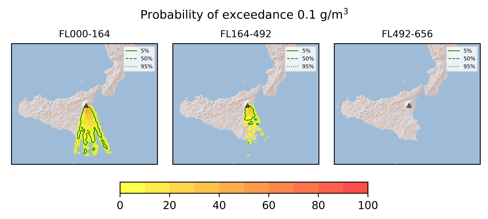
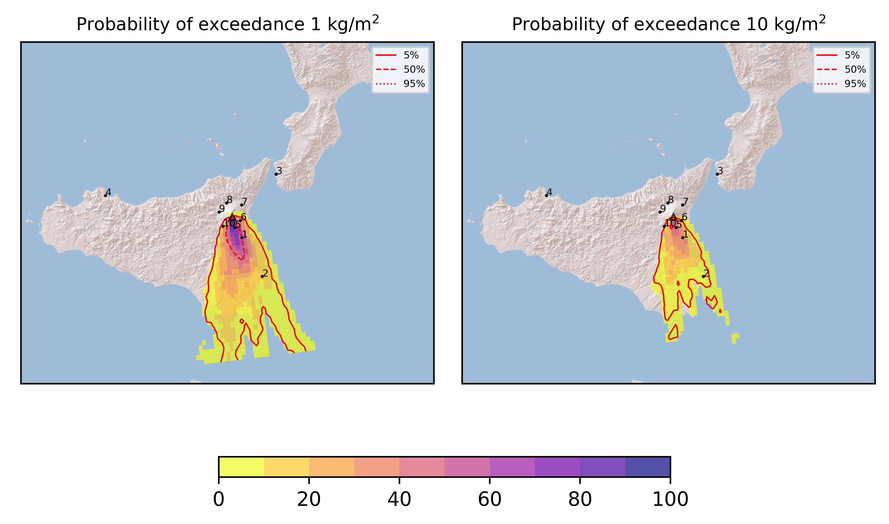
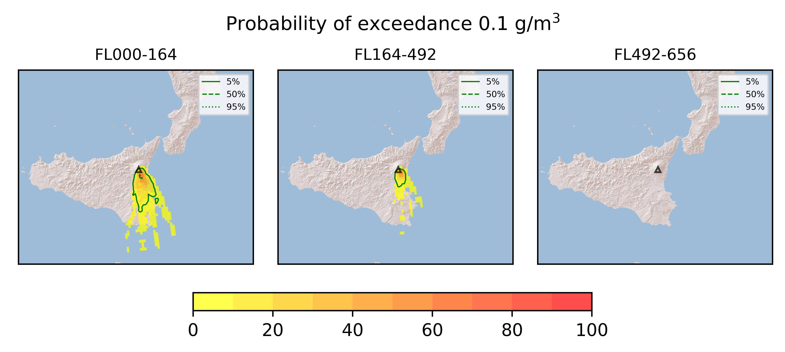
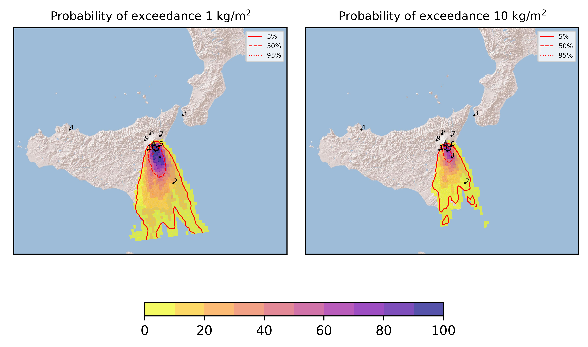

Forecast from VONA bulletin - 20210323_2223Z
============================================

Contents
========

* [Forecast products](#forecast-products)
	* [Forecast at 2021-03-24 01:20 Z](#forecast-at-2021-03-24-0120-z)
	* [Forecast at 2021-03-24 04:20 Z](#forecast-at-2021-03-24-0420-z)
	* [Forecast at 2021-03-24 07:20 Z](#forecast-at-2021-03-24-0720-z)

# Forecast products

## Forecast at 2021-03-24 01:20 Z
  

|Eruption start [Z]|Eruption end [Z]|Forecast time [Z]|Column height asl [m]|
| :--- | :--- | :--- | :--- |
|2021-03-23 22:20:00|Ongoing|2021-03-24 01:20:00|[6000 m, 12000 m]|
  
  

|Percentile|MER [kg/s¹]|Mass in the air [kg]|Mass on the ground [kg]|
| :--- | :--- | :--- | :--- |
|5th|4.83e+04|2.90e+07|4.83e+08|
|50th|6.47e+05|4.55e+08|6.68e+09|
|95th|9.15e+06|1.94e+10|7.79e+10|
  

### Ground 2021-03-24 01:20 Z
  
  
  
  
  
  
  
  
  
  
  

|Location|Ground load [kg/m²] 5th perc|Ground load [kg/m²] 50th perc|Ground load [kg/m²] 95th perc|
| :--- | :--- | :--- | :--- |
|Catania AP (1)|1.54e-05|1.14e-01|4.04e+01|
|Siracusa (2)|0.00e+00|0.00e+00|3.24e+00|
|Reggio Calabria AP (3)|0.00e+00|0.00e+00|0.00e+00|
|Palermo AP (4)|0.00e+00|0.00e+00|0.00e+00|
|Nicolosi (5)|5.40e-06|5.30e-01|7.77e+01|
|Zafferana (6)|0.00e+00|0.00e+00|3.78e-02|
|Linguaglossa (7)|0.00e+00|0.00e+00|0.00e+00|
|Randazzo (8)|0.00e+00|0.00e+00|0.00e+00|
|Bronte (9)|0.00e+00|0.00e+00|0.00e+00|
|Biancavilla (10)|0.00e+00|9.19e-04|3.83e+00|
  

### Atmosphere 2021-03-24 01:20 Z
  

## Forecast at 2021-03-24 04:20 Z
  

|Eruption start [Z]|Eruption end [Z]|Forecast time [Z]|Column height asl [m]|
| :--- | :--- | :--- | :--- |
|2021-03-23 22:20:00|Ongoing|2021-03-24 04:20:00|[6000 m, 12000 m]|
  
  

|Percentile|MER [kg/s¹]|Mass in the air [kg]|Mass on the ground [kg]|
| :--- | :--- | :--- | :--- |
|5th|4.61e+04|2.95e+07|1.33e+09|
|50th|4.54e+05|9.36e+08|2.12e+10|
|95th|6.77e+06|9.31e+09|1.23e+11|
  

### Ground 2021-03-24 04:20 Z
  
  
  
  
  
  
  
  
  
  
  

|Location|Ground load [kg/m²] 5th perc|Ground load [kg/m²] 50th perc|Ground load [kg/m²] 95th perc|
| :--- | :--- | :--- | :--- |
|Catania AP (1)|2.18e-04|1.66e+00|1.11e+02|
|Siracusa (2)|0.00e+00|0.00e+00|1.57e+01|
|Reggio Calabria AP (3)|0.00e+00|0.00e+00|0.00e+00|
|Palermo AP (4)|0.00e+00|0.00e+00|0.00e+00|
|Nicolosi (5)|1.17e-02|6.59e+00|2.10e+02|
|Zafferana (6)|0.00e+00|2.42e-03|8.91e+00|
|Linguaglossa (7)|0.00e+00|0.00e+00|0.00e+00|
|Randazzo (8)|0.00e+00|0.00e+00|0.00e+00|
|Bronte (9)|0.00e+00|0.00e+00|0.00e+00|
|Biancavilla (10)|7.76e-05|7.32e-03|3.92e+00|
  

### Atmosphere 2021-03-24 04:20 Z
  

## Forecast at 2021-03-24 07:20 Z
  

|Eruption start [Z]|Eruption end [Z]|Forecast time [Z]|Column height asl [m]|
| :--- | :--- | :--- | :--- |
|2021-03-23 22:20:00|Ongoing|2021-03-24 07:20:00|[6000 m, 12000 m]|
  
  

|Percentile|MER [kg/s¹]|Mass in the air [kg]|Mass on the ground [kg]|
| :--- | :--- | :--- | :--- |
|5th|4.57e+04|3.48e+07|2.45e+09|
|50th|4.99e+05|9.72e+08|4.30e+10|
|95th|4.57e+06|6.91e+09|1.42e+11|
  

### Ground 2021-03-24 07:20 Z
  
  
  
  
  
  
  
  
  
  
  

|Location|Ground load [kg/m²] 5th perc|Ground load [kg/m²] 50th perc|Ground load [kg/m²] 95th perc|
| :--- | :--- | :--- | :--- |
|Catania AP (1)|4.04e-01|1.36e+01|1.26e+02|
|Siracusa (2)|0.00e+00|6.71e-03|1.77e+01|
|Reggio Calabria AP (3)|0.00e+00|0.00e+00|0.00e+00|
|Palermo AP (4)|0.00e+00|0.00e+00|0.00e+00|
|Nicolosi (5)|1.59e+00|3.68e+01|2.15e+02|
|Zafferana (6)|9.01e-05|2.48e-01|2.06e+01|
|Linguaglossa (7)|0.00e+00|0.00e+00|0.00e+00|
|Randazzo (8)|0.00e+00|0.00e+00|0.00e+00|
|Bronte (9)|0.00e+00|0.00e+00|0.00e+00|
|Biancavilla (10)|1.24e-03|5.23e-02|3.92e+00|
  

### Atmosphere 2021-03-24 07:20 Z
  
  
Go to [Supplementary page](Supplementary_page.md)  
Go to [Main directory](https://github.com/federicapardini/Real_time_ash_forecast)