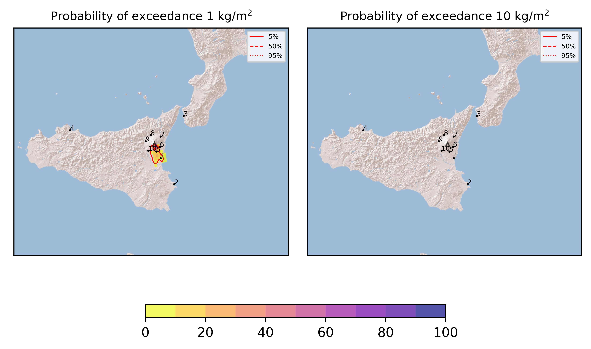
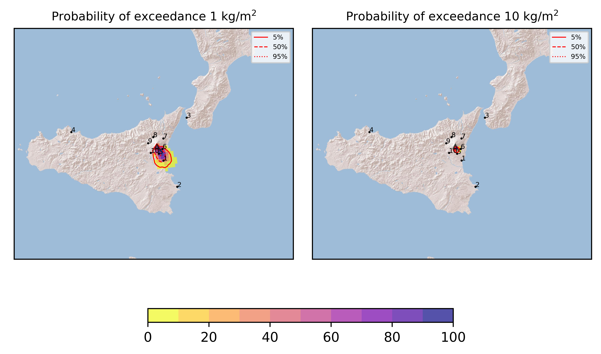
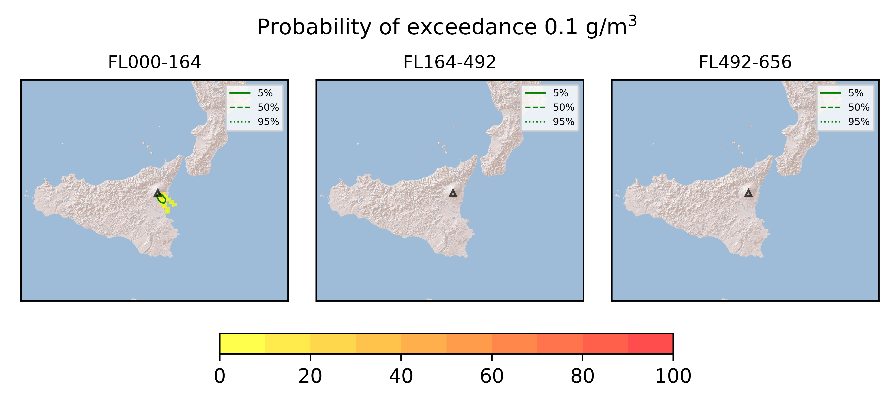

Forecast from VONA bulletin - 20210324_0345Z
============================================

Contents
========

* [Forecast products](#forecast-products)
	* [Forecast at 2021-03-24 06:50 Z](#forecast-at-2021-03-24-0650-z)
	* [Forecast at 2021-03-24 09:50 Z](#forecast-at-2021-03-24-0950-z)
	* [Forecast at 2021-03-24 12:50 Z](#forecast-at-2021-03-24-1250-z)
	* [Forecast at 2021-03-24 15:50 Z](#forecast-at-2021-03-24-1550-z)

# Forecast products

## Forecast at 2021-03-24 06:50 Z
  

|Eruption start [Z]|Eruption end [Z]|Forecast time [Z]|Column height asl [m]|
| :--- | :--- | :--- | :--- |
|2021-03-24 03:50:00|Ongoing|2021-03-24 06:50:00|6000 ± 500 - from VONA|
  
  

|Percentile|MER [kg/s¹]|Mass in the air [kg]|Mass on the ground [kg]|
| :--- | :--- | :--- | :--- |
|5th|1.07e+04|4.26e+06|1.05e+08|
|50th|3.54e+04|2.14e+07|3.36e+08|
|95th|6.70e+04|1.26e+08|6.38e+08|
  

### Ground 2021-03-24 06:50 Z
  
  
  
  
  
  
  
  
  
  
  

|Location|Ground load [kg/m²] 5th perc|Ground load [kg/m²] 50th perc|Ground load [kg/m²] 95th perc|
| :--- | :--- | :--- | :--- |
|Catania AP (1)|3.28e-03|1.67e-01|1.17e+00|
|Siracusa (2)|0.00e+00|0.00e+00|3.11e-02|
|Reggio Calabria AP (3)|0.00e+00|0.00e+00|0.00e+00|
|Palermo AP (4)|0.00e+00|0.00e+00|0.00e+00|
|Nicolosi (5)|9.83e-02|7.23e-01|1.80e+00|
|Zafferana (6)|0.00e+00|1.21e-03|6.63e-02|
|Linguaglossa (7)|0.00e+00|0.00e+00|0.00e+00|
|Randazzo (8)|0.00e+00|0.00e+00|0.00e+00|
|Bronte (9)|0.00e+00|0.00e+00|0.00e+00|
|Biancavilla (10)|0.00e+00|2.82e-04|5.52e-02|
  

### Atmosphere 2021-03-24 06:50 Z
  

## Forecast at 2021-03-24 09:50 Z
  

|Eruption start [Z]|Eruption end [Z]|Forecast time [Z]|Column height asl [m]|
| :--- | :--- | :--- | :--- |
|2021-03-24 03:50:00|Ongoing|2021-03-24 09:50:00|6000 ± 500 - from VONA|
  
  

|Percentile|MER [kg/s¹]|Mass in the air [kg]|Mass on the ground [kg]|
| :--- | :--- | :--- | :--- |
|5th|1.42e+04|7.27e+06|3.71e+08|
|50th|3.64e+04|2.63e+07|7.04e+08|
|95th|6.09e+04|1.10e+08|1.11e+09|
  

### Ground 2021-03-24 09:50 Z
  
  
  
  
  
  
  
  
  
  
  

|Location|Ground load [kg/m²] 5th perc|Ground load [kg/m²] 50th perc|Ground load [kg/m²] 95th perc|
| :--- | :--- | :--- | :--- |
|Catania AP (1)|7.54e-02|5.86e-01|1.76e+00|
|Siracusa (2)|0.00e+00|2.50e-06|4.46e-02|
|Reggio Calabria AP (3)|0.00e+00|0.00e+00|0.00e+00|
|Palermo AP (4)|0.00e+00|0.00e+00|0.00e+00|
|Nicolosi (5)|5.33e-01|1.43e+00|3.68e+00|
|Zafferana (6)|5.53e-04|1.67e-02|3.72e-01|
|Linguaglossa (7)|0.00e+00|0.00e+00|0.00e+00|
|Randazzo (8)|0.00e+00|0.00e+00|0.00e+00|
|Bronte (9)|0.00e+00|0.00e+00|0.00e+00|
|Biancavilla (10)|1.07e-05|7.81e-04|5.60e-02|
  

### Atmosphere 2021-03-24 09:50 Z
  

## Forecast at 2021-03-24 12:50 Z
  

|Eruption start [Z]|Eruption end [Z]|Forecast time [Z]|Column height asl [m]|
| :--- | :--- | :--- | :--- |
|2021-03-24 03:50:00|Ongoing|2021-03-24 12:50:00|6000 ± 500 - from VONA|
  
  

|Percentile|MER [kg/s¹]|Mass in the air [kg]|Mass on the ground [kg]|
| :--- | :--- | :--- | :--- |
|5th|6.38e+03|5.63e+06|6.07e+08|
|50th|4.11e+04|2.76e+07|1.12e+09|
|95th|9.82e+04|1.39e+08|1.74e+09|
  

### Ground 2021-03-24 12:50 Z
  
  
  
  
  
  
  
  
  
  
  

|Location|Ground load [kg/m²] 5th perc|Ground load [kg/m²] 50th perc|Ground load [kg/m²] 95th perc|
| :--- | :--- | :--- | :--- |
|Catania AP (1)|1.13e-01|9.09e-01|2.19e+00|
|Siracusa (2)|0.00e+00|4.38e-05|5.25e-02|
|Reggio Calabria AP (3)|0.00e+00|0.00e+00|0.00e+00|
|Palermo AP (4)|0.00e+00|0.00e+00|0.00e+00|
|Nicolosi (5)|8.08e-01|2.35e+00|4.70e+00|
|Zafferana (6)|7.88e-03|1.49e-01|1.00e+00|
|Linguaglossa (7)|0.00e+00|0.00e+00|0.00e+00|
|Randazzo (8)|0.00e+00|0.00e+00|0.00e+00|
|Bronte (9)|0.00e+00|0.00e+00|3.30e-06|
|Biancavilla (10)|4.25e-05|4.44e-03|5.71e-02|
  

### Atmosphere 2021-03-24 12:50 Z
  

## Forecast at 2021-03-24 15:50 Z
  

|Eruption start [Z]|Eruption end [Z]|Forecast time [Z]|Column height asl [m]|
| :--- | :--- | :--- | :--- |
|2021-03-24 03:50:00|Ongoing|2021-03-24 15:50:00|6000 ± 500 - from VONA|
  
  

|Percentile|MER [kg/s¹]|Mass in the air [kg]|Mass on the ground [kg]|
| :--- | :--- | :--- | :--- |
|5th|1.48e+04|6.86e+06|9.30e+08|
|50th|5.18e+04|3.84e+07|1.69e+09|
|95th|1.26e+05|2.53e+08|2.48e+09|
  

### Ground 2021-03-24 15:50 Z
  
  
  
  
  
  
  
  
  
  
  

|Location|Ground load [kg/m²] 5th perc|Ground load [kg/m²] 50th perc|Ground load [kg/m²] 95th perc|
| :--- | :--- | :--- | :--- |
|Catania AP (1)|3.74e-01|1.16e+00|2.98e+00|
|Siracusa (2)|0.00e+00|2.58e-03|5.92e-02|
|Reggio Calabria AP (3)|0.00e+00|0.00e+00|0.00e+00|
|Palermo AP (4)|0.00e+00|0.00e+00|0.00e+00|
|Nicolosi (5)|1.49e+00|3.72e+00|6.84e+00|
|Zafferana (6)|2.89e-02|4.52e-01|2.65e+00|
|Linguaglossa (7)|0.00e+00|0.00e+00|7.44e-06|
|Randazzo (8)|0.00e+00|0.00e+00|0.00e+00|
|Bronte (9)|0.00e+00|0.00e+00|1.20e-05|
|Biancavilla (10)|6.23e-05|8.66e-03|6.83e-02|
  

### Atmosphere 2021-03-24 15:50 Z
  
  
Go to [Supplementary page](Supplementary_page.md)  
Go to [Main directory](https://github.com/federicapardini/Real_time_ash_forecast)