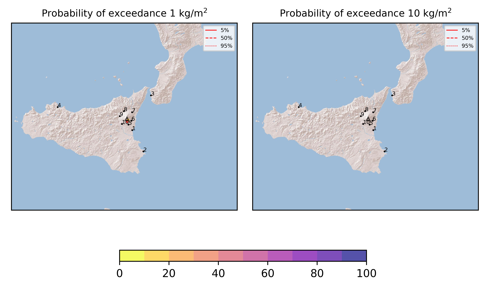

Forecast from VONA bulletin - 20210324_0721Z
============================================

Contents
========

* [Forecast products](#forecast-products)
	* [Forecast at 2021-03-24 10:20 Z](#forecast-at-2021-03-24-1020-z)
	* [Forecast at 2021-03-24 13:20 Z](#forecast-at-2021-03-24-1320-z)
	* [Forecast at 2021-03-24 16:20 Z](#forecast-at-2021-03-24-1620-z)

# Forecast products

## Forecast at 2021-03-24 10:20 Z
  

|Eruption start [Z]|Eruption end [Z]|Forecast time [Z]|Column height asl [m]|
| :--- | :--- | :--- | :--- |
|2021-03-24 07:20:00|Ongoing|2021-03-24 10:20:00|4500 ± 500 - from VONA|
  
  

|Percentile|MER [kg/s¹]|Mass in the air [kg]|Mass on the ground [kg]|
| :--- | :--- | :--- | :--- |
|5th|4.70e+01|4.72e+03|4.84e+05|
|50th|2.44e+03|7.23e+05|2.49e+07|
|95th|7.94e+03|9.91e+06|6.42e+07|
  

### Ground 2021-03-24 10:20 Z
  
  
  
  
  
  
  
  
  
  
  

|Location|Ground load [kg/m²] 5th perc|Ground load [kg/m²] 50th perc|Ground load [kg/m²] 95th perc|
| :--- | :--- | :--- | :--- |
|Catania AP (1)|5.73e-06|5.47e-03|7.89e-02|
|Siracusa (2)|0.00e+00|0.00e+00|1.92e-04|
|Reggio Calabria AP (3)|0.00e+00|0.00e+00|0.00e+00|
|Palermo AP (4)|0.00e+00|0.00e+00|0.00e+00|
|Nicolosi (5)|3.85e-04|3.54e-02|1.37e-01|
|Zafferana (6)|0.00e+00|6.58e-04|1.62e-02|
|Linguaglossa (7)|0.00e+00|0.00e+00|0.00e+00|
|Randazzo (8)|0.00e+00|0.00e+00|0.00e+00|
|Bronte (9)|0.00e+00|0.00e+00|0.00e+00|
|Biancavilla (10)|0.00e+00|0.00e+00|9.42e-04|
  

### Atmosphere 2021-03-24 10:20 Z
  

## Forecast at 2021-03-24 13:20 Z
  

|Eruption start [Z]|Eruption end [Z]|Forecast time [Z]|Column height asl [m]|
| :--- | :--- | :--- | :--- |
|2021-03-24 07:20:00|Ongoing|2021-03-24 13:20:00|4500 ± 500 - from VONA|
  
  

|Percentile|MER [kg/s¹]|Mass in the air [kg]|Mass on the ground [kg]|
| :--- | :--- | :--- | :--- |
|5th|2.21e+02|3.28e+05|1.53e+07|
|50th|3.26e+03|1.99e+06|6.35e+07|
|95th|9.56e+03|1.04e+07|1.28e+08|
  

### Ground 2021-03-24 13:20 Z
  
  
  
  
  
  
  
  
  
  
  

|Location|Ground load [kg/m²] 5th perc|Ground load [kg/m²] 50th perc|Ground load [kg/m²] 95th perc|
| :--- | :--- | :--- | :--- |
|Catania AP (1)|3.75e-03|2.15e-02|1.12e-01|
|Siracusa (2)|0.00e+00|0.00e+00|4.76e-04|
|Reggio Calabria AP (3)|0.00e+00|0.00e+00|0.00e+00|
|Palermo AP (4)|0.00e+00|0.00e+00|0.00e+00|
|Nicolosi (5)|2.50e-02|9.42e-02|2.83e-01|
|Zafferana (6)|2.56e-04|8.76e-03|5.57e-02|
|Linguaglossa (7)|0.00e+00|0.00e+00|0.00e+00|
|Randazzo (8)|0.00e+00|0.00e+00|0.00e+00|
|Bronte (9)|0.00e+00|0.00e+00|0.00e+00|
|Biancavilla (10)|0.00e+00|8.63e-05|2.01e-03|
  

### Atmosphere 2021-03-24 13:20 Z
  

## Forecast at 2021-03-24 16:20 Z
  

|Eruption start [Z]|Eruption end [Z]|Forecast time [Z]|Column height asl [m]|
| :--- | :--- | :--- | :--- |
|2021-03-24 07:20:00|Ongoing|2021-03-24 16:20:00|4500 ± 500 - from VONA|
  
  

|Percentile|MER [kg/s¹]|Mass in the air [kg]|Mass on the ground [kg]|
| :--- | :--- | :--- | :--- |
|5th|4.44e+01|3.08e+04|2.40e+07|
|50th|4.21e+03|1.93e+06|1.17e+08|
|95th|1.94e+04|1.96e+07|1.93e+08|
  

### Ground 2021-03-24 16:20 Z
  
  
  
  
  
  
  
  
  
  
  

|Location|Ground load [kg/m²] 5th perc|Ground load [kg/m²] 50th perc|Ground load [kg/m²] 95th perc|
| :--- | :--- | :--- | :--- |
|Catania AP (1)|7.41e-03|2.89e-02|1.81e-01|
|Siracusa (2)|0.00e+00|2.33e-06|8.33e-04|
|Reggio Calabria AP (3)|0.00e+00|0.00e+00|0.00e+00|
|Palermo AP (4)|0.00e+00|0.00e+00|0.00e+00|
|Nicolosi (5)|5.05e-02|1.90e-01|4.64e-01|
|Zafferana (6)|5.07e-03|3.80e-02|1.98e-01|
|Linguaglossa (7)|0.00e+00|0.00e+00|0.00e+00|
|Randazzo (8)|0.00e+00|0.00e+00|0.00e+00|
|Bronte (9)|0.00e+00|0.00e+00|0.00e+00|
|Biancavilla (10)|0.00e+00|2.82e-04|2.65e-03|
  

### Atmosphere 2021-03-24 16:20 Z
  
  
Go to [Supplementary page](Supplementary_page.md)  
Go to [Main directory](https://github.com/federicapardini/Real_time_ash_forecast)