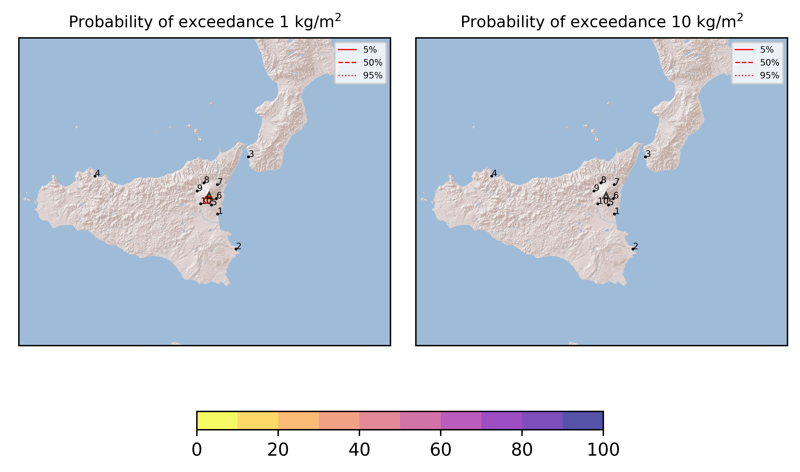

Forecast from VONA bulletin - 20210331_1911Z
============================================

Contents
========

* [Forecast products](#forecast-products)
	* [Forecast at 2021-03-31 22:10 Z](#forecast-at-2021-03-31-2210-z)
	* [Forecast at 2021-04-01 01:10 Z](#forecast-at-2021-04-01-0110-z)
	* [Forecast at 2021-04-01 04:10 Z](#forecast-at-2021-04-01-0410-z)

# Forecast products

## Forecast at 2021-03-31 22:10 Z
  

|Eruption start [Z]|Eruption end [Z]|Forecast time [Z]|Column height asl [m]|
| :--- | :--- | :--- | :--- |
|2021-03-31 19:10:00|Ongoing|2021-03-31 22:10:00|4000 ± 500 - from VONA|
  
  

|Percentile|MER [kg/s¹]|Mass in the air [kg]|Mass on the ground [kg]|
| :--- | :--- | :--- | :--- |
|5th|4.48e+01|2.89e+04|3.98e+05|
|50th|1.02e+03|1.71e+05|1.15e+07|
|95th|8.21e+03|5.11e+06|7.47e+07|
  

### Ground 2021-03-31 22:10 Z
  
  
  
  
  
  
  
  
  
  
  

|Location|Ground load [kg/m²] 5th perc|Ground load [kg/m²] 50th perc|Ground load [kg/m²] 95th perc|
| :--- | :--- | :--- | :--- |
|Catania AP (1)|0.00e+00|0.00e+00|1.99e-03|
|Siracusa (2)|0.00e+00|0.00e+00|0.00e+00|
|Reggio Calabria AP (3)|0.00e+00|0.00e+00|0.00e+00|
|Palermo AP (4)|0.00e+00|0.00e+00|0.00e+00|
|Nicolosi (5)|0.00e+00|3.04e-03|5.60e-02|
|Zafferana (6)|0.00e+00|0.00e+00|1.26e-04|
|Linguaglossa (7)|0.00e+00|0.00e+00|0.00e+00|
|Randazzo (8)|0.00e+00|0.00e+00|0.00e+00|
|Bronte (9)|0.00e+00|0.00e+00|0.00e+00|
|Biancavilla (10)|3.77e-05|3.30e-03|8.98e-02|
  

### Atmosphere 2021-03-31 22:10 Z
  

## Forecast at 2021-04-01 01:10 Z
  

|Eruption start [Z]|Eruption end [Z]|Forecast time [Z]|Column height asl [m]|
| :--- | :--- | :--- | :--- |
|2021-03-31 19:10:00|Ongoing|2021-04-01 01:10:00|4000 ± 500 - from VONA|
  
  

|Percentile|MER [kg/s¹]|Mass in the air [kg]|Mass on the ground [kg]|
| :--- | :--- | :--- | :--- |
|5th|4.48e+01|1.08e+04|9.08e+05|
|50th|1.04e+03|4.04e+05|3.12e+07|
|95th|5.66e+03|3.08e+06|9.16e+07|
  

### Ground 2021-04-01 01:10 Z
  
  
  
  
  
  
  
  
  
  
  

|Location|Ground load [kg/m²] 5th perc|Ground load [kg/m²] 50th perc|Ground load [kg/m²] 95th perc|
| :--- | :--- | :--- | :--- |
|Catania AP (1)|0.00e+00|1.40e-05|6.46e-03|
|Siracusa (2)|0.00e+00|0.00e+00|0.00e+00|
|Reggio Calabria AP (3)|0.00e+00|0.00e+00|0.00e+00|
|Palermo AP (4)|0.00e+00|0.00e+00|0.00e+00|
|Nicolosi (5)|1.14e-04|1.26e-02|1.09e-01|
|Zafferana (6)|0.00e+00|0.00e+00|3.02e-04|
|Linguaglossa (7)|0.00e+00|0.00e+00|0.00e+00|
|Randazzo (8)|0.00e+00|0.00e+00|0.00e+00|
|Bronte (9)|0.00e+00|0.00e+00|5.46e-05|
|Biancavilla (10)|1.83e-04|9.91e-03|1.20e-01|
  

### Atmosphere 2021-04-01 01:10 Z
  

## Forecast at 2021-04-01 04:10 Z
  

|Eruption start [Z]|Eruption end [Z]|Forecast time [Z]|Column height asl [m]|
| :--- | :--- | :--- | :--- |
|2021-03-31 19:10:00|Ongoing|2021-04-01 04:10:00|4000 ± 500 - from VONA|
  
  

|Percentile|MER [kg/s¹]|Mass in the air [kg]|Mass on the ground [kg]|
| :--- | :--- | :--- | :--- |
|5th|4.47e+01|3.16e+03|6.21e+06|
|50th|8.65e+02|1.67e+05|4.85e+07|
|95th|5.47e+03|2.46e+06|1.09e+08|
  

### Ground 2021-04-01 04:10 Z
  
  
  
  
  
  
  
  
  
  
  

|Location|Ground load [kg/m²] 5th perc|Ground load [kg/m²] 50th perc|Ground load [kg/m²] 95th perc|
| :--- | :--- | :--- | :--- |
|Catania AP (1)|0.00e+00|3.31e-05|1.60e-02|
|Siracusa (2)|0.00e+00|0.00e+00|0.00e+00|
|Reggio Calabria AP (3)|0.00e+00|0.00e+00|0.00e+00|
|Palermo AP (4)|0.00e+00|0.00e+00|0.00e+00|
|Nicolosi (5)|2.93e-03|2.62e-02|1.28e-01|
|Zafferana (6)|0.00e+00|0.00e+00|3.55e-04|
|Linguaglossa (7)|0.00e+00|0.00e+00|0.00e+00|
|Randazzo (8)|0.00e+00|0.00e+00|0.00e+00|
|Bronte (9)|0.00e+00|0.00e+00|8.52e-05|
|Biancavilla (10)|1.53e-03|2.72e-02|1.34e-01|
  

### Atmosphere 2021-04-01 04:10 Z
  
  
Go to [Supplementary page](Supplementary_page.md)  
Go to [Main directory](https://github.com/federicapardini/Real_time_ash_forecast)