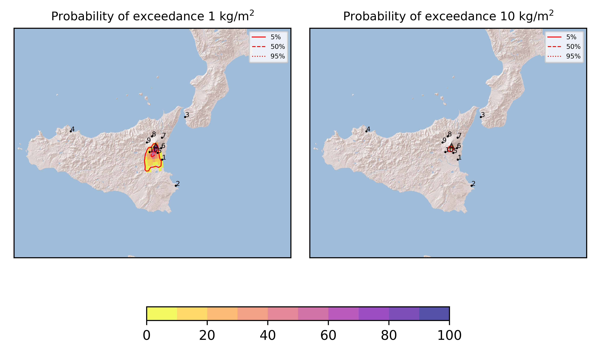
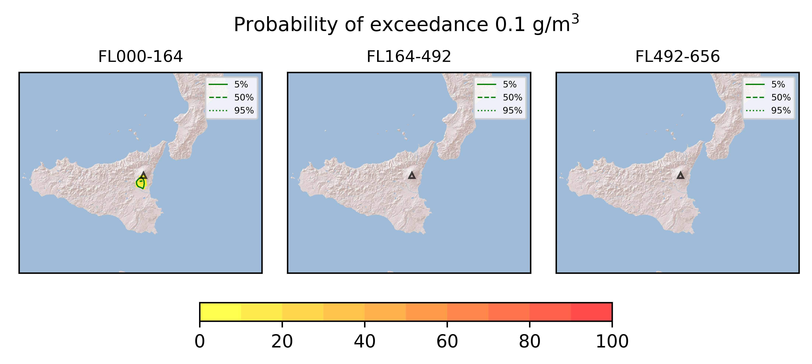

Forecast from VONA bulletin - 20210401_0103Z
============================================

Contents
========

* [Forecast products](#forecast-products)
	* [Forecast at 2021-04-01 04:00 Z](#forecast-at-2021-04-01-0400-z)

# Forecast products

## Forecast at 2021-04-01 04:00 Z
  

|Eruption start [Z]|Eruption end [Z]|Forecast time [Z]|Column height asl [m]|
| :--- | :--- | :--- | :--- |
|2021-04-01 01:00:00|Ongoing|2021-04-01 04:00:00|7000 ± 500 - from VONA|
  
  

|Percentile|MER [kg/s¹]|Mass in the air [kg]|Mass on the ground [kg]|
| :--- | :--- | :--- | :--- |
|5th|4.16e+04|1.43e+07|3.78e+08|
|50th|9.28e+04|5.63e+07|8.60e+08|
|95th|1.96e+05|3.25e+08|1.70e+09|
  

### Ground 2021-04-01 04:00 Z
  
  
  
  
  
  
  
  
  
  
  

|Location|Ground load [kg/m²] 5th perc|Ground load [kg/m²] 50th perc|Ground load [kg/m²] 95th perc|
| :--- | :--- | :--- | :--- |
|Catania AP (1)|0.00e+00|3.98e-04|3.30e-01|
|Siracusa (2)|0.00e+00|0.00e+00|0.00e+00|
|Reggio Calabria AP (3)|0.00e+00|0.00e+00|0.00e+00|
|Palermo AP (4)|0.00e+00|0.00e+00|0.00e+00|
|Nicolosi (5)|8.71e-04|1.97e-01|2.47e+00|
|Zafferana (6)|0.00e+00|0.00e+00|2.88e-03|
|Linguaglossa (7)|0.00e+00|0.00e+00|0.00e+00|
|Randazzo (8)|0.00e+00|0.00e+00|0.00e+00|
|Bronte (9)|0.00e+00|0.00e+00|1.15e-03|
|Biancavilla (10)|1.89e-03|2.30e-01|2.82e+00|
  

### Atmosphere 2021-04-01 04:00 Z
  
  
Go to [Supplementary page](Supplementary_page.md)  
Go to [Main directory](https://github.com/federicapardini/Real_time_ash_forecast)