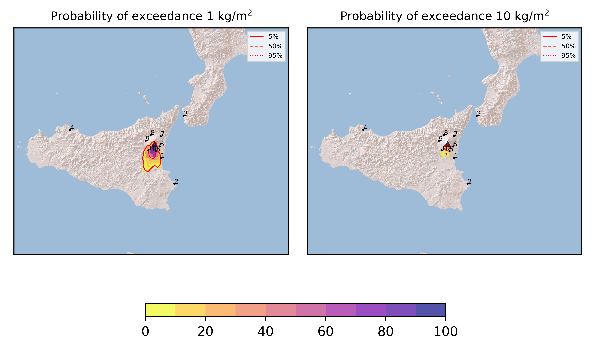

Forecast from VONA bulletin - 20210401_0103Z
============================================

Contents
========

* [Forecast products](#forecast-products)
	* [Forecast at 2021-04-01 04:00 Z](#forecast-at-2021-04-01-0400-z)
	* [Forecast at 2021-04-01 07:00 Z](#forecast-at-2021-04-01-0700-z)
	* [Forecast at 2021-04-01 10:00 Z](#forecast-at-2021-04-01-1000-z)
	* [Forecast at 2021-04-01 13:00 Z](#forecast-at-2021-04-01-1300-z)

# Forecast products

## Forecast at 2021-04-01 04:00 Z
  

|Eruption start [Z]|Eruption end [Z]|Forecast time [Z]|Column height asl [m]|
| :--- | :--- | :--- | :--- |
|2021-04-01 01:00:00|Ongoing|2021-04-01 04:00:00|7000 ± 500 - from VONA|
  
  

|Percentile|MER [kg/s¹]|Mass in the air [kg]|Mass on the ground [kg]|
| :--- | :--- | :--- | :--- |
|5th|4.16e+04|1.43e+07|3.78e+08|
|50th|9.28e+04|5.63e+07|8.60e+08|
|95th|1.96e+05|3.25e+08|1.70e+09|
  

### Ground 2021-04-01 04:00 Z
  
  
  
  
  
  
  
  
  
  
  

|Location|Ground load [kg/m²] 5th perc|Ground load [kg/m²] 50th perc|Ground load [kg/m²] 95th perc|
| :--- | :--- | :--- | :--- |
|Catania AP (1)|0.00e+00|3.98e-04|3.30e-01|
|Siracusa (2)|0.00e+00|0.00e+00|0.00e+00|
|Reggio Calabria AP (3)|0.00e+00|0.00e+00|0.00e+00|
|Palermo AP (4)|0.00e+00|0.00e+00|0.00e+00|
|Nicolosi (5)|8.71e-04|1.97e-01|2.47e+00|
|Zafferana (6)|0.00e+00|0.00e+00|2.88e-03|
|Linguaglossa (7)|0.00e+00|0.00e+00|0.00e+00|
|Randazzo (8)|0.00e+00|0.00e+00|0.00e+00|
|Bronte (9)|0.00e+00|0.00e+00|1.15e-03|
|Biancavilla (10)|1.89e-03|2.30e-01|2.82e+00|
  

### Atmosphere 2021-04-01 04:00 Z
  

## Forecast at 2021-04-01 07:00 Z
  

|Eruption start [Z]|Eruption end [Z]|Forecast time [Z]|Column height asl [m]|
| :--- | :--- | :--- | :--- |
|2021-04-01 01:00:00|Ongoing|2021-04-01 07:00:00|7000 ± 500 - from VONA|
  
  

|Percentile|MER [kg/s¹]|Mass in the air [kg]|Mass on the ground [kg]|
| :--- | :--- | :--- | :--- |
|5th|3.20e+04|2.31e+07|1.02e+09|
|50th|6.96e+04|5.70e+07|1.66e+09|
|95th|1.41e+05|1.97e+08|2.85e+09|
  

### Ground 2021-04-01 07:00 Z
  
  
  
  
  
  
  
  
  
  
  

|Location|Ground load [kg/m²] 5th perc|Ground load [kg/m²] 50th perc|Ground load [kg/m²] 95th perc|
| :--- | :--- | :--- | :--- |
|Catania AP (1)|0.00e+00|4.77e-03|6.00e-01|
|Siracusa (2)|0.00e+00|0.00e+00|6.53e-06|
|Reggio Calabria AP (3)|0.00e+00|0.00e+00|0.00e+00|
|Palermo AP (4)|0.00e+00|0.00e+00|0.00e+00|
|Nicolosi (5)|1.28e-02|1.24e+00|4.22e+00|
|Zafferana (6)|0.00e+00|1.91e-04|7.54e-03|
|Linguaglossa (7)|0.00e+00|0.00e+00|0.00e+00|
|Randazzo (8)|0.00e+00|0.00e+00|0.00e+00|
|Bronte (9)|0.00e+00|0.00e+00|1.35e-03|
|Biancavilla (10)|8.76e-02|3.25e-01|4.88e+00|
  

### Atmosphere 2021-04-01 07:00 Z
  

## Forecast at 2021-04-01 10:00 Z
  

|Eruption start [Z]|Eruption end [Z]|Forecast time [Z]|Column height asl [m]|
| :--- | :--- | :--- | :--- |
|2021-04-01 01:00:00|Ongoing|2021-04-01 10:00:00|7000 ± 500 - from VONA|
  
  

|Percentile|MER [kg/s¹]|Mass in the air [kg]|Mass on the ground [kg]|
| :--- | :--- | :--- | :--- |
|5th|2.45e+04|9.80e+06|1.52e+09|
|50th|5.34e+04|3.92e+07|2.24e+09|
|95th|1.09e+05|1.85e+08|3.38e+09|
  

### Ground 2021-04-01 10:00 Z
  
  
  
  
  
  
  
  
  
  
  

|Location|Ground load [kg/m²] 5th perc|Ground load [kg/m²] 50th perc|Ground load [kg/m²] 95th perc|
| :--- | :--- | :--- | :--- |
|Catania AP (1)|5.53e-03|7.92e-02|1.32e+00|
|Siracusa (2)|0.00e+00|0.00e+00|8.87e-04|
|Reggio Calabria AP (3)|0.00e+00|0.00e+00|0.00e+00|
|Palermo AP (4)|0.00e+00|0.00e+00|0.00e+00|
|Nicolosi (5)|4.75e-01|2.38e+00|5.68e+00|
|Zafferana (6)|5.51e-05|2.66e-03|3.62e-02|
|Linguaglossa (7)|0.00e+00|0.00e+00|0.00e+00|
|Randazzo (8)|0.00e+00|0.00e+00|0.00e+00|
|Bronte (9)|0.00e+00|0.00e+00|1.35e-03|
|Biancavilla (10)|1.68e-01|6.22e-01|5.01e+00|
  

### Atmosphere 2021-04-01 10:00 Z
  

## Forecast at 2021-04-01 13:00 Z
  

|Eruption start [Z]|Eruption end [Z]|Forecast time [Z]|Column height asl [m]|
| :--- | :--- | :--- | :--- |
|2021-04-01 01:00:00|Ongoing|2021-04-01 13:00:00|7000 ± 500 - from VONA|
  
  

|Percentile|MER [kg/s¹]|Mass in the air [kg]|Mass on the ground [kg]|
| :--- | :--- | :--- | :--- |
|5th|2.06e+04|5.57e+06|1.93e+09|
|50th|4.47e+04|3.61e+07|2.72e+09|
|95th|7.75e+04|2.32e+08|3.79e+09|
  

### Ground 2021-04-01 13:00 Z
  
  
  
  
  
  
  
  
  
  
  

|Location|Ground load [kg/m²] 5th perc|Ground load [kg/m²] 50th perc|Ground load [kg/m²] 95th perc|
| :--- | :--- | :--- | :--- |
|Catania AP (1)|5.56e-02|3.70e-01|1.75e+00|
|Siracusa (2)|0.00e+00|2.33e-05|5.92e-03|
|Reggio Calabria AP (3)|0.00e+00|0.00e+00|0.00e+00|
|Palermo AP (4)|0.00e+00|0.00e+00|0.00e+00|
|Nicolosi (5)|1.13e+00|4.14e+00|6.53e+00|
|Zafferana (6)|6.66e-03|9.53e-02|5.96e-01|
|Linguaglossa (7)|0.00e+00|0.00e+00|2.23e-05|
|Randazzo (8)|0.00e+00|0.00e+00|9.33e-06|
|Bronte (9)|0.00e+00|6.00e-06|1.37e-03|
|Biancavilla (10)|1.70e-01|6.42e-01|5.02e+00|
  

### Atmosphere 2021-04-01 13:00 Z
  
  
Go to [Supplementary page](Supplementary_page.md)  
Go to [Main directory](https://github.com/federicapardini/Real_time_ash_forecast)